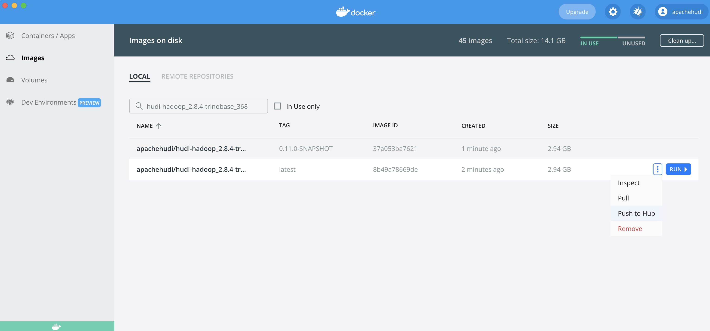

<!--
* Licensed to the Apache Software Foundation (ASF) under one
* or more contributor license agreements.  See the NOTICE file
* distributed with this work for additional information
* regarding copyright ownership.  The ASF licenses this file
* to you under the Apache License, Version 2.0 (the
* "License"); you may not use this file except in compliance
* with the License.  You may obtain a copy of the License at
*
*      http://www.apache.org/licenses/LICENSE-2.0
*
* Unless required by applicable law or agreed to in writing, software
* distributed under the License is distributed on an "AS IS" BASIS,
* WITHOUT WARRANTIES OR CONDITIONS OF ANY KIND, either express or implied.
* See the License for the specific language governing permissions and
-->

# Docker Demo for Hudi

This repo contains the docker demo resources for building docker demo images, set up the demo, and running Hudi in the
docker demo environment.

## Repo Organization

### Configs for assembling docker images - `/hoodie`

The `/hoodie` folder contains all the configs for assembling necessary docker images. The name and repository of each
docker image, e.g., `apachehudi/hudi-hadoop_2.8.4-trinobase_368`, is defined in the maven configuration file `pom.xml`.

### Docker compose config for the Demo - `/compose`

The `/compose` folder contains the yaml file to compose the Docker environment for running Hudi Demo.

### Resources and Sample Data for the Demo - `/demo`

The `/demo` folder contains useful resources and sample data use for the Demo.

## Build and Test Image locally

To build all docker images locally, you can run the script:

```shell
./build_local_docker_images.sh
```

To build a single image target, you can run

```shell
mvn clean pre-integration-test -DskipTests -Ddocker.compose.skip=true -Ddocker.build.skip=false -pl :<image_target> -am
# For example, to build hudi-hadoop-trinobase-docker
mvn clean pre-integration-test -DskipTests -Ddocker.compose.skip=true -Ddocker.build.skip=false -pl :hudi-hadoop-trinobase-docker -am
```

Alternatively, you can use `docker` cli directly under `hoodie/hadoop`. Note that, you need to manually name your local
image by using `-t` option to match the naming in the `pom.xml`, so that you can update the corresponding image
repository in Docker Hub (detailed steps in the next section).

```shell
# Run under hoodie/hadoop, the <tag> is optional, "latest" by default
docker build <image_folder_name> -t <hub-user>/<repo-name>[:<tag>]
# For example, to build trinobase
docker build trinobase -t apachehudi/hudi-hadoop_2.8.4-trinobase_368
```

After new images are built, you can run the following script to bring up docker demo with your local images:

```shell
./setup_demo.sh dev
```

## Upload Updated Image to Repository on Docker Hub

Once you have built the updated image locally, you can push the corresponding this repository of the image to the Docker
Hud registry designated by its name or tag:

```shell
docker push <hub-user>/<repo-name>:<tag>
# For example
docker push apachehudi/hudi-hadoop_2.8.4-trinobase_368
```

You can also easily push the image to the Docker Hub using Docker Desktop app: go to `Images`, search for the image by
the name, and then click on the three dots and `Push to Hub`.



Note that you need to ask for permission to upload the Hudi Docker Demo images to the repositories.

You can find more information on [Docker Hub Repositories Manual](https://docs.docker.com/docker-hub/repos/).

## Docker Demo Setup

Please refer to the [Docker Demo Docs page](https://hudi.apache.org/docs/docker_demo).