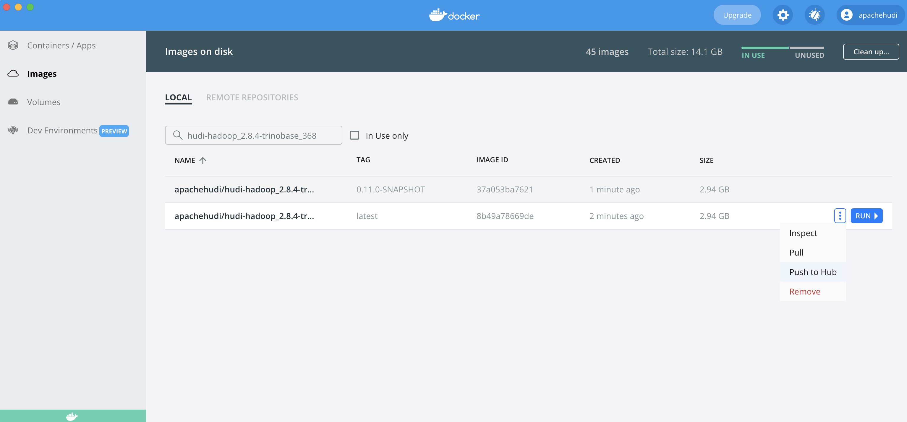

<!--
* Licensed to the Apache Software Foundation (ASF) under one
* or more contributor license agreements.  See the NOTICE file
* distributed with this work for additional information
* regarding copyright ownership.  The ASF licenses this file
* to you under the Apache License, Version 2.0 (the
* "License"); you may not use this file except in compliance
* with the License.  You may obtain a copy of the License at
*
*      http://www.apache.org/licenses/LICENSE-2.0
*
* Unless required by applicable law or agreed to in writing, software
* distributed under the License is distributed on an "AS IS" BASIS,
* WITHOUT WARRANTIES OR CONDITIONS OF ANY KIND, either express or implied.
* See the License for the specific language governing permissions and
-->

# Docker Demo for Hudi

This repo contains the docker demo resources for building docker demo images, set up the demo, and running Hudi in the
docker demo environment.

## Repo Organization

### Configs for assembling docker images - `/hoodie`

The `/hoodie` folder contains all the configs for assembling necessary docker images. The name and repository of each
docker image, e.g., `apachehudi/hudi-hadoop_2.8.4-trinobase_368`, is defined in the maven configuration file `pom.xml`.

### Docker compose config for the Demo - `/compose`

The `/compose` folder contains the yaml file to compose the Docker environment for running Hudi Demo.

### Resources and Sample Data for the Demo - `/demo`

The `/demo` folder contains useful resources and sample data use for the Demo.

## Build and Test Image locally

To build all docker images locally, you can run the script:

```shell
./build_local_docker_images.sh
```

To build a single image target, you can run

```shell
mvn clean pre-integration-test -DskipTests -Ddocker.compose.skip=true -Ddocker.build.skip=false -pl :<image_target> -am
# For example, to build hudi-hadoop-trinobase-docker
mvn clean pre-integration-test -DskipTests -Ddocker.compose.skip=true -Ddocker.build.skip=false -pl :hudi-hadoop-trinobase-docker -am
```

Alternatively, you can use `docker` cli directly under `hoodie/hadoop` to build images in a faster way. If you use this
approach, make sure you first build Hudi modules with `integration-tests` profile as below so that the latest Hudi jars
built are copied to the corresponding Hudi docker folder, e.g., `$HUDI_DIR/docker/hoodie/hadoop/hive_base/target`, which
is required to build each docker image. Otherwise, the `target/` folder can be missing and `docker` cli complains about
that: `failed to compute cache key: "/target" not found: not found`.

```shell
mvn -Pintegration-tests clean package -DskipTests
```

Note that, to build the image with `docker` cli, you need to manually name your local image by using `-t` option to
match the naming in the `pom.xml`, so that you can update the corresponding image repository in Docker Hub (detailed
steps in the next section).

```shell
# Run under hoodie/hadoop, the <tag> is optional, "latest" by default
docker build <image_folder_name> -t <hub-user>/<repo-name>[:<tag>]
# For example, to build trinobase
docker build trinobase -t apachehudi/hudi-hadoop_2.8.4-trinobase_368
```

After new images are built, you can run the following script to bring up docker demo with your local images:

```shell
./setup_demo.sh dev
```

## Upload Updated Image to Repository on Docker Hub

Once you have built the updated image locally, you can push the corresponding this repository of the image to the Docker
Hud registry designated by its name or tag:

```shell
docker push <hub-user>/<repo-name>:<tag>
# For example
docker push apachehudi/hudi-hadoop_2.8.4-trinobase_368
```

You can also easily push the image to the Docker Hub using Docker Desktop app: go to `Images`, search for the image by
the name, and then click on the three dots and `Push to Hub`.



Note that you need to ask for permission to upload the Hudi Docker Demo images to the repositories.

You can find more information on [Docker Hub Repositories Manual](https://docs.docker.com/docker-hub/repos/).

## Docker Demo Setup

Please refer to the [Docker Demo Docs page](https://hudi.apache.org/docs/docker_demo).

## Building Multi-Arch Images

NOTE: The steps below require some code changes. Support for multi-arch builds in a fully automated manner is being
tracked by [HUDI-3601](https://issues.apache.org/jira/browse/HUDI-3601).

By default, the docker images are built for x86_64 (amd64) architecture. Docker `buildx` allows you to build multi-arch
images, link them together with a manifest file, and push them all to a registry – with a single command. Let's say we
want to build for arm64 architecture. First we need to ensure that `buildx` setup is done locally. Please follow the
below steps (referred from https://www.docker.com/blog/multi-arch-images):

```
# List builders 
~ ❯❯❯ docker buildx ls
NAME/NODE DRIVER/ENDPOINT STATUS  PLATFORMS
default * docker
  default default         running linux/amd64, linux/arm64, linux/arm/v7, linux/arm/v6
  
# If you are using the default builder, which is basically the old builder, then do following
~ ❯❯❯ docker buildx create --name mybuilder
mybuilder
~ ❯❯❯ docker buildx use mybuilder
~ ❯❯❯ docker buildx inspect --bootstrap
[+] Building 2.5s (1/1) FINISHED
 => [internal] booting buildkit                                                   2.5s
 => => pulling image moby/buildkit:master                                         1.3s
 => => creating container buildx_buildkit_mybuilder0                              1.2s
Name:   mybuilder
Driver: docker-container

Nodes:
Name:      mybuilder0
Endpoint:  unix:///var/run/docker.sock
Status:    running

Platforms: linux/amd64, linux/arm64, linux/arm/v7, linux/arm/v6
```

Now goto `<HUDI_REPO_DIR>/docker/hoodie/hadoop` and change the `Dockerfile` to pull dependent images corresponding to
arm64. For example, in [base/Dockerfile](./hoodie/hadoop/base/Dockerfile) (which pulls jdk11 image), change the
line `FROM openjdk:11-jdk-slim-bullseye` to `FROM arm64v8/openjdk:11-jdk-slim-bullseye`.

Then, from under `<HUDI_REPO_DIR>/docker/hoodie/hadoop` directory, execute the following command to build as well as
push the image to the dockerhub repo:

```
# Run under hoodie/hadoop, the <tag> is optional, "latest" by default
docker buildx build <image_folder_name> --platform <comma-separated,platforms> -t <hub-user>/<repo-name>[:<tag>] --push

# For example, to build base image
docker buildx build base --platform linux/arm64 -t apachehudi/hudi-hadoop_2.8.4-base:linux-arm64-0.10.1 --push
```

Once the base image is pushed then you could do something similar for other images.
Change [hive](./hoodie/hadoop/hive_base/Dockerfile) dockerfile to pull the base image with tag corresponding to
linux/arm64 platform.

```
# Change below line in the Dockerfile
FROM apachehudi/hudi-hadoop_${HADOOP_VERSION}-base:latest
# as shown below
FROM --platform=linux/arm64 apachehudi/hudi-hadoop_${HADOOP_VERSION}-base:linux-arm64-0.10.1

# and then build & push from under hoodie/hadoop dir
docker buildx build hive_base --platform linux/arm64 -t apachehudi/hudi-hadoop_2.8.4-hive_2.3.3:linux-arm64-0.10.1 --push
```

Similarly, for images that are dependent on hive (e.g. [base spark](./hoodie/hadoop/spark_base/Dockerfile)
, [sparkmaster](./hoodie/hadoop/sparkmaster/Dockerfile), [sparkworker](./hoodie/hadoop/sparkworker/Dockerfile)
and [sparkadhoc](./hoodie/hadoop/sparkadhoc/Dockerfile)), change the corresponding Dockerfile to pull the base hive
image with tag corresponding to arm64. Then build and push using `docker buildx` command.

For the sake of completeness, here is a [patch](https://gist.github.com/xushiyan/cec16585e884cf0693250631a1d10ec2) which
shows what changes to make in Dockerfiles (assuming tag is named `linux-arm64-0.10.1`), and below is the list
of `docker buildx` commands.

```
docker buildx build base --platform linux/arm64 -t apachehudi/hudi-hadoop_2.8.4-base:linux-arm64-0.10.1 --push
docker buildx build datanode --platform linux/arm64 -t apachehudi/hudi-hadoop_2.8.4-datanode:linux-arm64-0.10.1 --push
docker buildx build historyserver --platform linux/arm64 -t apachehudi/hudi-hadoop_2.8.4-history:linux-arm64-0.10.1 --push
docker buildx build hive_base --platform linux/arm64 -t apachehudi/hudi-hadoop_2.8.4-hive_2.3.3:linux-arm64-0.10.1 --push
docker buildx build namenode --platform linux/arm64 -t apachehudi/hudi-hadoop_2.8.4-namenode:linux-arm64-0.10.1 --push
docker buildx build prestobase --platform linux/arm64 -t apachehudi/hudi-hadoop_2.8.4-prestobase_0.217:linux-arm64-0.10.1 --push
docker buildx build spark_base --platform linux/arm64 -t apachehudi/hudi-hadoop_2.8.4-hive_2.3.3-sparkbase_2.4.4:linux-arm64-0.10.1 --push
docker buildx build sparkadhoc --platform linux/arm64 -t apachehudi/hudi-hadoop_2.8.4-hive_2.3.3-sparkadhoc_2.4.4:linux-arm64-0.10.1 --push
docker buildx build sparkmaster --platform linux/arm64 -t apachehudi/hudi-hadoop_2.8.4-hive_2.3.3-sparkmaster_2.4.4:linux-arm64-0.10.1 --push
docker buildx build sparkworker --platform linux/arm64 -t apachehudi/hudi-hadoop_2.8.4-hive_2.3.3-sparkworker_2.4.4:linux-arm64-0.10.1 --push
```

Once all the required images are pushed to the dockerhub repos, then we need to do one additional change
in [docker compose](./compose/docker-compose_hadoop284_hive233_spark244.yml) file.
Apply [this patch](https://gist.github.com/codope/3dd986de5e54f0650dd74b6032e4456c) to the docker compose file so
that [setup_demo](./setup_demo.sh) pulls images with the correct tag for arm64. And now we should be ready to run the
setup script and follow the docker demo.
