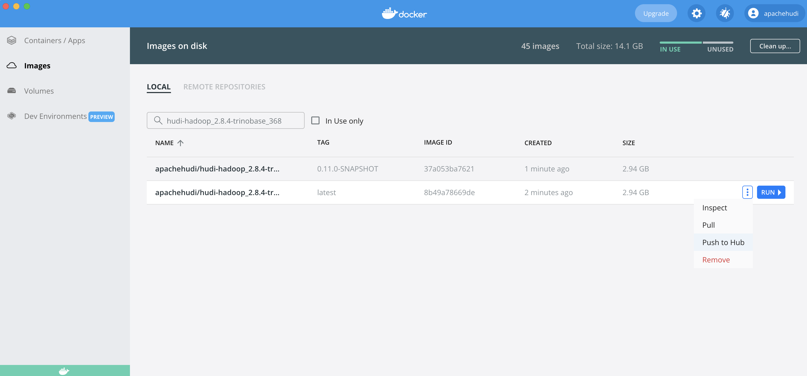

<!--
* Licensed to the Apache Software Foundation (ASF) under one
* or more contributor license agreements.  See the NOTICE file
* distributed with this work for additional information
* regarding copyright ownership.  The ASF licenses this file
* to you under the Apache License, Version 2.0 (the
* "License"); you may not use this file except in compliance
* with the License.  You may obtain a copy of the License at
*
*      http://www.apache.org/licenses/LICENSE-2.0
*
* Unless required by applicable law or agreed to in writing, software
* distributed under the License is distributed on an "AS IS" BASIS,
* WITHOUT WARRANTIES OR CONDITIONS OF ANY KIND, either express or implied.
* See the License for the specific language governing permissions and
-->

# Docker Demo for Hudi

This repo contains the docker demo resources for building docker demo images, set up the demo, and running Hudi in the
docker demo environment.

## Repo Organization

### Configs for assembling docker images - `/hoodie`

The `/hoodie` folder contains all the configs for assembling necessary docker images. The name and repository of each
docker image, e.g., `apachehudi/hudi-hadoop_2.8.4-trinobase_368`, is defined in the maven configuration file `pom.xml`.

### Docker compose config for the Demo - `/compose`

The `/compose` folder contains the yaml file to compose the Docker environment for running Hudi Demo.

### Resources and Sample Data for the Demo - `/demo`

The `/demo` folder contains useful resources and sample data use for the Demo.

## Build and Test Image locally

To build all docker images locally, you can run the script:

```shell
./build_local_docker_images.sh
```

To build the Docker demo images directly with the script, run it from under `<HUDI_REPO_DIR>/docker`:

```shell
./build_docker_images.sh
```

You can override the Hadoop, Spark, and Hive versions from the command line. If you plan to use `setup_demo.sh`,
build the image set matching the default compose files first. For other flows, use one of the supported version
combinations under `docker/compose`.

```shell
# Matches setup_demo.sh and
# docker-compose_hadoop334_hive313_spark353_{amd64,arm64}.yml
./build_docker_images.sh --hadoop-version 3.3.4 --spark-version 3.5.3 --hive-version 3.1.3

# Another supported combination is
# docker-compose_hadoop340_hive313_spark401_{amd64,arm64}.yml
./build_docker_images.sh --hadoop-version 3.4.0 --spark-version 4.0.1 --hive-version 3.1.3
```

`setup_demo.sh` currently defaults to `docker-compose_hadoop334_hive313_spark353_{amd64,arm64}.yml`. If you build a
different image set for the demo flow, update `COMPOSE_FILE_NAME` in `setup_demo.sh` to point to the matching compose
file before running the script.

By default, the script builds images for the current machine architecture and derives the version tag from the root
`pom.xml`. Use `--version-tag` to set an explicit tag if needed.

To build a single image target, you can run

```shell
mvn clean pre-integration-test -DskipTests -Ddocker.compose.skip=true -Ddocker.build.skip=false -pl :<image_target> -am
# For example, to build hudi-hadoop-trinobase-docker
mvn clean pre-integration-test -DskipTests -Ddocker.compose.skip=true -Ddocker.build.skip=false -pl :hudi-hadoop-trinobase-docker -am
```

Alternatively, you can use `docker` cli directly under `hoodie/hadoop` to build images in a faster way. If you use this
approach, make sure you first build Hudi modules with `integration-tests` profile as below so that the latest Hudi jars
built are copied to the corresponding Hudi docker folder, e.g., `$HUDI_DIR/docker/hoodie/hadoop/hive_base/target`, which
is required to build each docker image. Otherwise, the `target/` folder can be missing and `docker` cli complains about
that: `failed to compute cache key: "/target" not found: not found`.

```shell
mvn -Pintegration-tests clean package -DskipTests
```

Note that, to build the image with `docker` cli, you need to manually name your local image by using `-t` option to
match the naming in the `pom.xml`, so that you can update the corresponding image repository in Docker Hub (detailed
steps in the next section).

```shell
# Run under hoodie/hadoop, the <tag> is optional, "latest" by default
docker build <image_folder_name> -t <hub-user>/<repo-name>[:<tag>]
# For example, to build trinobase
docker build trinobase -t apachehudi/hudi-hadoop_2.8.4-trinobase_368
```

After new images are built, you can run the following script to bring up docker demo with your local images:

```shell
./setup_demo.sh dev
```

## Upload Updated Image to Repository on Docker Hub

Once you have built the updated image locally, you can push the corresponding this repository of the image to the Docker
Hud registry designated by its name or tag:

```shell
docker push <hub-user>/<repo-name>:<tag>
# For example
docker push apachehudi/hudi-hadoop_2.8.4-trinobase_368
```

You can also easily push the image to the Docker Hub using Docker Desktop app: go to `Images`, search for the image by
the name, and then click on the three dots and `Push to Hub`.



Note that you need to ask for permission to upload the Hudi Docker Demo images to the repositories.

You can find more information on [Docker Hub Repositories Manual](https://docs.docker.com/docker-hub/repos/).

## Docker Demo Setup

Please refer to the [Docker Demo Docs page](https://hudi.apache.org/docs/docker_demo).

## Building Multi-Arch Images

The `build_docker_images.sh` script supports multi-arch image builds through Docker `buildx`. First ensure a `buildx`
builder is set up locally:

```
# List builders 
~ ❯❯❯ docker buildx ls
NAME/NODE DRIVER/ENDPOINT STATUS  PLATFORMS
default * docker
  default default         running linux/amd64, linux/arm64, linux/arm/v7, linux/arm/v6
  
# If you are using the default builder, which is basically the old builder, then do following
~ ❯❯❯ docker buildx create --name mybuilder
mybuilder
~ ❯❯❯ docker buildx use mybuilder
~ ❯❯❯ docker buildx inspect --bootstrap
[+] Building 2.5s (1/1) FINISHED
 => [internal] booting buildkit                                                   2.5s
 => => pulling image moby/buildkit:master                                         1.3s
 => => creating container buildx_buildkit_mybuilder0                              1.2s
Name:   mybuilder
Driver: docker-container

Nodes:
Name:      mybuilder0
Endpoint:  unix:///var/run/docker.sock
Status:    running

Platforms: linux/amd64, linux/arm64, linux/arm/v7, linux/arm/v6
```

Then run the script from under `<HUDI_REPO_DIR>/docker`:

```shell
./build_docker_images.sh --multi-arch

# Example with explicit component versions
./build_docker_images.sh --hadoop-version 3.4.0 --spark-version 4.0.1 --hive-version 3.1.3 --multi-arch
```

When `--multi-arch` is enabled, the script builds and pushes the amd64 and arm64 variants in one pass. Use
`--version-tag <tag>` to override the image tag used for the push.

Note that `--multi-arch` uses `docker buildx build --push` and the image names in the script are hardcoded to the
`apachehudi/...` Docker Hub repositories, so this flow requires push access to those repositories. No Dockerfile
changes are needed for the current amd64 plus arm64 image set in this repository.
