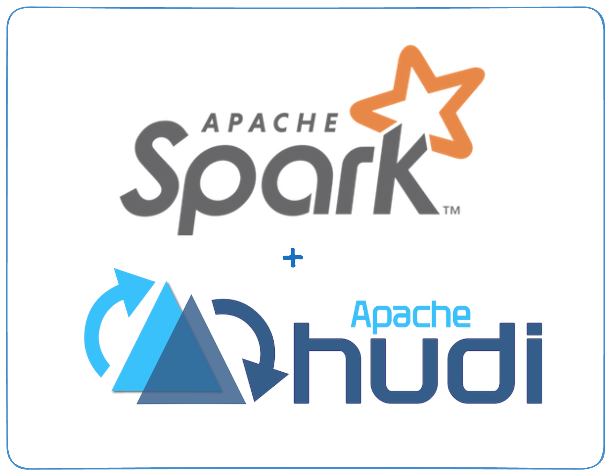

<!--
  Licensed to the Apache Software Foundation (ASF) under one or more
  contributor license agreements.  See the NOTICE file distributed with
  this work for additional information regarding copyright ownership.
  The ASF licenses this file to You under the Apache License, Version 2.0
  (the "License"); you may not use this file except in compliance with
  the License.  You may obtain a copy of the License at

       http://www.apache.org/licenses/LICENSE-2.0

  Unless required by applicable law or agreed to in writing, software
  distributed under the License is distributed on an "AS IS" BASIS,
  WITHOUT WARRANTIES OR CONDITIONS OF ANY KIND, either express or implied.
  See the License for the specific language governing permissions and
  limitations under the License.
-->

# 🚀 Spark + Hudi + MinIO + Hive Metastore Docker Demo

This project provides a ready-to-use Docker Compose environment for running Apache Spark with Hudi, Hive Metastore, and MinIO (S3-compatible storage) for data lake development and testing. JupyterLab is included for interactive development.



## 🛠️ Services

- **spark-hudi**: Spark with Hudi and JupyterLab
- **hive-metastore**: Hive Metastore (backed by Derby)
- **minio**: S3-compatible object storage

## 📂 Directory Structure

- `Dockerfile.spark` / `Dockerfile.hive`: Custom Dockerfiles for Spark and Hive
- `build.sh`: Build all Docker images
- `run_spark_hudi.sh`: Start/stop/restart the stack
- `conf/`: Configuration files for Spark, Hive, and Hudi
- `notebooks/`: Jupyter notebooks (mounted in Spark container)
- `data/`: Persistent data for MinIO, Spark event logs, etc.

## ⚡ Quick Start

### 1. Build Docker Images

```sh
./build.sh
```

### 2. Start the Environment

```sh
./run_spark_hudi.sh start
```

### 3. Stop the Environment

```sh
./run_spark_hudi.sh stop
```

### 4. Restart the Environment

```sh
./run_spark_hudi.sh restart
```

## 🌐 Accessing Services

- **JupyterLab** → [http://localhost:8888](http://localhost:8888)
- **Spark UI** → [http://localhost:4040](http://localhost:4040)
- **MinIO Console** → [http://localhost:9001](http://localhost:9001)
  - User: `admin` 
  - Password: `password`
- **Hive Metastore (Thrift)** → thrift://localhost:9083

## ⚙️ Configuration

- Spark, Hive, and Hudi configs are in `conf/` and automatically copied into containers.
- S3 access keys and endpoints are set for MinIO and referenced in Spark/Hive configs.

## 📒 Example: Using JupyterLab

1. Open [http://localhost:8888](http://localhost:8888) in your browser.
2. Use the provided notebooks or create your own to interact with Spark and Hudi tables.
3. Run Spark jobs that write/read Hudi datasets on MinIO S3.

## 🧹 Cleaning Up

To remove all containers and volumes:
```sh
docker-compose down -v
```

## 📖 Notes

* The Hive Metastore here uses **Derby DB** for simplicity. For production-like setups, replace Derby with **MySQL/Postgres**.
* Spark jars include **Hudi Spark bundle** + **Hadoop AWS jars** to enable MinIO S3 and Hudi integration.

## 🛎️ Support

* Apache Hudi Website: https://hudi.apache.org/
* Apache Hudi Github Repo: https://github.com/apache/hudi⁠

## 📚 Further Reading

[Spark Quick Start Guide](https://hudi.apache.org/docs/quick-start-guide/)
[Python/Rust Quick Start Guide](https://hudi.apache.org/docs/python-rust-quick-start-guide)

## 🤝 Contributing

Please check out our [contribution guide](https://hudi.apache.org/contribute/how-to-contribute) to learn more about how to contribute.
For code contributions, please refer to the [developer setup](https://hudi.apache.org/contribute/developer-setup).