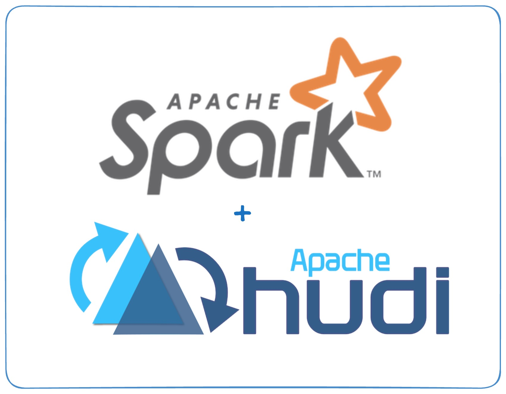

<!--
  Licensed to the Apache Software Foundation (ASF) under one or more
  contributor license agreements.  See the NOTICE file distributed with
  this work for additional information regarding copyright ownership.
  The ASF licenses this file to You under the Apache License, Version 2.0
  (the "License"); you may not use this file except in compliance with
  the License.  You may obtain a copy of the License at

       http://www.apache.org/licenses/LICENSE-2.0

  Unless required by applicable law or agreed to in writing, software
  distributed under the License is distributed on an "AS IS" BASIS,
  WITHOUT WARRANTIES OR CONDITIONS OF ANY KIND, either express or implied.
  See the License for the specific language governing permissions and
  limitations under the License.
-->

# 🚀 Spark + Hudi + MinIO + Hive Metastore Docker Demo

This project provides a ready-to-use Docker Compose environment for running Apache Spark with Hudi, Hive Metastore, and MinIO (S3-compatible storage) for data lake development and testing. JupyterLab is included for interactive development.



## 🛠️ Services

- **spark-hudi**: Spark 3 (Java 11 + Scala 2.12) with Hudi and JupyterLab
- **spark4-hudi**: Spark 4 (Java 17 + Scala 2.13) with Hudi and JupyterLab
- **hive-metastore**: Hive Metastore (backed by Derby)
- **minio**: S3-compatible object storage

## 📂 Directory Structure

- `Dockerfile.spark` / `Dockerfile.spark4` / `Dockerfile.hive`: Custom Dockerfiles for Spark 3, Spark 4, and Hive
- `build.sh`: Build all Docker images
- `run_spark_hudi.sh`: Start/stop/restart the stack
- `conf/`: Configuration files for Spark, Hive, and Hudi
- `notebooks/`: Jupyter notebooks — `common/` (shared, baked into both images), `spark3/` and `spark4/` (per-version `utils.py` and version-specific notebooks, e.g. the Spark 4 `hudi-rs` example)
- `data/`: Persistent data for MinIO, Spark event logs, etc.

## ⚡ Quick Start

### 1. Build Docker Images

```sh
./build.sh
```

### 2. Start the Environment

```sh
./run_spark_hudi.sh start
```

### 3. Stop the Environment

```sh
./run_spark_hudi.sh stop
```

### 4. Restart the Environment

```sh
./run_spark_hudi.sh restart
```

## 🌐 Accessing Services

- **JupyterLab (Spark 3)** → [http://localhost:8888](http://localhost:8888)
- **Spark UI (Spark 3)** → [http://localhost:4040](http://localhost:4040)
- **JupyterLab (Spark 4)** → [http://localhost:8889](http://localhost:8889)
- **Spark UI (Spark 4)** → [http://localhost:4041](http://localhost:4041)
- **MinIO Console** → [http://localhost:9001](http://localhost:9001)
  - User: `admin` 
  - Password: `password`
- **Hive Metastore (Thrift)** → thrift://localhost:9083

## ⚙️ Configuration

- Spark, Hive, and Hudi configs are in `conf/` and automatically copied into containers.
- S3 access keys and endpoints are set for MinIO and referenced in Spark/Hive configs.

### Using another S3-compatible object store

Hudi reads and writes through the Hadoop S3A connector, so the same `fs.s3a.*`
settings work against any S3-compatible object store: Amazon S3, or a compatible
provider such as Backblaze B2, Cloudflare R2, or MinIO. This demo points
`fs.s3a.endpoint` at the bundled MinIO service; to target a different store,
edit `conf/hadoop/core-site.xml` (and the matching Spark/Hive configs) with that
provider's endpoint and credentials:

```xml
<property>
  <name>fs.s3a.endpoint</name>
  <!-- Amazon S3: https://s3.<region>.amazonaws.com
       any other provider: its S3 endpoint URL -->
  <value>https://<s3-endpoint></value>
</property>
<property>
  <name>fs.s3a.access.key</name>
  <value><access-key></value>
</property>
<property>
  <name>fs.s3a.secret.key</name>
  <value><secret-key></value>
</property>
<property>
  <name>fs.s3a.path.style.access</name>
  <value>true</value>
</property>
```

For Amazon S3 the region-default endpoint is used when `fs.s3a.endpoint` is
omitted; most other S3-compatible providers need an explicit endpoint and
`fs.s3a.path.style.access=true`.

## 📒 Example: Using JupyterLab

1. Open [http://localhost:8888](http://localhost:8888) in your browser.
2. Use the provided notebooks or create your own to interact with Spark and Hudi tables.
3. Run Spark jobs that write/read Hudi datasets on MinIO S3.

## 🧹 Cleaning Up

To remove all containers and volumes:
```sh
docker-compose down -v
```

## 📖 Notes

* The Hive Metastore here uses **Derby DB** for simplicity. For production-like setups, replace Derby with **MySQL/Postgres**.
* Spark jars include **Hudi Spark bundle** + **Hadoop AWS jars** to enable MinIO S3 and Hudi integration.

## 🛎️ Support

* Apache Hudi Website: https://hudi.apache.org/
* Apache Hudi Github Repo: https://github.com/apache/hudi⁠

## 📚 Further Reading

[Spark Quick Start Guide](https://hudi.apache.org/docs/quick-start-guide/)
[Python/Rust Quick Start Guide](https://hudi.apache.org/docs/python-rust-quick-start-guide)

## 🤝 Contributing

Please check out our [contribution guide](https://hudi.apache.org/contribute/how-to-contribute) to learn more about how to contribute.
For code contributions, please refer to the [developer setup](https://hudi.apache.org/contribute/developer-setup).
