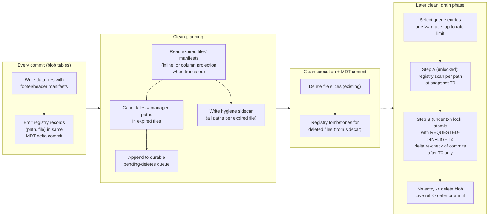
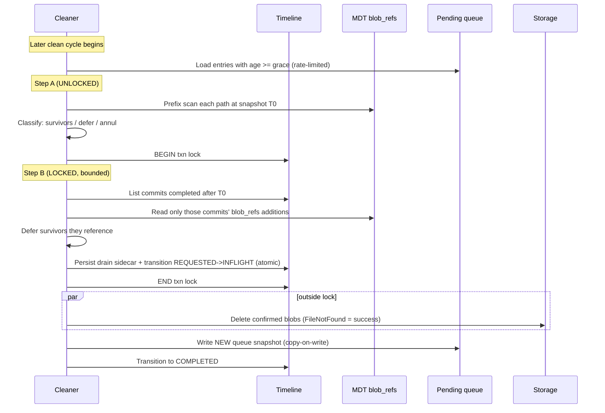

<!--
  Licensed to the Apache Software Foundation (ASF) under one or more
  contributor license agreements.  See the NOTICE file distributed with
  this work for additional information regarding copyright ownership.
  The ASF licenses this file to You under the Apache License, Version 2.0
  (the "License"); you may not use this file except in compliance with
  the License.  You may obtain a copy of the License at

       http://www.apache.org/licenses/LICENSE-2.0

  Unless required by applicable law or agreed to in writing, software
  distributed under the License is distributed on an "AS IS" BASIS,
  WITHOUT WARRANTIES OR CONDITIONS OF ANY KIND, either express or implied.
  See the License for the specific language governing permissions and
  limitations under the License.
-->

# RFC-100 Part 2 (Design v2): File-Granularity Blob Reference Registry

**Status: DRAFT for internal review, revision 2 (2026-07-02) -- incorporates adversarial review
findings: defaults coherence, two-step drain locking, tombstone lifecycle ownership,
defer-vs-annul semantics, completed-instant fencing, queue atomicity, observability. Supersedes
[rfc-100-blob-cleaner-design.md](rfc-100-blob-cleaner-design.md) (the "SI design"), which is now
marked ABANDONED. Problem statement, constraints (C1-C11), and requirements (R1-R9) are unchanged
and live in [rfc-100-blob-cleaner-problem.md](rfc-100-blob-cleaner-problem.md).**

---

## Abstract

This design replaces the SI design's cross-file-group verification mechanism (MDT secondary index
on `reference.external_path` + record index two-hop lookup) with two components:

1. A **blob reference registry**: a new MDT partition that records, per physical data file, which
   external blob paths that file contains. Entries are born when a file is committed and die when
   the file is cleaned -- the same lifecycle the MDT column stats partition already implements.
2. **Two-phase deletion**: no blob is hard-deleted in the clean cycle that discovers it. Verified
   candidates enter a durable pending-deletes queue; a later cycle re-verifies them against the
   registry under the transaction lock and deletes only entries older than a grace window.

The change of indexing granularity -- from *records* (SI) to *files* (registry) -- is the core of
the proposal. The cleaner's liveness question is physical ("does any retained file still contain a
reference to this path?"), and a file-granular index answers it exactly. A record-granular index
answers a different question ("does any record reference this path in the latest snapshot?"),
which is provably insufficient for R1 (Motivation, below).

---

## Motivation: verified defects in the SI design

Fact-checking the SI design against the codebase (2026-07-02) found three P0-level problems. All
three are structural consequences of record-granular, snapshot-semantics indexing; none is fixable
by patching the SI design without changing the question the index answers.

### M1. The secondary index is incompatible with insert_overwrite / delete_partition

`HoodieBackedTableMetadataWriter.updateSecondaryIndexIfPresent` (line 1648) **throws**
`HoodieIndexException` for any `isInsertOverwriteOrDeletePartition()` operation when a secondary
index exists. Enabling the index the SI design requires therefore breaks `insert_overwrite`,
`insert_overwrite_table`, and `delete_partition` table-wide -- operations the SI design's own
preCommit coverage table claims to support (C7, R7). In addition:

- SI creation hard-requires the record index (`HoodieIndexUtils`, lines 708-721), so the SI
  design's primary path needs two MDT index partitions maintained on every commit.
- SI maintenance re-reads the **previous merged file slice** of every touched file group on every
  commit to compute old-value tombstones
  (`SecondaryIndexRecordGenerationUtils.convertWriteStatsToSecondaryIndexRecords`, lines 142-147).
  This is a permanent write-path tax on all writers, absent from the SI design's cost model.

### M2. Snapshot liveness is the wrong liveness

SI reads merge base and log records and filter tombstones, returning only the latest-snapshot
mapping; the payload stores only `isDeleted`, so the instant at which a mapping was superseded is
not recoverable. But the liveness rule in the problem statement is slice-level: "if any
**retained** reference to the same `external_path` exists (regardless of the `managed` flag), the
blob must not be deleted." And Hudi's retention contract is explicit that retained slices are
queryable history (`hoodie.clean.commits.retained`: "This also directly translates into how much
data retention the table supports for incremental queries").

Concrete failure:

```
FG-Z (NOT cleaned this cycle):
    slice@t1: row1 -> P     (base file, retained -- within retention)
    slice@t2: row1 -> Q     (update; SI tombstones (P, row1))
FG-Y (cleaned): expired slice references P -> P becomes a candidate.
Stage 2: SI shows zero live refs for P -> DELETE P.
Result: FG-Z's t1 slice is retained and readable (time travel, incremental
    pull) -> dangling blob reference INSIDE the retention window. R1 violation.
```

The SI design is internally inconsistent about this: its Stage 1 computes liveness over retained
*slices* within cleaned FGs, while its Stage 2 computes liveness over the latest *snapshot*
globally. No SI-side fix exists: per-key instants are not stored, and `earliestInstantToRetain`
does not exist under `KEEP_LATEST_FILE_VERSIONS` (`CleanerUtils.getEarliestCommitToRetain` has no
versions branch), so an instant-fence workaround has nothing to fence against.

### M3. The cleaned_fg_ids discount deletes live blobs in partially-cleaned file groups

Partial cleans are the norm: every policy method spares the latest slice(s); full file-group
removal happens only for replaced FGs. The SI design's Stage 2 treats `location.fileId in
cleaned_fg_ids` as dead. If FG-X is partially cleaned and its retained latest slice references P,
while candidate P came from FG-Y, the record index resolves the referencing record to FG-X, the
discount fires, and P is deleted while a retained slice references it -- an R1 violation with no
concurrency involved. (The discount's intended target -- stale locations in fully-removed FGs --
is nearly dead code: the record index is properly maintained for replace operations via anti-join
deletes and relocation upserts, `HoodieBackedTableMetadataWriter.getRecordIndexAdditionalUpserts`,
lines 2328-2354.)

### Why file granularity fixes all three at once

| Defect | Cause in SI design                                                                                   | Registry behavior                                                                                     |
|--------|------------------------------------------------------------------------------------------------------|-------------------------------------------------------------------------------------------------------|
| M1     | SI record generation cannot handle replace ops; throws                                               | Entries key on files; replace commits need NO registry action (old files stay retained until cleaned) |
| M2     | Record mappings are tombstoned on update, even though the old file still physically contains the ref | Entries are immutable for the file's lifetime; they die only when the file dies                       |
| M3     | Record->location resolution forces a heuristic about which FGs "count"                               | The liveness check is against concrete files; no FG-level heuristic exists                            |

RFC-77's rationale for mapping secondary keys to record keys (not file groups) is correct *for
queries*, which care about a record's current logical state and location. The cleaner asks a
physical question, and file granularity is that question's native granularity.

---

## Design Overview

### Components

| Component               | What it is                                                                                                       | Lifecycle                                                               |
|-------------------------|------------------------------------------------------------------------------------------------------------------|-------------------------------------------------------------------------|
| Per-file blob manifest  | Distinct `OUT_OF_LINE` path set (+ managed bits) embedded in each data file                                      | Written with the file; immutable                                        |
| Blob reference registry | MDT partition: `(external_path, file) -> entry`                                                                  | Entry born at commit, tombstoned by the clean that deletes the file     |
| Pending-deletes queue   | Durable candidate list under `.hoodie/.aux/clean/`                                                               | Appended at plan time; drained (age-gated, re-verified) by later cleans |
| Drain protocol          | Snapshot pre-verification (unlocked) + bounded locked delta re-check atomic with the clean's timeline transition | Per clean cycle                                                         |
| Writer preCommit veto   | Existing check, reduced role: only against an actively-draining clean                                            | Per commit                                                              |

### The correctness kernel

Everything reduces to one invariant pair and one delete rule.

- **I1 (completeness):** for every retained data file F that contains an `OUT_OF_LINE` reference
  to path P, the registry contains a live entry (P, F). (Guaranteed by write-path maintenance +
  the MDT consistency mechanisms; gated during bootstrap, see Fallback.)
- **I2 (hygiene):** an entry (P, F) is tombstoned only by the clean that deletes F (or by MDT
  rollback of the commit that created F).

**Delete rule D:** hard-delete P only when ALL of the following hold:
(a) P was durably enqueued at plan time of an earlier clean (before any slice deletion);
(b) P's queue entry is older than the grace window;
(c) under the transaction lock, atomic with the draining clean's REQUESTED->INFLIGHT
transition: the registry has **no live entry** for P;
(d) the drain intent (sidecar listing P) is visible on the timeline before the physical delete.

R1 follows from I1 + D(c): any retained file referencing P implies a live entry, which fails
D(c). R2 follows from D(a) + queue draining at a bounded rate: candidates are durable before the
slices that produced them are deleted; a candidate found alive at drain is deferred (kept) or --
only when the live reference sits in a stable file -- annulled with an audit record, re-entering
the pipeline when that file eventually expires (see the drain classification).

Rule D has two standing prerequisites, enforced rather than assumed. **(i)** D(c) is defined
against the registry, so blob cleanup hard-requires the `blob_refs` partition -- auto-enabled
when MDT is present, fail-fast when it is not (see Fallback and Bootstrap). **(ii)** D(c)'s
atomicity needs real mutual exclusion or strict sequentiality; the deployment modes and the
fail-fast rule are in "Lock prerequisite and deployment modes". Everything else in this document
is mechanism to establish I1/I2 cheaply and to execute D at low cost.

### Flow



---

## Data Model

### Per-file blob manifest

Each base file written for a table with blob columns carries a manifest entry in its Parquet
footer key-value metadata; log files carry the same per log block via a new `HeaderMetadataType`
entry (the enum is version-gated and append-only, so this is a compatible log-format addition). A
file slice's manifest is the union of its base and log manifests. The entry has three parts:

```
key:   hudi.blob.manifest.v1
value: { distinct_count : long,
         inline         : optional [(external_path, managed)],  // iff within size caps
         bloom          : optional fixed-size bloom over ALL OUT_OF_LINE paths }
```

**Size discipline.** Footers and log-block headers are read by every reader (schema discovery,
stats collection), not just the cleaner, so the inline list is capped by *encoded size*, not only
count: paths are sorted, front-coded (shared-prefix compressed), and block-compressed, inlined
only if the result fits `hoodie.blob.manifest.inline.max.bytes` (default 256KB for footers, 64KB
for log-block headers -- roughly 2-8K paths after prefix compression on typical URL-shaped
paths). The bloom is a fixed-size digest (default 128KB, ~100K paths at ~1% false-positive rate;
beyond that the FPR degrades but correctness never does -- see the table below). Above the caps
the manifest is `{distinct_count, bloom}` only: **truncated**.

**Consumers and degradation.** Every consumer has defined truncated-mode behavior, and every
degradation moves toward more I/O or more retention -- never toward a wrong delete:

| Consumer                                                                                 | Inline present   | Truncated                                                                                                                                                     |
|------------------------------------------------------------------------------------------|------------------|---------------------------------------------------------------------------------------------------------------------------------------------------------------|
| Candidate derivation + hygiene sidecar (enumerate an expired file's paths, at plan time) | Read inline list | Single-column projection read of the file's blob-ref column -- once, at the file's end of life. Identical to the read the SI design's Stage 1 always performs |
| Fallback liveness scan (membership: might retained file F contain P?)                    | Exact check      | Bloom check; false positive -> retain (safe). Degraded FPR at extreme counts means more over-retention, reclaimed later once the registry is available        |
| Registry backfill / repair (ground truth per file)                                       | Inline list      | Column projection read                                                                                                                                        |

The bloom is built over ALL `OUT_OF_LINE` paths regardless of `managed`, because its consumer is
the liveness check, which must be managed-agnostic (R1). The inline list carries per-path managed
bits because its consumers include the eligibility gate.

**Registry completeness does not depend on the manifest.** The writer collects the distinct path
set in memory while writing the file (it must, to build the manifest at all) and emits the
registry records from that set at commit time, carried as an *optional* field on the write stat:
present-and-empty means "no blob refs", absent means "not tracked on this engine path". Where an
engine path cannot carry it reliably (bulk-insert row writers, Flink recovery from checkpoint),
the MDT writer detects the absent field and derives the records from the just-written file itself
(inline manifest, else column projection) -- bounded by the files written in that commit. So
truncation never weakens I1, and a dropped in-memory set degrades to extra commit-path reads,
not to silent index gaps (the failure mode the SI design's transient-only `externalBlobPaths`
could not detect).

**Expected, not pathological.** Row-level-distinct blob references (every record pointing to its
own image or video) are RFC-100's *primary* workload, so large distinct counts are the common
case, not a tail. Such files routinely carry digest-only manifests, and the plan-time column
projection is the designed path for them -- priced identically to the SI design's Stage 1 read.
The footer-only fast path is an optimization that pays on sharing-heavy or sparse-ref tables; it
is not a load-bearing assumption anywhere in the design.

Files written before this feature lack manifests entirely; all consumers treat that as truncated
mode without a bloom (column projection; the fallback scan reads the column too).

Implementation note: the column-projection fallback can read Parquet **dictionary pages** instead
of data pages when the path column chunk is fully dictionary-encoded (verify via
`encoding_stats`; a chunk that fell back to plain encoding mid-write has an incomplete dictionary
and MUST NOT be trusted for enumeration -- missing paths break R2 silently). This mainly helps
backfill over pre-feature base files; it never applies to log blocks (no dictionaries) and
typically not to high-cardinality path columns (dictionary-size fallback).

### Registry: MDT partition `blob_refs`

A new `MetadataPartitionType.BLOB_REFS`, modeled on `COLUMN_STATS`' commit/clean lifecycle
(per-file keyed records created from write stats at commit, deleted per cleaned file at clean).
The parity claim is lifecycle-scoped, not total -- three surfaces are genuinely new and carry
their own compatibility testing: a new MDT payload schema plus record-type int; restore behavior
*opposite* to col-stats (col-stats is excluded from delete-on-restore, the registry opts IN to
delete-and-rebuild initially); and the log-block header addition is a versioned on-disk format
change, a different compatibility story than an MDT partition addition.

This is a **system partition, not a user index**: it is the cleaner's deletion authority,
auto-enabled with blob cleanup, and never exposed to the `CREATE INDEX`/`DROP INDEX` surface --
dropping a query accelerator costs performance, dropping the registry would cost correctness.
Expression-index infrastructure is therefore not reused (record shapes, key orientation, and
clean-time behavior all diverge; see Open Questions, item 5); the async index builder is reused,
since it operates on `MetadataPartitionType` generally.

**Key** (escaped-string concatenation, SI convention, path-first so prefix scans by path are a
single seek):

```
key = escape(external_path) $ escape(partition) $ escape(fileName)
```

Escaped strings are chosen over hashed components deliberately: they are collision-free by
construction, so retain/delete verdicts are exact with no probabilistic argument, and the
escaping + prefix-scan machinery has direct precedent in the secondary index
(`SecondaryIndexKeyUtils`). The cost is variable key width; HFile prefix compression absorbs
most of it, since adjacent keys share the path.

**Payload** `HoodieBlobRefInfo`:

```
{ isDeleted: boolean }     // path, partition, file are recovered by unescaping the key
```

This matches the SI payload precedent (`HoodieSecondaryIndexInfo` carries only `isDeleted`).

Merge semantics: newer-wins (the default `combineMetadataPayloads`). Entries are written
`isDeleted=false` at commit and `isDeleted=true` at clean. Because a file is immutable, an entry
is never *updated* -- only born and killed.

**Why hashed keys are rejected as the default (a subtle R1 inversion).** A fixed-width hash key
(col-stats style, e.g. `hash128(path) + hash64(partition) + hash128(file)`) shrinks keys, but its
collision handling is a trap: if two colliding paths are referenced by the SAME file, their
records share one key, and the newer-wins merge keeps only one payload. Read-time payload
filtering ("does the stored `externalPath` equal the path I asked about?") would then silently
drop the other path's liveness and authorize a wrong delete -- the "verification" intended to
prevent over-retention becomes the R1 hazard. A hashed variant is admissible only as a future
size optimization and only under the rule: **liveness reads never filter by payload -- any prefix
hit retains** (collisions then cause only over-retention, surfaced by a collision metric). 64-bit
path hashes are ruled out entirely: at billions of distinct paths, birthday collisions are
expected, not exotic.

**Path identity is the exact string.** `s3://bucket/k` and `s3a://bucket/k` are different paths
to the registry. Referencing one object through multiple spellings defeats liveness tracking and
is a documented user contract violation (same stance as the SI design and problem-statement Q1).

**Registry size:** one entry per distinct (path, file) pair across live files. For sharing-heavy
tables this is column-stats scale; for row-level-distinct workloads (the primary use case) it is
**record-index scale** -- one entry per blob-ref row -- which is already Hudi's accepted operating
regime (the RLI ships at billions of entries), and strictly less than the SI design's bill for the
same workload (SI entry per row, carrying the same path string, PLUS the mandatory RLI entry per
row). Path-first sorted keys make URL-shaped data near-ideal for HFile prefix + block compression
(typically 3-10x); entries cover live files only (clean tombstones + MDT compaction reclaim dead
ones), so steady-state size is on the order of one compressed string column of the table. If
size pressure ever demands it, hashed fixed-width keys remain a shrink knob -- but only under the
retain-on-any-prefix-hit rule; payload-filtered liveness reads on hashed keys are forbidden (see
the R1 inversion note under Key).

### Pending-deletes queue

Durable artifact(s) under `.hoodie/.aux/clean/pending_blob_deletes/`, Parquet rows:

```
{ externalPath: string,
  enqueueInstant: string,     // clean instant that discovered the candidate
  sourceCleanInstant: string }
```

Written at **plan time**, before any slice deletion (the R2 durability argument from the SI
design's deferred-queue fix carries over unchanged).

**Atomicity (R2/R8).** Queue updates are copy-on-write, never in-place: a drain writes a complete
new snapshot file named by the draining clean instant, and readers select the newest snapshot
whose instant completed; superseded snapshots are removed only after the drain completes. A crash
mid-write leaves the previous snapshot authoritative (entries may be re-verified twice --
idempotent). In-place rewrite is forbidden: it is not atomic on object stores and a crash could
silently lose live candidates.

**Orphan-sweep carve-out.** The per-instant aux orphan sweep ("delete artifacts whose instant is
not on the active timeline") must NOT apply to `pending_blob_deletes/` -- the queue is a
cross-instant artifact, and the per-instant heuristic would delete the running queue. Queue
snapshots are lifecycle-managed by the drain itself (newest completed snapshot always retained).

**Restore.** The queue survives restore: entries re-verify against the rebuilt registry at drain
time, and drains defer while the rebuild is inflight (the partition-availability gate), so a
pre-restore candidate can be deleted only if the *restored* state also shows no references. The
unrecoverable case is a drain that hard-deleted P before a restore to a state referencing P --
the grace window is the only mitigation, so operators should size grace against their
savepoint/restore SLA (Q9; same residual risk class as the SI design).

### Hygiene sidecar

Per clean instant, `.hoodie/.aux/clean/<instant>.blob_refs.parquet`, rows
`(externalPath, partitionPath, fileName)` for **every** `OUT_OF_LINE` path in **every** expired
file (not only candidates). Purpose: the clean's MDT conversion cannot derive registry tombstone
keys from file names alone (the key leads with the escaped path), and by MDT-update time the files are
already deleted -- so the path list must be durable at plan time. The MDT clean conversion reads
this sidecar and emits the registry tombstones (I2) -- with direct precedent: the bloom-filter
and column-stats conversions already open and read files from storage inside the conversion
(`HoodieTableMetadataUtil:586-590`, `:1766-1770`). Written before the plan is persisted, same
atomicity argument as the SI design's sidecar. It also serves as the drain-phase delete-intent
artifact the writer veto checks (see Concurrency).

**Ownership: I2 is a partition property, not a feature flag.** The hygiene sidecar and its
tombstones are emitted by EVERY clean on a table whose MDT has a live `blob_refs` partition,
regardless of `hoodie.cleaner.blob.enabled`. Pausing blob cleanup stops enqueueing and draining;
it must not stop hygiene -- otherwise every file deleted during the pause leaves permanently-live
stale entries (I2 broken, unbounded over-retention, no reconciliation path back). Turning the
registry off means DROPPING the partition (re-enable = rebuild), exactly like other MDT index
partitions.

---

## Registry Maintenance

| Event                                                         | Registry action                                                                                                                                                              | Source of truth                                                                                                        |
|---------------------------------------------------------------|------------------------------------------------------------------------------------------------------------------------------------------------------------------------------|------------------------------------------------------------------------------------------------------------------------|
| Commit / delta commit                                         | Insert (P, F) for each distinct path P in each written file F, in the same MDT delta commit                                                                                  | Write stats fast path; the written file itself (inline manifest, else column projection) when the stat field is absent |
| Clean                                                         | Tombstone (P, F) for each path P of each deleted file F, in the clean's MDT update -- emitted whenever the partition exists, independent of the blob-cleanup flag            | Hygiene sidecar                                                                                                        |
| insert_overwrite / delete_partition / clustering / compaction | **Nothing special.** New files get entries via the commit path; replaced/compacted old files keep their entries until physically cleaned                                     | --                                                                                                                     |
| Rollback of a data commit                                     | The MDT rollback removes the commit's registry records in lockstep; the reader watermark hides uncommitted entries meanwhile                                                 | Existing MDT rollback machinery                                                                                        |
| Restore                                                       | Registry partition is delete-and-rebuilt (`shouldDeletePartitionOnRestore`), matching how newer partitions are handled; incremental restore handling is a later optimization | Backfill job                                                                                                           |
| Savepoint                                                     | Nothing: savepointed files are never cleaned, so their entries persist and their blobs are retained (C8 holds structurally)                                                  | --                                                                                                                     |
| Archival                                                      | Nothing: the registry is MDT data, not commit metadata (C10 holds structurally)                                                                                              | --                                                                                                                     |

Consistency inheritance: registry records ride the same MDT delta commit as the data commit, so
the three mechanisms already proven for the SI design apply verbatim -- same-instant maintenance,
hard failure coupling (MDT commits before `saveAsComplete`), and the reader consistency watermark.
A completed data commit implies its registry entries are visible; a failed commit's entries are
hidden and rolled back.

The `managed` flag: the registry indexes **all** `OUT_OF_LINE` references regardless of `managed`
(liveness is managed-agnostic, per the problem statement's rule). The flag is applied only as the
eligibility gate when deriving candidates from expired manifests. Manifests carry the per-path
managed bit to make that gate footer-only.

**Reconciliation sweep (staleness backstop).** Hygiene can leak: an enumeration failure at clean
time (flagged loudly -- see Cleanup Algorithm) or a bug can leave live entries whose file is gone,
each one a permanently-alive path (silent over-retention, an R2 leak). A rate-limited sweep runs
with the clean: it walks a bounded budget of registry entries per cycle, checks each entry's file
against the MDT files partition, and tombstones entries whose file no longer exists. The sweep
only removes stale RETAIN votes -- the safe direction; it never authorizes a delete -- and it
guarantees staleness is eventually repaired rather than accumulating forever.

---

## Cleanup Algorithm

### Candidate derivation (at clean planning)

```
Input:  expired file slices per FG (from the existing policy methods)
Output: queue appends + hygiene sidecar

expired_paths   = union of manifests of all expired files        // inline manifest, or blob-column
                                                                  // projection when truncated
candidates      = { p in expired_paths where p.managed == true }  // eligibility gate
retained_local  = union of manifests of retained files in the SAME cleaned FGs   // optional prefilter
candidates      = candidates - retained_local                     // skip obviously-alive paths

write hygiene sidecar (ALL expired paths x files, managed-agnostic)
append candidates to pending-deletes queue (durable BEFORE any slice deletion)
```

Notes:

- The per-FG set difference is now only a **prefilter** to keep the queue small; it is not load
  bearing for correctness. The authoritative check is delete rule D(c).
- MOR: an expired slice's manifest is base union logs, so log-chain-only refs are captured (the SI
  design's "expired side reads logs" requirement, now footer-cost). The retained-side prefilter
  may read base manifests only; missing a log-added ref merely fails to prefilter -- the registry
  check catches it.
- Replaced FGs: all slices are expired; identical handling.
- **Completed-instant fencing (R1).** All manifest enumeration that feeds *candidacy* -- footer
  fast path and log-block header scans alike -- is fenced on the exact completed-instant set:
  log-block reads go through the instant-validating scanner (`HoodieLogBlockMetadataScanner` with
  an `InstantRange` over completed instants), never a raw header walk, and a `maxInstantTime`
  high-water mark is NOT sufficient (a failed-but-not-yet-rolled-back block sits inside it). A
  failed commit's block may list paths that were never committed; letting them into candidacy
  hard-deletes a user blob on uncommitted intent. Hygiene tombstones tolerate over-enumeration
  (tombstoning a nonexistent entry is a no-op), but candidacy must be fenced.
- **Enumeration failure is loud, not silent.** If a file's paths cannot be enumerated at its
  clean time (corrupt/absent manifest AND failed column read), the clean proceeds but flags the
  file -- metric plus warning -- and its registry entries are left stale for the reconciliation
  sweep to reclaim. Never silently skipped: a silent skip converts directly into invisible
  permanent over-retention.

### Liveness verification (at drain): snapshot pre-check + bounded locked delta re-check

Two forces pull in opposite directions here and the protocol must satisfy both: correctness
requires the verdict that authorizes a delete to be atomic with the drain becoming visible, while
R4/C6 forbid holding the table lock across up to `max.candidates` MDT scans (seconds to minutes
during which no writer could commit -- a global serialization point). The drain therefore splits
the check:

**Step A -- bulk pre-verification (UNLOCKED).** Record the latest completed instant T0.
Prefix-scan the registry as of T0 for every batch entry and classify:

```
for path in queue entries with age >= grace, up to rate limit:
    entries = registry.prefixScan(path)           // 1 hop; exact match by escaped-key prefix
    entries = entries where file NOT in this clean's own expired-file set
    if entries is empty:                 survivors.add(path)   // tentatively deletable
    else if every entry's file is in a PENDING clean's delete set:
                                         defer(path)           // dying refs; re-check next cycle
    else:                                annul(path, audit)    // stable live ref
```

**Step B -- delta re-check (LOCKED, atomic with REQUESTED->INFLIGHT + drain-sidecar persist).**
Under the transaction lock: list the data commits completed in (T0, now]; read ONLY those
commits' `blob_refs` additions (their MDT log records, addressable per instant); defer any
survivor whose path appears. The locked work is proportional to the volume of commits concurrent
with Step A -- typically zero commits, zero reads -- never to the candidate count. This is the
same shape as OCC's own "did anyone commit since my snapshot" check.

**Defer vs annul.** Deferring keeps the durable queue entry (with a re-check deadline); annulment
drops it, and is permitted ONLY on a live reference from a *stable* file -- one not in any
pending clean's delete set -- because then re-derivation at that file's eventual expiry is the
recovery path. The distinction closes two R2 holes. First, a drain concurrent with a
still-INFLIGHT earlier clean must not annul on that clean's dying entries: its files are deleted
but its tombstones not yet committed, so annulling would lose the path from both the queue and,
moments later, the registry -- a permanent orphan. Second, every annulment is audited (metric
plus log) so a downstream re-derivation failure is detectable rather than silent.

Cost: O(queue batch) unlocked prefix scans + O(concurrent commits) locked reads (R5, R4).

Hardening, ON by default (`hoodie.cleaner.blob.drain.include.inflight.refs`): Step A relaxes the
completed-instant watermark, with a strictly one-sided rule: **apply inflight INSERTS, ignore
inflight TOMBSTONES**. Counting an uncommitted add as a
retain vote can only cause deferral (over-retention -- safe: if the commit completes the deferral
was correct, if it fails the blob waits one extra cycle). Naively dropping the watermark filter
entirely would be WRONG: it would also apply an inflight clean's uncommitted tombstones, removing
retain votes and erring in the delete direction. Over-approximate the live set; never
under-approximate it.

---

## Two-Phase Deletion and Concurrency

### Drain protocol



**This is new locking, stated plainly.** Today the clean's REQUESTED->INFLIGHT transition is
UNLOCKED (`CleanActionExecutor.runClean`, lines 209-210), and the existing lock wraps only
completion (`writeTableMetadata` + INFLIGHT->COMPLETED, lines 227-237). Step B introduces a new
locked block around the transition -- a localized but real restructuring of the clean executor,
not a ride on existing machinery. The in-tree pattern to follow is `scheduleCleaning`'s
REQUESTED-creation-under-lock (`BaseHoodieTableServiceClient`, lines 898-914).

### Lock prerequisite and deployment modes

`TransactionManager.beginStateChange` is a NO-OP when `isLockRequired()` is false
(`HoodieWriteConfig:2873` -- true only when a lock provider is set or the concurrency mode is
multi-writer). The ordering argument below holds only where real mutual exclusion exists, so the
design states its assumption per deployment mode instead of asserting it universally:

| Deployment                                                                           | Lock reality                                                                                                           | Blob-drain stance                                                            |
|--------------------------------------------------------------------------------------|------------------------------------------------------------------------------------------------------------------------|------------------------------------------------------------------------------|
| Multi-writer                                                                         | External lock provider (already required by Hudi OCC)                                                                  | Supported                                                                    |
| Single-writer + async table services + MDT                                           | Auto `InProcessLockProvider` (`HoodieWriteConfig:3659-3691`); the registry requires MDT anyway                         | Supported -- the standard blob configuration                                 |
| Single-writer, all services inline                                                   | No lock; safe by strict sequentiality -- the clean runs in the writer's own thread, so no interleaving exists to order | Supported; the proof is sequentiality, not the lock                          |
| Single-writer + async services, `hoodie.auto.adjust.lock.configs=false`, no provider | `isLockRequired()` false with REAL concurrency: no mutual exclusion at all                                             | **Fail fast** -- blob drains refuse to run and surface a configuration error |

### Ordering argument (closes the SI design's open planning-snapshot window)

The verified commit path holds ONE lock across `preCommit()` -> `writeToMetadataTable()` ->
`saveAsComplete()` (`BaseHoodieWriteClient.commitStats`, lines 266-281). Step B holds the same
lock. For any writer W and drain D, where mutual exclusion exists (table above):

- If W's commit completes before D's Step B: W's commit instant lands in (T0, now], so the delta
  re-check reads W's registry additions -> any survivor W references is deferred, not deleted.
- If W's `preCommit` runs after D's transition: W sees the INFLIGHT clean and its drain sidecar
  on the timeline -> overlap raises `HoodieWriteConflictException` (the existing veto).

There is no third interleaving. The SI design's t0-t3 hole (liveness snapshotted unlocked at plan
time, never re-validated) cannot occur: under rule D, **no liveness decision made outside the
lock ever authorizes a delete** -- Step A is advisory; only Step B authorizes.

### Writer interplay (improved semantics)

| Writer references path P while...                             | SI design                              | This design                                                                                                                                                                  |
|---------------------------------------------------------------|----------------------------------------|------------------------------------------------------------------------------------------------------------------------------------------------------------------------------|
| P sits in the pending queue (not draining)                    | Abort + retry (REQUESTED plan overlap) | **Proceed.** Blob still exists; writer's commit adds a registry entry; the next drain's re-check defers or annuls P. C2 delete-and-re-add within grace is safe, not an error |
| P is in an actively-draining clean (INFLIGHT)                 | Abort + retry                          | Abort + retry (unchanged; delete is imminent/underway)                                                                                                                       |
| P was deleted by a clean completed inside the writer's window | Abort (bounded COMPLETED-window check) | Same bounded check, unchanged                                                                                                                                                |

The veto therefore fires only against actual drains -- rarer, and with the same bounded
sidecar-read cost as the SI design (typically zero to two reads per commit, zero for non-blob
writers, R6).

### Crash recovery

Same idempotency skeleton as the SI design (sidecar re-read, FileNotFound = success), with two
additions:

| Crash point                                                | Recovery                                                                                                                                                                                                                                                                                                                        |
|------------------------------------------------------------|---------------------------------------------------------------------------------------------------------------------------------------------------------------------------------------------------------------------------------------------------------------------------------------------------------------------------------|
| After queue/hygiene sidecar written, before plan persisted | Orphan sweep at startup deletes per-instant artifacts whose instant is not on the active timeline (the `pending_blob_deletes/` queue directory is exempt -- see Data Model)                                                                                                                                                     |
| After slices deleted, before clean's MDT update            | The clean instant is INFLIGHT; re-execution re-reads the hygiene sidecar and re-runs the MDT update. The guarantee is MDT commit atomicity: a partially-written MDT delta commit at the clean instant is removed by MDT inflight-deltacommit rollback and rewritten whole (tombstones are additionally idempotent keyed writes) |
| During drain physical deletes                              | Re-execution re-reads the drain sidecar; deletes are idempotent (FileNotFound = success); the queue snapshot write is copy-on-write, so a crash leaves the prior snapshot authoritative                                                                                                                                         |

### Q6 (premature deletion) -- answered by default

Prevention is rule D. Detection is unchanged from the SI design (dangling-ref error surfacing +
audit trail in clean metadata and sidecars). Recovery improves: because nothing is hard-deleted
before the grace window elapses, a wrong verdict detected within the window is repaired by
annulling the queue entry -- **zero data movement**, no copy-based quarantine, on by default.
Operators who need immediate reclamation set grace to 0 and accept the SI-design-equivalent
recovery posture.

---

## Fallback and Bootstrap

**Blob cleanup hard-requires the registry.** Rule D(c) is defined against the registry: with no
partition there is no deletion authority, and a permanent fallback scan is an R5 violation by
construction. Enabling `hoodie.cleaner.blob.enabled` on a table without the partition
auto-schedules the registry build (MDT present) or fails fast with a configuration error (MDT
disabled). The fallback below is a **bounded transition mode** -- it keeps the cleaner correct
while the partition is being built or rebuilt (initial enable, restore, re-enable), never a
permanent operating mode; remaining in fallback is surfaced as a warning plus a metric.

The registry is authoritative only when its partition is **available and not inflight** -- the
identical gate the SI design uses. During the transition window (and for pre-feature files):

- **Bootstrap/backfill:** an async indexer job builds the registry by reading retained files'
  manifests (footer-only); files without manifests get a one-time blob-column read. Standard
  index-build lifecycle; the partition is inflight until reconciled.
- **Fallback verification:** a scan over **all retained files' manifests** (footer-only,
  metadata-scale I/O -- not the SI design's data scan), rate-limited by
  `max.candidates` with overflow staying in the durable queue. Note the fallback is
  multi-version-correct by construction (it enumerates retained files, not a merged snapshot),
  which the SI design's fallback was not as specified.
- One-sided trust carries over: uncertainty resolves to retain or defer, never to delete.

---

## Performance

| Path                            | SI design                                                                                 | This design                                                                                                                                                            |
|---------------------------------|-------------------------------------------------------------------------------------------|------------------------------------------------------------------------------------------------------------------------------------------------------------------------|
| Write path, per commit          | SI records per touched record + previous-slice diff read per touched FG + RLI maintenance | One registry record per distinct (path, written file); no diffing; no RLI. Strictly <= SI record count                                                                 |
| Candidate derivation (Stage 1)  | Columnar read of base blob columns + full log record reads, ~6 files/FG                   | Inline manifest reads (sharing-heavy tables); blob-column projection for truncated files (no worse than the SI design's read)                                          |
| Cross-FG verification           | 2 hops (SI prefix scan -> record keys -> RLI scan) + in-memory FG resolution              | 1 hop (registry prefix scan), short-circuit on first live entry                                                                                                        |
| Fallback (transition mode only) | O(candidates x table) data scan                                                           | O(retained files) footer scan, bounded to the registry build/rebuild window                                                                                            |
| Reclamation latency             | Same cycle                                                                                | + grace window (config; 0 = same cycle)                                                                                                                                |
| MDT storage                     | SI partition (per record) + RLI (per record)                                              | Registry (per distinct path x file): col-stats scale when sharing-heavy, RLI scale when row-level-distinct -- strictly less than SI+RLI either way (see Registry size) |

R6 (non-blob tables): `hasBlobColumns()` gates manifests, registry maintenance, candidate
derivation, and the veto -- zero cost, unchanged.

---

## Observability and Clean Metadata (R9)

`HoodieCleanMetadata` gains a nullable `blobCleanStats`:

- `totalBlobPathsEnqueued`, `totalBlobFilesDeleted`, `totalBlobStorageReclaimed`
- `totalDeferred`, `totalAnnulled` -- the drain classification counts; annulments are the audited
  events a re-derivation failure would surface against
- `failedBlobFilePaths` and `manifestEnumerationFailures` -- the loud-failure counter that feeds
  the reconciliation sweep
- `hygieneSidecarPath` / `drainSidecarPath` -- the durable audit trail Q6's detection story
  depends on (matching a missing-blob error against delete history)

Metrics: pending-queue depth and oldest-entry age (draining vs stuck), drain and defer/annul
rates, hygiene-failure and sweep-reclaim counters, and a persistent-fallback warning (blob
cleanup enabled while the registry partition is absent or inflight). The bar: an operator must be
able to distinguish "backlog draining slowly" from "registry silently stopped tombstoning" from
metrics alone.

---

## Configuration

| Property                                          | Default                | Description                                                                                                                                                                                                              |
|---------------------------------------------------|------------------------|--------------------------------------------------------------------------------------------------------------------------------------------------------------------------------------------------------------------------|
| `hoodie.cleaner.blob.enabled`                     | `true`                 | Enable blob cleanup during clean. Hard-requires the registry: auto-enables the `blob_refs` partition when MDT is present; fails fast with a config error when MDT is disabled                                            |
| `hoodie.cleaner.blob.pending.delete.grace`        | `24h`                  | Minimum age of a queue entry before it may be drained. `0` = drain in the discovering cycle. Size against the savepoint/restore SLA: a drain older than grace is unrecoverable by restore                                |
| `hoodie.cleaner.blob.drain.max.candidates`        | `1000`                 | Per-cycle drain rate limit (queue is durable; overflow waits)                                                                                                                                                            |
| `hoodie.cleaner.blob.drain.include.inflight.refs` | `true`                 | Step A counts inflight commits' registry INSERTS as retain votes (one-sided rule; inflight tombstones are always ignored). Disabling narrows deferrals but leaves mid-flight writers solely to the locked delta re-check |
| `hoodie.cleaner.blob.dry.run`                     | `false`                | Skip physical blob deletes and log drain decisions. Candidates ARE still enqueued -- the file slices are deleted regardless, so skipping enqueue would permanently lose them (R2)                                        |
| `hoodie.cleaner.blob.sweep.max.entries`           | `10000`                | Per-cycle budget for the reconciliation sweep (staleness backstop)                                                                                                                                                       |
| `hoodie.metadata.index.blob.refs.enable`          | auto with blob cleanup | Build and maintain the `blob_refs` MDT partition. Disabling means DROPPING the partition (re-enable = rebuild); hygiene tombstones follow partition existence, not the cleaner flag                                      |

---

## Rollout

1. **Manifests** (independent value): footer/header manifest write + read utilities. Enables
   footer-only candidate derivation and the fallback scan even before the registry exists.
   Each engine write path is an explicit line item -- Spark record-level handles, Spark
   row-writer bulk_insert, Flink, Java, and the log-block writers -- because the fallback for a
   missing write-stat set re-reads the just-written files, and `writeToMetadataTable` runs inside
   the commit lock, so on bulk loads the fallback is a real commit-latency tax. Mitigation:
   derive the path set at file-close time on the executor (the data is still in memory there),
   not at commit time on the driver.
2. **Registry partition**: `MetadataPartitionType.BLOB_REFS` + payload + commit/clean conversion
    + writer wiring + async backfill. Touchpoint list matches the PARTITION_STATS precedent
      (commit `f553ba25fe30`); no table-version bump was required for that addition.
3. **Queue + drain protocol**: pending-deletes queue, hygiene sidecar, locked drain, annulment.
4. **Writer veto** (reduced scope): reuse the SI design's preCommit machinery against the drain
   sidecar only.

Backward compatibility: all new metadata is additive (new MDT partition, nullable clean-metadata
stats, aux artifacts); non-blob tables are unaffected; pre-feature files are handled by the
manifest fallback.

---

## Comparison with the SI design

| Dimension                   | SI design                                                  | This design                                                           |
|-----------------------------|------------------------------------------------------------|-----------------------------------------------------------------------|
| Liveness question answered  | "referenced in latest snapshot?" (record-granular)         | "referenced by any retained file?" (file-granular) -- the R1 question |
| M1 insert_overwrite ban     | Inherited from SI; must be fixed upstream or ops banned    | Not applicable (no SI)                                                |
| M2 snapshot hole            | Present; unfixable without SI payload/read changes         | Absent by construction                                                |
| M3 cleaned_fg_ids heuristic | Required, and wrong for partial cleans                     | No FG heuristic exists                                                |
| Planning-snapshot window    | Open (option (a)/(b) unresolved)                           | Closed structurally: only the locked drain check authorizes deletes   |
| Index prerequisites         | SI + RLI, per-record maintenance, per-commit slice diffing | One partition, per-file records, no diffing                           |
| Writer race handling        | Abort on any overlap with REQUESTED/INFLIGHT/COMPLETED     | Defer/annul (proceed) during queue phase; abort only during drains    |
| Recovery from wrong verdict | Opt-in copy-based quarantine                               | Default grace window, zero data movement                              |
| New infra                   | Nested-SI index definition (exists), sidecar convention    | New MDT partition type, manifests, queue (sidecar convention shared)  |
| Reclamation latency         | Same cycle                                                 | Grace window (default 24h; 0 opt-out)                                 |

## Constraint and Requirement Coverage

Traceability against the problem statement (C1-C11, R1-R9):

| ID  | Summary                                            | Where addressed / mechanism                                                                                                                                                                                                            |
|-----|----------------------------------------------------|----------------------------------------------------------------------------------------------------------------------------------------------------------------------------------------------------------------------------------------|
| C1  | Blob immutability                                  | Assumed and exploited: registry entries are immutable for a file's lifetime (born at commit, killed at clean, never updated); the cleaner only ever deletes whole blobs, never mutates them                                            |
| C2  | Delete-and-re-add same path                        | Safe within grace (writer proceeds; the re-adding commit's registry entry defers the drain); post-delete re-add caught by the bounded completed-window veto -- Writer interplay                                                        |
| C3  | Cross-FG blob sharing                              | The registry IS the cross-FG liveness index: any file's entry, in any FG, retains the path -- Abstract, Motivation                                                                                                                     |
| C4  | MOR log updates shadow base refs                   | Expired side enumerates base union logs; a shadowed base ref stays alive until its base file is physically cleaned (over-retention only) -- Candidate derivation, MOR note                                                             |
| C5  | Cleaner is per-FG scoped                           | Candidate derivation consumes the existing policy methods' per-FG expired/retained output unchanged -- Cleanup Algorithm input                                                                                                         |
| C6  | OCC per-FG, no global contention                   | Two-step drain: locked work is O(concurrent commits), never O(candidates); no new global serialization -- Liveness verification, Lock prerequisite                                                                                     |
| C7  | Replace commits move refs between FGs              | No special handling needed: old FG's files stay retained (entries live) until cleaned; new files carry their own entries -- Registry Maintenance table                                                                                 |
| C8  | Savepoints freeze slices and refs                  | Savepointed files are never cleaned, so their entries persist and their blobs are retained structurally -- Registry Maintenance table                                                                                                  |
| C9  | Rollback / restore invalidate or resurrect         | MDT-lockstep rollback removes a failed commit's entries; restore delete-and-rebuilds the partition, the queue survives and defers during rebuild, grace sized against restore SLA -- Registry Maintenance, Pending-deletes queue       |
| C10 | Archival removes commit metadata                   | The registry is MDT data, not commit metadata; per-instant sidecars live until archival with the existing sweep -- Registry Maintenance table                                                                                          |
| C11 | Cross-FG verification at scale                     | O(candidates) targeted prefix scans with first-hit short-circuit -- Liveness verification, Performance                                                                                                                                 |
| R1  | No premature deletion                              | Kernel I1 + rule D(c); completed-instant fencing; one-sided rules (no payload-filtered hashed reads, no inflight tombstones); writer veto + ordering argument                                                                          |
| R2  | No permanent orphans                               | Plan-time durable enqueue before slice deletion; defer-vs-annul classification; audited annulments; reconciliation sweep; dry-run still enqueues; copy-on-write queue                                                                  |
| R3  | MOR correctness (over-retain OK, under-retain not) | All MOR degradations point toward retention: shadowed refs live until their file dies; rollback resurrection is safe because entries outlive snapshot supersession (file granularity)                                                  |
| R4  | Concurrency safety, no global serialization        | Two-step drain (bounded lock hold); per-mode lock grounding with fail-fast -- Lock prerequisite and deployment modes                                                                                                                   |
| R5  | Cost proportional to work                          | Registry lookups O(candidates); fallback bounded to the build/rebuild transition window; drain and sweep rate-limited                                                                                                                  |
| R6  | Zero cost for non-blob tables                      | `hasBlobColumns()` gates manifests, registry maintenance, candidate derivation, and the veto -- Performance                                                                                                                            |
| R7  | All cleaning policies                              | Candidate derivation is policy-agnostic (consumes expired/retained slices from the existing policy methods); notably the design has NO dependency on `earliestInstantToRetain`, which does not exist under `KEEP_LATEST_FILE_VERSIONS` |
| R8  | Crash safety and idempotency                       | Crash-recovery table: MDT commit atomicity for tombstones, idempotent physical deletes, copy-on-write queue snapshots, orphan sweep with queue carve-out                                                                               |
| R9  | Observability                                      | Observability and Clean Metadata section: `blobCleanStats`, queue/drain/sweep metrics, persistent-fallback warning                                                                                                                     |

## Open Questions

All questions initially left open by this draft have been resolved (decisions recorded in place
below); what remains are implementation-time tunables noted inside items 2 and 6.

1. (Resolved.) Registry key encoding: escaped-string concatenation -- collision-free by
   construction, SI-precedent escaping. Hashed fixed-width keys survive only as a future size
   optimization under the retain-on-any-prefix-hit rule; payload-filtered liveness reads on
   hashed keys are an R1 inversion (see Data Model, Key).
2. (Resolved -- see "Pending-deletes queue", Atomicity.) Queue storage is copy-on-write
   snapshots named by the draining instant; remaining tunable: snapshot compaction cadence.
3. (Resolved.) Grace default: **24h**, per-table configurable
   (`hoodie.cleaner.blob.pending.delete.grace`, `0` allowed). No automatic floor -- instead,
   config documentation directs operators to size it against the clean retention window and
   their savepoint/restore SLA (see queue Restore note).
4. (Resolved.) Unwatermarked drain read: **ON by default**
   (`hoodie.cleaner.blob.drain.include.inflight.refs`), under the one-sided rule -- apply
   inflight inserts, never inflight tombstones (see the drain hardening note).
5. (Resolved.) First-class `MetadataPartitionType.BLOB_REFS`, NOT expression-index reuse. The
   registry is a SYSTEM partition -- the cleaner's deletion authority, auto-enabled, hygiene tied
   to its existence -- and must not be droppable via the user-facing `DROP INDEX` surface; its
   record shape (existence entry, path-first key) and clean-time tombstone path (hygiene
   sidecar) match neither expression-index record type anyway. The async builder is reused
   regardless (it works against `MetadataPartitionType` generally, as RLI shows). Precedent:
   PARTITION_STATS is col-stats-shaped -- the best candidate for expression-index reuse -- and
   still shipped first-class.
6. (Resolved -- see "Per-file blob manifest".) Manifest size: capped inline tier + fixed-size
   bloom digest + column-projection fallback; truncation degrades only to more I/O or safe
   over-retention. Remaining tunables: inline cap defaults (256KB footer / 64KB log header) and
   bloom sizing policy (fixed 128KB vs scaled-to-count).
