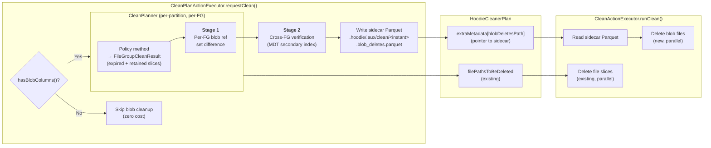
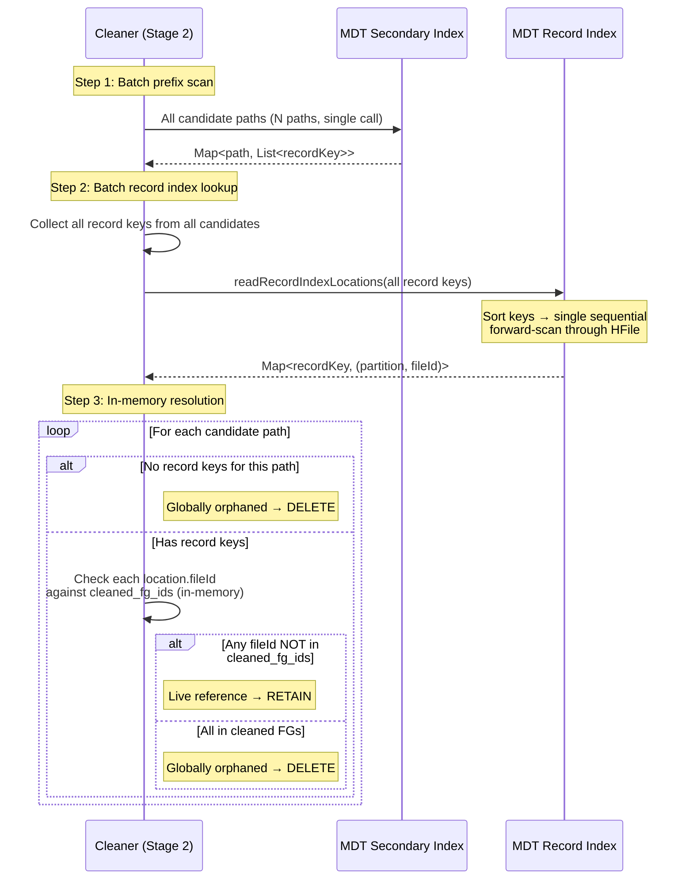
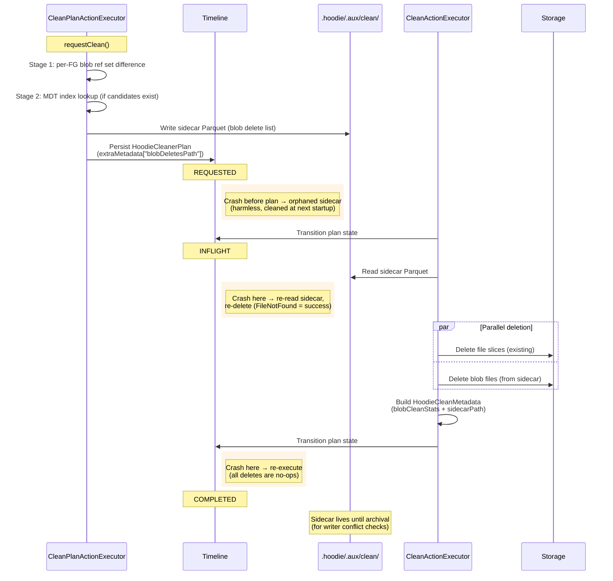
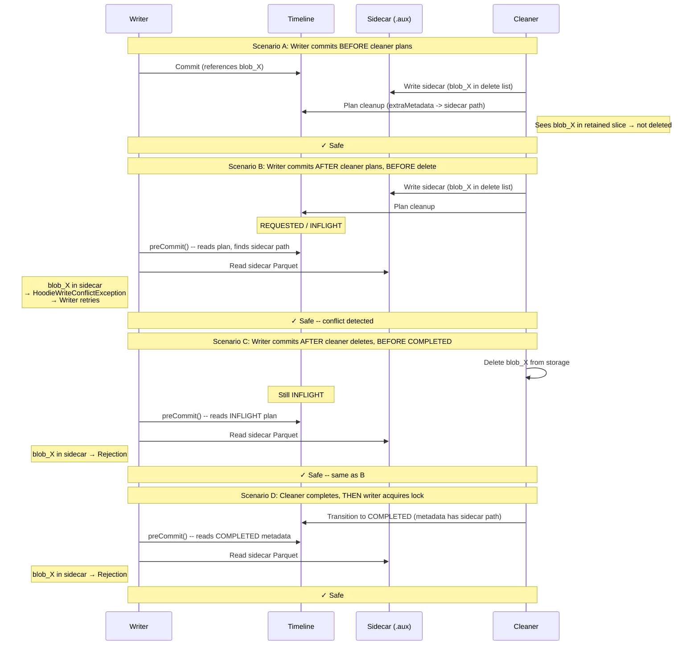

<!--
  Licensed to the Apache Software Foundation (ASF) under one or more
  contributor license agreements.  See the NOTICE file distributed with
  this work for additional information regarding copyright ownership.
  The ASF licenses this file to You under the Apache License, Version 2.0
  (the "License"); you may not use this file except in compliance with
  the License.  You may obtain a copy of the License at

       http://www.apache.org/licenses/LICENSE-2.0

  Unless required by applicable law or agreed to in writing, software
  distributed under the License is distributed on an "AS IS" BASIS,
  WITHOUT WARRANTIES OR CONDITIONS OF ANY KIND, either express or implied.
  See the License for the specific language governing permissions and
  limitations under the License.
-->

# RFC-100 Part 2: External Blob Cleanup for Unstructured Data

## Proposers

- @voon

## Approvers

- @rahil-c
- @vinothchandar
- @yihua

## Status

Issue: https://github.com/apache/hudi/issues/18111

> Please keep the status updated in `rfc/README.md`.

---

## Abstract

When Hudi cleans expired file slices, external out-of-line blob files they reference may become
orphaned -- still consuming storage but unreachable by any query. This RFC extends the existing file
slice cleaner to identify and delete these orphaned blob files safely and efficiently. The design
uses a two-stage pipeline: (1) per-file-group set-difference to find locally-orphaned blobs, and
(2) cross-file-group verification via MDT secondary index lookup. Targeted index lookups scale with
the number of candidates, not the table size. Tables without blob columns pay zero cost.

This design focuses on **external blobs** -- the Phase 1 use case of RFC-100 where users have
existing blob files in external storage (e.g., `s3://media-bucket/videos/`) and Hudi manages the
*references* via the `BlobReference` schema, not the *storage layout*.

---

## Background

### Why Blob Cleanup Is Needed

RFC-100 introduces out-of-line blob storage for unstructured data (images, video, documents). A
record's `BlobReference` field points to an external blob file by `reference.external_path`. When
the cleaner expires old file slices, the blob files they reference may no longer be needed -- but the
existing cleaner has no concept of transitive references. It deletes file slices without considering
the blob files they point to. Without blob cleanup, orphaned blobs accumulate indefinitely.

### External Blobs

Users have existing blob files in external storage (e.g., `s3://media-bucket/videos/`). Records
reference these blobs directly by path. Hudi manages the *references*, not the *storage layout*.
Cross-file-group sharing is common -- multiple records across different file groups can point to the
same blob. Key properties:

| Property                  | External blobs                               |
|---------------------------|----------------------------------------------|
| Path uniqueness           | Not guaranteed (user controls)               |
| Cross-FG sharing          | Common (multiple records, same blob)         |
| Writer/cleaner race       | Can occur (external paths outside MVCC)      |
| Per-FG cleanup sufficient | No -- cross-FG verification needed           |

### Constraints and Requirements Reference

Full descriptions and failure modes in [Problem Statement](rfc-100-blob-cleaner-problem.md).

| ID  | Constraint                                          | Remarks                          |
|-----|-----------------------------------------------------|----------------------------------|
| C1  | Blob immutability (append-once, read-many)          |                                  |
| C2  | Delete-and-re-add same path                         | Real concern for external blobs  |
| C3  | Cross-file-group blob sharing                       | Common for external blobs        |
| C4  | MOR log updates shadow base file blob refs          |                                  |
| C5  | Existing cleaner is per-file-group scoped           |                                  |
| C6  | OCC is per-file-group                               | No global contention allowed     |
| C7  | Replace commits move blob refs between file groups  | Clustering, insert_overwrite     |
| C8  | Savepoints freeze file slices and blob refs         |                                  |
| C9  | Rollback and restore can invalidate or resurrect    |                                  |
| C10 | Archival removes commit metadata                    |                                  |
| C11 | Cross-FG verification needed at scale               |                                  |

| ID  | Requirement                                                      |
|-----|------------------------------------------------------------------|
| R1  | No premature deletion (hard invariant)                           |
| R2  | No permanent orphans (bounded cleanup)                           |
| R3  | MOR correctness (over-retention acceptable, under-retention not) |
| R4  | Concurrency safety (no global serialization)                     |
| R5  | Scale proportional to work, not table size                       |
| R6  | No cost for non-blob tables                                      |
| R7  | All cleaning policies supported                                  |
| R8  | Crash safety and idempotency                                     |
| R9  | Observability (metrics for deleted, retained, reclaimed)         |

---

## Design Overview

### Design Philosophy

Blob cleanup extends the existing `CleanPlanner` / `CleanActionExecutor` pipeline -- same timeline
instant, same plan-execute-complete lifecycle, same crash recovery and OCC integration. A
`hasBlobColumns()` check gates all blob logic so non-blob tables pay near zero cost (schema scan 
cost).

External blobs require cross-file-group verification because the same blob can be referenced from
multiple file groups (C3, C11). The design uses targeted MDT secondary index lookups that scale
with the number of candidates, not the table size.

### Two-Stage Pipeline

| Stage       | Scope            | Purpose                                                              | When it runs                 |
|-------------|------------------|----------------------------------------------------------------------|------------------------------|
| **Stage 1** | Per-file-group   | Collect expired/retained blob refs, compute set difference           | Always (for blob tables)     |
| **Stage 2** | Cross-file-group | Verify candidates against MDT secondary index or fallback scan       | When local orphans exist     |

### Key Decisions

| Decision            | Choice                                                  | Rationale                                                      |
|---------------------|---------------------------------------------------------|----------------------------------------------------------------|
| Blob identity       | `reference.external_path`                               | Path-based identity for external blobs                         |
| Cleanup scope       | Per-FG candidate identification + cross-FG verification | Aligns with OCC (C6) and existing cleaner (C5); scales for C11 |
| Cross-FG mechanism  | MDT secondary index on `reference.external_path`        | Short-circuits on first non-cleaned FG ref                     |
| Blob delete storage | Sidecar Parquet file (`.hoodie/.aux/clean/`)             | Avoids plan bloat; durable artifact for writer conflict checks |
| MOR strategy        | Over-retain (union of base + log refs)                  | Safe (C4, R3); cleaned after compaction                        |



---

## Algorithm

### Stage 1: Per-File-Group Local Cleanup

Stage 1 runs after the existing policy logic determines which file slices are expired and retained
for a given file group. It collects blob refs from both sets and computes locally-orphaned blobs by
set difference. All local orphans proceed to Stage 2 for cross-FG verification.

```
Input:  A file group FG with expired_slices and retained_slices (from policy)
Output: local_orphan_candidates -- external blobs needing cross-FG verification

for each file_group being cleaned:

    // Collect expired blob refs (base files + log files)
    // The managed==true filter here is the ELIGIBILITY gate: only blobs Hudi was
    // asked to manage become deletion candidates. (Liveness, in retained_refs and
    // Stage 2 below, is managed-agnostic.)
    // Must read log files: blob refs introduced and superseded within the log
    // chain before compaction would otherwise become permanent orphans.
    expired_refs = Set<external_path>()
    for slice in expired_slices:
        for ref in extractBlobRefs(slice.baseFile):   // columnar projection
            if ref.type == OUT_OF_LINE and ref.managed == true:
                expired_refs.add(ref.external_path)
        for ref in extractBlobRefs(slice.logFiles):   // full record read
            if ref.type == OUT_OF_LINE and ref.managed == true:
                expired_refs.add(ref.external_path)

    if expired_refs is empty:
        continue                                       // no blob work for this FG

    // Collect retained blob refs (base files only)
    // Cleaning is fenced on compaction: retained base files contain the merged
    // state. Log reads are unnecessary -- any shadowed base ref causes safe
    // over-retention, cleaned after the next compaction cycle.
    // NOTE: no managed filter here. Liveness is managed-AGNOSTIC -- ANY retained
    // reference to a path (managed=true OR managed=false) keeps the blob alive
    // (R1). A managed->unmanaged transition must not make the blob deletable.
    retained_refs = Set<external_path>()
    for slice in retained_slices:
        for ref in extractBlobRefs(slice.baseFile):   // columnar projection only
            if ref.type == OUT_OF_LINE:               // NOT ref.managed -- see note above
                retained_refs.add(ref.external_path)

    // Compute local orphans by set difference
    local_orphans = expired_refs - retained_refs

    // All local orphans proceed to Stage 2 for cross-FG verification
    all_local_orphans.addAll(local_orphans)
```

**Correctness notes:**

- **MOR -- expired side reads base + logs:** Blob refs can be introduced and superseded entirely
  within the log chain (e.g., `log@t2: row1->blob_B`, then `log@t3: row1->blob_C`). After
  compaction, `blob_B` exists only in the expired log. Skipping logs would orphan it permanently.
- **MOR -- retained side reads base only:** Cleaning is fenced on compaction, so retained base
  files contain the merged state. Shadowed base refs cause over-retention (safe), cleaned after
  the next compaction.
- **Savepoints:** Inherited from existing cleaner -- savepointed slices stay in the retained set.
- **Replaced FGs (replace commits):** `retained_slices` is empty, so all blob refs become
  candidates. For external blobs, clustering copies the pointer to the target FG, so Stage 2
  finds the reference in the target FG and retains the blob.
- **`managed` flag -- eligibility vs liveness (R1).** The flag has two distinct roles and the
  design must not conflate them. *Eligibility:* only paths referenced as `managed=true` in the
  expired set become deletion candidates (the `expired_refs` filter) -- Hudi never deletes a blob
  it was not asked to manage. *Liveness:* whether a path is still referenced is managed-agnostic --
  `retained_refs` (and Stage 2's cross-FG check) count references regardless of `managed`, per the
  problem statement's rule that "if any retained reference to the same `external_path` exists
  (regardless of the `managed` flag), the blob must not be deleted." This is what makes a
  managed->unmanaged transition safe: at t1 a record references `video.mp4` with `managed=true`
  (eligible); at t2 an update sets `managed=false` for the same path (user says "stop managing
  this"). The t2 reference lands in a retained slice; because `retained_refs` does not filter on
  `managed`, `video.mp4` stays out of `local_orphans` and survives. The Stage 2 dependency this
  implies (the secondary index must index unmanaged references too) is stated in Stage 2 below.

### Stage 2: Cross-File-Group Verification

Stage 2 verifies each local orphan candidate against the global state to determine if the blob is
still referenced by any active file slice outside the cleaned file groups. This is necessary because
external blobs can be shared across file groups (C3, C11).

#### Primary path: MDT secondary index

When the MDT secondary index on `reference.external_path` is available and fully built:

```
Input:  all_local_orphans, cleaned_fg_ids
Output: blob_files_to_delete (confirmed globally orphaned)

candidate_paths = all_local_orphans.distinct()

// Step 1: Batched prefix scan on secondary index
// Key format: escaped(external_path)$escaped(record_key)
// Returns ALL record keys that reference each candidate path
// Uses engine-context HoodieData (e.g., RDD on Spark) to distribute work
// across executors -- candidate sets can be large (row-level blob refs).
candidate_paths_data = engineContext.parallelize(candidate_paths)
path_to_record_keys = mdtMetadata.readSecondaryIndexDataTableRecordKeysWithKeys(
    candidate_paths_data, indexPartitionName)
    .groupBy(pair -> pair.getKey())

// Step 2: Batch record index lookup -- ONE call for ALL record keys
// Sorts keys internally, single sequential forward-scan through HFile.
all_record_keys = path_to_record_keys.values().flatMap()
all_locations = mdtMetadata.readRecordIndexLocations(
    all_record_keys)                                    // -> Map<recordKey, (partition, fileId)>

// Step 3: In-memory resolution with short-circuit per candidate
for path in candidate_paths:
    record_keys = path_to_record_keys.getOrDefault(path, [])

    if record_keys is empty:
        blob_files_to_delete.add(path)                  // globally orphaned
        continue

    found_live_reference = false
    for rk in record_keys:
        location = all_locations.get(rk)
        if location != null and location.fileId NOT in cleaned_fg_ids:
            found_live_reference = true
            break                                       // short-circuit (in-memory)

    if not found_live_reference:
        blob_files_to_delete.add(path)                  // all refs in cleaned FGs
```

**Cost model.** Three steps: (1) batched prefix scan on secondary index, (2) batched record index
lookup in a single sorted HFile scan, (3) in-memory resolution with short-circuit. Steps 1 and 2
are each a single I/O pass; step 3 is pure hash set lookups.

| Step                      | I/O                                           | Estimated cost (2K candidates) |
|---------------------------|-----------------------------------------------|--------------------------------|
| 1. Prefix scan (batched)  | 1 HFile open + forward scan of N prefix keys  | ~2-5s                          |
| 2. Record index (batched) | 1 HFile open + forward scan of 6K sorted keys | ~1-2s                          |
| 3. In-memory resolution   | Hash set checks (cleaned_fg_ids)              | ~0ms                           |

*Estimates assume cloud object storage (S3/GCS/ADLS), ~10-100ms per-read latency, ~50-200 MB/s
sequential throughput, 64-256KB HFile blocks. Pending benchmarking.*

**Index definition.** Uses the existing `HoodieIndexDefinition` mechanism with
`sourceFields = ["<blob_col>", "reference", "external_path"]`. The nested field path is supported
by `HoodieSchemaUtils.projectSchema()` and `SecondaryIndexRecordGenerationUtils`. No new index
infrastructure is needed.

**Managed-agnostic indexing (R1).** The secondary index keys on `reference.external_path` for every
record whose blob reference is `OUT_OF_LINE`, *regardless of the `managed` flag*: the index
definition carries no `managed` predicate, and standard SI record generation indexes each record's
field value without filtering. So the index contains entries for `managed=false` references, and
Stage 2's lookup finds an unmanaged retained reference exactly as it finds a managed one, keeping
the blob alive. This is what makes the managed->unmanaged transition safe (Stage 1 note above): the
`managed=true` filter is applied only when selecting *candidates* from the expired set, never when
checking *liveness*. The fallback table scan is managed-agnostic for the same reason -- it matches
candidate paths against every live `external_path`, not only managed ones. A future optimization
must not add a `managed` filter to the index or the scan, or it breaks R1.

**Index staleness and consistency.** Stage 2 deletes a blob when the index reports no live
reference, so the only dangerous error is a *false negative* -- the index missing a reference that
exists (premature deletion, R1). A *false positive* only over-retains (R2, safe). For a table whose
secondary index partition is **available (built)**, a false negative from steady-state staleness
cannot occur, because three MDT mechanisms compose:

1. **Same-commit, same-instant maintenance.** SI records are written in the *same* MDT delta-commit
   as the data commit, at the data commit's instant time (`HoodieBackedTableMetadataWriter.update`
   -> `processAndCommit`, SI in the same `partitionToRecordMap`). It is not a lazily-maintained
   cache that can drift out of band.
2. **Hard failure coupling.** The MDT commit runs *before* the data instant is completed
   (`BaseHoodieWriteClient.commit`: `writeToMetadataTable`, then `saveAsComplete`). If the MDT
   update fails, the exception propagates before completion and the data instant stays inflight --
   so a *completed* data commit implies its SI entries exist.
3. **Reader consistency watermark.** Every SI read filters MDT records to those whose data instant
   is completed (`getValidInstantTimestamps`, applied as an `InstantRange` EXACT_MATCH in
   `HoodieBackedTableMetadata.readSliceWithFilter`). Entries from an uncommitted or failed commit --
   e.g. a crash after the MDT commit but before `saveAsComplete` -- are hidden; entries from every
   completed commit are exposed.

Composed, the index cannot miss a reference from a completed commit nor surface one from a failed
commit. Reading the current index reflects every completed data commit -- a superset of the
cleaner's planning fence -- so index staleness cannot produce a false negative. (A *new* reference
committed by a concurrent writer after the fence is a separate concern, handled by the writer-side
`preCommit` check and the planning-snapshot window above, not by the index.)

**The one unsafe window is bootstrap, and the safety check gates exactly it.** While a secondary
index is being built or backfilled (async `HoodieIndexer` / `RunIndexActionExecutor`), its
partition is *inflight*, not *available*. Here the reader watermark does **not** help: a completed
historical instant can be within `getValidInstantTimestamps` yet still lack the SI entries the
catch-up task has not reconciled -- a genuine false negative. So the cleaner treats the index as
authoritative only when the partition is available **and not** inflight
(`isMetadataPartitionAvailable(SECONDARY_INDEX)` is true and it is absent from
`getMetadataPartitionsInflight()`); otherwise it falls back to the ground-truth table scan, which
reads actual file slices and is immune to index state. MDT disable/rebuild and restore either flip
this availability flag or are reconciled into the watermark, so the same gate covers them.

**One-sided trust (backstop).** The index may authorize *retention* freely, but authorizes
*deletion* only under the availability guarantee above; any uncertainty resolves to the
ground-truth scan or to deferral, never to deletion. This keeps R1 intact even if a future
index-maintenance mode weakened one of the three steady-state mechanisms.

#### Fallback path: table scan, with a durable deferred queue

When the MDT secondary index is unavailable, Stage 2 falls back to a parallelized table scan
across all partitions. Because that scan is O(candidates * table), a per-cycle cap
(`hoodie.cleaner.blob.external.scan.max.candidates`, default 1000) limits how many candidates are
verified in a single clean cycle.

**The cap must not silently drop candidates (R2).** Stage 1 derives candidate paths by reading the
*expired* file slices' blob refs, and the existing cleaner deletes those slices later in the *same*
cycle. If the cap simply skipped the overflow, the deleted slices would take the only copy of those
refs with them -- the candidates could never be re-derived, leaving permanent orphans (a direct R2
violation). So the cap is a **rate limit backed by a durable queue**, not an all-or-nothing skip:

1. At plan time (before execution deletes any slice), Stage 1's candidate *paths* are already in
   hand. Up to `max.candidates` are verified this cycle; the overflow is written to a durable
   deferred-candidates artifact under `.hoodie/.aux/clean/` -- a running queue, separate from a
   delete sidecar since no deletes are planned for the overflow.
2. Each subsequent clean cycle loads the deferred queue, merges it with that cycle's new local
   orphans, verifies up to `max.candidates`, and re-defers the rest. The backlog drains at a
   bounded rate per cycle.
3. Because the candidate paths are durable *before* any slice is deleted, deleting the expired
   slices no longer loses them. Deferred candidates are re-verified against the *current* index or
   scan when processed -- a point-in-time liveness check that can only over-retain, never wrongly
   delete -- so they never depend on the now-deleted slices.

This keeps R2 intact regardless of the index: with the index the queue drains quickly; without it
the scan drains it at `max.candidates` per cycle (bounded, just slower). A growing deferred backlog
is surfaced as a metric and a warning so operators enable the MDT secondary index.

*Considered and rejected:* gating file-slice deletion on blob planning (refusing to clean slices
when the cap fires). It preserves the source slices but couples blob cleanup to core cleaning,
blocks file-slice reclamation, and changes existing cleaner semantics. The durable queue reaches R2
without touching the file-slice path.

#### Decision matrix

| Condition                   | Path used                          | Cost                             | Suitable for                  |
|-----------------------------|------------------------------------|----------------------------------|-------------------------------|
| No local orphan candidates  | Skip Stage 2                       | Zero                             | No blob work this cycle       |
| MDT secondary index enabled | Index lookup                       | O(candidates)                    | Any scale                     |
| No index, few candidates    | Table scan                         | O(candidates * table)            | Small tables                  |
| No index, many candidates   | Rate-limited scan + durable defer  | O(max.candidates * table)/cycle  | Drains over cycles; add index |



### Execution Flow

```
1. CleanPlanActionExecutor.requestClean()
   ├── hasBlobColumns(table)?                         // R6: zero-cost gate
   ├── CleanPlanner: for each partition, for each file group:
   │     ├── Refactored policy method -> FileGroupCleanResult
   │     └── If hasBlobColumns: Stage 1 per FG
   ├── CleanPlanner: replaced file groups -> Stage 1
   ├── If local orphan candidates non-empty: Stage 2
   ├── Write sidecar Parquet to .hoodie/.aux/clean/<instant>.blob_deletes.parquet
   ├── Build HoodieCleanerPlan with extraMetadata["blobDeletesPath"]
   └── Persist plan to timeline (REQUESTED state)

2. CleanActionExecutor.runClean()
   ├── Transition to INFLIGHT
   ├── Read sidecar Parquet (blob delete list)
   ├── Delete file slices (existing, parallelized)
   ├── Delete blob files (new, parallelized)          // parallel with file slice deletes
   ├── Build HoodieCleanMetadata with blobCleanStats + blobDeletesSidecarPath
   └── Transition to COMPLETED
```



---

## Integration with Existing Cleaner

### CleanPlanner Refactoring

The existing `CleanPlanner` policy methods produce `CleanFileInfo` objects (file paths to delete)
without exposing the expired/retained slice partition that blob cleanup needs. We introduce a new
return type:

```java
public class FileGroupCleanResult {
  private final List<CleanFileInfo> filePathsToDelete;
  private final List<FileSlice> expiredSlices;
  private final List<FileSlice> retainedSlices;
}
```

The three policy methods (`getFilesToCleanKeepingLatestVersions`,
`getFilesToCleanKeepingLatestCommits`, `getFilesToCleanKeepingLatestHours`) are refactored to
collect both expired and retained slices alongside the existing `CleanFileInfo` production. The
existing behavior is unchanged -- the refactoring adds output without modifying the
expired/retained classification logic.

### Replaced File Group Handling

Replaced file groups (from clustering, insert_overwrite, insert_overwrite_table) are cleaned via
`getReplacedFilesEligibleToClean()`. A parallel method `getReplacedFileGroupBlobCleanResults()`
produces `FileGroupCleanResult` objects with `retainedSlices = empty` and
`expiredSlices = all slices`. This feeds into Stage 1 identically to normal file groups.

### Schema Changes: HoodieCleanerPlan

**No new fields.** The blob delete list is stored in a sidecar Parquet file, not in the plan. The
plan references the sidecar via the existing `extraMetadata` map:

- `extraMetadata["blobDeletesPath"]` -- path to the sidecar Parquet file
  (e.g., `.hoodie/.aux/clean/20240101120000.blob_deletes.parquet`)

This avoids plan bloat regardless of the number of blob candidates. The `extraMetadata` map is
already part of the `HoodieCleanerPlan` Avro schema -- no schema change is needed.

### Sidecar Parquet File: Blob Delete List

The blob delete list is stored as a sidecar Parquet file at
`.hoodie/.aux/clean/<instant>.blob_deletes.parquet`. This file is the **single source of truth**
for blob delete candidates across all clean states (REQUESTED, INFLIGHT, COMPLETED).

**Schema:**
```
message BlobDeleteList {
  required binary external_path (STRING);
}
```

**Write sequence:** The sidecar is written **before** the plan is persisted to the timeline.
By the time the plan is visible, the sidecar is already durable on storage. This ensures
atomicity: if a writer sees the plan, the sidecar is guaranteed to exist.

**Lifecycle:** The sidecar lives until the clean instant is **archived**, covering writer conflict
checks against REQUESTED, INFLIGHT, and COMPLETED clean actions. Deletion reuses the hook archival
already has for an archived instant's per-instant side files, rather than a new periodic service.
In `TimelineArchiverV2.archiveIfRequired` the archiver runs a per-archived-action callback --
today `deleteAnyLeftOverMarkers(context, activeAction)`, which removes the instant's marker
directory keyed on `activeAction.getInstantTime()`. Blob-sidecar cleanup extends that callback:
for an archived `CLEAN_ACTION`, derive the sidecar path by convention from
`activeAction.getInstantTime()` and delete it (idempotent -- a missing file is success), so no
plan/metadata read is needed. This is added to both archiver versions (V1 and V2). A crash between
archiving the instant and deleting its sidecar is caught by the orphan sweep below: an archived
instant is no longer on the active timeline, so its leftover sidecar is reclaimed on the next
cleaner run.

**Orphan cleanup:** If a crash occurs after writing the sidecar but before persisting the plan,
the sidecar is orphaned. At cleaner startup, a lightweight cleanup routine lists
`.hoodie/.aux/clean/` and deletes any sidecar whose instant is not present on the active timeline
-- i.e., never persisted, or already archived. Sidecars for REQUESTED, INFLIGHT, and
COMPLETED-but-not-yet-archived clean instants are retained (writers may still need them), so this
sweep never removes a sidecar a conflict check could require.

**Rollback:** When a clean plan is rolled back, rollback logic reads
`extraMetadata["blobDeletesPath"]` and deletes the sidecar.

**Size:** Dictionary encoding on shared path prefixes (e.g., `s3://media-bucket/videos/...`)
provides good compression. 10K blob paths ≈ a few hundred KB.

### Schema Changes: HoodieCleanMetadata

A new nullable field `blobCleanStats` of type `HoodieBlobCleanStats`:

- `totalBlobFilesDeleted`, `totalBlobFilesRetained`
- `totalBlobStorageReclaimed`
- `blobDeletesSidecarPath` -- pointer to the sidecar (for COMPLETED-state conflict checks)
- `failedBlobFilePaths` -- only failures (expected to be empty or near-empty)

### hasBlobColumns() Gate

An in-memory schema check (`TableSchemaResolver.getTableSchema().containsBlobType()`) gates all
blob cleanup logic. Requires making `containsBlobType()` public (one-line visibility change).

---

## Concurrency & Safety

### Writer-Cleaner Race: Conflict Check

Under Hudi's MVCC design, the cleaner and writers operate on non-overlapping file slices -- the
cleaner never conflicts with writers on file slice operations. However, external blob files are
**not** covered by MVCC: a writer's new file slice may reference an external blob that the cleaner
is simultaneously evaluating for deletion.

**Writer-side conflict check in `BaseHoodieWriteClient.preCommit()`.** The gap between the
cleaner's planning-time snapshot and its actual file deletion is closed by a commit-time check:

1. Writers track external managed blob paths in `HoodieWriteStat.externalBlobPaths` (transient
   in-memory, no additional I/O -- see below). The collection is empty for non-blob writers, so
   the check short-circuits at zero cost (R6).
2. In `preCommit()`, under the existing transaction lock and on a table handle created *after*
   the lock (so the timeline is current), the writer checks all three clean states -- COMPLETED,
   INFLIGHT, and REQUESTED. All three are checked because the REQUESTED->INFLIGHT transition and
   the blob deletes both run *outside* the transaction lock, so a REQUESTED plan may begin
   executing at any moment.
3. For each clean instant, the writer locates the sidecar Parquet file:
   - REQUESTED/INFLIGHT: reads `extraMetadata["blobDeletesPath"]` from the plan
   - COMPLETED: reads `blobDeletesSidecarPath` from `HoodieCleanMetadata`
4. The writer reads the sidecar and checks intersection with its external blob paths.
5. If any overlap is found, the commit is rejected with `HoodieWriteConflictException` and the
   writer retries.

The sidecar is the single source of truth across all three states -- no blob paths are stored
inline in the plan or completed metadata.

**Populating `externalBlobPaths` (writer side).** The collection is filled during the normal
write pass, not by a separate scan. As each record is written, the write handle already
materializes the full record -- including the blob column -- to serialize it into the base or log
file, so extracting `reference.external_path` is a field access on data already in memory. The
"no additional I/O" claim is precise: no extra read and no extra record deserialization; the only
added work is a per-record field navigation and a set insert. Only managed external paths
(`type = OUT_OF_LINE`, `managed = true`) are added, and the set is deduplicated -- so its size is
the number of *distinct* external paths in the write, not the record count.

The field is **transient**. It lives on the per-file-group `HoodieWriteStat` only long enough for
the committing writer's own `preCommit()` check, then is discarded. It must **not** be serialized
into `HoodieCommitMetadata` -- the POJO `HoodieWriteStat` is JSON-persisted into the `.commit`
file, and the Avro `HoodieWriteStat` is embedded in `HoodieCommitMetadata.avsc` under
`partitionToWriteStats`, so persisting it would carry the full external-path list in every
commit's metadata, which is exactly the "store blob references in commit metadata" anti-pattern
the problem statement rules out (C10: does not scale, breaks at archival). It is therefore kept
non-serialized (e.g., `@JsonIgnore` on the stat, or carried on the transient `WriteStatus` rather
than the persisted stat).

Memory is bounded and distributed. Each `HoodieWriteStat` holds only its own file group's distinct
paths, so the collection is partitioned across write tasks rather than materialized whole on the
driver. For extreme writes (one distinct blob per row), the `preCommit()` intersection also does
not need the global set on the driver: the clean sidecar's path set is small and bounded, so it
can be broadcast to executors and intersected against each task's per-FG paths, reducing only the
conflicting paths back. The large per-FG sets stay where they were produced.

**Bounding the check -- the writer does not scan all completed cleans.** Reading every COMPLETED
clean sidecar back to archival would make the check O(completed cleans), unacceptable under
frequent cleaning. The check is bounded to the writer's own window instead:

- **REQUESTED / INFLIGHT:** at most one by default. With `hoodie.clean.multiple.enabled = false`
  (the default), `scheduleCleaning` does not schedule a new clean while one is pending
  (`BaseHoodieTableServiceClient.java:856`), so there is normally a single pending clean whose
  sidecar could delete the writer's blob imminently.
- **COMPLETED:** only cleans that completed *after the writer's start snapshot* (the
  last-completed instant the write began from). That is the window in which a clean could have
  deleted the writer's blob without seeing the writer's not-yet-committed reference (Scenario D
  above). A clean that completed *before* the writer began is not a race -- its deletion predates
  the write, so referencing that path is a stale-path user error, outside R1's scope. The writer
  therefore filters completed clean instants by completion time greater than its snapshot before
  reading any sidecar.

Per commit this is O(cleans overlapping this write's window) -- typically zero to two sidecar
reads -- not O(completed cleans since archival), and the whole check is skipped when the writer
has no external blob paths (R6). Retention and read cost are decoupled: because the writer filters
completed clean instants by completion time before opening any sidecar, a long backlog of retained
sidecars does not inflate per-commit cost, so the sidecar can safely live until archival (covering
a long-running writer whose window is large) without penalty.

**Which operations this check covers.** `preCommit()` runs under the transaction lock on every
commit that produces commit metadata, but only operations that introduce or copy an external
blob reference need the blob check:

| Operation                           | preCommit path                                                              | Blob check           |
|-------------------------------------|-----------------------------------------------------------------------------|----------------------|
| INSERT / UPSERT / DELETE            | `BaseHoodieWriteClient.preCommit` (always)                                  | Required -- new refs |
| insert_overwrite                    | `BaseHoodieWriteClient.preCommit` (always)                                  | Required -- new refs |
| Clustering                          | `BaseHoodieTableServiceClient.preCommit` (only if `isPreCommitRequired()`)  | Not needed           |
| Compaction / log compaction         | `BaseHoodieTableServiceClient.preCommit`                                    | Not needed           |
| Clean, rollback, restore, savepoint | Does not run `preCommit`                                                     | Not needed           |

Only ingestion writes and `insert_overwrite` can introduce a *new* external blob reference the
cleaner could not have seen at its planning fence, and both flow through
`BaseHoodieWriteClient.preCommit`, so the check lives there. Clustering and compaction only
*copy* pointers that were already committed -- and therefore already visible to the cleaner's
Stage 1/2 -- so they are covered by the existing mechanisms in the [Concurrency
Matrix](#concurrency-matrix): compaction by `isFileSliceNeededForPendingMajorOrMinorCompaction`
fencing, clustering by the replaced-FG lifecycle (Stage 2 finds the copied reference in the
target FG). This is deliberate, not incidental: clustering's `preCommit` is gated on
`isPreCommitRequired()`, which is `false` for the default
`SimpleConcurrentFileWritesConflictResolutionStrategy` and `true` only for
`PreferWriterConflictResolutionStrategy` -- so a blob check placed in `preCommit` could not rely
on the clustering path anyway. The clean action itself does not run `preCommit`, which is
correct: the check is on the *writer* (referencing) side; the cleaner side is Stage 1/2 over the
committed timeline.

**Why a targeted `preCommit` check, not an OCC conflict-resolution extension.** The conflict axis
here is the external blob *path* (a user-controlled string), which is orthogonal to the
`(partition, fileId)` model Hudi's OCC conflict resolution is built on. Routing the blob check
through `ConcurrentOperation` / `ConflictResolutionStrategy.hasConflict()` was considered and
rejected:

- A clean action has no `(partition, fileId)` set that expresses the conflict.
  `SimpleConcurrentFileWritesConflictResolutionStrategy.hasConflict()` intersects
  `getMutatedPartitionAndFileIds()`; the cleaned slices' fileIds are the *expired* ones, which by
  MVCC never overlap a concurrent writer's new slices -- so the intersection is empty exactly when
  a blob conflict is real. The useful key (the blob path) cannot be held in that field.
- Forcing it to fit would touch the shared OCC path every writer traverses: (1) add a
  `CLEAN_ACTION` case to both switches in `ConcurrentOperation.init()` -- which today throws
  `IllegalArgumentException` for clean -- plus a new blob-path field populated by reading the
  sidecar *inside* metadata construction; (2) add a blob-path branch to `hasConflict`; (3) add
  `CLEAN_ACTION` to the whitelists in `TransactionUtils.getInflightAndRequestedInstants()` and
  `getCandidateInstants()`, which today draw only from the commits timeline. That widens the
  candidate set and adds sidecar I/O for *all* writers unless every site is separately gated on
  `hasBlobColumns`, putting R6 at risk on a sensitive, widely-shared path.

The targeted `preCommit` check reaches the same guarantee while touching none of that shared
code: it is blob-scoped, gated on the writer having external blob paths, and localizes all
blob-specific logic to the blob feature.

Cost is zero for non-blob tables. For external blobs: one timeline scan + 1-3 sidecar Parquet
reads (~50-200ms each on cloud storage), gated on the writer having external blob paths.



### Ordering Argument and the Planning-Snapshot Window

The four scenarios above are safe only if the cleaner's liveness snapshot and its plan+sidecar
become visible to writers atomically. The current scheduling path does not guarantee that, and
the gap must be stated precisely rather than assumed away.

In `BaseHoodieTableServiceClient.scheduleCleaning()`, the cleaner computes the plan -- Stage 1/2
liveness and the blob delete set -- in `createCleanerPlan()` **outside** the transaction lock,
then persists the REQUESTED plan via `saveToCleanRequested()` **under** the lock. Execution
(REQUESTED->INFLIGHT and the blob deletes) runs later, again **outside** the lock. This leaves a
window between the liveness snapshot and the plan becoming visible:

```
t0  cleaner takes fence-T snapshot in createCleanerPlan (UNLOCKED); blob_X judged orphaned
t1  writer locks, preCommit: no clean instant on timeline yet -> passes -> commits ref to blob_X
t2  cleaner locks, saveToCleanRequested persists plan (blob_X in sidecar)
t3  cleaner executes (UNLOCKED), deletes blob_X   -> writer's t1 commit now dangles
```

Neither side catches this interleaving: the writer's `preCommit` sees no plan (not yet
persisted), and the cleaner's snapshot predates the writer's commit and is not re-validated
before deletion. This hazard is unique to blobs -- the standard file-slice cleaner is immune
because a concurrent writer only creates *newer* slices and never re-references an *older* one,
whereas a writer can freely re-reference an existing external blob path (C2, C3).

Closing the window requires the liveness check that *authorizes a delete* to run under the
transaction lock, atomic with a timeline transition that makes the delete intent visible. The
locked work is only a re-check of the sidecar candidates (a bounded Stage 2 index lookup), not
full planning:

- **(a) Re-validate at plan-persist.** Re-run Stage 2 for the candidate set under the lock,
  atomic with `saveToCleanRequested` (the REQUESTED instant becoming visible). A writer
  committing during unlocked planning is caught by the re-validation; a writer committing after
  sees the REQUESTED plan and aborts.
- **(b) Re-validate at execution.** Keep planning unlocked, but before deleting, re-run the Stage
  2 lookup for the sidecar candidates against the latest timeline under the lock, transitioning
  to INFLIGHT atomically. A writer committing before is seen by the re-validation; a writer
  committing after sees the INFLIGHT plan in `preCommit` and aborts.

Either bounds the lock hold to a candidate index lookup rather than full cross-FG verification,
preserving C6/R4. Option (b) is preferred (it revalidates against the freshest timeline, closest
to the irreversible act), but the choice is **open** and one of the two is required before the
writer-side check is sufficient. This is the design's thinnest safety proof and must be resolved
before implementation.

### Concurrency Matrix

| Operation                      | Concurrent with Blob Cleaner | Safety Mechanism                                          |
|--------------------------------|------------------------------|-----------------------------------------------------------|
| Regular write (INSERT/UPSERT)  | Safe                         | Writer-side conflict check in preCommit()                 |
| Compaction                     | Safe                         | `isFileSliceNeededForPendingMajorOrMinorCompaction`       |
| Clustering / insert_overwrite  | Safe                         | Replaced FG lifecycle; Stage 2 finds refs in target FG    |
| Rollback                       | Safe                         | MOR over-retention; clean operates on post-rollback state |
| Restore                        | Safe                         | Clean operates on post-restore state                      |
| Savepoint create/delete        | Safe                         | Savepointed slices excluded from cleaning                 |
| Archival                       | No interaction               | Blob cleaner reads file slices, not commit metadata       |
| Another cleaner instance       | Safe                         | `TransactionManager`; `checkIfOtherWriterCommitted`       |
| MDT writes (index maintenance) | Safe                         | MDT commit atomicity                                      |

### Crash Recovery

Crash recovery is idempotent by construction, using the same mechanisms as existing file slice
cleaning. The sidecar Parquet file ensures the blob delete list survives crashes:

| Crash point                                   | Recovery                                                                                               |
|-----------------------------------------------|--------------------------------------------------------------------------------------------------------|
| After sidecar written, before plan persisted  | No REQUESTED instant on timeline. Cleaner starts fresh. Orphaned sidecar cleaned at next startup.      |
| After plan persisted, before execution        | REQUESTED instant found; plan re-read, sidecar re-read, executed.                                      |
| During execution (partial deletes)            | INFLIGHT instant re-executed. Sidecar re-read. Already-deleted files return FileNotFoundException -> success. |
| After execution, before COMPLETED             | INFLIGHT re-executed. All deletes are no-ops. Metadata written, instant transitions to COMPLETED.      |
| Plan rolled back                              | Rollback reads `extraMetadata["blobDeletesPath"]` and deletes the sidecar.                             |

### Premature Deletion: Prevention, Detection, Recovery (Q6)

Problem-statement Q6 (what happens if a blob is prematurely deleted) is left open there by design;
the design answers it here. Because a hard-deleted external blob is unrecoverable by default (R1),
the answer is layered -- prevention first, then detection, then recovery as an opt-in.

**Prevention (primary).** This is where the design spends its safety budget: Stage 1 over-retains
on the MOR side; Stage 2 does cross-FG verification before any deletion; the index is trusted only
when available and not inflight, else a ground-truth scan ("Index staleness and consistency"); the
writer-side `preCommit` check plus plan-time durability close the writer-cleaner race (subject to
the open planning-snapshot window above); and one-sided trust means every uncertain verdict
resolves to *retain*. Premature deletion therefore requires a genuine defect, not a routine race.

**Detection.** Two signals, which also answer Q6's "distinguish correctly-absent from
incorrectly-deleted":

- *Query-time.* A dangling `BlobReference` -- a live record whose `external_path` was deleted --
  produces a blob-fetch failure (`FileNotFoundException` / 404) when that record is read. The
  reader should surface this as a distinct, catchable error (supporting R9), not a silent null.
- *Audit trail.* Every deleted path is recorded in the clean's `HoodieCleanMetadata`
  (`blobCleanStats`) and its sidecar, both retained until archival. On a missing-blob error the
  path is matched against that history: present in a clean's delete list => the cleaner deleted it
  (candidate premature deletion, to investigate); absent => it was never a cleaner-managed blob
  (a user stale-path error, outside R1). This is what tells the two cases apart.
- *Proactive.* `hoodie.cleaner.blob.dry.run` computes the delete set without deleting, so it can be
  diffed against a ground-truth scan (shadow mode) to catch a wrong decision before any I/O.

**Recovery.** Once a blob is hard-deleted the bytes are gone, so recoverability is a deliberate
choice, not a free property:

- *Default -- rely on correctness.* Hard delete; the layered prevention above is the guarantee.
  Any recovery is out-of-band (the user's own object-store versioning or backups); the table does
  not promise recovery.
- *Optional -- quarantine with a grace window.* Instead of hard-deleting, the cleaner moves blobs
  to a managed trash prefix and hard-deletes only after a grace window, so a premature deletion
  detected within the window is restorable from trash. This converts R1 from unrecoverable to
  recoverable-within-window, at the cost of blob-sized data movement and a trash-GC lifecycle
  (a pure time-based sweep, no liveness logic). Config-gated and off by default; recommended for
  workloads that cannot tolerate an unrecoverable R1.

Net: the design answers Q6 as "prevention-first, with a durable detection trail, and recovery as an
opt-in quarantine mode," rather than leaving it open or asserting a bare "no recovery."

---

## Performance

### Cost Summary

| Workload                     | Stage 1 cost                    | Stage 2 cost               | Total per cleanup cycle        |
|------------------------------|---------------------------------|----------------------------|--------------------------------|
| Non-blob table               | Zero (`hasBlobColumns` gate)    | N/A                        | **Zero**                       |
| External blobs (index)       | ~6 Parquet reads per cleaned FG | O(C * R_avg)               | O(cleaned_FGs + C * R_avg)     |
| External blobs (scan)        | ~6 Parquet reads per cleaned FG | O(candidates * table_size) | Rate-limited per cycle; overflow deferred |

### Back-of-Envelope: Example 6 (50K FGs, 2K External Candidates)

| Parameter                           | Value     | Notes                                                |
|-------------------------------------|-----------|------------------------------------------------------|
| FGs cleaned this cycle              | 500       | 1% of table                                          |
| Stage 1: reads per FG               | ~6        | 3 retained + 3 expired slices                        |
| Stage 1: total reads                | 3,000     | Parallelized across executors, ~20s                  |
| External blob candidates            | 2,000     | Locally orphaned in cleaned FGs                      |
| Avg refs per candidate              | 3         | Random assumption                                    |
| Total record keys                   | 6,000     | 2,000 * 3                                            |
| **Stage 2 cost (estimated)**        |           |                                                      |
| Step 1: batched prefix scan         | 1 call    | Returns 6K record keys, ~2-5s estimated              |
| Step 2: batched record index lookup | 1 call    | 6K keys sorted, single HFile scan, ~1-2s estimated   |
| Step 3: in-memory resolution        | 6K checks | Hash set lookups against cleaned_fg_ids, ~0ms        |
| **Total Stage 2**                   | **~3-7s** | Estimated; see I/O assumptions in Stage 2 cost model |
| Comparison: naive full-table scan   | 12.5TB    | 50K FGs * 5 slices * 50MB = prohibitive              |

### Memory Budget

Per-FG blob ref sets: ~100MB peak (500K records * 100 bytes/ref for expired + retained). FGs are
processed sequentially within each partition batch -- per-FG sets are computed and discarded, not
accumulated. Only the output list (`all_local_orphans`) grows, containing
only orphaned refs (much smaller). Peak heap for Stage 1: ~100MB * `cleanerParallelism` = 400MB-1.6GB.

Stage 2 output lists (`candidate_paths`, `all_record_keys`) can be large -- each cleaned FG may
contribute row-level blob refs as candidates. These are backed by engine-context `HoodieData`
(e.g., Spark RDD) and distributed across executors, avoiding driver memory pressure.

---

## Configuration

| Property                                           | Default | Description                                                                       |
|----------------------------------------------------|---------|-----------------------------------------------------------------------------------|
| `hoodie.cleaner.blob.enabled`                      | `true`  | Enable blob cleanup during clean action                                           |
| `hoodie.cleaner.blob.dry.run`                      | `false` | Compute blob cleanup plan and log results but do not execute                      |
| `hoodie.cleaner.blob.external.scan.parallelism`    | `10`    | Parallelism for Stage 2 fallback table scan                                       |
| `hoodie.cleaner.blob.external.scan.max.candidates` | `1000`  | Per-cycle cap on candidates verified via the fallback scan; overflow is deferred to a durable queue and drained over subsequent cycles |
| `hoodie.metadata.index.secondary.column`           | (none)  | Set to `<blob_col>.reference.external_path` for cross-FG verification             |

---

## Rollout / Adoption Plan

**Foundation (shared prerequisite).** `CleanPlanner` refactoring (policy methods return
`FileGroupCleanResult`), sidecar Parquet write/read infrastructure, and the `hasBlobColumns`
zero-cost gate.

**Stage 1 (per-FG cleanup).** Set-difference logic. Produces local orphan candidates for Stage 2.

**Stage 2 (cross-FG verification) -- priority.** External blobs are the primary initial use case --
cross-FG verification prevents premature deletion of shared blobs. Requires MDT + record index +
secondary index on `reference.external_path`. Includes fallback table scan with circuit breaker.

**Sidecar lifecycle.** Write sidecar at planning time, read at execution time, clean up at archival.
Orphan cleanup at cleaner startup. Rollback cleanup via `extraMetadata`.

**Writer-side conflict check.** `preCommit()` conflict check reads sidecar for concurrency safety.
Requires extending `ConcurrentOperation` / `TransactionUtils` to include clean actions when blob
columns exist.

### Backward Compatibility

- All schema changes use nullable fields with null defaults. Existing clean plans and metadata
  are unaffected.
- `hasBlobColumns()` gate ensures zero behavioral change for non-blob tables.
- One prerequisite code change: `HoodieSchema.containsBlobType()` visibility from package-private
  to public (one-line change, no behavioral impact).

---

## Test Plan

### Unit Tests

- **Stage 1 set-difference:** Verify correct orphan identification for COW and MOR file groups,
  including MOR over-retention (shadowed base refs kept until post-compaction).
- **Stage 2 index lookup:** Verify short-circuit behavior (stop after first live reference), empty
  results (globally orphaned), and batched prefix scans.
- **Stage 2 fallback:** Verify table scan correctness and circuit breaker activation.
- **Sidecar Parquet write/read:** Verify round-trip of blob delete list through sidecar file.
- **Writer-side conflict check:** Verify detection of conflicts via sidecar reads for COMPLETED,
  INFLIGHT, and REQUESTED clean actions.

### Integration Tests

- End-to-end clean cycle with external blob table and MDT secondary index (COW and MOR).
- Clean cycle with replaced file groups (post-clustering, post-insert_overwrite).
- Sidecar lifecycle: verify sidecar created at planning, read at execution, deleted at archival.

### Concurrency Tests

- Writer-cleaner race scenarios A-D (from concurrency analysis) with external blobs and sidecar.
- Concurrent clean + compaction with blob tables.

### Sidecar Lifecycle Tests

- Orphan cleanup: sidecar exists without plan → cleaned at next startup.
- Rollback cleanup: plan rolled back → sidecar deleted.
- Archival cleanup: clean instant archived → sidecar deleted.
- Missing sidecar at execution: graceful handling (skip blob cleanup, log warning).

### Backward Compatibility

- Non-blob table clean cycle produces identical behavior (no sidecar, no `blobCleanStats`).
- Clean plan deserialization with and without `extraMetadata["blobDeletesPath"]`.

---

## Appendix

- **[Problem Statement, Constraints & Requirements](rfc-100-blob-cleaner-problem.md)**
  -- Complete problem scope, all 11 constraints (C1-C11), all 9 requirements (R1-R9), 7
  illustrative failure mode examples, and open questions.

### Why the MDT Secondary Index Maps to Record Keys (Not File Groups)

Stage 2 uses a two-hop lookup: secondary index → record keys → record index → file group locations.
This is not an artifact of this RFC — it is the fundamental design of Hudi's secondary index
([RFC-77](../rfc-77/rfc-77.md)). The rationale:

1. **Secondary keys are non-unique.** Unlike the record index (which maps unique record keys),
   a secondary index is on arbitrary user columns (e.g., `city`, `status`) where many records
   share the same value. The composite key format `{secondaryKey}${recordKey}` flattens this
   non-unique mapping into unique tuples that fit the existing spillable/merge map infrastructure.

2. **Record locations change independently of secondary key values.** Compaction, clustering,
   and updates move records between file groups. The record index already maintains this mapping
   correctly. A denormalized `secondary_key → file_group` mapping would duplicate that
   maintenance burden and risk staleness.

3. **Update handling requires tombstones on old values.** When a record's secondary key changes,
   the old value may reside in a different file group in the SI partition than the new value.
   The normalized design handles this with `old-secondary-key → (record-key, deleted)` tombstones,
   which is simpler than tracking file group transitions directly.

4. **Alternatives were evaluated and rejected.** RFC-77 considered direct `secondary_key →
   file_group` mapping, Guava MultiMap, Chronicle Map, and separate spillable structures — all
   rejected due to complexity, external dependencies, or maintenance cost.

For this RFC, the two-hop cost is negligible: Step 1 (prefix scan) and Step 2 (record index lookup)
are each a single batched HFile forward-scan, adding ~3-7s total for 2K candidates.
