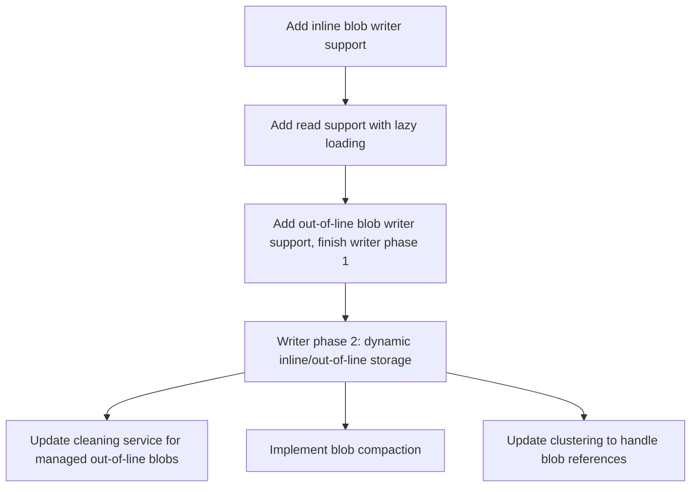

<!--
  Licensed to the Apache Software Foundation (ASF) under one or more
  contributor license agreements.  See the NOTICE file distributed with
  this work for additional information regarding copyright ownership.
  The ASF licenses this file to You under the Apache License, Version 2.0
  (the "License"); you may not use this file except in compliance with
  the License.  You may obtain a copy of the License at

       http://www.apache.org/licenses/LICENSE-2.0

  Unless required by applicable law or agreed to in writing, software
  distributed under the License is distributed on an "AS IS" BASIS,
  WITHOUT WARRANTIES OR CONDITIONS OF ANY KIND, either express or implied.
  See the License for the specific language governing permissions and
  limitations under the License.
-->
# RFC-100: Unstructured Data Storage in Hudi

## Proposers

- @rahil-c
- @the-other-tim-brown
- @vinothchandar

## Approvers
 - @balaji-varadarajan-ai
 - @yihua

## Status

Issue: <Link to GH feature issue>

> Please keep the status updated in `rfc/README.md`.

## Abstract

This RFC proposes extending Apache Hudi storage to support unstructured data storage alongside traditional structured data within a unified table format. Building on RFC-80's column groups and RFC-99's BLOB type system, 
this feature enables users to create tables with mixed structured and unstructured columns, with intelligent storage strategies for different data types. The proposal introduces hybrid storage formats within 
file groups, dynamic inline/out-of-line storage decisions for BLOB data, and seamless integration with existing Hudi table services and other table lifecycle operations.

## Background

The modern data landscape is rapidly evolving beyond traditional structured data. In the era of AI and machine learning, organizations need to manage diverse data types including images, videos, audio files, documents, 
embeddings, and other unstructured content alongside their traditional tabular data. Current lakehouse architectures, including Hudi, are primarily optimized for structured data storage and querying, 
creating significant limitations for AI-driven workloads.

### Lakehouses + Unstructured Data. Why?

**AI/ML Workload Requirements**: Modern AI applications require co-location of structured metadata with unstructured content. For example, a computer vision pipeline might need product metadata (structured) 
alongside product images (unstructured) in the same table. Currently, users must maintain separate storage systems, leading to data consistency issues and complex pipeline orchestration.

**Unified Data Management**: Organizations benefit from applying the same governance, versioning, and ACID properties to both structured and unstructured data. Hudi's ACID semantics, metadata tracking, indexing, 
incremental processing, and table services should extend to unstructured data to provide a unified data management experience.

**Performance and Scalability**: Unstructured data storage as raw files in object storage, suffers from the same bottlenecks -- too many small objects, costly cloud storage GET calls, misaligned partitioning schemes --
that Hudi solves for structured data storage already.

**Leap to AI-enabled open data storage**: By extending Hudi to unstructured data storage, in a way that seamlessly co-exists with current structured data columns, users can't seamlessly adapt their workflows to use of AI. For e.g.
a SEO company now pivoting to optimize content for AI search, can store raw Internet documents right inside the same table, by simply adding and backfilling a new BLOB column `doc` that is populated by reading a `url` 
column that already exists.


### Building on Existing Foundation

This RFC leverages foundation pieces:

1**RFC-99 BLOB Types**: Introduces BLOB types to the Hudi type system, providing the type foundation for unstructured data storage.

## Requirements 

Below are the high-level requirements for this feature.

1. Users must be able to define tables with a mix of structured (current types) and unstructured (blob type)
   columns
2. Unstructured data can be stored inline (e.g small images right inside the file) or out-of-line (e.g
   pointer to a multi-GB video file someplace). Out-of-line references can also include a (position, length) within the file which 
   allows multiple blobs to be stored within a single file to reduce the number of files in storage. 
   This decision should be made dynamically during write/storage time.
3. All table life-cycle operations and table services work seamlessly across both column types.for e.g cleaning
   the file slices should reclaim out-of-line blob data when the referred blob is managed by Hudi. 
   Clustering should be able re-organize records across file groups or even repack blobs if required.
4. Hudi should expose controls at the writer level, to control whether to store blobs inline or out-of-line
   based on size thresholds. Sane defaults should be supported for easy out-of-box experience. for e.g < 1MB is stored inline. > 16 MB is always stored out-of-line.
5. Query engines like Spark should be able to read the unstructured data and materialize the values lazily to reduce memory pressure and massive data exchange volumes during shuffles.


## High-Level Design

The design introduces an abstraction that allows inline and out-of-line storage of byte arrays that work seamlessly for the end user. Structured columns continue using 
Parquet format, while unstructured data can use specialized formats like Lance or optimized Parquet configurations or HFile for random-access.

### 1. Storage Abstraction
We will add a `blob` type to the HoodieSchema that encapsulates both inline and out-of-line storage strategies. This will allow the user to use a mix of storage strategies seamlessly.

**Storage Schema**:
```json
{
  "type": "record",
  "name": "Blob",
  "fields": [
    {"name": "storage_type", "type": "string"},
    {"name": "data", "type": ["null", "bytes"]},
    {"name": "reference", "type": ["null", {
      "type": "record",
      "name": "BlobReference",
      "fields": [
        {"name": "external_path", "type": "string"},
        {"name": "offset", "type": "long"},
        {"name": "length", "type": "long"},
        {"name": "managed", "type": "boolean"}
      ]
    }]}
  ]
}
```
The `managed` flag will be used by the cleaner to determine if an out-of-line blob should be deleted when cleaning up old file slices. This allows users to point to existing files without Hudi deleting them.

### 2. Reader
Readers will be updated to allow for lazy loading of the blob data, even when it is inline. This will help reduce memory pressure during shuffles in distributed query engines like Spark.
The readers will return a reference to the blob data in the form of a path, position, and size. This applies for both inline and out-of-line storage.

We will provide the user with a prebuilt transform to effectively read the out-of-line blob data. For example, for Spark datasets we will leverage a Map-Partitions to batch requests to read blob data when the rows correspond to ranges within the same file. 

For Spark SQL we will provide a function that the user can leverage to materialize the bytes from the blobs. Example syntax:
```sql
SELECT id, url, resolve_blob(image_blob) as image_bytes FROM my_table;
```

### 3. Writer
#### Phase 1: Basic Blob Support
The writer will be updated to support writing blob data in both inline and out-of-line formats. 
For out-of-line storage, the assumption is that the user will provide the external path, position, and size of the blob data and these references will not be managed by Hudi (they are not removed by the cleaner).
In this phase, we will not implement dynamic inline/out-of-line storage based on size thresholds.

The writer should be flexible enough to allow the user to pass in a dataset with blob data as simple byte arrays or records matching the Blob schema defined above.

Users will be able to create tables with Spark SQL as well by defining custom DDL that allows them to specify a column as a BLOB type. Example syntax:
```sql
CREATE TABLE my_table (
    id STRING,
    url STRING,
    image_blob BLOB
) USING hudi
TBLPROPERTIES (
  'hoodie.table.type' = 'MERGE_ON_READ',
  'primaryKey ='id'
)
```

#### Phase 2: Dynamic Inline/Out-of-Line Storage
In this phase, the writer will be updated to support dynamic inline/out-of-line storage based on user configured size thresholds. The user will still be able to provide their own external path for out-of-line storage if desired.
When the user provides blob data in the form of byte arrays, the writer will take arrays larger than the configured threshold and write them to files. The user can configure the file type used for this storage (e.g Parquet, HFile, Lance, etc).
The writer will then generate the appropriate BlobReference for the out-of-line storage and write that to the main file.
Multiple blobs can be written to the same file to reduce the number of files created in storage. All of these blobs will belong to the same file group for ease of management.

**Configurations**: 
- `hoodie.storage.blob.inline.threshold`: Size threshold in bytes for inline vs out-of-line storage.
- `hoodie.storage.blob.outofline.container.maxElementSize`: Size threshold in bytes for blobs that can be stored within a container file. Blobs larger than this threshold will be stored in their own individual files.
- `hoodie.storage.blob.outofline.container.maxFileSize`: Size threshold in bytes for maximum size of an out-of-line blob container file.
- `hoodie.storage.blob.outofline.format`: File format to use for out-of-line blob storage.

**External Storage Layout**:
```
{table_path}/.hoodie/blobs/{partition}/{column_name}/{instant}/{blob_id}
```

#### Writer Optimizations for Blob Storage
##### Parquet
For unstructured column groups using Parquet:
- **Disable Compression**: Avoid double compression of already compressed media files
- **Plain Encoding**: Use PLAIN encoding instead of dictionary encoding for BLOB columns
- **Large Page Sizes**: Configure larger page sizes to optimize for sequential BLOB access
- **Metadata Index**: Maintain BLOB metadata in Hudi metadata table for efficient retrieval of a single blob value.
- **Disable stats**: Not very useful for BLOB columns
##### Lance
- Native support for high-dimensional vectors and embeddings
- Efficient columnar storage for mixed structured/unstructured data
- Better compression for certain unstructured data types

Supporting Lance, working across Hudi + Lance communities will help users unlock benefits of both currently supported
file formats in Hudi (parquet, orc), along with benefits of Lance. Over time, we could also incorporate newer emerging
file formats in the space and other well-established unstructured file formats.


### 4. Table Services
#### Cleaning
The cleaning service will be updated to identify the out-of-line blob references that are managed by Hudi and no longer referenced by any active file slices.
To identify these references, we have three options:
1. Scan all active file slices to build a set of referenced blob IDs and then scan the file slices being removed to identify references in the removed slices that are not in the active set.
2. Maintain metadata on the blob references contained in the file in the footer or metadata section of each base and log file. The cleaner can then read this metadata to identify blob references in the removed slices and check if they are still referenced in active slices.
3. Maintain an index in the metadata table that tracks all blob references and their reference counts. The cleaner can then use this index to identify unreferenced blobs.

**Note**: This is only required for out-of-line blobs that are managed by Hudi. Out-of-line blobs that are not managed by Hudi will not be deleted by the cleaner. This will be part of `Phase 2` of the writer implementation.

#### Blob Compaction
We will introduce a new form of compaction that allows for repacking of out-of-line blobs managed by Hudi to reduce the number of files in storage.
The compaction will scan the out-of-line blob references that are active within the file group and repack them into new container files based on a user configured target file size.
The repacking will also pack these blobs based on the base file row's ordering to improve read locality.

#### Clustering
Since the out-of-line blobs are part of the file group, managed references will need to be updated as part of the clustering operation.
The clustering will need to read the blob references from the source file groups and rewrite them to new target file groups. 
These new files will be created in the same manner as the writer, using the configured inline/out-of-line storage strategy.

### 5. Query Engine Integration

**Spark Integration**:
- Extend DataSource API to handle mixed column group formats
- Implement vectorized readers for new file formats like Lance
- Support predicate pushdown across different storage formats
- Dynamically, lazily fetch BLOB values to avoid shuffling large blobs.

**Ray Integration**:
- Native support for reading unstructured data into Ray datasets using Ray/Hudi integration.
- Efficient BLOB streaming for distributed ML workloads
- Integration with Ray's object store for large BLOB caching

### 6. Metadata Table Extensions

- Track BLOB references for garbage collection
- Store maintain indexes for parquet based blob storage
- Maintain size statistics for storage optimization
- Support BLOB-based query optimization

## Development Plan



## Rollout/Adoption Plan

WIP

## Test Plan

WIP