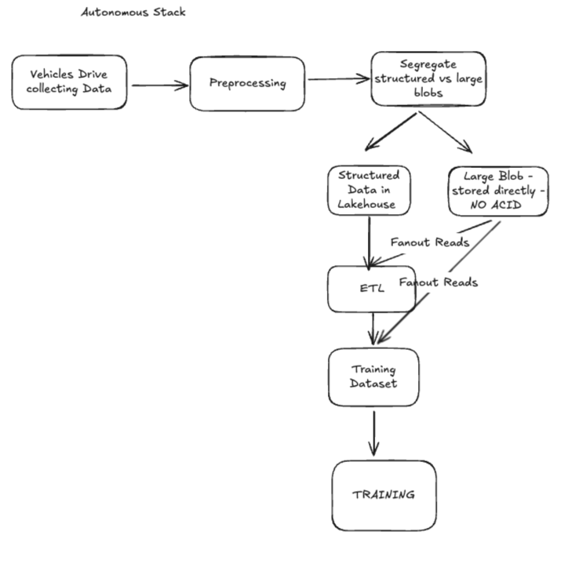

<!--
  Licensed to the Apache Software Foundation (ASF) under one or more
  contributor license agreements.  See the NOTICE file distributed with
  this work for additional information regarding copyright ownership.
  The ASF licenses this file to You under the Apache License, Version 2.0
  (the "License"); you may not use this file except in compliance with
  the License.  You may obtain a copy of the License at

       http://www.apache.org/licenses/LICENSE-2.0

  Unless required by applicable law or agreed to in writing, software
  distributed under the License is distributed on an "AS IS" BASIS,
  WITHOUT WARRANTIES OR CONDITIONS OF ANY KIND, either express or implied.
  See the License for the specific language governing permissions and
  limitations under the License.
-->
# RFC-100: Unstructured Data Storage in Hudi

## Proposers

- @rahil-c
- @the-other-tim-brown
- @vinothchandar

## Approvers
 - @balaji-varadarajan-ai
 - @yihua

## Status

Issue: <Link to GH feature issue>

> Please keep the status updated in `rfc/README.md`.

## Abstract

This RFC proposes extending Apache Hudi storage to support unstructured data storage alongside traditional structured data within a unified table format. Building on RFC-80's column groups and RFC-99's BLOB type system, 
this feature enables users to create tables with mixed structured and unstructured columns, with intelligent storage strategies for different data types. The proposal introduces hybrid storage formats within 
file groups, dynamic inline/out-of-line storage decisions for BLOB data, and seamless integration with existing Hudi table services and other table lifecycle operations.

## Background

The modern data landscape is rapidly evolving beyond traditional structured data. In the era of AI and machine learning, organizations need to manage diverse data types including images, videos, audio files, documents, 
embeddings, and other unstructured content alongside their traditional tabular data. Current lakehouse architectures, including Hudi, are primarily optimized for structured data storage and querying, 
creating significant limitations for AI-driven workloads.

### Lakehouses + Unstructured Data. Why?

**AI/ML Workload Requirements**: Modern AI applications require co-location of structured metadata with unstructured content. For example, a computer vision pipeline might need product metadata (structured) 
alongside product images (unstructured) in the same table. Currently, users must maintain separate storage systems, leading to data consistency issues and complex pipeline orchestration.

**Unified Data Management**: Organizations benefit from applying the same governance, versioning, and ACID properties to both structured and unstructured data. Hudi's ACID semantics, metadata tracking, indexing, 
incremental processing, and table services should extend to unstructured data to provide a unified data management experience.

**Performance and Scalability**: Unstructured data storage as raw files in object storage, suffers from the same bottlenecks -- too many small objects, costly cloud storage GET calls, misaligned partitioning schemes --
that Hudi solves for structured data storage already.

**Leap to AI-enabled open data storage**: By extending Hudi to unstructured data storage, in a way that seamlessly co-exists with current structured data columns, users can't seamlessly adapt their workflows to use of AI. For e.g.
a SEO company now pivoting to optimize content for AI search, can store raw Internet documents right inside the same table, by simply adding and backfilling a new BLOB column `doc` that is populated by reading a `url` 
column that already exists.



### Building on Existing Foundation

This RFC leverages two key foundation pieces:

1. **RFC-80 Column Groups**: Provides the mechanism to split file groups across different column groups, enabling efficient storage of different data types within the same logical file group.

2. **RFC-99 BLOB Types**: Introduces BINARY and LARGE_BINARY types to the Hudi type system, providing the type foundation for unstructured data storage.

## Requirements 

Below are the high-level requirements for this feature.

1. Users must be able to define tables with a mix of structured (current types) and unstructured (blob type)
   columns
2. Records are distributed across file groups like regular Hudi storage layout into file groups. But within each
   file group, structured and unstructured columns are split into different column groups. This way the table can
   also scalably grow in terms of number of columns.
3. Unstructured data can be stored inline (e.g small images right inside the column group) or out-of-line (e.g
   pointer to a multi-GB video file someplace). This decision should be made dynamically during write/storage time.
3. All table life-cycle operations and table services work seamlessly across both column types.for e.g cleaning
   the file slices should reclaim both inline and out-of-line blob data. Clustering should be able re-organize
   records across file groups or even redistribute columns across column groups within the same file group.
4. Storage should support different column group distributions i.e different membership of columns
   across column groups, across file groups, to ensure users or table services can flexibly reconfigure all this as
   table grows, without re-writing all of the data.
5. Hudi should expose controls at the writer level, to control whether new columns are written to new column
   groups or expand an existing column group within a file group.


## High-Level Design

The design introduces a hybrid storage model where each file group can contain multiple column groups with different file formats optimized for their data types. Structured columns continue using 
Parquet format, while unstructured columns can use specialized formats like Lance or optimized Parquet configurations or HFile for random-access.

### 1. Mixed Base File Format Support

**Per-Column Group Format Selection**: Each column group within a file group can use different base file formats:
- **Structured Column Groups**: Continue using Parquet with standard optimizations
- **Unstructured Column Groups**: Use Lance format for vector/embedding data or specially configured Parquet for BLOB storage

**Format Configuration**: File format is determined at column group creation time based on (per the current RFC-80). 
But, ideally all these configurations should be automatic and Hudi should auto-generate colum group names and mappings.


```sql
CREATE TABLE multimedia_catalog (
  id BIGINT,
  product_name STRING,
  category STRING,
  image BINARY,
  video LARGE_BINARY,
  embeddings ARRAY<FLOAT>
) USING HUDI
TBLPROPERTIES (
  'hoodie.table.type' = 'MERGE_ON_READ',
  'hoodie.bucket.index.hash.field' = 'id',
  'hoodie.columngroup.structured' = 'id,product_name,category;id',
  'hoodie.columngroup.images' = 'id,image;id',
  'hoodie.columngroup.videos' = 'id,video;id',
  'hoodie.columngroup.ml' = 'id,embeddings;id',
  'hoodie.columngroup.images.format' = 'parquet',
  'hoodie.columngroup.videos.format' = 'lance',
  'hoodie.columngroup.ml.format' = 'hfile'
)
```

### 2. Dynamic Inline/Out-of-Line Storage

**Storage Decision Logic**: During write time, Hudi determines storage strategy based on:
- **Inline Storage**: BLOB data < 1MB stored directly in the column group file, to avoid excessive cloud storage API calls.
- **Out-of-Line Storage**: Large BLOB data stored in dedicated object store locations with pointers in the main file, to avoid write amplification during updates.


**Storage Pointer Schema**:
```json
{
  "type": "record",
  "name": "BlobPointer",
  "fields": [
    {"name": "storage_type", "type": "string"},
    {"name": "size", "type": "long"},
    {"name": "checksum", "type": "string"},
    {"name": "external_path", "type": ["null", "string"]},
    {"name": "compression", "type": ["null", "string"]}
  ]
}
```

**External Storage Layout**:
```
{table_path}/.hoodie/blobs/{partition}/{file_group_id}/{column_group}/{instant}/{blob_id}
```
Alternatively, User should be able to specify external storage location per BLOB during writes, as needed.

### 3. Parquet Optimization for BLOB Storage

For unstructured column groups using Parquet:
- **Disable Compression**: Avoid double compression of already compressed media files
- **Plain Encoding**: Use PLAIN encoding instead of dictionary encoding for BLOB columns
- **Large Page Sizes**: Configure larger page sizes to optimize for sequential BLOB access
- **Metadata Index**: Maintain BLOB metadata in Hudi metadata table for efficient retrieval of a single blob value.
- **Disable stats**: Not very useful for BLOB columns

### 4. Lance Format Integration

**Lance Advantages for Unstructured Data**:
- Native support for high-dimensional vectors and embeddings
- Efficient columnar storage for mixed structured/unstructured data
- Better compression for certain unstructured data types

Supporting Lance, working across Hudi + Lance communities will help users unlock benefits of both currently supported 
file formats in Hudi (parquet, orc), along with benefits of Lance. Over time, we could also incorporate newer emerging 
file formats in the space and other well-established unstructured file formats.

### 5. Enhanced Table Services

**Cleaning Service Extensions**:
- Track external BLOB references in metadata table
- Implement cascading deletion of external BLOB files during cleaning
- Add BLOB-specific retention policies, using reference counting to reclaim out-of-line blobs.

**Compaction Service Extensions**:
- Support cross-format compaction (merge Lance and Parquet column groups)
- Implement BLOB deduplication during major compaction
- Optimize external BLOB consolidation

**Clustering Service Extensions**:
- Enable redistribution of BLOB data across file groups
- Support column group reconfiguration during clustering
- Implement BLOB-aware data skipping strategies

### 6. Flexible Column Group Management

**Dynamic Column Group Creation**:
```java
// Writer API extensions
HoodieWriteConfig config = HoodieWriteConfig.newBuilder()
  .withColumnGroupStrategy(ADAPTIVE) // AUTO, FIXED, ADAPTIVE
  .withNewColumnGroupThreshold(100_000_000L) // 100MB
  .withBlobStorageThreshold(1_048_576L) // 1MB
  .build();
```

**Column Group Reconfiguration**:
- Support splitting existing column groups when they grow too large
- Enable merging small column groups during maintenance operations
- Allow migration of columns between column groups

### 7. Query Engine Integration

**Spark Integration**:
- Extend DataSource API to handle mixed column group formats
- Implement vectorized readers for new file formats like Lance
- Support predicate pushdown across different storage formats
- Dynamically, lazily fetch BLOB values to avoid shuffling large blobs.

**Ray Integration**:
- Native support for reading unstructured data into Ray datasets using Ray/Hudi integration.
- Efficient BLOB streaming for distributed ML workloads
- Integration with Ray's object store for large BLOB caching

### 8. Metadata Table Extensions

- Track BLOB references for garbage collection
- Store maintain indexes for parquet based blob storage
- Maintain size statistics for storage optimization
- Support BLOB-based query optimization

## Rollout/Adoption Plan

WIP

## Test Plan

WIP