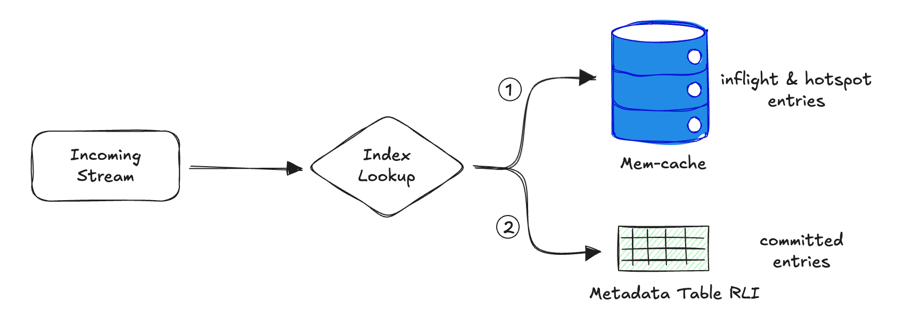
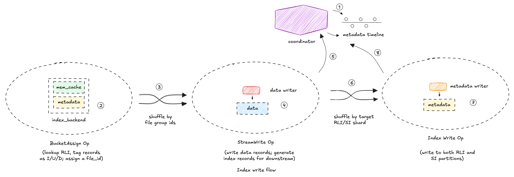
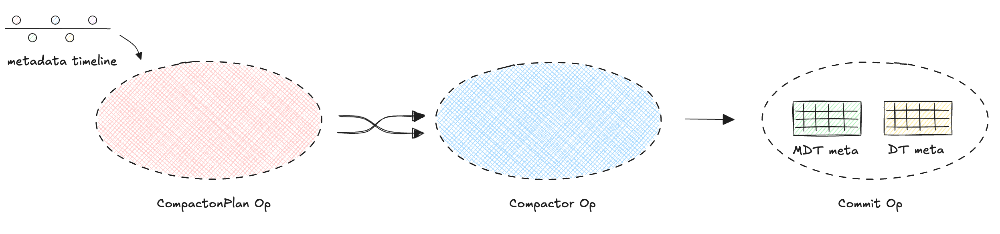

   <!--
  Licensed to the Apache Software Foundation (ASF) under one or more
  contributor license agreements.  See the NOTICE file distributed with
  this work for additional information regarding copyright ownership.
  The ASF licenses this file to You under the Apache License, Version 2.0
  (the "License"); you may not use this file except in compliance with
  the License.  You may obtain a copy of the License at

       http://www.apache.org/licenses/LICENSE-2.0

  Unless required by applicable law or agreed to in writing, software
  distributed under the License is distributed on an "AS IS" BASIS,
  WITHOUT WARRANTIES OR CONDITIONS OF ANY KIND, either express or implied.
  See the License for the specific language governing permissions and
  limitations under the License.
-->
# RFC-102: RLI support for Flink streaming

## Proposers

- @danny0405

## Approvers
 - @geserdugarov
 - @vinothchandar
 - @cshuo

## Status

GH Discussion: https://github.com/apache/hudi/discussions/17452

> Please keep the status updated in `rfc/README.md`.

## Abstract
This RFC aims to introduce RLI support for Flink streaming:

- Impl reliable and performant write and read support for RLI via Flink APIs;
- The RLI impl is engines compatible, for e.g, Flink can access and utilize the RLI written by Spark and vice versa;
- The RLI is global, upserts among partitions is supported; Also support partition level RLI for large fact tables;
- Async compaction for MDT when RLI is enabled; in writer pipeline or table services background job;
- Smart caching of RLI;
- Clearly set limits for the kind of write throughput supported by RLI (based on certain average response time for the RLI access, like from x0ms to x00ms) via empirical benchmarks;
- Ability to be expanded to arbitrary secondary indexing on different columns.

## Background
Flink does not support RLI while spark does, this caused inconsistency between engines, for tables migrated from Spark to flink streaming, the index type needs to be switched to either bucket or flink_state , this caused a overhead for users in production.

Another reason is for multiple partition upserts, currently the only choice is flink_state index, but the flink_state actually costs a lot of memory and can not be shared between different workloads.

## Implementation

The high-level ideas:

- a RLI based index backend will be there to replace the flink_state index;
- a cache of RLI would be introduced to speed the access;
- a separate index function to write the RLI/SI payloads;
- the MDT RLI files is written synchronously with the data table data files, the metadata is sent to the coordinator for a final commit to the MDT(after `FILES` partition is ready);
- the MDT compaction is switched to be async and the data files compaction pipeline is reused for less take up of task slots.

### The Write

### The RLI Access
In `BucketAssigner` operator, the RLI index metadata would be utilized as the index backend, the `BucketAssigner` operator will probe the RLI with the incoming record keys to figure out whether msg is update or insert or delete.
In other words, the RLI index metadata will serve as the same role of the `flink_state` index.

#### The Cache of RLI Access
We need fast access in streaming to have high throughput(ideally per record access should be < 10ms), thus a general hotspot cache is needed. We will build a in-memory LRU cache by the active upsert records keys, the cache items will be force evictted by a configured memory threshold.

We also need a memory cache for the index mappings of current checkpoint because it is not committed to Hudi table yet so invisible.
This cache can be cleaned once the checkpoint/instant is committed to Hudi(indicates that the index payloads are also committed).

On job restart or task failover, there is use case that the checkpoint succeeds on Flink while the instant is not committed to Hudi, for DT metadata, the pipeline will recommit
the instant with the recovered table metadata, because the `BucketAssigner` operator is the upstream operator of `StreamWrite` operator, there is time gap for these inflight instants to recommit,
and we do not want to block the processing of `BucketAssigner`(to wait for the inflight instants to recommit successfully). The suggested solution is
to include these special inflight instants on RLI access queries, basically, we need to support reading inflight instants on MDT.
These inflight instants are the ones whose corresponding checkpoint has succeeded, inflight instants without successful checkpoint are not included.
See more details in the appendix for Job/Task failover.

The query will access the in-memory cache first then the MDT RLI index:

### The Shuffle of RLI Payloads
In `StreamWrite` operator, the index items are inferred and sent to `IndexWrite` operator in streaming style, the index records are shuffled by `hash(record_key) % num_rli_shards`(the same hashing algorithm of the MDT `RLI index` partitioner),
this is critical to avoid `N*M` files to write to MDT partition(`N` is the RLI partition buckets number, `M` is the data table buckets involved in the current write).

How do we ensure the data record and index record always belong to one commit/checkpoint: the barrier is flowing together with the records in Flink, see [how-does-state-snapshotting-work](https://nightlies.apache.org/flink/flink-docs-master/docs/learn-flink/fault_tolerance/#how-does-state-snapshotting-work),
when the `StreamWrite` operator received a record, it emits its corresponding index record in one `#processElement` call, so we can always keep the bindings of these two, in other words, no barrier would be amidst of the two.

### The RLI Write
In `IndexWrite` operator, the index items are buffered first and write to the MDT (triggered by Flink checkpoint), the write status metadata will be sent to the `coordinator`. The metadata sent to the coordinator includes two parts:

- A: the written data file handles ;
- B: the written MDT file handles(specifically under the RLI/SI partition)

#### The Commit of MDT(including RLI)
And when commit to the data table, the MDT is committed firstly with the partial RLI/SI write metadata list(the MDT RLI/SI partition file handles info), the `RLI` and `SI` partition file handles info would be committed altogether with the `FILES` partition.

On Flink checkpoint : each index/data writing task flushes all its records to RLI and data files respectively. So the RLI and data files are always consistent. We commit both as we do now, from Coordinator into a single hudi commit.

In order to keep exactly once semantics for job recovery, the write status metadata will also need to be stored both in the `StreamWrite` operator, `IndexWrite` operator and the `coordinator`, pretty much the same behaviors of the current maintenance of the data table metadata.

### The Compaction
In order not take up too much task slot, we will reuse the current compaction sub-pipeline for scalable execution of the MDT compaction, it is auto applied when RLI is enabled.

## Rollout/Adoption Plan

 - What impact (if any) will there be on existing users?
   - No impact because it is a new feature

## Test Plan

1. Ensure that all write/read scenarios with the RLI enabled;
2. Ensure the async compaction with mixed DT/MDT work as expected;
3. Add new test to cover the job recovery with uncommitted DT/MDT commits;
4. Benchmark to get the upper threshold volume that suggests to enable RLI on streaming.

## Appendix

### The Job/Task failover

In order to keep exactly-once semantics, we have some basic infra to support the job/task recovery:

1. in `coordinator`, the history uncommitted metadata is stored in the checkpoint;
2. in `StreamWrite` operator, the current write metadata list would be stored in the checkpoint;

When the job is restarted, these steps are triggered to recover the uncommitted instants:

1. the `StreamWrite` will check whether there are pending instants in the checkpoint and will resend an event to `coordinator` to collect the uncommitted metadata;
2. the `coordinator` will recover the write metadata list from checkpoint;
3. the `coordinator` recommits the uncommitted instants with the metadata list from 1 and 2.