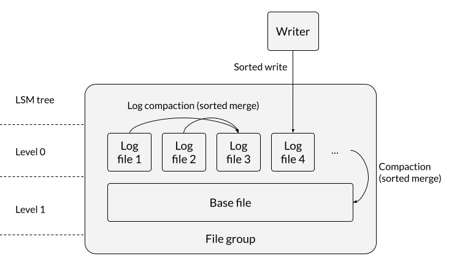
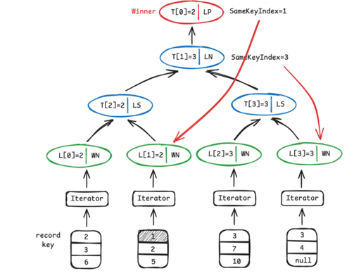

 <!--
  Licensed to the Apache Software Foundation (ASF) under one or more
  contributor license agreements.  See the NOTICE file distributed with
  this work for additional information regarding copyright ownership.
  The ASF licenses this file to You under the Apache License, Version 2.0
  (the "License"); you may not use this file except in compliance with
  the License.  You may obtain a copy of the License at

       http://www.apache.org/licenses/LICENSE-2.0

  Unless required by applicable law or agreed to in writing, software
  distributed under the License is distributed on an "AS IS" BASIS,
  WITHOUT WARRANTIES OR CONDITIONS OF ANY KIND, either express or implied.
  See the License for the specific language governing permissions and
  limitations under the License.
-->
# RFC-103: Hudi LSM tree layout

## Proposers

- @zhangyue19921010
- @xushiyan

## Approvers

- @danny0405
- @vinothchandar

## Status

Main issue: https://github.com/apache/hudi/issues/14310

## Background

LSM Trees (Log-Structured Merge-Trees) are data structures optimized for write-intensive workloads and are widely used in modern database systems such as Paimon, LevelDB, RocksDB, Cassandra, etc. By leveraging sequential writes and a tiered merge (compaction) mechanism, they offer clear advantages in:

- **High write throughput**
- **Efficient, tiered compaction**
- **Optimized read paths**

## Goal

This RFC proposes applying LSM-inspired principles (**sequential writes + tiered merges**) to improve the data organization protocol for **Hudi MOR tables**, and replacing **Avro** with **Parquet** as the on-disk format for individual log files, to achieve:

1. Improve the **read performance**, **write performance**, and **overall stability** of MOR tables—especially for **wide tables**—in scenarios such as:
   - predicate pushdown
   - point lookups
   - column/data pruning
2. Improve the **performance** and **stability** of MOR **compaction**
3. Increase the **compression ratio** of log files

## Design Overview



The core idea is to treat, **within each file group**:

- **Log files** as **Level-0 (L0)** of an LSM tree
- The only **Base file** as **Level-1 (L1)**

The file naming formats for base and log files should retain unchanged.

To realize this layout:

- Records inside **log and base files must be sorted by record key(s)** (**Core Feature 1**)
- Records should be deduplicated before writing to any log file, i.e., no dups within a log file. Duplicates can be seen across log files.
- Existing services should implement **sorted merge-based compaction**:
  - **log-compaction** handles **L0 compaction**
  - **compaction table service** handles **L0 → L1 compaction**
  - both use a **sorted merge algorithm** (**Core Feature 2**)

## Considerations

### Table configs

The layout should be enforced by a table property, for e.g. `hoodie.table.storage.layout=default|lsm_tree` (default value: `default`, which is current base/log file organization):

- The config is not allowed to be set to `lsm_tree` for an existing table
- The config is allowed to be set to `default` for an existing table
- The config is set to `default` by default

The layout is only applicable to MOR table, and not applicable to COW. When setting the layout config for a COW table, the persisted config for the layout will always be false.

When an LSM-tree layout enabled MOR table is migrated to COW, the layout config will automatically set to `default`.

### Engine-agnostic

The layout should be engine-agnostic. Writer engines can make use of shared implementation and add specific logic or design to comform to the layout.

For example, Flink writers use buffer sort, the Flink sink must flush sorted records into a single file to guarantee file-level ordering.

### Write operations

Write operations should remain semantically unchanged when the layout is enabled.

In MOR tables, when **small file handling** occurs, inserts may be bin-packed into file slices without log files, creating a new base file, the **sorted write** needs to be applied.

The most performant writer setup for LSM tree layout will be bucket index + bulk insert, which best utilizes sorted merging. The downside would be that small files may proliferate, which can be mitigated by doing log compaction.

### Indexes

Writer indexes should still function as is under this layout. Same for reader indexes.

### Clustering

Clustering will be restricted to **record key sorting** only.

For **MOR + bucket index** setup, clustering is typically not needed.

## Core Feature 1: Sorted Write

All writes are sorted. That is, within any written file (**base or log**), records are fully sorted by record key(s).

All write operations and writer index types should be supported, as the layout is only about keeping records sorted in data files, which is orthogonal to the choice of write operation and index type.

### Example: Flink Streaming Write Pipeline


The write pipeline mainly consists of four core stages:

- **Repartitioning**
- **Sorting**
- **Deduplication**
- **I/O**

Optimizations:

1. **Asynchronous processing architecture**  
   Introduce a **Disruptor ring buffer** within the sink operator to decouple production and consumption, significantly improving throughput and handling cases where the producer outpaces the consumer.

2. **Efficient memory management**  
   Integrate Flink’s built-in **MemorySegmentPool** with **BinaryInMemorySortBuffer** to enable fine-grained memory control and efficient sorting, greatly reducing GC pressure and sorting overhead.

## Core Feature 2: Sorted Merge Read / Compaction



During read and compaction, merging is performed using a **sorted merge algorithm** (e.g., **loser-tree** for k-way merge).

- Resulting **log files** contain fully sorted records
- Resulting **base files** contain fully sorted records
- File group reads reuse the same sorted merge logic, with **predicate pruning** applied when present

### Implementation tasks

- Implement sorted merge: **Loser tree** for **k-way merge**
- Reuse existing **Record Merger APIs**
- Update the following components to use sorted merge:
  - Log compaction
  - Compaction runner (L0 → L1)
  - File group reader

---

## Enhancement Features

These features amplify the benefits of the LSM layout but are not strictly required by the layout itself but can optimize the performance and user experience of LSM.

## Log format v2: native log file format

### Current log format (v1)

Current log format is organized as below (ref: [tech spec v8](https://hudi.apache.org/learn/tech-specs-1point0#log-format)):

```text
#HUDI# (magic, 6 bytes)
Block Size (8 bytes)
Log Format Version (4 bytes)
Block Type (4 bytes)
Header Metadata (variable)
Content Length (8 bytes)
Content (variable) - data block, embedded Avro/Parquet/HFile binary data
Footer Metadata (variable)
Reverse Pointer (8 bytes)
```

These fields are encoded into a custom binary format and stored in log files with extension like `.log.<version>_<write_token>`.

### Proposed log format v2

The proposed new log format leverages native file format's metadata layer to capture the metadata fields defined by Hudi log format, while keeping the content field (data block). Take parquet for example:

```text
Row group 1 (data)
Row group 2 (data)
...
Footer
  - Parquet schema
  - Row group metadata
  - key-value metadata <-- Hudi log format metadata goes in here
```

All Hudi log format metadata can be stored as key value pairs

| Hudi log format metadata                     | Parquet footer key                        |
|:---------------------------------------------|:------------------------------------------|
| log format version                           | `hudi.log.format_version`                 |
| block type                                   | `hudi.log.block_type`                     |
| `INSTANT_TIME`                               | `hudi.log.instant_time`                   |
| `TARGET_INSTANT_TIME`                        | `hudi.log.target_instant_time`            |
| `SCHEMA`                                     | NA (use Parquet's native schema)          |
| `COMMAND_BLOCK_TYPE`                         | `hudi.log.command_block_type`             |
| `COMPACTED_BLOCK_TIMES`                      | `hudi.log.compacted_block_times`          |
| `RECORD_POSITIONS`                           | `hudi.log.record_positions`               |
| `BLOCK_IDENTIFIER`                           | `hudi.log.block_identifier`               |
| `IS_PARTIAL`                                 | `hudi.log.is_partial`                     |
| `BASE_FILE_INSTANT_TIME_OF_RECORD_POSITIONS` | `hudi.log.base_file_instant_of_positions` |

### Why native file format over embedded Parquet blocks?

An alternative approach is to keep the V1 log format structure and embed Parquet-encoded data as block content. However, the embedding approach has drawbacks compared to using native Parquet files:

| Aspect                    | Embedded Parquet (V1)                                                                                                      | Native Parquet (V2)                                          |
|---------------------------|----------------------------------------------------------------------------------------------------------------------------|--------------------------------------------------------------|
| **Parquet optimizations** | Vectorized reads, predicate pushdown, column pruning available after block location                                        | Available directly at file read                              |
| **Write model**           | Designed for append (for HDFS, not for object storage)                                                                     | Write-once model (aligns with object storage)                |
| **Reading overhead**      | Must read log block header first, then use InLineFileSystem abstraction with offset translation to access embedded content | Direct Parquet file read with metadata immediately available |
| **Tool compatibility**    | Requires Hudi-specific readers                                                                                             | Any Parquet-compatible tool can read                         |
| **Compression**           | Block-level only                                                                                                           | Parquet's columnar encoding                                  |
| **Schema storage**        | Duplicated in header and content                                                                                           | Consolidated in Parquet footer                               |

### Block type handling

**Data blocks**: The entire file is a native Parquet file with `hudi.log.block_type` = `parquet_data`. Schema is stored natively in Parquet footer (no duplication).

**Delete blocks**: Store delete records as Parquet with a delete schema containing record key, partition path, and ordering value. Set `hudi.log.block_type` = `delete`.

**Command blocks**: Create Parquet file with zero row groups (metadata only). Set `hudi.log.block_type` = `command` along with `hudi.log.command_block_type` and `hudi.log.target_instant_time`.

**CDC blocks**: Same structure as data blocks with CDC schema. Set `hudi.log.block_type` = `cdc`.

### Compatibility

1. **File naming**: Remain consistent with existing log file naming to ensure compatibility
2. **Writer changes**: Block append operations are no longer supported. During writes, input data is written directly to new Parquet files
3. **Reader changes**: Detect format via magic bytes (Parquet magic vs Hudi magic).

| Scenario                             | Behavior                                   |
|:-------------------------------------|:-------------------------------------------|
| V2 reader reading V1 files           | Supported (detect by magic bytes)          |
| V1 reader reading V2 files           | Not supported (expected for older readers) |
| Mixed V1/V2 files in same file slice | Supported (reader detects per-file)        |

## Hybrid Compaction Strategy

Hudi currently supports two compaction types:

- Full compaction (`WriteOperationType.COMPACT`): merge log files with the target base file within the same file group and produce a new base file
- Log compaction (`WriteOperationType.LOG_COMPACT`): merge multiple log files into a larger log file within the same file group

The key limitation is the operational overhead: users have to schedule 2 types of compaction, configure separate strategies, and run different jobs to optimize the storage layout for MOR tables.

In this RFC, we introduce a new hybrid compaction strategy that combines full compaction and log compaction. The compaction plan tracks individual file groups and determines which compaction type each file group needs.

- Triggering: same as existing triggering strategy (`NUM_COMMITS`, `TIME_ELAPSED`, etc).
- Scheduling/Planning: for each file group, analyze its file storage pattern (base file size, log file size distribution, number of log files, etc), assign each compaction operation to a type of `FULL` (compaction) or `LOG` (log compaction).
  - Save plan to timeline (`.compaction.requested`)
- Execution: read the plan, execute either full compaction or log compaction for each file group as per the plan.
  - Upon finish, commit to timeline as `.commit`.

### Benefits

- More optimized storage layout: hybrid compaction strategy gives more granular control of file sizes at file group level, for example, skewed file groups can receive more compaction, file group with large base file and many small log files prefer log compaction first
- Less operational overhead: 1 compaction strategy with 1 set of configs to manage scheduling and execution

### How this feature relates to LSM tree layout

The hybrid compaction strategy does not depend on using LSM tree layout.

- When LSM tree layout is enabled, the hybrid compaction will engage sorted-merge algorithm to perform log and base file merging or log file merging.
- When LSM tree layout is not enabled, the hybrid compaction will use hash-based merging (existing behavior).

---

## Configuration

The LSM tree layout can be enabled using a table config:

```properties
# default value: "default"
hoodie.table.storage.layout=lsm_tree
```

Writers, compaction runners, and readers will respect this setting and perform:

- **sorted writes**
- **sorted merge** reads/compactions

---

## Benefits

### Storage

- Better compression ratio (via **Parquet log files**)

### Compaction

- Sorted merge vs hashing-based merge:
  - improves performance
  - reduces memory footprint

### Read

- Parquet log supports:
  - vectorized reads
  - pruning
- improved point lookups and range queries
