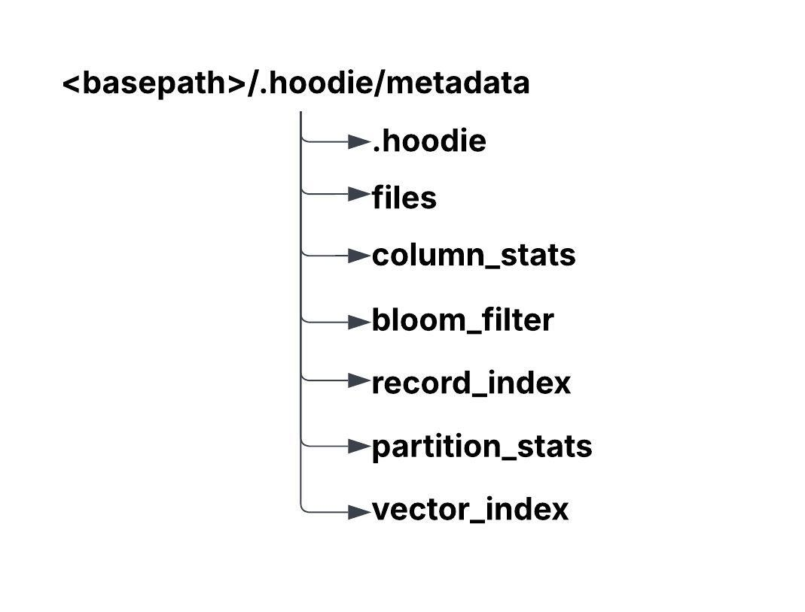
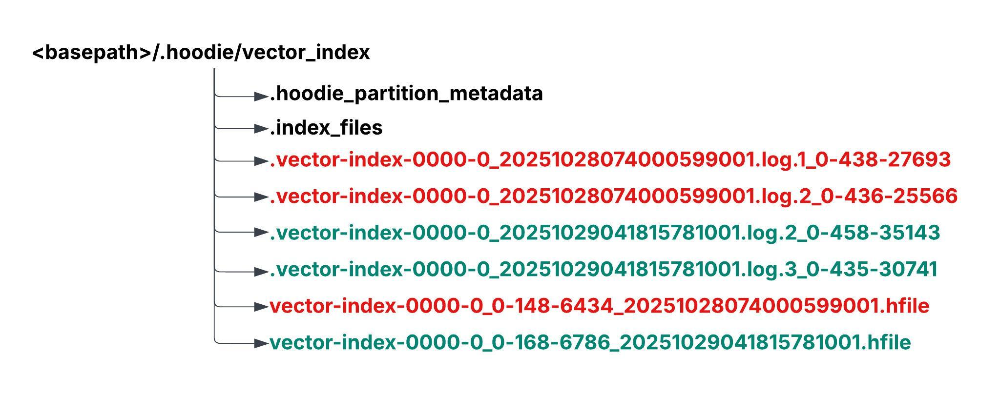
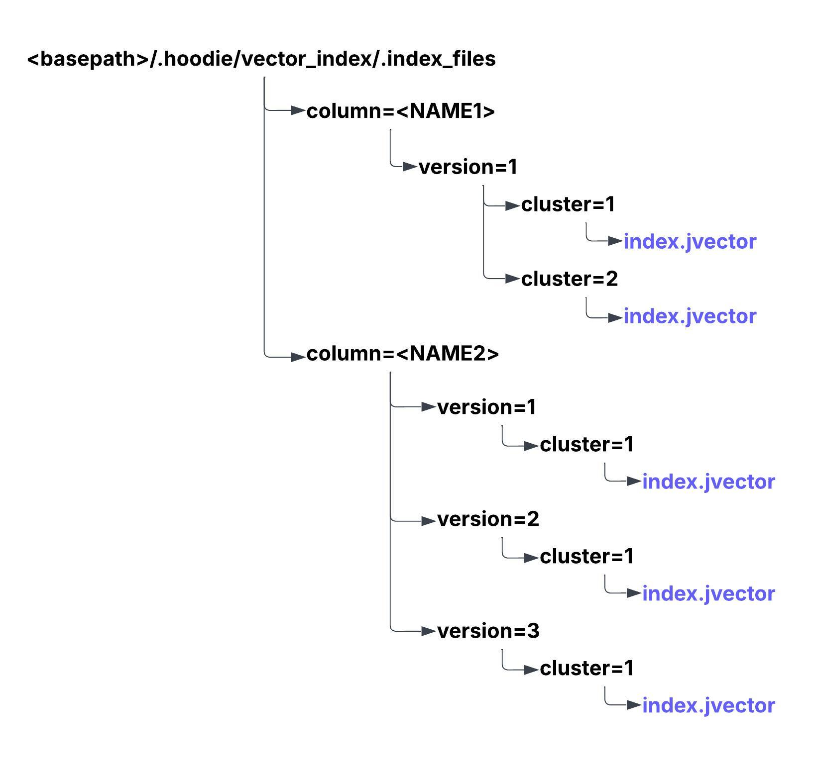
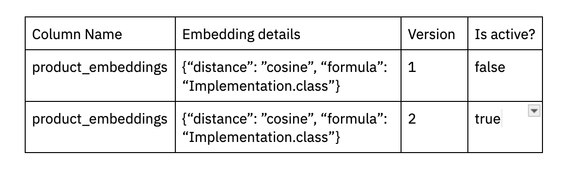
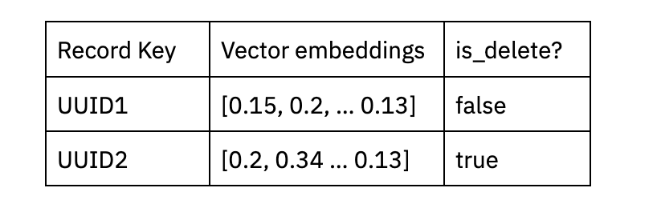
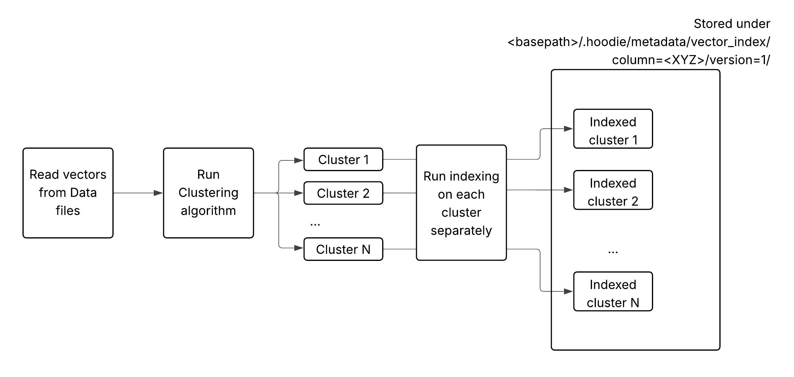

   <!--
  Licensed to the Apache Software Foundation (ASF) under one or more
  contributor license agreements.  See the NOTICE file distributed with
  this work for additional information regarding copyright ownership.
  The ASF licenses this file to You under the Apache License, Version 2.0
  (the "License"); you may not use this file except in compliance with
  the License.  You may obtain a copy of the License at

       http://www.apache.org/licenses/LICENSE-2.0

  Unless required by applicable law or agreed to in writing, software
  distributed under the License is distributed on an "AS IS" BASIS,
  WITHOUT WARRANTIES OR CONDITIONS OF ANY KIND, either express or implied.
  See the License for the specific language governing permissions and
  limitations under the License.
-->
# RFC-101: Vector Index for Hudi

## Proposers

- @suryaprasanna
- @prashantwason

## Approvers
- @vinoth
- @rahil-c

## Status

## Abstract
As LLM applications are on the rise, a lot of focus has been on “operational” or “online” databases, that have added vector search capabilities or specialized vector databases (Chroma, Pinecone, ..), which offer similar capabilities. Specialized vector databases claim support for better algorithms, optimized ingest/serving performance and better integration with LLM application development frameworks like Langchain/llamaIndex et al.

With its shared-storage/decoupled compute model, the data lakehouse architecture has already proven scalability and cost-effectiveness advantages compared to storing all data for analysis and processing in shared-nothing database architectures or datawarehouses. We believe that extending data lakehouse storage and query engines with vector search capabilities can unlock best-of-both-worlds with some exciting outcomes.

Storing vector indexes in a data lakehouse offers several advantages:
- **Infinitely scalable storage:** 
  - Overcomes the pain of storing/scaling large amounts of embeddings in an online database forever, reducing costs, while also allowing the production database to be more efficient/easier to operate.
- **Leverage scalable compute frameworks:** 
  - There is already rich support for compute frameworks (Spark, Flink) to build ingest pipelines to maintain embeddings from upstream sources, as well as fast query engines (Presto, Trino, Starrocks) that can serve vector searches.
- **Tiered serving layer:** 
  - Given much of the embedding data is updated from data pipelines, often every so often (versus real-time individual updates),  we can also provide the reasonably fast serving of vector queries (e.g. 80% speed at 80% lower cost) by either extending the lakehouse storage with a caching tier (or) a tiered storage integration into existing production/online vector databases. They could serve applications with different end-user expectations e.g internal business apps vs user-facing applications.

By extending the multi-modal indexing subsystem, vector indexes can be stored as part of the Hudi’s metadata tables and can be served directly using

## Background
Following are the goals for this RFC
- Creating vector indexes based on a base column in a table - either an embedding column or a text column.
- Indexes are automatically kept up to date when the base column changes, consistent with transactional boundaries.
- First-class SQL experience for creating, and dropping indexes (Spark)
- SQL extensions to query the index. (Spark, then Presto/Trino)

Non-goals/Unclear:
- Fast serving layer, directly usable from RAG applications (this can be left to existing ODBC/SQL gateways that can talk to Spark?)
- Integration within the ecosystem - langchain , llamaIndex. … and developer experience.

Hudi, with its extensible multi-modal indexing subsystem, already offers a lot of capabilities for us to build this e2e architecture. Hudi already supports - column statistics, files, bloom filters, and record-level - indexes in 0.x release line, while 1.x already has  - functional indexes, secondary indexing, text indexes - with integrations into Spark SQL.

Specifically, the indexing infrastructure provides the following capabilities
- Async index creation, allowing for indexes to be (re)built without impacting the writers of the table.
- Allowing queries to gracefully degrade, by an index discovery mechanism.
- Concurrency control mechanisms to keep index and data integrity in-tact, even in the face of failures.
- Hudi table services automatically manage index data.
- Extensible to allow new index types to be integrated easily.

The overall idea is to see if we can add a new vector search index, into the Hudi indexing subsystem. We can directly leverage Hudi’s strengths around table management, ingest tooling and diverse writers - while doing some interesting extensions to turn Hudi into a direct serving layer.

## Implementation

### Approximate Nearest Neighbor (ANN) for Vector Indexing
To efficiently find the nearest neighbors of a vector, the industry-standard approach is to use Approximate Nearest Neighbor (ANN) algorithms.

While exact search methods (e.g., direct cosine distance computation) achieve 100% accuracy, they are computationally expensive and scale poorly for large datasets. In contrast, ANN indexing structures typically provide around 95% accuracy while offering 10× to 100× faster retrieval times.

Given these trade-offs, ANN-based indexing is the most practical and performant choice for implementing vector search in Apache Hudi. Recent advances in AI and vector search technologies have led to several efficient ANN algorithms. Depending on the use case and environment, the following are recommended options:

1. HNSW (Hierarchical Navigable Small World) – implemented via hnswlib-ann
   - Graph-based approach
   - Excellent recall-speed tradeoff
   - Widely used in production systems
2. jVector
   - Java-native implementation of ANN structures
   - Suitable for JVM-based environments like Apache Hudi
3. FAISS (Facebook AI Similarity Search)
   - Highly optimized C++ library with Python bindings
   - Ideal for large-scale GPU-accelerated similarity search

For initial implementation, we will look into HNSW and Jvector implementations.

### Requirements:
Before going over the architecture of Vector index first let us go through the basic requirements,

- **Multi-index support:** The implementation must support maintaining multiple vector indexes, each corresponding to different columns.
- **Data mutation handling:** The vector index must support upserts, inserts, and deletes to stay consistent with the changes happening on the underlying dataset.
- **Transactional consistency:** The implementation must support rollback all vector index changes when commits are reverted or removed during restore or rollback operations.
- **Index refresh capability:** The implementation must provide an ability to refresh or rebuild vector indexes after data or configuration changes to ensure accuracy and consistency.

### Vector Index stored under Metadata table:
Each Hudi dataset contains a Metadata table, which is stored under the .hoodie directory of the dataset. This Hudi Metadata table is another Hudi table which uses MOR table type. This internal table is used for storing Files metadata, Column Stats, Record indexes and Secondary Indexes etc related to the main Hudi dataset. Hudi Metadata table is not a centralized storage for all Hudi datasets, it is tightly coupled with the main dataset and every commit on the main table contain a corresponding commit in the Metadata table. This RFC proposes to store Vector Indexes under the Hudi Metadata table similar to Record and Secondary indexes.

So, the vector index related information will be stored under metadata folder.

### Key considerations:

#### Clusters of Indexes (Horizontal Scalability for Vector Indexing)

Approximate Nearest Neighbor (ANN) algorithms are graph-based structures that are inherently designed for in-memory computation. As a result, traditional ANN implementations typically achieve scalability through vertical scaling — by adding more memory and CPU resources to a single node.

However, in large-scale batch processing environments such as Apache Spark or Apache Flink, horizontal scaling—distributing computation across multiple nodes—is the standard and more efficient approach for handling data at scale.

For example, when performing a vector-based join between two large datasets using nearest neighbor similarity, the operation must ultimately execute in a distributed framework. To align with this architecture and industry practices, it is essential to design a mechanism that enables horizontal scalability of vector indexes across multiple nodes.

##### Proposed Approach

To enable horizontal scalability, we propose organizing the vector embeddings into multiple clusters of indexes. Each cluster will manage a subset of the embeddings, allowing the overall dataset to be evenly partitioned across the clusters.
During execution, each Spark executor can load the relevant cluster’s index into memory—or operate in a hybrid mode using both disk and memory—to perform local nearest neighbor searches efficiently.

#### Read Flow on Vector Index:

When users are accessing the vector index on a column embeddings to find top K nearest neighbours for a vector. The query will first start a spark stage to find the top K nearest neighbours across each of the clusters and the work will be distributed using Spark. Let us say there are 10 clusters, then total 10xK vectors are collected as intermediary result and as part of final step from these 10xK vectors, another top K vectors that are nearest is computed based by on the driver and returned.

#### Supporting transactions for Upsert/deletes:
Vector embeddings are not static—they can evolve over time as underlying features change or as new embedding generation algorithms are applied. Therefore, the vector index implementation must support upserts and deletes, along with integration into Hudi table services such as rollback and restore operations.

To achieve this, we propose using a versioning mechanism for maintaining and updating the vector index. Each update to the embeddings or index structure can be associated with a version, enabling consistent rollback and recovery when table operations require reverting to a previous state.

In real-time systems such as Pinecone or similar vector databases, upserts and deletes are handled instantly, and read queries reflect these updates almost immediately due to their in-memory index design. However, in batch processing environments, vector indexes often rely on disk-based graph structures. In this context, it is more efficient to collect updates over time and apply them in bulk during a scheduled index refresh. This refresh process can be seamlessly aligned with Hudi’s compaction operation, ensuring that the vector index remains synchronized with the underlying dataset while maintaining efficient batch performance.

### Data Layout:

#### Metadata directory structure:

#### Vector Index partition directory structure:

#### Index files directory structure:

#### Base & Log Files:

In Hudi’s vector index implementation actually embeddings are inserted under the index files, base files contain metadata information about the index. File groups used for creating base files will be of the format **<COLUMN_NAME>-<FILE_INDEX>_<WRITE_TOKEN>_<COMMIT>.hfile**. Here, column_name is the column for which the vector index is created. This way when there are multiple vector indices part of the same dataset, compaction operation can be performed on each vector index separately. There by avoiding large scale updates to all the indexes at the same time.
Base file need to store mainly the metadata related to the index. Actual, embedding data will be stored as part of the vector index and any incremental changes that arrive after the index stored/refreshed will be collected as part of the log files. So, the data entries for base file and log files will look something like as follows,

##### Base file entries:

##### Log file entries:

#### Bootstrap workflow:

#### Incremental workflow:

Incremental updates to vector embeddings are first grouped by their corresponding columns and then appended to the column-specific log files. So, here we have a clear separation of various vector indexes that belong to the same dataset.

#### Refresh Index workflow:

Split the changes based on inserts and updates and deletes. Inserting to vector index is easy whereas updates and deletes require a deletion for the node, so original embedding value need to be identified.
So, updates will be further broken down into deletes + inserts.

## Rollout/Adoption Plan

## Test Plan