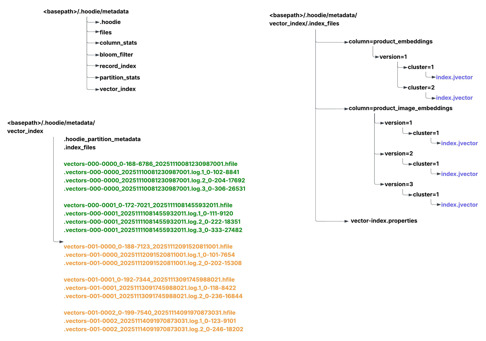
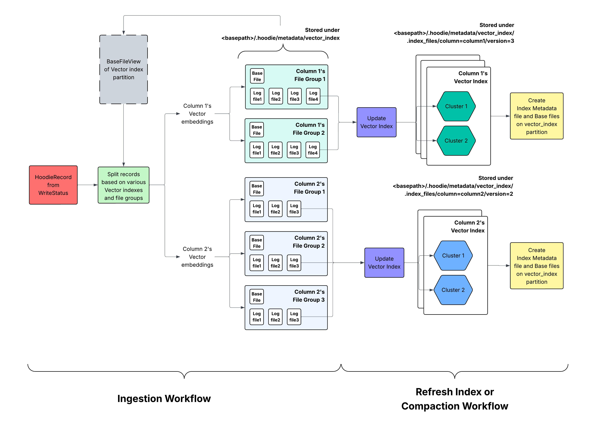

   <!--
  Licensed to the Apache Software Foundation (ASF) under one or more
  contributor license agreements.  See the NOTICE file distributed with
  this work for additional information regarding copyright ownership.
  The ASF licenses this file to You under the Apache License, Version 2.0
  (the "License"); you may not use this file except in compliance with
  the License.  You may obtain a copy of the License at

       http://www.apache.org/licenses/LICENSE-2.0

  Unless required by applicable law or agreed to in writing, software
  distributed under the License is distributed on an "AS IS" BASIS,
  WITHOUT WARRANTIES OR CONDITIONS OF ANY KIND, either express or implied.
  See the License for the specific language governing permissions and
  limitations under the License.
-->
# RFC-103: Support Vector Index on Hudi

## Proposers

- @suryaprasanna
- @prashantwason

## Approvers
- @vinoth
- @rahil-c

## Status


## Abstract
As LLM applications are on the rise, a lot of focus has been on “operational” or “online” databases, that have added vector search capabilities or specialized vector databases (Chroma, Pinecone, ..), which offer similar capabilities. Specialized vector databases claim support for better algorithms, optimized ingest/serving performance and better integration with LLM application development frameworks like Langchain/llamaIndex et al.

With its shared-storage/decoupled compute model, the data lakehouse architecture has already proven scalability and cost-effectiveness advantages compared to storing all data for analysis and processing in shared-nothing database architectures or datawarehouses. We believe that extending data lakehouse storage and query engines with vector search capabilities can unlock best-of-both-worlds with some exciting outcomes.

Storing vector indexes in a data lakehouse offers several advantages:
- **Infinitely scalable storage:** 
  - Overcomes the pain of storing/scaling large amounts of embeddings in an online database forever, reducing costs, while also allowing the production database to be more efficient/easier to operate.
- **Leverage scalable compute frameworks:** 
  - There is already rich support for compute frameworks (Spark, Flink) to build ingest pipelines to maintain embeddings from upstream sources, as well as fast query engines (Presto, Trino, Starrocks) that can serve vector searches.
- **Tiered serving layer:** 
  - Given much of the embedding data is updated from data pipelines, often every so often (versus real-time individual updates),  we can also provide the reasonably fast serving of vector queries (e.g. 80% speed at 80% lower cost) by either extending the lakehouse storage with a caching tier (or) a tiered storage integration into existing production/online vector databases. They could serve applications with different end-user expectations e.g internal business apps vs user-facing applications.

By extending the multi-modal indexing subsystem, vector indexes can be stored as part of the Hudi’s metadata tables and can be served directly using


## Background
Following are the goals for this RFC
- Creating vector indexes based on a base column in a table - either an embedding column or a text column.
- Indexes are automatically kept up to date when the base column changes, consistent with transactional boundaries.
- First-class SQL experience for creating, and dropping indexes (Spark)
- SQL extensions to query the index. (Spark, then Presto/Trino)

Non-goals/Unclear:
- Fast serving layer, directly usable from RAG applications (this can be left to existing ODBC/SQL gateways that can talk to Spark?)
- Integration within the ecosystem - langchain , llamaIndex. … and developer experience.

Hudi, with its extensible multi-modal indexing subsystem, already offers a lot of capabilities for us to build this e2e architecture. Hudi already supports - column statistics, files, bloom filters, and record-level - indexes in 0.x release line, while 1.x already has  - functional indexes, secondary indexing, text indexes - with integrations into Spark SQL.

Specifically, the indexing infrastructure provides the following capabilities
- Async index creation, allowing for indexes to be (re)built without impacting the writers of the table.
- Allowing queries to gracefully degrade, by an index discovery mechanism.
- Concurrency control mechanisms to keep index and data integrity in-tact, even in the face of failures.
- Hudi table services automatically manage index data.
- Extensible to allow new index types to be integrated easily.

The overall idea is to see if we can add a new vector search index, into the Hudi indexing subsystem. We can directly leverage Hudi’s strengths around table management, ingest tooling and diverse writers - while doing some interesting extensions to turn Hudi into a direct serving layer.

## Implementation

### Approximate Nearest Neighbor (ANN) for Vector Indexing
To efficiently find the nearest neighbors of a vector, the industry-standard approach is to use Approximate Nearest Neighbor (ANN) algorithms.

While exact search methods (e.g., direct cosine distance computation) achieve 100% accuracy, they are computationally expensive and scale poorly for large datasets. In contrast, ANN indexing structures typically provide around 95% accuracy while offering 10× to 100× faster retrieval times.

Given these trade-offs, ANN-based indexing is the most practical and performant choice for implementing vector search in Apache Hudi. Recent advances in AI and vector search technologies have led to several efficient ANN algorithms. Depending on the use case and environment, the following are recommended options:

1. HNSW (Hierarchical Navigable Small World) – implemented via hnswlib-ann
   - Graph-based approach
   - Excellent recall-speed tradeoff
   - Widely used in production systems
2. jVector
   - Java-native implementation of ANN structures
   - Suitable for JVM-based environments like Apache Hudi
3. FAISS (Facebook AI Similarity Search)
   - Highly optimized C++ library with Python bindings
   - Ideal for large-scale GPU-accelerated similarity search

For initial implementation, we will look into HNSW and Jvector implementations.

### Requirements:
Before going over the architecture of Vector index first let us go through the basic requirements,

- **Multi-index support:** The implementation must support maintaining multiple vector indexes, each corresponding to different columns.
- **Data mutation handling:** The vector index must support upserts, inserts, and deletes to stay consistent with the changes happening on the underlying dataset.
- **Transactional consistency:** The implementation must support rollback all vector index changes when commits are reverted or removed during restore or rollback operations.
- **Index refresh capability:** The implementation must provide an ability to refresh or rebuild vector indexes after data or configuration changes to ensure accuracy and consistency.

### Vector Index stored under Metadata table:
Each Hudi dataset contains a Metadata table, which is stored under the .hoodie directory of the dataset. This Hudi Metadata table is another Hudi table which uses MOR table type. This internal table is used for storing Files metadata, Column Stats, Record indexes and Secondary Indexes etc related to the main Hudi dataset. Hudi Metadata table is not a centralized storage for all Hudi datasets, it is tightly coupled with the main dataset and every commit on the main table contain a corresponding commit in the Metadata table. This RFC proposes to store Vector Indexes under the Hudi Metadata table similar to Record and Secondary indexes.

So, the vector index related information will be stored under metadata folder.

### Key considerations:

#### Clusters of Indexes (Horizontal Scalability for Vector Indexing)

Approximate Nearest Neighbor (ANN) algorithms are graph-based structures that are inherently designed for in-memory computation. As a result, traditional ANN implementations typically achieve scalability through vertical scaling — by adding more memory and CPU resources to a single node.

However, in large-scale batch processing environments such as Apache Spark or Apache Flink, horizontal scaling—distributing computation across multiple nodes—is the standard and more efficient approach for handling data at scale.

For example, when performing a vector-based join between two large datasets using nearest neighbor similarity, the operation must ultimately execute in a distributed framework. To align with this architecture and industry practices, it is essential to design a mechanism that enables horizontal scalability of vector indexes across multiple nodes.

##### Proposed Approach

To enable horizontal scalability, we propose organizing the vector embeddings into multiple clusters of indexes. Each cluster will manage a subset of the embeddings, allowing the overall dataset to be evenly partitioned across the clusters.
During execution, each Spark executor can load the relevant cluster’s index into memory—or operate in a hybrid mode using both disk and memory—to perform local nearest neighbor searches efficiently.

#### Read Flow on Vector Index:

When users are accessing the vector index on a column embeddings to find top K nearest neighbours for a vector. The query will first start a spark stage to find the top K nearest neighbours across each of the clusters and the work will be distributed using Spark. Let us say there are 10 clusters, then total 10xK vectors are collected as intermediary result and as part of final step from these 10xK vectors, another top K vectors that are nearest is computed based by on the driver and returned.


#### Supporting transactions for Upsert/deletes:
Vector embeddings are not static—they can evolve over time as underlying features change or as new embedding generation algorithms are applied. Therefore, the vector index implementation must support upserts and deletes, along with integration into Hudi table services such as rollback and restore operations.

To achieve this, we propose using a versioning mechanism for maintaining and updating the vector index. Each update to the embeddings or index structure can be associated with a version, enabling consistent rollback and recovery when table operations require reverting to a previous state.

In real-time systems such as Pinecone or similar vector databases, upserts and deletes are handled instantly, and read queries reflect these updates almost immediately due to their in-memory index design. However, in batch processing environments, vector indexes often rely on disk-based graph structures. In this context, it is more efficient to collect updates over time and apply them in bulk during a scheduled index refresh. This refresh process can be seamlessly aligned with Hudi’s compaction operation, ensuring that the vector index remains synchronized with the underlying dataset while maintaining efficient batch performance.

### Data Layout:

The vector index data will be stored under the metadata table’s vector_index partition. Within this partition, there will be mainly three types of files/directories:
1. **Vector embedding files:** These files will store the actual vector embeddings along with their associated record keys. They will be organized by column and cluster to facilitate efficient access and updates. Both base and log files will be used to manage the vector embeddings. These files will either be of the form **vectors-<COLUMN_ID>-<FILE_GROUP>-<FILE_PREFIX>_<WRITE_TOKEN>_<COMMIT_TIME>** for base files or **.vectors-<COLUMN_ID>-<FILE_GROUP>-<FILE_PREFIX>_<COMMIT_TIME>_<WRITE_TOKEN>** for log files.
2. **Metadata tracking base files:** These files will maintain metadata about the vector indexes, including version information, index locations, and other relevant details necessary for managing the index lifecycle.
3. **.index_files directory:** This directory will contain the vector-index.properties file that maps column names to unique column IDs for safe and deterministic file naming. This directories also contain column specific versioned directories to manage different iterations of the index, allowing for rollback and recovery.



#### Base File Naming Scheme

There is a possibility of column names containing characters like '_' or '-', which complicate filename parsing and create edge cases.

To avoid these issues, the design adopts the naming style already used in other metadata partitions (e.g., files-0001, record-index-0001). Vector index base files will follow the pattern as shown below:

```
vectors-<COLUMN_ID>-<FILE_GROUP>-<FILE_PREFIX>_<WRITE_TOKEN>_<COMMIT_TIME>
```

#### Column Name to Column ID Mapping

If column_id are used as part of the file names, then there needs to be a mapping maintained between column names and column ids. This mapping can be stored as part of a properties file.

A static properties file is required to store the mapping between column names and their assigned column IDs. This file resides under the .index_files directory and it can be named as **vector-index.properties**.

This file is written only during vector index creation, which is part of a metadata initialization code block, which is under a table lock. This ensures there are no race conditions. Also, once a column receives a column ID, the mapping is permanent. That means even if the vector is disabled the mapping cannot be removed and the same column ID must be reused if the vector index is re-enabled in the future. Only entire vector index reboostrap removes this mapping and recreates it from scratch.

Example contents of vector-index.properties:

```text
vector.index.columns=product_vector,category_vector
vector.index.product_vector=000
vector.index.category_vector=001
```

This allows the system to deterministically and safely resolve column names to their internal identifiers during all future ingestion, compaction, and indexing operations.

#### Base Files for Vector Index Tracking

Once indexing is complete, the mapping between record_key and embedding vectors is stored in the base files within the metadata table. This mapping enables the system to correctly handle updates and deletions—old vectors can be located and removed, and new embeddings can be inserted during compaction or incremental operations.

In addition to the base files containing embeddings, each vector index requires a dedicated base file to track its version, location, and associated metadata. These files are essential for switching between old and new versions of a vector index, since the rest of the system relies on compaction commit completion to determine which version is active.

Therefore, for every column with a configured vector index, a corresponding tracking base file is created. For example, if two columns have vector indexes, two tracking base files will be generated. These files will follow the naming convention outlined below.

```text
vector-index-metadata-<COLUMN_ID>_<WRITE_TOKEN>_<COMMIT_TIME>
```

### Workflows:
There are various workflows involved in managing vector indexes as part of Hudi table services. Following are the main workflows that needs to be implemented as part of this RFC.

- Bootstrap workflow
- Incremental workflow
- Refresh Index / Compaction workflow

Expanding on these workflows, following sections will go over the data layout and directory structure of vector index implementation.

#### Bootstrap workflow:

Since vector indexes are stored within Hudi’s metadata table, they are created as part of the standard metadata initialization workflow. During this workflow, metadata partitions are generated iteratively—each new partition can reuse information generated by earlier ones. When the vector index partition is initialized, it uses the file-level metadata to locate and read all data files that contain embedding vectors.


##### Cluster Formation and Index Construction

After loading the embedding vectors from the data files, the system groups them into clusters. Clustering provides horizontal scalability for vector search, preventing the bottlenecks associated with a single monolithic index. Each cluster is processed independently using the configured indexing algorithm, resulting in one vector index per cluster.

For example, if a column’s embeddings are split into two clusters, the system generates two separate vector indexes for that column.

This process is repeated for every column where vector indexing is enabled. Thus, if two columns each produce two clusters, a total of four vector indexes are constructed.

#### Incremental workflow:

After data is written into the main table, the ingestion flow for the vector_index partition begins. The first step is to split incoming records based on the vector index configurations and the file groups associated with each index. This splitting is required whenever multiple vector indexes are defined.



For example, consider a record `(r1, v1, v2)` where `r1` is the `record_key`, and `v1` and `v2` are embeddings for two different vector indexes. This record is split into two independent records: `(r1, v1)` and `(r1, v2)`. Each split record is then routed to the file groups corresponding to its specific vector index—`(r1, v1)` goes to the file groups for the `v1` index, while `(r1, v2)` goes to those for the `v2` index.

Once the split is complete, the records destined for a specific vector index are evenly distributed across the file groups configured for that index and written into their log files. Importantly, the vector index base files stored under `vector_index/.index_files` are not updated during ingestion. Therefore, SQL queries that read only the index files will not immediately reflect changes written to log files. The .index_files are updated only during compaction. This separation ensures ingestion remains lightweight and avoids expensive index rebuild operations.

This design intentionally stores records for each vector index under column-specific file groups. The purpose is to avoid conflicts when multiple compaction plans run concurrently—each targeting different vector index columns. Because of this structure, when a compaction operation is triggered to refresh a specific vector index, only the file groups belonging to that index are scanned. The system does not need to scan every file group in the vector_index partition, enabling more efficient and isolated compaction.

##### Notes on File Groups and Clusters

There is no one-to-one mapping between a vector index’s file groups and its clusters. For example, a vector index may use five file groups to distribute log-file writes evenly, while the underlying index structure may contain only two clusters.

- **Number of file groups** is influenced by factors such as base file size, ingestion parallelism, and writer throughput.
- **Number of clusters** is determined by ANN read performance requirements, index storage layout, and other vector index configuration settings.

Exactly how the compaction operation happens will be discussed in the Refresh index Workflow section.

#### Refresh Index / Compaction workflow:

Ingestion workflow stores the changes to vector embeddings in a vector_index partition directory in log file format. These are not readily available for user to read. For users to consume these changes they need to be applied on the vector indexes that are present under .index_files directory. Hudi’s Compaction is the table service that applies these changes on to the index files.

Compaction for the vector index partition is significantly more complex than compaction for other metadata partitions. This complexity arises because vector index files are stored outside the traditional base-file and log-file structure, and each new version of a vector index is maintained independently from its previous version. Since vector indexes do not support transaction-based change tracking and cannot roll back partial updates, version management must be implemented externally. This external versioning ensures that the currently serving index remains isolated and stable while a new version is being built and updated during compaction.


The first step in compaction is to create a new version directory for the column being compacted. This directory is located under:
```text
vector_index/.index_files/column=<column_name>/version=<x>
```
where **<x>** is the next version number.

Once the version directory is created, the system begins merging log records. These records are split into upserts and deletes:
- **Deletes:** Records that have been removed from the main table.
- **Upserts:** Records that are either new inserts or updates to existing vectors.

Because updates to existing vectors are more complex—only the latest entries are known during metadata writes—the system uses the base files to differentiate between inserts and updates. Updates are further broken down into:
- **Deletes:** Remove the older vector entries from the index.
- **Inserts:** Add the updated vector values as new entries.

Both types of deletes (actual deletions and updates) are combined and applied in bulk across all relevant clusters.

First deletions are processed, then the system handles the inserts. Inserts are processed in two batches:
- **New vectors:** Records added for the first time.
- **Updated vectors:** Records that were part of updates.

These insert batches are combined, run through the clustering algorithm, and then inserted into the appropriate vector index clusters. After all inserts are complete, column-specific base files are created to reflect the updated vector entries. Once the base files are finalized, the metadata files for the column are updated to point to the new version of the index.

These metadata files track:
- The location of the base files containing the vector embeddings
- The version reference corresponding to the compaction commit
- Any other information related to the vector embeddings or index

When the compaction commit completes, all vector searches are automatically routed to the updated index in the new version directory, ensuring consistency and correctness.

**Note:**
- When vector index is configured for multiple columns then compaction/refresh index for each column can be done either together or separately.
- Since, compaction plan is a immutable plan any failure have to be retried, and during reattempt, all the in-progress version directories will be deleted and compaction process is started. Example, let us a column’s vector_index has version of 3, that means version=3 is the directory serving the request, so the new compaction operation will create version=4 and work on it. If this compaction operation fails then it will delete the version=4 directory and restart compaction operation again with the same plan.

## Rollout/Adoption Plan

## Test Plan
