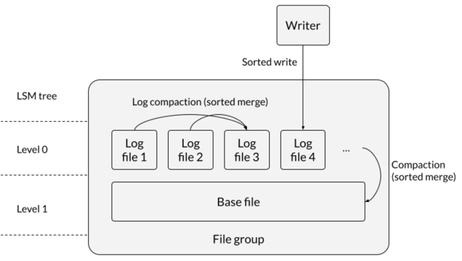
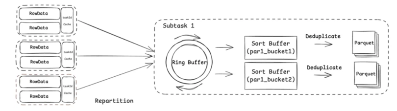

   <!--
  Licensed to the Apache Software Foundation (ASF) under one or more
  contributor license agreements.  See the NOTICE file distributed with
  this work for additional information regarding copyright ownership.
  The ASF licenses this file to You under the Apache License, Version 2.0
  (the "License"); you may not use this file except in compliance with
  the License.  You may obtain a copy of the License at

       http://www.apache.org/licenses/LICENSE-2.0

  Unless required by applicable law or agreed to in writing, software
  distributed under the License is distributed on an "AS IS" BASIS,
  WITHOUT WARRANTIES OR CONDITIONS OF ANY KIND, either express or implied.
  See the License for the specific language governing permissions and
  limitations under the License.
-->
# RFC-103: Hudi LSM tree layout

## Proposers

- @zhangyue19921010
- @xushiyan

## Approvers
- @danny0405

## Status

JIRA: 

> Please keep the status updated in `rfc/README.md`.

 functional tests to ensure the end-to-end writer flows work as expected when using a custom merger implementation.

## Background

LSM Trees (Log-Structured Merge-Trees) are data structures optimized for write-intensive workloads and are widely used in modern database systems such as Paimon, LevelDB, RocksDB, Cassandra, etc. By leveraging sequential writes and a tiered merge (compaction) mechanism, they offer clear advantages in:

- **High write throughput**
- **Efficient, tiered compaction**
- **Optimized read paths**

## Goal

This RFC proposes applying LSM-inspired principles (**sequential writes + tiered merges**) to improve the data organization protocol for **Hudi MOR tables**, and replacing **Avro** with **Parquet** as the on-disk format for individual log files, to achieve:

1. Improve the **read performance**, **write performance**, and **overall stability** of MOR tables—especially for **wide tables**—in scenarios such as:
   - predicate pushdown
   - point lookups
   - column/data pruning
2. Improve the **performance** and **stability** of MOR **compaction**
3. Increase the **compression ratio** of log files

## Design Overview

The core idea is to treat, **within each file group**:

- **Log files** as **Level-0 (L0)** of an LSM tree
- **Base file** as **Level-1 (L1)**

To realize this layout:

- Records inside **log and base files must be sorted** (**Core Feature 1**)
- Existing services should implement **sorted merge-based compaction**:
  - **log-compaction** handles **L0 compaction**
  - **compaction table service** handles **L0 → L1 compaction**
  - both use a **sorted merge algorithm** (**Core Feature 2**)

## Considerations

- The layout is only applicable to **MOR tables** (no effect for **COW** tables even if enabled).
- Write operations should remain semantically unchanged when the layout is enabled.
- When **small file handling** occurs, inserts may be bin-packed into small file slices without log files, creating a **new base file** → **sorted write** is still required.
- Write indexing types should not affect enabling the LSM layout.
- The most performant setup is expected to be:
  - **bucket index + bulk insert**
  - which best utilizes sorted merging  
  - downside: small files may proliferate → mitigated via **more log compaction**
- Reader indexes should not be impacted.
- The layout should be **engine-agnostic**.
- For Flink writer using buffer sort, the sink must **flush sorted records into a single file** to guarantee file-level ordering.
- Under LSM layout, clustering is restricted to **record key sorting** only.
  - For **MOR + bucket index**, clustering is typically **not required**.

## Core Feature 1: Sorted Write

All writes are sorted. That is, within any written file (**base or log**), records are fully sorted by key(s).

### Initial support (v1)

- `bulk_insert`
- `insert_overwrite`
- with **bucket index**

### Future support

- `insert`, `upsert`
- other index types

### Example: Flink Streaming Write Pipeline

The write pipeline mainly consists of four core stages:

- **Repartitioning**
- **Sorting**
- **Deduplication**
- **I/O**

Optimizations:

1. **Unified data representation**  
   Use Flink’s native **RowData** format throughout the pipeline to reduce serialization overhead and minimize format conversions.

2. **Asynchronous processing architecture**  
   Introduce a **Disruptor ring buffer** within the sink operator to decouple production and consumption, significantly improving throughput and handling cases where the producer outpaces the consumer.

3. **Efficient memory management**  
   Integrate Flink’s built-in **MemorySegmentPool** with **BinaryInMemorySortBuffer** to enable fine-grained memory control and efficient sorting, greatly reducing GC pressure and sorting overhead.

## Core Feature 2: Sorted Merge Read / Compaction

During read and compaction, merging is performed using a **sorted merge algorithm** (e.g., **loser-tree** for k-way merge).

- Resulting **log files** contain fully sorted records
- Resulting **base files** contain fully sorted records
- File group reads reuse the same sorted merge logic, with **predicate pruning** applied when present

### Implementation tasks

- Implement sorted merge: **Loser tree** for **k-way merge**
- Reuse existing **Record Merger APIs**
- Update the following components to use sorted merge:
  - Log compaction
  - Compaction runner (L0 → L1)
  - File group reader

---

## Additional (Orthogonal) Features

These features amplify the benefits of the LSM layout but are not strictly required by the layout itself but can optimize the performance and user experience of LSM.

### 1) Parquet as Log File Format

**Benefits**

- Vectorized processing
- Better compression than Avro
- Support pruning during reads

**Behavior changes**

- MOR **rollback** deletes Parquet log files directly, instead of appending a delete block.
- For **cleaning**, Parquet log files are deleted.

### 2) File-Group Granular Compaction

Introduce a new compaction strategy that combines:

- **Log compaction (L0)**
- **Log → base compaction (L0 → L1)**

The compaction plan tracks individual **file groups** and determines whether each group needs:

- L0 compaction only, or
- L0 → L1 compaction

**Benefits**

- More granular control of file sizes
- Skewed file groups can receive more compaction
- Choose between L0 vs L0→L1 compaction based on file stats (count, size, etc.)

---

## Configuration

Enable via a table config, e.g.:

- `hoodie.table.lsm_tree.layout=true`

Writers, compaction runners, and readers will respect this setting and perform:

- **sorted writes**
- **sorted merge** reads/compactions

---

## Benefits

### Storage

- Better compression ratio (via **Parquet log files**)

### Compaction

- Sorted merge vs hashing-based merge:
  - improves performance
  - reduces memory footprint

### Read

- Parquet log supports:
  - vectorized reads
  - pruning
- improved point lookups and range queries

