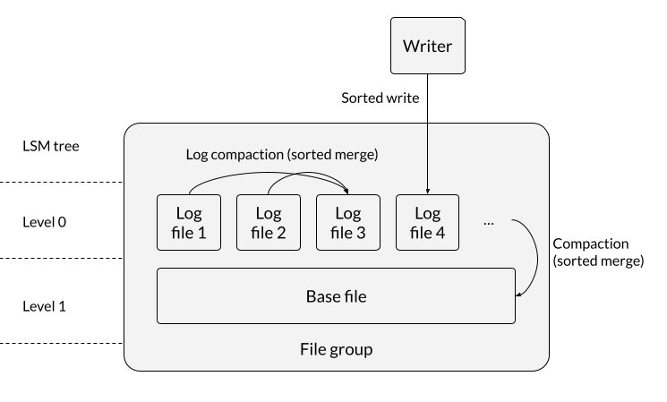
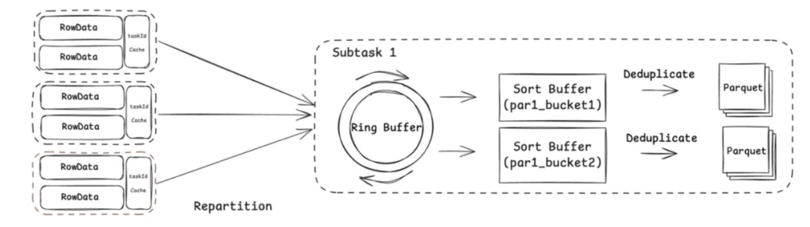
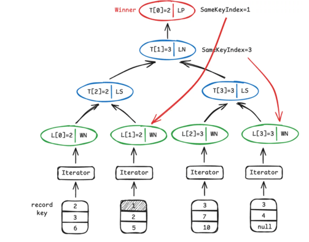

 <!--
  Licensed to the Apache Software Foundation (ASF) under one or more
  contributor license agreements.  See the NOTICE file distributed with
  this work for additional information regarding copyright ownership.
  The ASF licenses this file to You under the Apache License, Version 2.0
  (the "License"); you may not use this file except in compliance with
  the License.  You may obtain a copy of the License at

       http://www.apache.org/licenses/LICENSE-2.0

  Unless required by applicable law or agreed to in writing, software
  distributed under the License is distributed on an "AS IS" BASIS,
  WITHOUT WARRANTIES OR CONDITIONS OF ANY KIND, either express or implied.
  See the License for the specific language governing permissions and
  limitations under the License.
-->
# RFC-103: Hudi LSM tree layout

## Proposers

- @zhangyue19921010
- @xushiyan

## Approvers

- @danny0405
- @vinothchandar

## Status

Main issue: https://github.com/apache/hudi/issues/14310

## Background

LSM Trees (Log-Structured Merge-Trees) are data structures optimized for write-intensive workloads and are widely used in modern database systems such as LevelDB, RocksDB, Cassandra, etc. They offer higher write performance typically compared to traditional B+Tree structures.

Systems like Paimon, adopt the LSM structure for data lake workloads as well, with a tiered merge (compaction) mechanism, they offer some valid tradeoffs in terms of:

- Lower memory requirements to merge logs compared to hash merge algorithms(when the number of files to merge is small); efficient compaction
- Layout sorted by keys within each file group, that can be faster for point lookup

## Goal

This RFC proposes applying LSM-inspired principles (**sorted writes + N-way merges**) to improve the data organization protocol for Hudi tables,
and favoring native Parquet log file format over log format in Avro or embedded Parquet log block, to achieve improvements on the performance and stability of MOR compaction,
and point lookup efficiency.

Comparing to Avro log format, using native Parquet log format further achieves read performance improvements on native predicate pushdown, stats pruning, and better compression.

## Design Overview



The core idea is to treat, **within each file group**:

- **Log files** as **Level-0 (L0)** of an LSM tree
- The single **Base file** as **Level-1 (L1)**

The file namings: 

- The base file naming retain unchanged.
- The data log file naming switches from `.<fileId>_<instant>.log.<version>_<writeToken>` to `<fileId>_<writeToken>_<instant>_<version>.log.parquet`: the file is not a hidden file now,
  hidden file brings in adoptions issues in some engines(Apache Hive), exposing the log files make it more straight-forward(for debugging or for file scanning). The native file format
  suffix is used for the similar purposes: easy adoption for query engines, easy to extend(to other formats like Lance).
- The delete log file naming: `<fileId>_<writeToken>_<instant>_<version>.deletes.parquet`
- The cdc log file naming: `<fileId>_<writeToken>_<instant>_<version>.cdc.parquet`

To realize this layout:

- Records inside **log and base files must be sorted by record key(s)** (**Core Feature 1**)
- Records can be optionally deduplicated before writing to any log file. (optional for query optimization)
- Existing services should implement **sorted merge-based compaction**:
  - **log-compaction** handles **L0 compaction**
  - **compaction table service** handles **L0 → L1 compaction**
  - both use a **sorted merge algorithm** (**Core Feature 2**)

## Considerations

### Table configs

The layout should be enforced by a table property, for e.g. `hoodie.table.storage.layout=default|lsm_tree` (default value: `default`, which is current base/log file organization). The layout applies to both COW and MOR table.

### Engine-agnostic

The layout should be engine-agnostic. Writer engines can make use of shared implementation and add specific logic or design to conform to the layout.

For example, Flink writers use buffer sort, the Flink sink must flush sorted records into a single file to guarantee file-level ordering.

### Write operations

Write operations should remain semantically unchanged when the layout is enabled.

In MOR tables, when **small file handling** occurs, inserts may be bin-packed into file slices without log files, creating a new base file, the **sorted write** needs to be applied.
A `SortedCreateHandle` is needed for writing base files, similar to `SortedMergeHandle`.

For MOR tables, the most performant writer setup for LSM tree layout will be bucket index + bulk insert, which best utilizes sort-merging. The downside would be that small files may proliferate, which can be mitigated by doing log compaction.

### Indexes

Writer indexes should still function as is under this layout. Same for reader indexes.

### Clustering

Clustering can be supported by adopting a hybrid clustering strategy that keeps records sorted by record key(s) within each file group, while keep records collocated in file groups based on user-specified non-record key fields.

## Core Feature 1: Sorted Write

All writes are sorted. That is, within any written file (**base or log**), records are fully sorted by record key(s).

All write operations and writer index types should be supported, as the layout is only about keeping records sorted in data files, which is orthogonal to the choice of write operation and index type.

### Example: Flink Streaming Write Pipeline



The write pipeline mainly consists of four core stages:

- **Repartitioning**
- **Sorting**
- **Deduplication**(optional)
- **I/O**

**Efficient memory management**  
   Integrate Flink’s built-in **MemorySegmentPool** with **BinaryInMemorySortBuffer** to enable fine-grained memory control and efficient sorting, greatly reducing GC pressure and sorting overhead.

## Core Feature 2: Sorted Merge Read / Compaction

During read and compaction, merging can be performed as k-way merging:

- Resulting **log files** contain fully sorted records
- Resulting **base files** contain fully sorted records
- File group reads reuse the same sorted merge logic, with **predicate pruning** applied when present

Merging write handles and file group reader should activate the code path for using the merging algorithm when LSM tree layout is enabled for the table.

### K-way merging algorithm

To optimize the merging performance, we propose a statemachine-based loser-tree merging algorithm to perform k-way merging.



This part assumes k pre-sorted input streams and implements high-throughput merge reading in SortMergeReaderLoserTreeStateMachine by combining two mechanisms:

- A loser tree for efficient global winner selection.
- A state machine for continuous same-key consumption and transition control.

#### 1. Design Goals

- Minimize latency and memory overhead for multi-way sorted merge.
- Guarantee deterministic ordering for records with the same key.
- Support streaming merge semantics (including delete/upsert) without building large per-key buffers.

#### 2. Core Structures

- tree[]: loser-tree internal nodes, where tree[0] is the current champion leaf index.
- leaves[]: current head record of each input stream plus node state.
- firstSameKeyIndex: fast jump pointer to another contender with the same key.
- States:
  - WINNER_WITH_NEW_KEY
  - WINNER_WITH_SAME_KEY
  - WINNER_POPPED
  - LOSER_WITH_NEW_KEY
  - LOSER_WITH_SAME_KEY
  - LOSER_POPPED

#### 3. Execution Flow

1. Initialization
   Read one record from each input stream, set initial state, and build the loser tree via adjust.
2. Winner/loser propagation
   adjust only updates one root path (O(log k)). Comparison is key-based; if equal, sourceIndex is used as a deterministic tie-breaker.
3. Same-key linking
   Equal-key comparisons mark losers as LOSER_WITH_SAME_KEY and record firstSameKeyIndex for fast same-key handoff.
4. Pop and advance
   popWinner() marks current winner as popped and re-adjusts:
    - If same-key contenders exist, it switches directly to WINNER_WITH_SAME_KEY.
    - Otherwise, popAdvance() pulls the next record from that source and resumes normal competition.
5. Group merge output
   The iterator repeatedly pops and merges all records of one key using mergeFunctionWrapper, then emits one merged result for that key.

#### 4. Performance Characteristics

- Time complexity: O(N log k) for N total records.
- Space complexity: O(k) (one active record per stream plus tree metadata).
- Benefits:
  - Fewer redundant comparisons than naive merge approaches.
  - No large same-key temporary list.
  - Stable, reproducible merge order via deterministic tie-breaking.

---

## Log format v2: native log file format

### Current log format (v1)

Current log format is organized as below (ref: [tech spec v8](https://hudi.apache.org/learn/tech-specs-1point0#log-format)):

```text
#HUDI# (magic, 6 bytes)
Block Size (8 bytes)
Log Format Version (4 bytes)
Block Type (4 bytes)
Header Metadata (variable)
Content Length (8 bytes)
Content (variable) - data block, embedded Avro/Parquet/HFile binary data
Footer Metadata (variable)
Reverse Pointer (8 bytes)
```

These fields are encoded into a custom binary format and stored in log files with extension like `.log.<version>_<write_token>`.

### Proposed log format v2

The proposed new log format leverages native file format's metadata layer to capture the metadata fields defined by Hudi log format, while keeping the content field (data block). Take parquet for example:

```text
Row group 1 (data)
Row group 2 (data)
...
Footer
  - Parquet schema
  - Row group metadata
  - key-value metadata <-- Hudi log format metadata goes in here
```

Hudi log format metadata can be stored as a single entry in the Parquet footer with key = `hudi.log.format.metadata` and value being a serialized map of the metadata entries:

| Hudi log format metadata                     |
|:---------------------------------------------|
| log format version                           |
| block type                                   |
| `INSTANT_TIME`                               |
| `TARGET_INSTANT_TIME`                        |
| `SCHEMA`                                     |
| `COMMAND_BLOCK_TYPE`                         |
| `COMPACTED_BLOCK_TIMES`                      |
| `RECORD_POSITIONS`                           |
| `BLOCK_IDENTIFIER`                           |
| `IS_PARTIAL`                                 |
| `BASE_FILE_INSTANT_TIME_OF_RECORD_POSITIONS` |

When using native log format, the log file name uses a suffix like `.log.<native format>`, for e.g., `.log.parquet`.

### Why native file format over embedded Parquet log blocks?

An alternative approach is to keep the V1 log format structure and embed Parquet-encoded data as block content. However, the embedding approach has drawbacks compared to using native Parquet files:

| Aspect                    | Embedded Parquet (V1)                                                                                                      | Native Parquet (V2)                                                           |
|---------------------------|----------------------------------------------------------------------------------------------------------------------------|-------------------------------------------------------------------------------|
| **Parquet optimizations** | Vectorized reads, predicate pushdown, column pruning available after block location via InLineFileSystem                   | Available directly via standard Parquet read path                             |
| **Write model**           | Designed for append (for HDFS, not for object storage)                                                                     | Write-once model (aligns with object storage)                                 |
| **Reading overhead**      | Must read log block header first, then use InLineFileSystem abstraction with offset translation to access embedded content | Read Parquet footer for metadata, then direct file read (no InLineFileSystem) |
| **Tool compatibility**    | Requires Hudi-specific readers                                                                                             | Any Parquet-compatible tool can read                                          |
| **Compression**           | Block-level only                                                                                                           | Parquet's columnar encoding                                                   |
| **Schema storage**        | Duplicated in header and content                                                                                           | Consolidated in Parquet footer                                                |

Using native log file format can also be extended to other file format, like [Lance](https://lance.org/format/file/) for example. The Hudi log format metadata can be stored in Lance file's [global buffer](https://lance.org/format/file/#external-buffers) to facilitate log file operations.

### Block type handling

**Data log**: The Parquet schema is the writer's table schema, including Hudi metadata columns (`_hoodie_commit_time`, `_hoodie_commit_seqno`, `_hoodie_record_key`, `_hoodie_partition_path`, `_hoodie_file_name`), followed by the user-defined data columns.
The schema is stored natively in the Parquet footer (no duplication with header metadata). The `hudi.log.format.metadata` footer entry carries the serialized metadata map as described above.

**Delete log**: Store delete records as Parquet rows using a fixed delete schema. The delete file is written in the same native Parquet format as data blocks — only the schema and block type differ. The `hudi.log.format.metadata` footer entry carries the same serialized metadata map.

Delete block Parquet schema:

```text
message hudi_delete_block {
  required binary record_key (STRING);
  optional binary ordering_val;
}
```

- `record_key`: the record key of the record to delete.
- `ordering_val`: the ordering value used for ordering records, stored as raw bytes in its native representation. The logical type is determined by the table's ordering field schema. This field is null when no ordering value is present.

Note: Iceberg and Delta Lake use position-based deletion vectors. These are fundamentally different from Hudi's key-based delete blocks which identify records by key and carry ordering values for merge semantics.
However, since Hudi already tracks record positions via Roaring64NavigableMap bitmaps in log block metadata (`RECORD_POSITIONS`),
it may be possible to additionally emit position-based deletion vectors alongside delete blocks for cross-format interoperability. This is out of scope for this RFC but worth exploring in a follow-up.

**Command blocks**: this is deprecated, not supported in the new layout.

**CDC blocks**: Same structure as data blocks with CDC schema.

### Migration and Compatibility

The writer chooses the physical log format from the configured table version (`hoodie.write.table.version`):

- Table versions `< 10` write the existing inline log format (`.log.<version>_<write_token>`), where native data blocks are embedded inside the Hudi log envelope.
- Table version `v10` always writes the native log file format (`_<version>.log.parquet` or `_<version>.deletes.parquet`), where Hudi log metadata is stored in the native file footer. There is no separate writer option to make a v10 table write inline logs.

`hoodie.table.storage.layout=lsm_tree` requires table version `v10` or newer. Validation should reject an LSM-tree table configured with `hoodie.write.table.version < 10`,
because sorted merge reads and LSM log compaction rely on native log files.

Upgrade and downgrade behavior:

- **Upgrade from v9 to v10**: no full compaction is required. Existing file groups may keep their old `v1` inline log files, and subsequent writes can append `v2` native log files to the same file groups. The existing FG reader support reading v1/v2 mixture file slices.
- **Downgrade from v10 to v9**: any file group containing `v2` native log files must be fully compacted before the downgrade completes, so the downgraded table no longer exposes native log files to v9 readers.

Reader compatibility:

1. **Release compatibility is governed by table version**: a newer writer binary must honor `hoodie.write.table.version` as the compatibility contract. For example, a table written by Hudi 1.3 or 1.4 writers with `hoodie.write.table.version < 9` must remain readable by readers from older releases such as `< 1.2`, across all file groups in the table.
2. **File naming**: V2 log files use the native file suffix, for example `.parquet`, and require file name parsing support for the `_<version>.log.parquet` and `_<version>.deletes.parquet` patterns.
3. **Existing file group reader**: adapt the existing FG reader to read both log versions in one file group. It detects each log file version from the file name pattern (`.log` for `v1`, native suffix for `v2`) and routes to the matching read path. This remains the reader for the default storage layout, including v10 tables with native log files.
4. **LSM file group reader**: add a new LSM FG reader optimized for pure native log file groups under `lsm_tree` layout. Reader selection first checks `hoodie.table.storage.layout`; if it is `lsm_tree` and the file group has no inline log files, use the LSM FG reader. Otherwise, use the existing FG reader so default-layout and mixed `v1`/`v2` file groups remain readable.
5. **Merging**: the established merge semantics (ordering, deduplication, delete handling) apply regardless of log format. The difference is only the physical read path and, for LSM layout, the sorted merge implementation.

| Scenario                                                                                   | Behavior                                                                                         |
|:-------------------------------------------------------------------------------------------|:-------------------------------------------------------------------------------------------------|
| `< 1.2` reader reading a table written by `1.3` or `1.4` writers with table version `< 9`  | Supported for all file groups; writers must emit only table-version-`< 9` compatible artifacts   |
| `< 1.2` reader reading a table with table version `>= 9`                                   | Not guaranteed; upgrade readers or keep writers pinned to `hoodie.write.table.version < 9`       |
| v10 reader reading v9 file groups                                                          | Supported; existing FG reader handles `v1` logs                                                  |
| v10 reader reading native log files with default storage layout                             | Supported; use the existing FG reader                                                            |
| v10 reader reading mixed `v1`/`v2` file groups                                             | Supported; use the existing FG reader with per-file format detection                             |
| v10 reader reading pure `v2` file groups with `hoodie.table.storage.layout=lsm_tree`        | Supported; use the LSM FG reader                                                                 |
| v9 reader reading `v2` log files                                                           | Not supported; downgrade must full-compact first                                                 |

### How native log format (v2) relates to LSM tree layout

Using the native log file format does not depend on using LSM tree layout. Tables can use table version `v10` with the default storage layout to get native log-file benefits. LSM tree layout, however, depends on native log format and therefore requires table version `v10` or newer.

## Hybrid Compaction Strategy

Hudi currently supports two compaction types:

- Full compaction (`WriteOperationType.COMPACT`): merge log files with the target base file within the same file group and produce a new base file
- Log compaction (`WriteOperationType.LOG_COMPACT`): merge multiple log files into a larger log file within the same file group

The key limitation is the operational overhead: users have to schedule 2 types of compaction, configure separate strategies, and run different jobs to optimize the storage layout for MOR tables.

In this RFC, we introduce a new hybrid compaction strategy that combines full compaction and log compaction. The compaction plan tracks individual file groups and determines which compaction type each file group needs.

- Triggering: same as existing triggering strategy (`NUM_COMMITS`, `TIME_ELAPSED`, etc).
- Scheduling/Planning: for each file group, analyze its file storage pattern (base file size, log file size distribution, number of log files, etc), assign each compaction operation to a type of `FULL` (compaction) or `LOG` (log compaction).
  - Save plan to timeline (`.compaction.requested`)
- Execution: read the plan, execute either full compaction or log compaction for each file group as per the plan.
  - Upon finish, commit to timeline as `.commit`.

### Compaction plan metadata changes

To support mixed FULL and LOG operations in one plan:

- Add nullable `operationType` to `HoodieCompactionOperation` with values `FULL` or `LOG`.
- Treat missing/null `operationType` as `FULL` for backward compatibility.
- Bump `LATEST_COMPACTION_METADATA_VERSION` in `CompactionUtils` from `2` to `3`.
- Mark hybrid plans through `strategy.compactorClassName` or an equivalent explicit plan marker.

### Planning: per-file-group type assignment

A new `HybridCompactionPlanGenerator` assigns `operationType` per operation based on file group analysis:

| Condition                                                         | Assigned type | Rationale                                                       |
|:------------------------------------------------------------------|:--------------|:----------------------------------------------------------------|
| No base file, or base file below size threshold                   | `FULL`        | Rewrite is cheap, produces optimal base file                    |
| Large base file + many small log files                            | `LOG`         | Avoid rewriting large base; merge logs first                    |
| Total log size exceeds ratio threshold of base file (e.g., > 50%) | `FULL`        | Full rewrite is worthwhile when logs are large relative to base |

Thresholds can reuse existing compaction configs: `hoodie.compaction.logfile.size.threshold` (total log size) and `hoodie.compaction.logfile.num.threshold` (log file count).

### Execution: per-operation dispatch

Currently, `HoodieCompactor.compact(context, operationType, plan, ...)` dispatches the full plan to one path: `compact()` (via `HoodieMergeHandle`) or `logCompact()` (via `FileGroupReaderBasedAppendHandle`). Under this proposal, execution dispatches per operation by reading `operationType`:

- `FULL` → existing `compact()` path (merge handle, produces new base file)
- `LOG` → existing `logCompact()` path (append handle, produces compacted log file)

### Timeline and file system view

Hybrid compaction uses the existing `COMPACTION_ACTION` timeline track (`.compaction.requested` / `.compaction.inflight`). No new timeline action type is introduced.

`HoodieTableFileSystemView` currently keeps separate maps (`fgIdToPendingCompaction` and `fgIdToPendingLogCompaction`), each populated from its respective pending compaction filter on the timeline. Under this proposal, when reading a hybrid plan, the view inspects each operation's `operationType` and routes it accordingly: `FULL` to `fgIdToPendingCompaction`, `LOG` to `fgIdToPendingLogCompaction`.

Under this proposed hybrid execution model, a `.commit` that includes LOG-type operations (producing log files instead of base files for some file groups) should not break readers. Hudi readers discover files by storage listing and file naming conventions, not by instant action type. The file system view, file group reader, cleaner, CDC extractor, and incremental query readers already handle file slices with or without base files.

### Benefits

- More optimized storage layout: hybrid compaction strategy gives more granular control of file sizes at file group level, for example, skewed file groups can receive more compaction, file group with large base file and many small log files prefer log compaction first
- Less operational overhead: 1 compaction strategy with 1 set of configs to manage scheduling and execution

### How hybrid compaction strategy relates to LSM tree layout

The hybrid compaction strategy does not depend on using LSM tree layout.

- When LSM tree layout is enabled, the hybrid compaction will engage sorted-merge algorithm to perform log and base file merging or log file merging.
- When LSM tree layout is not enabled, the hybrid compaction will use hash-based merging (existing behavior).

---

## Configuration

The LSM tree layout can be enabled using a table config:

```properties
# default value: "default"
hoodie.table.storage.layout=lsm_tree
```

Writers, compaction runners, and readers will respect this setting and perform:

- **sorted writes**
- **sorted merge** reads/compactions

## Implementation

Tracking issues:

- LSM tree layout: https://github.com/apache/hudi/issues/14310
- Native Parquet log format: https://github.com/apache/hudi/issues/17813
