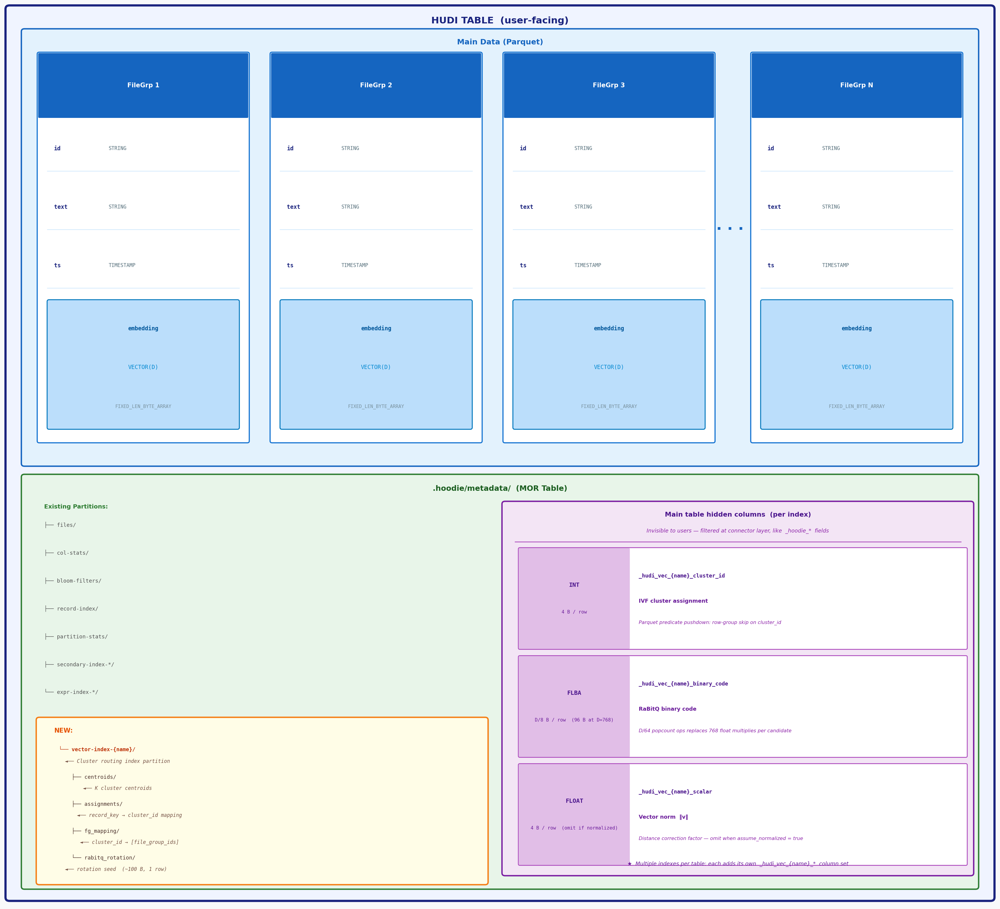
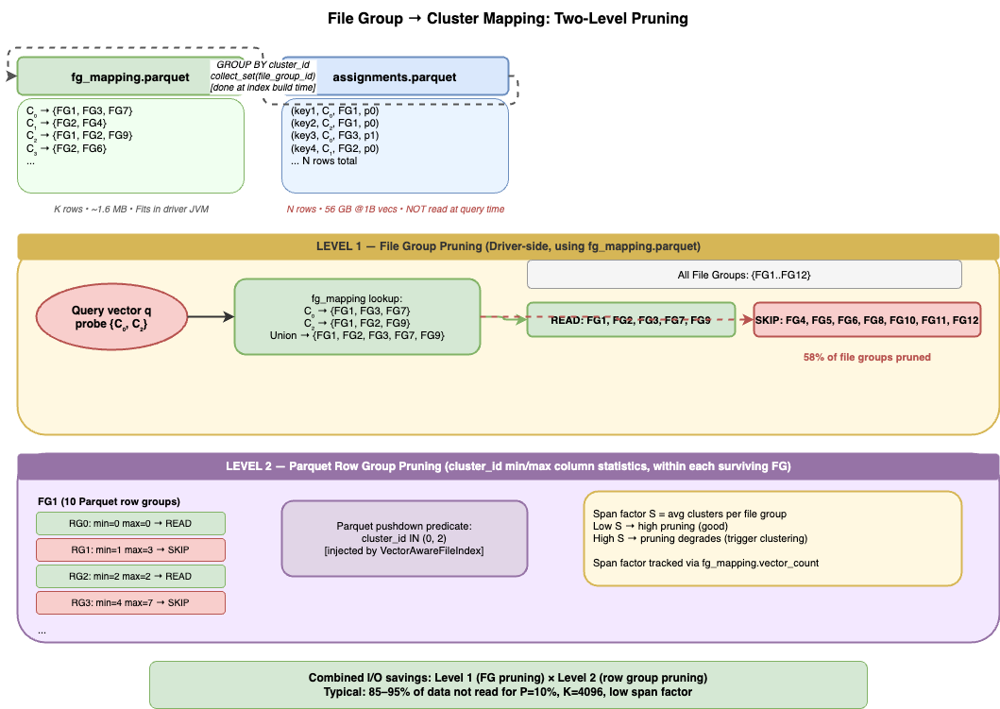
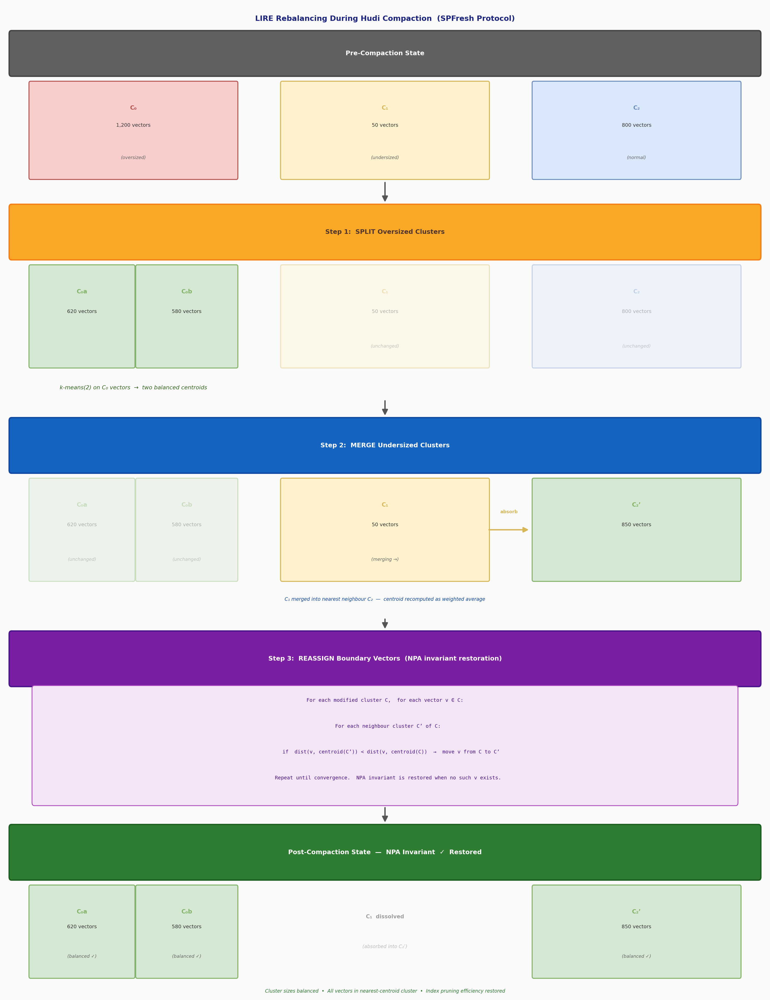
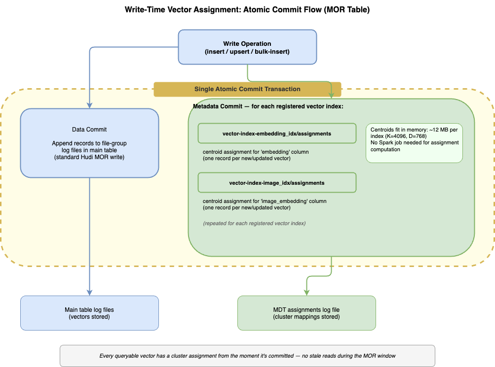

<!--
  Licensed to the Apache Software Foundation (ASF) under one or more
  contributor license agreements.  See the NOTICE file distributed with
  this work for additional information regarding copyright ownership.
  The ASF licenses this file to You under the Apache License, Version 2.0
  (the "License"); you may not use this file except in compliance with
  the License.  You may obtain a copy of the License at

       http://www.apache.org/licenses/LICENSE-2.0

  Unless required by applicable law or agreed to in writing, software
  distributed under the License is distributed on an "AS IS" BASIS,
  WITHOUT WARRANTIES OR CONDITIONS OF ANY KIND, either express or implied.
  See the License for the specific language governing permissions and
  limitations under the License.
-->

# RFC-103: Native Vector Search Support in Apache Hudi

## Proposers

- @Revanth Chandupatla
- @Rahil 
- @Surya

## Approvers

- @<approver-github-username>

## Status

Issue: <Link to GH feature issue>

> Please keep the status updated in `rfc/README.md`.

---

## Table of Contents

- [Abstract](#abstract)
- [Background](#background)
  - The AI/ML Data Gap
  - Why Hudi?
  - Target Use Cases
  - Prior Art & Research
- [Implementation](#implementation)
  - Design Goals
    1. Architecture Overview
    2. Storage Architecture
    3. Index Algorithms — Phased Roadmap
    4. Compaction Strategy — LIRE-Inspired Rebalancing
    5. Query Execution Flow
    6. Spark SQL Integration
    7. API & Configuration
    8. Implementation Plan
    9. Code-Level Changes
- [Rollout/Adoption Plan](#rolloutadoption-plan)
- [Test Plan](#test-plan)
- [Alternatives](#8-alternatives)
- [References](#9-references)

---

## Abstract

This RFC proposes native vector similarity search support in Apache Hudi, enabling
approximate nearest neighbor (ANN) queries on embedding columns stored in Hudi tables.
The design extends the new type vectors which live in the main data table. A lightweight cluster-routing index in the Hudi metadata table providesfile-group pruning, while hidden columns in the main Parquet files store RaBitQ binary
codes for fast quantized scanning with no pre-training requirement.

The approach draws on two key research contributions:

- **SPFresh** (SOSP '23): the LIRE protocol for lightweight, incremental cluster
  rebalancing with a provable Nearest-Partition-Assignment (NPA) invariant.
- **RaBitQ** (Johnson-Lindenstrauss): binary quantization via a fixed random rotation —
  no codebook training, no drift, 95%+ recall@100 with exact re-ranking.

---

## Background

### The AI/ML Data Gap

Modern AI workloads generate embeddings at every stage: text encoders (768–1536 dim),
image models (512–2048 dim), recommendation systems (64–256 dim). These embeddings need
to be:

1. **Stored** alongside structured metadata (timestamps, user IDs, labels).
2. **Queried** via similarity search (find the *k* closest vectors to a probe).
3. **Kept fresh** as new data arrives — not rebuilt from scratch.

Hudi already manages the lifecycle of analytical data: incremental ingestion, upserts,
compaction, clustering, and time-travel. Adding vector search to this lifecycle means
embeddings inherit all of Hudi's guarantees — ACID transactions, snapshot isolation,
incremental consumption — without a separate system.

Targeted Use Cases

| Use Case | Embedding Dim | Scale | Freshness |
|---|---|---|---|
| Semantic product search | 768 | 100M–1B vectors | Minutes |
| Image deduplication | 512 | 10M–100M vectors | Hours |
| Recommendation re-ranking | 128 | 1B+ vectors | Sub-minute |
| RAG document retrieval | 1536 | 10M–100M vectors | Minutes |
| Fraud pattern detection | 256 | 100M vectors | Real-time* |

*\*Real-time use cases pair Hudi with a streaming layer; Hudi provides the durable,
queryable store.*

---

### Prior Research

#### SPFresh — LIRE Protocol (SOSP '23)

SPFresh addresses a critical problem: how to keep a cluster-based vector index
(IVF/SPANN) fresh as data is continuously inserted, updated, and deleted — without
periodic full rebuilds.

**Key Concepts:**

- **NPA Invariant**: Every vector is assigned to its nearest cluster centroid. This
  invariant is the foundation of search correctness (probing the nearest centroids
  guarantees finding the nearest vectors).
- **LIRE Protocol** (Lightweight Incremental RE-balancing):
  - **Split**: When a cluster exceeds a size threshold, split it into two via k-means(2).
  - **Merge**: When a cluster drops below a size threshold, merge it with its nearest
    neighbor.
  - **Reassign**: After split/merge, check boundary vectors against neighboring centroids.
    Reassign if a vector is now closer to a different centroid.
- **Two Necessary Conditions for Reassignment**: A vector `v` in cluster `C_i` needs
  reassignment to `C_j` only if: (1) `C_j` is a neighbor of `C_i`, and (2) `dist(v, centroid_j) < dist(v, centroid_i)`.
- **Convergence Proof**: LIRE converges to NPA in bounded iterations.

The LIRE split/merge/reassign protocol maps perfectly to Hudi's
compaction workflow. Instead of SPFresh's NVMe-optimized in-place updates, we perform
LIRE during Hudi compaction — a batch operation that already rewrites file groups.


#### LanceDB — IVF + Cloud-Storage-Optimised Search (Conf42 '23)

LanceDB demonstrates that a two-phase IVF search pattern is well-suited to cloud/object
storage where sequential I/O dominates and random-access latency is punishing.

**Key Concepts:**

- **Two-Phase Search**: (1) Coarse: identify the top-`nprobes` clusters by comparing
  the query to precomputed centroids — cheap, in-memory. (2) Fine: scan a compressed
  binary representation oithin the selected clusters only — sequential,
  columnar, I/O-efficient.
- **Refinement/Re-ranking**: Fetch the exact vectors for the top-`refine_factor × k`
  binary-scan candidates and re-rank using exact float distances. Trades a small amount
  of extra I/O for a significant recall boost — this is the key pattern we carry forward.
- **Lance Format**: Column-oriented, row-addressable format with 2000× faster random
  access than Parquet. Arrow-native. Noted for reference; not used in this design.

The two-phase coarse-then-fine search structure and the
refinement/re-ranking step. In place of LanceDB's Product Quantization (PQ) codes,
we use **RaBitQ binary codes** — stored as hidden `FIXED_LEN_BYTE_ARRAY` columns
directly in the main Parquet files. RaBitQ requires no codebook pre-training, no
codebook drift management, and achieves 95%+ recall@100 with a simple dot-product
bit-count scan followed by exact re-ranking on the shortlist (see Section 3.2).

Product Quantization (PQ) codebooks and ADC lookup tables are not being used in the first iteration. 
(training-free RaBitQ covers our recall targets without the operational overhead)


## Implementation

### Design Goals

| # | Goal | Rationale |
|---|---|---|
| G1 | **Zero data duplication** | Vectors stay in main Parquet files; metadata stores only routing info |
| G2 | **Incremental maintenance** | New vectors assigned to clusters without full rebuild |
| G3 | **Standard MOR semantics** | Vector index uses Hudi's existing versioning, not custom mechanisms |
| G4 | **Configurable recall/latency** | `num_probes`, `refine_factor` tunable per query |
| G5 | **Phased complexity** | IVFFlat+RaBitQ (no pre-training, no deps) → HNSW centroid routing (JVector, K>10K) |
| G6 | **Spark-first** | Initial implementation targets Spark; Flink/Presto follow |
| G7 | **Cloud-storage optimized** | Minimize random I/O; batch sequential reads |

---

## 1. Architecture Overview

### 1.1 Key Architectural Principle: Separation of Data and Routing




```
┌─────────────────────────────┐     ┌──────────────────────────────────┐
│     MAIN TABLE (Parquet)    │     │  METADATA TABLE (vector-index-*) │
│                             │     │                                  │
│  • Full vector data         │     │  • Cluster centroids (K × D)     │
│  • VECTOR(D) column         │     │  • Assignment map:               │
│  • Standard Hudi lifecycle  │     │    record_key → cluster_id       │
│  • NOT duplicated anywhere  │     │  • File-to-cluster mapping:      │
│  • Hidden cols per index:   │     │    cluster_id → [file_group_ids] │
│    _hudi_vec_*_cluster_id   │     │  • RaBitQ rotation_meta (seed)   │
│    _hudi_vec_*_binary_code  │     │  • HNSW centroid graph (Phase 2) │
│    _hudi_vec_*_scalar       │     │    (only when K > 10,000)        │
└─────────────────────────────┘     └──────────────────────────────────┘

         ▲                                        ▲
         │                                        │
         │  Vectors read at                       │  Routing info read
         │  query time for                        │  first to prune
         │  exact distance                        │  file groups
         │                                        │
         └────────────┐          ┌────────────────┘
                      │          │
                ┌─────┴──────────┴──────┐
                │    Vector Query Plan   │
                │                        │
                │  1. Read centroids     │
                │  2. Find top-P clusters│
                │     (linear or HNSW)   │
                │  3. Map clusters→files │
                │     via fg_mapping     │
                │  4. Read binary_code   │
                │     hidden col (fast   │
                │     popcount scan)     │
                │  5. Re-rank top-R with │
                │     exact distances    │
                │  6. Return top-K       │
                └────────────────────────┘
```

This separation means:
- **Storage overhead** for the MDT index is O(K×D + N×8).
  For 1B vectors at 768-dim: ~56 GB of routing (assignments). Hidden columns add ~104 B/row 
  (cluster_id + binary_code + scalar) to the main table — co-located with vectors for 
  zero-cost columnar access during scan.
- **Writes are fast**: new vectors are assigned to the nearest centroid and encoded
  in the same Parquet write pass; no extra I/O over the data.
- **Compaction is incremental**: LIRE rebalances clusters by split/merge/reassign;
  hidden columns (binary_code, scalar, cluster_id) are updated in-place in the files
  already being rewritten by compaction — the original vector column is never modified.
- **No pre-training**: RaBitQ's rotation matrix R is derived from a fixed random seed
  and never expires. Unlike PQ codebooks, it requires no retraining as data drifts.

---

## 2. Storage Architecture

### 2.1 Vector Column in Main Table

Vectors are stored using the **`VECTOR` logical type** (RFC-99), which is already
implemented and integrated in this codebase. This is a Hudi logical type with its own Avro, Parquet, and Spark
representations. Not deep diving in to details as another RFC already covers it. 

### 2.2 Metadata Table — Vector Index Partition

Each vector index creates a partition in the metadata table following the existing
dynamic-partition pattern used by secondary indexes and expression indexes:

```
.hoodie/metadata/
└── vector-index-{index_name}/
    ├── .hoodie/                          # MOR metadata
    ├── centroids/
    │   └── <fileId>_<instant>.parquet    # Cluster centroids
    ├── assignments/
    │   └── <fileId>_<instant>.parquet    # Record → cluster mapping
    └── rabitq_rotation/
        └── rotation_meta.parquet         # Random rotation seed (eternal, never changes)
```

> **Optional (IVF_PQ only):** When `quantizer = 'IVF_PQ'` is configured, an additional
> `pq_codebooks/` partition is created to store the trained PQ codebook. This partition
> is absent in the default RaBitQ configuration.

#### 2.2.1 Centroids Record Schema

```
centroids.parquet
├── cluster_id:     INT         -- Cluster identifier (0..K-1)
├── centroid:       VECTOR(D)   -- D-dimensional centroid vector
├── num_vectors:    LONG        -- Number of vectors in this cluster
├── neighbor_ids:   ARRAY<INT>  -- IDs of neighboring clusters (for LIRE)
└── _hoodie_*                   -- Standard Hudi metadata fields
```

- **Rows**: K (number of clusters). Typically 1,000–10,000.
- **Size**: K × D × 4 bytes. For K=4096, D=768: ~12 MB. Trivially fits in memory.

#### 2.2.2 Assignment Record Schema -- (Review Needed)

```
assignments.parquet
├── record_key:     STRING      -- Hudi record key
├── cluster_id:     INT         -- Assigned cluster (-1 for tombstoned records)
├── file_group_id:  STRING      -- File group containing this vector
├── partition_path: STRING      -- Hudi partition containing this record
├── is_deleted:     BOOLEAN     -- True when the source record has been deleted 
└── _hoodie_*                   -- Standard Hudi metadata fields
```

- **Rows**: N (number of vectors in the table).
- **Size**: ~60 bytes per record. For 1B vectors: ~56 GB.
- **Optimization**: This partition uses range-based file grouping on `cluster_id`
  so that all assignments for a cluster are co-located, enabling efficient cluster scans.

#### 2.2.3 RaBitQ Codes — Hidden Columns in Main Table -- (Review Needed)

RaBitQ binary codes are stored as **hidden columns directly in the main table's Parquet
files**, not in a separate MDT partition. This keeps the metadata table lean at billion
scale while preserving full columnar access efficiency.

```
Main table Parquet — hidden columns added by vector write path:
├── record_key                    (existing)
├── embedding   VECTOR(D)         (existing, original vector NEVER modified)
├── ... other user columns ...    (existing)
├── _hudi_vec_{name}_cluster_id   INT                  -- cluster assignment
├── _hudi_vec_{name}_binary_code  FIXED_LEN_BYTE_ARRAY -- D/8 bytes (96B for D=768)
└── _hudi_vec_{name}_scalar       FLOAT                -- ||v|| for distance correction
```

- Hidden from user-facing schema (filtered at connector layer, like `_hoodie_*` fields).
- Suffix `{name}` is the index name — supports multiple vector indexes per table.
- `binary_code` is `FIXED_LEN_BYTE_ARRAY` of length `ceil(D/8)` — 96 bytes for D=768.
- `scalar` is omitted (4-byte saving per row) when `assume_normalized = true`.
- **Size per row**: 4 + 96 + 4 = **104 bytes** overhead per vector at D=768.
- **At 1B vectors**: 104 GB added to main table, spread across existing file groups.
  Parquet columnar layout means the binary_code column is read only during vector
  scan — never touched during non-vector queries.

```
Separate MDT partition approach:    Hidden column approach:
  assignments/:  56 GB in MDT         assignments/:  56 GB in MDT
  rabitq_codes/: 100 GB in MDT        binary_code:   in main table (already writing)
  MDT total:     156 GB               MDT total:     56 GB
  Two compaction jobs                 One compaction job
  Extra file listing                  No extra MDT partition
```

Halves MDT complexity at billion scale. Co-location with vectors also means the
binary_code column is in the same file group as the vectors it encodes — optimal
cache locality during the popcount scan → re-rank transition.

#### 2.2.4 RaBitQ Rotation Metadata -- (Review Needed)

The rotation matrix R is derived deterministically from a stored seed — never stored
as a full D×D matrix:

```
vector-index-{name}/rabitq_rotation/
└── rotation_meta.parquet
    ├── index_name:      STRING   -- index identifier
    ├── dimension:       INT      -- D (must match vector column dimension)
    ├── random_seed:     LONG     -- seed to regenerate R = RandomRotation(seed, D)
    └── assume_normalized: BOOLEAN -- skip scalar_factor if true
```

- **Rows**: 1 (one rotation per index, fixed at index creation, never changes).
- **Size**: negligible (~100 bytes).
- R is **eternal** — it never needs retraining regardless of data distribution
  drift, unlike a PQ codebook. New vectors from any distribution encode correctly
  with the same R.

#### 2.2.5 Pluggable Quantizer — PQ as Config Option

The quantizer is a pluggable strategy. PQ remains available for low-dimensional
vectors (D < 128) or migration from existing PQ-encoded datasets:

```java
interface VectorQuantizer {
    void train(Dataset<Row> sample);               // PQ: k-means. RaBitQ: sample seed
    HiddenColumns encode(float[] vector);          // returns binary_code + scalar
    float[] buildQueryState(float[] query);        // PQ: ADC table. RaBitQ: rotated q
    float estimateDistance(byte[] code,
                           float[] queryState,
                           float scalarFactor);    // PQ: sum LUT. RaBitQ: popcount
}
```

DDL config:
```sql
OPTIONS (
    quantizer = 'IVF_RABITQ',   -- default. or 'IVF_PQ' for legacy/low-dim use
    rabitq_random_seed     = 42,
    rabitq_assume_normalized = false,
    -- PQ-only (if quantizer = 'IVF_PQ'):
    pq_num_sub_quantizers  = 96,
    pq_bits                = 8
)
```

The chosen quantizer is stored as a plain string in `HoodieIndexDefinition` options
under key `vector.quantizer` — never byte-serialized into the timeline.

### 2.3 File Group to Cluster Mapping

A critical optimization: we maintain a **file-group-to-cluster** mapping so the query
planner can skip entire file groups that don't contain relevant clusters.

```
┌─────────────┐     ┌──────────────┐     ┌─────────────┐
│  Centroids  │     │ FG→Cluster   │     │ File Groups │
│             │     │   Mapping    │     │  (Parquet)  │
│  C₀ ────────┼────►│ C₀ → {FG1,  │────►│  FG1: read  │
│  C₁         │     │       FG3}  │     │  FG2: skip  │
│  C₂ ────────┼────►│ C₂ → {FG1,  │     │  FG3: read  │
│  C₃         │     │       FG2}  │     │  FG4: skip  │
│  ...        │     │ ...         │     │  ...        │
└─────────────┘     └──────────────┘     └─────────────┘
```

This mapping is derived from the assignments table and cached. When a query probes
clusters {C₀, C₂}, only file groups {FG1, FG2, FG3} are read — file groups containing
no vectors from those clusters are pruned entirely.



#### 2.3.1 Physical Storage Schema

The FG→Cluster mapping is **not** derived at query time from the full assignments table
(which can be 56 GB+ for 1B vectors). It is maintained as a compact, always-up-to-date
summary Parquet file in the same vector index partition:

```
vector-index-{name}/
├── centroids/           # K rows — centroid vectors
├── assignments/         # N rows — record_key → cluster_id + file_group_id
├── fg_mapping/          # K rows — cluster_id → {file_group_ids}  ← THIS SECTION
└── rabitq_rotation/     # 1 row  — random rotation seed (RaBitQ primary)
```

> **Optional (IVF_PQ only):** A `pq_codebooks/` partition is additionally present when
> `quantizer = 'IVF_PQ'` is configured.

```
fg_mapping.parquet  ← one row per (cluster_id, partition_path) pair
├── cluster_id:        INT              -- Cluster identifier (0..K-1)
├── partition_path:    STRING           -- Hive partition path (e.g. country=US/category=elec)
├── file_group_ids:    ARRAY<STRING>    -- FGs in THIS (cluster, partition) only
├── vector_count:      LONG             -- Vectors from this cluster in this partition
└── last_updated_ts:   LONG             -- Instant millis of last write or LIRE pass
```

- **Rows**: K × avg_partitions_per_cluster. For K=4,096 and avg 5 Hive partitions
  per cluster: **~20,480 rows, ~1 MB**. Still trivially fits in driver memory.
- **Why per (cluster, partition) not per cluster?** A global cluster spans multiple
  Hive partitions. Without this split, a query filtering `country=US` would load
  FGs from UK and IN partitions unnecessarily. The per-partition schema enables
  exact cross-partition pruning at query time:

```
Query: WHERE country=US AND category=electronics
       ORDER BY vector_distance(...) LIMIT 10

fg_mapping lookup:
  probed clusters {C₀, C₂}
  × partition filter {country=US/category=electronics}
  = rows where cluster_id IN (0,2) AND partition_path='country=US/category=electronics'
  → file_group_ids from those rows only — no FGs from UK or IN opened
```
- **Why separate from assignments?** The assignments table has N rows (one per vector).
  At query time, we need only the FG set for P clusters — never the full N-row table.
  Reading `fg_mapping` is a K-row scan (microseconds); reading `assignments` to derive
  the same info would be a gigabyte-scale I/O operation.

#### 2.3.2 Two-Level Index Structure

The mapping is maintained in both directions:

```
  FORWARD MAP (cluster → file groups)       INVERTED MAP (file group → clusters)
  Loaded at query time for pruning          Used at write/compaction time for updates

  cluster_id  │  file_group_ids              file_group_id  │  cluster_ids
  ────────────┼───────────────────           ───────────────┼─────────────────
  C₀          │  {FG1, FG3, FG7}            FG1            │  {C₀, C₂, C₅}
  C₁          │  {FG2, FG4}                 FG2            │  {C₁, C₂, C₃}
  C₂          │  {FG1, FG2, FG9}            FG3            │  {C₀, C₄}
  C₃          │  {FG2, FG6}                 ...            │  ...
  ...         │  ...                        FGₙ            │  {Cₓ, Cᵧ}
```

The **forward map** is stored in `fg_mapping.parquet` and loaded at driver query-plan
time. The **inverted map** is derived lazily in-memory from the forward map during write
operations — no separate storage is needed for it.

In-memory representations (driver JVM):
```java
// Forward: cluster_id -> set of file group IDs
Map<Integer, Set<String>> clusterToFGs;    // ~1.6 MB for K=4096

// Inverted: file_group_id -> set of cluster IDs (derived, not stored)
Map<String, Set<Integer>> fgToClusters;    // same size
```

#### 2.3.3 Build and Derivation from Assignments

The `fg_mapping` table is derived by aggregating the assignments table:

```sql
-- Logical derivation (run during index creation or LIRE rebalance)
INSERT INTO vector-index-{name}/fg_mapping
SELECT
    cluster_id,
    collect_set(file_group_id)  AS file_group_ids,
    count(*)                    AS vector_count,
    collect_set(partition_path) AS partition_paths,
    current_timestamp()         AS last_updated_ts
FROM vector-index-{name}/assignments
GROUP BY cluster_id;
```

This aggregation reads only 2 columns (`cluster_id` + `file_group_id`) from the
assignments Parquet, which are stored contiguously. For 1B rows at ~12 bytes/row
(two small columns), this is a ~12 GB column read — acceptable as a background
operation during index creation, not at query time.

After initial build, the mapping is maintained **incrementally**, not rebuilt from scratch.

#### 2.3.4 Update Lifecycle

The mapping must stay consistent with three events: **writes**, **compaction**, and
**LIRE rebalancing**.

**At write time (incremental update)**

When vectors are written to a MOR table, the writer already computes cluster assignments
for each new vector (Section 4.5). The writer simultaneously updates the mapping:

```
For each new assignment (record_key, cluster_id=Cᵢ, file_group_id=FGⱼ):
    if FGⱼ not in clusterToFGs[Cᵢ]:
        append (Cᵢ, FGⱼ) delta to fg_mapping log file
```

Only **new** (cluster_id, file_group_id) pairs trigger a write — if the same cluster
already has records in that file group, no update is needed. In practice, most writes
to an existing table append to existing file groups, so the delta is often empty.

**At compaction time**

MOR compaction merges log files into base files, which may **retire** old file group IDs
and **create** new ones. After the compaction commit:

```
1. Read the compaction plan to identify: retired_fgs, new_fgs
2. For each retired FG:
   a. Remove it from all cluster entries in fg_mapping (inverted map lookup: O(|clusters|))
   b. Add new_fg to each cluster that had vectors in retired_fg
3. Commit updated fg_mapping as part of the metadata commit
```

This is a cheap operation — compaction plans enumerate their input/output file groups
explicitly, so no assignment table scan is needed.

**After LIRE rebalancing**

LIRE may move vectors between clusters (Section 4.2). When a vector moves from Cᵢ to
Cⱼ in file group FGₖ:

```
1. Decrement vector_count[Cᵢ] for FGₖ
2. If vector_count[Cᵢ][FGₖ] == 0: remove FGₖ from clusterToFGs[Cᵢ]
3. Add FGₖ to clusterToFGs[Cⱼ]
4. Rewrite fg_mapping after LIRE pass completes
```

LIRE always runs to completion before the mapping is updated — readers see a consistent
snapshot because the mapping update is part of the same atomic LIRE metadata commit.

#### 2.3.5 Pruning Effectiveness: The Math

The fraction of file groups **read** (vs. pruned) depends on:
- **K**: number of clusters
- **P**: number of probes (`num_probes`)
- **F**: total number of file groups
- **S**: average file groups spanned per cluster (the *span* factor)

```
File groups read  =  min(F,  P × S)
Pruning ratio     =  1  -  min(F, P × S) / F
```


**Key insight**: the P/K ratio (probe fraction) sets the recall/speed tradeoff, but S
(span factor) determines how cleanly the FG pruning translates that probe fraction into
I/O savings. Keeping S small is a first-class design goal.

#### 2.3.6 The Spanning Problem

A file group *spans* multiple clusters when it contains vectors that were assigned to
different clusters. This happens naturally over time:

```
Initial state (compact, low span):           After many incremental writes (high span):

FG1: [C₀ vectors only]                      FG1: [C₀, C₁, C₂, C₃, C₅, C₇ vectors]
FG2: [C₁ vectors only]                      FG2: [C₁, C₃, C₄ vectors]
FG3: [C₂ vectors only]                      FG3: [C₂, C₄, C₆ vectors]
(S ≈ 1)                                      (S ≈ 4, pruning degrades)
```

Hudi's MOR write path does not assign incoming records to file groups vector cluster. A batch of upserts might
route records from clusters C₀, C₁, C₂ all into FG1.

**Cluster-Aligned Physical Clustering**

Hudi's clustering operation physically rearranges records within a table. So
an optional `CLUSTER BY vector_cluster_id` strategy that runs during Hudi clustering can be used:

```sql
-- Optional: trigger cluster-aligned physical layout
CALL run_clustering(
    table => 'products',
    strategy => 'VECTOR_CLUSTER',
    options => map(
        'vector.index.name', 'embedding_idx',
        'sort_columns',      'cluster_id'
    )
);
```

After cluster-aligned physical clustering:
- Records from the same vector cluster are co-located in the same (or few) file groups.
- The span factor S drops back toward 1.
- FG pruning effectiveness is restored.

This is the same pattern as Hudi's `z-order` and `hilbert` clustering — just using
vector cluster ID as the sort key. It runs in the background and doesn't block reads.

**When to trigger**: When the average span factor S (tracked in `fg_mapping.vector_count`
vs. expected count) exceeds a threshold (default: `S > 5.0`), the clustering scheduler
should recommend a cluster-aligned pass.

#### 2.3.7 MOR Log File Handling

In a MOR table, new records land in **log files** before compaction. Log files belong to
an existing file group's slice. This creates a nuance:

```
File group FG1:
├── base file (compact, cluster_id data from last compaction)
└── log file  (new appends, may contain vectors from different clusters than base)
```

The assignment for a newly written vector references `file_group_id=FG1`. The FG mapping
correctly includes FG1 for the new vector's cluster. When the query reads FG1, it reads
both the base file **and** the log file (MOR read-merge), so the new vector is included.

For **new file groups** created by bulk inserts (when the writer creates a new file group
because existing ones are full):

```
Writer detects: new file_group_id FGₙ created
→ Immediately add (cluster_id, FGₙ) to fg_mapping delta log
→ Query planner picks up FGₙ on next planning cycle
```

The delta is committed atomically with the data write, so there is no window where a
vector is queryable but its file group is missing from the mapping.

#### 2.3.8 Interaction with Parquet Predicate Pushdown

The FG→Cluster mapping provides **file-group-level pruning**. Parquet column statistics
provide a second, finer level of pruning **within** each surviving file group:

```
Level 1 — File group pruning (FG mapping, driver-side)
    Query probes {C₀, C₂} → read only {FG1, FG3}   (skip FG2, FG4, FG5...)
         ↓
Level 2 — Row group pruning (Parquet min/max on cluster_id)
    FG1 has 10 Parquet row groups:
    RG0: cluster_id min=0, max=0   → read  (C₀ present)
    RG1: cluster_id min=1, max=3   → skip  (neither C₀ nor C₂)
    RG2: cluster_id min=2, max=2   → read  (C₂ present)
    RG3: cluster_id min=4, max=7   → skip
    ...
         ↓
Level 3 — Row-level filtering (during distance computation)
    Apply exact distance threshold on surviving rows
```

This two-level pruning is only possible if the assignments table stores `cluster_id`
alongside the vector data in the main table. The query plan injects a Parquet push-down
predicate `cluster_id IN (C₀, C₂)` when reading the surviving file groups:

```scala
// VectorAwareFileIndex — injects predicate into scan
val clusterPredicate = In(col("cluster_id"), probedClusters.map(Literal(_)).toSeq)
val scan = spark.read.parquet(survivingFGPaths: _*)
                .where(clusterPredicate)           // pushed to Parquet reader
```

**Important caveat**: this requires that `cluster_id` be stored as a column in the main
table's Parquet files, not just in the metadata table. This column is added transparently
by the vector write path and is invisible to users (hidden column, like `_hoodie_*` fields).
It adds ~4 bytes per row to the main table.

#### 2.3.9 Consistency Under Concurrent Writes

Multiple concurrent writers can each append assignments to the same `fg_mapping` log file
because Hudi's metadata table uses OCC (optimistic concurrency control) similar to
main table. Each writer:
1. Reads the current fg_mapping snapshot.
2. Computes its delta: new (cluster_id, file_group_id) pairs.
3. Appends the delta to the fg_mapping log file under its own instant.
4. Commits. If another writer committed first (conflict), it retries from step 1.

This is identical to how the `RECORD_INDEX` partition handles concurrent writers

---

## 3. Index Algorithms

- IVFFlat + RaBitQ quantization —  RaBitQ has
  no pre-training blocker (unlike PQ). Covers the majority of real workloads.
- HNSW graph over centroids — for K > 10,000 where linear centroid
  scan becomes measurable.

PQ quantization is available as a config option (`quantizer = 'IVF_PQ'`) for
low-dimensional vectors (D < 128) or migration from existing PQ-encoded datasets,
but is not the primary algorithm.

### 3.1 IVFFlat + RaBitQ

**Target**: Initial iteration. Production-ready recall, quantized I/O, no external
dependencies, no pre-training blocking step.

```
                        IVFFlat Index Structure

    Query Vector q
         │
         ▼
    ┌─────────────────────────────────────────────┐
    │           Centroid Distance Computation      │
    │                                              │
    │   dist(q, C₀)=0.3  dist(q, C₁)=0.8        │
    │   dist(q, C₂)=0.1  dist(q, C₃)=0.6        │
    │                     ...                      │
    │                                              │
    │   Top-P clusters: {C₂, C₀, C₃}            │
    │   (num_probes = 3)                          │
    └──────────────────┬──────────────────────────┘
                       │
                       ▼
    ┌─────────────────────────────────────────────┐
    │          Cluster → File Group Mapping        │
    │                                              │
    │   C₂ → {FG1, FG3}                          │
    │   C₀ → {FG1, FG5}                          │
    │   C₃ → {FG2}                               │
    │                                              │
    │   Files to scan: {FG1, FG2, FG3, FG5}      │
    └──────────────────┬──────────────────────────┘
                       │
                       ▼
    ┌─────────────────────────────────────────────┐
    │       Exact Distance Scan (per file group)   │
    │                                              │
    │   Read embedding column from selected FGs   │
    │   Compute exact dist(q, v) for each vector  │
    │   Maintain top-K heap                        │
    │                                              │
    │   Return: [(key₁, 0.05), (key₂, 0.08), ...] │
    └─────────────────────────────────────────────┘
```

**Algorithm Details:**

| Parameter | Default | Description |
|---|---|---|
| `num_clusters` (K) | `min(sqrt(N), 16384)` | Number of IVF clusters — capped to bound centroid memory |
| `num_probes` (P) | `max(1, K/10)` | Clusters to search |
| `distance_metric` | `COSINE` | COSINE, L2, DOT_PRODUCT |
| `dimension` | (required) | Vector dimensionality |
| `quantizer` | `IVF_RABITQ` | Quantizer: IVF_RABITQ or IVF_PQ |
| `rabitq_assume_normalized` | `false` | Skip scalar_factor if vectors are pre-normalized |
| `rabitq_random_seed` | `42` | Seed for random rotation matrix |

**Billion-scale K cap:** `K = min(sqrt(N), 16384)` prevents the centroid broadcast from
exceeding driver memory. At K=16,384 and D=768, centroids are 192 MB — acceptable.
Above K=16,384, HNSW routing is required instead.

**Build Process:**
1. **Stratified sample** — sample ~40× K vectors using stratified sampling across Hive
   partitions (not pure random) to ensure all partitions are represented in centroids.
   Pure random sampling at billion scale can miss small partitions entirely.
2. Run **balanced K-Means** (Lloyd's algorithm with balancing constraint) on the sample.
3. **Coarse quantizer for large K**: When K > 1024, a two-level routing tree is built
   internally so write-time centroid assignment uses O(sqrt(K)) probes instead of O(K).
4. **RaBitQ encoding** (fused with assignment, single vector pass):
   - Normalize vector to unit sphere: `v̂ = v / ||v||` (transient — original vector unchanged)
   - Rotate: `v_rot = R @ v̂` where R = RandomRotation(seed, D)
   - Binarize: `binary_code[i] = v_rot[i] >= 0 ? 1 : 0` packed into D/8 bytes
   - Store `scalar = ||v||` (omit if `assume_normalized = true`)
5. Write centroids, assignments, and rotation_meta to the metadata table.
   Write hidden columns `_hudi_vec_{name}_{cluster_id, binary_code, scalar}` into main
   table Parquet files — no extra I/O pass over the data.

**Complexity:**
- Build: O(N × K × D × iterations) — distributed across Spark executors.
- Query: O(K × D + P × N/K × D/64) — centroid scan + popcount scan (bitwise ops).
- Storage overhead: 12 MB centroids + 56 GB assignments + 104 GB hidden cols (1B vecs).

### 3.2 RaBitQ Quantized Scan (IVFFlat)

```
                  IVFFlat + RaBitQ Query Structure

    Query Vector q (768-dim)
         │
         ▼
    ┌──────────────────────────────────────────────┐
    │     Coarse Search (identical to IVFFlat)      │
    │   Top-P clusters: {C₂, C₀, C₃}              │
    └──────────────────┬───────────────────────────┘
                       │
                       ▼
    ┌──────────────────────────────────────────────┐
    │     RaBitQ Asymmetric Popcount Scan           │
    │                                               │
    │  1. Rotate query: q_rot = R @ normalize(q)   │
    │     (R from rotation_meta.parquet, read once) │
    │                                               │
    │  2. Binarize query: q_bin = sign(q_rot)       │
    │     (packed into D/8 = 96 bytes)              │
    │                                               │
    │  For each binary_code b in selected clusters: │
    │    popcount(q_bin XOR b) → Hamming dist       │
    │    scale by scalar_factor (||v||)             │
    │    → estimated inner product with error bound │
    │    (D bitwise ops vs 768 float multiplies)    │
    │                                               │
    │  Top-R candidates (R = refine_factor × K)     │
    └──────────────────┬───────────────────────────┘
                       │
                       ▼
    ┌──────────────────────────────────────────────┐
    │     Exact Re-ranking                          │
    │                                               │
    │  binary_code column already co-located with   │
    │  embedding column in same file group          │
    │  → read embedding for top-R only             │
    │  → compute exact dist(q, v) for top-R        │
    │  → return final top-K                         │
    └──────────────────────────────────────────────┘
```

**Why RaBitQ over PQ as the primary algorithm:**

| Property | RaBitQ | PQ |
|---|---|---|
| Pre-training | None (deterministic rotation) | Sub-vector K-Means on sample |
| D dependency | Works at any D | Degrades at high D (D/M >> 8) |
| Recall@100 | 95%+ with re-rank | 90-95% with re-rank |
| Error bound | Analytical (Johnson-Lindenstrauss) | Empirical |
| Codebook drift | None (R is eternal) | PQ centroids drift with data |
| Code size | D/8 bytes (96B at D=768) | M bytes (same) |

The key operational advantage: PQ codebooks require retraining as data distribution
shifts. RaBitQ's rotation matrix R is fixed at index creation and never expires —
no codebook maintenance during LIRE compaction.

**Additional Parameters (RaBitQ):**

| Parameter | Default | Description |
|---|---|---|
| `rabitq_assume_normalized` | `false` | Skip scalar_factor writes |
| `rabitq_random_seed` | `42` | Rotation matrix seed |
| `refine_factor` | `10` | Candidates to re-rank with exact vectors |


Binary codes are `FIXED_LEN_BYTE_ARRAY` columns — exactly what Parquet handles natively.
The access pattern during scan is sequential-within-cluster:

```
RaBitQ scan access pattern:
  For each of P probe clusters:
    SELECT _hudi_vec_{name}_binary_code,
           _hudi_vec_{name}_scalar
    FROM   main_table_files
    WHERE  _hudi_vec_{name}_cluster_id = ?
    -- Then iterate ALL matching binary codes sequentially
```

Parquet's columnar layout gives this workload:
- Row-group skipping via `cluster_id` min/max statistics.
- `binary_code` column read in isolation (no other bytes touched).
- Co-location with the `embedding` column enables zero-copy transition from
  popcount scan to exact re-rank without opening a second file.

### 3.3 HNSW Navigation (Graph-Accelerated Centroid Routing)

**Target**: Second iteration — only needed when K > 10,000. Sub-millisecond centroid
probing via graph traversal instead of linear O(K) scan.

```
                IVF_PQ + HNSW Hybrid Structure

    Query Vector q
         │
         ▼
    ┌──────────────────────────────────────────┐
    │        HNSW Graph over Centroids          │
    │                                           │
    │  Layer 2:  C₁₀₀ ── C₂₅₅ ── C₅₁₂        │
    │              │                  │          │
    │  Layer 1:  C₁₀₀─C₁₅₀─C₂₅₅─C₃₀₀─C₅₁₂   │
    │              │    │    │    │    │         │
    │  Layer 0:  ─C₀─C₁─...─C₁₅₀─...─Cₖ─      │
    │                                           │
    │  O(log K) probe instead of O(K) scan     │
    │  Find top-P clusters in ~microseconds    │
    └──────────────────┬───────────────────────┘
                       │
                       ▼
              (PQ scan + refinement
               )
```

**Implementation**: [JVector](https://github.com/jbellis/jvector) — a pure-Java,
Apache 2.0 licensed HNSW library with:
- Disk-backed graphs (no full in-memory requirement).
- Optimized for JVM with Panama Vector API / SIMD.
- Used by DataStax Astra (production-proven at scale).

### 3.4 Algorithm Comparison Summary

```
┌─────────────────┬──────────────────┬────────────────────┬────────────────┐
│                 │ IVFFlat+RaBitQ   │ +HNSW routing      │ Full Scan      │
│                 │                  │                    │ (Baseline)     │
├─────────────────┼──────────────────┼────────────────────┼────────────────┤
│ Build Time      │ Minutes          │ + graph minutes    │ None           │
│ Query I/O       │ P/K × N/64 bits  │ P/K × N/64 bits    │ N floats       │
│ Recall @100     │ 95%+ (w/ rerank) │ 95%+ (w/ rerank)   │ 100%           │
│ External Deps   │ None             │ JVector            │ None           │
│ Centroid Probe  │ O(K)             │ O(log K)           │ N/A            │
│ K cap           │ min(√N, 16384)   │ no cap (graph)     │ N/A            │
│ Pre-training    │ None (RaBitQ)    │ None (RaBitQ)      │ None           │
│ Codebook drift  │ None (R eternal) │ None (R eternal)   │ N/A            │
│ Storage extra   │ ~0.03× MDT       │ ~0.04× MDT         │ 0              │
│ Hidden cols     │ 104B/row main tb │ 104B/row main tb   │ 0              │
│ Best For        │ ≤1B vecs         │ 1B+ vecs, K>10K    │ <1M vecs       │
└─────────────────┴──────────────────┴────────────────────┴────────────────┘
```

---

## 4. Compaction Strategy — LIRE-Inspired Rebalancing -- (Review Needed)

### 4.1 The Problem: Index Staleness

As new vectors are ingested into the Hudi table, they are assigned to the nearest
existing cluster centroid. Over time, this causes:
1. **Cluster imbalance**: Some clusters grow much larger than others.
2. **Centroid drift**: Centroids no longer represent their cluster's true center.
3. **NPA violation**: Vectors near cluster boundaries may be closer to a neighboring
   centroid than their assigned one.

A full rebuild (re-run K-Means on all N vectors) is expensive and unnecessary. SPFresh's
LIRE protocol provides a better solution.

### 4.2 LIRE-Adapted Compaction




### 4.3 Compaction Triggers

| Trigger | Condition | Action |
|---|---|---|
| **Size imbalance** | `max_cluster / avg_cluster > 2.0` | LIRE split/merge |
| **Centroid drift** | `avg(dist(centroid, mean(vectors))) > threshold` | Centroid recomputation |
| **NPA violations** | `violations / N > 0.05` (5% of vectors) | LIRE reassignment |
| **Periodic** | Every N compactions | Full LIRE pass |

### 4.4 Integration with Hudi Compaction


The LIRE step is **additive** — it runs after normal MOR compaction and only modifies
the vector index partition of the metadata table. It does NOT touch the main data files.

### 4.5 Write-Time Assignment for MOR Tables -- Important section



When a write operation (insert, upsert, bulk-insert) commits a batch of records to a
MOR table that has a vector index, the commit pipeline appends cluster assignments
for every new or changed vector to the `assignments` log file in the metadata table
at that same instant.

If a table has N vector indexes (one per vector column), the writer iterates over all N registered 
indexes and writes assignments to each one's partition independently. Each index is self-contained in its
own `vector-index-{name}/` metadata partition, so they don't interfere with each other.

```
  Writer Commit (single atomic transaction)
  ├── Data commit: append records to file-group log files (main table)
  └── Metadata commit: for each registered vector index:
      ├── vector-index-embedding_idx/assignments  ← centroid for `embedding` col
      └── vector-index-image_idx/assignments      ← centroid for `image_embedding` col
          (one assignment record per new/updated vector, per index)
```

Centroid data for each index fits in memory (~12 MB for K=4096, D=768), so computing
the nearest centroid for incoming vectors is cheap and does not require a Spark job.
With N vector indexes, N centroid broadcasts are maintained — still manageable even
for N=10 indexes (120 MB total). This mirrors how `RECORD_INDEX` tracks records in
log files at write time rather than waiting for compaction.

During compaction, the LIRE rebalancing step (Section 4.2) may reassign vectors to
different clusters and will overwrite the write-time assignments with the rebalanced
values. This is safe because compaction is atomic from the reader's perspective.

**Write-time RaBitQ encoding (fused into the same Parquet write):**

```
For each incoming vector v at write time:
  1. nearest_centroid = coarseQuantizer.search(v)  // O(sqrt(K)) not O(K)
  2. v_norm = v / ||v||                            // transient only
  3. v_rot  = R @ v_norm                           // R from rotation_meta (driver cache)
  4. binary_code = sign(v_rot) packed to D/8 bytes
  5. scalar = ||v||                                // omit if assume_normalized=true
  6. Write to main table Parquet:
       _hudi_vec_{name}_cluster_id  = nearest_centroid
       _hudi_vec_{name}_binary_code = binary_code
       _hudi_vec_{name}_scalar      = scalar
  7. Write to MDT assignments/ (same instant):
       (record_key, cluster_id, file_group_id, partition_path)
```

Steps 1–7 complete inside `HoodieWriteHelper.commit()`,
atomically under the same DELTA_COMMIT instant as the main table write.

### 4.6 Update and Delete Semantics

Hudi's update and delete operations change or remove vectors in the main table. The
vector index must reflect these changes to avoid stale cluster assignments causing
precision loss (returns deleted records) or recall loss (wrong cluster routing).

#### Updates (changed vector value)

When a record is updated and its vector column value changes:

1. The new vector is assigned to its nearest centroid (same as a fresh insert — see 4.5).
2. A new assignment record is written to the `assignments` log file with the new
   `cluster_id`, overwriting the previous assignment under the same `record_key`.
3. The `is_deleted = false` flag is set to distinguish this from a tombstone.

If only non-vector columns are updated, the vector assignment is unchanged and no
assignment record needs to be written.

**How the writer detects vector column dirtiness**

Hudi's write path processes incoming records batch-by-batch through
`HoodieWriteHelper`. Each incoming `HoodieSparkRecord` carries a full Avro/Spark Row
payload. Vector dirtiness is detected differently depending on the write operation
type:

| Write path | Mechanism |
|---|---|
| **INSERT** | Always dirty — there is no prior state. Always write an assignment record. |
| **UPSERT (MOR log-only)** | The incoming record payload is written to the log file as-is, with no access to the existing base file value. The vector column presence and non-nullness in the incoming payload is sufficient: if the vector field is non-null in the incoming record, recompute and write an assignment. This may write a redundant assignment if the vector was unchanged, but the MOR read path deduplicates on `record_key`, so the cost is only one extra log entry (60 B). |
| **UPSERT with merge (COW or compaction merge)** | The merge handle has both the incoming record and the existing base file record. The writer compares the vector column bytes directly: `Arrays.equals(incoming.getBytes(vectorCol), existing.getBytes(vectorCol))`. If equal, skip the assignment write. If different, write a new assignment. This is the path where the dirtiness check actually saves I/O. |
| **Flink streaming UPSERT** | Same as MOR log-only. The `VectorIndexOperator` always encodes and emits an assignment for any record carrying a non-null vector field. Deduplication happens at MOR read time. |

The vector column name(s) are known at write time from the registered
`HoodieVectorIndexConfig` — the writer iterates over all registered vector indexes
and applies the above logic per index independently.

**No read-before-write on the `assignments` partition.** The dirtiness check
compares values from the incoming record and the merge handle's existing base-file
row only. It never reads the `assignments` MDT partition to determine dirtiness,
avoiding any O(N) scan.

**Are assignments scanned at query time?**

No. The `assignments` partition is **never read during query execution**. The query
path is:

```
  Query
    └── centroids/ ────────── K × D floats, ~12 MB, cached in driver memory
    └── fg_mapping/ ──────── K entries, ~65 KB, fully in-memory
    └── main table FGs ─── only the P selected file groups are scanned
```

`assignments` is only read by the **LIRE compaction** background job (batch,
not latency-sensitive) when it needs to recompute cluster statistics (sizes, balance)
to decide which clusters to split or merge. Even then, Hudi's MOR merge semantics
mean only the latest state per `record_key` is materialised — old log entries are
automatically collapsed by the MDT's own compaction, keeping the working set bounded.

In short: a large `assignments` partition grows your MDT disk usage but has **zero
impact on query latency**. The K-cap on `fg_mapping` (the only index read on the
hot path) means the query-time routing is O(K) in memory, regardless of N.

#### Deletes (record removed)

When a record is deleted:

1. A tombstone assignment record is written to the `assignments` log file with
   `is_deleted = true` for the corresponding `record_key`.
2. The query engine filters out tombstoned assignments before using the cluster
   routing map, so deleted vectors are never returned as ANN candidates.
3. LIRE compaction cleans up tombstoned assignment records, shrinks affected clusters,
   and may trigger a merge if a cluster drops below the minimum size threshold.


### 4.7 REPLACE_COMMIT Handler — VectorIndexClusteringHandler

Clustering (REPLACE_COMMIT) physically replaces file groups with new ones. File group
IDs change. Without intervention, `assignments/` and `fg_mapping/` would hold stale
FG IDs until the next LIRE pass — causing degraded pruning (but not wrong results,
because Hudi's FileSystemView redirects stale FG refs to their replacements).

**The handler plugs into Hudi's existing `HoodieTableMetadataWriter` hook:**

```java
class VectorIndexClusteringHandler implements MetadataPartitionHandler {

    /**
     * Called inside commitClusteringAndReplaceWriteStatuses() — same instant as
     * the REPLACE_COMMIT, no separate commit needed.
     *
     * The clustering plan already contains the full old→new FG mapping.
     * No vector scan required — just FG ID substitution.
     */
    @Override
    public void updateFromClusteringPlan(
            HoodieClusteringPlan plan,
            HoodieReplaceCommitMetadata meta) {

        Map<String, String> fgIdMapping = extractFGMapping(plan, meta);
        // e.g. {"FG1" -> "FGa", "FG2" -> "FGa", "FG3" -> "FGb"}

        emitAssignmentFGUpdates(fgIdMapping);  // assignments/ delta log
        emitFGMappingUpdates(fgIdMapping);     // fg_mapping/ rewrite
    }
}
```

**This hook already exists** — `files/`, `col-stats/`, `bloom-filters/`, and
`record-index/` all plug into the same `updateFromClusteringPlan()` call today.
The vector index handler adds a new implementation with no new infrastructure.

**No timeline server dependency.** The handler runs entirely on the driver using
`HoodieTableMetaClient`. The timeline server (if running) automatically invalidates
its FileSystemView cache for affected FGs when the REPLACE_COMMIT completes — this
happens for all replace commits today, the vector index adds nothing to that flow.

**Concurrent DELTA_COMMIT during LIRE INFLIGHT** — vectors written between
`COMPACTION_REQUESTED` and `COMPACTION_COMPLETED` are assigned using T0-era centroids.
After LIRE completes, those vectors sit in slightly suboptimal clusters. This is the
NPA eventual consistency guarantee from SPFresh — bounded staleness, corrected on the
next LIRE pass. Data is always queryable; only pruning efficiency is temporarily
reduced for those vectors.

### 4.8 Hudi Cleaner Impact

The cleaner removes old **file slices** from file groups — it does not remove file
groups themselves. This is the key fact: `fg_mapping` and `assignments` store file
group IDs (stable), not file slice paths (volatile).

```
Cleaner removes:     old slice @ T0 within FG1
Cleaner preserves:   FG1 itself (still has latest slice @ T2)
fg_mapping stores:   FG1 ID           → unaffected ✅
assignments store:   FG1 ID per row   → unaffected ✅
```

**After REPLACE_COMMIT** — the only moment FG IDs truly die:

```
T1: REPLACE_COMMIT
    FG1 retired → FGa created
    VectorIndexClusteringHandler: assignments FG1→FGa, fg_mapping FG1→FGa  ← atomic

T2: CLEAN  (runs after T1)
    FG1 last slice removed → FG1 truly gone
    assignments: already point to FGa  ← no stale ref ✅
    fg_mapping:  already points to FGa ← no stale ref ✅
```

**MDT cleaner** — the MDT is itself MOR. The `assignments/` partition accumulates log
files at the rate of DELTA_COMMITs. After MDT compaction, old log files are removed:

```
assignments/
  base_T10.parquet      ← compacted, kept
  delta_T11.log         ← MDT cleaner removes after next MDT compaction
  delta_T12.log         ← same
  base_T14.parquet      ← new compacted base, current state
```

The compacted base contains all current state. **One constraint:** the MDT
cleaner retention policy for vector index partitions must be `>=` the main table
cleaner retention, or time-travel queries will find main table data but stale
assignments. This is the same invariant Hudi already enforces for `col-stats/` and
`record-index/` in `HoodieMetadataTableValidator` — the vector index partitions
are included in that coordination, not a new mechanism.

| Cleaner Scenario | fg_mapping | assignments | Action needed |
|---|---|---|---|
| Old slice cleaned | Unaffected (tracks FG ID) | Unaffected | None |
| FG fully removed post-REPLACE | Updated at T(replace) | Updated at T(replace) | None |
| MDT log files cleaned | Safe after MDT compaction | Safe after MDT compaction | Match retention |
| Time-travel past retention | Fails consistently | Fails consistently | Same as all MDT |

---

## 5. Query Execution Flow

### 5.1 End-to-End Query Flow

```
┌───────────────────────────────────────────────────────────────────────┐
│                                                                       │
│   SELECT id, name, approx_nearest_neighbors(embedding, ?, 10)        │
│   FROM products                                                       │
│   WHERE category = 'electronics'                                      │
│                                                                       │
└───────────────────────────┬───────────────────────────────────────────┘
                            │
                            ▼
┌───────────────────────────────────────────────────────────────────────┐
│  Step 1: PARTITION PRUNING (existing Hudi)                            │
│                                                                       │
│  Apply predicate: category = 'electronics'                            │
│  Result: Prune to relevant Hudi partitions                            │
└───────────────────────────┬───────────────────────────────────────────┘
                            │
                            ▼
┌───────────────────────────────────────────────────────────────────────┐
│  Step 2: CENTROID PROBE                                               │
│                                                                       │
│  Load centroids from metadata table (cached in memory, ~12 MB)       │
│  Compute dist(query_vector, centroid_i) for all i                    │
│  Select top-P centroids (P = num_probes)                             │
│                                                                       │
│  ┌─────┐ ┌─────┐ ┌─────┐ ┌─────┐ ┌─────┐ ┌─────┐                  │
│  │ C₀  │ │ C₁  │ │ C₂  │ │ C₃  │ │ C₄  │ │ C₅  │  ...            │
│  │ 0.3 │ │ 0.8 │ │ 0.1✓│ │ 0.6 │ │ 0.2✓│ │ 0.9 │                  │
│  └─────┘ └─────┘ └─────┘ └─────┘ └─────┘ └─────┘                  │
│                                                                       │
│  Selected: {C₂, C₄} (num_probes = 2)                                │
└───────────────────────────┬───────────────────────────────────────────┘
                            │
                            ▼
┌───────────────────────────────────────────────────────────────────────┐
│  Step 3: FILE GROUP PRUNING                                           │
│                                                                       │
│  Lookup: C₂ → {FG1, FG3}, C₄ → {FG1, FG5}                          │
│  Union: {FG1, FG3, FG5}                                              │
│  Skip: {FG2, FG4, FG6, ...}    ◄── Major I/O savings                │
└───────────────────────────┬───────────────────────────────────────────┘
                            │
                            ▼
              ┌─────────────┴──────────────┐
              │                            │
     IVFFlat (exact)            IVFFlat + RaBitQ (default)
           │                               │
           ▼                               ▼
┌──────────────────────┐    ┌──────────────────────────────┐
│  Step 4a: EXACT SCAN │    │  Step 4b: RABITQ SCAN+REFINE │
│                      │    │                               │
│  Read embedding col  │    │  Read _hudi_vec_*_binary_code │
│  from selected FGs   │    │  and _hudi_vec_*_scalar cols  │
│  Compute exact dist  │    │  from same file groups        │
│  Maintain top-K heap │    │  popcount(q_bin XOR b)        │
│  Return top-K        │    │  → top-R candidates (approx)  │
│                      │    │  Read embedding for top-R only│
│                      │    │  Re-rank exact → top-K        │
└──────────────────────┘    └──────────────────────────────┘

```

### 5.2 Distributed Execution on Spark


### 5.3 Predicate Pushdown Integration

Vector search composes with standard predicates:

```
WHERE category = 'electronics'              -- Hudi partition pruning
  AND price BETWEEN 100 AND 500             -- Parquet column predicate
  AND approx_nearest_neighbors(             -- Vector index pruning
        embedding, query_vec, 10
      ) IS NOT NULL
```

The query planner applies filters in order:
1. Partition pruning (category).
2. Vector index pruning (centroid → file group mapping, partition-aware).
3. Parquet predicate pushdown (price range) on remaining file groups.
4. RaBitQ popcount scan → top-R candidates.
5. Exact re-rank on top-R → final top-K results.

### 5.4 Flink Integration

Flink streaming writes must encode binary codes inline at the stream operator level —
there is no Spark driver to run a separate encoding step.

**`VectorIndexOperator`** — a Flink `ProcessFunction` wrapping the encoder:

```java
class VectorIndexOperator extends ProcessFunction<HoodieRecord, HoodieRecord> {

    // Centroid cache invalidated by HoodieFlinkTimelineListener
    // on every completed DELTA_COMMIT that updates centroids/
    private transient VolatileRef<CentroidCache> centroidCache;
    private transient RaBitQEncoder encoder; // stateless after init

    @Override
    public void processElement(HoodieRecord record, Context ctx,
                               Collector<HoodieRecord> out) {
        float[] vector = extractVector(record);
        int clusterId = centroidCache.get().nearestCentroid(vector);
        byte[] binCode = encoder.encode(vector);   // rotates + binarizes
        float scalar   = norm(vector);

        record.setHiddenField("_hudi_vec_{name}_cluster_id",  clusterId);
        record.setHiddenField("_hudi_vec_{name}_binary_code", binCode);
        record.setHiddenField("_hudi_vec_{name}_scalar",      scalar);
        out.collect(record);
    }
}
```

**Centroid cache invalidation** — `HoodieFlinkTimelineListener` polls the Hudi
timeline for new completed instants. When a LIRE compaction completes and centroids
update, the listener invalidates `centroidCache` — the next record triggers a lazy
reload from the MDT. No timeline server required; the listener polls the filesystem
directly using `HoodieTableMetaClient`.

**Graceful degradation** — if the index is not initialized or centroids are not yet
available (table is brand-new), the operator writes `cluster_id = -1` and null
binary codes. These records are queryable via full scan and will be properly indexed
on the first LIRE compaction pass.

### 5.5 Trino Integration

Trino's split model does file-level work inside `ConnectorSplitSource`. The vector
index plugs in at that layer via **`HudiVectorSplitManager`**:

```java
class HudiVectorSplitManager implements ConnectorSplitManager {

    @Override
    public ConnectorSplitSource getSplits(
            ConnectorTransactionHandle txn,
            ConnectorSession session,
            ConnectorTableHandle table,
            DynamicFilter dynamicFilter,
            Constraint constraint) {

        Optional<VectorPredicate> vecPred = extractVectorPredicate(constraint);
        if (vecPred.isEmpty()) {
            return delegate.getSplits(txn, session, table, dynamicFilter, constraint);
        }

        // Load centroids from MDT, probe top-P clusters
        Set<String> relevantFGs = vectorIndexPruner.probe(
            vecPred.get().queryVector(),
            vecPred.get().numProbes(),
            extractPartitionFilter(constraint)   // partition-aware fg_mapping lookup
        );

        // Filter splits to relevant file groups only
        return new FilteredSplitSource(
            delegate.getSplits(txn, session, table, dynamicFilter, constraint),
            split -> relevantFGs.contains(split.getFileGroupId())
        );
    }
}
```

**`VectorIndexPruner`** lives in `hudi-common` — engine-agnostic, used by both Spark
(`HoodieVectorAwareFileIndex`) and Trino (`HudiVectorSplitManager`):

```
hudi-common/
└── VectorIndexPruner.java
    input:  query_vector, num_probes, partition_filter
    output: Set<file_group_id>
    uses:   centroids (MDT read), fg_mapping (MDT read, partition-aware)
```

## 6. Spark SQL Integration

### 6.1 DDL — Index Creation

```sql
-- Phase 1: IVFFlat index
CREATE INDEX embedding_idx ON products
USING VECTOR (embedding)
OPTIONS (
    'vector.dimension' = '768',
    'vector.metric' = 'cosine',
    'vector.algorithm' = 'ivfflat',
    'vector.num_clusters' = '4096',
    'vector.num_probes' = '40'
);

-- Phase 2: IVF_PQ index
CREATE INDEX embedding_pq_idx ON products
USING VECTOR (embedding)
OPTIONS (
    'vector.dimension' = '768',
    'vector.metric' = 'cosine',
    'vector.algorithm' = 'ivfpq',
    'vector.num_clusters' = '4096',
    'vector.pq_num_sub_quantizers' = '96',
    'vector.pq_bits' = '8',
    'vector.refine_factor' = '10'
);

-- Drop index
DROP INDEX embedding_idx ON products;

-- Show indexes
SHOW INDEXES FROM products;

-- Rebuild index (re-run clustering from scratch)
REFRESH INDEX embedding_idx ON products;
```

### 6.2 DML — Vector Search Queries

```sql
-- Basic nearest neighbor search
SELECT id, name,
       vector_distance(embedding, ARRAY(0.1, 0.2, ...)) AS distance
FROM products
WHERE approx_nearest_neighbors(embedding, ARRAY(0.1, 0.2, ...), 10)
ORDER BY distance ASC
LIMIT 10;

-- With additional filters
SELECT id, name, price, distance
FROM (
    SELECT *,
           vector_distance(embedding, ARRAY(0.1, 0.2, ...)) AS distance
    FROM products
    WHERE category = 'electronics'
      AND approx_nearest_neighbors(embedding, ARRAY(0.1, 0.2, ...), 50)
) ranked
WHERE price < 500
ORDER BY distance ASC
LIMIT 10;

-- Using a subquery for the query vector
SELECT p.id, p.name,
       vector_distance(p.embedding, q.embedding) AS distance
FROM products p
CROSS JOIN (SELECT embedding FROM queries WHERE query_id = 'q1') q
WHERE approx_nearest_neighbors(p.embedding, q.embedding, 10)
ORDER BY distance ASC
LIMIT 10;
```

### 6.3 Spark SQL Functions

| Function | Description | Return Type |
|---|---|---|
| `vector_distance(v1, v2)` | Exact distance using index's metric | `DOUBLE` |
| `approx_nearest_neighbors(col, query, k)` | ANN predicate (triggers index) | `BOOLEAN` |
| `cosine_distance(v1, v2)` | Explicit cosine distance | `DOUBLE` |
| `l2_distance(v1, v2)` | Explicit L2/Euclidean distance | `DOUBLE` |
| `dot_product(v1, v2)` | Explicit dot product | `DOUBLE` |

### 6.4 DataFrame API

```scala
import org.apache.hudi.vector._

// Create index
df.write.format("hudi")
  .option("hoodie.metadata.vector.index.enable", "true")
  .option("hoodie.metadata.vector.index.column", "embedding")
  .option("hoodie.metadata.vector.index.dimension", "768")
  .option("hoodie.metadata.vector.index.metric", "cosine")
  .option("hoodie.metadata.vector.index.algorithm", "ivfflat")
  .option("hoodie.metadata.vector.index.num_clusters", "4096")
  .save("/path/to/table")

// Query with vector search
val queryVector: Array[Float] = ... // 768-dim

spark.read.format("hudi")
  .load("/path/to/table")
  .filter(approx_nearest_neighbors(col("embedding"), lit(queryVector), 10))
  .orderBy(vector_distance(col("embedding"), lit(queryVector)))
  .limit(10)
  .show()
```

---

## 7. API & Configuration

### 7.1 Metadata Configuration (`HoodieMetadataConfig`)

```properties
# Enable vector index in metadata table
hoodie.metadata.vector.index.enable = true

# Column containing vectors
hoodie.metadata.vector.index.column = embedding

# Vector dimensionality (required)
hoodie.metadata.vector.index.dimension = 768

# Distance metric: cosine | l2 | dot_product
hoodie.metadata.vector.index.metric = cosine

# Algorithm: ivfflat | ivfpq_hnsw
hoodie.metadata.vector.index.algorithm = ivfflat

# Quantizer: IVF_RABITQ (default) | IVF_PQ (legacy/low-dim)
hoodie.metadata.vector.index.quantizer = IVF_RABITQ

# Number of IVF clusters (default: min(sqrt(N), 16384))
hoodie.metadata.vector.index.num_clusters = 4096

# Number of clusters to probe at query time (default: K/10)
hoodie.metadata.vector.index.num_probes = 40

# RaBitQ random rotation seed (default: 42)
hoodie.metadata.vector.index.rabitq.random_seed = 42

# RaBitQ: skip scalar_factor for pre-normalized vectors (default: false)
hoodie.metadata.vector.index.rabitq.assume_normalized = false

# Refinement factor for re-ranking (default: 10)
hoodie.metadata.vector.index.refine_factor = 10

# PQ sub-quantizers (IVF_PQ only, default: dimension/8)
hoodie.metadata.vector.index.pq.num_sub_quantizers = 96

# PQ bits per sub-quantizer (IVF_PQ only, default: 8)
hoodie.metadata.vector.index.pq.bits = 8

# HNSW M parameter for centroid graph (Phase 2, default: 16)
hoodie.metadata.vector.index.hnsw.m = 16

# HNSW ef_construction (Phase 2, default: 200)
hoodie.metadata.vector.index.hnsw.ef_construction = 200

# LIRE compaction: max cluster size ratio before split
hoodie.metadata.vector.index.compaction.max_cluster_ratio = 2.0

# LIRE compaction: min cluster size ratio before merge
hoodie.metadata.vector.index.compaction.min_cluster_ratio = 0.2

# LIRE compaction: max NPA violation ratio
hoodie.metadata.vector.index.compaction.max_npa_violation_ratio = 0.05
```

### 7.2 Monitoring Metrics

| Metric | Description |
|---|---|
| `vector.index.num_clusters` | Current number of clusters |
| `vector.index.max_cluster_size` | Largest cluster (vectors) |
| `vector.index.min_cluster_size` | Smallest cluster (vectors) |
| `vector.index.cluster_balance_ratio` | max/avg cluster size |
| `vector.index.npa_violation_count` | Vectors violating NPA |
| `vector.index.query.clusters_probed` | Clusters probed per query |
| `vector.index.query.files_scanned` | Files scanned per query |
| `vector.index.query.vectors_compared` | Vectors compared per query |
| `vector.index.query.latency_ms` | End-to-end query latency |
| `vector.index.build.duration_ms` | Index build duration |
| `vector.index.compaction.splits` | Cluster splits per compaction |
| `vector.index.compaction.merges` | Cluster merges per compaction |
| `vector.index.compaction.reassignments` | Vectors reassigned per compaction |

## 8. Alternatives

### 8.1 Vectors in Metadata Table (Duplicated Storage)

**Proposal**: Store full vector data in the metadata table (like RFC-103's original design).

- Doubles storage for large vector columns (3 TB → 6 TB for 1B×768-dim).
- Metadata table is not designed for large data volumes.
- Unnecessary — vectors in main Parquet files are already columnar and efficient to read.

### 8.2 HNSW-First Approach

**Proposal**: Implement HNSW as the first algorithm.

- HNSW requires O(N × M × log N) edges — significant metadata overhead.
- Graph construction is expensive (hours for large datasets).
- Graph updates for incremental data are complex (delete + re-insert edges).
- IVFFlat provides comparable recall with much simpler implementation and natural
  compatibility with Hudi's cluster-based file group model.

### 8.4 Custom Binary File Format

**Proposal**: Use a custom binary format for vector index storage.

- Parquet already provides columnar, predicate-pushdown-optimized storage with
  `FIXED_LEN_BYTE_ARRAY` support — exactly what PQ code scans need.
- Parquet is already used for all other metadata table partitions; consistency matters.
- Custom format requires custom tooling with no ecosystem benefit.

---

## 9. References

1. **SPFresh: Enabling Efficient and Near-Real Vector Search in SPANN-based Systems**
   - Qi Chen et al., SOSP 2023
   - Key contribution: LIRE protocol for incremental cluster rebalancing

2. **LanceDB: Cloud-Native Vector Search** (Conf42 Rustlang 2023)
   - Lei Xu, LanceDB
   - Key contribution: two-phase IVF coarse-routing + refinement/re-ranking on cloud
     object storage; inspiration for our sequential columnar scan pattern

3. **Apache Hudi RFC-103: Secondary Index for Vector Data**
   - Original proposal for vector index support in Hudi

4. **JVector: Java Vector Search Library**
   - https://github.com/jbellis/jvector
   - Pure-Java HNSW implementation, Apache 2.0 license

5. **Product Quantization for Nearest Neighbor Search**
   - Jégou, Douze, Schmid (IEEE TPAMI 2011)
   - Foundation for PQ-based ANN search

6. **Efficient and Robust Approximate Nearest Neighbor Search Using HNSW Graphs**
   - Malkov, Yashunin (IEEE TPAMI 2018)
   - Foundation for HNSW algorithm

7. **Apache Hudi Documentation**
   - https://hudi.apache.org/docs/metadata
   - Metadata table, secondary indexes, expression indexes

---

*This RFC extends and refines the original RFC-103 proposal with insights from SPFresh
(SOSP '23) and LanceDB research, proposing a Parquet-native, incrementally-maintained
vector search capability that integrates naturally with Hudi's existing infrastructure.*
