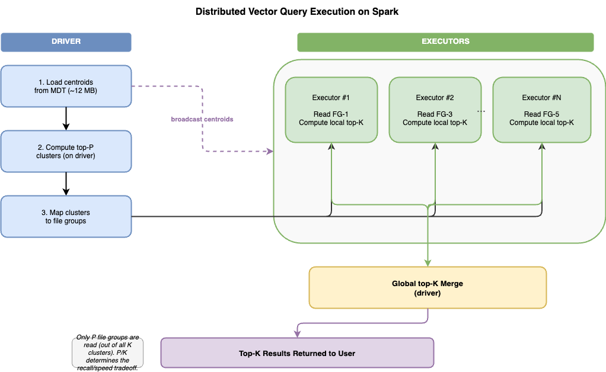

<!--
  Licensed to the Apache Software Foundation (ASF) under one or more
  contributor license agreements.  See the NOTICE file distributed with
  this work for additional information regarding copyright ownership.
  The ASF licenses this file to You under the Apache License, Version 2.0
  (the "License"); you may not use this file except in compliance with
  the License.  You may obtain a copy of the License at

       http://www.apache.org/licenses/LICENSE-2.0

  Unless required by applicable law or agreed to in writing, software
  distributed under the License is distributed on an "AS IS" BASIS,
  WITHOUT WARRANTIES OR CONDITIONS OF ANY KIND, either express or implied.
  See the License for the specific language governing permissions and
  limitations under the License.
-->

# RFC-104 Proposal B: Vector Index Read Path (MDT-Only)

## Scope

This proposal defines vector query planning and query-time candidate retrieval from MDT.

Out of scope for this proposal:

- write-time metadata generation
- bootstrap/rebuild and compaction lifecycle
- hidden-column based scans

## Query Surface

The long-term query surface is Spark SQL/DataFrame vector search, for example:

```sql
SELECT id, vector_distance(embedding, array(0.1, 0.2, ...)) AS distance
FROM products
WHERE approx_nearest_neighbors(embedding, array(0.1, 0.2, ...), 10)
ORDER BY distance
LIMIT 10;
```

The current POC exposes the read path through Hudi datasource options:

```properties
hoodie.datasource.read.vector.index.name=vec_idx
hoodie.datasource.read.vector.query.vector=[0.1, 0.2, 0.3]
hoodie.datasource.read.vector.query.nprobes=4
```

## Read Flow



1. Resolve the vector index definition and source column.
2. Parse the query vector and validate its dimension against the `VECTOR` schema.
3. Load centroids and active generation metadata from the MDT partition.
4. Compute top-N IVF clusters using the configured distance metric.
5. Read cluster manifest rows to resolve shard counts and file groups.
6. Prune file groups before Spark plans file scans.
7. Prefix-scan posting rows for selected cluster shards.
8. Score postings with RaBitQ approximate distance.
9. Keep a bounded top-k or top-r shortlist.
10. Attach record locations when needed through the record index.
11. Fetch exact vectors from the base table and re-rank final results.

## Current POC: Spark File Pruning


`VectorIndexSupport` is already wired into the Spark datasource index support layer. It currently:

- resolves vector read options from `DataSourceReadOptions`
- accepts either a user-visible index name or fully qualified `vector_index_<name>` partition
- loads centroids from the MDT vector partition
- reads cluster metadata rows when generation-aware cluster records are present
- falls back to legacy `__fg__/<cluster>/<partition_path>` rows while the POC transitions
- returns candidate file names to `HoodieFileIndex`

This validates the coarse pruning path end to end: vector query options can reduce the base/log files Spark opens for a read.

## Current POC: Engine-Agnostic Pruner

`VectorIndexPruner` in `hudi-common` owns the centroid math:

- `findTopClusters(query, numProbes)`
- `probe(query, numProbes)`
- distance metrics through `VectorDistanceMetric`
- partition-aware cluster-to-file-group maps

Keeping this in `hudi-common` allows Spark, Trino, and future engines to share the same cluster probing behavior.

## Current POC: MDT Posting Search

`VectorIndexMdtSearchUtils` is the custom MDT-native approximate search implementation already present in the repo. It provides:

- `readClusterShardCounts(...)`
- `buildPostingPrefixes(...)`
- `readPostingMatches(...)`
- `scorePostingMatches(...)`
- `selectTopK(...)`
- `attachRecordLocations(...)`
- `collectTopKWithLocations(...)`

This utility implements the second stage after coarse pruning:

```text
top clusters
  -> cluster shard counts
  -> P|generation|cluster|shard| prefix scans
  -> RaBitQ approximate scoring
  -> top-k reduction
  -> optional record-index location attachment
```

## MDT Posting Keys

The read path depends on lexicographically ordered posting keys:

```text
P|<generation>|<cluster>|<shard>|<record_key>
```

This allows efficient prefix scans for all postings in one selected cluster shard:

```text
P|0000007B|0000000A|0003|
```

The current raw key wrapper for this is `VectorPostingPrefixRawKey`.

## RaBitQ Query Scoring

For a query vector `q`, the read path uses the same rotation seed stored in MDT:

1. Normalize and rotate the query: `q_rotated = R @ normalize(q)`.
2. Pack `q_binary = sign(q_rotated)`.
3. For each selected posting, compute `hamming(q_binary, binary_code)`.
4. Convert the Hamming distance into an approximate cosine distance, applying `scalar` when vectors are not normalized.
5. Keep only the best bounded candidate set before exact re-ranking.

The current POC implementation for this is `VectorIndexMdtSearchUtils#scorePostingMatches`, which builds a `RaBitQEncoder` per partition and calls `estimateDistance(...)` against MDT posting payloads.

## Exact Re-Ranking

RaBitQ scoring produces an approximate shortlist. Exact re-ranking reads the authoritative `VECTOR` column from the base table for shortlisted records only. This keeps vector values out of MDT while still reducing the amount of base-table data read by the final query.

## Fallback Behavior

If vector metadata is missing, stale, or incompatible with the query vector dimension, the read path should fall back to normal Hudi scanning rather than returning incorrect results. Strict failure behavior can be added later using the existing data-skipping failure mode.

## Non-Goals

This read path does not read `_hudi_vec_*` hidden columns. All approximate candidate metadata comes from MDT posting rows.
