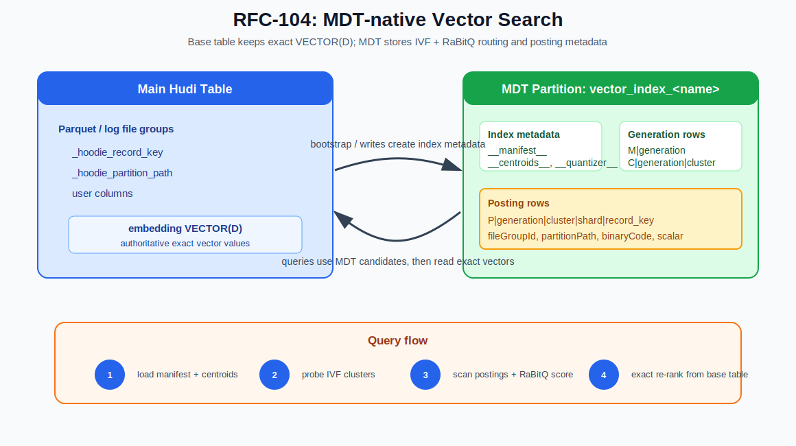
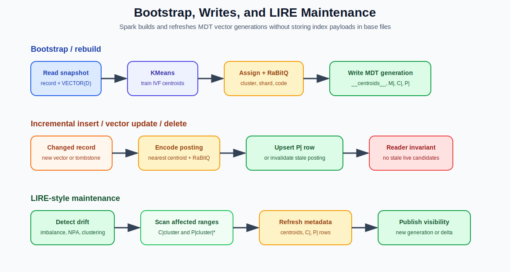
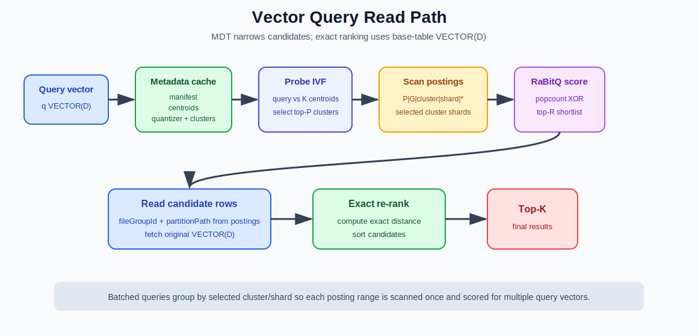

<!--
  Licensed to the Apache Software Foundation (ASF) under one or more
  contributor license agreements.  See the NOTICE file distributed with
  this work for additional information regarding copyright ownership.
  The ASF licenses this file to You under the Apache License, Version 2.0
  (the "License"); you may not use this file except in compliance with
  the License.  You may obtain a copy of the License at

       http://www.apache.org/licenses/LICENSE-2.0

  Unless required by applicable law or agreed to in writing, software
  distributed under the License is distributed on an "AS IS" BASIS,
  WITHOUT WARRANTIES OR CONDITIONS OF ANY KIND, either express or implied.
  See the License for the specific language governing permissions and
  limitations under the License.
-->

# RFC-104: Native Vector Search Support in Apache Hudi

## Proposers

@Revanth Chandupatla, @Rahil, @Surya

## Status

Issue: [#19094](https://github.com/apache/hudi/issues/19094)

---

## Table of Contents

- [Abstract](#abstract)
- [1. Goals](#1-goals)
- [2. Architecture](#2-architecture)
- [3. IVF + RaBitQ Index Algorithm](#3-ivf--rabitq-index-algorithm)
- [4. Metadata Table Storage Model](#4-metadata-table-storage-model)
- [5. Bootstrap and Write Path](#5-bootstrap-and-write-path)
- [6. Read Path](#6-read-path)
- [7. Maintenance, Rebalancing, and Cleaner](#7-maintenance-rebalancing-and-cleaner)
- [8. Spark API Surface](#8-spark-api-surface)
- [9. Correctness and Consistency](#9-correctness-and-consistency)
- [10. Test Plan](#10-test-plan)
- [11. References](#11-references)

---

## Abstract

This RFC proposes native approximate nearest-neighbor (ANN) vector search support in Apache
Hudi. A Hudi table stores authoritative vector values in a `VECTOR(D)` column in the base
table. Hudi stores the vector index in the Hudi metadata table (MDT), in a dynamic metadata
partition named `vector_index_<index_name>`.

The index uses IVF + RaBitQ:

1. **IVF routing** partitions vectors into K clusters trained with KMeans.
2. **RaBitQ binary quantization** stores one compact binary code per vector.
3. **MDT posting rows** store vector placement, base-table location, and RaBitQ payload.
4. **Queries** probe a small number of clusters, scan selected posting ranges, use RaBitQ to
   shortlist candidates, read original vectors from the base table, and exact re-rank.

The base table remains the source of truth for exact vector values. MDT stores only routing,
pruning, and approximate scoring metadata.

---

## 1. Goals

1. Keep original vector values in the base table `VECTOR(D)` column.
2. Store the vector index in MDT, using Hudi metadata-table commits and cleaning.
3. Avoid hidden or generated vector-index columns in base-table Parquet files.
4. Store one compact posting row per indexed vector in the active generation.
5. Support distributed Spark bootstrap, posting generation, query planning, and re-ranking.
6. Use approximate scoring only for candidate discovery; use exact base-table vectors for
   final ranking.
7. Support incremental inserts, updates, deletes, clustering refresh, and LIRE-style
   maintenance through MDT metadata updates.

---

## 2. Architecture



The base table stores exact `VECTOR(D)` values. The MDT partition stores the active generation,
centroids, RaBitQ quantizer metadata, cluster manifests, and posting rows. Query execution uses
MDT first to discover candidates, then reads base-table vectors for exact re-ranking.

Each vector index has one MDT partition. For example:

```sql
CREATE INDEX embedding_idx
ON products
USING VECTOR (embedding)
OPTIONS (
  'vector.dimension' = '768',
  'vector.metric' = 'cosine',
  'vector.quantizer' = 'IVF_RABITQ',
  'vector.num_clusters' = '4096'
);
```

creates:

```text
.hoodie/metadata/vector_index_embedding_idx/
```

The base table schema does not change:

```text
products/category=electronics/<file-group>.parquet
├── _hoodie_record_key      = p001
├── _hoodie_partition_path  = category=electronics
├── user columns            = ...
└── embedding VECTOR(768)   = [0.12, -0.08, ...]
```

---

## 3. IVF + RaBitQ Index Algorithm

### 3.1 IVF routing

Inverted File (IVF) indexing groups vectors around K centroids. Hudi trains the centroids
with Spark ML KMeans during bootstrap or rebuild. Each vector is assigned to the nearest
centroid according to the configured metric, such as cosine or L2 distance.

At query time, Hudi compares the query vector with all centroids and selects the top-P
nearest clusters, where P is `nprobes`. Only postings in those clusters are scanned.

### 3.2 RaBitQ encoding

RaBitQ stores a compact binary representation of each vector. It uses a deterministic random
orthogonal rotation matrix generated from `(dimension, randomSeed)`. MDT stores the seed, not
the matrix.

For each indexed vector `v`:

```text
1. norm = ||v||
2. normalized = v / norm                         # skipped when assumeNormalized=true
3. rotated = R @ normalized                      # R derived from randomSeed
4. binaryCode = pack(sign(rotated))              # one bit per dimension
5. scalar = norm                                 # omitted when assumeNormalized=true
```

For a 768-dimensional vector, the packed code is `ceil(768 / 8) = 96` bytes.

For a query vector `q`, the read path applies the same transformation and scores postings by
Hamming distance:

```text
hamming = popcount(queryBinaryCode XOR postingBinaryCode)
approxCosineSimilarity ≈ 1 - 2 * hamming / dimension
approxDistance ≈ 1 - approxCosineSimilarity
```

When vectors are not assumed normalized, the stored scalar can adjust approximate distance.
This score is used only to build a candidate shortlist. Final results are exact-ranked from
base-table vectors.

### 3.3 Why this fits Hudi

- Centroids are small enough to load at planning time: `K x D` floats.
- Posting rows are compact: one binary code plus routing/location metadata per vector.
- Posting keys are prefix-scannable by generation, cluster, and shard.
- RaBitQ has stable quantizer state: no learned codebook is stored per generation.
- Exact re-ranking preserves correctness for returned candidates.

---

## 4. Metadata Table Storage Model

### 4.1 Row families

| Key family | Cardinality | Purpose |
|---|---:|---|
| `__manifest__` | 1 | Active generation pointer used by readers. |
| `__centroids__` | 1 | Serialized K x D centroid matrix. |
| `__quantizer__` | 1 | RaBitQ type, code width, random seed, normalization flag. |
| `M|<generation>` | generations | Immutable generation-level metadata. |
| `C|<generation>|<cluster>` | K per generation | Cluster shard count, vector count, candidate file groups. |
| `P|<generation>|<cluster>|<shard>|<record_key>` | N per generation | Canonical posting row: placement, location, binary code, scalar. |

Each indexed vector has one posting row in the active generation. The posting row is the
vector-index entry for that record.

### 4.2 Example layout

For generation `0000007B` with two clusters:

```text
vector_index_embedding_idx/
├── __manifest__
├── __centroids__
├── __quantizer__
├── M|0000007B
├── C|0000007B|00000000
├── C|0000007B|00000001
├── P|0000007B|00000000|0000|p001
├── P|0000007B|00000000|0000|p002
└── P|0000007B|00000001|0000|p003
```

A posting row contains both placement and scoring metadata:

```text
key:   P|0000007B|00000000|0000|p001
value: HoodieVectorIndexInfo {
         entryType       = POSTING
         generationId    = 123
         recordKey       = p001
         clusterId       = 0
         shardId         = 0
         fileGroupId     = <base-table-file-group>
         partitionPath   = category=electronics
         baseInstantTime = <base-file-instant>
         binaryCode      = <packed RaBitQ bits>
         scalar          = <norm, null when assumeNormalized=true>
         lastUpdatedTs   = <write/build time>
       }
```

The key order is intentional:

```text
P|generation|cluster|shard|record_key
```

It supports prefix scans such as:

```text
P|0000007B|00000000|0000|
```

### 4.3 Posting shards

Large clusters are split into posting shards so one hot cluster does not become one huge MDT
prefix range:

```text
cluster 10
├── shard 0000: P|0000007B|0000000A|0000|*
├── shard 0001: P|0000007B|0000000A|0001|*
└── shard 0002: P|0000007B|0000000A|0002|*
```

The cluster manifest stores `shardCount`. Writers compute:

```text
shardId = hash(record_key) % shardCount
```

Sharding changes physical layout only. It does not change vector semantics.

### 4.4 Cluster manifests

Each `C|<generation>|<cluster>` row summarizes one IVF cluster:

```text
key:   C|0000007B|0000000A
value: HoodieVectorIndexInfo {
         entryType     = CLUSTER
         generationId  = 123
         clusterId     = 10
         shardCount    = 4
         fileGroupIds  = [fg1, fg7, fg9]
         vectorCount   = 125000
         lastUpdatedTs = <build time>
       }
```

The read path uses cluster manifests to find posting shard prefixes and candidate file groups.

### 4.5 Generation model

A generation is a consistent set of centroid, quantizer, cluster, and posting metadata:

```text
__manifest__         -> active generation id
M|0000007B           -> immutable generation metadata
C|0000007B|...       -> cluster manifests for generation 0000007B
P|0000007B|...       -> posting rows for generation 0000007B
```

A query must use one generation consistently. Publishing a generation is atomic from the
reader's perspective: write the generation rows, commit them to MDT, then update
`__manifest__`.

Old generations remain until no retained table snapshot needs them.

---

## 5. Bootstrap and Write Path



### 5.1 Spark bootstrap

Bootstrap creates a complete vector index generation from a table snapshot:

```text
1. Read latest base-table file slices.
2. Extract record key, partition path, file group, base instant, and VECTOR bytes.
3. Convert VECTOR values to Spark ML vectors.
4. Train IVF centroids with Spark ML KMeans.
5. Assign each vector to the nearest centroid.
6. Count cluster populations and derive shard counts.
7. Collect candidate file groups per cluster.
8. Encode every vector with RaBitQ.
9. Emit __centroids__, __quantizer__, __manifest__, M|, C|, and P| records.
```

The Spark implementation has two distributed phases:

- **Centroid training:** train KMeans over a bounded sample using Spark ML.
- **Assignment and encoding:** broadcast centroids, then use `mapPartitions` to assign
  clusters, compute shard IDs, encode RaBitQ codes, and emit posting records.

The training sample should satisfy percentage and per-cluster floors:

```text
targetSample = min(N, max(1M, 256 * K, min(10M, 0.5%-1% of N)))
```

### 5.2 Incremental inserts and vector updates

For an inserted record or vector-changing update, the writer computes:

```text
nearest centroid
cluster id
posting shard id
RaBitQ binary code
optional scalar
base-table file group
partition path
base instant
```

It writes the active-generation posting row:

```text
P|<active_generation>|<cluster>|<shard>|<record_key>
```

If an update changes the record's cluster or shard, the stale posting must become invisible
to readers through posting tombstones, replacement generations, generation-local deltas, or a
hybrid strategy.

### 5.3 Non-vector updates and deletes

If an update does not change the indexed vector, the RaBitQ code and cluster placement remain
valid. If the record moves to a different base-table file group, the posting's `fileGroupId`,
`partitionPath`, and `baseInstantTime` must be refreshed before old file slices are cleaned.

A delete must make the corresponding posting invisible to readers. Query-time posting scans
ignore deleted postings.

---

## 6. Read Path



### 6.1 Single-vector query

For one query vector:

```text
1. Validate query dimension against the indexed VECTOR(D) schema.
2. Load active generation, centroids, quantizer metadata, and cluster manifests.
3. Encode the query vector with RaBitQ using the generation's random seed.
4. Probe centroids and select top-P clusters.
5. Use cluster manifests to get shard counts for selected clusters.
6. Prefix-scan selected posting ranges:
     P|<generation>|<cluster>|<shard>|*
7. Score postings with Hamming distance against the query binary code.
8. Keep top-R approximate candidates.
9. Read original base-table VECTOR(D) values for those candidates.
10. Exact-rank candidates and return top-K results.
```

`R` is a refinement size greater than or equal to `K`. Larger `R` improves recall by giving
exact re-ranking more candidates.

### 6.2 Driver-side metadata cache

At query planning time, Hudi loads stable MDT metadata:

```text
__manifest__    active generation
__centroids__   centroid matrix
__quantizer__   RaBitQ seed, code width, normalization flag
C|generation|*  cluster manifests
```

This metadata can be cached on the driver until the vector index generation changes. For
`K=4096` and `D=768`, centroids are about 12 MB.

### 6.3 Batched queries

For a relation of query vectors:

```sql
SELECT q.query_id, p.id, vector_distance(q.embedding, p.embedding) AS distance
FROM query_vectors q
JOIN products p
  ON approx_nearest_neighbors(p.embedding, q.embedding, 10)
```

Hudi should share MDT work across the batch:

```text
1. Load generation metadata once.
2. Encode all query vectors.
3. Probe centroids per query vector.
4. Group by selected (cluster, shard).
5. Scan each selected posting range once.
6. Score postings against query vectors assigned to that range.
7. Maintain top-R candidates per query_id.
8. Read the union of base-table candidate rows.
9. Exact re-rank per query_id.
```

### 6.4 Fallback behavior

If required vector metadata is missing, incompatible with the query dimension, or unavailable
for the requested snapshot, Hudi must not return incorrect ANN results. It can fall back to a
normal table scan with exact vector evaluation or fail according to the configured query
failure mode.

---

## 7. Maintenance, Rebalancing, and Cleaner

### 7.1 LIRE-style maintenance

As new vectors arrive, fixed centroids can become imbalanced or stale. LIRE-style maintenance
inspects affected clusters and updates vector-index metadata without a full table rebuild.

A maintenance pass can:

```text
1. Read the active generation manifest.
2. Select affected clusters based on imbalance, centroid drift, or NPA violations.
3. Scan affected C|generation|cluster rows and P|generation|cluster|shard|* postings.
4. Recompute centroids and posting placement for affected clusters.
5. Write updated C| and P| metadata as a new generation or generation-local delta.
6. Publish visibility through __manifest__.
```

Posting rows already contain placement and base-table location, so maintenance operates over
affected posting ranges.

### 7.2 Maintenance triggers

| Trigger | Condition | Action |
|---|---|---|
| Cluster imbalance | `max_cluster_size / avg_cluster_size > threshold` | Split, merge, or rebalance affected clusters. |
| Centroid drift | Cluster mean moved beyond threshold | Recompute affected centroids. |
| NPA violations | Boundary vectors closer to neighboring centroids | Reassign affected postings. |
| Large replace commit | Many file groups replaced | Refresh file-group pointers or rebuild generation. |
| Periodic validation | Scheduled health check | Compare postings against base-table records. |

### 7.3 Clustering and cleaner coordination

Hudi clustering can replace base-table file groups. Since postings store `fileGroupId`,
`partitionPath`, and `baseInstantTime`, vector metadata must be refreshed before old file
slices are removed.

Two strategies are valid:

| Strategy | Behavior |
|---|---|
| Affected-file-group refresh | Re-read vectors from replaced file groups and rewrite affected postings and cluster manifests. |
| Generation rebuild | Build and publish a full replacement generation after broad reclustering. |

The metadata cleaner must retain vector generations as long as retained table snapshots may
need them. Visible postings must point to live base-table records for every snapshot served by
MDT.

---

## 8. Spark API Surface

The long-term query surface is Spark SQL/DataFrame vector search:

```sql
SELECT id, vector_distance(embedding, ARRAY(0.1, 0.2, ...)) AS distance
FROM products
WHERE approx_nearest_neighbors(embedding, ARRAY(0.1, 0.2, ...), 10)
ORDER BY distance
LIMIT 10;
```

Datasource options can expose the read path for integration and testing:

```properties
hoodie.datasource.read.vector.index.name=embedding_idx
hoodie.datasource.read.vector.query.vector=[0.1,0.2,...]
hoodie.datasource.read.vector.query.nprobes=8
hoodie.datasource.read.vector.query.topk=100
```

Index creation uses Hudi's index definition mechanism:

```sql
CREATE INDEX embedding_idx
ON products
USING VECTOR (embedding)
OPTIONS (
  'vector.dimension' = '768',
  'vector.metric' = 'cosine',
  'vector.quantizer' = 'IVF_RABITQ',
  'vector.num_clusters' = '4096',
  'vector.query.nprobes' = '8',
  'vector.rabitq.seed' = '42',
  'vector.rabitq.assume_normalized' = 'false'
);
```

---

## 9. Correctness and Consistency

### 9.1 Source of truth

The base table's `VECTOR(D)` column is the source of truth. MDT postings are an acceleration
structure. Exact re-ranking reads original vector values from the base table.

### 9.2 Generation consistency

A query must use one active generation consistently:

- manifest from generation `G`
- centroids and quantizer metadata for generation `G`
- cluster manifests for generation `G`
- posting rows with prefix `P|G|...`

### 9.3 Posting visibility

At most one live posting for a record should be visible within the active generation. Inserts,
updates, deletes, clustering refreshes, and maintenance preserve this through posting upserts,
tombstones, or generation publication.

### 9.4 Exact re-ranking

RaBitQ affects candidate discovery. Returned ordering among shortlisted candidates is based on
exact distance computed from base-table vectors.

---

## 10. Test Plan

- Unit tests for vector schema validation and vector byte conversion.
- Unit tests for vector MDT key generation and prefix ordering.
- Unit tests for RaBitQ deterministic encoding, query encoding, Hamming scoring, scalar
  handling, and dimension validation.
- Unit tests for Spark bootstrap utilities: centroid serialization, cluster assignment,
  shard-count derivation, shard-id stability, and posting construction.
- Metadata bootstrap tests validating `__centroids__`, `__quantizer__`, `__manifest__`, `M|`, `C|`, and `P|` records.
- Read-path tests for metadata cache loading, centroid probing, posting prefix generation,
  posting scans, RaBitQ scoring, and top-K reduction.
- Spark datasource tests for vector read options and candidate file pruning.
- SQL/TVF tests for approximate search and exact re-ranking.
- Integration tests comparing ANN results with brute-force exact search for recall and
  correctness.
- Lifecycle tests for vector updates, deletes, clustering refresh, generation activation, and
  cleaner retention.

---

## 11. References

1. **SPFresh: Enabling Efficient and Near-Real Vector Search in SPANN-based Systems** —
   LIRE-style incremental cluster maintenance and NPA invariants.
2. **RaBitQ: Quantizing High-Dimensional Vectors with Randomized Binary Quantization** —
   deterministic random rotation and compact binary vector codes.
3. **Product Quantization for Nearest Neighbor Search** — Jégou, Douze, Schmid, IEEE TPAMI 2011.
4. **Efficient and Robust Approximate Nearest Neighbor Search Using HNSW Graphs** —
   Malkov, Yashunin, IEEE TPAMI 2018.
5. **Apache Hudi Metadata Table Documentation** — https://hudi.apache.org/docs/metadata
