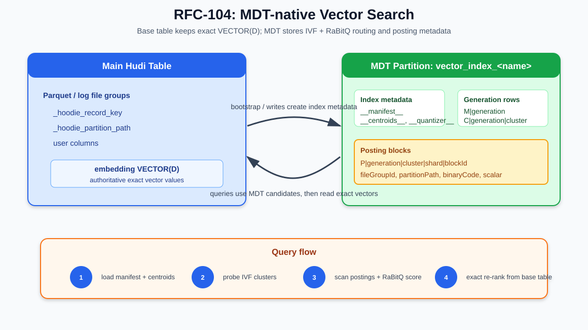
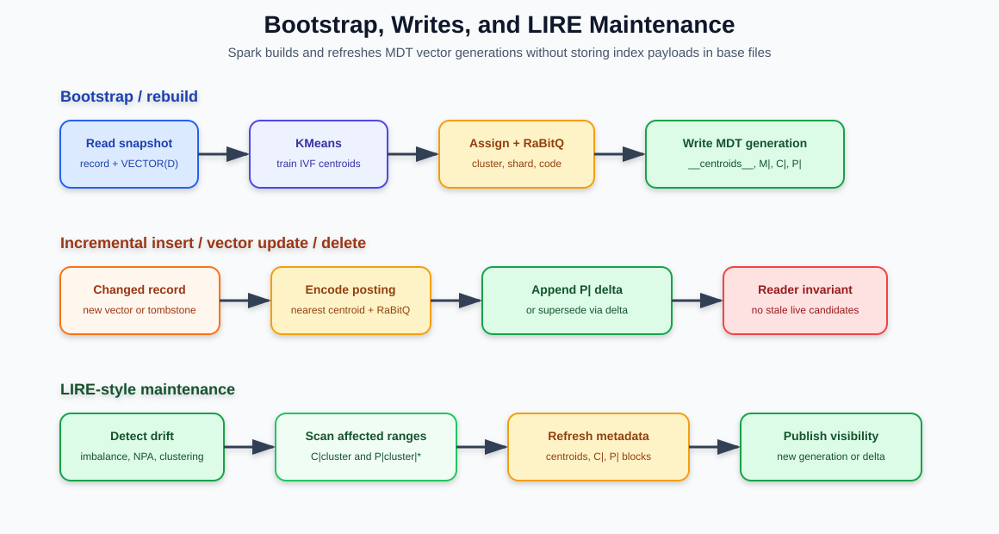
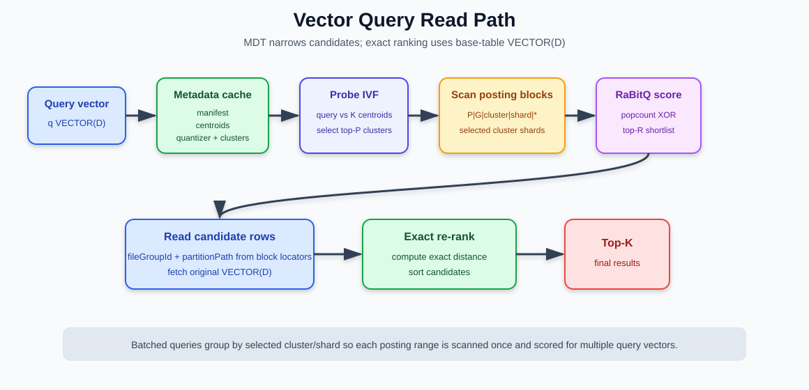

<!--
  Licensed to the Apache Software Foundation (ASF) under one or more
  contributor license agreements.  See the NOTICE file distributed with
  this work for additional information regarding copyright ownership.
  The ASF licenses this file to You under the Apache License, Version 2.0
  (the "License"); you may not use this file except in compliance with
  the License.  You may obtain a copy of the License at

       http://www.apache.org/licenses/LICENSE-2.0

  Unless required by applicable law or agreed to in writing, software
  distributed under the License is distributed on an "AS IS" BASIS,
  WITHOUT WARRANTIES OR CONDITIONS OF ANY KIND, either express or implied.
  See the License for the specific language governing permissions and
  limitations under the License.
-->

# RFC-104: Native Vector Search Support in Apache Hudi

## Proposers

@chrevanthreddy

## Approvers

- TBD

## Status

Umbrella issue: [apache/hudi#19094](https://github.com/apache/hudi/issues/19094)

Related: [apache/hudi#18676](https://github.com/apache/hudi/issues/18676)

State: UNDER REVIEW

---

## Table of Contents

- [Abstract](#abstract)
- [1. Goals and Non-Goals](#1-goals-and-non-goals)
- [2. Architecture](#2-architecture)
- [3. IVF + RaBitQ Index Algorithm](#3-ivf--rabitq-index-algorithm)
- [4. Metadata Table Storage Model: the Posting Block](#4-metadata-table-storage-model-the-posting-block)
- [5. Bootstrap and Write Path](#5-bootstrap-and-write-path)
- [6. Read Path](#6-read-path)
- [7. Maintenance, Rebalancing, and Cleaner](#7-maintenance-rebalancing-and-cleaner)
- [8. Spark API Surface](#8-spark-api-surface)
- [9. Correctness and Consistency](#9-correctness-and-consistency)
- [10. Test Plan](#10-test-plan)
- [11. Rollout and MVP Scope](#11-rollout-and-mvp-scope)
- [12. References](#12-references)

---

## Abstract

This RFC proposes native approximate nearest-neighbor (ANN) vector search in Apache Hudi.
Tables increasingly carry embedding columns (`ARRAY<FLOAT>` produced by ML models) next to
their business data, and users want to ask *"find the K rows most similar to this query
vector"* — for semantic search, recommendations, RAG, and deduplication — without copying
data into a separate vector database.

Today the only option on a Hudi table is a brute-force scan: read every vector, compute
every distance. That is correct but scales linearly with table size (tens of seconds at a
billion rows). This RFC adds an index so that vector queries read only a small, targeted
fraction of the index and the table, return results with high recall, and stay
transactionally consistent with the table under upserts and deletes — all with **no new
storage system**. The index lives in the Hudi Metadata Table (MDT), like Hudi's existing
record-level and secondary indexes, and is maintained by the same table services.

The design combines three well-understood pieces — IVF clustering, RaBitQ quantization, and
exact re-ranking — with one storage innovation that makes them practical on an immutable,
columnar, object-store-resident lakehouse:

> **The posting block.** Instead of one MDT record per indexed vector, the index packs
> ~1–4K vectors into a single MDT record laid out column-wise (structure-of-arrays), keyed
> so that one IVF cluster forms one contiguous, prefix-scannable key range. This reduces MDT
> record count by roughly three orders of magnitude, turns "scan a cluster" into a single
> contiguous range read, and lets a query touch only the columns a given scan pass needs.

The base table remains the source of truth for exact vector values. The MDT stores only
routing, pruning, and approximate-scoring metadata; final ranking always reads exact vectors
from the base table.

Prototype measurements on a **1-billion-row, 128-dimensional table** show exact-reranked
recall@10 = 0.985 at nprobe=128 with query latency in low single-digit seconds on a modest
Spark cluster, versus ~15s for brute force.

---

## 1. Goals and Non-Goals

### 1.1 Goals

1. Keep authoritative vector values in the base table (`ARRAY<FLOAT>` / `VECTOR(D)` column).
2. Store the vector index in the MDT, maintained by Hudi metadata-table commits, compaction,
   and cleaning — no hidden or generated columns in base-table files.
3. Make candidate discovery cheap and targeted: probe a few clusters, scan contiguous key
   ranges, score on compressed codes with a provable pruning bound.
4. Make results trustworthy: approximate math selects candidates; **exact** distance on
   base-table vectors ranks them.
5. Stay transactionally consistent: snapshot-pinned reads, correct behavior under inserts,
   updates, deletes, and clustering.
6. Be engine-neutral in design; Spark is the first implementation.
7. Maintain the index incrementally (no global rebuild for normal churn) and support
   versioned, zero-downtime rebuilds.

### 1.2 Non-Goals (initial landing)

- ANN families beyond IVF + RaBitQ (e.g. HNSW, DiskANN).
- Filtered search (arbitrary predicate + kNN) as a first-class planned operation.
- Time-travel-consistent index reads for historical snapshots.
- Engines beyond Spark, and GPU-accelerated encoding.
- Workload-specific auto-tuning of `nprobe` / refine factor.

---

## 2. Architecture



The design splits responsibilities the way Hudi already does between the data table and the
metadata table:

```text
DATA TABLE (parquet/orc)                METADATA TABLE (vector_index partition)
  authoritative vectors + payload  ←──   the index: centroids, quantizer, posting blocks,
  read only for final re-ranking          cluster manifests, generation manifest
                                          read for candidate generation
```

Each vector index is one MDT partition. Creating an index:

```sql
CREATE INDEX embedding_idx
ON products
USING VECTOR (embedding)
OPTIONS (
  'vector.dimension'   = '768',
  'vector.metric'      = 'cosine',
  'vector.quantizer'   = 'IVF_RABITQ',
  'vector.num_clusters'= '4096'
);
```

creates:

```text
.hoodie/metadata/vector_index_embedding_idx/
```

and does not change the base-table schema:

```text
products/category=electronics/<file-group>.parquet
├── _hoodie_record_key      = p001
├── _hoodie_partition_path  = category=electronics
├── user columns            = ...
└── embedding ARRAY<FLOAT>  = [0.12, -0.08, ...]
```

The query path uses the MDT first to discover candidates, then reads base-table vectors for
exact re-ranking:

```text
query vector
  → compare to centroids, pick nprobe clusters          (in-memory, ms)
  → MDT prefix-scan those clusters' posting blocks       (targeted range reads)
  → two-pass RaBitQ scoring, keep refineFactor·K best    (bit math + error bounds)
  → validate candidate freshness via Record Level Index  (batched point lookups)
  → fetch ONLY those rows from the base table by position (page-level reads)
  → exact distance on real vectors → final top-K
```

---

## 3. IVF + RaBitQ Index Algorithm

Every practical ANN index answers two questions: **where to look** (avoid scanning
everything) and **how to compare cheaply** (avoid full-precision math on what is scanned).

### 3.1 Where to look: IVF routing

Inverted File (IVF) indexing clusters vectors with KMeans into `numClusters` groups (e.g.
~4K–64K). Each vector belongs to its nearest centroid. A query compares against the centroids
only (thousands, not billions), selects the `nprobe` nearest clusters, and scans only those
clusters' entries. `nprobe` is the recall dial.

IVF is the right fit for a lakehouse-resident index because a cluster's entries can be stored
**contiguously**, which maps directly onto sorted key ranges in Hudi's MDT (§4). Graph
indexes (HNSW) give excellent in-memory recall but require random traversal of the whole
graph, which fights columnar, immutable, object-store storage.

### 3.2 How to compare cheaply: RaBitQ quantization

Inside a probed cluster there are still thousands of full vectors. Quantization stores a
small *code* per vector plus a few correction scalars, so most comparisons run on compressed
codes and only the best few hundred candidates are re-checked against real vectors.

RaBitQ is chosen over scalar (SQ), product (PQ), and plain binary quantization for four
reasons:

1. **Unbiased estimator with a provable per-vector error bound.** Each code carries scalars
   that turn a cheap bit-level dot product into an *unbiased* estimate of the true distance,
   plus a bound on how wrong it can be. The bound enables **safe pruning**: skip a vector
   only when even its best plausible distance cannot make top-K.
2. **No codebooks.** RaBitQ needs only a random rotation (a seed) and the centroids — both
   tiny, both versioned in the index metadata. Nothing to retrain when data drifts.
3. **Tunable precision.** B = 1 bit/dim is a fast coarse filter; B = 4 bits/dim gives
   near-SQ quality at ~8× less space. Both are used in a two-pass scan (§6.2).
4. **Metric-flexible.** One stored code serves L2, cosine, and dot-product; the metric is
   applied at query time.

The four ideas, precisely:

- **Residual.** Store each vector as its difference from its centroid, `r = v − c`.
  Residuals are small and centered, which is what lets few bits go far.
- **Rotation.** Apply one fixed random orthonormal rotation `R` (derived from a per-generation
  seed) to everything first: `x = R·r`. This spreads information evenly across dimensions,
  which is what makes the error bound hold for any data distribution. Only the seed is stored.
- **Code.** Quantize `x` to B bits per dimension, stored as **bit planes** — plane 0 holds
  bit 0 of every dimension, plane 1 bit 1, etc. The top plane alone is a 1-bit sign sketch.
  Scoring a plane against the (transformed) query is `AND`/`XOR` + `popcount` — a few CPU
  instructions per 64 dimensions.
- **Factors.** A handful of small scalars per vector (residual norm, two rescale factors, an
  error term, a centroid correction) that convert plane math into an unbiased distance
  estimate plus its confidence interval.

At query time the query vector is transformed the same way (`R·(q − c)` per probed cluster),
and the per-plane popcounts combine with the stored factors into the estimate and its bound.
The estimate builds the shortlist; exact base-table distances produce the final ranking (§6).

### 3.3 Why this fits Hudi

- Centroids are small enough to load at planning time: `K × D` floats (~12 MB for K=4096,
  D=768).
- Codes are compact: a 1B × 128-dim float table's raw vectors are ~512 GB; the RaBitQ index
  including keys and locators is ~136 GB, and the scanned portion per query is tens of MB.
- Posting keys are prefix-scannable by generation, cluster, and shard (§4).
- Quantizer state is stable: a seed and centroids, no per-generation learned codebook.
- Exact re-ranking preserves correctness for returned candidates.

---

## 4. Metadata Table Storage Model: the Posting Block

This section describes the core storage contribution of this RFC.

### 4.1 The posting block

A naive index would write one MDT record per indexed vector. At a billion rows that is a
billion MDT records per generation — prohibitive to write, compact, scan, and clean.

Instead, the index sorts entries by `(cluster, fileGroup, rowPosition)` and packs
~1–4K vectors' worth of codes and metadata into a single MDT record — a **posting block** —
laid out column-wise (structure-of-arrays) so each scan pass touches only the columns it
needs:

```text
POSTING BLOCK (~512 KB target, one MDT record)
┌───────────────────────────────────────────────┐
│ S1  sign planes        ← pass 1 touches this   │
│ S2  extra bit planes   ← pass 2, survivors     │
│ S3  factor arrays      ← both passes           │
│ S4  row locators       ← finalists only        │
│ S5  dictionaries (file groups, partitions)     │
│ S6  record keys        ← finalists only        │
└───────────────────────────────────────────────┘
key:  0x10 | generation | clusterId | shardId | blockId
```

Consequences:

- **~1000× fewer MDT records.** One block record replaces ~1–4K per-vector records, cutting
  write amplification, compaction cost, and cleaner load by three orders of magnitude.
- **Contiguous cluster scans.** The binary key scheme makes "scan cluster 12345" a single
  contiguous HFile range read rather than thousands of point lookups.
- **Pay only for promise.** Column-wise layout means pass 1 reads only sign planes + factors;
  only survivors touch extra planes; only finalists touch locators and keys (§6.2).

### 4.2 Row families

The `vector_index_<name>` partition holds several record families under one binary-sorted key
scheme, so one prefix scan of a cluster returns its blocks and any fresh deltas together:

| Key family | Cardinality | Purpose |
|---|---:|---|
| `__manifest__` | 1 | Active generation pointer used by readers. |
| `__centroids__` | 1 | Serialized `K × D` centroid matrix. |
| `__quantizer__` | 1 | RaBitQ type, bit width `B`, rotation seed, normalization flag. |
| `M\|<generation>` | generations | Immutable generation-level metadata. |
| `C\|<generation>\|<cluster>` | K per generation | Cluster manifest: shard count, vector count, candidate file groups, delta/tombstone counters. |
| `P\|<generation>\|<cluster>\|<shard>\|<blockId>` | blocks per generation | **Posting block** (packed codes, factors, locators, keys). |
| `P\|...\|<DELTA>` | deltas | Small per-record delta records appended to a cluster range between compactions. |

### 4.3 Posting shards

Large clusters are split into posting shards so one hot cluster does not become one oversized
prefix range. The cluster manifest stores `shardCount`; writers compute
`shardId = hash(record_key) % shardCount`. Within a shard, entries are packed into blocks by
`blockId`. Sharding changes physical layout only, never vector semantics.

### 4.4 Delta records

Between compactions, per-commit vector writes append small **delta records** (`blockId`
marked `DELTA`) at the end of the same cluster key range. Because they share the prefix, a
single cluster prefix scan sees packed blocks and fresh deltas in one pass (§6, §7).

### 4.5 Generation model

A generation is a consistent set of centroid, quantizer, cluster, and posting-block metadata:

```text
__manifest__      -> active generation id
M|<gen>           -> immutable generation metadata
__centroids__     -> centroid matrix for the active generation
__quantizer__     -> RaBitQ seed / width / normalization
C|<gen>|...       -> cluster manifests
P|<gen>|...       -> posting blocks + deltas
```

A query uses one generation consistently. Publishing a generation is atomic from a reader's
perspective: write the generation's rows, commit them to MDT, then flip `__manifest__`. Old
generations are retained until no retained table snapshot needs them. This enables
blue/green rebuilds with clean rollback.

### 4.6 Worked example: a posting block, end to end

This example uses a deliberately tiny configuration so the bytes are readable: dimension
`D = 4`, RaBitQ bits `B = 2` (one sign plane + one extra plane), `numClusters = 2`, and one
block holding three vectors. Real blocks hold ~1–4K vectors at `D = 128–768`.

**Base-table rows** (the source of truth; `embedding` is `ARRAY<FLOAT>`):

```text
_hoodie_record_key  embedding                 file group   row pos
p001                [ 0.90,  0.10,  0.10, 0.05]  fg-7        0
p002                [-0.80, -0.90,  0.05, 0.10]  fg-7        1
p003                [ 0.70,  0.20, -0.10, 0.60]  fg-9        4
```

**Bootstrap encodes each vector** against its cluster centroid. Say all three land in
cluster `5`, whose centroid is `c5 = [0.60, 0.05, 0.00, 0.20]`. For each row: residual
`r = v − c5`, rotate `x = R·r` (R from the generation seed; omitted here for readability),
then keep the sign bit and one magnitude bit per dimension, plus a few factors:

```text
row    residual r = v - c5          sign plane (bit/dim)   extra plane   factors {resNorm, rescale, errBound, ...}
p001   [ 0.30, 0.05, 0.10,-0.15]    1 1 1 0  = 0b1110      0 0 1 0        {0.35, 0.91, 0.04, ...}
p002   [-1.40,-0.95, 0.05,-0.10]    0 0 1 0  = 0b0010      1 1 0 0        {1.69, 0.88, 0.05, ...}
p003   [ 0.10, 0.15,-0.10, 0.40]    1 1 0 1  = 0b1101      0 0 0 1        {0.45, 0.90, 0.06, ...}
```

**These three rows are packed column-wise into ONE posting block record** (not three
records). Laid out as structure-of-arrays so each scan pass reads only what it needs:

```text
MDT record
key:   P | gen=0000007B | cluster=00000005 | shard=0000 | block=00000000
value (posting block, packed):
  header : { count=3, dim=4, bits=2, codeRowBytes=1 }
  S1 sign planes   : [ 0b1110, 0b0010, 0b1101 ]                 # 3 bytes  (pass 1)
  S2 extra planes  : [ 0b0010, 0b1100, 0b0001 ]                 # 3 bytes  (pass 2, survivors)
  S3 factor arrays : resNorm[]=[0.35,1.69,0.45] rescale[]=[...] errBound[]=[...]   (both passes)
  S4 row locators  : [ (fgIdx0,row0), (fgIdx0,row1), (fgIdx1,row4) ]   # finalists only
  S5 dictionaries  : fileGroups=[fg-7, fg-9] partitions=[default]
  S6 record keys   : [ p001, p002, p003 ]                        # finalists only
```

One record, three vectors. At production sizes this is ~1–4K vectors in one record — the
~1000× reduction in MDT record count over a per-vector layout.

**Query time.** Query `q = [0.85, 0.15, 0.00, 0.10]`. Planning compares `q` to the two
centroids, picks cluster `5` (`nprobe = 1` here), and issues one prefix scan:

```text
scan  P|0000007B|00000005|*        →  returns this block (+ any deltas)
```

Then the two-pass scan runs over the block's columns:

```text
Pass 1 (read S1 + S3 only): transform q the same way, compute an optimistic bound per row
        from the sign plane popcounts and factors. Suppose K=1, refineFactor=2:
          p001 bound = 0.86   ← keep
          p003 bound = 0.71   ← keep
          p002 bound = 0.05   ← pruned (best case cannot reach top-2; S2/S4/S6 never read)
Pass 2 (read S2 for survivors): full 2-bit estimate for p001, p003; keep refineFactor·K = 2.
Finalize (read S4 + S6 for the 2 survivors): locators (fg-7,row0) & (fg-9,row4); keys p001,p003.
```

**Freshness + exact rerank.** The two finalist keys are checked against the Record Level
Index on the pinned snapshot (both live), then their exact vectors are fetched by position —
only rows `(fg-7, 0)` and `(fg-9, 4)`, page-level reads, not a file scan — and ranked by true
distance:

```text
exact L2(q, p001) = 0.019     ← final top-1
exact L2(q, p003) = 0.320
```

Approximate math (bit planes) selected the two candidates cheaply; exact math on real
vectors produced the answer. `p002` cost only its sign-plane byte and was never materialized.

**A later update** to `p003`'s vector appends a small delta at the end of the same range:

```text
P|0000007B|00000005|0000|DELTA|p003   →  { new sign/extra code, new factors, new locator }
```

The next scan of cluster `5` sees the block and the delta in one pass; the delta supersedes
the block's entry for `p003`. When deltas for the cluster cross a threshold, MDT compaction
folds them back into a fresh packed block and resets the counters (§7.2).

---

## 5. Bootstrap and Write Path



### 5.1 Spark bootstrap

Bootstrap builds a complete generation from a table snapshot in two distributed phases:

```text
1. Read latest base-table file slices; extract record key, partition path, file group,
   base instant, and vector bytes.
2. Train IVF centroids with Spark ML KMeans over a bounded sample.
3. Broadcast centroids; in mapPartitions, assign each vector to its nearest cluster,
   compute shard id, and encode the RaBitQ code + factors.
4. Sort entries by (cluster, fileGroup, rowPosition) and pack them into posting blocks.
5. Emit __centroids__, __quantizer__, __manifest__, M|, C| (with shard/vector counts and
   candidate file groups), and P| posting-block records.
```

The training sample satisfies percentage and per-cluster floors, e.g.:

```text
targetSample = min(N, max(1M, 256 * K, min(10M, 0.5%–1% of N)))
```

### 5.2 Incremental inserts and vector updates

For an inserted row or a vector-changing update, the metadata writer's vector hook computes
the nearest centroid, cluster id, shard id, RaBitQ code, optional scalar, and base-table
location, and appends a posting **delta** to the active generation's cluster range. If an
update moves a record to a different cluster/shard, the stale entry is made invisible through
delta supersession and query-time arbitration (§6.3, §9.3).

### 5.3 Non-vector updates and deletes

If an update does not change the vector, the code and cluster placement stay valid; if the
record moved to a different base-table file group, its locator is refreshed at the next
compaction (before old file slices are cleaned). Deletes require **no index write**: the
Record Level Index already knows a key is gone, and query-time arbitration drops
stale/deleted candidates.

---

## 6. Read Path



### 6.1 Query planning

```text
1. Validate the query dimension against the indexed vector schema.
2. Load the active generation: __manifest__, __centroids__, __quantizer__, and cluster
   manifests (cacheable on the driver until the generation changes).
3. Probe centroids and select the top-nprobe clusters.
4. From cluster manifests, resolve shard prefixes and candidate file groups.
```

### 6.2 Two-pass scan over posting blocks

For each selected `(cluster, shard)`, prefix-scan `P|<gen>|<cluster>|<shard>|*` (blocks +
deltas) and score column-wise:

```text
Pass 1 (bound + prune): read S1 sign planes + S3 factors. For every vector compute an
        optimistic bound — the best distance it could possibly achieve. Skip vectors whose
        best case cannot beat the current K-th candidate (typically 85–95% pruned).
Pass 2 (refine):        for survivors, read S2 extra bit planes and compute the full
        multibit unbiased estimate; keep the refineFactor·K best.
Finalize:               only the surviving finalists touch S4 locators and S6 keys to learn
        where they live and who they are.
```

Cost is proportional to promise, not to table size. Delta records encountered in the same
scan are scored identically and supersede matching packed entries.

### 6.3 Freshness arbitration and exact re-rank

Posting locators are treated as *hints*. The finalists' record keys are validated against the
Record Level Index in batched point lookups on the same pinned snapshot:

- moved file group → re-resolve location by key;
- missing → deleted → drop the candidate.

Surviving finalists' exact vectors are then read from the base table using row-position /
page-level positional reads (the ~500 candidate rows cost megabytes, not a full slice scan),
exact distances are computed, and the final top-K is returned.

### 6.4 Batched queries

For a relation of query vectors, the plan shares MDT work: load generation metadata once,
encode all queries, probe per query, group by selected `(cluster, shard)`, scan each range
once while maintaining a per-query top-R heap, then read the union of candidate rows and
exact re-rank per query.

### 6.5 Fallback

If required vector metadata is missing, incompatible with the query dimension, or unavailable
for the requested snapshot, Hudi must not return incorrect ANN results — it falls back to an
exact table scan or fails per the configured failure mode.

---

## 7. Maintenance, Rebalancing, and Cleaner

Vectors change. Index health is kept without global rebuilds through three tiers of
increasing rarity (LIRE — Local Incremental Rebalancing).

### 7.1 Per commit (continuous)

The vector hook appends posting deltas for written rows and increments per-cluster counters
(live / delta / tombstone) additively. Deletes need no index write.

### 7.2 Compaction (periodic, counter-triggered)

When a cluster's delta count crosses a threshold, MDT compaction rewrites that cluster's
range: fold deltas into packed blocks, drop dead entries, refresh locators for rewritten file
groups, and reset counters. This bounds read cost so deltas never accumulate past a few
percent of a cluster.

### 7.3 Rebalancing (rare, statistics-triggered)

Sustained skew triggers a **local** split/merge: fetch the affected cluster's raw vectors
(the same positional reader the query path uses), run a local 2-means, re-encode into two
clusters, and reassign a bounded set of boundary vectors from neighbors — committed under a
new centroid epoch so in-flight queries stay consistent. Each operation touches one cluster
and its neighbors, never the whole index. At realistic churn (~1%/day) splits trigger weeks
apart.

### 7.4 Triggers and cleaner coordination

| Trigger | Condition | Action |
|---|---|---|
| Delta accumulation | delta count over threshold | Compact the cluster range. |
| Cluster imbalance | `max_cluster / avg_cluster > threshold` | Local split / merge. |
| Centroid drift | cluster mean moved beyond threshold | Recompute affected centroids / new epoch. |
| Large replace commit | many file groups replaced | Refresh locators or rebuild a generation. |
| Periodic validation | scheduled health check | Compare postings against base-table records. |

The metadata cleaner retains vector generations as long as any retained table snapshot may
need them; visible entries must point to live base-table records for every snapshot MDT
serves.

---

## 8. Spark API Surface

Table-valued function (single-query):

```sql
SELECT * FROM hudi_vector_search(
    table  => 'products',
    column => 'embedding',
    query  => ARRAY(0.1, 0.2, ...),
    k      => 10,
    metric => 'cosine',        -- l2 | cosine | dot_product
    mode   => 'approximate'    -- or 'exact_rerank'
);
```

Datasource options (integration/testing):

```properties
hoodie.datasource.read.vector.index.name=embedding_idx
hoodie.datasource.read.vector.query.vector=[0.1,0.2,...]
hoodie.datasource.read.vector.query.nprobes=8
hoodie.datasource.read.vector.query.topk=100
```

Index DDL:

```sql
CREATE INDEX embedding_idx
ON products
USING VECTOR (embedding)
OPTIONS (
  'vector.dimension'                = '768',
  'vector.metric'                   = 'cosine',
  'vector.quantizer'                = 'IVF_RABITQ',
  'vector.num_clusters'             = '4096',
  'vector.rabitq.bits'              = '4',
  'vector.rabitq.seed'              = '42',
  'vector.rabitq.assume_normalized' = 'false',
  'vector.query.nprobes'            = '8'
);
```

---

## 9. Correctness and Consistency

- **Source of truth.** The base-table vector column is authoritative; MDT posting blocks are
  an acceleration structure. Exact re-ranking reads original vectors from the base table.
- **Generation consistency.** A query uses one generation for manifest, centroids, quantizer,
  cluster manifests, and posting blocks (`P|G|...`).
- **Snapshot pinning.** MDT reads, RLI checks, and base-table reads all use one pinned table
  snapshot.
- **Visibility.** At most one live entry per record is visible in the active generation;
  inserts, updates, deletes, clustering, and maintenance preserve this via delta
  supersession, RLI arbitration, or generation publication.
- **Ranking.** RaBitQ affects candidate discovery only; final ordering among finalists is by
  exact distance computed from base-table vectors.

---

## 10. Test Plan

- Unit: vector schema validation and byte conversion; MDT key generation and prefix ordering;
  RaBitQ deterministic encoding, query transform, multibit plane scoring, factor handling,
  and the pruning bound (approximate estimate within its stated error of exact).
- Unit: posting-block pack/unpack round-trip (all six sections), delta supersession, shard-id
  stability, and two-pass scan pruning correctness.
- Bootstrap: `__centroids__`, `__quantizer__`, `__manifest__`, `M|`, `C|`, `P|` block records;
  cluster/shard counts; candidate file groups.
- Read path: metadata cache loading, centroid probing, block prefix scan, two-pass scoring,
  RLI arbitration, positional exact fetch, top-K reduction.
- Datasource / SQL: vector read options, candidate file pruning, TVF approximate and
  exact-rerank modes.
- Integration: ANN vs brute-force recall/correctness; lifecycle across vector updates,
  deletes, clustering refresh, generation activation, and cleaner retention.

---

## 11. Rollout and MVP Scope

RFC-104 lands as a sequence of small, focused, generic PRs tracked by umbrella issue
[#19094](https://github.com/apache/hudi/issues/19094), so the community can review
architecture separately from code, the storage model separately from execution, bootstrap
separately from the read path, and lifecycle separately from scoring:

| PR / child issue | Scope |
|---|---|
| #19095 | This RFC document (docs-only). |
| #19096 | Vector index options and Spark DDL scaffolding (§8). |
| #19097 | MDT row families and posting-block payload schema, multibit-aware (§4). |
| #19098 | RaBitQ encoder/scorer contract, multibit-aware (§3). |
| #19099 | Spark bootstrap: IVF clustering + posting-block generation (§5). |
| #19100 | Generation visibility and reader consistency (§4.5, §9). |
| #19101 | Query planning via centroid probing (§6.1). |
| #19102 | Posting-block scan + approximate top-K candidate generation (§6.2). |
| #19103 | Exact rerank from authoritative base-table vectors (§6.3). |
| #19104 | Drop, rebuild, and cleanup semantics (§7). |
| #19105 | Unit, integration, and Spark SQL coverage (§10). |

**MVP:** MDT-backed posting-block storage; Spark-first; IVF clustering and probe planning;
multibit RaBitQ approximate candidate generation; exact rerank from base-table vectors;
create / drop / rebuild semantics; correctness and integration tests.

**Non-goals for first landing:** ANN families beyond IVF + RaBitQ; filtered search;
time-travel index reads; engines beyond Spark; GPU encoding; advanced auto-tuning; and
positional exact-fetch micro-optimizations beyond the baseline positional read.

---

## 12. References

1. **RaBitQ: Quantizing High-Dimensional Vectors with a Theoretical Error Bound for
   Approximate Nearest Neighbor Search** — Gao & Long, SIGMOD 2024. Randomized binary
   quantization with an unbiased estimator and per-vector error bound.
2. **Extended / multi-bit RaBitQ** — higher-bit residual quantization with the same bound.
3. **Product Quantization for Nearest Neighbor Search** — Jégou, Douze, Schmid, IEEE TPAMI 2011.
4. **Efficient and Robust Approximate Nearest Neighbor Search Using HNSW Graphs** — Malkov,
   Yashunin, IEEE TPAMI 2018.
5. **SPFresh: Incremental In-Place Update for Billion-Scale Vector Search** — local
   incremental cluster maintenance and NPA invariants (LIRE inspiration).
6. **Apache Hudi Metadata Table** — https://hudi.apache.org/docs/metadata
