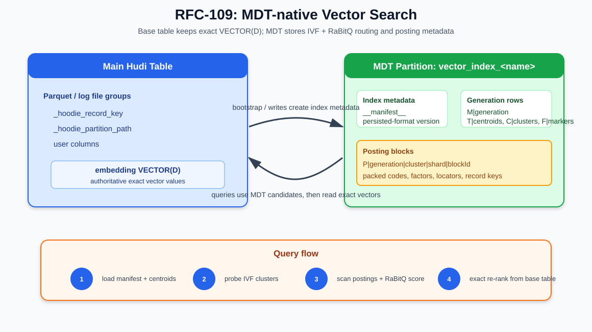
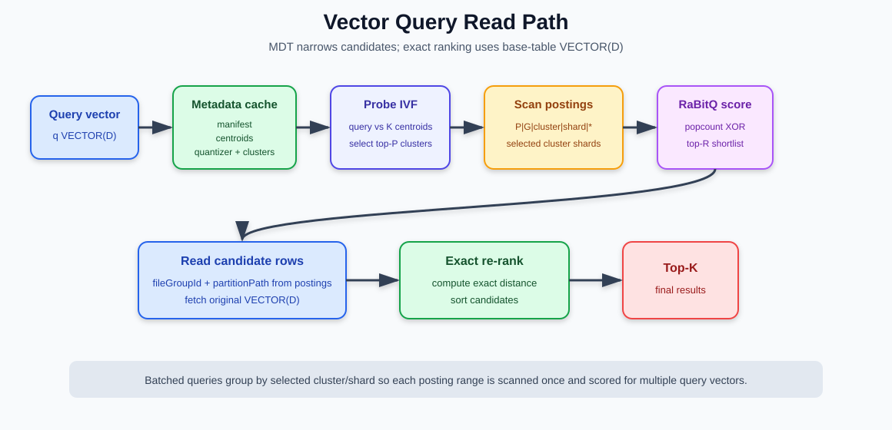

<!--
  Licensed to the Apache Software Foundation (ASF) under one or more
  contributor license agreements.  See the NOTICE file distributed with
  this work for additional information regarding copyright ownership.
  The ASF licenses this file to You under the Apache License, Version 2.0
  (the "License"); you may not use this file except in compliance with
  the License.  You may obtain a copy of the License at

       http://www.apache.org/licenses/LICENSE-2.0

  Unless required by applicable law or agreed to in writing, software
  distributed under the License is distributed on an "AS IS" BASIS,
  WITHOUT WARRANTIES OR CONDITIONS OF ANY KIND, either express or implied.
  See the License for the specific language governing permissions and
  limitations under the License.
-->

# RFC-109: Native Vector Search Support in Apache Hudi

## Proposers

@chrevanthreddy

## Approvers

- TBD

## Status

Umbrella issue: [apache/hudi#19094](https://github.com/apache/hudi/issues/19094)

Related: [apache/hudi#18676](https://github.com/apache/hudi/issues/18676)

State: UNDER REVIEW

---

## Table of Contents

- [Abstract](#abstract)
- [1. Goals and Non-Goals](#1-goals-and-non-goals)
- [2. Architecture](#2-architecture)
- [3. IVF + RaBitQ Index Algorithm](#3-ivf--rabitq-index-algorithm)
- [4. Metadata Table Storage Model: the Posting Block](#4-metadata-table-storage-model-the-posting-block)
- [5. Bootstrap and Write Path](#5-bootstrap-and-write-path)
- [6. Read Path](#6-read-path)
- [7. Maintenance, Rebalancing, and Cleaner](#7-maintenance-rebalancing-and-cleaner)
- [8. Spark API Surface](#8-spark-api-surface)
- [9. Correctness, Compatibility, and Freshness](#9-correctness-compatibility-and-freshness)
- [10. Test Plan](#10-test-plan)
- [11. Benchmark Evidence, Rollout, and MVP Scope](#11-benchmark-evidence-rollout-and-mvp-scope)
- [12. References](#12-references)

---

## Abstract

This RFC proposes native approximate nearest-neighbor (ANN) vector search in Apache Hudi.
Tables increasingly carry embedding columns represented by Hudi's fixed-dimension
`VECTOR(D[, elementType])` logical type, and users want to ask *"find the K rows most
similar to this query vector"* — for semantic search, recommendations, RAG, and
deduplication — without copying data into a separate vector database.

Today the only option on a Hudi table is a brute-force scan: read every vector, compute
every distance. That is correct but scales linearly with table size (tens of seconds at a
billion rows). This RFC adds an index so that vector queries read only a small, targeted
fraction of the index and the table, return results with high recall, and stay
transactionally consistent with the table under upserts and deletes — all with **no new
storage system**. The index lives in the Hudi Metadata Table (MDT), like Hudi's existing
record-level and secondary indexes, and is maintained by the same table services.

The design combines three well-understood pieces — IVF clustering, RaBitQ quantization, and
exact re-ranking — with one storage innovation that makes them practical on an immutable,
columnar, object-store-resident lakehouse:

> **The posting block.** Instead of one MDT record per indexed vector, the index packs
> ~1–4K vectors into a single MDT record laid out column-wise (structure-of-arrays), keyed
> so that one IVF cluster forms one contiguous, prefix-scannable key range. This reduces MDT
> record count by roughly three orders of magnitude, turns "scan a cluster" into a single
> contiguous range read, and lets a query touch only the columns a given scan pass needs.

The base table remains the source of truth for exact vector values. The MDT stores only
routing, pruning, and approximate-scoring metadata; final ranking always reads exact vectors
from the base table.

Artifacted measurements on a **1-billion-row, 128-dimensional table** show approximate-only
recall@10 of 0.824, 0.843, and 0.845 at `nprobe=16`, `32`, and `64`; exact reranking reaches
0.983 at `nprobe=32` with `refineFactor=50` (§11). These modes serve different goals:
approximate-only provides the latency floor, while exact reranking is the recommended
quality mode.

---

## 1. Goals and Non-Goals

### 1.1 Goals

1. Keep authoritative vector values in a top-level base-table `VECTOR(D[, elementType])` column.
2. Store the vector index in the MDT, maintained by Hudi metadata-table commits, compaction,
   and cleaning — no hidden or generated columns in base-table files.
3. Make candidate discovery cheap and targeted: probe a few clusters, scan contiguous key
   ranges, score on compressed codes with a provable pruning bound.
4. Make results trustworthy: approximate math selects candidates; **exact** distance on
   base-table vectors ranks them.
5. Stay transactionally consistent: snapshot-pinned reads, correct behavior under inserts,
   updates, deletes, and clustering.
6. Be engine-neutral in design; Spark is the first implementation.
7. Maintain the index incrementally (no global rebuild for normal churn) and support
   versioned, zero-downtime rebuilds.

### 1.2 Non-Goals (initial landing)

- ANN families beyond IVF + RaBitQ (e.g. HNSW, DiskANN).
- Filtered search (arbitrary predicate + kNN) as a first-class planned operation.
- Time-travel-consistent index reads for historical snapshots.
- Native non-Spark generation construction, GPU encoding, and workload-specific auto-tuning.

### 1.3 Alternatives considered

- **One index record per vector** is simple but creates billions of MDT records and excessive
  write, compaction, and scan amplification; posting blocks preserve MDT ownership while
  amortizing that overhead.
- **Dedicated index files in the table** permit specialized layouts but introduce a second
  commit, cleaning, and snapshot protocol. MDT records reuse Hudi's existing transaction and
  table-service machinery.
- **External sidecar indexes or vector databases** may offer richer serving features but lose
  atomic Hudi snapshot semantics and require another storage system. They remain valid when
  independent serving infrastructure is desired.
- **Native ANN libraries** improve local kernels but do not define durable object-store layout,
  multi-writer maintenance, or snapshot visibility. They may be used behind the interfaces in
  this RFC without changing the persisted contract.

---

## 2. Architecture



The design splits responsibilities the way Hudi already does between the data table and the
metadata table:

```text
DATA TABLE (parquet/orc)                METADATA TABLE (vector_index partition)
  authoritative vectors + payload  ←──   the index: centroids, quantizer, posting blocks,
  read only for final re-ranking          cluster manifests, generation manifest
                                          read for candidate generation
```

Each vector index is one MDT partition. RFC-109 adds no table properties, common writer-
dispatch changes, timeline-semantics changes, or behavior visible to non-vector readers or
writers. Every consistency mechanism is either a record in the vector-index MDT partition or
logic in the RFC-owned vector indexer and query planner. Creating an index:

```sql
CREATE INDEX embedding_idx
ON products
USING VECTOR (embedding)
OPTIONS (
  'vector.metric'      = 'cosine',
  'vector.quantizer'   = 'IVF_RABITQ',
  'vector.num_clusters'= '4096'
);
```

creates:

```text
.hoodie/metadata/vector_index_embedding_idx/
```

and does not add generated columns to the base-table schema. RFC-109 consumes rather than
redefines the RFC-99 vector contract: the source must be a top-level Hudi
`VECTOR(D[, elementType])`. The table schema is authoritative for `D` and element type;
index definitions and generation manifests repeat them only for integrity validation.

The current RFC-99 storage backing is fixed-width bytes: Avro `FIXED` and Parquet
`FIXED_LEN_BYTE_ARRAY(D × elementWidth)`. Engine adapters expose idiomatic values—Spark uses
an annotated `ArrayType(FloatType|DoubleType|ByteType)`—and convert at the storage boundary.
This fixed width also avoids Parquet LIST repetition-level traversal during positional exact
fetch. A plain `ARRAY<FLOAT>` is not implicitly indexable and requires explicit migration or
backfill to `VECTOR(D)`; index creation neither reinterprets nor rewrites it.

The query path uses the MDT first to discover candidates, then reads base-table vectors for
exact re-ranking:

```text
query vector
  → compare to centroids, pick nprobe clusters          (in-memory, ms)
  → MDT prefix-scan those clusters' posting blocks       (targeted range reads)
  → two-pass RaBitQ scoring, keep refineFactor·K best    (bit math + error bounds)
  → validate candidate freshness via Record Level Index  (batched point lookups)
  → fetch ONLY those rows from the base table by position (page-level reads)
  → exact distance on real vectors → final top-K
```

---

## 3. IVF + RaBitQ Index Algorithm

Every practical ANN index answers two questions: **where to look** (avoid scanning
everything) and **how to compare cheaply** (avoid full-precision math on what is scanned).

### 3.1 Where to look: IVF routing

Inverted File (IVF) indexing clusters vectors with KMeans into `numClusters` groups (e.g.
~4K–64K). Each vector belongs to its nearest centroid. A query compares against the centroids
only (thousands, not billions), selects the `nprobe` nearest clusters, and scans only those
clusters' entries. `nprobe` is the recall dial.

IVF is the right fit for a lakehouse-resident index because a cluster's entries can be stored
**contiguously**, which maps directly onto sorted key ranges in Hudi's MDT (§4). Graph
indexes (HNSW) give excellent in-memory recall but require random traversal of the whole
graph, which fights columnar, immutable, object-store storage.

### 3.2 How to compare cheaply: RaBitQ quantization

Inside a probed cluster there are still thousands of full vectors. Quantization stores a
small *code* per vector plus a few correction scalars, so most comparisons run on compressed
codes and only the best few hundred candidates are re-checked against real vectors.

RaBitQ is chosen over scalar (SQ), product (PQ), and plain binary quantization for four
reasons:

1. **Unbiased estimator with a provable per-vector error bound.** Each code carries scalars
   that turn a cheap bit-level dot product into an *unbiased* estimate of the true distance,
   plus a bound on how wrong it can be. The bound enables **safe pruning**: skip a vector
   only when even its best plausible distance cannot make top-K.
2. **No codebooks.** RaBitQ needs only a random rotation (a seed) and the centroids — both
   tiny, both versioned in the index metadata. Nothing to retrain when data drifts.
3. **Tunable precision.** B = 1 bit/dim is a fast coarse filter; B = 4 bits/dim gives
   near-SQ quality at ~8× less space. Both are used in a two-pass scan (§6.2).
4. **Metric-flexible.** One stored code serves L2, cosine, and dot-product; the metric is
   applied at query time.

The four ideas, precisely:

- **Residual.** Store each vector as its difference from its centroid, `r = v − c`.
  Residuals are small and centered, which is what lets few bits go far.
- **Rotation.** Apply one fixed random orthonormal rotation `R` (derived from a per-generation
  seed) to everything first: `x = R·r`. This spreads information evenly across dimensions,
  which is what makes the error bound hold for any data distribution. Only the seed is stored.
- **Code.** Quantize `x` to B bits per dimension, stored as **bit planes** — plane 0 holds
  bit 0 of every dimension, plane 1 bit 1, etc. The top plane alone is a 1-bit sign sketch.
  Scoring a plane against the (transformed) query is `AND`/`XOR` + `popcount` — a few CPU
  instructions per 64 dimensions.
- **Factors.** A handful of small scalars per vector (residual norm, two rescale factors, an
  error term, a centroid correction) that convert plane math into an unbiased distance
  estimate plus its confidence interval.

At query time the query vector is transformed the same way (`R·(q − c)` per probed cluster),
and the per-plane popcounts combine with the stored factors into the estimate and its bound.
The estimate builds the shortlist; exact base-table distances produce the final ranking (§6).

### 3.3 Why this fits Hudi

- Centroids are small enough to load at planning time: `K × D` floats (~12 MB for K=4096,
  D=768).
- Codes are compact: a 1B × 128-dim float table's raw vectors are ~512 GB; the RaBitQ index
  including keys and locators is ~136 GB, and the scanned portion per query is tens of MB.
- Posting keys are prefix-scannable by generation, cluster, and shard (§4).
- Quantizer state is stable: a seed and centroids, no per-generation learned codebook.
- Exact re-ranking preserves correctness for returned candidates.

---

## 4. Metadata Table Storage Model: the Posting Block

This section describes the core storage contribution of this RFC.

### 4.1 The posting block

A naive index would write one MDT record per indexed vector. At a billion rows that is a
billion MDT records per generation — prohibitive to write, compact, scan, and clean.

Instead, the index sorts entries by `(cluster, fileGroup, rowPosition)` and packs
~1–4K vectors' worth of codes and metadata into a single MDT record — a **posting block** —
laid out column-wise (structure-of-arrays) so each scan pass touches only the columns it
needs:

```text
POSTING BLOCK (~512 KB target, one MDT record)
┌───────────────────────────────────────────────┐
│ S1  sign planes        ← pass 1 touches this   │
│ S2  extra bit planes   ← pass 2, survivors     │
│ S3  factor arrays      ← both passes           │
│ S4  row locators       ← finalists only        │
│ S5  dictionaries (file groups, partitions)     │
│ S6  record keys        ← finalists only        │
└───────────────────────────────────────────────┘
key:  0x10 | generation | clusterId | shardId | blockId
```

Consequences:

- **~1000× fewer MDT records.** One block record replaces ~1–4K per-vector records, cutting
  write amplification, compaction cost, and cleaner load by three orders of magnitude.
- **Contiguous cluster scans.** The binary key scheme makes "scan cluster 12345" a single
  contiguous HFile range read rather than thousands of point lookups.
- **Pay only for promise.** Column-wise layout means pass 1 reads only sign planes + factors;
  only survivors touch extra planes; only finalists touch locators and keys (§6.2).

### 4.2 Row families

The `vector_index_<name>` partition holds several record families under one binary-sorted key
scheme, so one prefix scan of a cluster returns its blocks and any fresh deltas together:

| Key family | Cardinality | Purpose |
|---|---:|---|
| `__manifest__` | 1 | Active generation pointer and persisted-format version. |
| `M\|<generation>` | generations | Generation state, vector schema, bootstrap baseline, verified-contiguous frontier, chunk counts/checksums, and quantizer metadata. |
| `T\|<generation>\|<chunk>` | chunks per generation | Size-bounded chunks of the serialized `K × D` centroid matrix. |
| `C\|<generation>\|<cluster>` | K per generation | Cluster manifest: routing version, shard count, vector count, candidate file groups, and counters. |
| `P\|<generation>\|<cluster>\|<shard>\|<blockId>` | blocks per generation | **Posting block** (packed codes, factors, locators, keys). |
| `P\|...\|<DELTA>` | deltas | Small per-record delta records appended between compactions. |
| `F\|<generation>\|<dataInstant>` | data writes after baseline | Atomic proof that the generation incorporated one source data-write instant. |

### 4.3 Posting shards

Large clusters are split into posting shards so one hot cluster does not become one oversized
prefix range. The cluster manifest stores `shardCount` and `routingVersion`; writers compute
`shardId = hash(record_key) % shardCount`. Changing `shardCount` changes every key's mapping,
so maintenance must rewrite the whole cluster under a new routing version and publish the
manifest change atomically with that rewrite. Large remaps use a new generation rather than
mixing routing versions in one cluster range. Within a shard, entries are packed by `blockId`.

### 4.4 Delta records

Between compactions, per-commit vector writes append small **delta records** (`blockId`
marked `DELTA`) at the end of the same cluster key range. Because they share the prefix, a
single cluster prefix scan sees packed blocks and fresh deltas in one pass (§6, §7).

### 4.5 Generation model

A generation is a consistent set of centroid, quantizer, cluster, and posting-block metadata:

```text
__manifest__      -> active generation id + persisted-format version
M|<gen>           -> generation metadata + schema + verified frontier + chunk integrity
T|<gen>|...       -> size-bounded centroid chunks
C|<gen>|...       -> cluster manifests
P|<gen>|...       -> posting blocks + deltas
F|<gen>|...       -> incorporated data-write markers
```

The builder allocates a generation id once and writes deterministic keys, so retrying a
partially completed build overwrites the same records. A `BUILDING` generation is invisible
to readers; bootstrap validates expected chunks, checksums, cluster/block counts, schema, and
memory budgets before one MDT commit changes it to `ACTIVE` and flips `__manifest__`.
Abandoned or invalid `BUILDING` generations are never activated and may be garbage-collected.
Old generations become `RETIRED` and remain until no retained snapshot or pinned reader needs
them. Generation is the only independent version axis: centroid, quantizer, routing, and
posting changes that cannot be published atomically in place create a new generation.

---

## 5. Bootstrap and Write Path


### 5.1 Spark bootstrap

Bootstrap and full rebuild are Spark-only in v1. They build an invisible generation from one
pinned table snapshot:

```text
1. Read latest file slices; extract key, partition, file group, base instant, row position,
   and vector bytes; train IVF centroids from a bounded sample.
2. Validate K × D × elementWidth and driver/executor memory budgets before materialization.
3. Broadcast centroids; assign each vector, encode RaBitQ metadata, sort by
   (cluster, fileGroup, rowPosition), and pack posting blocks.
4. Write M|, size-bounded T| centroid chunks, C|, and P| records under deterministic keys.
5. Validate chunk counts/checksums and posting counts, then atomically activate the generation.
```

The training sample satisfies percentage and per-cluster floors, for example
`min(N, max(1M, 256*K, min(10M, 0.5%–1% of N)))`. Chunking keeps individual MDT records
bounded; readers reconstruct the matrix only after validating manifest integrity metadata.

### 5.2 Incremental inserts and vector updates

For each relevant row, the metadata writer's vector hook computes the cluster, shard, RaBitQ
code, factors, and base-table location and appends a posting delta. If an update moves a
record, delta supersession and query-time RLI arbitration hide the stale entry (§6.3).
The hook also emits the commit's freshness marker in the same MDT commit as its vector deltas.
This uses the existing per-data-commit `Indexer.buildUpdate` dispatch; `VectorIndexer` returns
an `F|...` record even without deltas, so its update is never empty and needs no new seam.

### 5.3 Non-vector updates and deletes

A non-vector update can retain its code and placement; a moved locator is re-resolved through
RLI and refreshed by maintenance before the old slice is cleaned. Deletes require no posting
delta because RLI arbitration removes deleted candidates. The hook still emits one freshness
marker when a data write produces no vector records—including schema-only or allowed-empty
commits—so an empty update cannot create a permanent false-stale gap.

### 5.4 Engine support

Snapshot extraction and centroid training are engine-specific; routing, encoding, record
construction, freshness markers, and publication are common contracts. Spark supplies
bootstrap/rebuild in v1. Feature-aware Spark, Flink, and Java writers may maintain an active
generation through the common metadata-writer hook; unaware writers keep standard MDT
layer-2 skip semantics, with their commits detected by the query-time freshness gate (§9).

### 5.5 Multi-writer rebuild and catch-up

Rebuilds are replay-only: writers continue updating the active generation and never dual-write
to a `BUILDING` generation. After constructing at baseline `T_boot`, the builder replays
completed data writes in timeline order outside the coordination lock. Replay uses the active
timeline and, when repairing a gap older than its retained window, the existing archived-
timeline APIs. Each replay writes the new generation's deltas and source-instant marker
atomically. When the gap is bounded,
`TransactionManager` and the metadata-index lock select `T_cut`, perform a final micro-catch-up,
verify contiguous coverage, and publish the new generation in one MDT commit. If replay cannot
converge within its round/time budget, the attempt exits without activation; it never holds an
unbounded lock or publishes partial state.

---

## 6. Read Path



### 6.1 Query planning

```text
1. Pin the table snapshot and validate its vector schema against the active manifest.
2. Enforce the generation's marker frontier at the pinned data-write instant (§9).
3. Load and validate generation metadata, centroid chunks, quantizer, and cluster manifests.
4. Probe centroids, select top-nprobe clusters, and resolve shard prefixes/file groups.
```

### 6.2 Two-pass scan over posting blocks

For each selected `(cluster, shard)`, prefix-scan `P|<gen>|<cluster>|<shard>|*` (blocks +
deltas) and score column-wise:

```text
Pass 1 (bound + prune): read S1 sign planes + S3 factors. For every vector compute an
        optimistic bound — the best distance it could possibly achieve. Skip vectors whose
        best case cannot beat the current K-th candidate (typically 85–95% pruned).
Pass 2 (refine):        for survivors, read S2 extra bit planes and compute the full
        multibit unbiased estimate; keep the refineFactor·K best.
Finalize:               only the surviving finalists touch S4 locators and S6 keys to learn
        where they live and who they are.
```

Cost is proportional to promise, not to table size. Delta records encountered in the same
scan are scored identically and supersede matching packed entries.

### 6.3 Freshness arbitration and exact re-rank

The Record Level Index (RLI) is a hard prerequisite. Vector-index creation rejects a table
without RLI, and the vector planner resolves the dependency again for every query. If RLI was
subsequently dropped by a path unaware of vector indexes, planning fails with the missing
dependency and remediation rather than serving results. RFC-109 does not change the common
index-drop path. Posting locators are hints; finalist keys are validated by batched RLI lookup
on the pinned snapshot. Moved keys are re-resolved and deleted keys are removed.

Candidate generation retains a surplus before arbitration. If stale/deleted candidates leave
fewer than K live rows, staged continuation scans the next candidates/ranges and repeats RLI
arbitration until K live rows are available or the request budget is exhausted. Exact mode
then positionally reads those vectors and ranks by exact distance. Budget exhaustion invokes
exact-scan fallback or fails explicitly; it never silently returns fewer than K as a complete
answer. `indexLagInstants`, when present, is marker-frontier lag as defined in §9.

### 6.4 Batched queries

For a relation of query vectors, the plan shares MDT work: load generation metadata once,
encode all queries, probe per query, group by selected `(cluster, shard)`, scan each range
once while maintaining a per-query top-R heap, then read the union of candidate rows and
exact re-rank per query.

### 6.5 Fallback

Missing, incompatible, stale, or budget-exhausted index state must not produce a silently
incorrect answer. Per policy, Hudi fails, emits a warning with `indexLagInstants`, or bypasses
the index for an exact table scan. Exact-rerank defaults to `FAIL` for stale state; callers
that require strict availability may configure exact fallback.

---

## 7. Maintenance, Rebalancing, and Cleaner

Vectors change. Index health is kept without global retraining or re-encoding through three
tiers of increasing rarity (LIRE — Local Incremental Rebalancing).

### 7.1 Per commit (continuous)

The vector hook appends posting deltas for written rows, updates per-cluster counters, and
writes the data-instant marker atomically. Deletes need no posting delta but still get a marker.

### 7.2 Compaction (periodic, counter-triggered)

When a cluster's delta count crosses a threshold, MDT compaction rewrites that cluster's
range: fold deltas into packed blocks, drop dead entries, refresh locators for rewritten file
groups, and reset counters. This bounds read cost so deltas never accumulate past a few
percent of a cluster.

### 7.3 Rebalancing (rare, statistics-triggered)

Sustained skew triggers a **local** split/merge: fetch the affected cluster's raw vectors
(the same positional reader the query path uses), run a local 2-means, re-encode into two
clusters, and reassign a bounded set of boundary vectors from neighbors—committed as a
complete new generation so in-flight queries retain one immutable routing view. Only the
affected cluster and neighbors are re-encoded; unchanged generation rows are copied under the
new generation id before atomic publication. At realistic churn (~1%/day), splits are
expected to trigger weeks apart.

### 7.4 Triggers and cleaner coordination

| Trigger | Condition | Action |
|---|---|---|
| Delta accumulation | delta count over threshold | Compact the cluster range. |
| Cluster imbalance | `max_cluster / avg_cluster > threshold` | Local split / merge. |
| Centroid drift | cluster mean moved beyond threshold | Build and activate a new generation. |
| Large replace commit | many file groups replaced | Refresh locators or rebuild a generation. |
| Periodic validation | scheduled health check | Compare postings against base-table records. |

The metadata cleaner retains vector generations as long as any retained table snapshot may
need them; visible entries must point to live base-table records for every snapshot MDT
serves.

---

## 8. Spark API Surface

Table-valued function (single-query):

```sql
SELECT * FROM hudi_vector_search(
    table  => 'products',
    column => 'embedding',
    query  => ARRAY(0.1, 0.2, ...),
    k      => 10,
    metric => 'cosine',        -- l2 | cosine | dot_product
    mode   => 'approximate'    -- or 'exact_rerank'
);
```

Datasource options (integration/testing):

```properties
hoodie.datasource.read.vector.index.name=embedding_idx
hoodie.datasource.read.vector.query.vector=[0.1,0.2,...]
hoodie.datasource.read.vector.query.nprobes=32
hoodie.datasource.read.vector.query.topk=100
```

Index DDL:

```sql
CREATE INDEX embedding_idx
ON products
USING VECTOR (embedding)
OPTIONS (
  'vector.metric'                   = 'cosine',
  'vector.quantizer'                = 'IVF_RABITQ',
  'vector.num_clusters'             = '4096',
  'vector.rabitq.bits'              = '4',
  'vector.rabitq.seed'              = '42',
  'vector.rabitq.assume_normalized' = 'false',
  'vector.query.nprobes'            = '32',
  'vector.query.refine_factor'       = '50',
  'vector.query.stale_policy'        = 'FAIL' -- FAIL | WARN | FALLBACK
);
```

V1 validates the complete option map, rejects unknown or retired keys, and persists canonical
values with explicit defaults:

| Option | Default | Constraint |
|---|---:|---|
| `vector.metric` | `cosine` | `cosine`, `l2`, or `dot_product` |
| `vector.quantizer` | `IVF_RABITQ` | `IVF_RABITQ` in v1 |
| `vector.num_clusters` | `256` | positive integer |
| `vector.max_iter` | `20` | positive integer |
| `vector.rabitq.bits` | `4` | integer from 1 through 8 |
| `vector.rabitq.seed` | `42` | signed 64-bit integer |
| `vector.rabitq.assume_normalized` | `false` | boolean |
| `vector.query.nprobes` | `32` | positive and no greater than `num_clusters` |
| `vector.query.refine_factor` | `50` | positive integer |
| `vector.query.mode` | `exact_rerank` | `approximate` or `exact_rerank` |
| `vector.query.stale_policy` | `FAIL` | `FAIL`, `WARN`, or `FALLBACK` |

Vector dimension and element type are intentionally absent: they come only from the indexed
column's `VECTOR(D[, elementType])` schema.

---

## 9. Correctness, Compatibility, and Freshness

- **Source of truth.** The base-table `VECTOR` column and its dimension/element type are
  authoritative; MDT is an acceleration structure. Exact reranking reads base-table values.
- **Generation consistency.** One generation supplies the format, schema, centroids,
  quantizer, routing, postings, and markers for a query. Readers reject unsupported or mixed
  generation formats rather than partially interpreting them.
- **Snapshot pinning.** MDT reads, RLI checks, and base-table reads use one pinned snapshot.
- **Visibility.** At most one live entry per record is visible through delta supersession,
  RLI arbitration, or atomic generation publication.
- **Ranking.** RaBitQ selects candidates; exact mode orders finalists by base-table distance.

### 9.1 Layer-2 compatibility and the marker frontier

Readers and writers unaware of a vector partition ignore it under standard MDT layer-2
semantics; a **data-write instant** is a completed `commit`, `deltacommit`, or `replacecommit`
on the data-table write timeline, including allowed empty or schema-only instances of those
actions, while table-service actions such as clean are excluded.

For every data-write instant after a generation's bootstrap baseline, the feature-aware hook
writes `F|generation|dataInstant` in the same MDT commit as that instant's vector delta records;
when there are no vector deltas, the marker is the non-empty vector-index update. The index is
fresh through `F` only if every completed data-write instant from the baseline through `F` has
a marker and no earlier data-write instant remains inflight. The generation manifest persists
a verified-contiguous frontier, never the maximum marker observed. Ordinary advancement and
planning use that checkpoint plus the active timeline only. The frontier advances only after
contiguous marker coverage is verified; its manifest update is committed atomically with the
final marker/deltas that close the gap, or in a later MDT commit, never before that evidence.
If the checkpoint predates the earliest retained active instant, the uncovered interval is
stale/unknown rather than implicitly skipped, so archiving cannot turn a missing legacy-writer
marker into false freshness. Catch-up alone reads the archived timeline through existing
public APIs to repair the interval, write its missing deltas/markers, and advance the
checkpoint. A frontier behind the pinned data-write instant invokes `FAIL`, `WARN`, or exact
`FALLBACK`.

A rollback needs no marker mutation rule. Ordinary planning uses the active timeline, while
catch-up reconstructs the effective completed data-write history from active and archived
timeline APIs; rolled-back writes do not require coverage. Thus an unaware or legacy writer
cannot falsely certify freshness; it leaves an observable, repairable gap.

---

## 10. Test Plan

- Unit: vector schema validation and byte conversion; MDT key generation and prefix ordering;
  RaBitQ deterministic encoding, query transform, multibit plane scoring, factor handling,
  and the pruning bound (approximate estimate within its stated error of exact).
- Unit: posting-block round-trip, delta supersession, shard/routing-version stability,
  marker-frontier contiguity (including empty updates, inflight gaps, and archival rollover),
  candidate refill, and two-pass pruning correctness.
- Bootstrap/recovery: deterministic retry after partial writes; centroid chunk count/checksum;
  memory-budget rejection; validation before activation; safe abandoned-generation cleanup.
- Read path: metadata cache loading, centroid probing, block prefix scan, two-pass scoring,
  RLI arbitration, positional exact fetch, top-K reduction.
- Datasource / SQL: vector read options, candidate file pruning, TVF approximate and
  exact-rerank modes.
- Integration: ANN vs brute-force quality; upsert, delete, compaction, clustering, rollback,
  and restore; feature-aware and unaware writers; missing-RLI planner failure; stale
  `FAIL/WARN/FALLBACK`; catch-up and multi-writer generation activation; cleaner retention.

---

## 11. Benchmark Evidence, Rollout, and MVP Scope

### 11.1 Controlled BIGANN 1B evidence

The current artifacted run uses 100 ordered BIGANN 1B queries, `topK=10`, two passes, and
identical index/build inputs. Latencies below are the warm second pass; recall is stable
across both passes.

| Mode | `nprobe` | `refineFactor` | Recall@10 | Mean / p50 / p95 latency (s) |
|---|---:|---:|---:|---:|
| approximate-only | 16 | not used | 0.824 | 8.143 / 6.711 / 18.240 |
| approximate-only | 32 | not used | 0.843 | 8.589 / 6.854 / 18.966 |
| approximate-only | 64 | not used | 0.845 | 9.705 / 7.885 / 20.726 |
| exact-rerank | 32 | 50 | **0.983** | 13.341 / 11.159 / 24.162 |

The approximate plateau is an observed ordering/retention boundary; this experiment does not
isolate estimator precision from candidate retention. Exact reranking is the recommended
quality mode, while approximate-only is the latency-floor mode. No `nprobe=128` result or
default is claimed until that configuration is rerun under the same protocol.

### 11.2 Delivery plan

RFC-109 lands as a sequence of small, focused, generic PRs tracked by umbrella issue
[#19094](https://github.com/apache/hudi/issues/19094), so the community can review
architecture separately from code, the storage model separately from execution, bootstrap
separately from the read path, and lifecycle separately from scoring:

| PR / child issue | Scope |
|---|---|
| #19095 | This RFC document (docs-only). |
| #19096 | Vector index options and Spark DDL scaffolding (§8). |
| #19097 | MDT row families and posting-block payload schema, multibit-aware (§4). |
| #19098 | RaBitQ encoder/scorer contract, multibit-aware (§3). |
| #19099 | Spark bootstrap: IVF clustering + posting-block generation (§5). |
| #19100 | Generation visibility and reader consistency (§4.5, §9). |
| #19101 | Query planning via centroid probing (§6.1). |
| #19102 | Posting-block scan + approximate top-K candidate generation (§6.2). |
| #19103 | Exact rerank from authoritative base-table vectors (§6.3). |
| #19104 | Drop, rebuild, and cleanup semantics (§7). |
| #19105 | Unit, integration, and Spark SQL coverage (§10). |

**MVP:** MDT-backed posting-block storage; Spark-first; IVF clustering and probe planning;
multibit RaBitQ approximate candidate generation; exact rerank from base-table vectors;
create / drop / rebuild semantics; correctness and integration tests.

**Non-goals for first landing:** ANN families beyond IVF + RaBitQ; filtered search;
time-travel index reads; non-Spark bootstrap, rebuild, or query integration; GPU encoding;
advanced auto-tuning; and positional exact-fetch micro-optimizations beyond the baseline read.

---

## 12. References

1. **RaBitQ: Quantizing High-Dimensional Vectors with a Theoretical Error Bound for
   Approximate Nearest Neighbor Search** — Gao & Long, SIGMOD 2024. Randomized binary
   quantization with an unbiased estimator and per-vector error bound.
2. **Extended / multi-bit RaBitQ** — higher-bit residual quantization with the same bound.
3. **Product Quantization for Nearest Neighbor Search** — Jégou, Douze, Schmid, IEEE TPAMI 2011.
4. **Efficient and Robust Approximate Nearest Neighbor Search Using HNSW Graphs** — Malkov,
   Yashunin, IEEE TPAMI 2018.
5. **SPFresh: Incremental In-Place Update for Billion-Scale Vector Search** — local
   incremental cluster maintenance and NPA invariants (LIRE inspiration).
6. **Apache Hudi Metadata Table** — https://hudi.apache.org/docs/metadata
