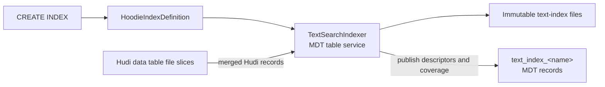
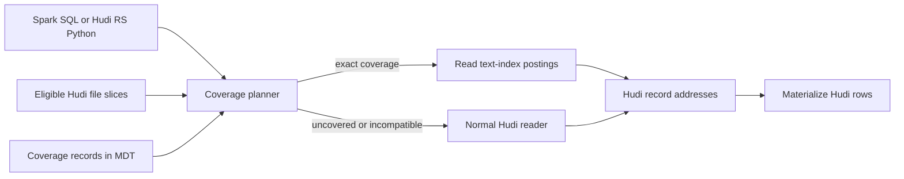
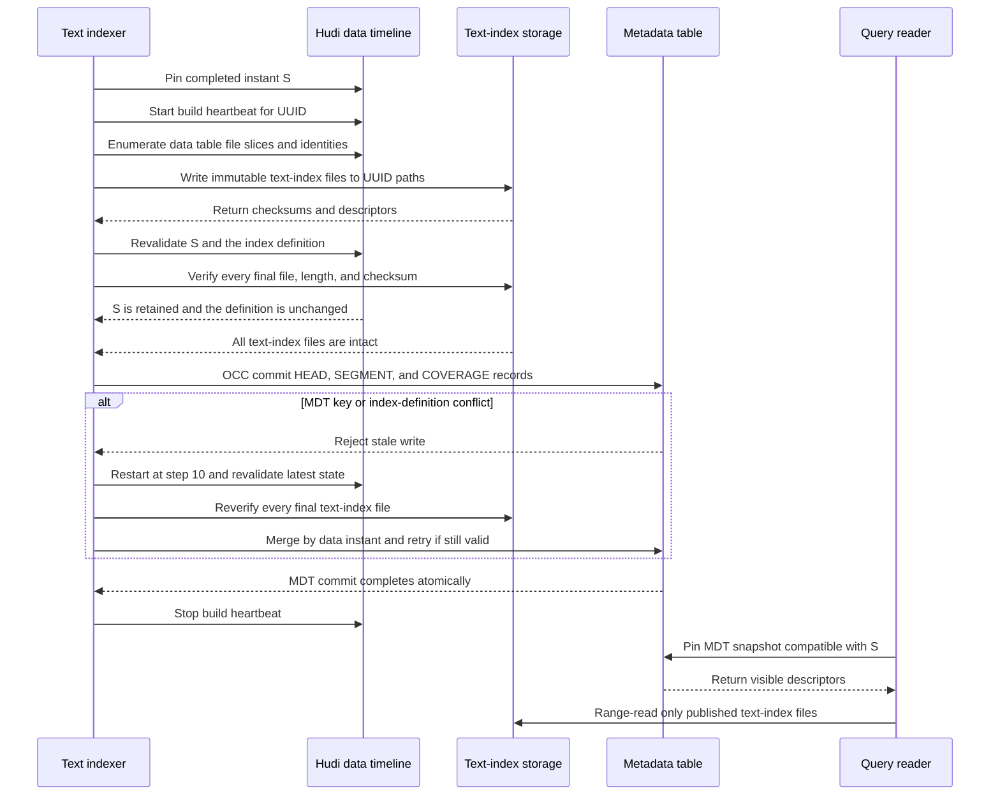
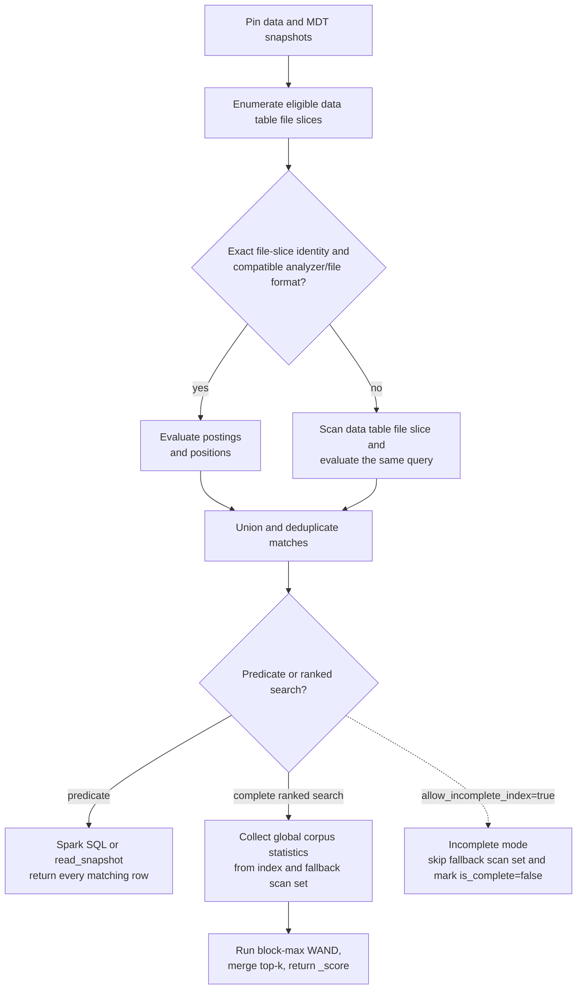

<!--
  Licensed to the Apache Software Foundation (ASF) under one or more
  contributor license agreements.  See the NOTICE file distributed with
  this work for additional information regarding copyright ownership.
  The ASF licenses this file to You under the Apache License, Version 2.0
  (the "License"); you may not use this file except in compliance with
  the License.  You may obtain a copy of the License at

       http://www.apache.org/licenses/LICENSE-2.0

  Unless required by applicable law or agreed to in writing, software
  distributed under the License is distributed on an "AS IS" BASIS,
  WITHOUT WARRANTIES OR CONDITIONS OF ANY KIND, either express or implied.
  See the License for the specific language governing permissions and
  limitations under the License.
-->

# RFC-110: Hudi Full-Text Search Index

## Proposers

- @danny0405

## Reviewers

- @vinothchandar

## Approvers

- TBD

## Status

Issue: TBD

RFC number: [RFC-110 reservation PR](https://github.com/apache/hudi/pull/19614)

Status: Under review

## Abstract

This RFC adds full-text search to Hudi tables. Spark users get SQL predicates
for text filters, and Hudi RS exposes a Python API for filtered and ranked
search. The index is created and maintained through the Hudi metadata table
(MDT), like other Hudi indexes.

`TextSearchIndexer` builds immutable text-index files from Hudi file slices. MDT
records track those files and the slices they cover. At query time, Hudi uses the
index where coverage matches and reads the remaining slices normally. The RFC
covers the APIs, metadata records, file format, table-service lifecycle, and the
initial implementation in Spark and Rust.

## Background

Hudi tables increasingly hold text that users need to search directly: log
messages, support conversations, product descriptions, audit events, and other
free-form content. Existing Hudi indexes accelerate record lookup and structured
predicates, but they do not provide content-based retrieval over these fields.

RFC-110 extends Hudi's indexing model to cover that gap. Text search becomes a
table capability maintained with Hudi metadata and table services, rather than a
separate copy of the table in an independently managed search system. Spark SQL
can combine text and structured predicates, while the Hudi RS Python API can
serve ranked search applications over the same table data.

Hudi still handles record materialization, time travel, rollback, cleaning, and
access filters. Applications gain search-oriented access without giving up the
table semantics and operations they already use.

### Motivation and use cases

Native full-text search is useful when text queries must follow Hudi commits,
time travel, rollback, cleaning, and access filters:

- **Logs and observability.** Find records containing an error signature or
  phrase while applying normal predicates such as service, environment, and
  event time.
- **Product catalogs, support tickets, and CRM text.** Match user terms across
  title and description while filtering on category, tenant, status, or access
  policy.
- **Security, audit, and eDiscovery.** Investigate text as of an incident or
  legal-hold snapshot and reproduce the exact records visible at that instant.

Suppose a GDPR deletion commits to Hudi while a CDC pipeline into a separate
search cluster is delayed. That cluster can continue serving the deleted record
until it catches up. Native text search removes that separate synchronization
window: applications search the Hudi table state that contains the deletion.

It also gives text search the same historical model as other Hudi reads. An
application can search `AS OF` an older instant without building a separately
versioned search service for every retained table state.

Text and vector indexes could later support hybrid BM25 and semantic retrieval
over one Hudi snapshot. Hybrid ranking is outside this RFC and does not create a
dependency on RFC-109.

### Relation to existing Hudi indexes

The proposal builds on:

- [RFC-45](../rfc-45/rfc-45.md), which introduced asynchronous MDT indexing;
- [RFC-77](../rfc-77/rfc-77.md), which established dynamically named secondary
  index partitions and index definitions;
- Spark SQL scalar predicates for relational queries; and
- Hudi RS table readers and Python bindings for direct search.

The term dictionary, posting lists, and BM25 ranking follow established
full-text search practice. The Hudi-specific work is in how those structures are
built from file slices, published through MDT, and selected for a table snapshot.

### Design outline

1. MDT controls which text-index files are visible.
2. Coverage is recorded per data table file slice.
3. A slice without usable coverage is read through the normal Hudi path.
4. Published text-index files are immutable.
5. Ranking does not depend on segment layout.
6. MDT records and text-index files carry their own versions.

### Goals

- Match token, boolean, prefix, fuzzy, phrase, and multi-column queries.
- Support copy-on-write (COW) and merge-on-read (MOR) tables.
- Build asynchronously and incrementally using the MDT indexer lifecycle.
- Return complete results from SQL and from the default direct API mode.
- Range-read index blocks from object storage without loading an entire index
  into a Spark executor or Hudi RS process. Builders spill sorted runs and
  readers bound dictionary, posting-block, and query-expansion memory.
- Provide a direct Hudi RS Python API alongside Spark SQL.

A common term can refer to millions of records. Builders therefore spill sorted
runs, while readers use range reads, bounded caches, streaming decoders, and
limits on query expansion. No task should need to load a whole segment.

### Non-goals

- Elasticsearch API, aggregation, highlighting, or percolator compatibility.
- Highlighting and custom relevance models in the first text-index file format.
- Updating posting lists in place.
- Replacing SQL predicate indexes or the record index.

## Implementation

### Terminology

| Term | Meaning |
| --- | --- |
| Text index definition | The named `HoodieIndexDefinition`, indexed columns, analyzer options, and `HoodieIndexVersion`. |
| Text index MDT partition | Dynamic `text_index_<name>` metadata partition containing index lifecycle records. |
| `TextSearchIndexer` | The Hudi MDT table service that builds text-index files and publishes their MDT records. |
| Text-index file | A Hudi auxiliary file containing term dictionaries, postings, positions, or record addresses. Its visibility is controlled by MDT records. |
| Data table file group | The normal Hudi file group identified by partition path and file ID. |
| Data table file slice | One base file and its ordered log files for a file group at a particular Hudi instant. |
| Index segment | An immutable batch of text-index files built from one or more data table file slices. It is not a Hudi or MDT file group. |
| Index shard | A size-bounded part of an index segment whose local record ordinals fit in `u32`. |
| File-slice identity | The exact table UUID, partition, file ID, base file, log files, schema, and merger state represented by an index segment. |
| Coverage record | An MDT record mapping one data table file group to candidate index segments and their file-slice identities. |
| Fallback scan set | Data table file slices without compatible index coverage for the pinned snapshot. |
| Indexed record | One Hudi table record, located by its Hudi record key and data table file slice. |
| Term | A token produced from an indexed string by the configured analyzer. |
| Posting | One entry connecting a term to an indexed Hudi record, including term frequency and optional positions. |
| Posting list | For one term, the ordered local record ordinals containing it, with term frequencies and optional positions. |

An index segment may contain records from many data table file groups so that
small file slices do not create many tiny index objects. Each segment stores a
table from `file_slice_ordinal` to the corresponding partition path, file ID,
and exact file-slice identity. The `COVERAGE` record for every included file
group references that segment and ordinal. A file group can reference older and
newer candidate segments for time travel, but the planner selects at most one
exact file-slice match for a query snapshot.

### User interface

Spark SQL is the table-query interface. Hudi RS Python is the direct API for
applications that do not run Spark. Index creation follows Hudi's existing
secondary-index syntax:

```sql
CREATE INDEX log_message_fts
ON application_logs
USING text_index (message)
OPTIONS (
  'base_tokenizer' = 'simple',
  'lower_case' = 'true',
  'language' = 'und',
  'with_position' = 'true',
  'posting_block_size' = '128'
);
```

The existing `HoodieIndexDefinition` is populated as follows:

```json
{
  "indexName": "text_index_log_message_fts",
  "indexType": "text_index",
  "version": "V1",
  "sourceFields": ["message"],
  "indexFunction": "tokenize",
  "indexOptions": {
    "base_tokenizer": "simple",
    "lower_case": "true",
    "language": "und",
    "with_position": "true",
    "posting_block_size": "128"
  }
}
```

`TEXT_INDEX` is added to `HoodieIndexVersion.getCurrentVersion`; the first
implementation returns `V1`. Changes to the definition or MDT record layout may
require a new `HoodieIndexVersion`. Analyzer and text-index file format versions
are kept separate from the index definition version.

#### Spark SQL predicates

Spark exposes Hudi-specific scalar predicates in `WHERE`. `hudi_match` follows
the predicate form of Elasticsearch SQL and OpenSearch SQL `MATCH`. Phrase and
multi-field evaluation follow the familiar `match_phrase` and `multi_match`
behaviors, but the function names and signatures below are Hudi-specific.

```sql
SELECT event_ts, service, message
FROM application_logs
WHERE hudi_match(message, 'connection refused', 'operator=AND')
  AND service = 'payments';
```

Phrase and multi-column queries use companion predicates:

```sql
SELECT event_ts, service, message
FROM application_logs
WHERE hudi_match_phrase(message, 'out of memory', 0)
  AND environment = 'production';

SELECT _hoodie_record_key, subject, description
FROM support_tickets
WHERE hudi_multi_match('payment declined', subject, description)
  AND status = 'open';
```

The v1 signatures are:

```text
hudi_match(column, query [, 'key=value,...']) -> boolean
hudi_match_phrase(column, query [, slop]) -> boolean
hudi_multi_match(query [, 'operator=AND|OR'], column, ...) -> boolean
```

`hudi_match` accepts `operator`, `fuzziness`, `prefix_length`, and
`max_expansions`; unknown options are rejected. These functions can be combined
with normal Spark predicates. Pushdown is limited to expressions whose Boolean
semantics can be preserved.

The functions return Boolean values. They do not add `_score`, and `LIMIT` does
not imply relevance order. Ranked search is provided by the direct API.

#### Hudi RS Python table API

Hudi RS extends `HudiTableBuilder` and `read_snapshot` with structured text
queries:

```python
import pyarrow as pa

from hudi import HudiTableBuilder
from hudi.search import FullTextOperator, MatchQuery, PhraseQuery

table = (
    HudiTableBuilder
    .from_base_uri("s3://warehouse/support_tickets")
    .build()
)

query = MatchQuery(
    "payment declined",
    column="description",
    operator=FullTextOperator.AND,
)

batches = table.read_snapshot(
    columns=["_hoodie_record_key", "subject", "description"],
    filters=[("status", "=", "open")],
    full_text_query=query,
)
tickets = pa.Table.from_batches(batches)
```

Queries can be combined:

```python
query = (
    MatchQuery("refund", column="description")
    & PhraseQuery("credit card", column="description", slop=1)
)

batches = table.read_snapshot(full_text_query=query)
```

For ranked search, the API returns BM25 scores:

```python
results = (
    table.search_text(
        MatchQuery("payment declined", column="description"),
    )
    .where([("status", "=", "open")])
    .select(["_hoodie_record_key", "subject", "description"])
    .limit(20)
    .to_arrow()
)

# Ranked by BM25 descending; `_score` is included in `results`.
```

`read_snapshot(full_text_query=...)` returns all matches.
`search_text(...).limit(k)` returns ranked rows and an `_score` column. Both use
the query behavior described below. An optional `allow_incomplete_index=True`
mode may skip unindexed slices, but its result metadata must set
`is_complete=false`.

The first release creates indexes through Spark SQL or the Java table-service
API. A Hudi RS `create_text_index` API can be added when Hudi RS supports the
required MDT writes.

### Hudi architecture

`CREATE INDEX` writes a `HoodieIndexDefinition` and creates a dynamic MDT
partition named `text_index_<name>`. `TextSearchIndexer` runs as an MDT table
service. It reads merged Hudi records, writes immutable text-index files, and
publishes `HEAD`, `SEGMENT`, and `COVERAGE` records in one MDT commit.



A reader starts from the file slices selected for the query. It looks up coverage
for those slices in MDT, reads postings for exact matches, and sends everything
else through the normal Hudi reader. Both paths return Hudi record addresses,
which are then used to materialize rows.



The index definition is stored in `.hoodie/.index/index.json`. Text-index files
live under an MDT-owned auxiliary path, but directory listings do not determine
visibility; MDT records do.

### Metadata table integration

`TEXT_INDEX` is added to `MetadataPartitionType` with the dynamic prefix
`text_index_`. Partition lookup follows the secondary- and expression-index
code. `IndexerFactory` creates a `TextSearchIndexer` that implements the
`BaseIndexer` lifecycle.

`HoodieMetadata.avsc` gets a tagged record named `HoodieTextIndexInfo` with four
record types:

| Kind | Record key | Purpose |
| --- | --- | --- |
| `HEAD` | `head` | Index-definition and text-index file format versions, analyzer identity, latest publication instant, and aggregate statistics. |
| `SEGMENT` | `segment/<uuid>` | Text-index file paths, sizes, checksums, statistics, and the covered file-slice ordinal map. |
| `COVERAGE` | `coverage/<encoded-partition>/<file-id>` | Exact file-slice identity and candidate segment references ordered by data instant. |
| `TOMBSTONE` | `tombstone/<uuid>` | Segment retirement instant and deletion eligibility. |

The Avro record contains the index and format versions, analyzer fingerprint,
segment UUID, file-slice identities, ordinal mapping, summary statistics, file
descriptors, and optional tombstone instant. Dictionaries, postings, and detailed
term statistics stay in the text-index files. Active file-slice masks are
computed for the query snapshot instead of being stored as a current-state field.

Coverage lookup is driven by the data slices selected after partition pruning.
The planner issues batched point lookups for
`coverage/<encoded-partition>/<file-id>` and loads only the referenced segment
descriptors. Immutable descriptors may be cached for the lifetime of the MDT
snapshot. Storage grows with the table's file-group count; planning work grows
with the file groups selected by the query. A full-table query still touches all
file groups, but it does so through normal MDT sharding and point lookup rather
than by loading the entire control partition on the driver.

Text-index files use this default path:

```text
<table>/.hoodie/metadata/.aux/text-index/
  <escaped-index-name>/<segment-uuid>/...
```

This path belongs to MDT but is not discovered as a normal MOR partition. An
external storage root may be supported later; descriptor paths are always scoped
by table UUID and checked by readers. Files become visible only after their MDT
records commit. Unpublished files are cleaned after the orphan grace period.

### Hudi record identity and file-slice coverage

The index stores Hudi records, not a separate notion of search documents. Each
entry comes from the merged view of a file slice at snapshot `S`. Version 1
requires a stable Hudi record key and stores the following address:

```text
HudiTextIndexRecordAddress {
  file_slice_ordinal: u32,
  record_key: bytes,
  row_position_hint: optional u64
}
```

Segment metadata maps `file_slice_ordinal` to a partition path, file ID, base
instant, and file-slice identity. Hudi groups matches by partition and file ID
before reading the rows. `row_position_hint` is optional and is used only for an
exact file-slice match; lookup can always fall back to the record key.

A file-slice identity includes:

- table UUID, partition path, and file ID;
- base instant and base-file identity (path, length, and checksum when known);
- ordered log-file identities (path, length, and latest block instant);
- writer schema identifier; and
- record-merger implementation and relevant options.

For snapshot `S`, the planner compares each selected file slice with the
candidates in its `COVERAGE` record. It uses a segment only on an exact match. A
new MOR log or a replacement base file sends that slice to the normal reader
until the indexer catches up. Segments built from newer file slices are not used
for older snapshots. Compaction, clustering, rollback, and MOR updates therefore
do not require in-place edits to old postings.

Freshness is measured in changed file slices, not simply in commits. Let `F` be
the selected slices and `R` the slices without exact coverage. The coverage ratio
is `C = 1 - R/F`, and the query cost is roughly
`index_scan(C * F) + fallback_scan(R)`. The first new MOR log block moves a slice
into `R`; later blocks add scan bytes but not another slice. Ranked search also
analyzes `R` to collect corpus statistics. When coverage is low, query cost moves
toward the cost of a normal Hudi scan.

Catch-up can be scheduled by elapsed time or by the number of changed slices.
Useful operating metrics are index lag, coverage ratio, fallback bytes, and time
spent analyzing the fallback set. The performance tests below measure latency
against those variables rather than claiming one freshness SLA for every table.

### Text-index file format

Version 1 uses an eight-byte `HUDIFTS1` magic value, followed by a little-endian
version, feature flags, header length, and checksum. Data blocks are checksummed
individually. A footer holds the block directory used for range reads. Readers
reject required features they do not understand and check allocation limits
before trusting stored lengths.

Each segment contains:

- `metadata.hfts`: analyzer fingerprint, data table, file-slice descriptors,
  segment statistics, index shard descriptors, and checksums;
- `part_<n>.tokens.hfts`: a minimal finite-state transducer (FST) mapping
  analyzed term bytes to term ordinals and posting metadata;
- `part_<n>.docs.hfts`: columnar file-slice ordinal, record-key offsets and bytes,
  record token count, and optional row-position hint;
- `part_<n>.postings.hfts`: record frequency, posting-block offsets,
  delta-encoded local record ordinals, term frequencies, and block-max metadata;
  and
- `part_<n>.positions.hfts`: optional delta-encoded token positions and offsets.

Record ordinals are local `u32` values, so the builder starts another shard
before that range is exhausted. Posting blocks default to 128 records and choose
bit packing or variable-byte encoding per block. Maximum term frequency and
minimum record length are stored with each block for block-max WAND. Token
positions are present only when enabled in the index definition.

A phrase query needs token positions. If `with_position=false`, Spark SQL and
complete Hudi RS reads use `RawTextSearchSplit` for those slices. They do not
turn the phrase into an `AND` query. In incomplete mode, version 1 rejects a
phrase query when the index has no positions.

The format is specified field by field; Java and Rust collection serializers are
not written to disk.

### Native implementation and ownership

The tokenizer, file reader and writer, phrase evaluator, and BM25 scorer need one
implementation shared by Spark and Hudi RS. For the first version, that
implementation is the `hudi-native-text-index` Rust crate. Spark calls it through
batched JNI; Hudi RS can call the crate directly. Indexed reads and fallback
scans therefore use the same analyzer and query code.

This also keeps the posting data structures out of the Spark JVM heap. Java
sends bounded batches through direct buffers, so JNI is crossed once per batch,
not once per record or token. Rust is not a requirement for text search in
general; it is the practical way to share this implementation with Hudi RS
without building a second engine in Java.

The crate starts in the main Hudi repository alongside the Spark and MDT code.
Once the file format, analyzer behavior, packaging, and JNI API have settled, it
moves to Hudi RS. Main Hudi will then depend on a released Hudi RS native
artifact. Ownership changes, but the Java API and existing text-index files do
not.

Main Hudi continues to own Spark SQL planning, the MDT table service, the Java
JNI adapter and loader, `HoodieIndexDefinition`, `HoodieTextIndexInfo`, and the
text-index file format and JNI specifications. During incubation it also
contains the Rust crate and its conformance tests. After migration, Hudi RS owns
the Rust source, native artifact publication, and Python bindings; main Hudi
consumes a pinned artifact.

The JVM keeps ownership of `HoodieStorage`, including credentials, retries,
range reads, writes, and metrics. Rust receives data buffers and returns encoded
blocks or batches of `HudiTextIndexRecordAddress`; it does not own storage
clients or process-global credentials.

Native entry points are versioned. The adapter checks buffer lengths, catches
panics at the FFI boundary, maps failures to Java exceptions, and closes native
handles through `AutoCloseable`. A text-index operation fails if the native
library cannot be loaded. Other Hudi reads do not load it.

Migration to Hudi RS requires all of the following:

1. the text-index file format, analyzer fixtures, and batched JNI API have stable
   versioning and compatibility tests;
2. the supported native platform matrix passes build, load, corruption, and
   Spark executor tests in CI;
3. Hudi RS can publish the same native artifact and pass the same golden corpus;
4. main Hudi can consume that artifact without changing SQL behavior, JNI method
   signatures, MDT records, or existing text-index files; and
5. the in-tree crate is removed only after the Hudi RS dependency is available
   to the supported Hudi build and release process.

The analyzer fingerprint, query AST, text-index file format version, segment
descriptor, record address, and JNI ABI are all versioned. Files written before
the move to Hudi RS must remain readable afterward.

### Native build and release

During incubation, the Hudi source release includes the Rust crate and builds it
as part of the text-index module. Convenience binaries use OS and architecture
classifiers and are built, checksummed, and signed by the Hudi release workflow.
Phase 0 will select the supported classifiers. Other platforms can build from
source or leave text search disabled.

Before creating a handle, the Java loader checks the JNI ABI and Rust engine
version. It extracts the library to a checksum-addressed path and isolates it by
Hudi bundle/classloader. After migration, Hudi RS publishes the native artifact
and main Hudi pins a compatible release.

### Build and publication lifecycle

A bootstrap build performs these steps:

1. Start the text-index table-service instant and register a heartbeat for a
   unique build UUID through Hudi's existing heartbeat service.
2. Pin a completed data-table instant and corresponding MDT snapshot.
3. Enumerate data table file slices and construct their exact identities.
4. Use Hudi's merged reader to emit stable record key, text, file-slice ordinal,
   and optional row-position hint.
5. Pass bounded record batches through JNI so the Rust engine analyzes Hudi
   records and builds bounded-memory sorted runs.
6. Merge runs into dictionaries, record-address tables, postings, and positions.
7. Write index blocks to UUID-scoped temporary paths while refreshing the build
   heartbeat.
8. Finalize checksums, statistics, and file-slice descriptors.
9. Move or copy text-index files to their final immutable UUID paths when
   required by the storage implementation.
10. Revalidate the pinned instant, index definition, and the existence, length,
    and checksum of every final text-index file.
11. Return `SEGMENT`, `COVERAGE`, and `HEAD` metadata records to the MDT writer.
12. Publish all descriptors and partition state in one MDT commit, then stop the
    heartbeat after the commit completes or the build aborts.

The files become visible at step 12. A retry can reuse them after checking the
build identity and every checksum; otherwise it writes a new UUID.

Incremental catch-up builds segments for new or changed file slices. It does not
edit old posting lists. Unchanged slices keep their existing segment references.

Every build records its data instant `S`. A later data commit does not invalidate
the segment for `S`; readers of a newer snapshot will see a different file-slice
identity. Before publishing, the indexer checks that `S` is still completed and
retained, that the definition and analyzer are unchanged, and that every final
file still has the expected length and checksum. Failure of any check aborts the
build.

The build heartbeat protects unpublished files from the orphan cleaner. Cleanup
requires an absent or expired heartbeat plus the orphan grace period. The
indexer holds the heartbeat through the MDT commit and any OCC retries, using
Hudi's existing table-service heartbeat instead of another lease mechanism.

Publication uses Hudi's indexing transaction, OCC, and configured lock provider.
The expected definition version and MDT partition state are preconditions, so a
concurrent `DROP INDEX` or definition change causes a conflict. Each retry starts
again at step 10: reload state, repeat validation, merge candidate segments by
data instant, and attempt the commit again. If validation fails, the indexer
stops its heartbeat and leaves the files for orphan cleanup.

`HEAD` moves forward monotonically. An older build can remain available for time
travel, but it cannot replace a newer head or remove newer coverage.

The publication order prevents a partially written segment from becoming
visible:



If file writing fails, no descriptor is committed. If the MDT commit fails, a
retry may reuse validated files; otherwise they are removed after the heartbeat
expires and the grace period passes.

### Consolidation, rollback, and cleaning

Small segments are consolidated based on segment count, total bytes, and the
share of inactive file slices. Consolidation copies active records into new
files and swaps the descriptors in one MDT commit. The old segments are
tombstoned and remain available to readers pinned before that commit.

Rollback and restore use the descriptors visible in the restored data and MDT
state. A slice with no exact coverage goes through the normal reader. The cleaner
deletes tombstoned files only after data and MDT retention make them unreachable.
Unpublished files also require an expired heartbeat and the orphan grace period.
`DROP INDEX` removes visibility first and deletes files asynchronously.

### Query execution

File-slice coverage chooses between index lookup and the normal Hudi reader:



Spark SQL evaluation has four steps:

1. Pin data and MDT snapshots. Resolve each eligible data table file slice to one
   exact compatible segment file-slice ordinal or a `RawTextSearchSplit`.
2. Evaluate compatible posting lists and positions to produce matching Hudi
   record addresses for covered slices.
3. Evaluate the same query object and analyzer while scanning fallback splits.
4. Union and deduplicate addresses, materialize rows by partition and file ID,
   then evaluate residual Spark predicates. Row-position hints are used only
   with an exact file-slice identity.

Spark SQL returns a match set, not ranked candidates. Expressions that cannot be
pushed down safely are evaluated as normal Spark predicates.

Hudi RS `search_text` also collects corpus statistics, runs block-max WAND for
each input, and merges the local top-k results. BM25 statistics cover the whole
query snapshot; using per-segment statistics would make ranking depend on file
layout and consolidation.

If some slices are not indexed, complete ranked search analyzes them to collect
record frequencies. That can dominate latency, so coverage and scan time are
reported with the result. `allow_incomplete_index=True` skips those slices and
sets `is_complete=false`.

For term `q` and Hudi record `r`, version 1 uses:

```text
IDF(q) = ln(1 + (N - df(q) + 0.5) / (df(q) + 0.5))

score(q,r) = IDF(q) *
             tf(q,r) * (k1 + 1) /
             (tf(q,r) + k1 * (1 - b + b * dl(r) / avgdl))
```

Defaults are `k1=1.2` and `b=0.75`. `N`, `df`, and `avgdl` are global over the
active file-slice ordinals plus the fallback scan set at the pinned snapshot.
Boolean clauses define candidate membership; positive term scores are summed.
Phrase clauses first intersect postings and then verify positions.

### Analyzer configuration and schema evolution

An analyzer is an ordered pipeline: tokenizer, Unicode normalization, case
handling, optional accent folding, stop words, stemming, and maximum token
length. Its canonical JSON, resource hashes, locale, and implementation version
form a SHA-256 fingerprint. Build and query use the same fingerprint.

Changes to non-indexed fields do not invalidate a segment. Changing an indexed
column's type, analyzer options, or token resources requires a rebuild. Null and
invalid UTF-8 handling are fixed in the index definition.

### Filtering and materialization

Partition predicates are applied before coverage lookup. Other conjunctive
predicates remain Spark filters. The optimizer may intersect record identifiers
from expression, secondary, or bitmap MDT indexes; the text-index file format
does not depend on any of them.

Hudi RS `.where(...)` is a prefilter: ranking runs over records that pass the
structured filter. Postfiltering is left for a later API because it can return
fewer than `k` rows.

### Configuration

| Property | Default | Description |
| --- | --- | --- |
| `hoodie.metadata.index.text.enable` | `false` | Enables the MDT text-index component. |
| `hoodie.text.index.build.memory.mb` | `512` | Builder memory before spilling sorted runs. |
| `hoodie.text.index.posting.block.size` | `128` | Records per posting block. Immutable per index. |
| `hoodie.text.index.segment.target.mb` | `512` | Approximate target segment size. |
| `hoodie.text.index.query.max.expansions` | `1024` | Prefix/fuzzy expansion limit. |
| `hoodie.text.index.query.max.clauses` | `256` | Parsed boolean clause limit. |
| `hoodie.text.index.orphan.grace.hours` | `24` | Minimum age before cleanup after an unpublished build heartbeat expires. |

### Observability and failure behavior

Spark `EXPLAIN` shows the selected index and the data and MDT instants. Query
metrics cover segment count, coverage, index lag, bytes read, fallback work, and
posting blocks skipped. Native metrics cover JNI batches, native memory, loaded
versions, errors, and library load time. Hudi RS result metadata adds
`is_complete` and separates fallback analysis time from scoring time.

Checksum failure, unsupported text-index file format, missing text-index files,
or file-slice identity mismatch marks the affected data table file slice
uncovered. Spark SQL and complete Hudi RS queries read it normally. Incomplete
mode may skip it and must return `is_complete=false`.

### Security and resource limits

- Validate descriptor paths against the table UUID and configured text-index root.
- Verify header and block checksums before use.
- Bound query clauses, term expansions, phrase positions, header sizes, decoded
  posting counts, and reader memory per task.
- Treat text-index bytes and structured query inputs as untrusted input.
- Catch Rust panics at every JNI/FFI entry point and convert them into typed Java
  or Hudi RS errors without unwinding across the native boundary.
- Do not place credentials or storage clients in process-global state.

### Compatibility

The following versions evolve independently:

1. `HoodieIndexDefinition.version` (`HoodieIndexVersion`), bumped when Hudi's
   interpretation or MDT layout for the text index changes incompatibly;
2. MDT Avro schema version;
3. text-index file format and required feature bits;
4. analyzer implementation/fingerprint version;
5. JNI ABI and Rust engine artifact version; and
6. Spark predicate and Hudi RS query-object API version.

Readers may keep decoders for older file formats. Writers produce the configured
current version. A change that produces different terms gets a new analyzer
fingerprint and requires a rebuild.

## Rollout plan

### Phase 0: finish the design

- RFC-110 was reserved through
  [PR #19614](https://github.com/apache/hudi/pull/19614).
- Finalize Avro descriptors, analyzer canonicalization, query objects, the
  text-index file format, and a versioned batched JNI API.
- Select the native OS/architecture classifier matrix and source-build fallback.
- Agree with Hudi RS maintainers on the initial repository and the later move to
  Hudi RS.

### Phase 1: Spark preview

- Add `TEXT_INDEX`, `TextSearchIndexer`, MDT records, and bootstrap creation.
- Add the in-repository `hudi-native-text-index` Rust crate, thin Java JNI
  adapter, native loader, and analyzer/text-index file format conformance suite.
- Add `hudi_match`, `hudi_match_phrase`, and `hudi_multi_match`, including the
  normal-read path for slices without index coverage.
- Build and read text-index files through batched JNI; do not add Java tokenizer,
  builder, or posting decoder implementations.
- Ship behind `hoodie.metadata.index.text.enable=false`.

### Phase 2: incremental and ranked search

- Add file-slice incremental rebuild, consolidation, positions/phrase search,
  prefix/fuzzy expansion, and block-max WAND.
- Add platform CI, classloader isolation, failure tests, compatibility fixtures,
  and metrics for the native library.
- Stabilize the text-index file format, analyzer, and JNI versions required for
  migration.

### Phase 3: move the Rust engine to Hudi RS

- Move the Rust crate and native artifact publication to Hudi RS after all
  migration criteria in this RFC pass.
- Change main Hudi from the in-tree crate to a pinned Hudi RS native artifact
  without changing the Java API, SQL behavior, MDT records, or existing files.
- Add Hudi RS `read_snapshot(full_text_query=...)` and ranked `search_text()`
  with Python bindings and query metrics.

### Phase 4: other engines

- Add Flink and additional Java APIs.
- Investigate pre-WAND filtering with other MDT indexes.
- Design hybrid text/vector ranking as a separate RFC after both index designs
  are available; RFC-110 creates no runtime dependency between them.

Tables are unchanged until a user creates a text index. Disabling or dropping
the index does not affect table reads. Text-index file format upgrades use a
side-by-side rebuild followed by descriptor switchover and cleanup.

## Test plan

Testing is split between the native format, Hudi table behavior, distributed
query results, and performance.

### File format and native code

- Golden little-endian headers, footers, dictionaries, postings, and positions.
- Unknown version/feature rejection, length limits, checksum corruption, and
  fuzzing of the Rust decoder before and after its Hudi RS migration.
- Analyzer golden cases for Unicode, case, stop words, stemming, invalid UTF-8,
  and token-length limits.
- Compression round trips, posting monotonicity, positional verification, and
  block upper-bound conservatism.
- BM25 values checked against the formula with global statistics.
- JNI tests for direct-buffer bounds, large batches, handle lifecycle, concurrent
  Spark tasks, panic conversion, ABI mismatch, library loading, and native-memory
  release.
- Run the same golden corpus against the in-tree crate and the candidate Hudi RS
  artifact before migration; require identical index bytes, match sets, and
  scores within the defined tolerance.

### Hudi integration tests

- COW and MOR bootstrap, log updates, compaction, clustering, rollback, restore,
  clean, drop, and recreate.
- Dynamic MDT partition creation and deletion through the indexer lifecycle.
- Exact coverage selection for old and current time-travel snapshots.
- Analyzer/schema incompatibility and unsupported text-index file format version
  behavior.
- Compatibility between Spark-built segments and Hudi RS reads before and after
  migration.
- Orphan, partial upload, retry, duplicate build, and tombstone cleanup cases,
  including a slow live build protected by heartbeats, an expired build becoming
  collectable, and a missing final file aborting publication.
- A data commit between file-slice enumeration and MDT publication, concurrent
  indexers targeting overlapping file groups, stale-head rejection, and OCC
  retry/merge behavior.
- Record keys containing arbitrary UTF-8 and binary-safe encoded metadata keys.

### Query correctness

The primary Spark SQL oracle is:

```text
indexed evaluation of hudi_match(...)
  == forced full-scan evaluation of hudi_match(...)
```

Compare record identities across different Spark partition counts, segment
layouts, consolidations, active file-slice masks, and mixtures of indexed and
fallback-scanned file slices. Verify normal `AND`/`OR` composition and time
travel. Separately compare Hudi RS ranked output against an exhaustive BM25
scorer, including score tolerance and deterministic tie ordering.

### Performance tests

- Build throughput, peak JVM/native/Hudi RS memory, JNI batch overhead, spill
  volume, and object-store writes on small and skewed terms.
- Cold/warm top-k latency, range-read count, bytes read, cache hit rate, and WAND
  block skips at multiple selectivities.
- Consolidation write amplification and query degradation with segment count.
- Coverage-planning latency for partition-pruned and full-table queries at up
  to millions of file groups, verifying batched point lookup rather than a full
  MDT control-record scan.
- Complete-query latency across catch-up delay, changed-slice ratio, MOR log
  bytes, analyzer cost, and selectivity. Report coverage ratio, fallback-scan
  time, and exact fallback-scan record-frequency analysis separately.
- Compare indexed Hudi search with forced full-scan Hudi evaluation on the same
  corpus and analyzer configuration. Report external baselines separately.

## Open questions

1. Should v1 require record keys, or define a separate immutable row-address
   representation for keyless tables?
2. Should term record frequencies live beside each term dictionary or in a
   separate compact statistics index file for more efficient batched lookups?
3. Which base-file and log-file checksums are reliably available on every
   supported storage?
4. Should the first release support only `simple` and `whitespace` tokenizers to
   keep analyzer resources deterministic?
5. Which native OS/architecture classifiers are required in Phase 1, and which
   platforms are source-build-only?
6. Which Hudi RS release first consumes the migrated crate, and how long must
   mixed Spark/Hudi RS versions remain compatible?
7. When Hudi RS gains MDT write support, should Python expose
   `create_text_index`, or keep table-service operations in Spark/Java?

## References

- [Apache Lucene inverted-index and postings API](https://lucene.apache.org/core/10_3_1/core/org/apache/lucene/index/package-summary.html)
- [Elasticsearch SQL full-text predicates](https://www.elastic.co/docs/explore-analyze/query-filter/languages/sql-functions-search)
- [OpenSearch SQL full-text search](https://docs.opensearch.org/latest/sql-and-ppl/full-text/)
- [Tantivy search engine](https://github.com/quickwit-oss/tantivy)
- [Apache Hudi metadata documentation](https://hudi.apache.org/docs/metadata/)
- [Hudi RS Python/Rust quick start](https://hudi.apache.org/docs/next/python-rust-quick-start-guide/)
