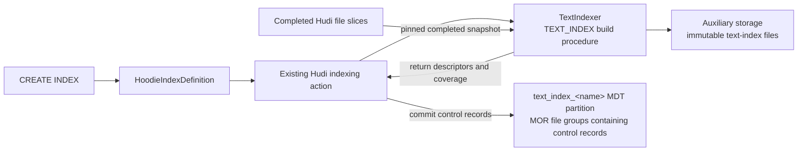
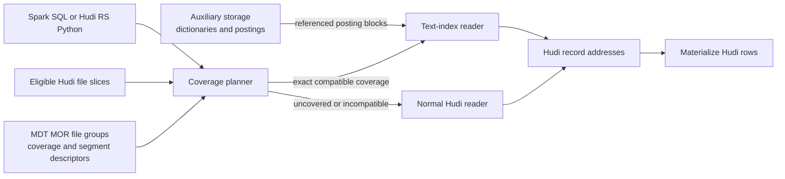
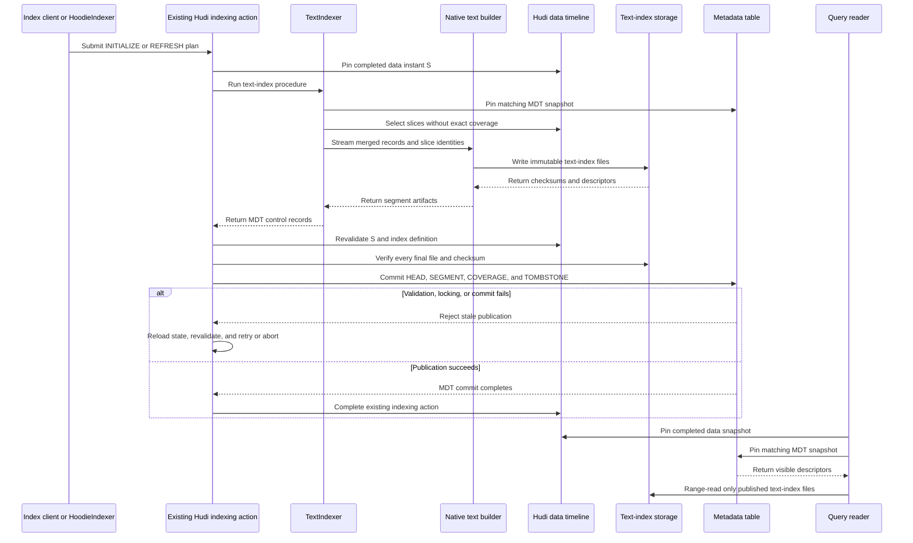
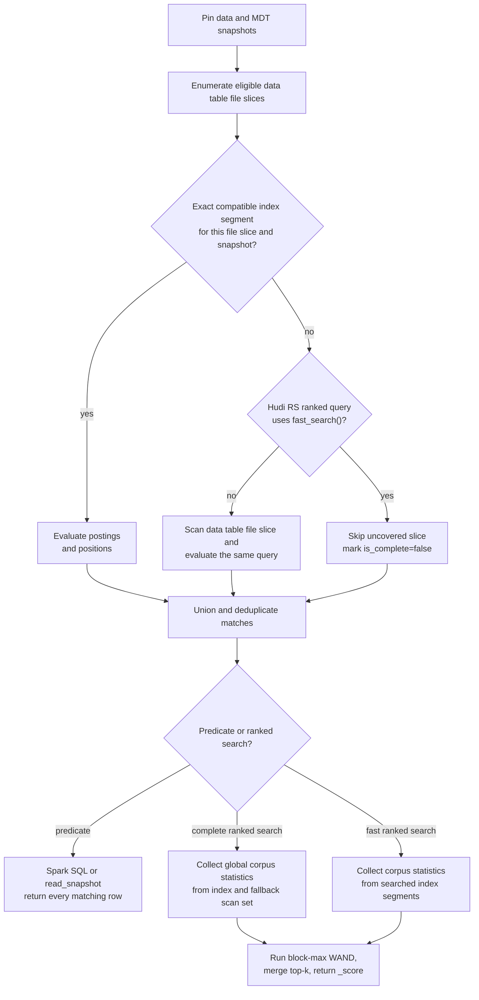

<!--
  Licensed to the Apache Software Foundation (ASF) under one or more
  contributor license agreements.  See the NOTICE file distributed with
  this work for additional information regarding copyright ownership.
  The ASF licenses this file to You under the Apache License, Version 2.0
  (the "License"); you may not use this file except in compliance with
  the License.  You may obtain a copy of the License at

       http://www.apache.org/licenses/LICENSE-2.0

  Unless required by applicable law or agreed to in writing, software
  distributed under the License is distributed on an "AS IS" BASIS,
  WITHOUT WARRANTIES OR CONDITIONS OF ANY KIND, either express or implied.
  See the License for the specific language governing permissions and
  limitations under the License.
-->

# RFC-110: Hudi Full-Text Search Index

## Proposers

- @danny0405

## Reviewers

- @vinothchandar

## Approvers

- TBD

## Status

Issue: TBD

RFC number: [RFC-110 reservation PR](https://github.com/apache/hudi/pull/19614)

Status: Under review

## Abstract

This RFC proposes a full-text index for Hudi tables. Spark exposes SQL predicates
for text filtering, while Hudi RS provides a Python API for filtered and ranked
search. Hudi's index metadata stores the definition, and the metadata table
(MDT) tracks index state and coverage.

Index creation and refresh run through Hudi's existing indexing action, outside
the ingestion job. Normal queries remain complete while an index is building or
awaiting refresh: Hudi uses the index where it is current and reads the remaining
file slices normally. MDT tracks index state and coverage, while the larger
dictionaries and posting lists live in auxiliary files.

## Background

Hudi tables often contain logs, support conversations, product descriptions,
audit events, and other free-form text. Existing Hudi indexes help with record
lookup and structured predicates, but cannot answer content-based queries over
these fields.

The proposed index makes text search part of the Hudi table instead of requiring
a separately managed copy of its data. Spark SQL can combine text and structured
predicates, and Hudi RS can serve ranked searches from Python. Both operate on a
Hudi snapshot and retain normal Hudi behavior for time travel, rollback,
cleaning, record materialization, and access filtering.

### Motivation and use cases

Native full-text search is useful when text queries must follow Hudi commits,
time travel, rollback, cleaning, and access filters:

- **Logs and observability.** Find records containing an error signature or
  phrase while applying normal predicates such as service, environment, and
  event time.
- **Product catalogs, support tickets, and CRM text.** Match user terms across
  title and description while filtering on category, tenant, status, or access
  policy.
- **Security, audit, and eDiscovery.** Investigate text as of an incident or
  legal-hold snapshot and reproduce the exact records visible at that instant.

For example, a CDC pipeline may lag after a GDPR deletion commits to Hudi. A
separate search cluster can still return the deleted record until the pipeline
catches up. With a Hudi text index, the query runs against the table snapshot
that contains the deletion. The same model also allows an application to search
`AS OF` an older instant without maintaining a separate search copy for each
retained snapshot.

Text and vector indexes could later support hybrid BM25 and semantic retrieval
over one Hudi snapshot. Hybrid ranking is outside this RFC and does not create a
dependency on RFC-109.

### Relation to existing Hudi indexes

The proposal builds on:

- [RFC-45](../rfc-45/rfc-45.md), whose MDT indexing lifecycle is used for
  bootstrap and maintenance;
- [RFC-77](../rfc-77/rfc-77.md), which established dynamically named secondary
  index partitions and index definitions;
- Spark SQL scalar predicates for relational queries; and
- Hudi RS table readers and Python bindings for direct search.

Term dictionaries, posting lists, and BM25 ranking are standard search
structures. This proposal focuses on the Hudi-specific parts: building them from
file slices, publishing them through MDT, and selecting the right files for a
table snapshot.

### User experience at a glance

1. A user creates a text index on one or more string columns with `CREATE
   INDEX`. Hudi builds it through the existing indexing action, outside the
   ingestion job.
2. Spark users add `hudi_match`, `hudi_match_phrase`, or `hudi_multi_match` to a
   normal `WHERE` clause. Hudi RS users can filter a snapshot or request ranked
   results from Python.
3. Normal queries return complete results even while an index is building or
   awaiting refresh. Hudi uses the index for covered file slices and scans the
   remaining slices through the normal reader.
4. Users run `REFRESH INDEX` to index changed file slices. Operators can schedule
   the same refresh with their normal workflow orchestration. Ingestion does not
   load the native builder.
5. Applications that prefer lower latency over complete results can use Hudi RS
   `.fast_search()`. The result reports whether any slices were skipped.

### Goals

- Match token, boolean, prefix, fuzzy, phrase, and multi-column queries.
- Support copy-on-write (COW) and merge-on-read (MOR) tables.
- Build asynchronously and incrementally through Hudi's existing indexing
  action. The text-index procedure handles bootstrap, refresh, consolidation,
  rebuild, repair, and cleanup without introducing another table service.
- Return complete results from SQL and from the default direct API mode.
- Range-read index blocks from object storage without loading an entire index
  into a Spark executor or Hudi RS process. Builders spill sorted runs and
  readers bound dictionary, posting-block, and query-expansion memory.
- Provide a direct Hudi RS Python API alongside Spark SQL.

### Non-goals

- Elasticsearch API, aggregation, highlighting, or percolator compatibility.
- Highlighting and custom relevance models in the first text-index file format.
- Updating posting lists in place.
- Replacing SQL predicate indexes or the record index.

## User interface

### Create and refresh an index

Spark SQL is the table-query interface. Hudi RS Python is the direct API for
applications that do not run Spark. Index creation follows Hudi's existing
secondary-index syntax:

```sql
CREATE INDEX log_message_fts
ON application_logs
USING text_index (message)
OPTIONS (
  'base_tokenizer' = 'simple',
  'lower_case' = 'true',
  'language' = 'und',
  'with_position' = 'true',
  'posting_block_size' = '128'
);
```

`CREATE INDEX` starts the first build through Hudi's existing indexing action.
The build does not run in the ingestion job. New writes may leave some file
slices temporarily uncovered, but normal queries still return complete results
by scanning those slices.

Users can bring the index up to date explicitly:

```sql
REFRESH INDEX log_message_fts ON application_logs;
```

The same refresh can be scheduled through the `HoodieIndexer` utility. No
resident text-index service is required.

### Spark SQL predicates

Spark exposes three Hudi scalar predicates for use in `WHERE` clauses:
`hudi_match`, `hudi_match_phrase`, and `hudi_multi_match`.

| Predicate | Use |
| --- | --- |
| `hudi_match` | Match analyzed terms in one column. |
| `hudi_match_phrase` | Match terms in order, with optional phrase slop. |
| `hudi_multi_match` | Apply one text query across several columns. |

```sql
SELECT event_ts, service, message
FROM application_logs
WHERE hudi_match(message, 'connection refused', 'operator=AND')
  AND service = 'payments';
```

Phrase and multi-column queries use companion predicates:

```sql
SELECT event_ts, service, message
FROM application_logs
WHERE hudi_match_phrase(message, 'out of memory', 0)
  AND environment = 'production';

SELECT _hoodie_record_key, subject, description
FROM support_tickets
WHERE hudi_multi_match('payment declined', subject, description)
  AND status = 'open';
```

The v1 signatures are:

```text
hudi_match(column, query [, 'key=value,...']) -> boolean
hudi_match_phrase(column, query [, slop]) -> boolean
hudi_multi_match(query [, 'operator=AND|OR'], column, ...) -> boolean
```

`hudi_match` accepts `operator`, `fuzziness`, `prefix_length`, and
`max_expansions`; unknown options are rejected. These functions can be combined
with normal Spark predicates. Pushdown is limited to expressions whose Boolean
semantics can be preserved.

The functions return Boolean values. They do not add `_score`, and `LIMIT` does
not imply relevance order. Ranked search is provided by the direct API.

### Hudi RS Python table API

Hudi RS extends `HudiTableBuilder` and `read_snapshot` with structured text
queries. `read_snapshot` returns every matching row, while `search_text` ranks
the best matches with BM25.

```python
import pyarrow as pa

from hudi import HudiTableBuilder
from hudi.search import FullTextOperator, MatchQuery, PhraseQuery

table = (
    HudiTableBuilder
    .from_base_uri("s3://warehouse/support_tickets")
    .build()
)

query = MatchQuery(
    "payment declined",
    column="description",
    operator=FullTextOperator.AND,
)

batches = table.read_snapshot(
    columns=["_hoodie_record_key", "subject", "description"],
    filters=[("status", "=", "open")],
    full_text_query=query,
)
tickets = pa.Table.from_batches(batches)
```

Queries can be combined:

```python
query = (
    MatchQuery("refund", column="description")
    & PhraseQuery("credit card", column="description", slop=1)
)

batches = table.read_snapshot(full_text_query=query)
```

For ranked search, the API returns BM25 scores:

```python
results = (
    table.search_text(
        MatchQuery("payment declined", column="description"),
    )
    .where([("status", "=", "open")])
    .select(["_hoodie_record_key", "subject", "description"])
    .limit(20)
    .to_arrow()
)

# Ranked by BM25 descending; `_score` is included in `results`.
```

`read_snapshot(full_text_query=...)` returns all matches.
`search_text(...).limit(k)` returns ranked rows and an `_score` column. Both use
the complete query behavior described below. Latency-sensitive ranked searches
may call `.fast_search()` before execution:

```python
results = (
    table.search_text(MatchQuery("payment declined", column="description"))
    .fast_search()
    .limit(20)
    .to_arrow()
)
```

`fast_search()` skips file slices without an exact compatible index segment.
If it skips any slice, result metadata sets `is_complete=false`; otherwise it
sets `is_complete=true`. Spark SQL and `read_snapshot(full_text_query=...)`
always use fallback scans and return complete results in the first release.

## Detailed design

The design has four main pieces:

1. Hudi's existing indexing action schedules and coordinates each build or
   refresh.
2. `TextIndexer` performs the text-specific work for a `TEXT_INDEX` MDT
   partition.
3. MDT stores small control records that identify usable index files and the
   data file slices they cover.
4. Query planning uses those records to choose index lookup or the normal Hudi
   reader for each file slice.

### Terminology

| Term | Meaning |
| --- | --- |
| Text index definition | The named `HoodieIndexDefinition`, indexed columns, analyzer options, and `HoodieIndexVersion`. |
| Text index MDT partition | Dynamic `text_index_<name>` metadata partition backed by normal MDT MOR file groups. It contains only text-index control records, not dictionaries or postings. |
| MDT file group | A file group in the metadata table. Its base and log files store the `HEAD`, `SEGMENT`, `COVERAGE`, and `TOMBSTONE` records defined below. |
| Hudi indexing action | The existing `INDEXING_ACTION` used to build MDT index partitions. It owns scheduling, execution, timeline state, and coordination for every index type. |
| `TextIndexer` | The `BaseIndexer` implementation for `TEXT_INDEX`. It builds or refreshes auxiliary index files and returns the MDT control records to publish. It is not a table service. |
| Text-index file | An auxiliary file containing term dictionaries, postings, positions, or record addresses. It lives outside the MDT partition's file groups and becomes visible through MDT records. |
| Data table file group | The normal Hudi file group identified by partition path and file ID. |
| Data table file slice | One base file and its ordered log files for a file group at a particular Hudi instant. |
| Index segment | A logical, immutable set of text-index files built from one or more data table file slices. It has no Hudi base file or log files and is not a data-table or MDT file group. |
| Segment descriptor | The small `SEGMENT` record stored in an MDT file group. It identifies an index segment and contains its file paths, checksums, source instant, statistics, and file-slice mapping; it does not contain postings. |
| File-slice identity | The exact table UUID, partition, file ID, base file, log files, schema, and merger state represented by an index segment. |
| Coverage record | An MDT record mapping one data table file group to candidate index segments and their exact file-slice identities. |
| Fallback scan set | Data table file slices without compatible index coverage for the pinned snapshot, including changed slices awaiting refresh and slices affected by bootstrap, rebuild, or recovery. |
| Indexed record | One Hudi table record, located by its Hudi record key and data table file slice. |

MDT MOR file groups store small, upsertable control records. The immutable term
dictionaries and postings live in auxiliary files referenced by those records.
Updating a `COVERAGE` record changes the segments a reader may select; it does
not write postings into an MDT file group or modify a published segment.

An index segment may cover several data table file groups to avoid creating a
small object for every write. It maps each `file_slice_ordinal` to a partition
path, file ID, and exact file-slice identity. Each covered file group has a
`COVERAGE` record that points to the segment and ordinal. The record may retain
candidates for several data instants; the planner selects only an exact match
for the requested slice.

### Index definition

`CREATE INDEX` stores the following `HoodieIndexDefinition` for the earlier SQL
example:

```json
{
  "indexName": "text_index_log_message_fts",
  "indexType": "text_index",
  "version": "V1",
  "sourceFields": ["message"],
  "indexFunction": "tokenize",
  "indexOptions": {
    "base_tokenizer": "simple",
    "lower_case": "true",
    "language": "und",
    "with_position": "true",
    "posting_block_size": "128"
  }
}
```

`TEXT_INDEX` is added to `HoodieIndexVersion.getCurrentVersion`; the first
implementation returns `V1`. Changes to the definition or MDT record layout may
require a new `HoodieIndexVersion`. Analyzer and text-index file format versions
are kept separate from the index definition version.

The first release creates indexes through Spark SQL or the Java index API. The
`HoodieIndexer` utility is extended to accept a dynamic text-index name and
refresh mode. `RefreshIndexCommand` submits the existing indexing action for an
active text index. A Hudi RS `create_text_index` API can be added when Hudi RS
supports the required MDT writes.

### Hudi architecture

`CREATE INDEX` writes a `HoodieIndexDefinition` and schedules the existing Hudi
indexing action for the dynamic MDT partition `text_index_<name>`. The generic
index executor resolves `TextIndexer` through `IndexerFactory`. `TextIndexer`
reads merged Hudi file slices, writes immutable index files to auxiliary
storage, and returns their descriptors and coverage for the executor to commit
to MDT. A `SEGMENT` record describes an auxiliary file set; it does not contain
the segment data.

The index stays in `BUILDING` state until bootstrap covers the pinned snapshot.
It then becomes `ACTIVE` and can be used by the planner. Later writes may create
new file-slice identities that have not yet been indexed, so query planning
still checks coverage one slice at a time.

Ingestion does not build text-index payloads. A new MOR log, COW replacement,
compaction, or clustering result changes the identity of the affected slice.
Until the next indexing-action refresh, the planner reads that slice normally.
The identity mismatch itself invalidates coverage; the writer does not need to
publish a separate invalidation record.



A reader first selects the data file slices for the query, then looks up their
coverage in MDT. Exact matches use the index; all other slices use the normal
Hudi reader. Both paths return Hudi record addresses for row materialization.



The index definition is stored in `.hoodie/.index/index.json`. Index files live
under the auxiliary path shown below, outside the dynamic MDT partition's MOR
file groups. An index file is visible only after its MDT records commit.

### Metadata table integration

`TEXT_INDEX` is added to `MetadataPartitionType` with the dynamic prefix
`text_index_`. Its MOR file groups receive incremental upserts for state,
descriptors, coverage, and tombstones. Dictionary and posting blocks remain in
the auxiliary index files. Partition lookup follows the secondary- and
expression-index code. `IndexerFactory` creates a `TextIndexer` that extends
`BaseIndexer`.

`TextIndexer.buildInitialization` handles the first build of a `TEXT_INDEX`
partition. Ingestion still invokes the normal `Indexer.buildUpdate` dispatch for
available MDT partitions, but `TextIndexer.buildUpdate` returns no text-index
records and never loads the native builder. Exact file-slice identity detects
stale coverage at query time.

The existing indexing action currently initializes a new MDT partition and then
expects ingestion writers to maintain it. Text search needs the same action to
refresh an already-active partition. This RFC adds an optional
`Indexer.buildRefresh(IndexRefreshContext)` hook and marks each index plan as
`INITIALIZE` or `REFRESH`. Existing indexers keep their current behavior.
`TextIndexer.buildRefresh` selects slices without exact coverage and produces
the replacement `SEGMENT`, `COVERAGE`, `HEAD`, and `TOMBSTONE` records. The
generic index executor remains responsible for timeline transitions, locking,
commit, and failure handling. No text-specific timeline action or service is
added.

`HoodieMetadata.avsc` gets a tagged record named `HoodieTextIndexInfo` with four
record types:

| Kind | Record key | Purpose |
| --- | --- | --- |
| `HEAD` | `head` | `BUILDING` or `ACTIVE` state, index-definition and text-index file format versions, analyzer identity, definition instant, latest publication instant, and aggregate statistics. |
| `SEGMENT` | `segment/<uuid>` | Descriptor for one auxiliary index segment: text-index file paths, sizes, checksums, statistics, source instant, and the covered file-slice ordinal map. |
| `COVERAGE` | `coverage/<encoded-partition>/<file-id>` | Exact file-slice identities and candidate segment references ordered by data instant. |
| `TOMBSTONE` | `tombstone/<uuid>` | Segment retirement instant and deletion eligibility. |

The Avro record holds the index and format versions, analyzer fingerprint,
segment UUID, file-slice identities, ordinal mapping, summary statistics, file
descriptors, and optional tombstone instant. Dictionaries, postings, and
detailed term statistics stay in the index files.

After partition pruning, the planner issues batched point lookups for
`coverage/<encoded-partition>/<file-id>` and loads only the referenced segment
descriptors. It may cache immutable descriptors for the life of the MDT
snapshot. Storage grows with the table's file-group count, while planning work
depends on the file groups selected by the query. A full-table query still
touches every file group, but uses normal MDT sharding and point lookups instead
of loading the control partition on the driver.

The immutable files referenced by `SEGMENT` records use this default path:

```text
<table>/.hoodie/metadata/.aux/text-index/
  <escaped-index-name>/<segment-uuid>/...
```

The metadata subsystem manages this path, but the path is not an MDT MOR
partition and its UUID directories are not MDT file groups. Readers validate
every descriptor path against the table UUID. An external storage root may be
supported later. Unpublished files are removed after the orphan grace period.

### Hudi record identity and file-slice coverage

The index addresses Hudi records directly. Version 1 requires a stable record
key and stores:

```text
HudiTextIndexRecordAddress {
  file_slice_ordinal: u32,
  record_key: bytes,
  row_position_hint: optional u64
}
```

Segment metadata maps `file_slice_ordinal` to a partition path, file ID, base
instant, and file-slice identity. Hudi groups matches by partition and file ID
before reading rows. A `row_position_hint` is valid only for an exact slice
match; record-key lookup remains the fallback.

The text index does not require the MDT record-level index (RLI). A query result
already identifies its data table partition and file ID, so row materialization
does not perform a global record-key-to-file-group lookup. Bootstrap and
refresh enumerate file slices from a pinned table snapshot and read their merged
records directly, so index construction does not use RLI either.

A file-slice identity includes:

- table UUID, partition path, and file ID;
- base instant and base-file identity (path, length, and checksum when known);
- ordered log-file identities (path, length, and latest block instant);
- writer schema identifier; and
- record-merger implementation and relevant options.

For snapshot `S`, the planner compares each selected slice with the candidates
in its `COVERAGE` record and accepts only an exact identity match. A new MOR log,
replacement base file, compaction, or clustering result makes the changed slice
uncovered without modifying the old segment or writing an invalidation record.
Segments built from newer slices are not used for older snapshots. Rollback and
restore select the identities visible in their data snapshots.

If `F` is the number of selected slices and `R` is the number without exact
coverage, the coverage ratio is `C = 1 - R/F`. Query work is roughly
`index_scan(C * F) + fallback_scan(R)`. The first new MOR log block makes a
slice uncovered; later blocks increase its scan cost but not the number of
uncovered slices. Ranked search also analyzes those slices for corpus
statistics. Refresh can be scheduled by elapsed time, changed-slice count, or
uncovered bytes. Operators can track index lag, coverage, fallback bytes, and
fallback analysis time.

### Text-index file format

The analyzer turns indexed strings into terms. A posting connects one term to
one Hudi record, and a posting list contains the records for that term. Large
segments are divided into shards so their local record ordinals fit in `u32`.

A common term can refer to millions of records. Builders spill sorted runs;
readers use range reads, bounded caches, streaming decoders, and query-expansion
limits. No task needs to load a whole segment.

Version 1 uses an eight-byte `HUDIFTS1` magic value, followed by a little-endian
version, feature flags, header length, and checksum. Data blocks are checksummed
individually. A footer holds the block directory used for range reads. Readers
reject required features they do not understand and check allocation limits
before trusting stored lengths.

Each segment contains:

- `metadata.hfts`: analyzer fingerprint, data table, file-slice descriptors,
  segment statistics, index shard descriptors, and checksums;
- `part_<n>.tokens.hfts`: a minimal finite-state transducer (FST) mapping
  analyzed term bytes to term ordinals and posting metadata;
- `part_<n>.docs.hfts`: columnar file-slice ordinal, record-key offsets and bytes,
  record token count, and optional row-position hint;
- `part_<n>.postings.hfts`: record frequency, posting-block offsets,
  delta-encoded local record ordinals, term frequencies, and block-max metadata;
  and
- `part_<n>.positions.hfts`: optional delta-encoded token positions and offsets.

Record ordinals are local `u32` values, so the builder starts another shard
before that range is exhausted. Posting blocks default to 128 records and choose
bit packing or variable-byte encoding per block. Maximum term frequency and
minimum record length are stored with each block for block-max WAND. Token
positions are present only when enabled in the index definition.

A phrase query needs token positions. If `with_position=false`, Spark SQL and
complete Hudi RS reads use `RawTextSearchSplit` for those slices. They do not
turn the phrase into an `AND` query. In fast-search mode, version 1 rejects a
phrase query when the usable index segments have no positions.

The format is specified field by field; Java and Rust collection serializers are
not written to disk.

### Native implementation and ownership

The tokenizer, index reader and writer, phrase evaluator, and BM25 scorer are
implemented once in the `hudi-native-text-index` Rust crate. Spark calls the
crate through batched JNI, and Hudi RS calls it directly. Indexed and fallback
paths use the same analyzer and query evaluation.

Posting data structures stay outside the Spark JVM heap. Java passes bounded
batches through direct buffers, crossing JNI once per batch rather than once per
record or token. Rust gives Spark and Hudi RS one implementation instead of two
engines that must remain compatible.

The crate starts in the main Hudi repository alongside the Spark and MDT code.
After the file format, analyzer behavior, packaging, and JNI API stabilize, the
crate moves to Hudi RS and main Hudi depends on its released native artifact.
That move does not change the Java API or existing index files.

Main Hudi owns Spark SQL planning, the `TextIndexer` integration with Hudi's
indexing action, the Java JNI adapter and loader, `HoodieIndexDefinition`,
`HoodieTextIndexInfo`, and the file-format and JNI specifications. During
incubation, it also contains the Rust crate and conformance tests. After
migration, Hudi RS owns the Rust source, native artifact publication, and Python
bindings; main Hudi consumes a pinned artifact.

The JVM keeps ownership of `HoodieStorage`, including credentials, retries,
range reads, writes, and metrics. Rust receives data buffers and returns encoded
blocks or batches of `HudiTextIndexRecordAddress`; it does not own storage
clients or process-global credentials.

Native entry points are versioned. The adapter checks buffer lengths, catches
panics at the FFI boundary, maps failures to Java exceptions, and closes handles
through `AutoCloseable`. If the library cannot be loaded, only the text-index
operation fails; other Hudi reads do not load it.

Migration to Hudi RS requires all of the following:

1. the text-index file format, analyzer fixtures, and batched JNI API have stable
   versioning and compatibility tests;
2. the supported native platform matrix passes build, load, corruption, and
   Spark executor tests in CI;
3. Hudi RS can publish the same native artifact and pass the same golden corpus;
4. main Hudi can consume that artifact without changing SQL behavior, JNI method
   signatures, MDT records, or existing text-index files; and
5. the in-tree crate is removed only after the Hudi RS dependency is available
   to the supported Hudi build and release process.

The analyzer fingerprint, query AST, text-index file format version, segment
descriptor, record address, and JNI ABI are all versioned. Files written before
the move to Hudi RS must remain readable afterward.

### Native build and release

During incubation, Hudi source releases include the Rust crate and build it as
part of the text-index module. The Hudi release workflow builds, checksums, and
signs convenience binaries for supported OS and architecture classifiers. Phase
0 selects those classifiers. Other platforms can build from source or leave
text search disabled.

Before creating a handle, the Java loader checks the JNI ABI and Rust engine
version. It extracts the library to a checksum-addressed path and isolates it by
Hudi bundle/classloader. After migration, Hudi RS publishes the native artifact
and main Hudi pins a compatible release.

### Build and publication lifecycle

Text search uses the existing `INDEXING_ACTION`. `CREATE INDEX` submits an
`INITIALIZE` plan for a new `TEXT_INDEX` partition. `REFRESH INDEX`, or an
equivalent `HoodieIndexer` invocation, submits a `REFRESH` plan for an active
partition. Both modes run through the existing schedule and run index action
executors; `TextIndexer` supplies only the index-specific work.

No resident text-index service is introduced. Operators can run `REFRESH INDEX`
directly or schedule the extended `HoodieIndexer` job with their normal workflow
orchestration. A later scheduler may use index lag or uncovered bytes to decide
when to submit the same `REFRESH` action.

An initialization or refresh follows these steps:

1. The generic index scheduler writes a `HoodieIndexPlan` containing the text
   index partition, mode, pinned data instant, and unique build UUID.
2. The generic index executor transitions the existing indexing instant to
   inflight and resolves `TextIndexer` through `IndexerFactory`.
3. `TextIndexer` pins the matching MDT snapshot, enumerates file slices, and
   selects those without exact compatible coverage.
4. Hudi's merged reader sends stable record keys, indexed text, file-slice
   ordinals, and optional row-position hints to the native builder.
5. The native builder creates bounded-memory sorted runs and writes immutable
   index files to UUID-scoped auxiliary paths.
6. `TextIndexer` finalizes checksums, statistics, and exact file-slice
   descriptors, then returns the MDT control records to publish.
7. The generic executor revalidates the pinned instant, index definition,
   analyzer, and final files.
8. The generic executor commits `SEGMENT`, `COVERAGE`, `HEAD`, and any
   `TOMBSTONE` records and completes the existing indexing action.

Initialization changes `HEAD` to `ACTIVE` after covering its pinned snapshot.
Refresh advances the publication instant and may also consolidate or replace
segments.

The data writer neither waits for the indexing action nor loads the native
builder. A data commit may make slices uncovered, and complete queries scan them
until a later refresh restores coverage. The exact identity check prevents an
old segment from being used for a changed slice.

Each build records its pinned data instant `S`. A later commit creates a new
slice identity for newer snapshots but leaves the segment valid for readers of
`S`. A refresh may group slices from several file groups into target-sized
segments. It publishes only after validating every file and descriptor in the
build.

The indexing-action heartbeat protects unpublished files from orphan cleanup.
Cleanup requires a missing or expired heartbeat and the orphan grace period.
Publication uses the existing indexing transaction, OCC, and configured lock
provider. If `DROP INDEX`, a definition change, or another indexing action wins
the race, the build reloads current state and retries or aborts.

`HEAD` moves forward monotonically. Older segments may remain for time travel,
but an older build cannot replace a newer head or remove later coverage.

The publication sequence is independent of ingestion:



If file writing fails, no descriptor is committed. After an MDT commit failure,
a retry may reuse files whose build identity and checksums still match;
otherwise orphan cleanup removes them after the grace period. Neither failure
affects ingestion commits.

### Consolidation, rollback, and cleaning

During a `REFRESH` execution, `TextIndexer` may consolidate small segments based
on segment count, total bytes, and the share of slices that no longer match a
retained snapshot. It copies still-covered records into new immutable files and
swaps descriptors in the indexing action's MDT commit. Tombstoned segments
remain available to readers pinned before that commit. Consolidation does not
introduce a separately scheduled service.

Rollback and restore use the descriptors visible in the selected data and MDT
snapshots. A slice with no exact coverage goes through the normal reader. The
cleaner deletes tombstoned files only after data and MDT retention make them
unreachable. Unpublished index-build files also require an expired heartbeat and
the orphan grace period. `DROP INDEX` removes visibility first and deletes files
asynchronously.

### Query execution

File-slice coverage chooses between index lookup and the normal Hudi reader:



Spark SQL evaluates a text predicate in four steps:

1. Pin data and MDT snapshots. Resolve each eligible data table file slice to one
   exact compatible segment candidate or a `RawTextSearchSplit`.
2. Evaluate compatible posting lists and positions to produce matching Hudi
   record addresses.
3. Evaluate the same query object and analyzer while scanning fallback splits.
4. Union and deduplicate addresses, materialize rows by partition and file ID,
   then evaluate residual Spark predicates. Row-position hints are used only
   with an exact file-slice identity.

Spark SQL returns a match set, not ranked candidates. Expressions that cannot be
pushed down safely are evaluated as normal Spark predicates.

Hudi RS `search_text` collects corpus statistics, runs block-max WAND for each
input, and merges the local top-k results. BM25 statistics cover the whole query
snapshot so scores do not depend on file layout or segment consolidation.

Complete ranked search analyzes uncovered slices to collect record frequencies.
This can dominate latency during bootstrap, refresh, rebuild, or recovery, so
the result reports coverage and scan time. `search_text(...).fast_search()`
skips uncovered slices and sets `is_complete=false`. Its scores describe only
the indexed portion that was searched and are not comparable with a complete
search or a different coverage state.

For term `q` and Hudi record `r`, version 1 uses:

```text
IDF(q) = ln(1 + (N - df(q) + 0.5) / (df(q) + 0.5))

score(q,r) = IDF(q) *
             tf(q,r) * (k1 + 1) /
             (tf(q,r) + k1 * (1 - b + b * dl(r) / avgdl))
```

Defaults are `k1=1.2` and `b=0.75`. `N`, `df`, and `avgdl` are global over the
exactly covered segments plus the fallback scan set at the pinned snapshot.
Boolean clauses define candidate membership; positive term scores are summed.
Phrase clauses first intersect postings and then verify positions.

### Analyzer configuration and schema evolution

An analyzer is an ordered pipeline: tokenizer, Unicode normalization, case
handling, optional accent folding, stop words, stemming, and maximum token
length. Its canonical JSON, resource hashes, locale, and implementation version
form a SHA-256 fingerprint. Build and query use the same fingerprint.

Changes to non-indexed fields leave a segment valid. Changing an indexed
column's type, analyzer options, or token resources requires a rebuild. The
index definition fixes null and invalid UTF-8 handling.

### Filtering and materialization

Partition predicates are applied before coverage lookup. Other conjunctive
predicates remain Spark filters. The optimizer may intersect record identifiers
from expression, secondary, or bitmap MDT indexes; the text-index file format
does not depend on any of them.

Hudi RS `.where(...)` is a prefilter: ranking runs over records that pass the
structured filter. Postfiltering is left for a later API because it can return
fewer than `k` rows.

### Configuration

| Property | Default | Description |
| --- | --- | --- |
| `hoodie.metadata.index.text.enable` | `false` | Enables text-index creation, maintenance, and reads. Ingestion writers do not load the native text-index builder. |
| `hoodie.text.index.build.memory.mb` | `512` | Per-task native builder memory before spilling sorted runs. |
| `hoodie.text.index.posting.block.size` | `128` | Records per posting block. Immutable per index. |
| `hoodie.text.index.segment.target.mb` | `512` | Approximate target segment size. |
| `hoodie.text.index.query.max.expansions` | `1024` | Prefix/fuzzy expansion limit. |
| `hoodie.text.index.query.max.clauses` | `256` | Parsed boolean clause limit. |
| `hoodie.text.index.orphan.grace.hours` | `24` | Minimum age before cleanup after an unpublished build heartbeat expires. |

### Observability and failure behavior

Spark `EXPLAIN` shows the selected index plus the data and MDT instants. Query
metrics include segment count, exact coverage, index lag, bytes read, fallback
work, and skipped posting blocks. Indexing-action metrics include analyzed bytes,
spill bytes, index bytes, build latency, and MDT publication time. Native metrics
include JNI batches, memory, loaded versions, errors, and library load time.
Hudi RS result metadata includes `is_complete` and reports fallback analysis and
scoring time separately.

Checksum failure, unsupported text-index file format, missing text-index files,
or file-slice identity mismatch marks the affected data table file slice
uncovered. Spark SQL and complete Hudi RS queries read it normally. Hudi RS
`fast_search()` may skip it and must return `is_complete=false`.

### Security and resource limits

- Validate descriptor paths against the table UUID and configured text-index root.
- Verify header and block checksums before use.
- Bound query clauses, term expansions, phrase positions, header sizes, decoded
  posting counts, and reader memory per task.
- Treat text-index bytes and structured query inputs as untrusted input.
- Catch Rust panics at every JNI/FFI entry point and convert them into typed Java
  or Hudi RS errors without unwinding across the native boundary.
- Do not place credentials or storage clients in process-global state.

### Compatibility

The following versions evolve independently:

1. `HoodieIndexDefinition.version` (`HoodieIndexVersion`), bumped when Hudi's
   interpretation or MDT layout for the text index changes incompatibly;
2. MDT Avro schema version;
3. text-index file format and required feature bits;
4. analyzer implementation/fingerprint version;
5. JNI ABI and Rust engine artifact version; and
6. Spark predicate and Hudi RS query-object API version.

Readers may retain decoders for older formats. Builders write the configured
current version. Any change that produces different terms gets a new analyzer
fingerprint and requires a rebuild.

## Rollout plan

### Phase 0: finish the design

- RFC-110 was reserved through
  [PR #19614](https://github.com/apache/hudi/pull/19614).
- Finalize Avro descriptors, analyzer canonicalization, query objects, the
  text-index file format, and a versioned batched JNI API.
- Select the native OS/architecture classifier matrix and source-build fallback.
- Agree with Hudi RS maintainers on the initial repository and the later move to
  Hudi RS.

### Phase 1: Spark preview

- Add `TEXT_INDEX`, `TextIndexer`, MDT records, and `INITIALIZE` support through
  the existing Hudi indexing action.
- Extend the existing index plan and `Indexer` interface with `REFRESH` support
  for active text-index partitions. Do not add a text-specific table service or
  timeline action.
- Implement `RefreshIndexCommand` and extend `HoodieIndexer` to accept dynamic
  text-index names and refresh plans.
- Add the in-repository `hudi-native-text-index` Rust crate, thin Java JNI
  adapter, native loader, and analyzer/text-index file format conformance suite.
- Add `hudi_match`, `hudi_match_phrase`, and `hudi_multi_match`, including the
  normal-read path for slices without index coverage.
- Build and read text-index files through batched JNI; do not add Java tokenizer,
  builder, or posting decoder implementations.
- Ship behind `hoodie.metadata.index.text.enable=false`.

### Phase 2: MOR updates and ranked search

- Add MOR exact file-slice coverage and fallback, positions/phrase search,
  prefix/fuzzy expansion, and block-max WAND. Text indexes remain unsupported on
  MOR tables until this phase is complete.
- Add platform CI, classloader isolation, failure tests, compatibility fixtures,
  and metrics for the native library.
- Stabilize the text-index file format, analyzer, and JNI versions required for
  migration.

### Phase 3: move the Rust engine to Hudi RS

- Move the Rust crate and native artifact publication to Hudi RS after all
  migration criteria in this RFC pass.
- Change main Hudi from the in-tree crate to a pinned Hudi RS native artifact
  without changing the Java API, SQL behavior, MDT records, or existing files.
- Add Hudi RS `read_snapshot(full_text_query=...)` and ranked `search_text()`
  with Python bindings and query metrics.

### Phase 4: other engines

- Add Flink and additional Java APIs.
- Investigate pre-WAND filtering with other MDT indexes.
- Design hybrid text/vector ranking as a separate RFC after both index designs
  are available; RFC-110 creates no runtime dependency between them.

Tables and ingestion writers are unchanged until a user creates a text index.
Even then, ordinary writes do not depend on text-index code or native artifacts;
they may simply leave changed slices uncovered until refresh. Dropping an index
does not affect table reads. File-format upgrades rebuild side by side, switch
the descriptors, and then clean the old files.

## Test plan

Testing is split between the native format, Hudi table behavior, distributed
query results, and performance.

### File format and native code

- Golden little-endian headers, footers, dictionaries, postings, and positions.
- Unknown version/feature rejection, length limits, checksum corruption, and
  fuzzing of the Rust decoder before and after its Hudi RS migration.
- Analyzer golden cases for Unicode, case, stop words, stemming, invalid UTF-8,
  and token-length limits.
- Compression round trips, posting monotonicity, positional verification, and
  block upper-bound conservatism.
- BM25 values checked against the formula with global statistics.
- JNI tests for direct-buffer bounds, large batches, handle lifecycle, concurrent
  Spark tasks, panic conversion, ABI mismatch, library loading, and native-memory
  release.
- Run the same golden corpus against the in-tree crate and the candidate Hudi RS
  artifact before migration; require identical index bytes, match sets, and
  scores within the defined tolerance.

### Hudi integration tests

- COW and MOR initialization and refresh after inserts, updates, deletes, log
  writes, compaction, clustering, rollback, restore, clean, drop, and recreate.
- Index construction and query materialization with RLI disabled and enabled;
  verify that neither path performs a global RLI lookup for indexed matches.
- Dynamic MDT partition creation and deletion through index-definition and
  existing indexing-action lifecycles.
- Exact segment selection for old and current time-travel snapshots.
- Analyzer/schema incompatibility and unsupported text-index file format version
  behavior.
- Compatibility between Spark-built segments and Hudi RS reads before and after
  migration.
- Complete Hudi RS search versus `.fast_search()` with full, partial, and zero
  index coverage, including `is_complete` and coverage-dependent score behavior.
- Orphan, partial upload, retry, duplicate build, and tombstone cleanup cases,
  including a slow live indexing action protected by heartbeats, an expired
  build becoming collectable, and a missing final file aborting publication.
- Ingestion racing with initialization or refresh publication, index actions
  targeting overlapping file groups, stale-head rejection, and OCC retry/merge
  behavior.
- Record keys containing arbitrary UTF-8 and binary-safe encoded metadata keys.

### Query correctness

The primary Spark SQL oracle is:

```text
indexed evaluation of hudi_match(...)
  == forced full-scan evaluation of hudi_match(...)
```

Compare record identities across different Spark partition counts, segment
layouts, consolidations, exact file-slice matches, and mixtures of indexed and
fallback-scanned file slices during bootstrap and recovery. Verify normal
`AND`/`OR` composition and time travel. Separately compare Hudi RS ranked output
against an exhaustive BM25 scorer, including score tolerance and deterministic
tie ordering.

### Performance tests

- Indexing-action throughput, peak JVM/native/Hudi RS memory, JNI batch overhead,
  spill volume, and object-store writes on small and skewed terms.
- Cold/warm top-k latency, range-read count, bytes read, cache hit rate, and WAND
  block skips at multiple selectivities.
- Consolidation write amplification and query degradation with segment count.
- Coverage-planning latency for partition-pruned and full-table queries at up
  to millions of file groups, verifying batched point lookup rather than a full
  MDT control-record scan.
- Complete-query latency across bootstrap coverage, refresh delay, MOR log
  bytes, analyzer cost, and selectivity. Report coverage ratio,
  fallback-scan time, and exact fallback-scan record-frequency analysis
  separately.
- Compare indexed Hudi search with forced full-scan Hudi evaluation on the same
  corpus and analyzer configuration. Report external baselines separately.

## Appendix A: Possible inline index construction

Inline construction is intentionally deferred. It is worth revisiting only if
production measurements show that fallback scans and scheduled refresh cannot
meet search freshness or latency targets. Supporting it would require a follow-up
RFC; this appendix is not an implementation requirement.

One possible design adds `TextIndexWriteSupport` after Hudi finishes tagging,
merging, and routing records. Write tasks pass the final record key, indexed
values, operation, data instant, and source and target file groups through JNI.
They write immutable delta or replacement segments, and the data instant
completes only after publishing the matching `SEGMENT`, `COVERAGE`, and `HEAD`
records to MDT. RLI could provide record locations but would not be required;
any compatible `HoodieIndex` could do that.

For MOR, each successful update would append a delta segment to the covered
file group's chain. Query execution would apply the newest operation per record
key, while a later `REFRESH` execution of the existing indexing action would
consolidate long chains into replacement base segments. Compaction and
clustering would publish replacement coverage for their rewritten slices.

This avoids rereading newly written data and can make a completed instant
searchable without fallback. The cost is that tokenization, native-library
loading, spill I/O, auxiliary-file publication, and MDT coordination all move
onto the ingestion critical path. An index build or publication failure becomes
a data-write failure, and frequent small commits may create too many segments.

Inline construction should move into the main design only if measurements show
all of the following:

- measured fallback latency or refresh lag violates a concrete search
  freshness objective;
- representative workloads keep inline CPU, memory, object count, and commit
  latency within agreed budgets;
- failure, retry, rollback, and orphan cleanup are reliable across supported
  storage systems;
- COW, MOR, compaction, clustering, partial updates, deletes, and record moves
  can provide the final indexed values and locations consistently; and
- Spark and other supported writers can ship compatible native artifacts.

If scheduled refresh meets the freshness target and fallback remains
acceptable, the added write-path cost is not justified. The same applies if
native index construction materially reduces ingestion availability or
throughput.

## Open questions

1. Should v1 require record keys, or define a separate immutable row-address
   representation for keyless tables?
2. Should term record frequencies live beside each term dictionary or in a
   separate compact statistics index file for more efficient batched lookups?
3. Which base-file and log-file checksums are reliably available on every
   supported storage?
4. Should the first release support only `simple` and `whitespace` tokenizers to
   keep analyzer resources deterministic?
5. Which native OS/architecture classifiers are required in Phase 1, and which
   platforms are source-build-only?
6. Which Hudi RS release first consumes the migrated crate, and how long must
   mixed Spark/Hudi RS versions remain compatible?
7. When Hudi RS gains MDT write support, should Python expose
   `create_text_index`, or keep indexing actions in Spark/Java?

## References

- [Apache Lucene inverted-index and postings API](https://lucene.apache.org/core/10_3_1/core/org/apache/lucene/index/package-summary.html)
- [Elasticsearch SQL full-text predicates](https://www.elastic.co/docs/explore-analyze/query-filter/languages/sql-functions-search)
- [OpenSearch SQL full-text search](https://docs.opensearch.org/latest/sql-and-ppl/full-text/)
- [Tantivy search engine](https://github.com/quickwit-oss/tantivy)
- [Apache Hudi metadata documentation](https://hudi.apache.org/docs/metadata/)
- [Hudi RS Python/Rust quick start](https://hudi.apache.org/docs/next/python-rust-quick-start-guide/)
