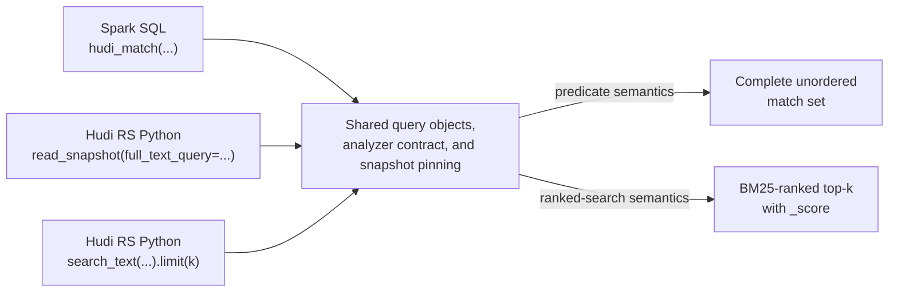
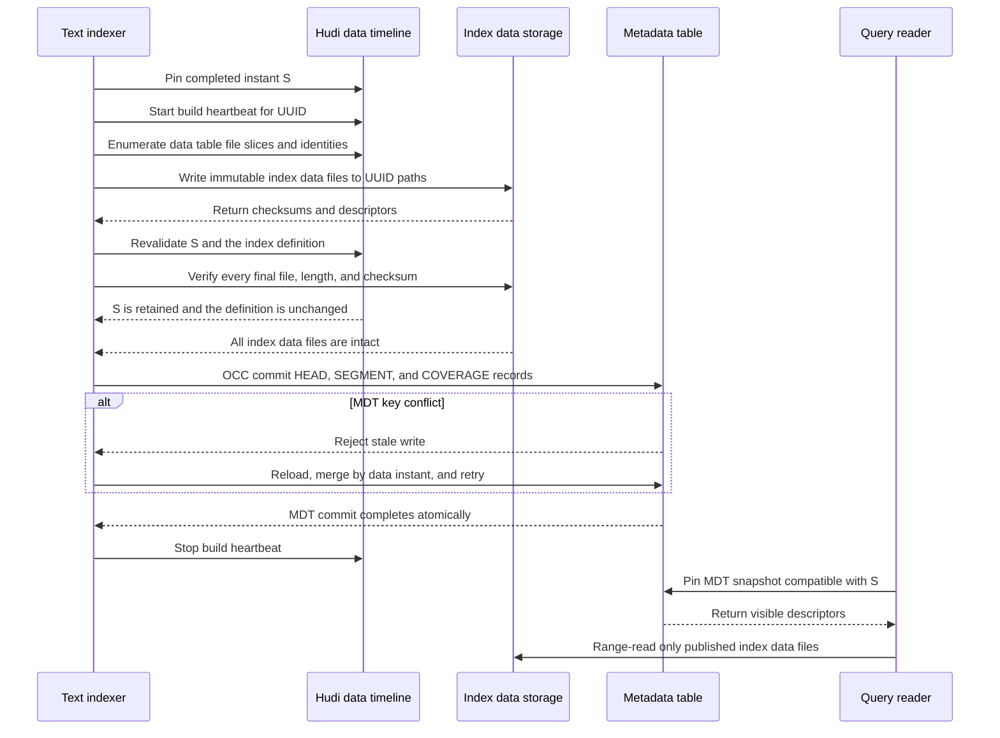
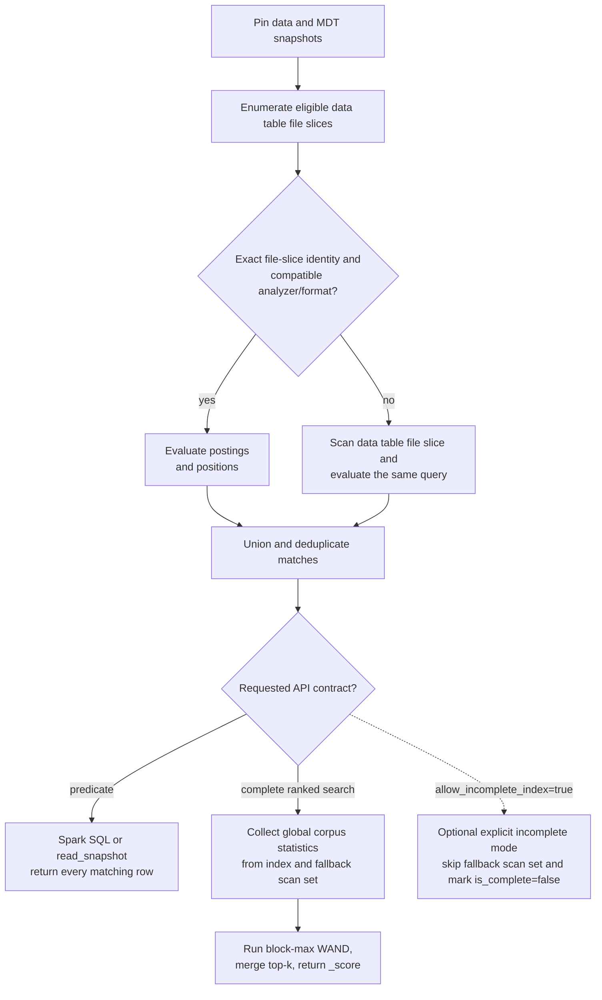

<!--
  Licensed to the Apache Software Foundation (ASF) under one or more
  contributor license agreements.  See the NOTICE file distributed with
  this work for additional information regarding copyright ownership.
  The ASF licenses this file to You under the Apache License, Version 2.0
  (the "License"); you may not use this file except in compliance with
  the License.  You may obtain a copy of the License at

       http://www.apache.org/licenses/LICENSE-2.0

  Unless required by applicable law or agreed to in writing, software
  distributed under the License is distributed on an "AS IS" BASIS,
  WITHOUT WARRANTIES OR CONDITIONS OF ANY KIND, either express or implied.
  See the License for the specific language governing permissions and
  limitations under the License.
-->

# RFC-110: Hudi Full-Text Search Index

## Proposers

- @danny0405

## Reviewers

- @vinothchandar

## Approvers

- TBD

## Status

Issue: TBD

RFC number: [RFC-110 reservation PR](https://github.com/apache/hudi/pull/19614)

Status: Under review

## Abstract

This RFC proposes a native full-text index for Apache Hudi tables. Users can
filter text through Spark SQL predicates or search directly through the Hudi RS
Python API. Index creation, visibility, rollback, and cleaning follow the Hudi
metadata table (MDT) indexing lifecycle.

The design draws from established inverted-index systems and formats, including
Apache Lucene, Elasticsearch/OpenSearch, Tantivy, and Lance. It does not embed
any of them as a storage dependency. A term dictionary maps an
analyzed word or token to a posting list: the Hudi records containing that term,
their term frequencies, and optional token positions. BM25 statistics rank
records for direct search.

The main Hudi repository initially incubates one Rust text-index engine together
with Spark SQL, a thin batched JNI adapter, MDT integration, and the versioned
index-file specification. Spark uses that engine for tokenization, index
construction, and index reads; it does not maintain a second Java search engine.
After the file format, analyzer behavior, and JNI contract stabilize, the Rust
crate migrates to Hudi RS and main Hudi consumes its released native artifact.

The MDT stores small authoritative records describing which index data files are
visible for each data table file slice. The larger term dictionaries and posting
lists live in immutable index data files below an MDT-owned auxiliary directory.
Immutable means a published file is never edited in place; catch-up and
consolidation write new files and atomically switch MDT references.

Queries are snapshot-safe. Compatible index data accelerates unchanged data
table file slices, while changed or unindexed file slices use the normal Hudi
scan. Therefore enabling the index does not change Spark SQL results. The direct
search API also defaults to complete results and may offer an explicitly
incomplete low-latency mode.

## Background

Hudi indexes currently answer questions such as which files might contain a
record key or a value range. Full-text search has a different contract. It
analyzes a string column into terms, maps each term to matching Hudi record keys,
optionally verifies term positions for phrases, and can rank the matching records.

A posting is one entry connecting a term to a matching Hudi record. A posting
list is the ordered collection of those entries for one term. An index data file
is a Hudi-owned auxiliary file containing term dictionaries, posting lists,
record-key mappings, and optional positions. These files are not data table base
files, log files, or MDT HFile values; MDT records control their lifecycle and
visibility.

### Motivation and use cases

Native full-text search is useful when the searchable text and Hudi timeline
must remain one system of record:

- **Logs and observability.** Find records containing an error signature or
  phrase while applying normal predicates such as service, environment, and
  event time.
- **Product catalogs, support tickets, and CRM text.** Match user terms across
  title and description while filtering on category, tenant, status, or access
  policy.
- **Security, audit, and eDiscovery.** Investigate text as of an incident or
  legal-hold snapshot and reproduce the exact records visible at that instant.

The correctness benefit is concrete. Suppose a GDPR deletion commits to Hudi
while a CDC pipeline into an external search cluster is delayed or fails. The
external cluster can continue serving the deleted record until it catches up.
With this design, the Hudi timeline controls both table and index visibility. A
query on the new snapshot either uses index data that exactly represents the
file slice or scans the changed file slice, so the deleted record cannot be
returned from stale index data.

The same lifecycle enables time-travel search. A query `AS OF` an older instant
selects index data for that snapshot when retained and falls back to the retained
table files otherwise. An external search service would need its own versioned
index and retention coordination to provide the same behavior.

Native text and vector indexes could eventually support hybrid BM25 and semantic
retrieval over one Hudi snapshot. This is a user-facing reason to keep both
indexes snapshot-aware, but this RFC does not define a hybrid operator or depend
on RFC-109 implementation or packaging.

This proposal builds on:

- [RFC-45](../rfc-45/rfc-45.md), which introduced asynchronous MDT indexing;
- [RFC-77](../rfc-77/rfc-77.md), which established dynamically named secondary
  index partitions and index definitions;
- Spark SQL scalar predicates, which keep index acceleration transparent to
  relational queries; and
- Hudi RS, which provides Rust table readers and Python bindings.

### Design principles

1. The Hudi timeline is the source of snapshot truth.
2. Index creation, visibility, rollback, and cleaning use MDT components.
3. Published index data files are immutable and visible only through MDT records.
4. Index use never changes the result of a Spark SQL predicate.
5. Ranking is independent of how the index is physically partitioned.
6. JVM and Hudi RS clients share query semantics and format versions.

### Goals

- Match token, boolean, prefix, fuzzy, phrase, and multi-column queries.
- Support copy-on-write (COW) and merge-on-read (MOR) tables.
- Build asynchronously and incrementally using the MDT indexer lifecycle.
- Guarantee snapshot-correct results for SQL and the default direct API mode.
- Range-read index blocks from object storage without loading an entire index
  into a Spark executor or Hudi RS process. Builders spill sorted runs and
  readers bound dictionary, posting-block, and query-expansion memory.
- Provide a direct Hudi RS Python API alongside Spark SQL.

Object storage provides persistence, not a memory bound. A broad or
high-frequency term can reference millions of records, and each query task must
decode part of that posting list. Block directories, range reads, bounded
caches, streaming decoders, and expansion limits prevent one task from loading
memory proportional to an entire segment.

### Non-goals

- Elasticsearch API, aggregation, highlighting, or percolator compatibility.
- Highlighting and custom relevance models in the first format version.
- Updating posting lists in place.
- Replacing SQL predicate indexes or the record index.
- Maintaining separate Java and Rust implementations of the text-index engine.
- Making the initial in-repository location of the Rust crate permanent.

## Implementation

### Terminology

| Term | Meaning |
| --- | --- |
| Text index definition | The named `HoodieIndexDefinition`, indexed columns, analyzer options, and `HoodieIndexVersion`. |
| Text index MDT partition | Dynamic `text_index_<name>` metadata partition containing the authoritative index lifecycle records. |
| Data table file group | The normal Hudi file group identified by partition path and file ID. |
| Data table file slice | One base file and its ordered log files for a file group at a particular Hudi instant. |
| Index segment | An immutable batch of text-index data files built from one or more data table file slices. It is not a Hudi or MDT file group. |
| Index shard | A size-bounded part of an index segment whose local record ordinals fit in `u32`. |
| File-slice identity | The exact table UUID, partition, file ID, base file, log files, schema, and merger state represented by an index segment. |
| Coverage record | An MDT record mapping one data table file group to candidate index segments and their file-slice identities. |
| Fallback scan set | Data table file slices without compatible index coverage for the pinned snapshot. |
| Indexed record | One Hudi table record, located by its Hudi record key and data table file slice. |
| Term | A token produced from an indexed string by the configured analyzer. |
| Posting list | For one term, the ordered local record ordinals containing it, with term frequencies and optional positions. |

An index segment may contain records from many data table file groups so that
small file slices do not create many tiny index objects. Each segment stores a
table from `file_slice_ordinal` to the corresponding partition path, file ID,
and exact file-slice identity. The `COVERAGE` record for every included file
group references that segment and ordinal. A file group can reference older and
newer candidate segments for time travel, but the planner selects at most one
exact file-slice match for a query snapshot.

### SQL interface

In this RFC, **SQL** means Spark SQL whose Java/Scala planning and MDT lifecycle
code invokes the Rust text-index engine through a batched JNI adapter. The
**direct API** means Hudi RS Python backed by that engine after its migration to
Hudi RS. Spark does not invoke the Python API or a remote Hudi RS service; it
loads the native library in each executor that builds or evaluates a text index.
Ordinary Hudi reads remain independent of the native library when the text-index
feature is disabled.

Creation follows Hudi's secondary-index syntax:

```sql
CREATE INDEX log_message_fts
ON application_logs
USING text_index (message)
OPTIONS (
  'base_tokenizer' = 'simple',
  'lower_case' = 'true',
  'language' = 'und',
  'with_position' = 'true',
  'posting_block_size' = '128'
);
```

The existing `HoodieIndexDefinition` is populated as follows:

```json
{
  "indexName": "text_index_log_message_fts",
  "indexType": "text_index",
  "version": "V1",
  "sourceFields": ["message"],
  "indexFunction": "tokenize",
  "indexOptions": {
    "base_tokenizer": "simple",
    "lower_case": "true",
    "language": "und",
    "with_position": "true",
    "posting_block_size": "128"
  }
}
```

`version` is the existing `HoodieIndexDefinition.version` field and is required
for current table versions. `TEXT_INDEX` is added to
`HoodieIndexVersion.getCurrentVersion`; the first implementation returns `V1`.
An incompatible change to index-definition interpretation or MDT record layout
requires a new `HoodieIndexVersion`. Index-file and analyzer versions remain
separate because either can evolve without changing the Hudi index definition.

#### Spark SQL predicates

The primary Spark interface is a Hudi-specific scalar predicate in `WHERE`.
`hudi_match(field, query, options)` is modeled after the Elasticsearch SQL and
OpenSearch SQL `MATCH(field, query, options)` predicates, while phrase and
multi-field behavior follows their `match_phrase` and `multi_match` query
concepts. It is not ANSI SQL; the `hudi_` prefix avoids claiming a Spark or ANSI
built-in. Whether the optimizer uses the text index is not observable in query
results.

```sql
SELECT event_ts, service, message
FROM application_logs
WHERE hudi_match(message, 'connection refused', 'operator=AND')
  AND service = 'payments';
```

Phrase and multi-column queries use companion predicates:

```sql
SELECT event_ts, service, message
FROM application_logs
WHERE hudi_match_phrase(message, 'out of memory', 0)
  AND environment = 'production';

SELECT _hoodie_record_key, subject, description
FROM support_tickets
WHERE hudi_multi_match('payment declined', subject, description)
  AND status = 'open';
```

The v1 signatures are:

```text
hudi_match(column, query [, 'key=value,...']) -> boolean
hudi_match_phrase(column, query [, slop]) -> boolean
hudi_multi_match(query [, 'operator=AND|OR'], column, ...) -> boolean
```

`hudi_match` options include `operator`, `fuzziness`, `prefix_length`, and
`max_expansions`. Unknown options are rejected. The functions compose with
normal SQL predicates. Conjunctive text predicates can be pushed into index
planning; expressions whose `OR` semantics cannot be preserved are evaluated
by Spark without index pushdown.

SQL predicate evaluation is always complete. Compatible segments accelerate
covered data table file slices, while uncovered or incompatible slices are
evaluated by the normal Hudi scan. There is no `_score` column and `LIMIT` does
not imply relevance order. Ranked top-k is a separate direct-search contract.

#### Hudi RS Python table API

Python users should not need to construct Spark SQL strings. Hudi RS extends
its existing `HudiTableBuilder` and `read_snapshot` API with the same structured
query model used by the index. The proposed predicate-style API is:

```python
import pyarrow as pa

from hudi import HudiTableBuilder
from hudi.search import FullTextOperator, MatchQuery, PhraseQuery

table = (
    HudiTableBuilder
    .from_base_uri("s3://warehouse/support_tickets")
    .build()
)

query = MatchQuery(
    "payment declined",
    column="description",
    operator=FullTextOperator.AND,
)

batches = table.read_snapshot(
    columns=["_hoodie_record_key", "subject", "description"],
    filters=[("status", "=", "open")],
    full_text_query=query,
)
tickets = pa.Table.from_batches(batches)
```

Structured queries compose without inventing a second query language:

```python
query = (
    MatchQuery("refund", column="description")
    & PhraseQuery("credit card", column="description", slop=1)
)

batches = table.read_snapshot(full_text_query=query)
```

For search applications, a Lance-style fluent API exposes ranked top-k and an
explicit score:

```python
results = (
    table.search_text(
        MatchQuery("payment declined", column="description"),
    )
    .where([("status", "=", "open")])
    .select(["_hoodie_record_key", "subject", "description"])
    .limit(20)
    .to_arrow()
)

# Ranked by BM25 descending; `_score` is included in `results`.
```

`read_snapshot(full_text_query=...)` has predicate semantics and returns every
match. `search_text(...).limit(k)` has ranked-search semantics and returns
`_score`. Both pin one Hudi snapshot, use identical analyzer/query objects, and
fallback-scan uncovered data table file slices by default. The fluent API may
expose `allow_incomplete_index=True`, but it must mark the result metadata as
incomplete rather than silently changing defaults.

Index creation remains an MDT table-service operation in the initial release,
invoked through Spark SQL or the Java API. A future Hudi RS writer API may add
`create_text_index` only after it can publish the corresponding MDT timeline
changes safely.

The three query entry points share one query model and coverage planner, but
their result contracts differ:



### Architecture

```mermaid
flowchart LR
    DATA["Data table file slices<br/>at snapshot S"]
    INDEXER["Spark TextSearchIndexer<br/>Java/Scala control plane"]
    JNI["Batched JNI adapter<br/>direct buffers"]
    RUST["In-repository Rust engine<br/>tokenizer, builder, reader"]
    FILES["Immutable index data files<br/>terms, postings, positions"]
    MDT["text_index_&lt;name&gt; MDT partition<br/>visibility and coverage records"]
    QUERY["Spark SQL<br/>hudi_match(...)"]
    PLANNER["Pin snapshot S and<br/>resolve each file slice"]
    INDEX_READ["Native index read<br/>matching record addresses"]
    HUDI_SCAN["Normal Hudi scan"]
    RESULT["Union Hudi record keys<br/>then materialize rows"]

    DATA -->|"build merged records"| INDEXER
    INDEXER -->|"bounded record batches"| JNI
    JNI --> RUST
    RUST -->|"encoded index blocks"| JNI
    JNI -->|"HoodieStorage writes"| FILES
    INDEXER -->|"atomically publish references"| MDT
    QUERY --> PLANNER
    DATA -->|"enumerate file slices"| PLANNER
    MDT -->|"exact coverage lookup"| PLANNER
    PLANNER -->|"covered descriptors"| JNI
    FILES -->|"HoodieStorage range reads"| JNI
    RUST -->|"matching record addresses"| INDEX_READ
    PLANNER -->|"changed or unindexed"| HUDI_SCAN
    DATA --> HUDI_SCAN
    HUDI_SCAN -->|"bounded text batches"| JNI
    INDEX_READ --> RESULT
    HUDI_SCAN --> RESULT
```



The SQL definition is stored in `.hoodie/.index/index.json`. A dynamic MDT
partition stores small control records. Immutable index data files live
under an MDT-owned auxiliary namespace. Readers never infer visibility by
listing that namespace; they use descriptors visible in the pinned MDT
snapshot.

### Metadata table integration

Add `TEXT_INDEX` to `MetadataPartitionType` with the dynamic prefix
`text_index_`. `getPartitionPath(metaClient, indexName)` and index-definition
lookup follow the secondary and expression index conventions. Add a
`TextSearchIndexer` to `IndexerFactory`, implementing `BaseIndexer` lifecycle
operations.

Add a tagged Avro metadata record named `HoodieTextIndexInfo` to
`HoodieMetadata.avsc`. The record is deliberately descriptor-sized and has
four logical kinds:

| Kind | Record key | Purpose |
| --- | --- | --- |
| `HEAD` | `head` | Index and file-format versions, analyzer identity, latest publication instant, and aggregate statistics. |
| `SEGMENT` | `segment/<uuid>` | Index-data paths, sizes, checksums, statistics, and the covered file-slice ordinal map. |
| `COVERAGE` | `coverage/<encoded-partition>/<file-id>` | Exact file-slice identity and candidate segment references ordered by data instant. |
| `TOMBSTONE` | `tombstone/<uuid>` | Segment retirement instant and deletion eligibility. |

The record includes a schema version, index name, analyzer fingerprint, segment
UUID, index-file format version, file-slice identities, file-slice-ordinal mapping,
aggregate record and token counts, file descriptors, and optional tombstone
instant. Large term statistics, dictionaries, and postings are never placed in
the Avro record. Active file-slice masks are computed for the pinned snapshot rather
than persisted as a single current value.

The coverage planner does not scan the complete `text_index_<name>` partition
for every query. It first applies normal partition pruning and enumerates the
eligible data file slices, then issues batched point lookups for their
`coverage/<encoded-partition>/<file-id>` keys. It loads only the `SEGMENT`
descriptors referenced by those records and may cache immutable descriptors for
the lifetime of the pinned MDT snapshot. Coverage storage is `O(F_table)` in the
number of table file groups, while lookup and comparison work is `O(F_query)` in
the number of file groups selected by the query. An unpartitioned full-table
query still has `F_query = F_table`, consistent with its data-scan planning
scope. The dynamic MDT partition uses normal MDT file-group sharding,
compaction, and key lookup rather than a driver-side enumeration of all control
records.

Index data files use this default path:

```text
<table>/.hoodie/metadata/.aux/text-index/
  <escaped-index-name>/<segment-uuid>/...
```

The directory is below MDT ownership but outside normal MOR partition discovery.
A future external index-data tier may be configured, but every path must be scoped
by table UUID and validated by readers. Only an MDT commit makes a segment
visible. Failed writers may leave unpublished files; the cleaner removes them
after a safety interval.

### Hudi record identity and file-slice coverage

The indexed unit is one Hudi record from the merged view of a data table file
slice at snapshot `S`. The index does not introduce an independent search-engine
record identity. Version 1 requires a stable Hudi record key and stores this
compact logical address for every indexed record:

```text
HudiTextIndexRecordAddress {
  file_slice_ordinal: u32,
  record_key: bytes,
  row_position_hint: optional u64
}
```

The segment metadata maps `file_slice_ordinal` to the Hudi partition path, file
ID, base instant, and exact file-slice identity. Query results are grouped by
that partition path and file ID before Hudi materializes current rows. The
`row_position_hint` is only an optimization and is used when the file-slice
identity matches exactly; the record key remains authoritative.

A file-slice identity includes:

- table UUID, partition path, and file ID;
- base instant and base-file identity (path, length, and checksum when known);
- ordered log-file identities (path, length, and latest block instant);
- writer schema identifier; and
- record-merger implementation and relevant options.

At snapshot `S`, the coverage planner enumerates eligible data table file slices
and compares each computed identity with the candidate identities in its
`COVERAGE` record. An exact match activates that segment's file-slice ordinal.
A changed base file or added MOR log puts the file slice in the fallback scan set
until it is rebuilt. A segment created from a later file-slice state is not used
for an older snapshot.
This avoids attempting to delete or mutate old postings after compaction,
clustering, rollback, or MOR updates.

Freshness is measured in changed data table file slices, not merely elapsed
commits. Let `F` be the eligible file slices and `R` the slices without an exact
identity match at the query snapshot. The coverage ratio is `C = 1 - R/F`. Once
a MOR file group receives its first new log block it contributes one fallback
scan slice until catch-up; additional blocks increase scan bytes but not the
fallback-slice count. A complete predicate query therefore has the qualitative
cost `index_scan(C * F) + fallback_scan(R)`. Complete ranked search additionally
analyzes the fallback scan set to obtain exact global record frequencies. As `C`
approaches zero, performance intentionally approaches a normal Hudi scan while
correctness is unchanged.

There is no universal freshness SLA because `R`, log size, analyzer cost, and
query selectivity depend on the workload. Deployments schedule incremental
catch-up by time or changed-slice thresholds and observe data instant lag,
coverage ratio, fallback-scan bytes, and fallback-scan analysis time. The
performance plan must publish the latency envelope across those dimensions
before the feature is enabled by default.

### Text-index file format

All files begin with an eight-byte `HUDIFTS1` magic value followed by little-
endian format version, feature flags, variable-header length, and header
checksum. Independently checksummed blocks follow the header, and a footer
contains the block directory for range reads. Readers reject unknown required
feature bits and enforce configured allocation limits before reading lengths.

Each segment contains:

- `metadata.hfts`: analyzer fingerprint, data table, file-slice descriptors,
  segment statistics, index shard descriptors, and checksums;
- `part_<n>.tokens.hfts`: a minimal finite-state transducer (FST) mapping
  analyzed term bytes to term ordinals and posting metadata;
- `part_<n>.docs.hfts`: columnar file-slice ordinal, record-key offsets and bytes,
  record token count, and optional row-position hint;
- `part_<n>.postings.hfts`: record frequency, posting-block offsets,
  delta-encoded local record ordinals, term frequencies, and block-max metadata;
  and
- `part_<n>.positions.hfts`: optional delta-encoded token positions and offsets.

Index shards use local `u32` record ordinals. A builder starts a new index shard
before that space is exhausted. Posting blocks default to 128 records and use
bit packing or variable-byte encoding, selected per block. Each block records
maximum term frequency and minimum indexed-record token count; these
values provide a conservative BM25 upper bound for block-max WAND. Positions
are stored only when enabled by the immutable index definition.

A phrase clause requires compatible position data. For an index created with
`with_position=false`, the complete Spark SQL and Hudi RS paths treat its data
table file slices as uncovered for that query and evaluate the phrase through
`RawTextSearchSplit`. They never silently downgrade a phrase to an `AND` of its
terms. In version 1, `allow_incomplete_index=True` rejects a phrase query against
a positionless index rather than returning an approximate result.

No implementation-specific collection serialization is persisted directly.
Every field is defined by the Hudi format specification, so upgrading a Java or
Rust dependency cannot silently change files.

### Implementation ownership

The main Hudi repository initially owns the SQL extension, MDT index lifecycle,
Spark planning, a thin Java JNI adapter, the `hudi-native-text-index` Rust crate,
and the language-neutral persistent format. The Rust crate is the only complete
implementation of the tokenizer, builder, reader, phrase evaluator, and BM25
engine. Spark index construction, covered-slice evaluation, and fallback-scan
tokenization all invoke it, preventing Java/Rust analyzer or codec drift.

#### Why one native Rust engine

Rust is not required for every search system; a JVM-only engine can be valid for
a Spark-only feature. RFC-110 chooses one native Rust core because it must serve
both Spark and Hudi RS without maintaining two engines:

- **Correct semantics.** Indexed reads, fallback scans, Spark, and Python use the
  same tokenizer, positions, phrase rules, and BM25 implementation.
- **One compatibility surface.** One encoder and decoder own dictionaries,
  postings, checksums, and format evolution.
- **Bounded data-plane memory.** Packed buffers and explicit native allocations
  avoid adding object-heavy posting state to the Spark JVM heap; batched JNI
  keeps boundary overhead outside per-record and per-token loops.
- **Cross-language reuse.** Spark uses JNI and Hudi RS uses Rust/Python bindings
  around the same core. Moving the crate changes ownership, not index semantics
  or stored files.

This placement is an incubation stage, not permanent ownership. Keeping the
crate beside the Spark and MDT integration allows the native API, index format,
and lifecycle to evolve atomically without coordinating unreleased changes
across two repositories. After the native contract meets the migration criteria
below, the crate moves to Hudi RS. Main Hudi then replaces its source dependency
with a pinned Hudi RS native artifact while preserving the Java-facing API and
on-disk format:

| Main Hudi throughout | During incubation in main Hudi | After migration to Hudi RS |
| --- | --- | --- |
| Spark SQL predicates and planning | Rust tokenizer, builder, and reader source | Rust tokenizer, builder, and reader source |
| MDT indexer lifecycle | Native build and platform tests | Native artifact publication |
| Thin Java JNI adapter and loader | Rust conformance tests | Rust conformance tests |
| Normative file and JNI specifications | No separate Java engine | Python query objects and bindings |
| `HoodieIndexDefinition` and `HoodieTextIndexInfo` | Spark consumes the in-tree library | Main Hudi consumes the pinned Hudi RS artifact |

The JNI surface is deliberately coarse-grained. Java passes bounded record or
query batches through direct buffers and receives encoded index blocks or
matching `HudiTextIndexRecordAddress` batches. It never crosses JNI once per
token, posting, or record. The JVM side retains `HoodieStorage` ownership for
credentials, retries, range reads, writes, and metrics; storage clients and
credentials are not placed in Rust process-global state.

The native adapter versions every entry point, validates buffer lengths before
calling Rust, catches Rust panics at the FFI boundary, converts failures to typed
Java exceptions, and owns native handles through `AutoCloseable`. Text-index
creation or queries fail clearly when a compatible native library cannot load;
they do not silently use a semantically different Java tokenizer. Hudi tables
and queries that do not use the text-index feature remain unaffected.

Migration to Hudi RS requires all of the following:

1. the index-file format, analyzer fixtures, and batched JNI API have stable
   versioning and compatibility tests;
2. the supported native platform matrix passes build, load, corruption, and
   Spark executor tests in CI;
3. Hudi RS can publish the same native artifact and pass the same golden corpus;
4. main Hudi can consume that artifact without changing SQL behavior, JNI method
   signatures, MDT records, or existing index files; and
5. the in-tree crate is removed only after the Hudi RS dependency is available
   to the supported Hudi build and release process.

The stable contracts are the analyzer fingerprint, query AST semantics,
index-file version, segment descriptor schema, record-address encoding,
completeness rules, and JNI ABI version. A segment written before migration must
remain readable afterward without rebuilding.

### Native build and release

During incubation, the Apache Hudi source release contains the Rust source and
can build the native library as part of the text-index module. Convenience
binary artifacts use explicit OS and architecture classifiers, are produced by
the Hudi release workflow from the same source, and are checksummed and signed
with the other release artifacts. The exact supported classifier matrix is a
Phase 0 decision; unsupported platforms may build from source or leave the
optional text-index feature disabled.

The Java loader verifies the expected JNI ABI and Rust engine version before
creating a handle. Native artifacts are isolated by Hudi bundle/classloader and
extracted to a checksum-addressed path so different Hudi versions do not reuse
an incompatible library. After migration, Hudi RS owns native publication while
main Hudi keeps the same loader contract and pins a compatible Hudi RS release.

### Build and publication lifecycle

A bootstrap build performs these steps:

1. Start the text-index table-service instant and register a heartbeat for a
   unique build UUID through Hudi's existing heartbeat service.
2. Pin a completed data-table instant and corresponding MDT snapshot.
3. Enumerate data table file slices and construct their exact identities.
4. Use Hudi's merged reader to emit stable record key, text, file-slice ordinal,
   and optional row-position hint.
5. Pass bounded record batches through JNI so the Rust engine analyzes Hudi
   records and builds bounded-memory sorted runs.
6. Merge runs into dictionaries, record-address tables, postings, and positions.
7. Write index blocks to UUID-scoped temporary paths while refreshing the build
   heartbeat.
8. Finalize checksums, statistics, and file-slice descriptors.
9. Move or copy index data files to their final immutable UUID paths when
   required by the storage implementation.
10. Revalidate the pinned instant, index definition, and the existence, length,
    and checksum of every final index data file.
11. Return `SEGMENT`, `COVERAGE`, and `HEAD` metadata records to the MDT writer.
12. Publish all descriptors and partition state in one MDT commit, then stop the
    heartbeat after the commit completes or the build aborts.

Visibility begins at step 12. An indexer retry may reuse an index data file set
only after validating every checksum and build identity; otherwise it writes a
new UUID.

Incremental catch-up is file-slice replacement, not posting mutation. The
indexer compares current file-slice identities with coverage records and builds
segments for new or changed slices. Unchanged slices retain their existing
segment and file-slice-mask membership.

Each build and descriptor records its pinned data instant `S`. A data commit
that completes after enumeration does not make publication for `S` incorrect:
a reader at a later snapshot compares the later file-slice identity and sends
changed slices to the fallback scan set. Immediately before MDT publication,
the indexer must verify that `S` is still a completed, retained instant and that
the index definition and analyzer fingerprint have not changed. The same check
verifies that all final index data files still match their recorded lengths and
checksums. It aborts publication if `S` was rolled back, is no longer a valid
build base, or any index file is absent or changed.

The build heartbeat protects unpublished UUID paths from orphan cleanup. The
cleaner may delete an unpublished file set only when its build heartbeat is
absent or expired and the orphan grace interval has elapsed. A live but slow
builder therefore retains its files; a dead builder eventually becomes
collectable. The indexer holds the heartbeat through the MDT commit, including
OCC retries, so validation and publication cannot race the cleaner. This reuses
Hudi's heartbeat and table-service lifecycle rather than introducing a separate
distributed lease protocol.

The MDT commit uses Hudi's existing indexing transaction, OCC, and lock-provider
configuration. Since concurrent indexers can update the same `HEAD` and
`COVERAGE` keys, a conflict must retry against the latest MDT snapshot and merge
candidate segments in data-instant order. `HEAD` advancement is monotonic: an
older build may remain a time-travel candidate but cannot replace a newer head
or discard newer coverage. This rule covers concurrent data writers and
concurrent text-index table services without introducing a separate lock
protocol.

The publication order prevents a partially written segment from becoming
visible:



If index data writing fails, no MDT descriptor is committed and readers cannot
discover the orphan. If the MDT commit fails, retry validation may reuse the
index data; otherwise the orphan cleaner removes it after the heartbeat expires
and the grace interval elapses.

### Consolidation, rollback, and cleaning

Small segments are consolidated when configurable count, byte, or inactive
file-slice ratios are exceeded. Consolidation copies only active Hudi records,
requires the same analyzer fingerprint, writes new index data files, publishes
the new descriptors, and tombstones old segments in the same MDT commit. Readers
pinned before that commit retain the old view.

Rollback and restore reconcile visible descriptors to the restored MDT/data
timeline state. If exact file-slice coverage no longer exists, those slices join
the fallback scan set; a query is never allowed to use merely similar postings.
The cleaner deletes tombstoned index data files only after both data and MDT
retention guarantee that no supported query can see the descriptor. Orphan index
data files without a published descriptor are deleted only when their build has
no active heartbeat and the separate grace period has elapsed. `DROP INDEX`
first removes visibility and emits tombstones, then cleans asynchronously.

### Query execution

At query time, exact file-slice coverage determines whether each slice uses
the index or the correctness-preserving fallback scan:



Spark SQL predicate evaluation executes in four phases:

1. Pin data and MDT snapshots. Resolve each eligible data table file slice to one
   exact compatible segment file-slice ordinal or a `RawTextSearchSplit`.
2. Evaluate compatible posting lists and positions to produce matching Hudi
   record addresses for covered slices.
3. Evaluate the same query object and analyzer while scanning fallback splits.
4. Union and deduplicate addresses, materialize rows by partition and file ID,
   then evaluate residual Spark predicates. Row-position hints are used only
   with an exact file-slice identity.

This path produces a match set, not a ranked candidate set. It must preserve
normal Spark SQL semantics for `AND`, `OR`, time travel, and `LIMIT`. Unsupported
pushdown shapes fall back to normal predicate evaluation rather than returning
an incomplete match set.

The Hudi RS `search_text` API adds two ranking phases. It collects corpus
statistics for expanded query terms across active index segments and the
fallback scan set, then searches each input using block-max WAND and merges
deterministic local top-k candidates. Scoring each segment with local inverse
record frequency would make ranks change when records are repartitioned or
segments are consolidated, so BM25 statistics are global to the pinned snapshot.

When complete ranked search has a fallback scan set, collecting exact record
frequencies requires analyzing those file slices. This preserves ranking
correctness but can dominate latency; the API exposes coverage and scan metrics.
An explicit `allow_incomplete_index=True` may skip the fallback scan set, but
the returned metadata must set `is_complete=false`.

For term `q` and Hudi record `r`, version 1 uses:

```text
IDF(q) = ln(1 + (N - df(q) + 0.5) / (df(q) + 0.5))

score(q,r) = IDF(q) *
             tf(q,r) * (k1 + 1) /
             (tf(q,r) + k1 * (1 - b + b * dl(r) / avgdl))
```

Defaults are `k1=1.2` and `b=0.75`. `N`, `df`, and `avgdl` are global over the
active file-slice ordinals plus the fallback scan set at the pinned snapshot.
Boolean clauses define candidate membership; positive term scores are summed.
Phrase clauses first intersect postings and then verify positions.

### Analyzer contract and schema evolution

An analyzer is a canonical ordered pipeline: base tokenizer, Unicode
normalization, case handling, optional accent folding, stop words, stemming,
and maximum token length. Its canonical JSON, resource content hashes, locale,
and implementation version form a SHA-256 fingerprint. Index build and query
must use the same fingerprint.

Renaming or changing a non-indexed field does not invalidate segments. Changing
the indexed column's logical type, analyzer options, or token resources requires
a new text index or rebuild. Null values produce no index terms but remain
defined by the index's `index_nulls` option. Invalid UTF-8 is rejected or
replaced according to an immutable option.

### Filtering and materialization

Spark partition predicates are pushed into coverage resolution. Other
conjunctive predicates remain normal Spark filters and are evaluated without
changing the text predicate's truth value. The optimizer may intersect record
identifiers from expression, secondary, or bitmap MDT indexes, but the
persistent text format does not depend on a particular companion index.

Hudi RS `.where(...)` uses prefilter semantics by default: structured filters
restrict the corpus before ranking, so `limit(k)` returns the best `k` Hudi
records within that filter when enough matches exist. Postfilter semantics are
deferred until the API can represent their potentially short result sets
explicitly.

### Configuration

| Property | Default | Description |
| --- | --- | --- |
| `hoodie.metadata.index.text.enable` | `false` | Enables the MDT text-index component. |
| `hoodie.text.index.build.memory.mb` | `512` | Builder memory before spilling sorted runs. |
| `hoodie.text.index.posting.block.size` | `128` | Records per posting block. Immutable per index. |
| `hoodie.text.index.segment.target.mb` | `512` | Approximate target segment size. |
| `hoodie.text.index.query.max.expansions` | `1024` | Prefix/fuzzy expansion limit. |
| `hoodie.text.index.query.max.clauses` | `256` | Parsed boolean clause limit. |
| `hoodie.text.index.orphan.grace.hours` | `24` | Minimum age before cleanup after an unpublished build heartbeat expires. |

### Observability and failure behavior

Spark `EXPLAIN` and query metrics expose the selected index, analyzer
fingerprint, data/MDT instants, covered and fallback-scan file-slice counts,
segment count, coverage ratio, index data-instant lag, fallback-scan bytes, index
bytes read, posting blocks skipped, and fallback-scan time. Hudi RS ranked
results additionally expose `is_complete`, indexed/fallback-scan file-slice
counts, fallback-scan statistics time, and scoring time through query metadata.
Spark native metrics additionally expose the loaded engine/JNI versions, JNI
batch count and bytes, native memory high-water mark, panic/error count, and
library-load time.

Checksum failure, unsupported format, missing index data, or file-slice identity
mismatch marks the affected data table file slice uncovered. Spark SQL and
complete Hudi RS queries scan it through the normal Hudi reader when table data
is available. Only an explicit `allow_incomplete_index=True` direct query may
skip it, and that query must return `is_complete=false`.

### Security and resource limits

- Validate all descriptor paths against table UUID and configured index-data root.
- Verify header and block checksums before use.
- Bound query clauses, term expansions, phrase positions, header sizes, decoded
  posting counts, and reader memory per task.
- Treat index bytes and structured query inputs as untrusted input.
- Catch Rust panics at every JNI/FFI entry point and convert them into typed Java
  or Hudi RS errors without unwinding across the native boundary.
- Do not place credentials or storage clients in process-global state.

### Compatibility

Six versions are independent and explicit:

1. `HoodieIndexDefinition.version` (`HoodieIndexVersion`), bumped when Hudi's
   interpretation or MDT layout for the text index changes incompatibly;
2. MDT Avro schema version;
3. index-file format and required feature bits;
4. analyzer implementation/fingerprint version;
5. JNI ABI and Rust engine artifact version; and
6. Spark predicate and Hudi RS query-object API version.

Readers may accept older index-file versions through dedicated decoders. Writers
produce only the configured current version. An upgrade that changes analyzed
terms requires a new analyzer fingerprint and rebuild, not an in-place claim of
compatibility.

## Rollout/Adoption Plan

### Phase 0: process and native contracts

- RFC-110 was reserved through
  [PR #19614](https://github.com/apache/hudi/pull/19614).
- Finalize Avro descriptors, analyzer canonicalization, query objects, the
  language-neutral index-file format, and a versioned batched JNI API.
- Select the native OS/architecture classifier matrix and source-build fallback.
- Agree with Hudi RS maintainers that main Hudi is the incubation location and
  on the criteria and ownership transition for the later migration.

### Phase 1: Spark bootstrap preview

- Add `TEXT_INDEX`, `TextSearchIndexer`, MDT records, and bootstrap creation.
- Add the in-repository `hudi-native-text-index` Rust crate, thin Java JNI
  adapter, native loader, and analyzer/format conformance suite.
- Add `hudi_match`, `hudi_match_phrase`, and `hudi_multi_match` predicates with
  complete fallback scanning through the normal Hudi reader.
- Build and read real index files through batched JNI; do not add Java tokenizer,
  builder, or posting decoder implementations.
- Ship behind `hoodie.metadata.index.text.enable=false`.

### Phase 2: incremental, optimized, and hardened native search

- Add file-slice incremental rebuild, consolidation, positions/phrase search,
  prefix/fuzzy expansion, and block-max WAND.
- Harden native packaging, classloader isolation, failure handling, platform CI,
  compatibility fixtures, and complete observability.
- Stabilize the file-format, analyzer, and JNI versions required for migration.

### Phase 3: migrate the Rust engine to Hudi RS

- Move the Rust crate and native artifact publication to Hudi RS after all
  migration criteria in this RFC pass.
- Change main Hudi from the in-tree crate to a pinned Hudi RS native artifact
  without changing the Java API, SQL behavior, MDT records, or existing files.
- Add Hudi RS `read_snapshot(full_text_query=...)` and ranked `search_text()`
  with Python bindings and complete observability.

### Phase 4: broader engine integration

- Add Flink and additional Java APIs.
- Investigate pre-WAND filtering with other MDT indexes.
- Design hybrid text/vector ranking as a separate RFC after both index contracts
  are available; RFC-110 creates no runtime dependency between them.

No existing table changes until a text index is explicitly created. Dropping
the feature leaves table data readable. Persistent index format upgrades are
side-by-side rebuilds followed by descriptor switchover and cleanup.

## Test Plan

### Native format, JNI, and migration compatibility tests

- Golden little-endian headers, footers, dictionaries, postings, and positions.
- Unknown version/feature rejection, length limits, checksum corruption, and
  fuzzing of the Rust decoder before and after its Hudi RS migration.
- Analyzer golden cases for Unicode, case, stop words, stemming, invalid UTF-8,
  and token-length limits.
- Compression round trips, posting monotonicity, positional verification, and
  block upper-bound conservatism.
- BM25 values checked against the formula with global statistics.
- JNI tests for direct-buffer bounds, large batches, handle lifecycle, concurrent
  Spark tasks, panic conversion, ABI mismatch, library loading, and native-memory
  release.
- Run the same golden corpus against the in-tree crate and the candidate Hudi RS
  artifact before migration; require identical index bytes, match sets, and
  scores within the defined tolerance.

### Hudi integration tests

- COW and MOR bootstrap, log updates, compaction, clustering, rollback, restore,
  clean, drop, and recreate.
- Dynamic MDT partition creation and deletion through the indexer lifecycle.
- Exact coverage selection for old and current time-travel snapshots.
- Analyzer/schema incompatibility and unsupported index-file-version behavior.
- Compatibility between Spark-built segments and Hudi RS reads before and after
  migration.
- Orphan, partial upload, retry, duplicate build, and tombstone cleanup cases,
  including a slow live build protected by heartbeats, an expired build becoming
  collectable, and a missing final file aborting publication.
- A data commit between file-slice enumeration and MDT publication, concurrent
  indexers targeting overlapping file groups, stale-head rejection, and OCC
  retry/merge behavior.
- Record keys containing arbitrary UTF-8 and binary-safe encoded metadata keys.

### Distributed correctness tests

The primary Spark SQL oracle is:

```text
indexed evaluation of hudi_match(...)
  == forced full-scan evaluation of hudi_match(...)
```

Compare record identities across different Spark partition counts, segment
layouts, consolidations, active file-slice masks, and mixtures of indexed and
fallback-scanned file slices. Verify normal `AND`/`OR` composition and time
travel. Separately compare Hudi RS ranked output against an exhaustive BM25
scorer, including score tolerance and deterministic tie ordering.

### Performance tests

- Build throughput, peak JVM/native/Hudi RS memory, JNI batch overhead, spill
  volume, and object-store writes on small and skewed terms.
- Cold/warm top-k latency, range-read count, bytes read, cache hit rate, and WAND
  block skips at multiple selectivities.
- Consolidation write amplification and query degradation with segment count.
- Coverage-planning latency for partition-pruned and full-table queries at up
  to millions of file groups, verifying batched point lookup rather than a full
  MDT control-record scan.
- Complete-query latency across catch-up delay, changed-slice ratio, MOR log
  bytes, analyzer cost, and selectivity. Report coverage ratio, fallback-scan
  time, and exact fallback-scan record-frequency analysis separately.
- Compare flat Hudi search and, as non-binding external baselines, Lance FTS and
  Elasticsearch on the same corpus and analyzer semantics.

### Open questions

1. Should v1 require record keys, or define a separate immutable row-address
   contract for keyless tables?
2. Should term record frequencies live beside each term dictionary or in a
   separate compact statistics index file for more efficient batched lookups?
3. Which base-file and log-file checksums are reliably available on every
   supported storage?
4. Should the first release support only `simple` and `whitespace` tokenizers to
   keep analyzer resources deterministic?
5. Which native OS/architecture classifiers are required in Phase 1, and which
   platforms are source-build-only?
6. Which Hudi RS release first consumes the migrated crate, and how long must
   mixed Spark/Hudi RS versions remain compatible?
7. When Hudi RS gains MDT write support, should Python expose
   `create_text_index`, or keep table-service operations in Spark/Java?

### References

- [Apache Lucene inverted-index and postings API](https://lucene.apache.org/core/10_3_1/core/org/apache/lucene/index/package-summary.html)
- [Elasticsearch SQL full-text predicates](https://www.elastic.co/docs/explore-analyze/query-filter/languages/sql-functions-search)
- [OpenSearch SQL full-text search](https://docs.opensearch.org/latest/sql-and-ppl/full-text/)
- [Lance full-text search specification](https://lance.org/format/index/scalar/fts/)
- [Lance Python full-text search](https://lance.org/quickstart/full-text-search/)
- [Lance Spark SQL full-text search](https://lance.org/integrations/spark/operations/dql/fts/)
- [Tantivy search engine](https://github.com/quickwit-oss/tantivy)
- [Apache Hudi metadata documentation](https://hudi.apache.org/docs/metadata/)
- [Hudi RS Python/Rust quick start](https://hudi.apache.org/docs/next/python-rust-quick-start-guide/)
