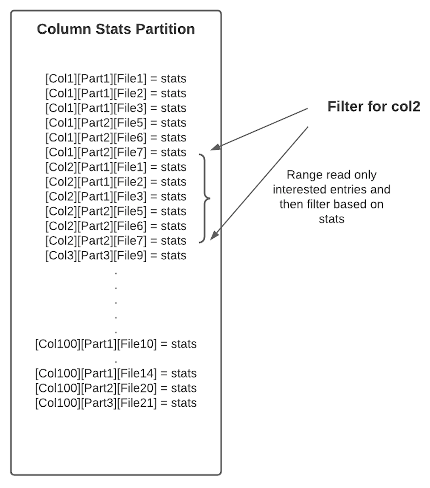

<!--
  Licensed to the Apache Software Foundation (ASF) under one or more
  contributor license agreements.  See the NOTICE file distributed with
  this work for additional information regarding copyright ownership.
  The ASF licenses this file to You under the Apache License, Version 2.0
  (the "License"); you may not use this file except in compliance with
  the License.  You may obtain a copy of the License at

       http://www.apache.org/licenses/LICENSE-2.0

  Unless required by applicable law or agreed to in writing, software
  distributed under the License is distributed on an "AS IS" BASIS,
  WITHOUT WARRANTIES OR CONDITIONS OF ANY KIND, either express or implied.
  See the License for the specific language governing permissions and
  limitations under the License.
-->
# RFC-[27]: [Data skipping Index to improve query performance]

## Proposers

- @manojpec
- @shivnarayan
- @satish.kotha

## Approvers
- @rmpifer
- @uditme

## Status

JIRA: https://issues.apache.org/jira/browse/HUDI-1822

> Please keep the status updated in `rfc/README.md`.

## Abstract

Query engines typically scan large amounts of data for query planning and execution. Few data skipping strategies are
available to reduce the amount of data scanned, like

- Partition pruning
    - User has to select the partitions to narrow down the data to be scanned for the query.
- File pruning
    - Some data file formats contain metadata including range information for certain columns, like for parquet, this
      metadata is stored in the file footer. As part of query planning, all range information from data files are loaded
      and data files are then pruned based on the comparisons done for the query expression with the column range
      information.
    - This approach does not scale if there are a large number of partitions and data files to be scanned.

We propose a new data skipping approach here for improving the query performance. to store additional information as
part of Hudi metadata table to implement data skipping index. The goals of data skipping index is to provide:

- Global index: Users query for information they need without need for specifying partitions. Index can effectively find 
  data files in the table.
- Improve query plan: Efficiently find data files that have information for specified query predicates.
- Support multiple types of index: Initial implementation may provide range index. But goal is provide flexible 
  framework to implement other types of index (e.g. bloom)

## Background
RFC-15 added metadata table support to Hudi for optimized file listing. RFC-37 is adding metadata index and column stats 
as another partition to metadata table. This RFC will piggyback on the column stats partition that RFC-37 will be adding 
to metadata table. 

Notes: Effectiveness of the index will be proportional to how data is layed out. If every file contains data for 
commonly specified query predicate, index may not be very effective.

## Implementation
At a high level there are 3 components to implement index support: 
- Storage format
- Metadata generation
- Query engine integration.

### Column_Stats Index/Partition
We want to support multiple types of index (range, bloom etc). So it is important to generate different types of record
for different columns. Focus of this RFC will be column range or column stats index. i.e min, max values, null counts etc.
Users can configure the commonly queried columns and columns stats partition in metadata table will store all stats pertaining
to the configured columns for every valid data file where the column is present.

Similar to how we generate records for files partition in metadata table, we will generate HoodieMetadataRecord
for column stats partition on any commit that gets applied to metadata table. Basic building block of metadata table used 
for file listing will be used for this column stats partition as well (how updates are applied to metadata table,
how invalid data is ignored, etc)

Column_stats partition stores statistics for all indexed columns in the Hudi data table. The index maintained in this 
partition helps
Predicate pushing/data skipping - file filtering based on column predicates

For the purpose of column predicate filtering, this partition can store statistics for any column as per configs.

So, high level requirement for this column_stats partition is (pertaining to this RFC):
 - Given a list of columns and predicates(and optionally partitions), return a list of matching file names

### Storage format
To cater to the above requirement, we plan to encode column name, partition path and file name to the keys in HFile. 
Since HFile supports efficient range/prefix search, our lookup should be very fast.



We plan to generate unique and random and unique hash IDs for all 3 components
- ColumnIndexID :
    - base64(hash32(column name))
    - on-disk size = 12bytes per col_stat per file 
- PartitionIndexID:
    - base64(hash32(partition name))
    - on-disk size = 12bytes per partition 
- FileIndexID:
    - base64(hash128(file name))
    - on-disk size = 24bytes per file

#### Design Choices for ID generation
1. Incremental IDs: Sequentially increasing IDs can be generated in the context of the ongoing commit/write. ID can always start at 1 and to make the full ID unique enough, sequential IDs can be appended with the ongoing commit time.
 a. Pros:
    ID is simple to generate, doesn't depend on key lookups for resuming the ID generation across writers.
    Overall ID can be shorter than Hash based IDs and can still be unique
    Differential/delta encoding goes good with sequential numbers and can get high compression ratio (though we didn't see this in the tests)
 b. Cons:
    Same column can be given several IDs across several commits spilled over several files. Complex merging logic is needed to coalesce them all when looking up for any interested columns.
    Doesn't go good with schema evolution. Even without schema evolution, changing IDs for the same column by itself is small schema evolution problem.
   
2. Hash IDs: Hashing utilities can be used to generate unique and random IDs of any length for the given column/partition/file name.
 a. Pros:
    Deterministic Name to ID generation
    Reverse lookup of ID to name is possible by relatively much smaller meta index read
    ID length can be controlled for the scaling needs
    Sharding and locality can be controlled by prefixing with more bits (doable by Incremental IDs also)
 b. Cons:
    Big scale deployments demand a huge ID space for files there by needing to generate 128 bits hashes
    These are usually 32 digit hex chars, taking up at least 32 bytes/ID on disk. However, base64 encoding can help to shave off few bytes and get them to 24 bytes.
    Takes up larger space in-memory and on-disk compared to Sequential IDs. Theoretically, the compression ratio should be lesser compared to Sequential IDs.
   
Key format in column_stats partition<br/> 
- ColumnStatsIndexID = ColumnIndexID.append(PartitionIndexID).append(FileIndexID)
- ColumnStatsAggregateIndexID = ColumnIndexID.append(PartitionIndexID)

First type will be used to store one entry per column per file. And second type will be used to store one aggregated 
entry per column per partition. This will be a fixed size key. Lookups don't have to search for ID delimiters as in the 
case of incremental IDs.

These key encodings fit in well to serve our requirements.
Since we are using Hfile as the format, all keys are going to be sorted and hence range read will be very effective for
our use-case as we have chosen the key format consciously having this in mind.  

Given a list of columns and optionally partitions, return a list of matching file names.

1. We can do prefix search of [ColumnIndexID] or [ColumnIndexID][PartitionIndexID]
    - If both columnId and partitionIds are supplied, we will do range read of [colId][partitionId].
    - If list of partitions not available as part of query, we will first look up [colId]+"agg" to do prefix search 
   for partition level stats. Filter for those partitions which matches the predicates and then follow (1) as in previous line.
    
2. Fetch only interested entries for [colId][partitionId] list.
3. Will look up the stats and filter for matching FileIndexIDs
4. Reverse lookup in Files partition to get FileIndexID to FileName mapping.
   
Note: 
As you could see here, reverse look up of FileIndexID to fileName mapping has to go into "Files" partition to satisfy our requirement.
So, "Files" partition will be added with additional entries of fileId to fileName mappings on the write path. 

#### Sharding: 
Any partition in metadata table needs to be instantiated with N file groups/shards upfront. "Files" partition is small and hence
we went with just one file group. But for record level index, we can't go with single file group and had to shard the data. 
We will employ some kind of hashing mechanism for key to file group mapping. On the write path, entries will be sharded 
and written to different file groups. On the read path, key to be looked up will be hashed to find the right file group
to be looked up. For wild card search, all file groups will be looked up. 

// To be revisited.<br/>
We plan to instantiate the number of file groups in column stats partition based on number of columns being indexed. 
We can't estimate the data scale upfront, to which the table might grow eventually and hence have to go with some estimates.
So a rough idea is to instantiate one file group for 10 columns being indexed. Or get some rough input from the user whether 
the table will be a small/medium/large scale and determine based on that. 

Similar to how we generate records for files partition in metadata table, we will generate HoodieMetadataRecord 
for column stats partition on any commit that gets applied to metadata table.  

### Metadata generation 
The existing metadata payload schema will be extended and shared for this new "column_stats" partition also. The type 
field will be used to detect the column stats payload record. Here is the schema for the column stats payload record.

```
    "namespace": "org.apache.hudi.avro.model",
    "type": "record",
    "name": "HoodieMetadataRecord",
    "doc": "A record saved within the Metadata Table",
    "fields": [
        {
            "name": "key",
            "type": "string"
        },
        {
            "name": "type",
            "doc": "Type of the metadata record",
            "type": "int"
        },
        {   "name": "filesystemMetadata",
           .
           .
           .
        }, 
        {
            "doc": "Metadata Index of column statistics for all data files in the user table",
            "name": "ColumnStatsMetadata",
            "type": [
                "null",
                {
                    "doc": "Data file column statistics",
                    "name": "HoodieColumnStats",
                    "type": "record",
                    "fields": [
                        {
                            "doc": "File name for which this column statistics applies",
                            "name": "fileName",
                            "type": [
                                "null",
                                "string"
                            ]
                        },
                        {
                            "doc": "Minimum value in the range. Based on user data table schema, we can convert this to appropriate type",
                            "name": "minValue",
                            "type": [
                                "null",
                                "string"
                            ]
                        },
                        {
                            "doc": "Maximum value in the range. Based on user data table schema, we can convert it to appropriate type",
                            "name": "maxValue",
                            "type": [
                                "null",
                                "string"
                            ]
                        },
                        {
                            "doc": "Total count of values",
                            "name": "valueCount",
                            "type": [
                                "null",
                                "long"
                            ]
                        },
                        {
                            "doc": "Total count of null values",
                            "name": "nullCount",
                            "type": [
                                "null",
                                "long"
                            ]
                        },
                        {
                            "doc": "Total storage size on disk",
                            "name": "totalSize",
                            "type": [
                                "null",
                                "long"
                            ]
                        },
                        {
                            "doc": "Total uncompressed storage size on disk",
                            "name": "totalUncompressedSize",
                            "type": [
                                "null",
                                "long"
                            ]
                        },
                        {
                            "doc": "Column range entry valid/deleted flag",
                            "name": "isDeleted",
                            "type": "boolean"
                        }
                    ]
                }
            ]
        }
```

Column stats records hold all stats for the file. The key for the column stat record would be an
encoded string as discussed earlier. 

```
key = base64_encode(hash64(column name) + hash64(partition name) + hash128(file path))
key = base64_encode(hash64(column name) + hash64(partition name))
```

While Hash based IDs have quite a few desirable properties in the context of Hudi index lookups, there is an impact
on the column level schema changes though. Refer to [Schema Evolution](#Schema-Evolution) section for more details.

#### Writer flow
Let's walk through the writer flow to update column_stats partition in metadata table.

1. Files partition - prepare records for adding // just calling out whats required in the context of column_stats 
   partition. General files partition will be updated as usual to store file listing information.
    - FileIndexID => FileName mapping entries
    - PartitionIndexID => PartitionName entry, if not already exists
    - Since these IDs are hash based IDs, no look up of prior usages is required here. If not, we need to know what was
   the last assigned ID and then go about assigning new incremental/sequential IDs, which slows down the performance significantly
2. Column_stats partition - prepare records for adding
    - [ColumnIndexID][PartitionIndexID][FileIndexID] => ColumnStat
    - [ColumnIndexID]"agg"[PartitionIndexID] => ColumnStat
    - This involves reading the base file footers to fetch min max and other stats to populate values for the record.
d. Commit all these records to metadata table.

We need to ensure we have all sufficient info in WriteStatus/Commit Metadata that gets passed to metadata writer for 
every commit. Reading parquet footers and meta is unavoidable, but other than that, we should try to embed all other info 
in the WriteStatus.

### Index integrations with query engines

#### Spark
We already added support for z-ordering with 0.10.0. So, we will re-use data skipping code paths from there. 

Here is the high level flow of z-ordering:
##### Write path
1. Sort the data (Z-order/Hilbert/Linear)
    - Being triggered by Clustering (right now)
    - RDDSpatialCurveOptimizationSortPartitioner
2. Build "Col Stats" Index (.hoodie/.colstatsindex)
    - Upon Clustering completion we invoke ColumnStatsIndexHelper.updateColumnStatsIndexFor

##### Read path
1. (Spark SQL) Asks for a list of files to fetch data from
    - HoodieFileIndex.listFiles
2. HoodieFileIndex will read Col Stats Index and apply the data predicates to fetch list of candidate files from it
3. Returns it back to Spark

Given this, lets see how we can integrate the new column_stats partition.

##### Z-order Write path
1. Sort the data (Z-order/Hilbert/Linear)
    - Being triggered by Clustering (right now)
    - RDDSpatialCurveOptimizationSortPartitioner
2. Do not do anything. 
    - Upon Clustering completion, replace commit will get applied to metadata table by default if metadata is enabled. 

##### Read path
1. (Spark SQL) Asks for a list of files to fetch data from
    - HoodieFileIndex.listFiles
2. HoodieFileIndex will read Col Stats partition in metadata table and apply the data predicates to fetch list of candidate files from it
3. Returns it back to Spark

One caveat:
But we can't get rid of z-order index completely though right away. If metadata table is not build out yet or has entered 
an inconsistent state and is not usable, we have to go the existing way of building an index at the end of z-order clustering.

### Predicate filtering 

#### How to apply query predicates in Hudi?
Query predicates are normally constructed in a tree like structure so this will follow same pattern. The proposal is 
create a mapping utility from “Engine” query predicates to a HudiExpression. This way filtering logic is engine agnostic

For AND and OR operators we can translate to a tree node with left and right expressions. An example is shown below of what the structure would look

```java
public class HudiExpressionParentNode implements HudiExpression {
   HudiExpression left;
   HudiExpression right;
    
   @override
   boolean evaluate() {
        left.evaluate() && right.evaluate()
   }
}
```

For LEAF nodes we can create expression which contains the operator and value we are comparing to determine whether the 
file group may have data relevant to this query. The common search expressions for the leaf nodes:

1. Equal to - if value in search expression greater than or equal to lower bound and is less than or equal to upper bound 
   in file’s column statistics then true, else false
2. Less than - if value in search expression is greater than lower bound in file’s column statistics then true, else false
3. Less than or equal to - if value in search expression is greater than or equal to lower bound in file’s column statistics 
   then true, else false
4. Greater than - if value in search expression is lower than upper bound in file’s column statistics then true, else false
5. Greater than or equal to - if value in search expression is lower than or equal to upper bound in file’s column statistics
   then true, else false

True tells us that there is a possibility that the file contains data which matches the search expression and to include 
in result set. False tells us that there is no possibility this file contains any data which matches the search 
expression and to exclude from the results.

```java
public class HudiExpressionLeafNode implements HudiExpression {
    
   Operator op; // (EQ, LT, LTEQ, GT, GTEQ)
   T literal; // (INT, DOUBLE, FLOAT value)
   String column;
    
   @override
   boolean evaluate()
}
```

This way we can call evaluate on the root HudiExpression tree and it will determine whether the entire expression is 
satisfied for the file group.

#### Hive
In order for us to implement predicate push down in Hive we need to have access to the query predicate. Query predicate 
is not passed to InputFormat by default. HiveStoragePredicateHandler interface needs to be implemented in order to 
provide query predicate to InputFormat and for this we need to create a custom HiveStorageHandler. Therefore we will 
be creating new storage handler HudiStorageHandler.

```java
public interface HiveStorageHandler extends Configurable {
  public Class<? extends InputFormat> getInputFormatClass();
  public Class<? extends OutputFormat> getOutputFormatClass();
  public Class<? extends SerDe> getSerDeClass();
  public HiveMetaHook getMetaHook();
  public void configureTableJobProperties(
    TableDesc tableDesc,
    Map<String, String> jobProperties);
}
```

Everything will remain same with input format, output format, and serde classes being used in existing Hudi tables 
registered in Hive (HoodieParquetInputFormat still being used).  HudiStorageHandler would implement HiveStorageHandler 
and HiveStoragePredicateHandler.

Hive adds the query predicate returned by the Storage Handler to the job configuration. This job configuration is then 
supplied to the Input Format. It can be fetched and deserialized using the following:

```java
    String hiveFilter = jobConf.get(TableScanDesc.FILTER_EXPR_CONF_STR);
    if (hiveFilter != null) {
      ExprNodeGenericFuncDesc exprNodeDesc = SerializationUtilities
              .deserializeObject(hiveFilter, ExprNodeGenericFuncDesc.class);
      SearchArgument sarg = ConvertAstToSearchArg.create(job, exprNodeDesc);
```

The SearchArgument contains an ExpressionTree and a list of PredicateLeaf. The ExpressionTree is a tree structure used 
to define the query predicate. If operator is defined as OR, AND, or NOT this indicates there are children expressions, 
normally LEAFs.

```java
public class ExpressionTree {
  public enum Operator {OR, AND, NOT, LEAF, CONSTANT}
  private final Operator operator;
  private final List<ExpressionTree> children;
  private int leaf;
```

If operator in ExpressionTree is defined as LEAF it corresponds to a PredicateLeaf defined in the Search Argument. 
PredicateLeaf will contain information about the query predicate such as operator, column name, and literal which is 
being compared

```java
   private final org.apache.hadoop.hive.ql.io.sarg.PredicateLeaf.Operator operator;
        private final Type type;
        private String columnName;
        private final Object literal;
        private final List<Object> literalList;

```

We can use this information and the SearchArgument to generate our HudiExpression. Then in HoodieParquetInputFormat.listStatus() 
after fetching files from FileSystemView for the remaining file groups we can apply HudieExpression using column metadata.

#### Presto
To be filled. 

## Rollout/Adoption Plan

- What impact (if any) will there be on existing users?
- If we are changing behavior how will we phase out the older behavior?
- If we need special migration tools, describe them here.
- When will we remove the existing behavior

## Test Plan

Describe in few sentences how the RFC will be tested. How will we know that the implementation works as expected? How will we know nothing broke?.