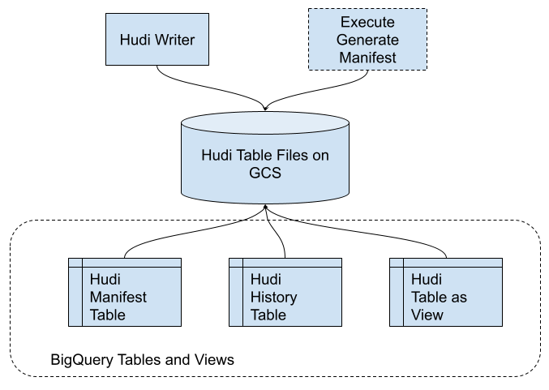

<!--
  Licensed to the Apache Software Foundation (ASF) under one or more
  contributor license agreements.  See the NOTICE file distributed with
  this work for additional information regarding copyright ownership.
  The ASF licenses this file to You under the Apache License, Version 2.0
  (the "License"); you may not use this file except in compliance with
  the License.  You may obtain a copy of the License at

       http://www.apache.org/licenses/LICENSE-2.0

  Unless required by applicable law or agreed to in writing, software
  distributed under the License is distributed on an "AS IS" BASIS,
  WITHOUT WARRANTIES OR CONDITIONS OF ANY KIND, either express or implied.
  See the License for the specific language governing permissions and
  limitations under the License.
-->
# Hudi BigQuery Integration

## Abstract

BigQuery is Google Cloud's fully managed, petabyte-scale, and cost-effective analytics data warehouse that lets you run
analytics over vast amounts of data in near real time. BigQuery
currently [doesn’t support](https://cloud.google.com/bigquery/external-data-cloud-storage) Apache Hudi, but it has
support for the Parquet and other formats. The proposal is to implement a BigQuerySync similar to HiveSync to sync the
Hudi table as the BigQuery External Parquet table, so that users can query the Hudi tables using BigQuery. Uber is
already syncing some of its Hudi tables to BigQuery data mart this will help them to write, sync and query.

## Background

Hudi table types define how data is indexed & laid out on the DFS and how the above primitives and timeline activities
are implemented on top of such organization (i.e how data is written). In turn, query types define how the underlying
data is exposed to the queries (i.e how data is read).

Hudi supports the following table types:

* [Copy On Write](https://hudi.apache.org/docs/table_types#copy-on-write-table): Stores data using exclusively columnar
  file formats (e.g parquet). Updates simply version & rewrite the files by performing a synchronous merge during write.
* [Merge On Read](https://hudi.apache.org/docs/table_types#merge-on-read-table): Stores data using a combination of
  columnar (e.g parquet) + row based (e.g avro) file formats. Updates are logged to delta files & later compacted to
  produce new versions of columnar files synchronously or asynchronously.

Hudi maintains multiple versions of the Parquet files and tracks the latest version using Hudi metadata (Cow), since
BigQuery doesn’t support Hudi yet, when you sync the Hudi’s parquet files to BigQuery and query it without Hudi’s
metadata layer, it will query all the versions of the parquet files which might cause duplicate rows.

To avoid the above scenario, this proposal is to implement a BigQuery sync tool which will use the Hudi metadata to know
which files are latest and filter only the latest version of parquet files to BigQuery external table so that users can
query the Hudi tables without any duplicate records.

## Implementation

This new feature will implement
the [AbstractSyncTool](https://github.com/apache/hudi/blob/master/hudi-sync/hudi-sync-common/src/main/java/org/apache/hudi/sync/common/AbstractSyncTool.java)
similar to
the [HiveSyncTool](https://github.com/apache/hudi/blob/master/hudi-sync/hudi-hive-sync/src/main/java/org/apache/hudi/hive/HiveSyncTool.java)
named BigQuerySyncTool with sync methods for CoW tables. The sync implementation will identify the latest parquet files
for each .commit file and keep these manifests synced with the BigQuery manifest table. Spark datasource & DeltaStreamer
can already take a list of such classes to keep these manifests synced.

###           



To avoid duplicate records on the Hudi CoW table, we need to generate the list of latest snapshot files and create a BQ
table for it, then use that table to filter the duplicate records from the history table.

### Steps to create Hudi table on BigQuery

1. Let's say you have a Hudi table data on google cloud storage (GCS).

 ```
CREATE TABLE dwh.bq_demo_partitioned_cow (
  id bigint, 
  name string,
  price double,
  ts bigint,
  dt string
) 
using hudi 
partitioned by (dt)
options (
  type = 'cow',
  primaryKey = 'id',
  preCombineField = 'ts',
  hoodie.datasource.write.drop.partition.columns = 'true'
)
location 'gs://hudi_datasets/bq_demo_partitioned_cow/';
```

BigQuery doesn't accept the partition column in the parquet schema, hence we need to drop the partition columns from the
schema by enabling this flag:

```
hoodie.datasource.write.drop.partition.columns = 'true'
```

2. As part of the BigQuerySync, the sync tool will generate/update the manifest files inside the .hoodie metadata files.
   For tables which already exist, you can generate a manifest file for the Hudi table which has the list of the latest
   snapshot parquet file names in a CSV format with only one column the file name. The location of the manifest file
   will be on the .hoodie metadata folder (`gs://bucket_name/table_name/.hoodie/manifest/latest_snapshot_files.csv`)

```
// this command is coming soon.
// the alternative for this command could be a JAVA API to generate the manifest.
GENERATE symlink_format_manifest FOR TABLE dwh.bq_demo_partitioned_cow;
```

3. Create a BQ table named `hudi_table_name_manifest` with only one column filename with this location gs:
   //bucket_name/table_name/.hoodie/manifest/latest_snapshot_files.csv.

```
CREATE EXTERNAL TABLE `my-first-project.dwh.bq_demo_partitioned_cow_manifest`
(
  filename STRING
)
OPTIONS(
  format="CSV",
  uris=["gs://hudi_datasets/bq_demo_partitioned_cow/.hoodie/manifest/latest_snapshot_files.csv"]
);
```

4. Create another BQ table named `hudi_table_name_history` with this location `gs://bucket_name/table_name`, don't use
   this table to query the data, this table will have duplicate records since it scans all the versions of parquet files
   in the table/partition folders.

```
CREATE EXTERNAL TABLE `my-first-project.dwh.bq_demo_partitioned_cow_history`
WITH 
  PARTITION COLUMNS 
  OPTIONS(
    ignore_unknown_values=true, 
    format="PARQUET", 
    hive_partition_uri_prefix="gs://hudi_datasets/bq_demo_partitioned_cow/",
    uris=["gs://hudi_snowflake/bq_demo_partitioned_cow/dt=*"]
  );
```

5. Create a BQ view with the same hudi table name with this query, this view you created has the data from the Hudi
   table without any duplicates, you can use that table to query the data.

```
CREATE VIEW `my-first-project.dwh.bq_demo_partitioned_cow` AS 
  SELECT
  *
  FROM
  `my-first-project.dwh.bq_demo_partitioned_cow_history`
  WHERE
  _hoodie_file_name IN (
    SELECT 
      filename 
    FROM
      `my-first-project.dwh.bq_demo_partitioned_cow_manifest`
  );
```

BigQuerySync tool will
use [HoodieTableMetaClient](https://github.com/apache/hudi/blob/master/hudi-common/src/main/java/org/apache/hudi/common/table/HoodieTableMetaClient.java)
methods to get the list of latest set of parquet data files to generate the manifest csv file, then will invoke
the [BigQuery Java Client](https://github.com/googleapis/java-bigquery/blob/main/samples/snippets/src/main/java/com/example/bigquery/CreateTableExternalHivePartitioned.java)
to create the manifest table, history table and hudi table views.

**All the steps described here will be automated, all you have to do is to supply a bunch of configs to enable the
BigQuery sync.**

## Rollout/Adoption Plan

There are no impacts to existing users since this is entirely a new feature to support a new use case hence there are no
migrations/behavior changes required.

After the BigQuery sync tool has been implemented, I will reach out to Uber's Hudi/BigQuery team to rollout this feature
for their BigQuery ingestion service.

## Test Plan

This RFC aims to implement a new SyncTool to sync the Hudi table to BigQuery, to test this feature, there will be some
test tables created and updated on to the BigQuery along with unit tests for the code. Since this is an entirely new
feature, I am confident that this will not cause any regressions during and after roll out.

## Future Plans

After this feature has been rolled out, the same model can be applied to sync the Hudi tables to other external data
warehouses like Snowflake.
