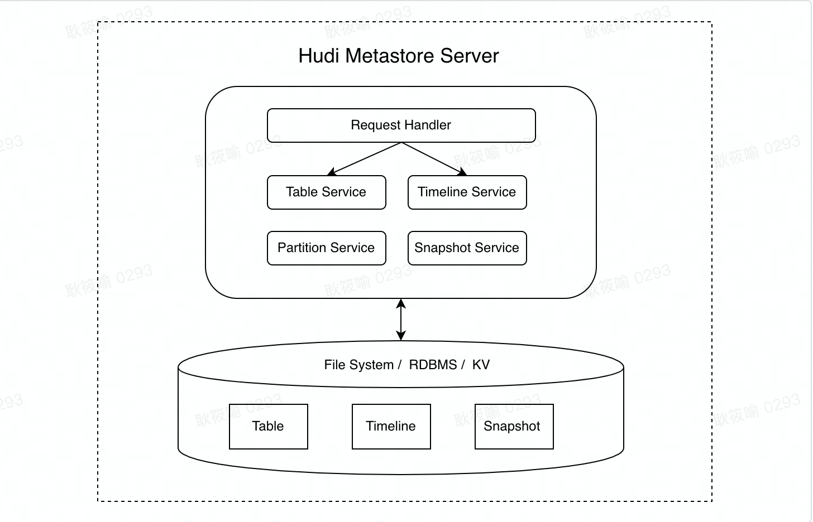
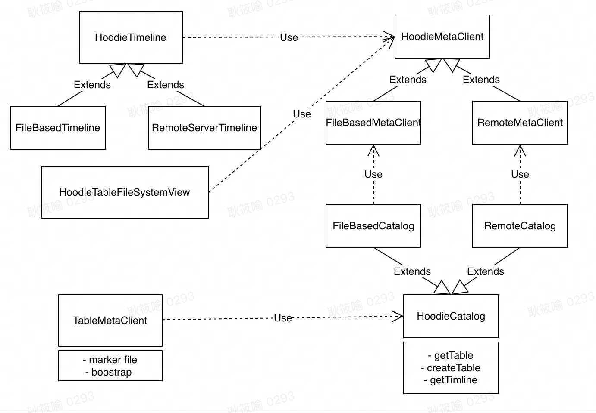
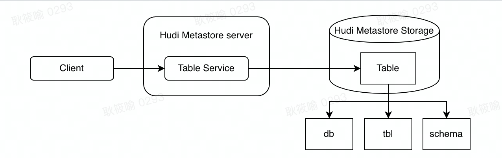
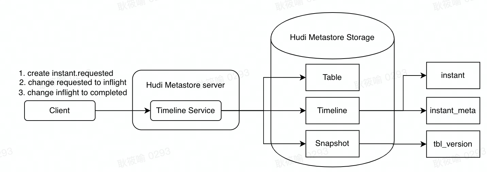
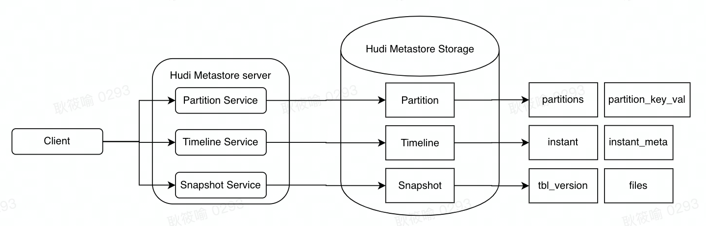

<!--
  Licensed to the Apache Software Foundation (ASF) under one or more
  contributor license agreements.  See the NOTICE file distributed with
  this work for additional information regarding copyright ownership.
  The ASF licenses this file to You under the Apache License, Version 2.0
  (the "License"); you may not use this file except in compliance with
  the License.  You may obtain a copy of the License at

       http://www.apache.org/licenses/LICENSE-2.0

  Unless required by applicable law or agreed to in writing, software
  distributed under the License is distributed on an "AS IS" BASIS,
  WITHOUT WARRANTIES OR CONDITIONS OF ANY KIND, either express or implied.
  See the License for the specific language governing permissions and
  limitations under the License.
-->
# RFC-36: Hudi Metastore Server

## Proposers

- @minihippo

## Approvers


## Status

JIRA: [HUDI-3345](https://issues.apache.org/jira/browse/HUDI-3345)

> Please keep the status updated in `rfc/README.md`.

# Hudi Metastore Server

## Abstract

Currently, Hudi is widely used as a table format in the data warehouse. There is a lack of central metastore server to manage the metadata of data lake table. Hive metastore as a commonly used catalog service in the data warehouse on Hadoop cannot store the unique metadata like timeline of the hudi table.

The proposal is to implement an unified metadata management system called hudi metastore server to store the metadata of the hudi table, and be compatible with hive metastore so that other engines can access it without any changes.

## Backgroud

**How Hudi metadata is stored**

The metadata of hudi are table location, configuration and schema, timeline generated by instants, metadata of each commit / instant, which records files created / updated, new records num and so on in this commit. Besides, the information of files in a hudi table is also a part of hudi metadata.

Different from instant or schema recorded by a separate file that is stored under `${tablelocation}/.hoodie` on the HDFS or object storage, files info are managed by the HDFS directly. Hudi gets all files of a table by file listing. File listing is a costly operation and its performance is limited by namenode. In addition, there will be a few invalid files on the file system, which are created by spark speculative tasks(for example) and are not deleted successfully. Getting files by listing will result in inconsistency, so hudi has to store the valid files from each commit metadata, the metadata about files is usually referred to snapshot.

RFC-15 metadata table is a proposal that can solve these problems. However, it only manages the metadata of one table. There is a lack of a unified view.

**The integration of Hive metastore and Hudi metadata lacks a single source of truth.**

Hive metastore server is widely used as a metadata center in the data warehouse on Hadoop. It stores the metadata for hive tables like their schema, location and partitions. Currently, almost all of the storage or computing engines support registering table information to it, discovering and retrieving metadata from it. Meanwhile, cloud service providers like AWS Glue, HUAWEI Cloud, Google Cloud Dataproc, Alibaba Cloud, ByteDance Volcano Engine all provide Apache Hive metastore compatible catalog. It seems that hive metastore has become a standard in the data warehouse.

Different from the traditional table format like hive table, the data lake table not only has schema, partitions and other hive metadata, but also has timeline, snapshot which is unconventional. Hence, the metadata of data lake cannot be managed by HMS directly.

Hudi just syncs the schema and partitions to HMS by now, and other metadata still stores on HDFS or object store. Metadata synchronization between different metadata management systems will result in inconsistency.

## Overview



The hudi metastore server is for metadata management of the data lake table, to support metadata persistency, efficient metadata access and other extensions for data lake. The metadata server managed includes the information of databases and tables, partitions, schemas, instants, instants' meta and files' meta.

The metastore server has two main components: service and storage. The storage is for metadata persistency and the service is to receive the get / put requests from client and return / store the processing result after doing some logical operations on metadata.

The hudi metastore server is / has

- **A metastore server for data lake**
    -  Different from the traditional table format, the metadata of the data lake has timeline and snapshot concepts, in addition to schema and partitions.

    -  The metastore server is an unified metadata management system for data lake table.

- **Pluggable storage**
    -  The storage is only responsible for metadata presistency. Therefore, it's doesn't matter what the storage engine is used to store the data, it can be a RDBMS, kv system or file system.

- **Easy to be expanded**
    -  The service is stateless, so it can be scaled horizontally to support higher QPS. The storage can be split vertically to store more data.

- **Compatible with multiple computing engines**
    -  The server has an adapter to be compatible with hive metastore server.

## Design

This part has four sections: what the service does, what and how the metadata stores, how the service interacts with the storage when reading and writing a hudi table with an example, and the extension of the metastore server which will be implemented in the next version.

### Service

Service is to receive requests from clients and return results according to the metadata in the storage combined with some processing logic. According to the functional division, the service consists of four parts:

- **table service**
    -  is for table related requests. To client, it exposes API about database and table CRUD.

- **partition service**
    -  is for partition related requests. To client, it exposes API about CRUD:

    - support multiple ways of reading, like checking the partition's existence, getting partition info, getting partitions which satisfy a specific condition(partition pruning).
    - creating or updating API cannot be invoked directly,  only a new commit completion can trigger it.
    -  dropping a partition not only deletes the partition and files at metadata level, but also triggers a clean action to do the physical clean that deletes the data on the file system.

- **timeline service**
    -  is for timeline related requests. The basic functions are the same as the `HoodieActiveTimeline`.

    -  To client, it exposes API that

    - the instant CRUD
    - get the metadata of an instant

- **snapshot service**
    -  is for file level related request. The old way is that a write client gets all files under the path by file listing, and then builds the file system view by organizing the files as file slices in file groups. After that, get the latest file slice in each file group to read and write. Snapshot service just gives the client the result of the last step.

    -  To client, it exposes API that

    - get the latest snapshot of a partition without multiple file version
    - get the incremental files after a specified timestamp, for incremental reading
    - get all files of a partition,for file cleaning
    - update the snapshot when a new commit completes, it cannot be invoked by client directly.

The specific interface is defined in the `Alpha Version` part.

### Storage

According to the type of the metadata stored, the storage is divided into four parts: table, partition, timeline, snapshot. Table consists of location, schema, table configurations and so on. Partition is just partition metadata. Timeline contains instant and the metadata of each instant. Snapshot has file statuses.

#### Lectotype

**Requirements:** support single row ACID transactions. Almost all write operations require it, like instant creation, state changing and so on.

There are the candidates,

**Hudi table**

pros:

- No external components are introduced and maintained.

crons:

- It is unreasonable that the storage of the hudi metastore server is a hudi table. How does the metadata of the server storage store? There is a paradox.

**RDBMS**

pros:

- database that is suitable for structured data like metadata to store.

- can describe the relation between many kinds of metadata.

crons:

- introduce another system to maintain.

**File system**

pros:

- No external components are introduced and maintained.

crons:

- not suitable for the situation that requires high performance.

- have to do extra work to support the metadata organization.

**Key-value storage**

pros:

- database that is suitable for structured data like metadata to store.

- in-memory data store so that read and write faster.

crons:

- introduce another system to maintain.

- stroage capacity is a limitation.

There are specific requirements of the metastore server in the different scenarios. Through the storage of server is pluggable, considering the general situation of disk storage, good performance of read and write, convenience of development, RDBMS may be a better one to be chosen.


### Hudi Catalog

Currently, Hudi only implements the catalog adapter that Spark/Flink defined, and lacks a self-defined catalog specification. To support file system based metadata storage and remote server based, catalog abstraction is as the following.



`HoodieCatalog` is public way for external components to access table metadata.

There are three entity manages table metadata, `TableMetaClient` covers table properties, `Timeline` and `FileSystemView` covers snapshot.

For a clearer division of responsibilities, `TableMetaClient` is to do the metadata management of a table and `HoodieCatalog` is an overall one. Metadata `TableMetaClient` managed can be split into two parts, one is metadata info like `basePath, table properties and etc.`, and the other is used to writing job like `marker file and etc`. Part one belongs to metadata and should be covered by catalog.

### Server Extension

#### 1. Partition pruning

To an SQL engine, the optimizer does partition pruning to skip reading data from unneeded partitions. Accorrding to the WHERE clauses in sql, unneeded partitions can be eliminated. The following is how the hudi metastore server does this.

Read a hudi table by sql like

```SQL
select count(*) from test_db.test_table where date='20220101' and hour = '00' and ts = '0'
```

and we can get the filter `where date='20220101' and hour = '00' and ts = '0'` from the sql engine when optimizing the sql.

After the partition service receiving the `filter sql`

1. build an expression tree, analyze the sql and get the partition column related conditions

```SQL
where date='20220101' and hour = '00'
```

2. generate a new sql filter

```SQL
where part_key_name='date' and part_key_val='20220101'
where part_key_name='hour' and part_key_val='00'
```

3. query the partition related table with the new sql filter to get the eligible partitions

#### 2.Hive Metastore Adapter

The adapter in hudi metatore will implement some commonly used API in hive metastore server to do the compatibility so that there are no changes for other engines to read the hudi table.

#### 3.Lock Provider & Cocurrency Management

[TBD]

#### 4. Schema Evolution

[TBD]

#### 5. Cache

Cache the frequently accessed data like table, timeline related information. For larger metadata, cache them with LRU strategy.

The main points are:

- what to cahe

- how to cache

- when to update cache data to keep consistency with the data in the storage.

[TBD]

#### 6. Authorization Management

[TBD]


## Implementation

#### Storage Schema

##### Table

- **db**

    -  unique key: name

    - | name         | type   | comment               |
                | ------------ | ------ | --------------------- |
      | db_id        | bigint | auto_increment        |
      | desc         | string | database description  |
      | location_uri | string | database storage path |
      | name         | string | database name         |
      | owner_name   | string | database owner        |
      | owner_type   | string | database owner type   |

- **db_params**

    -  unique key: param_key, db_id

    - | name        | type   | comment                  |
                | ----------- | ------ | ------------------------ |
      | db_id       | bigint | auto_increment           |
      | param_key   | string | database parameter key   |
      | param_value | string | database parameter value |

- **tbl**

    -  unique key:  name, db_id

    - | name        | type      | comment                       |
                | ----------- | --------- | ----------------------------- |
      | tbl_id      | bigint    | auto_increment                |
      | db_id       | bigint    | database the table belongs to |
      | name        | string    | table name                    |
      | create_time | timestamp | table created time            |
      | owner       | string    | the table owner               |
      | location    | string    | table location                |

- **tbl_params**

    -  is used to record table level statistics like file num, total size.

    -  unique key:  param_key, tbl_id

    - | name        | type   | comment               |
                | ----------- | ------ | --------------------- |
      | tbl_id      | bigint | auto_increment        |
      | param_key   | string | table parameter key   |
      | param_value | string | table parameter value |

- **schema**

    -  unique key: name, type, version, tbl_id

    - | name             | type    | comment                                  |
                | ---------------- | ------- | ---------------------------------------- |
      | col_id           | bigint  | auto_increment                           |
      | tbl_id           | bigint  | table identifier                         |
      | version          | bigint  | a completed commit identifier            |
      | name             | string  | partition parameter key                  |
      | type             | string  | partition parameter value                |
      | is_partition_col | tinyint | whether the column is a partition column |
      | comment          | string  | column description                       |

##### Partition

- **partitions**

    -  unique key: part_name, tbl_id

    - | name        | type      | comment                          |
                | ----------- | --------- | -------------------------------- |
      | part_id     | bigint    | auto_increment                   |
      | tbl_id      | bigint    | table the partition belongs to   |
      | part_name   | string    | partition name                   |
      | create_time | timestamp | partition created time           |
      | update_time | timestamp | partition updated time           |
      | is_deleted  | tinyint   | whether the partition is deleted |

- **partition****_parmas**

    -  unique key: param_key, part_id

    - | name        | type   | comment                        |
                | ----------- | ------ | ------------------------------ |
      | part_id     | bigint | partition identifier           |
      | tbl_id      | bigint | table the partition belongs to |
      | param_key   | string | partition parameter key        |
      | param_value | string | partition parameter value      |

- **partition****_key_val**

    -  is used to support partition pruning.

    -  unique key: part_key_name, part_id

    - | name          | type   | comment                        |
                | ------------- | ------ | ------------------------------ |
      | part_id       | bigint | partition  identifier          |
      | tbl_id        | bigint | table the partition belongs to |
      | part_key_name | string | the partition name             |
      | part_key_val  | string | the partition value            |

##### Timeline

- **tbl_timestamp**

    -  is used to get a self-increasing timestamp for each table

    -  unique key: part_key_name, part_id

    - | name   | type   | comment               |
                | ------ | ------ | --------------------- |
      | tbl_id | bigint | table identifier      |
      | ts     | string | timestamp for instant |

- **instant**

    -  unique key: ts, action, tbl_id

    - | name       | type      | comment                                      |
                | ---------- | --------- | -------------------------------------------- |
      | instant_id | bigint    | auto_increment                               |
      | tbl_id     | bigint    | table identifier                             |
      | ts         | string    | instant timestamp                            |
      | action     | tinyint   | instant action, commit, deltacommit and etc. |
      | state      | tinyint   | instant state, requested, inflight and etc.  |
      | duration   | int       | for heartbeat                                |
      | start_ts   | timestamp | for heartbeat                                |

- **instant_meta**

    -  unique key: ts, action, state, tbl_id

    - | name      | type    | comment           |
                | --------- | ------- | ----------------- |
      | commit_id | bigint  | auto_increment    |
      | tbl_id    | bigint  | table identifier  |
      | ts        | string  | instant timestamp |
      | action    | tinyint | instant action    |
      | state     | tinyint | instant state     |
      | data      | binary  | instant meta data |

    -  (To be discussed: Do we have to store all information of metadata? Actually only partition, file name, file size... can be useful. Is there any more efficient way to store this data instead of using bytes)

##### Snapshot

- **tbl_version**

    -  unique key: ts, action, state, tbl_id

    - | name            | type      | comment                                               |
                | --------------- | --------- | ----------------------------------------------------- |
      | tbl_id          | bigint    | table identifier                                      |
      | version         | bigint    | auto_increment                                        |
      | instant_id      | bigint    | instant identifier                                    |
      | snapshot_status | tinyint   | whether the version of snapshot has been synchronized |
      | create_time     | timestamp | instant completion time                               |
      | update_time     | timestamp | snapshot synchronization completion time              |

- **files**

    -  unique key: name, part_id

    - | name        | type      | comment                           |
                | ----------- | --------- | --------------------------------- |
      | id          | bigint    | auto_increment                    |
      | tbl_id      | bigint    | table identifier                  |
      | part_id     | bigint    | partition identifier              |
      | version     | bigint    | a completed commit identifier     |
      | name        | string    | file name                         |
      | size        | bigint    | file size                         |
      | is_deleted  | boolean   | whether the file has been deleted |
      | create_time | timestamp | file created time                 |
      | update_time | timestamp | file updated time                 |

### Service Integration

Insert into a MOR table, 'test_db.test_table' with schema

```JSON
{
  "type": "records",
  "name": "schema",
  "fields": [
    {
      "name": "record_key" # record key field
      "type": "string"
    },
    {
      "name": "ts" # precombine field
      "type": "bigint"
    },
    {
      "name": "date" # first level partition field
      "type": "string"
    },
    {
      "name": "hour" # second level partition field
      "type": "string"
    }
  ]
}
```

#### Basic Process

##### 1. create a db and table



Recods in the storage are:

- db

| db_id | desc      | location_uri      | name    | owner_name | owner_type |
| ----- | --------- | ----------------- | ------- | ---------- | ---------- |
| 0     | "example" | hdfs://test_db.db | test_db | tester     | user       |

- tb

| tbl_id | db_id | name       | create_time          | owner  | location                     |
| ------ | ----- | ---------- | -------------------- | ------ | ---------------------------- |
| 0      | 0     | test_table | 1970-01-01 00:00:00' | tester | hdfs://test_db.db/test_table |

- schema

| col_id | tbl_id | version | name       | type   | is_partition_col | comment                      |
| ------ | ------ | ------- | ---------- | ------ | ---------------- | ---------------------------- |
| 0      | 0      | 0       | record_key | string | 0                | record key field             |
| 1      | 0      | 0       | ts         | bigint | 0                | precombine field             |
| 2      | 0      | 0       | date       | string | 1                | first level partition field  |
| 3      | 0      | 0       | hour       | string | 1                | second level partition field |

##### 2. insert into table and create a delta commit



The changes in the timeline when insert into a hudi table are divided into three times:

1. create a new instant which is requested.

2. change the requested instant to inflight and record the work profile.

3. change the inflight instant to completed and record the commit meta data.

4. after the commit is completed, files changes (like file size,  a new file) recorded in metadata are stored too. This part is described in the `Ansyc Snapshot Synchronization` part.

Recods in storage are:

- instant

| instant_id | tbl_id | ts             | action      | state                             | duration(s) | start_ts       |
| ---------- | ------ | -------------- | ----------- | --------------------------------- | ----------- | -------------- |
| 0          | 0      | 20220101000000 | deltacommit | requested -> inflight ->completed | 120         | 20220101000000 |

Step1 inserts a new instant record, step2 updates the instant state from requested to inflight, and step3 is to completed.

**Heartbeat:** When insert, write client has to send the heartbeat to the server, corresponding to the changes of `duration` and `start_ts`. Each heartbeat updates the two values.

- instant_meta

| commit_id | tbl_id | ts             | action      | state     | data                  |
| --------- | ------ | -------------- | ----------- | --------- | --------------------- |
| 0         | 0      | 20220101000000 | deltacommit | requested | (requested meta data) |
| 1         | 0      | 20220101000000 | deltacommit | inflight  | (work profil)         |
| 2         | 0      | 20220101000000 | deltacommit | completed | (commit meta data)    |

- tbl_version

| tbl_id | version | instant_id | snapshot_status | create_time           | update_time           |
| ------ | ------- | ---------- | --------------- | --------------------- | --------------------- |
| 0      | 1       | 0          | 0               | '2022-01-01 00:01:00' | '2022-01-01 00:01:00' |

Column `snapshot_status` changes to 1 when sync snapshot successfully.

##### 3. Read the table with a specified partition



A hudi table reading process consists of three main parts, excluding the actual file reading:

1. partition pruning: decide that the partitions needed to be read. The following section describes the implementation.

2. build file system view: get file status from metastore instead of file listing with distributed file system, and server only return the latest snapshot without multiple version.

3. build timeline

#### Asnyc Snapshot Synchronization

Synapshot synchronization is to store file related info in metastore, to speed up the file system view building, instead of using file listing which may cost more.

When an instant is completed, commit metadata contains all files / partitions updated or created in this commit. Server processes commit metadata by asynchronous thread:

- for new partition, add a new record to `partition` table

- for existing partition, update the record in the table

- for new file, add a new record to `files` table

- for existing file, update its size in the table

- for deleted file in the clean metadata, delete the record logically by setting status to `is_deleted`

Finally, mark the completion of this commit synchronization by changing status in the table `tbl_version`.

- partition

| part_id | tbl_id | part_name             | create_time           | update_time           | is_deleted |
| ------- | ------ | --------------------- | --------------------- | --------------------- | ---------- |
| 0       | 0      | date=20220101/hour=00 | '2022-01-01 00:01:00' | '2022-01-01 00:01:00' | 0          |

- partition_key_val

| part_id | tbl_id | part_key_name | part_key_val |
| ------- | ------ | ------------- | ------------ |
| 0       | 0      | date          | 20220101     |
| 0       | 0      | hour          | 00           |

- files

| id   | tbl_id | part_id | version | name      | size    | is_deleted | create_time           | update_time           |
| ---- | ------ | ------- | ------- | --------- | ------- | ---------- | --------------------- | --------------------- |
| 0    | 0      | 0       | 1       | file1.log | 1-> 100 | 0          | '2022-01-01 00:00:00' | '2022-01-01 00:01:00' |
| 1    | 0      | 0       | 1       | file2.log | 1024    | 0          | '2022-01-01 00:01:00' | '2022-01-01 00:01:00' |

### Consistency

**Pre:** 'version' of a hudi table is auto-increasing and updated with CAS. Each version value corresponds to a completed action.

**About commit**

1. Write client completes a commit by sending instant's state changing message to server. Only when server responds to the success msg, can client consider it is a successfully write.

2. Server completes a commit by
    1. save instant metadata like `HoodieCommitMetadata`
    2. change the state to 'completed'
    3. increase the table version and put a <version, instant_id> pair to the `tbl_version` table in the storage

**About snapshot**

1. The 'snapshot_status' in table `tbl_version` marks whether the commit has completed the snapshot synchronization. When the touching files of the commit are stored to `files` table, 'snapshot_status' can be 1 referred to sync successfully.

2. Before reading / writing the hudi table, client will get partitions from server. The server will respond to client until all completed commits of the table finish their snapshot synchronization to keep consistency.

## Roadmap

### Alpha Version

1. use RDBMS as metastore storage
    1.  The reason for choosing rdb is explained in the 'Lectotype' part.

1. support all actions in hoodie

1. extension part is not in

#### Interface Definition

[TBD]

client / server interface

server / storage interface