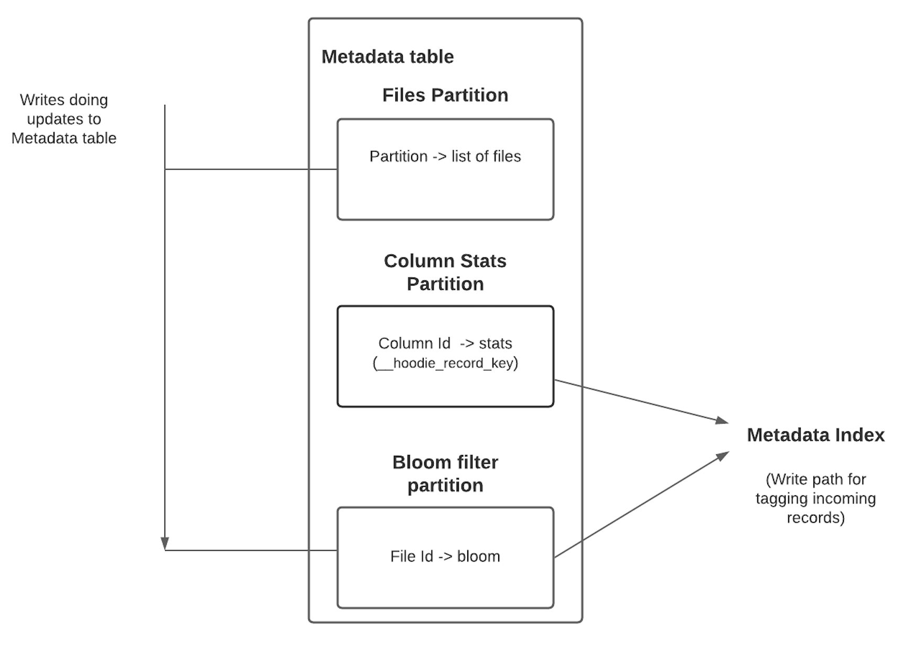
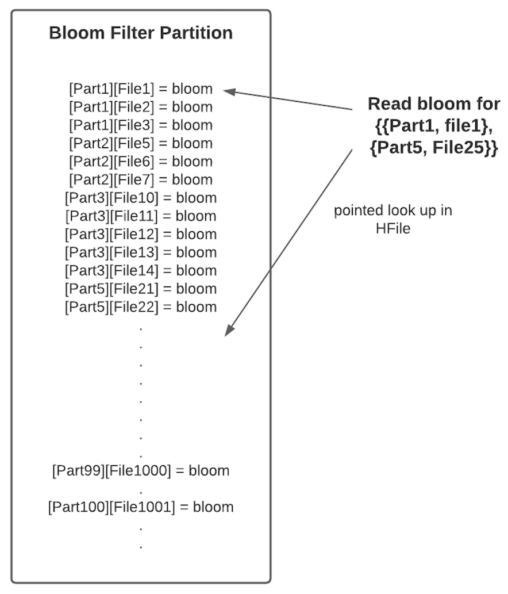
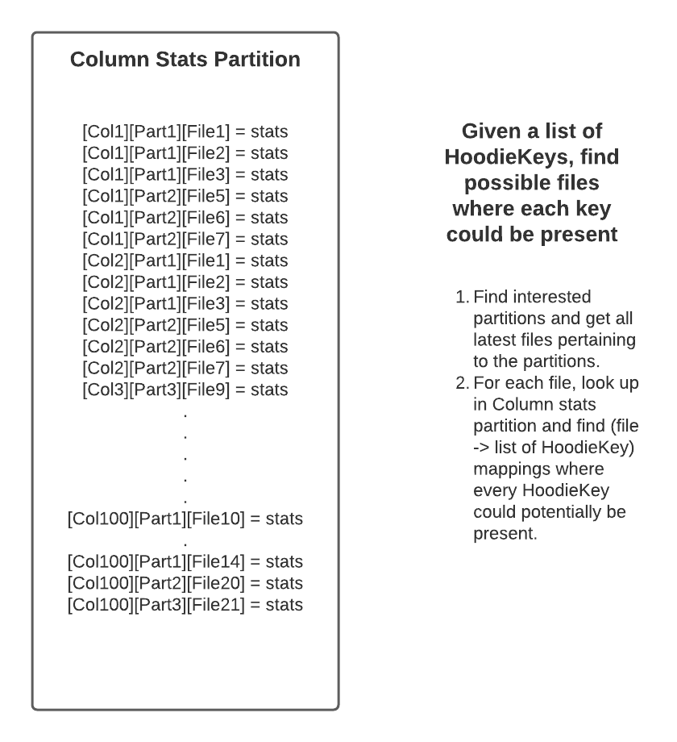

<!--
  Licensed to the Apache Software Foundation (ASF) under one or more
  contributor license agreements.  See the NOTICE file distributed with
  this work for additional information regarding copyright ownership.
  The ASF licenses this file to You under the Apache License, Version 2.0
  (the "License"); you may not use this file except in compliance with
  the License.  You may obtain a copy of the License at

       http://www.apache.org/licenses/LICENSE-2.0

  Unless required by applicable law or agreed to in writing, software
  distributed under the License is distributed on an "AS IS" BASIS,
  WITHOUT WARRANTIES OR CONDITIONS OF ANY KIND, either express or implied.
  See the License for the specific language governing permissions and
  limitations under the License.
-->
# RFC-37: Metadata based Bloom Index

## Proposers
- @nsivabalan
- @manojpec

## Approvers
 - @vinothchandar
 - @satishkotha

## Status
JIRA: https://issues.apache.org/jira/browse/HUDI-2703

## Abstract
Hudi maintains several indices to locate/map incoming records to file groups during writes. Most commonly used record
index is the HoodieBloomIndex. Larger tables and global index has performance issues as the bloom filter from a large
number of data files needed to be read and looked up. Reading from several files over the cloud object storage like S3
also faces request throttling issues. We are proposing to build a new Metadata index (metadata table based bloom index)
to boost the performance of existing bloom index.

## Background

HoodieBloomIndex is used to find the location of incoming records during every write. Bloom index assists Hudi in
deterministically routing records to a given file group and to distinguish inserts vs updates. This aggregate bloom
index is built from several bloom filters stored in the base file footers. Prior to bloom filter lookup, the file
pruning for the incoming records is also done based on the record key min/max stats stored in the base file footers. In
this RFC, we plan to build a new index for the bloom filters under the metadata table which to assist in bloom index
based record location tagging. This overlaps
with [RFC-27 Data skipping index ](https://cwiki.apache.org/confluence/display/HUDI/RFC-27+Data+skipping+index+to+improve+query+performance)
in the read path for improving the query performance.

## Design
HoodieBloomIndex involves the following steps to find the right location of incoming records

1. Find all the interested partitions and list all its data files.
2. File Pruning: Load record key min/max details from all the interested data file footers. Filter files and generate
   files to keys mapping for the incoming records based on the key ranges using range interval tree built from
   previously loaded min/max details.
3. Bloom Filter lookup: Filter files and prune files to keys mapping for the incoming keys mapping based on the bloom
   filter key lookup
4. Final Look up in actual data files to find the right location of every incoming record

As we could see from step 1 and 2, we are in need of min and max values for "_hoodie_record_key" and bloom filters
from all interested data files to perform the location tagging. In this design, we will add these key stats and
bloom filter to the metadata table and thereby able to quickly load the interested details and do faster lookups.

Metadata table already has one partition `files` to help in partition file listing. For the metadata table based
indices, we are proposing to add following two new partitions:
1. `bloom_filter` - for the file level bloom filter
2. `column_stats` - for the key range stats

Why metadata table:
Metadata table uses HBase HFile - the tree map file format to store and retrieve data. HFile is an indexed file format
and supports map like faster lookups by keys. Since, we will be storing stats/bloom for every file and the index will do
lookups based on files, we should be able to benefit from the faster lookups in HFile.



Following sections will talk about different partitions, key formats and then dive into the data and control flows.

### MetaIndex/BloomFilter:

A new partition `bloom_filter` will be added under the metadata table. Bloom filters from all the base files in the
data table will be added here. Metadata table is already in the HFile format. The existing metadata payload schema will
be extended and shared for this partition also. The type field will be used to detect the bloom filter payload record.
Here is the schema for the bloom filter payload record.
```
    {
        "doc": "Metadata Index of bloom filters for all data files in the user table",
        "name": "BloomFilterMetadata",
        "type": [
            "null",
            {
                "doc": "Data file bloom filter details",
                "name": "HoodieMetadataBloomFilter",
                "type": "record",
                "fields": [
                    {
                        "doc": "Bloom filter type code",
                        "name": "type",
                        "type": "string"
                    },
                    {
                        "doc": "Instant timestamp when this metadata was created/updated",
                        "name": "timestamp",
                        "type": "string"
                    },
                    {
                        "doc": "Bloom filter binary byte array",
                        "name": "bloomFilter",
                        "type": "bytes"
                    },
                    {
                        "doc": "Bloom filter entry valid/deleted flag",
                        "name": "isDeleted",
                        "type": "boolean"
                    }
                ]
            }
        ]
    }
```

The key for the bloom filter record would be an encoded string representing the partition and base file combo. The
partition and the file names are converted to deterministic hash based IDs, and then they are base64 encoded. Hash based
IDs are easy to generate for the incoming new inserts records and for the lookup for the updated records. It doesn't
need any dictionary to be added for the reverse lookups. Hash bits are chosen based on the cardinality and the collision
probability desired for the support max scale deployment. Base64 encoding the hash IDs further reduces the on-disk
storage space for these keys.

```
key = base64_encode(concat(hash64(partition name), hash128(file name)))
```



### MetaIndex/ColumnStats:

Another new partition `column_stats` will also be added under the metadata table to make the record key lookup code path
much more performant. This metadata index also helps in the data skipping (please look at RFC-27 for more details). In
the context of faster record key lookups for the update use cases, proposing `column_stats` index to be used for
file pruning when generating the file to candidate keys mapping for the update records.The existing metadata payload
schema will be extended and shared for this partition also. The type field will be used to detect the column stats
payload record. Here is the schema for the column stats payload record.

```
    {
        "doc": "Metadata Index of column statistics for all data files in the user table",
        "name": "ColumnStatsMetadata",
        "type": [
            "null",
            {
                "doc": "Data file column statistics",
                "name": "HoodieColumnStats",
                "type": "record",
                "fields": [
                    {
                        "doc": "File name for which this column statistics applies",
                        "name": "fileName",
                        "type": [
                            "null",
                            "string"
                        ]
                    },
                    {
                        "doc": "Minimum value in the range. Based on user data table schema, we can convert this to appropriate type",
                        "name": "minValue",
                        "type": [
                            "null",
                            "string"
                        ]
                    },
                    {
                        "doc": "Maximum value in the range. Based on user data table schema, we can convert it to appropriate type",
                        "name": "maxValue",
                        "type": [
                            "null",
                            "string"
                        ]
                    },
                    {
                        "doc": "Total count of values",
                        "name": "valueCount",
                        "type": [
                            "null",
                            "long"
                        ]
                    },
                    {
                        "doc": "Total count of null values",
                        "name": "nullCount",
                        "type": [
                            "null",
                            "long"
                        ]
                    },
                    {
                        "doc": "Total storage size on disk",
                        "name": "totalSize",
                        "type": [
                            "null",
                            "long"
                        ]
                    },
                    {
                        "doc": "Total uncompressed storage size on disk",
                        "name": "totalUncompressedSize",
                        "type": [
                            "null",
                            "long"
                        ]
                    },
                    {
                        "doc": "Column range entry valid/deleted flag",
                        "name": "isDeleted",
                        "type": "boolean"
                    }
                ]
            }
        ]
    }
```

Column stats records hold key ranges (min and max) for the file. The key for the column stat record would be an
encoded string representing the tuple set of column name, partition name and the base file. The string names of
these fields are converted to deterministic hash based IDs, and then they are base64 encoded, just like the
bloom filter key.

```
key = base64_encode(concat(hash64(column name), hash64(partition name), hash128(file name)))
```

While Hash based IDs have quite a few desirable properties in the context of Hudi index lookups, there is an impact
on the column level schema changes though. Refer to [Schema Evolution](#Schema-Evolution) section for more details.

Below picture gives a pictorial representation of Column stats partition in metadata table.


### Metadata Index lookup:

For the incoming upsert records, given their keys, tag their current location. The new algorithm for the
index lookup would be

1. Generate the list of partitions and the list of keys under each partition to be looked up
2. For all the involved partitions, load all its file list
3. Level 1: Range pruning using `column_stats` index:
   1. For each of the record key, generate the column stats index lookup key based on the tuple
      (__hoodie_record_key, partition name, file path)
   2. Meta index lookup with the above key and if available get the value payload with the column stats details
   3. Prune the partition and its candidate files based on the range comparisons
4. Level 2: Record pruning using `bloom_filter`  index:
   1. From the shortlisted file candidates per partition, generate bloom filter index lookup key based on the tuple
      (partition name, file path)
   2. Meta index lookup with the above key to load the base file bloom filter
   3. Bloom filter lookup for the record key to generate the candidate keys that are probably available in the base file
5. Level 3: Record validation
   1. Given the list of files and their candidate keys from above pruning, do the actual file lookup to confirm the keys
   2. Return the location (file id) of the final matching keys

### Schema Evolution:

HashID based key are deterministically generated from the tuple input. That is, for the tuple consisting of column name,
partition name and file name, the key generated would always be the same. So, a table where the schema gets changed over
time would have an impact on the keys already generated. The most common schema evolution use cases like change of
column type, adding a new column are not affected though. Other relatively uncommon use cases like column name rename,
dropping a column and adding a column with dropped name would have indices referring them more than needed. This would
lead to the index lookup matching stale/new records across evolved schemas.

To avoid looking up stale/new index records, here are the design options we have:
1. (Preferred) Query rewrite / Result recordset pruning
   1. Schema evolution layer should introduce query rewrite stage to detect evolved schemas for the input query and
      optionally include additional predicates to the query
   2. The resultant recordset can also be pruned based on the commit time and the schema change time
3. Making input tuple set schema aware 
   1. Along with column name, partition name and file path, a version/tag can also be added to make the key
      generated very schema specific. But, this choice has a performance impact as the lookup now has to be more of a
      prefix based instead of pointed lookups. That is, index lookup have to return records for all the versions/tags
      and pruning on top of this have to be done.

## Implementation 

1. No change to the HoodieIndex public interface. 
```
  /**
   * Looks up the index and tags each incoming record with a location of a file that contains
   * the row (if it is actually present).
   */
  @PublicAPIMethod(maturity = ApiMaturityLevel.EVOLVING)
  public abstract HoodieData<HoodieRecord<T>> tagLocation(
      HoodieData<HoodieRecord<T>> records, HoodieEngineContext context,
      HoodieTable hoodieTable) throws HoodieIndexException;
```
2. HoodieBloomIndex::explodeRecordsWithFileComparisons() will be extended to check for a new config `hoodie.metadata.file_pruning.enable`
   and if enabled, metadata table based column stat will be used for file pruning based on key ranges.
3. 


### Writer flow: 
Let's walk through the writer flow to update these partitions.

Whenever a new commit is getting applied to metadata table, we do the following.<br>
1. Files partition - prepare records for adding
2. Column_stats partition - prepare records for adding
[ColumnIndexID][PartitionIndexID][FileIndexID] => ColumnStats
This involves reading the base file footers to fetch min max values for each column
3. Bloom_filter partition - prepare records for adding
[PartitionIndexID][FileIndexID] => BloomFilter
This involves reading the base file footers.
We can amortize the cost across (2) and (3) and just read it once and prepare/populate records for both partitions.  
4. Commit all these records to metadata table.

We need to ensure we have all sufficient info in WriteStatus get sent to metadata writer for every commit. 

### Reader flow:
When a new batch of write is ingested into Hudi, we need to tag the records with their 
original file group location. And this index will leverage both the partitions to deduce the
record key => file name mappings. Refer to Metadata Index lookup section for more details.

## Rollout/Adoption Plan 
* Release 0.10.0 is a FlagDay release. Mean, the old metadata table will be wiped out and a new one will be built.
* Metadata Index feature is planning for 0.10.x version. Any preparatory changes/features (
  like `Metadata new indexing for existing tables`, RFC proposal and doc pending) that are needed to have this feature
  in the later minor release need to be rolled out as part of 0.10.0
* TODO: More details on the rollout plan

## Test Plan
* Functionality
  * Tag location for existing keys
  * Tag location for non-existing keys
* Performance
  * Prove Metadata based indices are helping upsert use cases
* Upgrade
* TODO: More details on the test plan
