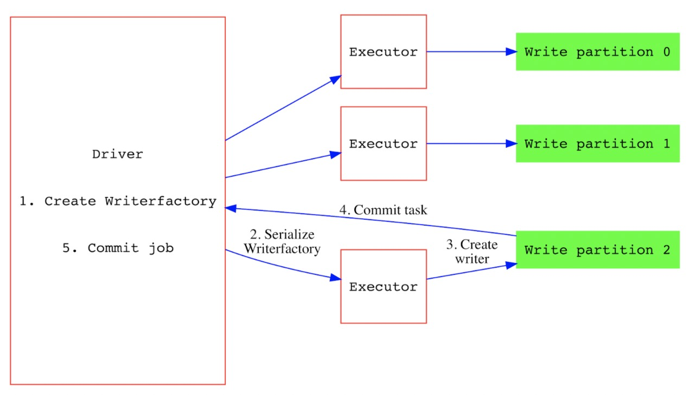
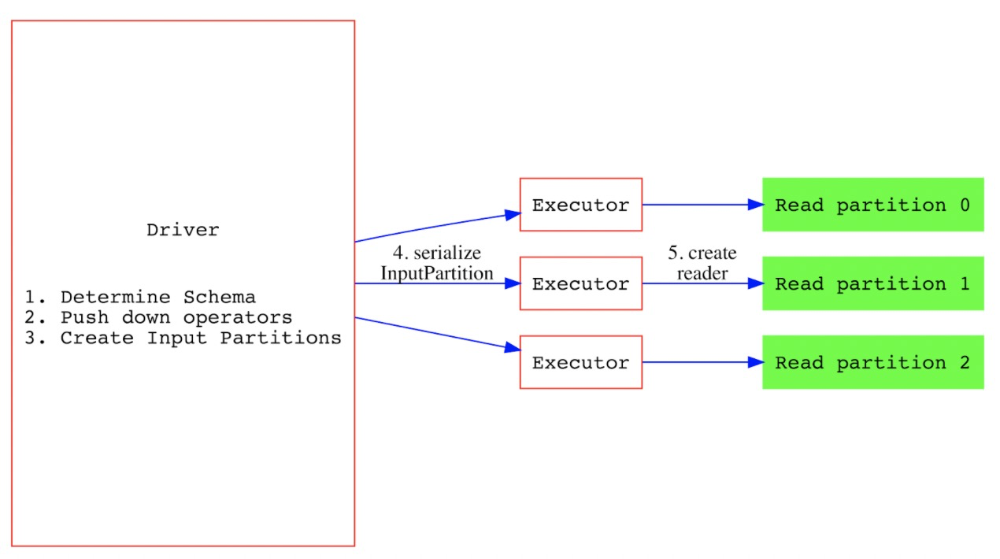

<!--
  Licensed to the Apache Software Foundation (ASF) under one or more
  contributor license agreements.  See the NOTICE file distributed with
  this work for additional information regarding copyright ownership.
  The ASF licenses this file to You under the Apache License, Version 2.0
  (the "License"); you may not use this file except in compliance with
  the License.  You may obtain a copy of the License at
       http://www.apache.org/licenses/LICENSE-2.0
  Unless required by applicable law or agreed to in writing, software
  distributed under the License is distributed on an "AS IS" BASIS,
  WITHOUT WARRANTIES OR CONDITIONS OF ANY KIND, either express or implied.
  See the License for the specific language governing permissions and
  limitations under the License.
-->

# RFC-38: Spark Datasource V2 Integration

## Proposers

- @leesf

## Approvers
- @vinothchandar
- @xishiyan
- @YannByron

## Status

JIRA: https://issues.apache.org/jira/browse/HUDI-1297

## Abstract

Today, Hudi still uses V1 api and relies heavily on RDD api to index, repartition and so on given the flexibility of RDD api, 
it works fine in v1 api, using datasource V1 api, Hudi provides complete read/write, update, 
and small file auto handling capabilities, all things work well. 
However, with the continuous development and evolving of datasource V2 api, 
the datasource v2 api has stabilized.Taking into account the datasource v1 api is too old and the spark community 
no longer spends more resources to maintain v1 api, so consider migrating to DataSource V2 api, 
and use more pushdown filters provided by V2 api and 
integrate with [RFC-27](https://cwiki.apache.org/confluence/display/HUDI/RFC-27+Data+skipping+index+to+improve+query+performance) 
to provide more powerful query capabilities. Also we could leverage it after V2 api get evolved or optimized again.


## Background

The current Hudi read and write paths use DataSource V1 api, and the implementation class is `DefaultSource`

```scala
/**
* Hoodie Spark Datasource, for reading and writing hoodie tables
*
*/
class DefaultSource extends RelationProvider
with SchemaRelationProvider
with CreatableRelationProvider
with DataSourceRegister
with StreamSinkProvider
with StreamSourceProvider
with Serializable {
...
}
```

As for writing(batch write), the following method will be called.
```scala
override def createRelation(sqlContext: SQLContext,
mode: SaveMode,
optParams: Map[String, String],
df: DataFrame): BaseRelation = {
val parameters = HoodieWriterUtils.parametersWithWriteDefaults(optParams)
val translatedOptions = DataSourceWriteOptions.translateSqlOptions(parameters)
val dfWithoutMetaCols = df.drop(HoodieRecord.HOODIE_META_COLUMNS.asScala:_*)

    if (translatedOptions(OPERATION.key).equals(BOOTSTRAP_OPERATION_OPT_VAL)) {
      HoodieSparkSqlWriter.bootstrap(sqlContext, mode, translatedOptions, dfWithoutMetaCols)
    } else {
      HoodieSparkSqlWriter.write(sqlContext, mode, translatedOptions, dfWithoutMetaCols)
    }
    new HoodieEmptyRelation(sqlContext, dfWithoutMetaCols.schema)
}
```

Regarding querying, the following method will return a `BaseRelation`（if not provide schema）

```scala
override def createRelation(sqlContext: SQLContext,
parameters: Map[String, String]): BaseRelation = {
createRelation(sqlContext, parameters, null)
}
```

For streaming writing and reading, DefaultSource#createSink and DefaultSource#createSink are called respectively.
In 0.9.0 version , the bulk_insert row mode was introduced to speed up bulk_insert, which implements the `SupportsWrite` v2 api and uses `HoodieDataSourceInternalTable` for writing, 
right now only bulk_insert operation is supported.

## Implementation

Spark provides a complete V2 api, such as `CatalogPlugin`, `SupportsWrite`, `SupportsRead`, and various pushdown filters,  
such as `SupportsPushDownFilters`, `SupportsPushDownAggregates`, `SupportsPushDownRequiredColumns`

We would Define the key abstraction of call `HoodieDatasourceTable`, which inherits the `Table`, `SupportsWrite`, `SupportsRead` 
interfaces to provide writing and reading capabilities.

### Writing Path

Hudi relies heavily on some RDD APIs on the write path, such as the indexing to determine where the record is update or insert, 
this refactoring work is relatively large under datasource v2 api, so we can firstly falllback to write to v1 
since Spark provides the V1WriteBuilder interface to bridge the V1 and V2 api, we could implement this in the first stage 
and perform further reconstruction after there is a better way to deal with indexing and repartitoining with RDD api later. 
The workflow of writing process of the Datasource V2 can refer to the following figure, 
where the `DataWriterFactory` is in the Driver and the `DataWriter` that performs writing in the Executor.



The writing path code sample is below

```scala
class HoodieDatasourceTable extends Table with SupportsWrite {

override def name(): String = {
//
}

override def schema(): StructType = {
// get hudi table schema
}

override def partitioning(): Array[Transform] = {
// get partitioning of hudi table.
}

override def capabilities(): Set[TableCapability] = {
// Set(BATCH_WRITE, BATCH_READ,TRUNCATE,...)
}

override def newWriteBuilder(info: LogicalWriteInfo): WriteBuilder = {
// V1WriteBuilder
}

override def newScanBuilder(CaseInsensitiveStringMap options): ScanBuilder = {
// HoodieScanBuilder
}

}
```

### Querying path

For querying, we define `HoodieBatchScanBuilder` to provide querying capability. 
The workflow of querying process is shown in below figure.  
`PartitionReaderFactory` located in the Driver and the `PartitionReader` located in the Executor.



The querying path code sample is below

```scala
class HoodieBatchScanBuilder extends ScanBuilder with SupportsPushDownFilters with SupportsPushDownRequiredColumns {
override def build(): Scan = {
// HoodieScan
}

override def pushFilters(filters: Array[Filter]): Array[Filter] = {
// record the filters
}

override def pushedFilters(): Array[Filter] = {
// pushed filters
}

override def pruneColumns(requiredSchema: StructType): Unit = {
// record the pruned columns
}
}
```

### Table Meta Management

Implementing the `CatalogPlugin` interface to manage the metadata of the Hudi table and 
define the core abstraction called `HoodieCatalog`, 
and the code sample is below.

```scala
class HoodieCatalog extends DelegatingCatalogExtension
with StagingTableCatalog {
  override def loadTable(ident: Identifier): Table = {
    // HoodieDatasouceTable
  }

  override def createTable(ident: Identifier, 
                           schema: StructType, 
                           partitions: Array[Transform], 
                           properties: util.Map[String, String]): Table = {
      // create hudi table
  }
    
  override def dropTable(Identifier ident): Boolean = {
    // drop hudi table
  }
    
  override def alterTable(Identifier ident, TableChange... changes): Table = {
    // check schema compability
    // HoodieDatasouceTable
  }
    
  override def stageReplace(ident: Identifier, 
                            schema: StructType, 
                            partitions: Array[Transform], 
                            properties: util.Map[String, String]): StagedTable = {
    // StagedHoodieTable
  }
    
  override def stageCreateOrReplace(ident: Identifier, 
                                    schema: StructType, 
                                    partitions: Array[Transform], 
                                    properties: util.Map[String, String]): StagedTable = {
    // StagedHoodieTable
  }
} 
```

Users would set the spark session config spark.sql.catalog.spark_catalog to org.apache.hudi.catalog.HoodieCatalog to load the HoodieCatalogto manage hudi tables.

## Rollout/Adoption Plan

- What impact (if any) will there be on existing users?

there is no impact on existing users, but users would specify the new catalog to manager hudi tables or other tables.

- If we are changing behavior how will we phase out the older behavior?

we should keep compatibility of v1 version and make it transparent for users to migrate to v2 api.

## Test Plan

[ ] PoC for catalog plugin
[ ] PoC for writing path with UTs
[ ] Poc for querying path with UTs
[ ] E2E tests
[ ] Benchmark for v1 and v2 writing and querying