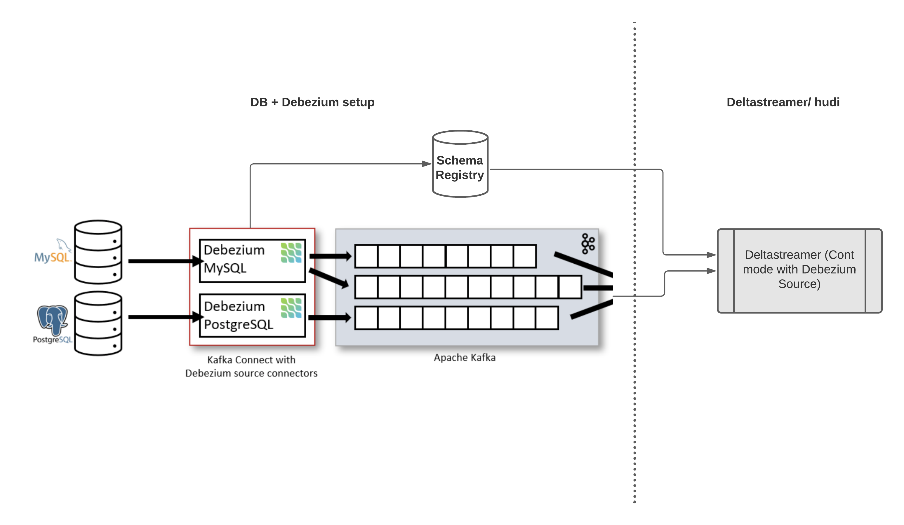

<!--
  Licensed to the Apache Software Foundation (ASF) under one or more
  contributor license agreements.  See the NOTICE file distributed with
  this work for additional information regarding copyright ownership.
  The ASF licenses this file to You under the Apache License, Version 2.0
  (the "License"); you may not use this file except in compliance with
  the License.  You may obtain a copy of the License at

       http://www.apache.org/licenses/LICENSE-2.0

  Unless required by applicable law or agreed to in writing, software
  distributed under the License is distributed on an "AS IS" BASIS,
  WITHOUT WARRANTIES OR CONDITIONS OF ANY KIND, either express or implied.
  See the License for the specific language governing permissions and
  limitations under the License.
-->
# RFC-[39]: Deltastreamer avro-based source for Debezium CDC

## Proposers
- @rmahindra
- @vbalaji

## Approvers
 - @vinoth

## Status

JIRA: [https://issues.apache.org/jira/browse/HUDI-1290](https://issues.apache.org/jira/browse/HUDI-1290)

## Abstract

We intend to implement a source for ingesting Debezium Change Data Capture (CDC) logs into Deltastreamer/ Hudi. With this capability, we can continuously capture row-level changes that insert, update and delete records that were committed to a database. While debezium support multiple databases, we will focus on postgres for the RFC. At the end, we will explain how it can be extended to support Mysql.

## Background
The architecture of Debezium is shown in figure below. [Debezium](https://debezium.io/documentation/reference/stable/connectors/postgresql.html) is implemented as a Kafka connect source, that reads change logs from databases ([logical decoding](https://www.postgresql.org/docs/current/logicaldecoding-explanation.html) in PostgreSQL and `binlog` in MySQL) and ingests them into a kafka topic. Debezium uses a single kafka topic per table in the source database.

The first time it connects to a PostgreSQL server or cluster, the connector takes a consistent snapshot of all schemas. After that snapshot is complete, the connector continuously captures row-level changes that insert, update, and deletes. The connector generates data change event records and streams them to Kafka topics. For each table, the default behavior is that the connector streams all generated events to a separate Kafka topic for that table. Applications and services consume data change event records from that topic. In addition, Debezium registers the schema of the change events in kafka to a schema registry, such as Confluent schema registry.

The schema of the events for debezium consists of a before, after, source, op and ts\_ms. The `before` field contains the values of the row before the operation took place. And `after` field contains the values of the original database row after the operation took place. The operation is specified in `op` field, which can be either `r` (initial snapshot), `c` (insert), `u` (update) or `d` (delete). In case of insert, the `before` field will be null which for a delete, the `after` field will be null. In the case of update, the `before` field will be the values of the columns in a row before the update was applied, and `after` will contain the values after the update was applied. The `source` field contains a list of key metadata fields. For instance, debezium version, database name, database schema name etc. In the case of PostgresSQL, an important field is `LSN` that represents the log sequence number of the change log, and determines the relative position of the change log.

There are other ways to deploy Debezium, such as Debezium Server, that can write events to other stream systems, such as pulsar, kenisis, google pub/sub etc. However, this RFC focuses on the debezium source in deltastreamer that will assume Kafka as the source for the change log events.

## Implementation

As shown in the figure above, in order to ingest the rows from the database into hudi and maintain the change operations done on database in hudi, we need to perform 2 steps: (I) We have to bootstrap the initial data from the database and (ii) incrementally consume the change logs to insert or update the records into hudi

To bootstrap the initial rows from the database, we can either do a full fetch directly from the database using JDBC, or alike and then incrementally pull the change logs from the appropriate checkpoint. The other option is to let the debezium connector perform an initial _consistent snapshot_ of the database up to a specific checkpoint. Subsequently, the debezium publishes change logs over the initial snapshot, that can be read incrementally by the deltastreamer.

To incrementally ingest the changelogs from the debezium connector, we propose to implement a few classes.`DebeziumAvroSource.java` implements the source class that reads the kafka change log events. We reuse `KafkaOffsetGen.java` that helps reading events from Kafka incrementally. The `DebeziumAvroSource.java` pulls the latest schema from the schema registry, applies the schema to a batch of incoming avro records of the change logs, and transforms the records to extract the actual fields of the rows in the database. In case of insert or update records (identified by the `op` field), the field values are picked from the `after` field in the incoming debezium record. In case of delete records (identified by the `op` field), the values are picked from the `before` field since `after` field is null. In addition, we also add the meta fields from both database and debezium. Meta fields such as `LSN` for Postgres DB help us identify the order of the events.

Since we change the schema of the incoming record in the source class, we have to provide a schema for the target record. We propose to implement DebeziumAvroSource.java as a RowSource and allow spark to infer the schema of the transformed record. An alternative approach is to implement a DebeziumSchemaRegistryProvider.java class that extends the current SchemaRegistryProvider.java, and implements the method getTargetSchema . It constructs the target schema from the original schema by including only the fields nested within the after field of the original record, along with the meta fields that were actually ingested.

To ensure proper de-dup, merging, and hard deletes of the records, we implement a custom AvroPayload class for debeizum: `DebeziumAvroPayload.java.` During writes, we check if the `op` field of the record is `d` , we return an empty payload to ensure the record is deleted in storage. In the case of `preCombine` or `combineAndGetUpdateValue` (merge handling of records), we return the existing stored record if the `LSN` (in case of PostgresSQL) of the existing record is higher than the newly inserted record. Else, the new record is written. In the case of MySQL DB, we will either use the `GTID` field or a combination of `bin file id` and `bin pos` to identify the relative ordering of the events when they actually happened in the database.

###Handling merges with Postgres Toast Columns

[TOAST](https://www.postgresql.org/docs/current/storage-toast.html) (The Oversized-Attribute Storage Technique) is a mechanism in Postgres which stores large column values in multiple physical rows, circumventing the page size limit of 8 KB.

Typically, TOAST storage is transparent to the user. There’s an exception, though: if a table row has changed, any _unchanged_ values that were stored using the TOAST mechanism are not included in the message that Debezium receives from the database, unless they are part of the table’s [replica identity](https://debezium.io/documentation/reference/0.10/connectors/postgresql.html#replica-identity). Consequently, such unchanged TOAST column value will not be contained in Debezium data change events sent to Kafka. Instead of the actual value, Debezium uses a placeholder `__debezium_unavailable_value` for representing toast columns that have not changed.

During merging, we check for toast columns in the insert records, and if present, we update their value using the values from the current record on disk.

### Deltastreamer configuration

To run the deltastreamer, we need to configure the following:

1.  The `source ordering field` should be set to `_source_lsn.`
2.  Configure the schema registry server that is used by the Debezium connector.
3.  Record Key(s) should be the primary key(s) of the database and can be obtained from the schema registry, since debezium uses the primary key(s) as the key for the kafka topic.
4.  Configure the deltastreamer to use the DebeziumSource and DebeziumAvroPayload classes for the source and payload classes respectively.

### Current Limitations

With the current constraints within Hudi, we discuss a few limitations of the current implementation for CDC. Consider a case where we have the following change log events for a single row/ record in the following order from kafka: Insert (LSN=1), Delete (LSN=3), Updated (LSN=2). If all these events are ingested in the same batch, then dedup will only pick the second event, since it has the highest LSN. However, if the second and third event are ingested in different batches, then the second event would have deleted the hudi record from the disk. When we receive the third event, we would insert it since the record has been previously deleted. This limitation holds for both CoW and MoR tables. To resolve this limitation, we have to keep the ordering value of each record even after deletion, to ensure we can apply an insert only if the insert event has a ordering value higher than the delete event. This limitation only happens in the case of an out of ordered delete event. Out-of-ordered insert and update events should be applied correctly.

## Rollout/Adoption Plan

This is a new feature specific to Debezium CDC use case, and should not impact existing jobs or tables.

## Test Plan

We plan to test the Debezium source by setting up a AWS RDS instance of PostgresSQL, debezium connector using strimzi operator on k8s and a AWS MSK kafka cluster. We will test for correctness by performing SQL based DDL operations, such as insert, update and deletions on multiple records/ rows in the Postgres DB, and query the hudi table to validate that the operations took effect on the records in the hudi table.