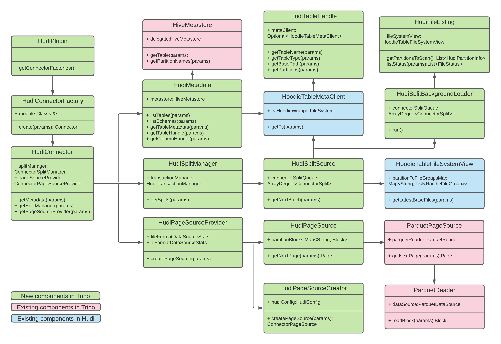

<!--
  Licensed to the Apache Software Foundation (ASF) under one or more
  contributor license agreements.  See the NOTICE file distributed with
  this work for additional information regarding copyright ownership.
  The ASF licenses this file to You under the Apache License, Version 2.0
  (the "License"); you may not use this file except in compliance with
  the License.  You may obtain a copy of the License at

       http://www.apache.org/licenses/LICENSE-2.0

  Unless required by applicable law or agreed to in writing, software
  distributed under the License is distributed on an "AS IS" BASIS,
  WITHOUT WARRANTIES OR CONDITIONS OF ANY KIND, either express or implied.
  See the License for the specific language governing permissions and
  limitations under the License.
-->

# RFC-40: Hudi Connector for Trino

## Proposers

- @codope
- @yihua

## Approvers

- @bvaradar
- @vinothchandar

## Status

JIRA: https://issues.apache.org/jira/browse/HUDI-2687

> Please keep the status updated in `rfc/README.md`.

## Abstract

Today, Hudi supports snapshot queries on Copy-On-Write (COW) tables and read-optimized queries on Merge-On-Read (MOR)
tables with Trino, through the input format based integration in the Hive connector. This approach has known performance
limitations with very large tables. Moreover, as Hudi keeps getting better, a new plugin to provide access to Hudi data
and metadata will help in unlocking capabilities such as metadata-based listing, full schema evolution, etc. for the
Trino users. A separate Hudi connector would also allow its independent evolution without having to worry about
hacking/breaking the Hive connector. A separate connector also falls in line with our vision when we think of a
standalone timeline server or a lake cache to balance the tradeoff between writing and querying.

## Background

The current Trino integration relies on a custom annotation `@UseFileSplitsFromInputFormat`. Any input format that has
this annotation would fetch splits by invoking the corresponding input format’s `getSplits()` method instead of Trino's
Hive connector native split loading logic. For instance, realtime queries on Hudi tables queried via Trino, this would
be a simple call to `HoodieParquetRealtimeInputFormat.getSplits()`. This approach has known performance limitations
due to the way Trino's split loading is designed, causing redundant Hudi table metadata listing while loading splits. 
This issue has been fixed in Presto and the work to upstream those changes to Trino is [in progress](https://github.com/trinodb/trino/pull/9641).

A connector enables Trino to communicate with external data sources. The connector interface is composed of four parts:
the Metadata API, Data Location API, Data Source API, and Data Sink API. These APIs are designed to allow performant
implementations of connectors within the environment of Trino's distributed execution engine. For an overview of the
Trino architecture please see [Trino concepts](https://trino.io/docs/current/overview/concepts.html).

### Trino query execution model

When Trino executes a query, it does so by breaking up the execution into a hierarchy of **stages**. A single stage is
implemented as a series of **tasks** distributed over a network of Trino workers. Tasks operate on **splits**, which are
partitions of a larger data set. Tasks at the source stage produce data in the form of **pages**, which are a collection
of rows in columnar format. These pages flow to other intermediate downstream stages.

## Implementation

Trino provides a service provider interface (SPI), which is a type of API used to implement a connector. By implementing
the SPI in a connector, Trino can use standard operations internally to connect to any data source and perform
operations on any data source. The connector takes care of the details relevant to the specific data source.

Hudi connector will implement three parts of the API:

- Operations to fetch table/view/schema metadata.
- Operations to produce logical units of data partitioning, so that Trino can parallelize reads and writes.
- Data sources and sinks that convert the source data to/from the in-memory format expected by the query engine.

Hudi connector will be registered as a plugin, which will be loaded by Trino server at startup. The entry point will
be `HudiPlugin`, an implementation of the `Plugin` interface. Instances of Hudi connector are created by a
ConnectorFactory instance which is created when Trino calls `getConnectorFactory()` on the plugin.
A class-diagrammatic view of the different components is shown below.


### Operations to fetch table/view/schema metadata

The `ConnectorMetadata` interface provides important methods that are responsible for allowing Trino to look at lists of
schemas, lists of tables, lists of columns, and other metadata about a particular data source. The implementation of
this interface will create the `HoodieTableMetaClient` and pass it to the connector table handle through which Trino 
can access metadata of a Hudi table.


### Operations to produce logical units of data partitioning

We will need to implement the `ConnectorSplit` and `ConnectorSplitManager` interfaces. Hudi splits will be similar to
how Hive connector describes splits in the form of a path to a file with offset and length that indicate which part of
the file needs to be processed.

```java
public class HudiSplit
    implements ConnectorSplit {
  private final String path;
  private final long start;
  private final long length;
  private final long fileSize;
  private final List<HostAddress> addresses;
  private final TupleDomain<HiveColumnHandle> predicate;
  private final List<HivePartitionKey> partitionKeys;
  private final SplitWeight splitWeight;
}
```

The split manager will partition the data for a table into the individual chunks that Trino will distribute to workers
for processing. This is where the partition loader logic will reside. While listing the files for each Hudi partition,
the split manager will create one or more splits per file. Additionally, split generation is dynamic based on size to 
futher improve the performance (see [query planning optimization](#query-planning-optimization) for more details).

During query execution, the Trino coordinator tracks all splits available for processing and the locations where tasks
are running on workers and processing splits. As tasks finish processing and are producing more splits for downstream
processing, the coordinator continues to schedule tasks until no splits remain for processing. Once all splits are
processed on the workers, all data is available, and the coordinator can make the result available to the client.

To support file listing for different query modes in Hudi, i.e., Read Optimized, Snapshot, and Incremental, Hudi
connector provides the abstraction of `HudiFileListing` which can be extended to contain custom logic of generating the
particular partitions to scan for a query and file listing for a partition.  `HudiFileListing` abstraction relies on
`HudiPartitionInfo` to get the information of a partition, including relative partition path, partition name base on
Hive Metastore, key-value pairs of this partition, and predicates for the partition columns.  We plan to support
Read Optimized query for COW table first.  In the future, we'd like to merge the file listing abstraction into Hudi repo
so that such common file listing functionality can be reused across different query engines.

```java
public abstract class HudiFileListing {
  public abstract List<HudiPartitionInfo> getPartitionsToScan();
  public abstract List<FileStatus> listStatus(HudiPartitionInfo partitionInfo);
}

public abstract class HudiPartitionInfo {
  protected final Table table;
  protected final List<HiveColumnHandle> partitionColumnHandles;
  protected final TupleDomain<HiveColumnHandle> constraintSummary;
  // Relative partition path
  protected String relativePartitionPath;
  // Hive partition name containing partition column key-value pairs
  protected String hivePartitionName;
  // List of partition keys containing column key-value pairs 
  protected List<HivePartitionKey> hivePartitionKeys;
}
```

### Data source

As mentioned in the query execution model, tasks in the source stage produce data in the form of pages. The Connector
Data Source API returns pages when it is passed a split, and operators typically consume input pages, perform
computation, and produce output pages. This is where we will implement `ConnectorPageSourceProvider` interface to create
page source.

```java
public class HudiPageSourceProvider
    implements ConnectorPageSourceProvider {
  private final HdfsEnvironment hdfsEnvironment;
  private final FileFormatDataSourceStats fileFormatDataSourceStats;
  private final ParquetReaderOptions parquetReaderOptions;
  private final DateTimeZone timeZone;
}
```

We could have different page sources for different base file formats like parquet, orc and avro.  To adapt to these
different formats, We add an abstraction named `HudiPageSourceCreator` so that different base file format has its
corresponding logic to create `ConnectorPageSource` instance.  For the parquet format, we plan to implement
`HudiParquetPageSourceCreator` by extending `HudiPageSourceCreator` and reuse the `ParquetPageSource` creation in the
Hive connector. This has the advantage of using Trino's custom `ParquetReader` that can efficiently skip data sections
by using statistics in file headers/footers. This is also where we will handle the column projections and build
predicates for the parquet reader.

```java
public abstract class HudiPageSourceCreator {
  public abstract ConnectorPageSource createPageSource(
      Configuration configuration,
      ConnectorIdentity identity,
      List<HiveColumnHandle> regularColumns,
      HudiSplit hudiSplit);
}
```

### Snapshot queries on MOR table

This requires merging base file and log files.
One way is to use the `HoodieRealtimeRecordReader` which can do compacted reading.
However, this means we will have to give up Trino's optimized parquet reader.
Another way is to enumerate the merged splits and use the native reader.
This can be done in `HoodieRealtimeInputFormatUtils#getRealtimeSplits()` which is invoked in `HoodieParquetRealtimeInputFormat`.
We can reuse this logic for reading MOR table via the connector.

In summary, Trino coordinator uses the metadata and split manager APIs to gather information about the table and partitions to
generate a query plan and logical splits of the table contents. Each split is processed by a task in the Trino worker.
Here, workers invoke the page source APIs as tasks produce data in the form of pages.
Subsequently, native (parquet) reader read the block of pages while executing the query.

## Query Planning Optimization

We make several design decisions to optimize the query planning in the Hudi connector.

### Background loading of Hudi splits

Simply fetching all Hudi splits in a single thread synchronously in the `HudiSplitSource` significantly degrades the
query performances since the Trino coordinator cannot hand out the splits to the workers for execution until all the 
splits are generated.  To remove the bottleneck, we add a background split loader, `HudiSplitBackgroundLoader`, to
load the Hudi splits asynchronously.  Once the query planning begins, the background split loader is initialized, and
starts to run immediately, regardless of whether the coordinator asks for the next batch of splits (i.e.,
`HudiSplitSource::getNextBatch`).  The background load keeps generating new splits to an internal connector split queue.
When the coordinator asks for the next batch of splits by calling `HudiSplitSource::getNextBatch`, the method fetches
the available splits from the internal connector split queue.

The background split loader internally has a pipeline of processing:
- Fetching partition information: this step collects the information of all the partitions that need to be read for
file listing.
- Listing files in partitions: this step lists all the files per partition. Since each partition is independent of
another, we list each partition in a concurrent manner.  To improve performance of file listing, there is a thread pool
so each thread takes a partition from a queue and does the file listing, until all the partitions are processed.
- Generating splits from each file: this step generates the splits from the files listed in the second step.  Similarly,
there is a thread pool so each thread takes a file from a queue and does the split generation.

The background loader keeps track of the progress of split generation and reports the status to `HudiSplitSource`.

### Batching Hive metastore calls

It is expensive to make RPC calls to Hive metastore to fetch information.  For example, using `HiveMetastore::getPartition`
to get the information of a single partition takes around 100ms.  Parallelizing the RPC calls to metastore is not enough
to meet the performance requirements, e.g., it takes 5-6 seconds for getting the information of 200 partitions using
`HiveMetastore::getPartition`, even with parallelism, due to the bottleneck at the Hive metastore serving the calls.

To address this issue, we batch the partition information fetching using `HiveMetastore::getPartitionsByNames`.  Instead
of fetching the information of one partition per call, such a method provides the ability to fetch the information of
multiple partitions per call.  In this way, the number of calls to Hive metastore to fetch the information of all
partitions can be drastically reduced.  We use exponential increased batch size, starting from 10, with the maximum of
100, i.e., with the batch size sequence of `"10, 20, 40, 80, 100, 100, ..."`.  Using this optimization, it only takes
around 500ms to get the information of 200 partitions.

### Dynamic size-based split weight

Trino schedules a batch of splits for the page source provider to create pages. Trino decides the number
of splits in the batch using a quota of 100.  By default, each split has a uniform weight of 1, thus each batch has
100 splits.  If the splits are small in size, there may not be enough splits in the workers for processing, leading
to inefficient execution.  Like Hive split, Hudi split incorporates the size-based split weight so that smaller splits
get lower weights.  Trino then packs more splits in a batch if each has a smaller size, thus guaranteeing that each
batch has enough data to process.

### Improving listing
In order to improve listing, we assume that the path exists,
and so we bypass the `FileSystem#exists` check in `AbstractHoodieTableFileSystemView` while fetching latest base files.
The connector will also support metadata-based listing which will retrieve partition listings from Hudi's internal metadata table. 
This should further help improve the performance.

## Rollout/Adoption Plan

- What impact (if any) will there be on existing users?

There will be no impact on existing users because this is a new connector. It does not change the behavior of current
integration through the existing Hive connector. It gives users more choice.

- What do we lose if we move away from the Hive connector?

Hive connector takes advantage of [caching](https://trino.io/docs/current/connector/hive-caching.html) to reduce load on
object storage. We will need to use or implement a cache file system like [Rubix](https://github.com/qubole/rubix) that
is optimized for columnar formats and object stores. This is being tracked by [HUDI-3339](https://issues.apache.org/jira/browse/HUDI-3339).

- If we need special migration tools, describe them here.

The implementation assumes that Hudi tables are synced to Hive. There is no Trino support for migrating Hive tables to
Hudi, so we need to either use the Hudi APIs or write custom Spark jobs to migrate the tables to Hudi.

- When will we remove the existing behavior?

We are not proposing to remove the existing behavior. We hope that we will have a critical mass of users who will like
to use the new Hudi connector. That said, we whould continue to support the current integration.

## Test Plan

- [x] POC for snapshot query on COW table
- [x] Unit tests for the connector
- [ ] Product integration tests
- [x] Benchmark snapshot query for large tables
