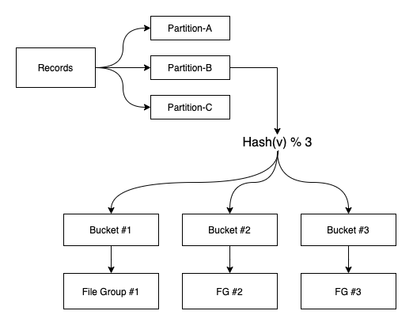
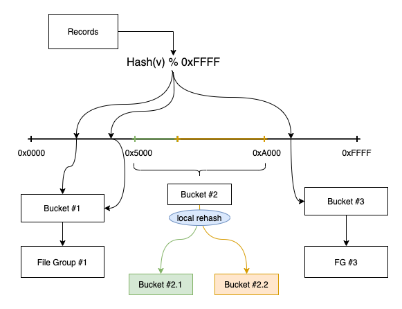
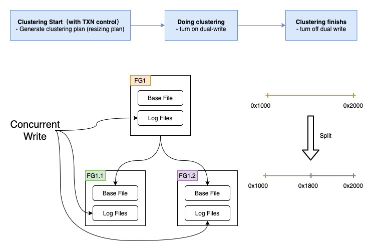
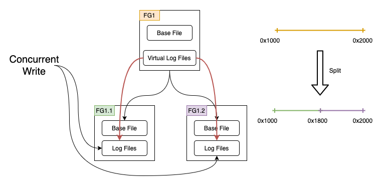

<!--
  Licensed to the Apache Software Foundation (ASF) under one or more
  contributor license agreements.  See the NOTICE file distributed with
  this work for additional information regarding copyright ownership.
  The ASF licenses this file to You under the Apache License, Version 2.0
  (the "License"); you may not use this file except in compliance with
  the License.  You may obtain a copy of the License at

       http://www.apache.org/licenses/LICENSE-2.0

  Unless required by applicable law or agreed to in writing, software
  distributed under the License is distributed on an "AS IS" BASIS,
  WITHOUT WARRANTIES OR CONDITIONS OF ANY KIND, either express or implied.
  See the License for the specific language governing permissions and
  limitations under the License.
-->
# RFC-42: Consistent Hashing Index for Dynamic Bucket Number


## Proposers

- @HuberyLee
- @hujincalrin
- @stream2000
- @YuweiXiao

## Approvers

 - @garyli1019
 - @leesf
 - @vinothchandar

## Status

JIRA: [HUDI-3000](https://issues.apache.org/jira/browse/HUDI-3000)

> Please keep the status updated in `rfc/README.md`.

## Abstract

Hudi supports `Upsert` operation to de-duplicate records in a table, which depends on indexing schemes to perform record location lookup.
Among many index options, bucket index (in progress, [RFC-29](https://cwiki.apache.org/confluence/display/HUDI/RFC+-+29%3A+Hash+Index)) achieves promising Upsert performance, around ~3x improvement on throughput compared to using Bloom Filter.
However, it requires pre-configure a fixed bucket number and cannot be changed afterwards.
Combined with the design of one-one mapping between hash buckets and file groups, hudi tables with bucket index have some practical issues, such as data skew and unlimited file group size, which now can only be resolved by resetting a suitable bucket number through re-writing the whole table.

This proposal wants to tackle these problems by introducing **Consistent Hashing Index**.
It achieves bucket resizing by splitting or merging several local buckets (i.e., only large file groups) while leaving most buckets untouched.
This feature allows us to adjust bucket number dynamically in a background service with minimal impacts on downstream systems relying on Hudi. 
For example, concurrent readers and writers are not blocked during the resizing.


## Background

Hudi supports the primary key concept from day one through a write operation called `Upsert`.
To correctly enforce the uniqueness of keys, `Upsert` performs indexing to locate data files where every record belongs.
One of the index implementations is `Bucket Index`, shown in the following figure.
It distributes records to buckets using a hash function, and each bucket corresponds to a single file group (i.e., one-one mapping).
This simple yet effective design reduce the time complexity of the key lookup to constant time (i.e., hash function computation), bringing good write performance.



However, there are also some limitions.
As described in [RFC-29](https://cwiki.apache.org/confluence/display/HUDI/RFC+-+29%3A+Hash+Index), the one-one mapping between buckets and file groups may cause data skew and doesn&#39;t scale well.
One solution to address these problems is allowing one bucket to have multiple file groups, which in turn requires indexing to be performed inside each bucket.

Another solution, that this proposal chooses, is to adjust bucket number dynamically based on Consistent Hashing.
In contrast to a standard re-hashing process, which needs shuffling of the whole table, Consistent Hashing constrains the re-hashing process to touch several local buckets (e.g, only large file groups).
The figure below shows a basic Consistent Hashing algorithm:



Hash value is obtained by computing `Hash(v) % 0xFFFF`, which falls into a pre-defined range (i.e., [0, 0xFFFF] in the figure). 
Then a range mapping is applied to the hash value to get the final bucket.
The figure also demonstrates a local bucket split process, where Bucket #2 is split into two children buckets and increases the total number of buckets by one.
Compared to a traditional hashing scheme, Consistent Hashing introduces an extra range mapping layer, linking hash values and buckets.
<!-- When a large bucket is identified, the corresponding range will be split, producing two children buckets containing records rehashed from the original bucket. -->


## Implementation

The design consideration and implementation will mostly follow the current Bucket Index:

1. Hashing happens at partition-level, i.e., each partition is managed independently and will be divided into N buckets.
2. One-one mapping between hash buckets and file groups.
3. The assignment of records to buckets fits into a standard write path by overriding the `tag location` process.

To further support Consistent Hashing, we also need to consider:

1. Hashing metadata. Information, such as range mapping between `hash_value` and `buckets`, should be maintained and persisted as files.
2. Implementation details about bucket resizing (splitting & merging): resizing criteria and how to integrate it as a Hudi service.
3. Concurrent writers and readers: ensure a non-blocking resizing process.

To enable different dynamic resizing strategies (i.e., other than consistent hashing), a flexible framework will be implemented for future extension.
For example, in the Bucket Index RFC-29, *extendible hashing* is mentioned for solving the limitations of bucket index.

For end-users, a new index option `BUCKET_INDEX_ENGINE` will be provided as an advanced configuration of `BUCKET_INDEX`.
One can choose different hashing options according to their use case, e.g., `SIMPLE_HASHING`, `CONSISTENT_HASHING` or `EXTENDIBLE_HASHING`.

When a dynamic resizing strategy is selected, the bucket number option (`BUCKET_INDEX_NUM_BUCKETS`) serves as an initial setup and requires no hyper-parameter tuning, as it will auto adjust in the course of data ingestion.

### Hashing Metadata

The hashing metadata will be persisted as files named as `<instant>.hashing_meta` for each partition as we manage hashing for each partition independently.
It stores in `.hoodie/.hashing_meta/partition/` directory and contains the following information in a readable encoding (e.g., json):
```
# reserved for metadata schema evolution
version: 1
partition_path: xxx
# last instant that updates the metadata
instant: xxx
# total number of bucket in current partition
num_buckets: xxx
bucket_mappings: [
  # hash_values are positive integer number, i.e., from 0 to 0x7fffffff (Integer.MAX_VALUE)
  # All hash_values divide the hash space into a group of continuous hash rangs, serving the range mapping step
  {<hash_value>, file_group}
  {<hash_value>, file_group}
  ...
  {0x7FFFFFFF, file_group} 
]
# other necessary or useful fields
# e.g., statistics about hash value distribution (maybe useful for bucket resizing)
...
```

Assuming thousands of buckets case, the metadata file is around several MB in size.
Only three operations will modify the hashing metadata:

- Initial write to a partition: a fresh new hashing metadata will be created with timestamp `00000000000000`, with default equally divided range mapping and randomly generated file group UUID.
- Resizing: a new version of hashing metadata will be created when the resizing completes, named using the timestamp of the resizing operation.
- Clean service: removes outdated metadata files in the same way as removing old file groups.

Though storing hashing metadata in the `.hoodie` path is a straightforward solution, it should be put into hudi's metadata table ultimately.
And the clean service is no loger necessary.
Old version hashing metadata will also be cleanup automatically since the metadata table itself is a hudi table.
### Bucket Resizing (Splitting & Merging)

Considering there is a semantic similarity between bucket resizing and clustering (i.e., re-organizing small data files), this proposal plans to integrate the resizing process as a subtask into the clustering service.
The trigger condition for resizing directly depends on the file size, where small files will be merged and large files will be split.

**For merging files**, we require that the buckets should be adjacent to each other in terms of their hash ranges so that the output bucket has only one continuous hash range.
Though it is not required in a standard Consistent Hashing algorithm, fragmentations in hash ranges may cause extra complexity for the splitting process in our case.

**For splitting files**, a split point (i.e., hash ranges for the output buckets) should be decided:

- A simple policy would be split in the range middle, but it may produce uneven data files.
In an extreme case, splitting may produce one file with all data and one file with no data.
- Another policy is to find a split point that evenly dispatches records into children buckets.
It requires knowledge about the hash value distribution of the original buckets.

In our implementation, *we will first stick to the first simple one*, as buckets will finally converge to a balanced distribution after multiple rounds of resizing processes.
Of course, a pluggable implementation will be kept for extensibility so that users can choose different available policies.

All updates related to the hash metadata will be first recorded in the clustering plan, and then be reflected in partitions' hashing metadata when clustering finishes.
The plan is generated and persisted in files during the scheduling process, which is protected by a table-level lock for a consistent table view.

### Concurrent Writer & Reader

Concurrent updates to file groups that are under clustering are not supported in Hudi, since records location change during the re-organizing.
For example, a clustering process is scheduled to combine three parquet files A, B, C into two parquet files E, F with a more compact storage layout.
During the clustering, a writer comes in and plan to update a record that originally belongs to the parquet file A.
There are two choices the writer can make:

- Only update the old file (i.e. parquet file A), but the update will lost once the clustering finishes because of the *replacecommit*'s shadowing.
- Besides parquet file A, also update new files (i.e. parquet file E or F).
However, the record's new location can only be determined until the clustering finishes, which means the writer will be blocked as it has to wait for the location information.

For tables using Bucket Index, the above conflicting condition can be avoided because record locations are calculated by the hash algorithm.
So even before the clustering finishes, the writer can calculate record locations as long as it knows the latest hash algorithm (in our Consistent Hashing case, it is stored in the clustering plan).

#### Dual write solution



The figure above shows a concurrent write process during the bucket resizing process (i.e., splitting).
Dual-write is activated for buckets that are splitting.
Each incoming record will be written to log files of both the old file group (i.e., FG1) and children file groups (i.e., FG1.1 or FG1.2).

With this dual-write scheme, no modification is required for concurrent readers.
The default behaviour of a reader is:

- Query old files before the resizing process finishes.
- Query new files when the resizing process finishes.

As the writer put incoming records in both new and old files, readers will always see the update-to-date data.

#### Virtual log file solution



Instead of writing records to both old and children file groups physically, we could route records to children file groups only and create an 'empty' virtual log file in the old file group.
The virtual log file contains the necessary information to reference log files in the children file groups (i.e., red lines in the above figure).
It enables readers to see the latest completed writes by merging children log files with the base file of the old file group.

The virtual file solution avoids extra write workload and minimizes the impact of resizing on the write performance. 
However, it adds some work on the read path in order to understand the virtual log file.

### Performance

Hudi table using Consistent Hashing should obtain a better write throughput than using Bloom Filter or HBase Index, thanks to the elimination of costs about indexing and read/write amplification.
But the throughput is expected to be a little smaller than using Bucket Index, as Consistent Hashing has a larger overhead on computing the bucket id, as shown in the following table.

|                   | Consistent Hashing Index | Bucket Index |
|-------------------|--------------------------|--------------|
| lookup a record   | log(N)                   | O(1)         |
| resizing a bucket | K*O(1)                   | K*O(N)       |

, where N denotes the number of buckets and K represents the average cost of re-hashing one bucket.

When the resizing of buckets is going on, the relevant writer that is on dual-write mode may drop ~50% in performance, since it needs to write records (as logs) twice into two file groups.
To alleviate the performance impact, we could control the resizing granularity:
- limit the number of involevd partitions per schedule.
- limit the total processing data size(e.g., 2G) per schedule.
- combination of above strategies and data size control has a higher priority.

## Rollout/Adoption Plan

There are no impacts to existing users since this is a fresh new index scheme, so no migrations/behaviour changes are required.

## Test Plan

* Unit tests of new modules will be provided.

* Integration test with different cases will be included:
  1. Initializing of tables using Consistent Hashing.
  2. Multiple rounds of merging & splitting.
  2. Extreme data distribution case where most data fall into a small hash range.
  2. Concurrent writer & reader case.
  4. Concurrent updates to hash metadata (e.g., multiple async clusterings).
* Performance (i.e., write throughput) test result will be provided, comparing Consistent Hashing Index, Bucket Index and Bloom Filter.