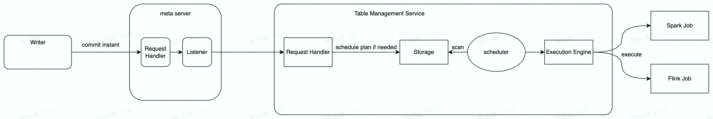
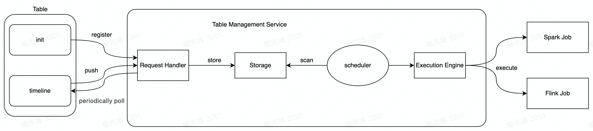

<!--
  Licensed to the Apache Software Foundation (ASF) under one or more
  contributor license agreements.  See the NOTICE file distributed with
  this work for additional information regarding copyright ownership.
  The ASF licenses this file to You under the Apache License, Version 2.0
  (the "License"); you may not use this file except in compliance with
  the License.  You may obtain a copy of the License at

       http://www.apache.org/licenses/LICENSE-2.0

  Unless required by applicable law or agreed to in writing, software
  distributed under the License is distributed on an "AS IS" BASIS,
  WITHOUT WARRANTIES OR CONDITIONS OF ANY KIND, either express or implied.
  See the License for the specific language governing permissions and
  limitations under the License.
-->

# RFC-43: Implement Table Management ServiceTable Management Service for Hudi

## Proposers

- @yuzhaojing

## Approvers

- @vinothchandar
- @Raymond

## Status

JIRA: [https://issues.apache.org/jira/browse/HUDI-3016](https://issues.apache.org/jira/browse/HUDI-3016)

## Abstract

Hudi table needs table management operations. Currently, schedule these job provides Three ways:

- Inline, execute these job and writing job in the same application, perform the these job and writing job serially.

- Async, execute these job and writing job in the same application, Async parallel execution of these job and write job.

- Independent compaction/clustering job, execute an async compaction/clustering job of another application.

With the increase in the number of HUDI tables, due to a lack of management capabilities, maintenance costs will become
higher. This proposal is to implement an independent compaction/clustering Service to manage the Hudi
compaction/clustering job.

## Background

In the current implementation, if the HUDI table needs do compact/cluster, it only has three ways:

1. Use inline compaction/clustering, in this mode the job will be block writing job.

2. Using Async compaction/clustering, in this mode the job execute async but also sharing the resource with HUDI to
   write a job that may affect the stability of job writing, which is not what the user wants to see.

3. Using independent compaction/clustering job is a better way to schedule the job, in this mode the job execute async
   and do not sharing resources with writing job, but also has some questions:
    1. Users have to enable lock service providers so that there is not data loss. Especially when compaction/clustering
       is getting scheduled, no other writes should proceed concurrently and hence a lock is required.
    2. The user needs to manually start an async compaction/clustering application, which means that the user needs to
       maintain two jobs.
    3. With the increase in the number of HUDI jobs, there is no unified service to manage compaction/clustering jobs (
       monitor, retry, history, etc...), which will make maintenance costs increase.

With this effort, we want to provide an independent compaction/clustering Service, it will have these abilities:

- Provides a pluggable execution interface that can adapt to multiple execution engines, such as Spark and Flink.

- With the ability to failover, need to be persisted compaction/clustering message.

- Perfect metrics and reuse HoodieMetric expose to the outside.

- Provide automatic failure retry for compaction/clustering job.

## Implementation

### Processing mode

Different processing modes depending on whether the meta server is enabled

- Hudi metaserver is used
    - The pull-based mechanism works for fewer tables. Scanning 1000s of tables for possible services is going to induce
      lots of a load of listing.
    - The meta server provides a listener that takes as input the uris of the Table Management Service and triggers a
      callback through the hook at each instant commit, thereby calling the Table Management Service to do the
      scheduling/execution for the table.
      

- Hudi metaserver is not used
    - for every write/commit on the table, the table management server is notified.
    - Each request to the table management server carries all pending instant matches the current action type.
      

### Processing flow

- If hudi metaserver is used, after receiving the request, the table management server schedules the relevant table
  service to the table's timeline
- Persist each table service into an instance table of Table Management Service
- notify a separate execution component/thread can start executing it
- Monitor task execution status, update table information, and retry failed table services up to the maximum number of
  times

### Storage

- There are two types of stored information
    - Register Hudi tables with Table Management Service
    - Each table service instance is generated by Table Management Service

#### Lectotype

**Requirements:** support single row ACID transactions. Almost all write operations require it, like operation creation,
status changing and so on.

There are the candidates,

**Hudi table**

pros:

- No external components are introduced and maintained.

crons:

- Each write to hudi table will be a deltacommit, this will further lower the number of possible requests / sec that can
  be served.

**RDBMS**

pros:

- database that is suitable for structured data like metadata to store.

- can describe the relation between many kinds of metadata.

crons:

- introduce another system to maintain.

**File system**

pros:

- No external components are introduced and maintained.

crons:

- not suitable for the situation that requires high performance.

- have to do extra work to support the metadata organization.

**Key-value storage**

pros:

- database that is suitable for structured data like metadata to store.

- in-memory data store so that read and write faster.

crons:

- introduce another system to maintain.

- stroage capacity is a limitation.

**Through the storage of server is pluggable, considering the general situation of disk storage, good performance of read
and write, convenience of development, RDBMS may be a better one to be chosen.**

### Execute

Provides an abstract Execution Engine to support Spark / Flink commits and return results

### Monitoring and Alerting

Expose some metrics of Table Management Service, such as qps , scheduling time, submission time, etc. and issue an alarm
when the task fails

### API

- Support (REST / GRPC)
- Implement API endpoint for cli and writer

### Cli

Provides some ability to operate Table Management Service, such as List all instances, Add instance, Remove instance,
Clear jobs for table (etc)

### Writer

- Enable meta server
    - commit instant to meta server and skip any scheduling + execution of table services
- Do not enable meta server
    - commit instant and request to Table Management Service for scheduling + execution of table services

### Multiple instances

Table Management Service instances are stateless, each instance is processed based on commit requests (scheduling +
execution of table services), and non-repeated scheduling is guaranteed through meta server or ZK locking

### Scheduler

- Periodically scan the storage and submit operation job according to user-specified rules, like priority, queue, owner
  etc.
- Need to plug-in the execution engine.

### Storage Schema

- **tbl**

    - unique key: db_name, table_name

    - | name         | type   | comment               |
            | ------------ | ------ | --------------------- |
      | id           | bigint | auto_increment        |
      | db_name      | string | database name         |
      | table_name   | string | table name            |
      | base_path    | string | storage path          |
      | owner        | string | owner                 |
      | queue        | string | queue                 |
      | action_types | string | register action types |
      | priority     | string | priority              |

- **operation**

    - unique key: tbl_id, instant

    - | name           | type      | comment                                            | 
            | -------------- | --------- | -------------------------------------------------- |
      | operation_id   | bigint    | auto_increment                                     |
      | tbl_id         | string    | table the operation belongs to                     |
      | instant        | string    | operation timestamp                                |
      | action         | string    | operation action, compaction, clustering and etc   |
      | status         | int       | operation status                                   |
      | engine         | string    | operation engine, Spark or Flink                   |
      | retry_on_error | boolean   | operation should retry on error or not             |
      | run_times      | int       | operation run times                                |
      | isDeleted      | boolean   | true if this operation has been deleted in service |
      | schedule_time  | timestamp | operation created time                             |
      | create_time    | timestamp | operation created time                             |
      | update_time    | timestamp | operation updated time                             |

## Interface design

### Compact

/v1/hoodie/service/compact/submit

```
{
"db_name":"db_name",
"table_name":"table_name",
"owner":"default",
"queue":"root.default",
"instant":"20220908000000",
"resource":"4g:4g",
"parallelism":"1000",
"execution_engine":"Spark",
"extra_params":""
}
```

/v1/hoodie/service/compact/remove

```
{
"db_name":"db_name",
"table_name":"table_name",
"instant":"20220908000000"
}
```

### Cluster

/v1/hoodie/service/cluster/submit

```
{
"db_name":"db_name",
"table_name":"table_name",
"owner":"default",
"queue":"root.default",
"instant":"20220908000000",
"resource":"4g:4g",
"parallelism":"1000",
"execution_engine":"Spark",
"extra_params":""
}
```

/v1/hoodie/service/cluster/remove

```
{
"db_name":"db_name",
"table_name":"table_name",
"instant":"20220908000000"
}
```

## Error Handling

Due to two tables being involved in each operation, we need to ensure that they are in sync and errors during dataset
operation are handled correctly.

1. Client scheduled the plan but request failed.

2. RequestHandler received request but the commit is not completed.

3. Client rollback plan after request to Compaction/Clustering Service.

Client will report to service all unCompleted plans by time or num deltaCommits or combination, the service upsert to
meta table uses HoodieServicePayload to guarantee any plan unique. Client use Delete request to rollback plan for
Compaction/Clustering Service.

### Configuration

hoodie.table.services.enable=true hoodie.table.service.compaction.enable=true
hoodie.table.service.clustering.enable=true hoodie.table.service.clean.enable=true

## Implementation plan

### phase1

Implement the basic functional part of the long-term planning without enabling meta server

1. Processing mode + processing flow
2. Storage
3. Execution (only implements Spark )
4. Monitoring (only expose basic success, failure and other indicators)
5. API（only REST）
6. Writer

**Target: 0.12**

### Phase2

Realize the integration part with the meta server and improve some capabilities

1. Improve monitoring and alarm indicators and provide alarm functions
2. API （ GRPC ）
3. Schedule table service in Table Management Service（with meta server）
4. Multi-instance implementation

**Landing plan: 1.0**

## Rollout/Adoption Plan

- What impact (if any) will there be on existing users?
    - None. This service will start in another process. If the config is not set, the functionality will not be enabled.

- If we are changing behavior how will we phase out the older behavior?
    - This new feature is backwards-compatible. If the compaction/clustering service are not available, the existing way
      like inline/async will be used.

- If we need special migration tools, describe them here.
    - NA

- When will we remove the existing behavior?
    - It is not required.

Test Plan

This RFC aims to implement a new Service to manager the Hudi table compaction and clustering action, to test this
feature, there will be some test tables trigger compaction and clustering action to Service with unit tests for the
code. Since this is an entirely new feature, I am confident that this will not cause any regressions during and after
roll out.

- Compatibility testing for Spark execution tasks
- Compatibility testing for Flink execution tasks
- For conformance tests hosted to TMS but self-executing