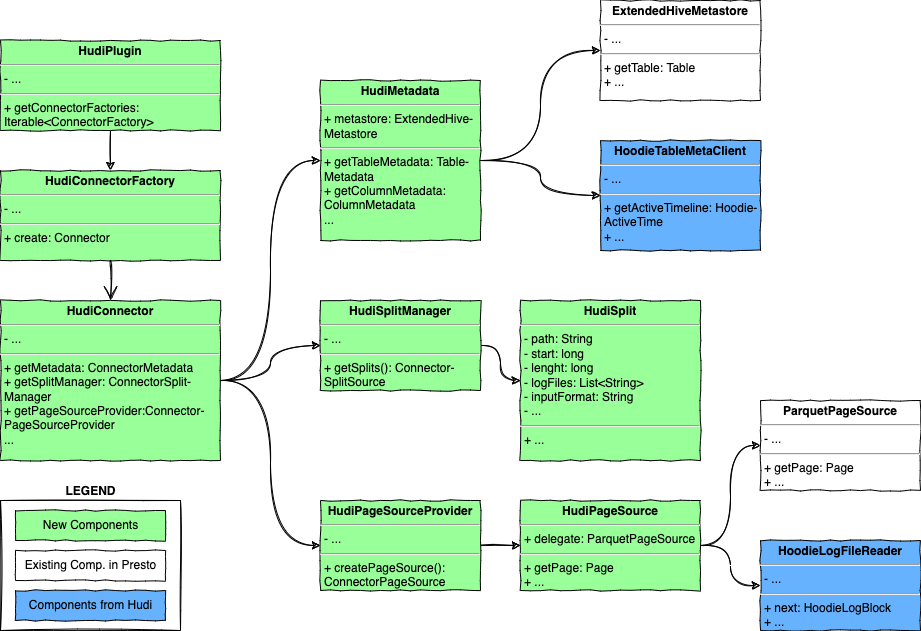

<!--
  Licensed to the Apache Software Foundation (ASF) under one or more
  contributor license agreements.  See the NOTICE file distributed with
  this work for additional information regarding copyright ownership.
  The ASF licenses this file to You under the Apache License, Version 2.0
  (the "License"); you may not use this file except in compliance with
  the License.  You may obtain a copy of the License at
       http://www.apache.org/licenses/LICENSE-2.0
  Unless required by applicable law or agreed to in writing, software
  distributed under the License is distributed on an "AS IS" BASIS,
  WITHOUT WARRANTIES OR CONDITIONS OF ANY KIND, either express or implied.
  See the License for the specific language governing permissions and
  limitations under the License.
-->

# RFC-44: Hudi Connector for Presto

## Proposers

- @7c00

## Approvers

- @codope
- @vinothchandar

## Status

JIRA: [HUDI-3210](https://issues.apache.org/jira/browse/HUDI-3210)

> Please keep the status updated in `rfc/README.md`.

## Abstract

The support for querying Hudi tables in Presto is provided by Presto Hive connector. The implementation is built on the
InputFormat interface from hudi-hadoop-mr module. This approach has known performance and stability issues. It's also
hard to adopt new Hudi features due to the restrictions from current code. A separate Hudi connector would make it
efficient to make specific optimization, add new functionalities, integrate advanced features, and evolve rapidly with
the upstream project.

## Background

The current Presto integration reads Hudi tables as regular Hive tables with some additional processing. For a COW or
MOR-RO table, Presto applies a dedicated file filter (`HoodieROTablePathFilter`) to prune invalid files during split
generation. For an MOR-RT table, Presto delegates split generation to `HoodieParquetRealtimeInputFormat#getSplits`, 
and data loading to the reader created by `HoodieParquetRealtimeInputFormat#getRecordReader`.

This implementation could take advantage of existing code. But there are some drawbacks.

- Due to the MVCC design, file layouts of Hudi tables are quite different from those of regular Hive tables. 
  Mixing the split generation for Hudi and non-Hudi tables makes it hard to extend to integrate custom split scheduling
  strategies. For example, HoodieParquetRealtimeInputFormat generates a split for a file slice, which is not performant
  and could be improved by fine-grained splitting.
- In order to transport Hudi-only split properties, CustomSplitConverter is applied. The restrictions from current code
  make it necessary to have such hacking and tricky code, and increases the difficulty of testing. It would continue to
  affect the new code to adopt new Hudi features in the future.
- By delegating most work to HoodieParquetRealtimeInputFormat, memory usage is out of control of Presto memory 
  management mechanism. That hurts the system robust: workers tend to crash for OOM when querying a large MOR-RT table.

With a new separator connector, Hudi integration could be improved without the restriction of current code in Hive
connector. A separate connector also separates Hudi's bugs away from Hive connector. It becomes more confident to add
new code, since it would never break Hive connector.

## Implementation

Presto provides a set of service provider interfaces (SPI) to allow developers to create plugins that would be
dynamically loaded into Presto runtime system to add custom functionalities. The connector is a kind of plugin, 
which can read and sink data from/to external data sources.

To create a connector for Hudi, SPIs below are to be implements:

- **Plugin**: the entry class to create plugin components (including connectors), instantiated and invoked by Presto
  internal services when booting. `HudiPlugin` which implements Plugin interface is to be added for Hudi connector.
- **ConnectorFactory**: the factory class to create connector instances. `HudiConnectorFactory` which implements
  ConnectorFactory is to be added for Hudi connector.
- **Connector**: the facade class of all service classes for a connector. `HudiConnector` which implements Connector
  is to be added for Hudi connector. Primary service classes for Hudi connector are listed below.
    - **ConnectorMetadata**: the service class to retrieve (and update if possible) metadata from/to a data source. 
      `HudiMetadata` which implements ConnectorMetadata is to be added to Hudi connector.
    - **ConnectorSplitManager**: the service class to generate ConnectorSplit for accessing the data source. 
      A ConnectorSplit is similar to a Split in Hadoop MapReduce computation paradigm. `HudiConnectorSplitManager`
      which implements ConnectorSplitManager, is to be added to Hudi connector.
    - **ConnectorPageSourceProvider**: the service class to generate a reader to load data from the data source.
      `HudiPageSourceProvider` which implements ConnectorPageSourceProvider, is to be added to Hudi connector. 
      
There are other service classes (e.g. `ConnectorPageSinkProvider`), which are not covered in this RFC but might be
implemented in the future. A class-diagrammatic view of the different components is shown below.

### HudiMetadata

HudiMetadata implements ConnectorMetadata interface, and provides methods to access the metadata like databases
(called schemas in Presto), table and column structures, statistics and properties, and other info.
As Hudi table metadata is synchronized to Hive MetaStore, HudiMetadata reuses ExtendHiveMetastore from Presto codebase
to retrieve Hudi table metadata. Besides, HudiMetadata takes use of HoodieTableMetaClient to expose Hudi specified
metadata, e.g. instants list of a table timeline, represented as SystemTable.
      
### HudiSplitManager & HudiSplit

HudiSplitManager implements the ConnectorSplitManager interface. It partitions a Hudi table to read into multiple
individual chunks (called ConnectorSplit in Presto), so that the data set can be processed in parallel.
HudiSplitManager also performs partition  pruning if possible.

HudiSplit, which implements ConnectorSplit, describes which files to read, and the file properties (i.e. offset, length,
location, etc).  For a normal Hudi table, HudiSplitManager generates a split for each FileSlice at certain instant.
For a Hudi table that contains large base files, HudiSplitManager divides the base file into multiple splits,
each containing all the log files and part of the base file. This should improve the performance.

For large Hudi tables, generating splits tends to cost lots of time. This can be improved in the following ways. 
Firstly, increase parallelism. Since each partition is independent of another, processing the partitions in multiple
threads, one thread per partition, helps reduce the wall time. Secondly, take use of Hudi metadata table or external
listing services. This should save a large amount of cost to make requests to HDFS.

### HudiPageSourceProvider & HudiPageSource

For each HudiSplit, HudiPageSourceProvider generates a reader for it to load data from the data source (e.g. HCFS)
into memory. Presto organizes the memory data in the form of Pages. Page is implemented in a column-store favor. 
This design contributes to enhance Presto's query performance. In particular, Presto writes its own readers to
accelerate the data loading for column-store favored files, such as Parquet and ORC.

For the snapshot query on a COW table, HudiPageSourceProvider takes advantage of Presto's native ParquetPageSource
as it's well optimized for Parquet files as described above.

For the snapshot query on an MOR table, HudiPageSourceProvider is planned to add a page source that makes mixed uses of
ParquetPageSource and HoodieRealtimeRecordReader. The new page source takes care of memory usage under Presto's memory
tracking framework. A native log file reader optimized for Presto might be provided in the future.

## Rollout/Adoption Plan

- What impact (if any) will there be on existing users?
  
  There will be no impact on existing users because this is a new connector. It does not change the behavior of current
  integration through the existing Hive connector. It gives users more choice. However, in order to use this connector, the catalog name should be changed to `hudi` from `hive`.
  For example, after users have configured Hudi connector, then `USE hudi.schema_name` should be used instead of `USE hive.schema_name`.

- What do we lose if we move away from the Hive connector?

  Some features in Hive connectors (e.g. RaptorX) might be temporarily unavailable during the early development stage of
  Hudi connector. Most of them will be ported to Hudi connector as the connector evolution.

- If we need special migration tools, describe them here.

  The Hudi connector provides another choice besides Hive connector for people to query Hudi tables from Presto.
  No migration is needed.

- When will we remove the existing behavior?

  We are not proposing to remove the existing behavior. We hope that we will have a critical mass of users who will like
  to use the new Hudi connector. That said, we should continue to support the current integration.

## Test Plan

- [x] POC for snapshot query on COW table
- [ ] Unit tests for the connector
- [ ] Product integration tests
- [ ] Benchmark snapshot query for large tables