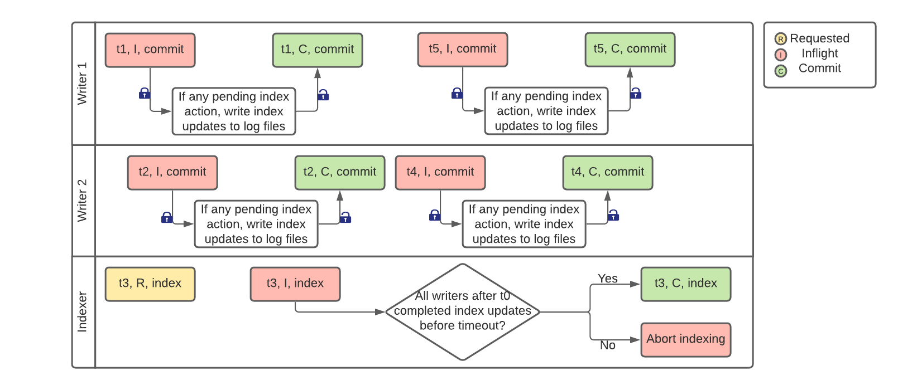

<!--
  Licensed to the Apache Software Foundation (ASF) under one or more
  contributor license agreements.  See the NOTICE file distributed with
  this work for additional information regarding copyright ownership.
  The ASF licenses this file to You under the Apache License, Version 2.0
  (the "License"); you may not use this file except in compliance with
  the License.  You may obtain a copy of the License at

       http://www.apache.org/licenses/LICENSE-2.0

  Unless required by applicable law or agreed to in writing, software
  distributed under the License is distributed on an "AS IS" BASIS,
  WITHOUT WARRANTIES OR CONDITIONS OF ANY KIND, either express or implied.
  See the License for the specific language governing permissions and
  limitations under the License.
-->

# RFC-45: Asynchronous Metadata Indexing

## Proposers

- @codope
- @manojpec

## Approvers

- @nsivabalan
- @vinothchandar

## Status

JIRA: [HUDI-2488](https://issues.apache.org/jira/browse/HUDI-2488)

## Abstract

Metadata indexing (aka metadata bootstrapping) is the process of creation of one
or more metadata-based indexes, e.g. data partitions to files index, that is
stored in Hudi metadata table. Currently, the metadata table (referred as MDT
hereafter) supports single partition which is created synchronously with the
corresponding data table, i.e. commits are first applied to metadata table
followed by data table. Our goal for MDT is to support multiple partitions to
boost the performance of existing index and records lookup. However, the
synchronous manner of metadata indexing is not very scalable as we add more
partitions to the MDT because the regular writers (writing to the data table)
have to wait until the MDT commit completes. In this RFC, we propose a design to
support asynchronous metadata indexing.

## Background

We can read more about the MDT design
in [RFC-15](https://cwiki.apache.org/confluence/display/HUDI/RFC+-+15%3A+HUDI+File+Listing+Improvements)
. Here is a quick summary of the current state (Hudi v0.10.1). MDT is an
internal Merge-on-Read (MOR) table that has a single partition called `files`
which stores the data partitions to files index that is used in file listing.
MDT is co-located with the data table (inside `.hoodie/metadata` directory under
the basepath). In order to handle multi-writer scenario, users configure lock
provider and only one writer can access MDT in read-write mode. Hence, any write
to MDT is guarded by the data table lock. This ensures only one write is
committed to MDT at any point in time and thus guarantees serializability.
However, locking overhead adversely affects the write throughput and will reach
its scalability limits as we add more partitions to the MDT.

## Goals

- Support indexing one or more partitions in MDT while regular writers and table
  services (such as cleaning or compaction) are in progress.
- Locking to be as lightweight as possible.
- Keep required config changes to a minimum to simplify deployment / upgrade in
  production.
- Do not require specific ordering of how writers and table service pipelines
  need to be upgraded / restarted.
- If an external long-running process is being used to initialize the index, the
  process should be made idempotent so it can handle errors from previous runs.
- To re-initialize the index, make it as simple as running the external
  initialization process again without having to change configs.

## Implementation

### High Level Design

#### A new Hudi action: INDEXING

We introduce a new action `index` which will denote the index building process,
the mechanics of which is as follows:

1. From an external process, users can issue a CREATE INDEX or run a job to
   trigger indexing for an existing table.
    1. This will schedule INDEXING action and add
       a `<instant_time>.index.requested` to the timeline, which contains the
       indexing plan. Index scheduling will also initialize the filegroup for
       the partitions for which indexing is planned. The creation of filegroups
       will be done within a lock.
    2. From here on, the index building process will continue to build an index
       up to instant time `t`, where `t` is the latest completed instant time on
       the timeline without any
       "holes" i.e. no pending async operations prior to it.
    3. The indexing process will write these out as base files within the
       corresponding metadata partition. A metadata partition cannot be used if
       there is any pending indexing action against it. As and when indexing is
       completed for a partition, then table config (`hoodie.properties`) will
       be updated to indicate that partition is available for reads or
       synchronous updates. Hudi table config will be the source of truth for
       the current state of metadata index.

2. Any inflight writers (i.e. with instant time `t'` > `t`)  will check for any
   new indexing request on the timeline prior to preparing to commit.
    1. Such writers will proceed to additionally add log entries corresponding
       to each such indexing request into the metadata partition.
    2. There is always a TOCTOU issue here, where the inflight writer may not
       see an indexing request that was just added and proceed to commit without
       that. We will correct this during indexing action completion. In the
       average case, this may not happen and the design has liveness.

3. When the indexing process is about to complete (i.e. indexing upto
   instant `t` is done but before completing indexing commit), it will check for
   all completed commit instants after `t` to ensure each of them added entries
   per its indexing plan, otherwise simply abort after a configurable timeout.
   Let's call this the **indexing catchup**. So, the indexer will not only write
   base files but also ensure that log entries due to instants after `t` are in
   the same filegroup i.e. no new filegroup is initialized by writers while
   indexing is in progress.
    1. The corner case here would be that the indexing catchup does not factor
       in the inflight writer just about to commit. But given indexing would
       take some finite amount of time to go from requested to completion (or we
       can add some, configurable artificial delays here say 60 seconds), an
       inflight writer, that is just about to commit concurrently, has a very
       high chance of seeing the indexing plan and aborting itself.

We can just introduce a lock for adding events to the timeline and these races
would vanish completely, still providing great scalability and asynchrony for
these processes. The indexer will error out if there is no lock provider
configured.

#### Multi-writer scenario



Let us walkthrough a concrete mutli-writer scenario to understand the above
indexing mechanism. In this scenario, let instant `t0` be the last completed
instant on the timeline. Suppose user triggered index building from an external
process at `t3`. This will create `t3.index.requested` file with the indexing
plan. The plan contains the metadata partitions that need to be created and the
last completed instant, e.g.

```
[
  {MetadataPartitionType.FILES.partitionPath(), t0}, 
  {MetadataPartitionType.BLOOM_FILTER.partitionPath(), t0}, 
  {MetadataPartitionType.COLUMN_STATS.partitionPath(), t0}
]
```

Further, suppose there were two inflight writers Writer1 and Writer2 (with
inflight instants `t1` and `t2` respectively) while the indexing was requested
or inflight. In this case, the writers will check for pending index action and
find a pending instant `t3`. Now, if the metadata index creation is pending,
which means indexer has already intialized a filegroup, then each writer will
create log files in the same filegroup for the metadata index update. This will
happen within the existing data table lock.

The indexer runs in a loop until the metadata for data upto `t0` plus the data
written due to `t1` and `t2` has been indexed, or the indexing timed out.
Whether indexing timed out or not, table config would be updated with any MDT
partition(s) for which indexing was complete till `t2`. In case of timeout
indexer will abort. At this point, user can trigger the index process again,
however, this time indexer will check for available partitions in table config
and skip those partitions. This design ensures that the regular writers do not
fail due to indexing.

### Low Level Design

#### Schedule Indexing

The scheduling initializes the file groups for metadata partitions in a lock. It
does not update any table config.

```
1 Run pre-scheduling validation (valid index requested, lock provider configured, idempotent checks)
2 Begin transaction
  2.a  Get the base instant
  2.b  Start initializing file groups for each partition
  2.c  Create index plan and save indexing.requested instant to the timeline
3 End transaction 
```

If there is failure in any of the above steps, then we abort gracefully i.e.
delete the metadata partition if it was initialized.

#### Run Indexing

This is a separate executor, which reads the plan and builds the index.

```
1 Run pre-indexing checks (lock provider configured, indexing.requested exists, idempotent checks)
2 Read the indexing plan and if any of the requested partition is inflight or already completed then error out and return early
3 Transition indexing.requested to inflight
4 Build metadata partitions
  4.a  Build the base file in the metadata partition to index upto instant as per the plan
  4.b  Update inflight partitions config in hoodie.properties
5 Determine the catchup start instant based on write and non-write timeline
6 Start indexing catchup in a separate thread (that can be interrupted upon timeout)
  6.a  For each instant to catchup
    6.a.i  if instant is completed and has corresponding deltacommit in metadata timeline then continue
    6.a.ii  if instant is inflight, then reload active timeline periodically until completed or timed out
    6.a.iii update metadata table, if needed, within a lock
7 Build indexing commit metadata with the partition info and caught upto instant
8 Begin transaction
  8.a  update completed metadata partitions in table config
  8.b  save indexing commit metadata to the timeline transition indexing.inflight to completed.
9 End transaction
```

If there is failure in any of the above steps, then we abort gracefully i.e.
delete the metadata partition if it exists and revert the table config updates.

#### Configs

```
# enable metadata
hoodie.metadata.enable=true
# enable asynchronous metadata indexing
hoodie.metadata.index.async=true
# enable column stats index
hoodie.metadata.index.column.stats.enable=true
# set indexing catchup timeout
hoodie.metadata.index.check.timeout.seconds=60
# set OCC concurrency mode
hoodie.write.concurrency.mode=optimistic_concurrency_control
# set lock provider
hoodie.write.lock.provider=org.apache.hudi.client.transaction.lock.InProcessLockProvider
```

#### Table upgrade/downgrade

While upgrading from a previous version to the current version, if metadata is
enabled and `files` partition exists then completed partitions in
hoodie.paroperties will be updated to `files` partition. While downgrading to a
previous version, if metadata table exists then it is deleted because metadata
table in current version has a schema that is not forward compatible.

### Error Handling

**Case 1: Writer fails while indexer is inflight**

This means index update due to writer did not complete. Indexer continues to
build the index ignoring the failed instant due to writer. The next update by
the writer will trigger a rollback of the failed instant, which will also
rollback incomplete updates in metadata table.

**Case 2: Indexer fails while writer is inflight**

Writer will commit adding log entries to the metadata partition. However, table
config will indicate that partition is not ready to use. When indexer is
re-triggered, it will check the plan and table config to figure out which MDT
partitions to index and start indexing for those partitions.

**Case 3: Race conditions**

a) Writer went inflight just after an indexing request was added but indexer has
not yet started executing.

In this case, writer will continue to log updates in metadata partition. At the
time of execution, indexer will see there are already some log files and ensure
that the indexing catchup passes.

b) Inflight writer about to commit, but indexing completed just before that.

Ideally, the indexing catchup in the indexer should have failed. But this could
happen in the following sequence of events:

1. No pending data commit. Indexing check passed, indexing commit not
   completed (table config yet to be updated).
2. Writer went inflight knowing that MDT partition is not ready for use.
3. Indexing commit done, table config updated.

In this case, the writer will continue to write log files under the latest base
filegroup in the MDT partition. Even though the indexer missed the updates due
to writer, there is no "index loss" as such i.e. metadata due to writer is still
updated in the MDT partition. Async compaction on the MDT will eventually merge
the updates into another base file.

Or, we can introduce a lock for adding events to the metadata timeline.

c) Inflight writer about to commit but index is still being scheduled

Consider the following scenario:

1. Writer is in inflight mode.
2. Indexer is starting and creating the file-groups. Suppose there are 100
   file-groups to be created.
3. Writer just finished and tries to write log blocks - it only sees a subset of
   file-groups created yet (as the above step 2 above has not completed yet).
   This will cause writer to incorrectly write updated to lesser number of
   shards.

In this case, we ensure that scheduling for metadata index always happens within
a lock. Since the initialization of filegroups happen at the time of scheduling,
indexer will hold the lock until all the filegroups are created.

**Case 4: Async table services**

The metadata partition cannot be used if there is any pending index action
against it. So, async compaction/cleaning/clustering will ignore the metadata
partition for which indexing is inflight.

**Case 5: Data timeline with holes**

Let's say the data timeline when indexer is started looks
like: `C1, C2,.... C5 (inflight), C6, C7, C8`, where `C1` is a commit at
instant `1`. In this case the latest completed instant without any hole is `C4`.
So, indexer will continue to index upto `C4`. Instants `C5-C8` will go through
the indexing catchup. If `C5` does not complete before the timeout, then indexer
will abort. The indexer will run through the same process again when
re-triggered.

The above example contained only write commits however the indexer will consider
non-write commits (such as clean/restore/rollback) as well. Let's take such an
example:

|  DC  |  DC  | DC | CLEAN | DC | DC | COMPACT | DC | INDEXING |  DC  |
| ---- | ---- | ---- | ---- | ---- | ---- | ---- | ---- | ---- | ---- |
|  1   |  2   |  3   |  4   |  5   |  6   |  7   |  8   |  9   |  10  |
|  C   |  C   |  C   |  I   |  C   |  C   |  R   |  C   |  R   |  I   |

Here, DC indicates a deltacommit, second row is the instant time, and the last
row is whether the action is completed (C), inflight (I) or requested(R). In
this case, the base instant upto which there are no holes in write timeline
is `DC6`. The indexer will also check the earliest pending instant in non-write
timeline before this base instant, which is `CLEAN4`. While the indexing is done
upto base instant, the remaining instants (CLEAN4, COMPACT7, DC8) are checked
during indexing catchup whether they logged updated to corresponding filegroup
as per the index plan. Note that during catchup, indexer won't move beyond
unless the instants to catch up actually get into completed state. For instance,
if the CLEAN4 was inflight till the configured timeout, then indexer will abort.

## Summary of key proposals

- New INDEXING action on data timeline.
- Async indexer to handle state change for the new action.
- Concept of "indexing catchup" to reconcile instants that went inflight after
  indexer started.
- Table config to be the source of truth for inflight and completed MDT
  partitions.
- Indexer will error out if lock provider not configured.

## Rollout/Adoption Plan

- What impact (if any) will there be on existing users?

There can be two kinds of existing users:

a) Enabling metadata for the first time: There should not be any impact on such
users. When they enable metadata, they can trigger indexing process. b) Metadata
already enabled: Such users already have metadata table with at least one
partition. If they trigger indexing process, then the indexer should take into
account the existing metadata and ignore instants upto which MDT is in sync with
the data table.

- If we are changing behavior how will we phase out the older behavior?

The changes will be backward-compatible and if the async indexing is diabled
then the existing behavior of MDT creation and updates will be used.

- If we need special migration tools, describe them here.

Not required.

- When will we remove the existing behavior

Not required

## Test Plan

- Extensive unit tests to cover all scenarios including conflicts and
  error-handling.
- Run a long-running test on EMR cluster with async indexing enabled.
