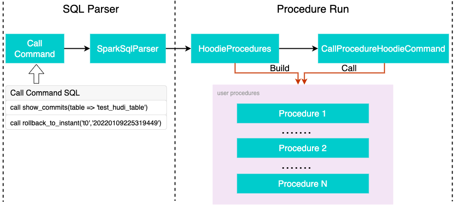

<!--
  Licensed to the Apache Software Foundation (ASF) under one or more
  contributor license agreements.  See the NOTICE file distributed with
  this work for additional information regarding copyright ownership.
  The ASF licenses this file to You under the Apache License, Version 2.0
  (the "License"); you may not use this file except in compliance with
  the License.  You may obtain a copy of the License at

       http://www.apache.org/licenses/LICENSE-2.0

  Unless required by applicable law or agreed to in writing, software
  distributed under the License is distributed on an "AS IS" BASIS,
  WITHOUT WARRANTIES OR CONDITIONS OF ANY KIND, either express or implied.
  See the License for the specific language governing permissions and
  limitations under the License.
-->

# RFC-[47]: Add RFC for Add Call Produce Command for Spark SQL


## Proposers
- @forwardxu

## Approvers
 - @vinoth @Danny @Raymond 

## Status

JIRA: [https://issues.apache.org/jira/browse/HUDI-3161](https://issues.apache.org/jira/browse/HUDI-3161)

## Abstract

We intend to implement Call Procedure Command for Spark SQL.

## Background
The Call Procedure Command can solve the problems that DDL and DML functions cannot handle. What I can think of are the following 4 aspects:
- Commit management
- Metadata table management
- Table migration
- Optimization table(Such as Table services like clustering)

## Implementation

### Extended SQL for CALL Command Syntax
#### Named arguments
All procedure arguments are named. When passing arguments by name, arguments can be in any order and any optional argument can be omitted.
```
CALL system.procedure_name(arg_name_2 => arg_2, arg_name_1 => arg_1, ... arg_name_n => arg_n)
```
#### Positional arguments
When passing arguments by position, the arguments may be omitted if they are optional.
```
CALL system.procedure_name(arg_1, arg_2, ... arg_n)
```
*note:* The system here has no practical meaning, the complete procedure name is system.procedure_name.



As shown in the figure above, The execution process of Call Command consists of two parts, SQL Parser and Procedure Run.

### parse
In the sql parse stage, we will inject a HoodieSqlParser to spark sql which will parse our extended `CALL` syntax to LogicalPlan. If the HoodieSqlParser failed to parse the sql statement, Spark will route it to Spark SQL parser. So we just need to implement our extended syntax in `HoodieSqlParser`.

### resolution
In the resolution stage, some Hudi resolution rules will be injected to Spark SQL to resolve our extended LogicalPlan to the resolve plan which is a command plan for `CALL`.

### procedure#call
The `procedure#call` method will translate the logical plan to Hudi's API call. For example, the `ShowCommitsProcedure` will be translated to Hudi API for showing Hudi timeline's commits.

### examples
Example 1:

```
call show_commits_metadata(table => 'test_hudi_table');
```

|    commit_time   | action |	 partition  |               	file_id              |	previous_commit |	num_writes | num_inserts | num_deletes | num_update_writes | total_errors | total_log_blocks | total_corrupt_logblocks | total_rollback_blocks | total_log_records | total_updated_records_compacted | total_bytes_written|
|----------------- |  ----  |  ------------ |----------------------------------------| ---------------- |------------- |-------------|-------------|------------------ |------------- |----------------  |-------------------------|---------------------- |-------------------|-------------------------------  |------------------- |
|20220109225319449 | commit | dt=2021-05-03	| d0073a12-085d-4f49-83e9-402947e7e90a-0 | null             | 	1          | 	1        | 	0          | 0                 | 0            | 0				 | 0					   | 0                     | 0                 | 0                               | 435349             |
|20220109225311742 | commit	| dt=2021-05-02	| b3b32bac-8a44-4c4d-b433-0cb1bf620f23-0 | 20220109214830592| 	1          | 	1        | 	0	       | 0	               | 0            | 0				 | 0					   | 0                     | 0                 | 0                               | 435340             |
|20220109225301429 | commit	| dt=2021-05-01	| 0d7298b3-6b55-4cff-8d7d-b0772358b78a-0 | 20220109214830592| 	1          | 	1        | 	0          | 0                 | 0	          | 0				 | 0					   | 0                     | 0                 | 0                               | 435340             |
|20220109214830592 | commit	| dt=2021-05-01	| 0d7298b3-6b55-4cff-8d7d-b0772358b78a-0 | 20220109191631015| 	0          | 	0        | 	1	       | 0	               | 0            | 0				 | 0					   | 0                     | 0                 | 0                               | 432653             |
|20220109214830592 | commit	| dt=2021-05-02	| b3b32bac-8a44-4c4d-b433-0cb1bf620f23-0 | 20220109191648181| 	0          | 	0        | 	1	       | 0	               | 0	          | 0				 | 0					   | 0                     | 0                 | 0                               | 432653             |
|20220109191648181 | commit	| dt=2021-05-02	| b3b32bac-8a44-4c4d-b433-0cb1bf620f23-0 | null             | 	1          | 	1        | 	0          | 0                 | 0            | 0				 | 0					   | 0                     | 0                 | 0                               | 435341             |
|20220109191631015 | commit	| dt=2021-05-01	| 0d7298b3-6b55-4cff-8d7d-b0772358b78a-0 | null             | 	1          | 	1        | 	0          | 0                 | 0            | 0				 | 0					   | 0                     | 0                 | 0                               | 435341             |

Time taken: 0.844 seconds, Fetched 7 row(s)

Example 2:

```
call rollback_to_instant(table => 'test_hudi_table', instant_time => '20220109225319449');
```

| rollback_result |
| :---------------|
|    true         |

Time taken: 5.038 seconds, Fetched 1 row(s)

### Spark SQL permissions and security
For security, please refer to the description of [Spark Security](https://spark.apache.org/docs/latest/security.html).

## Rollout/Adoption Plan
This is a new feature can use Spark SQL works And does not depend on the Spark version.

## Test Plan

- [☑️️] Unit tests for this feature
- [✖️] Product integration tests
- [✖️] Benchmark snapshot query for large tables
