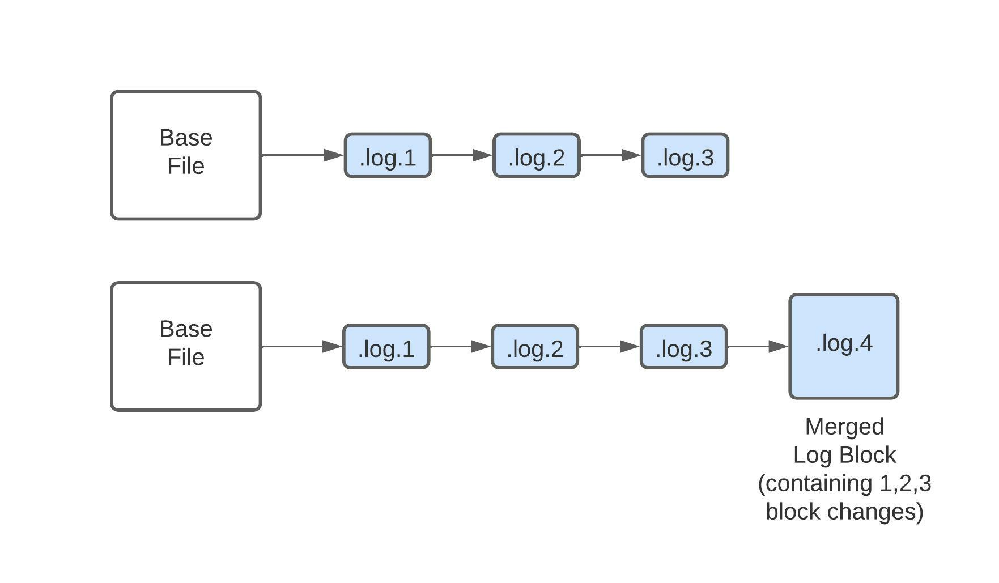
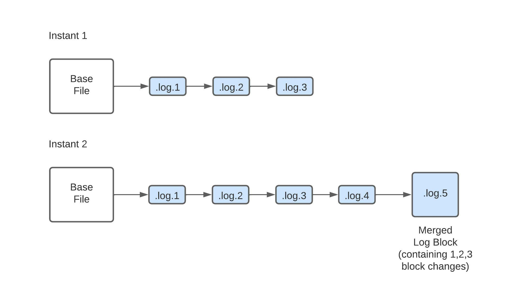
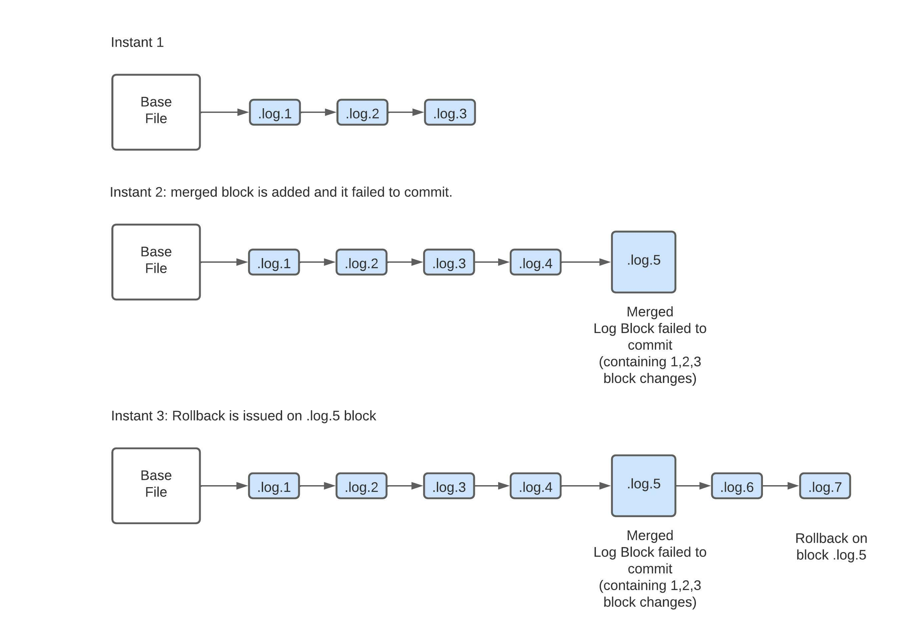
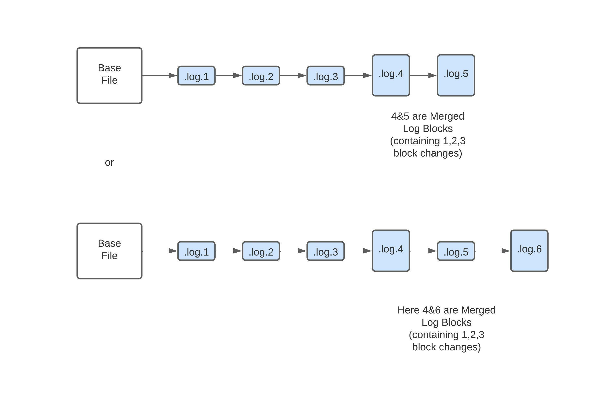

<!--
  Licensed to the Apache Software Foundation (ASF) under one or more
  contributor license agreements.  See the NOTICE file distributed with
  this work for additional information regarding copyright ownership.
  The ASF licenses this file to You under the Apache License, Version 2.0
  (the "License"); you may not use this file except in compliance with
  the License.  You may obtain a copy of the License at

       http://www.apache.org/licenses/LICENSE-2.0

  Unless required by applicable law or agreed to in writing, software
  distributed under the License is distributed on an "AS IS" BASIS,
  WITHOUT WARRANTIES OR CONDITIONS OF ANY KIND, either express or implied.
  See the License for the specific language governing permissions and
  limitations under the License.
-->
# RFC-48: Log compaction support for MOR tables

## Proposers

- @suryaprasanna

## Approvers
- @vinothchandar
- @pwason

## Status

JIRA: https://issues.apache.org/jira/browse/HUDI-3580

> Please keep the status updated in `rfc/README.md`.

## Abstract

Record level index uses a metadata table which is a MOR table.

Each delta commit in the metadata table, creates multiple hfile log blocks and to read 
them Readers have to open multiple file handles which might cause read performance issues. 
To reduce the read performance, compaction can be run frequently which basically merges all 
the log blocks to base file and creates another version of base file. 
If this is done frequently, it would cause write amplification.

Instead of merging all the log blocks to base file and doing a full compaction, 
what if a minor compaction operation can be done which basically stitches log blocks and creates one huge log block. 
By doing so the write amplification caused due to base file compaction can be reduced to a certain degree.

Minor compaction can be achieved by adding a new action to Hudi called LogCompaction, 
and it can operate at log file level. As compaction action is creating base files and issues .commit upon completion, 
similarly minor compaction which basically creates a new log block can issue a .deltacommit on the timeline after completion.

The purpose of LogCompaction is to reduce the write amplification caused due to compaction.

## Background

To stitch the log blocks together and to write a new compacted log block, clustering can also be used, 
but it would not make sense to add replacecommit which actually works at a base file to merge the blocks 
and complicate the existing logic. Instead existing compaction logic can be enhanced by adding LogCompaction action. 
The schedule and execution of LogCompaction will be similar to compaction but it would create log blocks or files after merging them.

## Implementation

LogCompaction action needs to be added to the HoodieTimeline class. 
LogCompaction is a table service and similar to other table services, 
it is scheduled and can be executed either inline or async.

Consider the following example: Let there be log blocks from 1 till 3. Now, 
if LogCompaction is scheduled to run for these log blocks it creates a 
<COMMIT_TIME>.logcompaction.requested on the timeline.

Now LogCompaction executes and merges all the 3 log blocks and creates a new compacted 
log block .log.4. When reading the log blocks, AbstractHoodieLogRecordReader sees 
following 4 log blocks, but it will consider only log block 4.

Compacted log blocks are special type of HoodieLogBlock and they can be differentiated 
based on the header key COMPACTED_BLOCKS_INSTANTS, which basically contains the list of
log block's instants this compacted blocks contain.

Along with the creation of a new command block type, rollback logic also need to be changed
to handle multiwriter scenarios. Consider an example where a writer wrote a log block and could 
not place a completed commit. Later another writer starts and appends to the previous invalid 
block and succeeds. Now if we issue a rollback for the original commit that was killed, 
the rollback block is not exactly on top of the invalid block. 
To handle this Rollback logic needs to consider all the log blocks.

Depending on the execution, any of the following scenarios can occur.
#### Scenario 1: 

Out of order merged blocks
LogCompaction is scheduled and by the time it appended a block, another block is added by another writer.
This can happen if logcompaction is running in async.

#### Scenario 2:

LogCompaction operation is failed, so a rollback is issued for this block. Here the rollback can be next block or can
comes at a later point of time.

#### Scenario 3:

Merged block itself is larger than the default block size of 256MB. 
Single LogCompaction operation can create multiple log blocks.

#### Scenario 4:

LogCompaction is executing and before committing compaction starts running on the same file group.
In this scenario it is ok to allow LogCompaction to succeed.

This scenario can be easily handled in conflict resolution strategy.
During conflict resolution, LogCompaction can always commit without any issue with other deltacommits or compaction commits, 
since it is a replace operation for existing log blocks and the order in which to consider the blocks is handled by the 
AbstractHoodieLogRecordReader class.

### Scheduling LogCompaction:

Similar to compaction operation a new ActionExecutor called ScheduleLogCompactionActionExecutor is used to schedule LogCompaction action. 
ScheduleLogCompactionActionExecutor uses default strategy which basically considers all the log blocks seen in a file slice to generate the plan for each HoodieFileGroup.

Plan strategy class fetches all the file groups from the eligible partition paths and filters out file groups that are not eligible for LogCompaction. File groups are excluded from LogCompaction if any of the following properties holds true.
1. File groups are already part of a major compaction plan or clustering operation.
2. File groups whose file slices or log files are part of a LogCompaction operation.

####Note:
Here Logcompaction can also be scheduled on a pending compaction operation. Since, pending compaction operation 
creates a new file slice and delta commits can still come into the latest file slice without compaction being done.

#### Disadvantages:

LogCompaction on a file group can create large log blocks that are self-sufficient enough and do not require additional stitching operation to be performed, i.e. as shown in the figure below larger log blocks can be created by LogCompaction. In this scenario it might be better to stitch log blocks(5,6) and ignore the ones that are already large enough to reduce write amplification caused due to rewriting huge log blocks again and again.

To overcome the above disadvantage instead of blindly merging all the log blocks for a file group, minor compaction can be scheduled only for a subset of consecutive log blocks that have block sizes smaller and exceed a threshold count. That way only the required log blocks are merged together.

### LogCompaction Execution:
Information regarding the list of log blocks to be merged is part of the LogCompaction plan. 
Execution strategy reads through the plan and merges the log blocks together and creates a new block.

### Cleaner:
Merged LogBlocks are only cleaned once a complete or major compaction is executed on the file group to form a new base file. So, there won’t be any changes required from the cleaner service. Instead of log blocks if there are log files, then cleaner can clean the replaced log files.

### Archival:
Similar to compaction, archival can be performed for LogCompaction commits as well.

## Rollout/Adoption Plan

- What impact (if any) will there be on existing users?
  - LogCompaction action is not enabled by default.
  - Users have to explicitly add the configs to use this feature so existing users are not impacted.
  - Users can enable this feature to reduce write amplification caused due to frequent compaction on the MOR table.
- If we are changing behavior how will we phase out the older behavior?
    - We are not changing the older behavior, compaction is still required to create newer versions of the base files.
  - LogCompaction is used to reduce the no. of log blocks to consider while reading.
  - By using this feature, frequency of the compaction operation can be reduced.
- If we need special migration tools, describe them here.
    - No special migration tools are needed.
- When will we remove the existing behavior
    - Existing behavior(compaction) is still needed and not to be removed.

