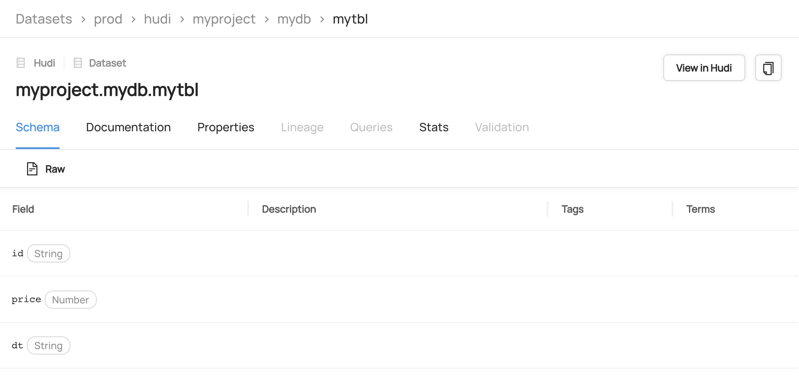
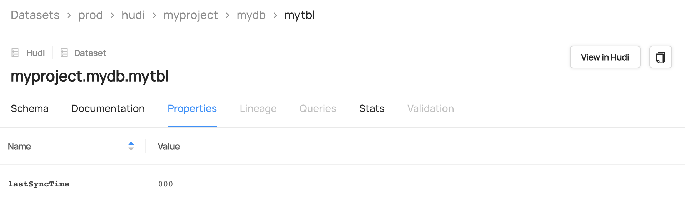
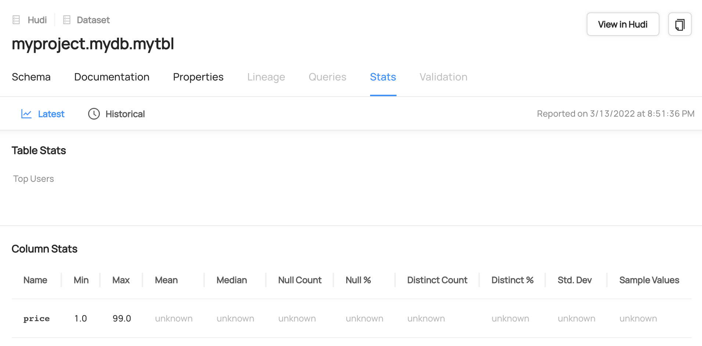

<!--
  Licensed to the Apache Software Foundation (ASF) under one or more
  contributor license agreements.  See the NOTICE file distributed with
  this work for additional information regarding copyright ownership.
  The ASF licenses this file to You under the Apache License, Version 2.0
  (the "License"); you may not use this file except in compliance with
  the License.  You may obtain a copy of the License at

       http://www.apache.org/licenses/LICENSE-2.0

  Unless required by applicable law or agreed to in writing, software
  distributed under the License is distributed on an "AS IS" BASIS,
  WITHOUT WARRANTIES OR CONDITIONS OF ANY KIND, either express or implied.
  See the License for the specific language governing permissions and
  limitations under the License.
-->

# RFC-49: Support sync with DataHub


## Proposers
- @xushiyan

## Approvers
 - @vinothchandar 
 - @Sivabalan

## Status

JIRA: [HUDI-3468](https://issues.apache.org/jira/browse/HUDI-3468)

## Overview

Support sync with [DataHub](https://datahubproject.io/) to provide rich metadata capabilities for Hudi tables.

> DataHub is an open-source metadata platform for the modern data stack.

Read more in https://datahubproject.io/docs/#introduction

## Implementation

To sync with DataHub, we can make use of existing `hudi-sync` abstraction by extending `org.apache.hudi.sync.common.AbstractSyncTool`.

The sync mechanism can be implemented via [Java Emitter](https://datahubproject.io/docs/metadata-integration/java/as-a-library). The main work is about 

- take in user's configurations to connect to an existing DataHub instance
- compose desired metadata for sync based on [DataHub's metadata model](https://datahubproject.io/docs/metadata-modeling/metadata-model)

## Configurations

Necessary configurations will be added using pattern `hoodie.sync.datahub.*` to connect to the user-operated DataHub instance.

## Metadata Model

A Hudi table maps to a [Dataset entity](https://datahubproject.io/docs/generated/metamodel/entities/dataset) in DataHub.

#### Identifier

A Dataset can be identified by urn consists of [Data Platform](https://datahubproject.io/docs/generated/metamodel/entities/dataplatform) (default `hudi`), table identifier (`<db>.<table>`), and optional/configurable environment suffix. An example:

```text
urn:li:dataset:(urn:li:dataPlatform:hudi,mydb,mytable,prod)
```

#### Schema

Schema can be sync'ed via the `SchemaMetadata` aspect. `platformSchema` (raw schema) will be sync'ed using the avro schema string persisted in the commit metadata.



#### Dataset Properties

Key-value table properties, e.g., last sync'ed commit timestamp, can be sync'ed via the `DatasetProperties` aspect.



#### Column Stats

Column stats, e.g., min/max value of selected fields, can be retrieved from Hudi metadata table's column stats partition, and sync'ed via the `fieldProfiles` of `DatasetProfile` aspect.



## Rollout/Adoption Plan

This is a new feature to be enabled by configuration. Users can choose to turn on or off at any time. This feature won't interfere with existing Hudi tables' operations.

## Test Plan

- Unit tests
- Run a PoC setup with DataHub integration to verify the desired metadata are sync'ed
