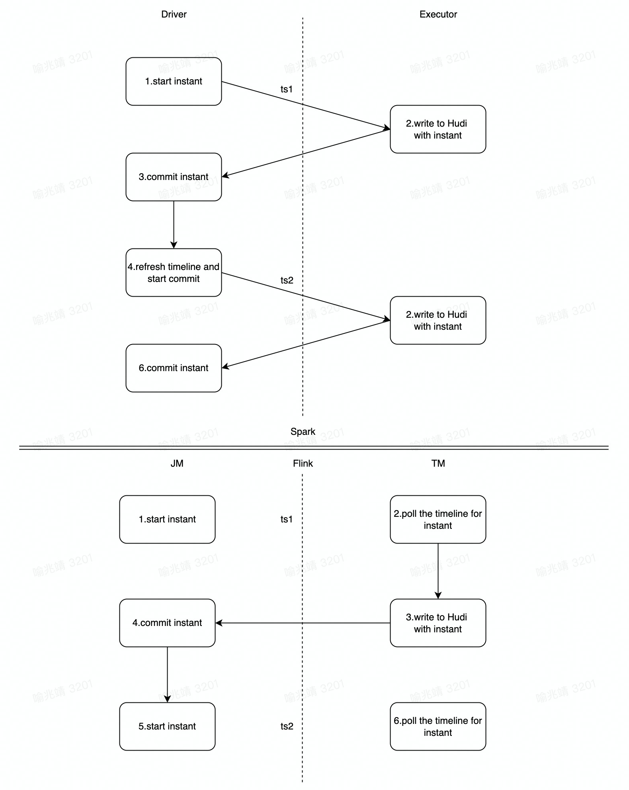
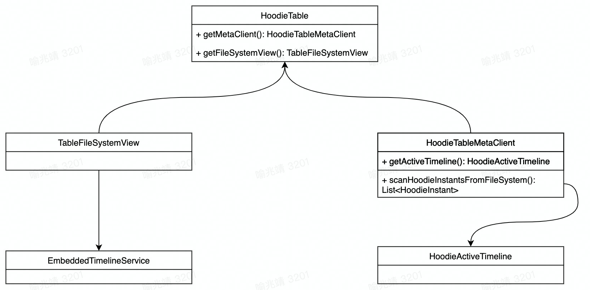
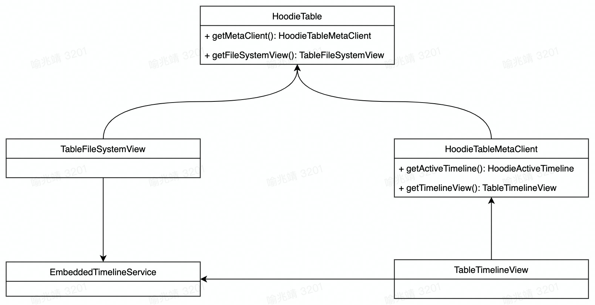
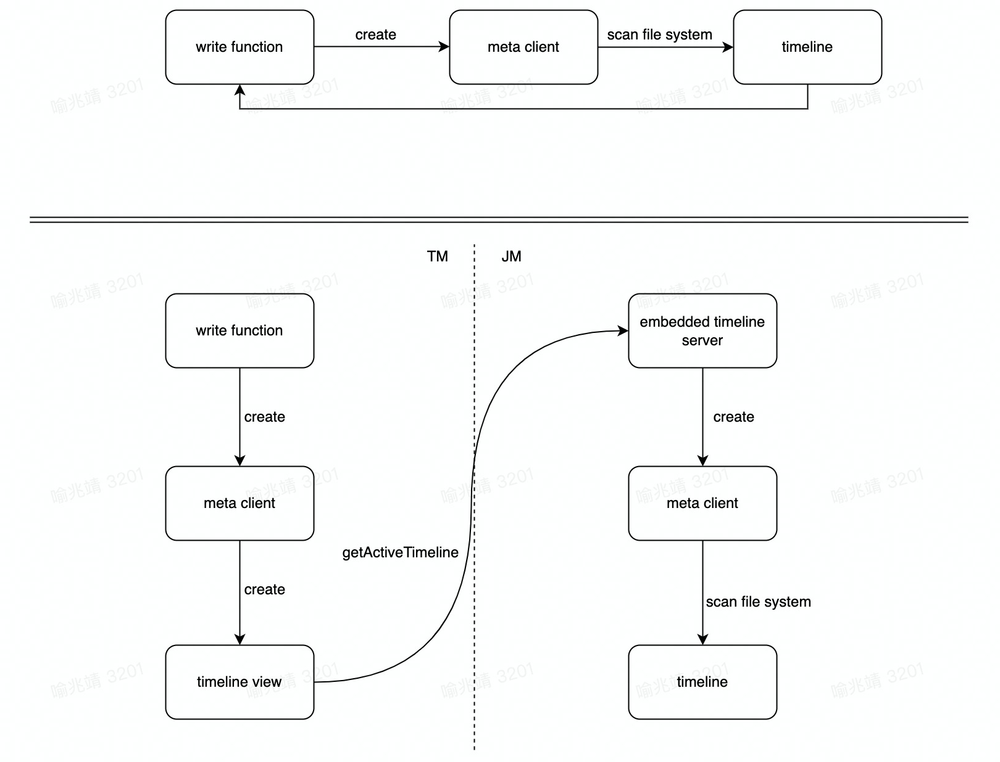

<!--
  Licensed to the Apache Software Foundation (ASF) under one or more
  contributor license agreements.  See the NOTICE file distributed with
  this work for additional information regarding copyright ownership.
  The ASF licenses this file to You under the Apache License, Version 2.0
  (the "License"); you may not use this file except in compliance with
  the License.  You may obtain a copy of the License at

       http://www.apache.org/licenses/LICENSE-2.0

  Unless required by applicable law or agreed to in writing, software
  distributed under the License is distributed on an "AS IS" BASIS,
  WITHOUT WARRANTIES OR CONDITIONS OF ANY KIND, either express or implied.
  See the License for the specific language governing permissions and
  limitations under the License.
-->

# RFC-50: Improve Timeline Server

## Proposers
- @yuzhaojing

## Approvers
 - @xushiyan
 - @danny0405

## Abstract

Support client to obtain timeline from timeline server.

## Background

At its core, Hudi maintains a timeline of all actions performed on the table at different instants of time. Before each operation is performed on the Hoodie table, the information of the HUDI table needs to be obtained through the timeline. At present, there are two ways to obtain the timeline of HUDI :
- Create a MetaClient and get the complete timeline through MetaClient #getActiveTimeline, which will directly scan the HDFS directory of metadata
- Get the timeline through FileSystemView#getTimeline. This timeline is the cache timeline obtained by requesting the Embedded timeline service. There is no need to repeatedly scan the HDFS directory of metadata, but this timeline only contains completed instants

### Problem description

- HUDI designs the Timeline service for processing and caching when accessing metadata , but currently does not converge all access to metadata to the Timeline service, such as the acquisition of a complete timeline.
- When the number of tasks written increases, a large number of repeated access to metadata will lead to high HDFS NameNode requests, causing greater pressure and not easy to expand.

### Spark and Flink write flow comparison diagram

Since Hudi is designed based on the Spark micro-batch model, in the Spark write process, all operations on the timeline are completed on the driver side, and then distributed to the executor side to start the write operation.

But for Flink , Write tasks are resident services due to their pure streaming model. There is also no highly reliable communication mechanism between the user-side JM and the TM in Flink, so the TM needs to obtain the latest instant by polling the timeline for writing.

### Current

The current design implementation has two main problems with the convergence timeline
- Since the timeline of the task is pulled from the Embedded timeline service, the refresh mechanism of the Embedded timeline service itself will doesn't work
- MetaClient and HoodieTable are decoupled. Obtain the timeline in MetaClient and then request the Embedded timeline service to obtain file-related information through the FileSystemViewManager in HoodieTable combined with the timeline. There are circular dependencies and problems in the case of using MetaClient alone without creating HoodieTable

## Implementation

### Design target

The goal of this solution is to converge the acquisition of timelines and obtain them through the Embedded timeline service uniformly. The timeline is pulled through HDFS only when the Embedded timeline service is not started.

### Converge the request to loop instant in Flink to JM

- Store the latest instant on the Embedded Timeline Server. Every time JM modifies the instant state, it actively performs a sync to Embedded Timeline Server
- Return the latest instant directly when the task pulls the latest instant

### Converge the request to pull instant in meta  client initialization to JM

- Abstract the timeline-related acquisition methods into the new interface TableTimelineView, and create the corresponding TimelineViewManager in MetaClient, and obtain the timeline through TimelineViewManager.

### Flink optimization before and after schematic diagram

## Rollout/Adoption Plan

- What impact (if any) will there be on existing users?
    - Since the Embedded Timeline Service is used to pull the timeline, users who use flink to write to hudi will observe that file system requests are greatly reduced, thereby reducing the pressure on the file system. 
    - However, in a scenario with a relatively high degree of parallelism, it may be necessary to increase the resources of JM to ensure the effectiveness of the response
- If we are changing behavior how will we phase out the older behavior?
    - Add a configuration to control this behavior
- If we need special migration tools, describe them here.
    - No special migration tools will be necessary
- When will we remove the existing behavior
    - In subsequent releases (1.0 or later)
## Test Plan

Test plan
No additional regression testing is required, as the behavior of MetaClient's active timeline has not been changed
