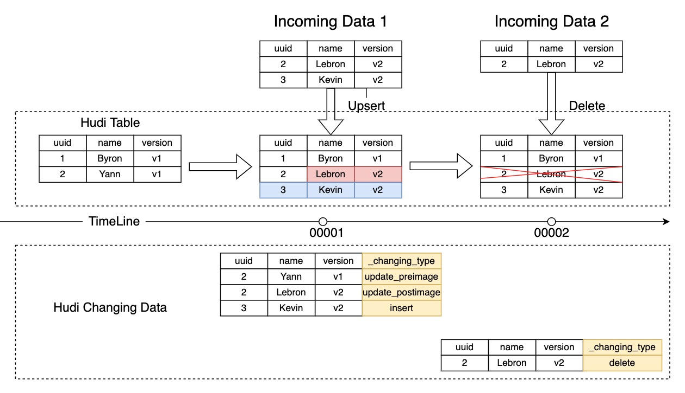
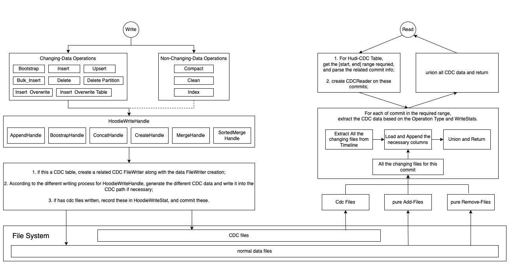
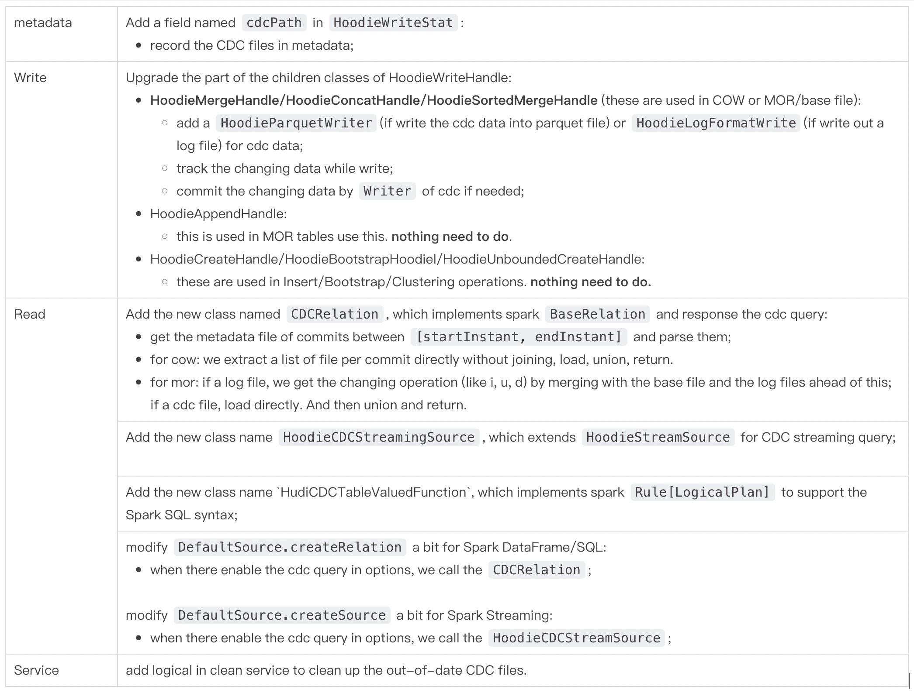
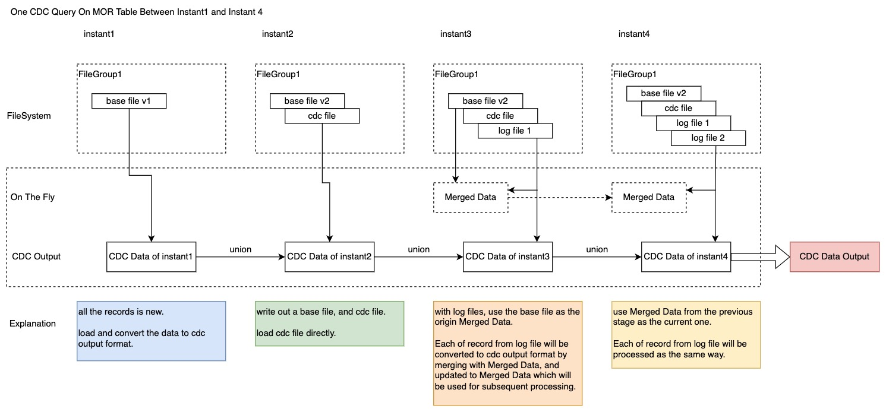

<!--
  Licensed to the Apache Software Foundation (ASF) under one or more
  contributor license agreements.  See the NOTICE file distributed with
  this work for additional information regarding copyright ownership.
  The ASF licenses this file to You under the Apache License, Version 2.0
  (the "License"); you may not use this file except in compliance with
  the License.  You may obtain a copy of the License at

       http://www.apache.org/licenses/LICENSE-2.0

  Unless required by applicable law or agreed to in writing, software
  distributed under the License is distributed on an "AS IS" BASIS,
  WITHOUT WARRANTIES OR CONDITIONS OF ANY KIND, either express or implied.
  See the License for the specific language governing permissions and
  limitations under the License.
-->

# RFC-50: Hudi CDC

# Proposers

- @Yann Byron

# Approvers

- @Raymond

# Statue
JIRA: [https://issues.apache.org/jira/browse/HUDI-3478](https://issues.apache.org/jira/browse/HUDI-3478)

# Hudi Supports Change-Data-Capture

## Abstract

We want to introduce the Change-Data-Capture(CDC) capacity that make hudi can produce the changeing data by which we can know how the records is changed, to response the CDC cases.


## Background

In some use cases where hudi tables is used as streaming source, We want to be aware every records' changing in one commit exactly. In a certain commit or snapshot, which records are inserted, which records are deleted, and which records are updated. Even for the updated records, both the old value before updated and the new value after updated are needed.

To implement this capacity, we have to upgrade the write and read parts. Let hudi can figure out the changing data when read. And in some cases, writing the extra data to help querying the changing data if necessary.

## Scenario Definition

Here use a simple case to explain the CDC.



Here we follow the debezium output format, there are four columns shown:
- op: the operation of this record;
- ts_ms: the timestamp;
- source: source information such as the name of database and table. **Maybe we don't need this column in Hudi**;
- before: the previous image before this operation;
- after: the current image after this operation;

`op` column has three enum values:
- i: represent `insert`; when `op` is `i`, `before` is always null;
- u: represent `update`; when `op` is `u`, both `before` and `after` don't be null;
- d: represent `delete`; when `op` is `d`, `after` is always null;

Notice:
Here the illustration ignores all the metadata columns in `before` and `after` columns like `_hoodie_commit_time`.

## Goals

1. Support row-level CDC records generation and persistence;
2. Support both MOR and COW tables;
3. Support all the write operations;
4. Support Spark DataFrame/SQL/Streaming Query;

## Implementation
### CDC Architecture



Notice:
Other operations like `Compact`, `Clean`, `Index` do not write/change any data. So we don't need to consider in CDC scenario.
 
### Points to be upgraded



### Config Definitions

|  | default |  |
| --- | --- | --- |
| hoodie.table.cdf.enabled | false | `true` represents the table to be used for CDC queries and will write cdc data if needed. |
|  |  |  |
| hoodie.datasource.read.cdc.enabled | false | if true, return the CDC data. |
| hoodie.datasource.read.start.timestamp | - | requried. |
| hoodie.datasource.read.end.timestamp | - | optional. |


### Write

Hoodie writes data by `HoodieWriteHandle`.
We notice that only `HoodieMergeHandle` and it's subclasses will receive both the old record and the new-coming record at the same time, merge and write.
So we will add a `LogFormatWriter` in these classes. If there is CDC data need to be written out, then call this writer to write out a log file which consist of, maybe `CDCBlock`.
The CDC log file will be placed in the same position as the base files and other log files, so that the clean service can clean up them without extra work. The file structure is like:

```
hudi_cdc_table/
    .hoodie/
        hoodie.properties
        00001.commit
        00002.replacecommit
        ...
    year=2021/
        filegroup1-instant1.parquet
        .filegroup1-instant1.log
    year=2022/
        filegroup2-instant1.parquet
        .filegroup2-instant1.log
    ...
```
Inside of one partition directory, the `.log` file with `CDCBlock` above will keep the changing data we have to materialize.

One Design Idea is that **Write CDC files as little as possible, and reuse data files as much as possible**.

As the idea, there are four file types visible for CDC:

- CDC File: Record all the related changing data with the cdc schema for one commit. For the following cases, will generate the CDC file:
   - `UPSERT` operation;
   - `DELETE` operation and the files where the data to be deleted resides has other data that doesn't need to be deleted and need to be rewrited.
- pure Add-File: all the data in this file ars incoming, and don't affect the existing data and files. In the following cases, we do not have data to be rewrited and need to write CDC data to the CDC file:
   - `BUIK_INSERT` operation;
   - `INSERT`operation;
   - `BOOTSTRAP` operation;
   - `INSERT_OVERWRITE` and `INSERT_OVERWRITE_TABLE` operations;
- pure Remove-File: all the data in the file will be deleted, and don't affect the existing data and files. In the following cases, we also do not have data to be rewrited:
   - `DELETE`operation and no old data should be rewrite.
   - `DELETE_PARTITION` operation;
- Log-File: this will be written out when writing to the MOR tables.

Notice:

- **Only CDC File is a new file type and written out by CDC**. The pure Add-File, pure Remove-File and Log-File are just representations of the existing data files in the CDC scenario. For some examples:
   - `INSERT` operation will create a list of new data files. Each of these can be considered a pure Add-File.
   - `DELETE_PARTITION` operation will delete a group of data files. Each of these can be considered a pure Remove-File.
- For a single commit, if CDC files is existed, we just load CDC files to response. If no any CDC files, extract the list of other types of files, load (or merge for mor tables) these files and response CDC query.
- every CDC file must be related to a commit. Here I think both the parquet format and the log file format are ok to storage the cdc data.


### Read

This part just discuss how to make Spark (including Spark DataFrame, SQL, Streaming) to read the Hudi CDC data.

Implement `CDCReader` that do these steps to response the CDC request:

- judge whether this is a table that has enabled `hoodie.table.cdf.enabled`, and the query range is valid.
- extract and filter the commits needed from `ActiveTimeline`.
- For each of commit, get and load (and merge for mor tables) the changing files, union and return `DataFrame`.

```scala
class CDCReader(
  metaClient: HoodieTableMetaClient,
  options: Map[String, String],
) extends BaseRelation with PrunedFilteredScan {

  override def schema: StructType = {
  // 'op', 'source', 'mt_ms', 'before', 'after'
  }
  
  override def buildScan(
    requiredColumns: Array[String],
    filters: Array[Filter]): RDD[Row] = {
  // ...
  }

}
```

Notice:

- Only instants that are active can be queried in a CDC scenario.
- `CDCReader` manages all the things on CDC, and all the spark entrances(DataFrame, SQL, Streaming) call the functions in `CDCReader`.

#### COW table

Just follow the above steps without further consideration.

#### MOR table

According to the design of the writing part, only the cases where writing mor tables will write out the base file (which call the `HoodieMergeHandle` and it's subclasses) will write out the cdc files.
In other words, cdc files will be written out only for the index and file size reasons.

Here use an illustration to explain how we can query the CDC on MOR table in kinds of cases.



####Syntax

Spark DataFrame Syntax:
```scala
spark.read.format("hudi").
  option("hoodie.datasource.read.cdc.enabled", "true").
  option("hoodie.datasource.read.start.timestamp", "20220426103000000").
  option("hoodie.datasource.read.start.timestamp", "20220426113000000").
  load("/path/to/hudi")
```

Spark SQL Syntax:
```sql
-- query the CDC data between 20220426103000000 and 20220426113000000;
select * 
from hudi_table_changes("hudi_cdc_table", "20220426103000000", "20220426113000000");

-- query the CDC data since 20220426103000000;
select * 
from hudi_table_changes("hudi_cdc_table", "20220426103000000");

```

Spark Streaming Sytax:
```scala
val df = spark.readStream.format("hudi").
  option("hoodie.datasource.read.cdc.enabled", "true").
  load("/path/to/hudi")

// launch a streaming which start from the current snapshot of hudi table,
// and output at the console.
val stream = df.writeStream.format("console").start
```

# Rollout/Adoption Plan
This is a new feature that can enable CDF and CDC query, does not impact existing jobs and tables. Also this dos not depend on Spark versions.
# Test Plan

- [ ] Unit tests for this
- [ ] Prodect integration test
- [ ] Benchmark snapshot query for large tables

