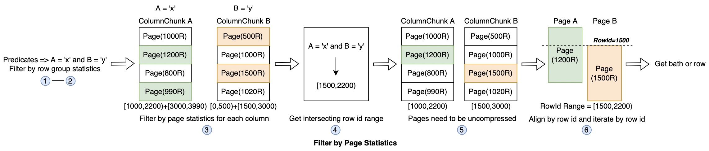
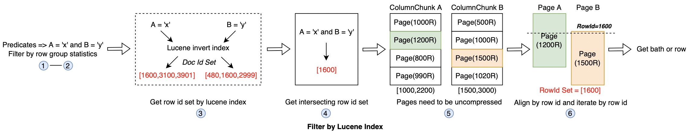

<!--
  Licensed to the Apache Software Foundation (ASF) under one or more
  contributor license agreements.  See the NOTICE file distributed with
  this work for additional information regarding copyright ownership.
  The ASF licenses this file to You under the Apache License, Version 2.0
  (the "License"); you may not use this file except in compliance with
  the License.  You may obtain a copy of the License at

       http://www.apache.org/licenses/LICENSE-2.0

  Unless required by applicable law or agreed to in writing, software
  distributed under the License is distributed on an "AS IS" BASIS,
  WITHOUT WARRANTIES OR CONDITIONS OF ANY KIND, either express or implied.
  See the License for the specific language governing permissions and
  limitations under the License.
-->
# RFC-51: Introduce Secondary Index to Improve HUDI Query Performance

## Proposers

- @huberylee
- @hujincalrin
- @XuQianJin-Stars
- @YuweiXiao
- @stream2000

## Approvers
 - @vinothchandar
 - @xushiyan
 - @leesf

## Status

JIRA: [HUDI-3907](https://issues.apache.org/jira/browse/HUDI-3907)

More details about current implementation of secondary index please refer to
[pull-3508](https://github.com/apache/hudi/pull/3508).

## Abstract

In query processing, we need to scan many blocks in HUDI table. However, most of them may not
match the query even after using column statistic info in metadata table, row group level or
page level statistics in parquet file, etc.

Total size of reading blocks determines the query speed, how to save IO has become
the key point to improving query performance.

## Background
Many works have been carried out to optimize reading HUDI table parquet file.

Since Spark 3.2.0, with the power of parquet column index, page level statistics info can be used
to filter data, and the process of reading data can be described as follows:
 
- Step1: Comparing the inclusion relation of row group data's middle position and task split info
   to decided which row groups should be handled by current task. If the row group data's middle
   position is contained by task split, the row group should be handled by this task;
- Step2: Using pushed down predicates and row group level column statistics info to pick out hit
   row groups;
- Step 3: Filtering page by page level statistics for each column predicates, then get hit row id set
for every column independently; 
- Step 4: Getting final hit row id ranges by combining all column hit rows, then get final hit
pages for every column; 
- Step 5: Loading and uncompressing hit pages for every requested columns; 
- Step 6: Reading data by hit row id ranges;




## Insufficiency
Although page level statistics can greatly save IO cost, there is still some  irrelevant data be read out.

We may need a way to get exactly row data we need to minimize the amount of reading blocks.
Thus, we propose a Secondary Index structure to only read the rows we care about to
speed up query performance.

## Architecture
The main structure of secondary index contains 4 layers
1. SQL Parser layer: SQL command for user to create/drop/alter/show/..., for managing Record Level Index
2. Optimizer layer: Pick up the best physical/logical plan for a query using RBO/CBO/HBO etc
3. Standard API interface layer: provides standard interfaces for upper-layer to invoke, such as createIndex, getRowIdSet and so on
4. IndexManager Factory layer: many kinds of Record Level Index implementations for users to choice, 
   such as HBase based, Lucene based, B+ tree based, etc
5. Index Implementation layer:  provides the ability to read, write and manage the underlying index


## Differences between Secondary Index and HUDI Record Level Index
Before discussing secondary index, let's take a look at Record Level Index. Both of the index
can filter useless data blocks, there are still many differences between them.

At present, record level index in hudi ([RFC-08](https://cwiki.apache.org/confluence/display/HUDI/RFC-08++Record+level+indexing+mechanisms+for+Hudi+datasets), ongoing)
is mainly implemented for ``tagLocation`` in write path.
Secondary index structure will be used for query acceleration in read path, but not in write path.

If Record Level Index is applied in read path for query with RecordKey predicate, it can only be
used to filter useless FileID, but can not get the exact set of rows we need, and this is the advantage
of secondary index.

# Implementation
### SQL layer
xxx

### Optimizer layer
For the convenience of implementation, we can implement the first phase based on RBO(rule-based optimizer), 
and then gradually expand and improve CBO and HBO based on the collected statistical information.

### Standard API layer
The standard API may contain followings:

```
// get row id set for the specified table with predicates
Set<RowId> getRowIdSet(HoodieTable table, Map<column, List<PredicateList>> columnToPredicates ..)

// create index
boolean createIndex(HoodieTable table, List<Column> columns, List<IndexType> indexTypes)

// build index for the specified table
boolean buildIndex(HoodieTable table, InstantTime instant)

// drop index
boolean dropIndex(HoodieTable table, List<Column> columns)

...
```

### Index implementation layer


## read index

## build index

## index retention

## Lucene Secondary Index Implementation
Record level index is a base file level index, which means each base file has its own index. 
When running a query(with one predicate), we do steps:
1.get the row id set using Lucene index;
2.read details by row id without unnecessary data being read;

If query has multi predicates, we only need to add one step between step1 and step2, to union or intersect all row id sets.

It can be used in the following scenarios:
2. query with , such as select col1, col2 from testTable where col3 = 'xxx';
3. query with multiple predicate
In some specific scenarios, row id is enough to do the right thing, such as judging whether specific record 
exists. Next, we will discuss the detailed implementation of lucene based record level index 
from three parts *Index Generation & Update*, *Index Storage* and *Index Usage*.


### Index Management(Generation & Update)
In lucene based record level index, we mainly use inverted index to speed up record lookup, 
inverted index stores a mapping from doc id set to specific value. Now, we simply explain the 
whole concept with an example. Let's assume we have a ``test`` table in our hoodie dataset,
here is what the table will look like:

| msg               | sender |
|-------------------|--------|
| Summer is coming  | UserA  |
| Buying a new car  | UserA  |
| Buying a new home | UserB  |

After indexing ``test`` table with lucene, we will get inverted index for every field in this
table. Inverted index for field ``msg``:

| term   | doc id |
|--------|--------|
| Summer | 1      |
| is     | 1      |
| coming | 1      |
| Buying | 2,3    |
| a      | 2,3    |
| new    | 2,3    |
| car    | 2      |
| home   | 3      |

Inverted index for field ``sender``:

| term  | doc id |
|-------|--------|
| UserA | 1,2    |
| UserB | 3      |

When querying ``test`` table with predicates ``msg like 'Buying%' and sender = 'UserA'``, we
can quickly get hit row ``2,3 & 1,2 => 2``, then read details with rowId = 2.

There are two ways to implement lucene index generation and update in hoodie, the first one 
is to listen table commit event, every commit event will trigger indexing files which have 
been modified. Another approach is to trigger index builds through clustering.

### Index Storage & Clean
Lucene index files are saved in ``.hoodie/.index/lucene/${instant}/${fileId}/`` dir, we can
directly obtain the index file path based on the file name in the process of querying. The 
retention time of the index is the same as that of hoodie instant, when cleaning instants, 
the index files under corresponding index dir will be cleaned together.

### Index Usage
Lucene index can be used in ``tagLocation``, existential judgment and normal queries. When using
lucene index to query data, candidate files should be found out as what they do now firstly,
then index files are loaded to lookup hit rows according to the base file names.

For query scenarios like existential judgment and ``tagLocation``, point query predicates are 
constructed to get row id set, if no records hit, empty row id set will be returned. Different 
from the above scenario, normal queries use pushed down predicates to query lucene index to 
get row id set, then combining with parquet page level statistics to load specific pages. Once 
hit rows and pages are ready, we can iterate by row id and get exactly rows from corresponding 
page. The mainly steps can be described as follows:

- Step 1-2 are the same as in [Process A](#process_a);
- Step 3: Querying lucene index to get hit row id set for each column predicates;
- Step 4: Getting final hit row id set by combining all column hit row id set;
- Step 5: Loading and uncompressing hit pages for every requested columns;
- Step 6: Aligning hit row id between different columns' pages, then reading data by row id;



By using lucene based record level index, we can exactly read what we want from parquet file.

## Rollout/Adoption Plan

 - No effects on existing users, but if existing users want to use lucene index, they can 
manually add lucene index for columns

## Test Plan

Describe in few sentences how the RFC will be tested. How will we know that the implementation works as expected? How will we know nothing broke?.
