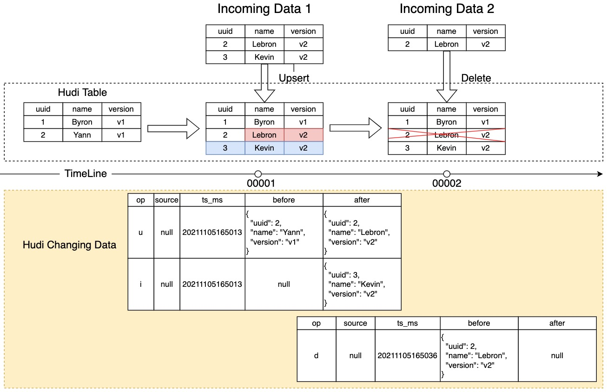
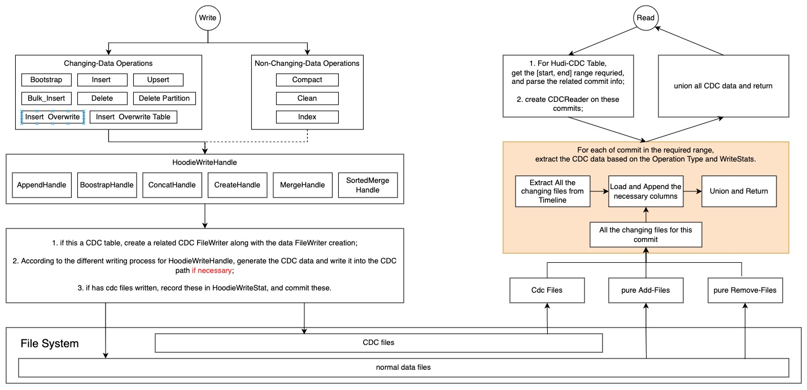
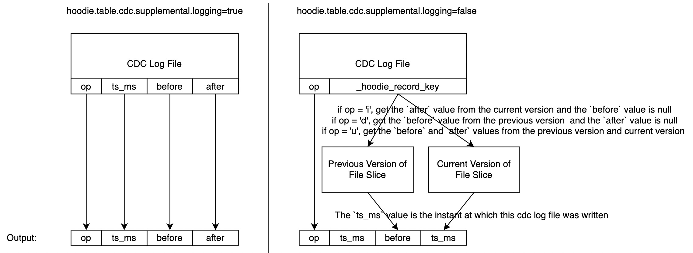
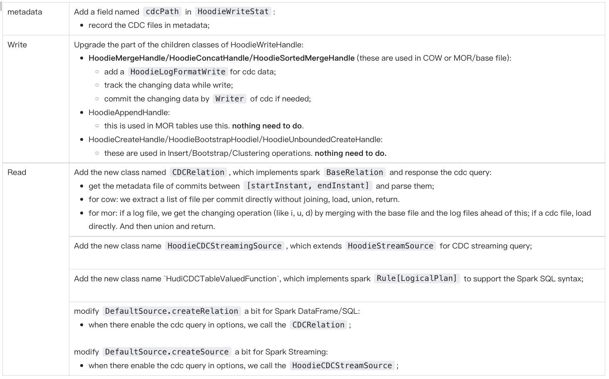

<!--
  Licensed to the Apache Software Foundation (ASF) under one or more
  contributor license agreements.  See the NOTICE file distributed with
  this work for additional information regarding copyright ownership.
  The ASF licenses this file to You under the Apache License, Version 2.0
  (the "License"); you may not use this file except in compliance with
  the License.  You may obtain a copy of the License at

       http://www.apache.org/licenses/LICENSE-2.0

  Unless required by applicable law or agreed to in writing, software
  distributed under the License is distributed on an "AS IS" BASIS,
  WITHOUT WARRANTIES OR CONDITIONS OF ANY KIND, either express or implied.
  See the License for the specific language governing permissions and
  limitations under the License.
-->

# RFC-50: Hudi to support Change-Data-Capture

# Proposers

- @Yann Byron

# Approvers

- @Raymond
- @Vinoth
- @Danny
- @Prasanna

# Statue
JIRA: [https://issues.apache.org/jira/browse/HUDI-3478](https://issues.apache.org/jira/browse/HUDI-3478)

# Hudi to Support Change-Data-Capture

## Abstract

The Change-Data-Capture (CDC) feature enables Hudi to show how records were changed by producing the changes and therefore to handle CDC query usecases.

## Background

In cases where Hudi tables used as streaming sources, we want to be aware of all records' changes in one commit exactly, as in which records were inserted, deleted, and updated. And for updated records, the old values before update and the new ones after.

To implement this feature, we need to implement the logic on the write and read path to let Hudi figure out the changed data when read. In some cases, we need to write extra data to help optimize CDC queries.

## Scenario Illustration

The diagram below illustrates a typical CDC scenario.



We follow the debezium output format: four columns as shown below

- op: the operation of this record;
- ts_ms: the timestamp;
- source: source information such as the name of database and table. **Maybe we don't need this column in Hudi**;
- before: the previous image before this operation;
- after: the current image after this operation;

`op` column has three enum values:

- i: represent `insert`; when `op` is `i`, `before` is always null;
- u: represent `update`; when `op` is `u`, both `before` and `after` don't be null;
- d: represent `delete`; when `op` is `d`, `after` is always null;

Note: the illustration here ignores all the Hudi metadata columns like `_hoodie_commit_time` in `before` and `after` columns.

## Design Goals

1. Support row-level CDC records generation and persistence
2. Support both MOR and COW tables
3. Support all the write operations
4. Support incremental queries in CDC format across supported engines

## Configurations

| key                                                 | default  | description                                                                                                                                                                                                                                                                                                          |
|-----------------------------------------------------|----------|----------------------------------------------------------------------------------------------------------------------------------------------------------------------------------------------------------------------------------------------------------------------------------------------------------------------|
| hoodie.table.cdc.enabled                            | `false`  | The master switch of the CDC features. If `true`, writers and readers will respect CDC configurations and behave accordingly.                                                                                                                                                                                        |
| hoodie.table.cdc.supplemental.logging.mode          | `KEY_OP` | A mode to indicate the level of changed data being persisted. At the minimum level, `KEY_OP` indicates changed records' keys and operations to be persisted. `DATA_BEFORE`: persist records' before-images in addition to `KEY_OP`. `DATA_BEFORE_AFTER`: persist records' after-images in addition to `DATA_BEFORE`. |

To perform CDC queries, users need to set `hoodie.datasource.query.incremental.format=cdc` and `hoodie.datasource.query.type=incremental`.

| key                                        | default        | description                                                                                                                          |
|--------------------------------------------|----------------|--------------------------------------------------------------------------------------------------------------------------------------|
| hoodie.datasource.query.type               | `snapshot`     | set to `incremental` for incremental query.                                                                                          |
| hoodie.datasource.query.incremental.format | `latest_state` | `latest_state` (current incremental query behavior) returns the latest records' values. Set to `cdc` to return the full CDC results. |
| hoodie.datasource.read.start.timestamp     | -              | requried.                                                                                                                            |
| hoodie.datasource.read.end.timestamp       | -              | optional.                                                                                                                            |

### Logical File Types

We define 4 logical file types for the CDC scenario.

- CDC_LOG_File: a file consists of CDC Blocks with the changing data related to one commit.
  - For COW tables, this file type refers to newly written log files alongside base files. The log files in this case only contain CDC info.
  - For MOR tables, this file type refers to the typical log files in MOR tables. CDC info will be persisted as log blocks in the log files.
- ADD_BASE_File: a normal base file for a specified instant and a specified file group. All the data in this file are new-incoming. For example, we first write data to a new file group. So we can load this file, treat each record in this as the value of `after`, and the value of `op` of each record is `i`.
- REMOVE_BASE_FILE: a normal base file for a specified instant and a specified file group, but this file is empty. A file like this will be generated when we delete all the data in a file group. So we need to find the previous version of the file group, load it, treat each record in this as the value of `before`, and the value of `op` of each record is `d`.
- REPLACED_FILE_GROUP: a file group that be replaced totally, like `DELETE_PARTITION` and `INSERT_OVERWRITE` operations. We load this file group, treat all the records as the value of `before`, and the value of `op` of each record is `d`.

Note:

**`CDC_LOG_File` is a new file type and written out for CDC**. `ADD_BASE_File`, `REMOVE_BASE_FILE`, and `REPLACED_FILE_GROUP` represent the existing data files in the CDC scenario. 

For examples:
- `INSERT` operation will maybe create a list of new data files. These files will be treated as ADD_BASE_FILE;
- `DELETE_PARTITION` operation will replace a list of file slice. For each of these, we get the cdc data in the `REPLACED_FILE_GROUP` way.

## When `supplemental.logging.mode=KEY_OP`

In this mode, we minimized the additional storage for CDC information.

- When write, only the change type `op`s and record keys are persisted.
- When read, changed info will be inferred on-the-fly, which costs more computation power. As `op`s and record keys are
  available, inference using current and previous committed data will be optimized by reducing IO cost of reading
  previous committed data, i.e., only read changed records.

The detailed logical flows for write and read scenarios are the same regardless of `logging.mode`, which will be
illustrated in the section below.

## When `supplemental.logging.mode=DATA_BEFORE` or `DATA_BEFORE_AFTER`

Overall logic flows are illustrated below.



### Write

Hudi writes data by `HoodieWriteHandle`. We notice that only `HoodieMergeHandle` and its subclasses will receive both
the old record and the new-coming record at the same time, merge and write. So we will add a `LogFormatWriter` in these
classes. If there is CDC data need to be written out, then call this writer to write out a log file which consist
of `CDCBlock`. The CDC log file will be placed in the same position as the base files and other log files, so that the
clean service can clean up them without extra work. The file structure is like:

```
hudi_cdc_table/
    .hoodie/
        hoodie.properties
        00001.commit
        00002.replacecommit
        ...
    year=2021/
        filegroup1-instant1.parquet
        .filegroup1-instant1.log
    year=2022/
        filegroup2-instant1.parquet
        .filegroup2-instant1.log
    ...
```

Under a partition directory, the `.log` file with `CDCBlock` above will keep the changing data we have to materialize.

#### Persisting CDC in MOR: Write-on-indexing vs Write-on-compaction

2 design choices on when to persist CDC in MOR tables:

Write-on-indexing allows CDC info to be persisted at the earliest, however, in case of Flink writer or Bucket
indexing, `op` (I/U/D) data is not available at indexing.

Write-on-compaction can always persist CDC info and achieve standardization of implementation logic across engines,
however, some delays are added to the CDC query results. Based on the business requirements, Log Compaction (RFC-48) or
scheduling more frequent compaction can be used to minimize the latency.

The semantics we propose to establish are: when base files are written, the corresponding CDC data is also persisted.

- For Spark
  - inserts are written to base files: the CDC data `op=I` will be persisted
  - updates/deletes that written to log files are compacted into base files: the CDC data `op=U|D` will be persisted
- For Flink
  - inserts/updates/deletes that written to log files are compacted into base files: the CDC data `op=I|U|D` will be
    persisted

In summary, we propose CDC data to be persisted synchronously upon base files generation. It is therefore
write-on-indexing for Spark inserts (non-bucket index) and write-on-compaction for everything else.

Note that it may also be necessary to provide capabilities for asynchronously persisting CDC data, in terms of a
separate table service like `ChangeTrackingService`, which can be scheduled to fine-tune the CDC-persisting timings.
This can be used to meet low-latency optimized-read requirements when applicable.

#### Examples

Spark DataSource:

```scala
df.write.format("hudi").
  options(commonOpts)
  option("hoodie.table.cdc.enabled", "true").
  option("hoodie.table.cdc.supplemental.logging.mode", "DATA_AFTER").
  save("/path/to/hudi")
```

Spark SQL:

```sql
-- create a hudi table that enable cdc
create table hudi_cdc_table
(
    id int,
    name string,
    price double,
    ts long
) using hudi
tblproperties (
    'primaryKey' = 'id',
    'preCombineField' = 'ts',
    'hoodie.table.cdc.enabled' = 'true',
    'hoodie.table.cdc.supplemental.logging.mode' = 'DATA_AFTER',
    'type' = 'cow'
)
```

### Read

This section uses Spark (incl. Spark DataFrame, SQL, Streaming) as an example to perform CDC-format incremental queries.

Implement `CDCReader` that do these steps to response the CDC request:

- check if `hoodie.table.cdc.enabled=true`, and if the query range is valid.
- extract and filter the commits needed from `ActiveTimeline`.
- For each of commit, get and load the changing files, union and return `DataFrame`.
  - We use different ways to extract data according to different file types, details see the description about CDC File Type.

```scala
class CDCReader(
  metaClient: HoodieTableMetaClient,
  options: Map[String, String],
) extends BaseRelation with PrunedFilteredScan {

  override def schema: StructType = {
  // 'op', 'source', 'ts_ms', 'before', 'after'
  }
  
  override def buildScan(
    requiredColumns: Array[String],
    filters: Array[Filter]): RDD[Row] = {
  // ...
  }

}
```

Note:

- Only instants that are active can be queried in a CDC scenario.
- `CDCReader` manages all the things on CDC, and all the spark entrances(DataFrame, SQL, Streaming) call the functions in `CDCReader`.
- If `hoodie.table.cdc.supplemental.logging.mode=KEY_OP`, we need to compute the changed data. The following illustrates the difference.



#### COW table

Reading COW tables in CDC query mode is equivalent to reading MOR tables in RO mode.

#### MOR table

According to the section "Persisting CDC in MOR", CDC data is available upon base files generation.

When incremental-query RT tables, CDC results should be computed by only using log files and the corresponding base
files (current and previous file slices).

When incremental-query RO tables, CDC results should be computed by only using persisted CDC data and the corresponding
base files (current and previous file slices).

Here use an illustration to explain how we can query the CDC on MOR table in kinds of cases.


#### Examples

Spark DataSource

```scala
spark.read.format("hudi").
  option("hoodie.datasource.query.type", "incremental").
  option("hoodie.datasource.query.incremental.format", "cdc").
  option("hoodie.datasource.read.begin.instanttime", "20220426103000000").
  option("hoodie.datasource.read.end.instanttime", "20220426113000000").
  load("/path/to/hudi")
```

Spark SQL

```sql
-- query the CDC data between 20220426103000000 and 20220426113000000;
select * 
from hudi_table_changes("hudi_cdc_table", "20220426103000000", "20220426113000000");

-- query the CDC data since 20220426103000000;
select * 
from hudi_table_changes("hudi_cdc_table", "20220426103000000");

```

Spark Streaming

```scala
val df = spark.readStream.format("hudi").
  option("hoodie.datasource.query.type", "incremental").
  load("/path/to/hudi")

// launch a streaming which starts from the current snapshot of the hudi table,
// and output at the console.
val stream = df.writeStream.format("console").start
```

# Rollout/Adoption Plan

The CDC feature can be enabled by the corresponding configuration, which is default false. Using this feature dos not depend on Spark or Flink versions.

# Test Plan

- Unit tests for this
- Production end-to-end integration test
- Benchmark snapshot query for large tables

# Appendix

## Affected code paths

For `supplemental.logging=true`


