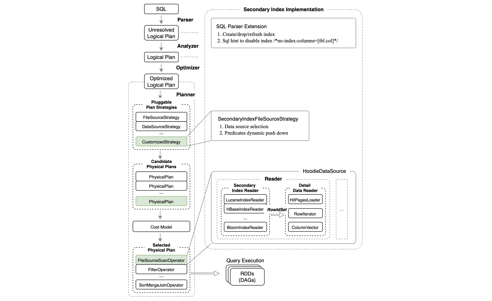
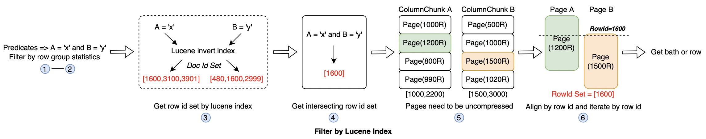

<!--
  Licensed to the Apache Software Foundation (ASF) under one or more
  contributor license agreements.  See the NOTICE file distributed with
  this work for additional information regarding copyright ownership.
  The ASF licenses this file to You under the Apache License, Version 2.0
  (the "License"); you may not use this file except in compliance with
  the License.  You may obtain a copy of the License at

       http://www.apache.org/licenses/LICENSE-2.0

  Unless required by applicable law or agreed to in writing, software
  distributed under the License is distributed on an "AS IS" BASIS,
  WITHOUT WARRANTIES OR CONDITIONS OF ANY KIND, either express or implied.
  See the License for the specific language governing permissions and
  limitations under the License.
-->
# RFC-51: Introduce Secondary Index to Improve HUDI Query Performance

## Proposers

- @huberylee
- @hujincalrin
- @XuQianJin-Stars
- @YuweiXiao
- @stream2000

## Approvers
 - @vinothchandar
 - @xushiyan
 - @leesf

## Status

JIRA: [HUDI-3907](https://issues.apache.org/jira/browse/HUDI-3907)

Documentation Navigation
- [Abstract](#abstract)
- [Background](#background)
- [Insufficiency](#insufficiency)
- [Architecture](#architecture)
- [Differences between Secondary Index and HUDI Record Level Index](#difference)
- [Implementation](#implementation)
  - [SQL Layer](#impl-sql-layer)
  - [Optimizer Layer](#impl-optimizer-layer)
  - [Standard API Layer](#impl-api-layer)
  - [Index Implementation Layer](#imple-index-layer)
    - [KV Mapping](#impl-index-layer-kv-mapping)
    - [Build Index](#impl-index-layer-build-index)
    - [Read Index](#impl-index-layer-read-index)
    - [Index Management](#index-management)
- [Lucene Secondary Index Implementation](#lucene-secondary-index-impl)
  - [Inverted Index](#lucene-inverted-index)
  - [Index Generation](#lucene-index-generation)
  - [Query by Lucene Index](#query-by-lucene-index)


## <a id='abstract'>Abstract</a>
In query processing, we need to scan many data blocks in HUDI table. However, most of them may not
match the query predicate even after using column statistic info in the metadata table, row group level or
page level statistics in parquet files, etc.

The total data size of touched blocks determines the query speed, and how to save IO has become
the key point to improving query performance.

## <a id='background'>Background</a>
Many works have been carried out to optimize reading HUDI table parquet file.

Since Spark 3.2.0, with the power of parquet column index, page level statistics info can be used
to filter data, and the process of reading data can be described as follows(<a id='process-a'>Process A</a>):
- Step1: Comparing the inclusion relation of row group data's middle position and task split info
   to decided which row groups should be handled by current task. If the row group data's middle
   position is contained by task split, the row group should be handled by this task
- Step2: Using pushed down predicates and row group level column statistics info to pick out matched
   row groups
- Step 3: Filtering page by page level statistics for each column predicates, then get matched row id set
for every column independently
- Step 4: Getting final matched row id ranges by combining all column matched rows, then get final matched
pages for every column
- Step 5: Loading and uncompressing matched pages for every requested columns
- Step 6: Reading data by matched row id ranges


## <a id='insufficiency'>Insufficiency</a>
Although page level statistics can greatly save IO cost, there is still some irrelevant data be read out.

We may need a way to get exactly row data we need to minimize the amount of reading blocks.
Thus, we propose a **Secondary Index** structure to only read the rows we care about to
speed up query performance.

## <a id='architecture'>Architecture</a>
The main structure of secondary index contains 4 layers
1. SQL Parser layer: SQL command for user to create/drop/alter/show/..., for managing secondary index
2. Optimizer layer: Pick up the best physical/logical plan for a query using RBO/CBO/HBO etc
3. Standard API interface layer: provides standard interfaces for upper-layer to invoke, such as ``createIndex``, 
``getRowIdSet`` and so on
4. IndexManager Factory layer: many kinds of secondary Index implementations for users to choice, 
   such as HBase based, Lucene based, B+ tree based, etc
5. Index Implementation layer:  provides the ability to read, write and manage the underlying index


## <a id='difference'>Differences between Secondary Index and HUDI Record Level Index</a>
Before discussing secondary index, let's take a look at Record Level Index. Both indexes
can filter useless data blocks, there are still many differences between them.

At present, record level index in hudi 
([RFC-08](https://cwiki.apache.org/confluence/display/HUDI/RFC-08++Record+level+indexing+mechanisms+for+Hudi+datasets), ongoing)
is mainly implemented for ``tagLocation`` in write path.
Secondary index structure will be used for query acceleration in read path, but not in write path.

If Record Level Index is applied in read path for query with RecordKey predicate, it can only filter at file group level,
while secondary index could provide the exact matched set of rows.

For more details about current implementation of record level index, please refer to
[pull-3508](https://github.com/apache/hudi/pull/3508).

## <a id='implementation'>Implementation</a>

### <a id='impl-sql-layer'>SQL Layer</a>
Parsing all kinds of index related SQL(Spark/Flink, etc.), including create/drop/alter index, optimize table, etc.

### <a id='impl-optimizer-layer'>Optimizer Layer</a>
For the convenience of implementation, we can implement the first phase based on RBO(rule-based optimizer),  
and then gradually expand and improve CBO and HBO based on the collected statistical information.

We can define RBO in several ways, for example, SQL with more than 10 predicates does not push down 
to use secondary index, but uses the existing scanning logic. It may be a cost way to use too many
predicates indexes to get row id set.

### <a id='impl-api-layer'>Standard API Layer</a>
The standard APIs are as follows, and subsequent index types(e.g., Hbase/Lucene/B+ tree ...) need to implement these APIs.

```
// Get row id set for the specified table with predicates
Set<RowId> getRowIdSet(HoodieTable table, Map<column, List<PredicateList>> columnToPredicates ..)

// Create index
boolean createIndex(HoodieTable table, List<Column> columns, List<IndexType> indexTypes)

// Build index for the specified table
boolean buildIndex(HoodieTable table, InstantTime instant)

// Drop index
boolean dropIndex(HoodieTable table, List<Column> columns)

...
```

### <a id='imple-index-layer'>Index Implementation Layer</a>
The role of the secondary index is to provide a mapping from a column or column combination value to 
specified rows, so that it is convenient to find the result row that meets the requirements according to 
this index during query, so as to obtain the final data rows.

#### <a id='impl-index-layer-kv-mapping'>KV Mapping</a>
In mapping 'column value->row', we can use rowId or primary key(RecordKey) to identify one unique row.
Considering the memory saving and the efficiency of row set merging, we choose rowId. 
Cause row id of all columns is aligned in row group, we can get row data by row id directly. 

#### <a id='impl-index-layer-build-index'>Build Index</a>
**trigger time**

When one column's secondary index enabled, we need to build index for it automatically. Index building may
consume a lot of CPU and IO resources. So, build index while compaction/clustering executing is a good solution, 
after table service is serviced, writing and index construction can be better decouple to avoid impact on 
write performance.

Because we decouple the index definition and the index building process, users may not be able to benefit from it
immediately when they create the index util the next compaction/clustering is triggered and completed.

Also, we need to support a manual way to trigger and monitor index building, SQL CMD needs to be developed,
such as 'optimize table t1', 'show indexing t1', etc.

**index file**
- A: build index only for base file
- B: build index only for log file
- C: build index for both base file and log file

We prefer plan A right now, the main purpose of this proposal is to save base file IO cost based on the 
assumption that base file has lots of records.

One index file will be generated for each base file, containing one or more columns of index data.
The index structure of each column is the mapping of column values to specific rows.

Considering that there are too many index files, we prefer to store multi-column index data in one file instead of 
one index file per column

**index strategy**
- Incremental: only build index for the new incoming records
- ALL: build index for all records, including history records in partition/non-partition, COW/MOR table 
Other strategies may be introduced to HUDI at future.

#### <a id='impl-index-layer-read-index'>Read Index</a>
Reading index can be described as follows: 
1. convert query conditions to executable predicates
2. find the index file according to candidate file slices
3. get row id set for each predicate from index file
4. merge row id set of all predicates

#### <a id='index-management'>Index Management</a>
- where to store: index files are saved in .hoodie/.index/${indexType}/${instant}/${fileId}/ dir, we can directly 
obtain the index file path based on the file name in the process of querying.
- life cycle: the retention time of the index is the same as that of hoodie instant, when cleaning instants, the 
corresponding index dir will be cleaned together.

The overall implementation diagram is as follows.


## <a id='lucene-secondary-index-impl'>Lucene Secondary Index Implementation</a>

### <a id='lucene-inverted-index'>Inverted Index</a>
In lucene based secondary index, we mainly use inverted index to speed up record lookup.
Inverted index stores a mapping from column value to row id set. Now, we will demonstrate the concepts through an example. Let's assume 
we have a ``test`` table with column 'msg' and 'sender' in our hoodie dataset, here is what the table looks like:

| msg               | sender |
|-------------------|--------|
| Summer is coming  | UserA  |
| Buying a new car  | UserA  |
| Buying a new home | UserB  |

After indexing ``test`` table with lucene, we will get inverted index for every column in this table. Inverted index for column ``msg``:

| term   | row id |
|--------|--------|
| Summer | 1      |
| is     | 1      |
| coming | 1      |
| Buying | 2,3    |
| a      | 2,3    |
| new    | 2,3    |
| car    | 2      |
| home   | 3      |

Inverted index for column ``sender``:

| term  | row id |
|-------|--------|
| UserA | 1,2    |
| UserB | 3      |

```
select * from test where msg like 'Buying%' and sender = 'UserA'
```
When querying ``test`` table with predicates ``msg like 'Buying%' and sender = 'UserA'``, we can quickly get
matched rows ``2,3 & 1,2 => 2``, and then read details with rowId = 2.

### <a id='lucene-index-generation'>Index Generation</a>
In hoodie table, secondary index based on lucene works at file group level, which means each base file has its own 
index file independently. In our initial implementation, we will adopt clustering to build index for files.
This process is completed as each record is written to a new base file, and the whole process is transparent to the user.~~

### <a id='query-by-lucene-index'>Query by Lucene Index</a>
Lucene index can be used in ``tagLocation``, existential judgment and normal queries. When using lucene index to 
query data, candidate files should be found out as what they do now firstly, then corresponding index files are loaded
to lookup matched rows.

Reading process of detailed data includes:
1. Using pushed down predicates to query lucene secondary index to get row id set
2. Using row id set to get detailed data

For query scenarios like existential judgment and ``tagLocation``, point query predicates are constructed to get row 
id set, if no records matched, empty row id set will be returned. Different from the above scenario, normal queries use 
pushed down predicates to query lucene index to get row id set, then combining with parquet page level statistics to 
load specific pages. Once matched rows and pages are ready, we can iterate by row id and get exactly rows from 
corresponding page. The mainly steps can be described as follows:
- Step 1-2 are the same as in [Process A](#process-a)
- Step 3: Querying lucene index to get matched row id set for each column predicates
- Step 4: Getting final matched row id set by combining all column matched row id set
- Step 5: Loading and uncompressing matched pages for every requested columns
- Step 6: Aligning matched row id between different columns' pages, then reading data by row id



By using lucene based secondary index, we can exactly read what we want from the parquet file.

## Rollout/Adoption Plan
 - No effects on existing users, but if existing users want to use lucene index, they can manually add lucene index for columns

## Test Plan
Describe in few sentences how the RFC will be tested. How will we know that the implementation 
works as expected? How will we know nothing broke?
