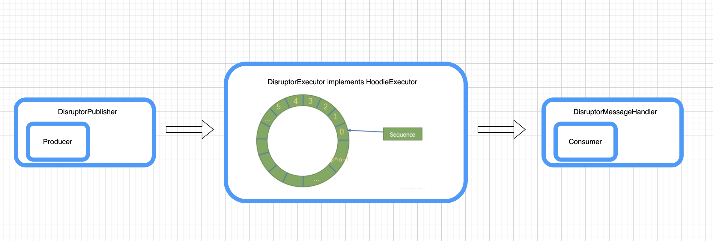

<!--
  Licensed to the Apache Software Foundation (ASF) under one or more
  contributor license agreements.  See the NOTICE file distributed with
  this work for additional information regarding copyright ownership.
  The ASF licenses this file to You under the Apache License, Version 2.0
  (the "License"); you may not use this file except in compliance with
  the License.  You may obtain a copy of the License at

       http://www.apache.org/licenses/LICENSE-2.0

  Unless required by applicable law or agreed to in writing, software
  distributed under the License is distributed on an "AS IS" BASIS,
  WITHOUT WARRANTIES OR CONDITIONS OF ANY KIND, either express or implied.
  See the License for the specific language governing permissions and
  limitations under the License.
-->
# RFC-50: Improve Hoodie Writing Data Efficiency Using Lock-Free Message Queue

## Proposers
@zhangyue19921010

## Approvers

## Status

JIRA: https://issues.apache.org/jira/browse/HUDI-3963

## Abstract

Add Lock-Free executor to improve hoodie writing throughput and optimize execution efficiency.
Disruptor linked: https://lmax-exchange.github.io/disruptor/user-guide/index.html#_introduction

## Background

Abstractly, hoodie consumes upstream data (Kafka or S3 files) into the lake is a standard production-consumption model. Currently, Hudi uses `LinkedBlockingQueue` as a message queue between Producer and Consumer.

However, this lock model may become the bottleneck of application throughput when data volume is much larger. What's worse is that even if we increase the number of the executors, it is still difficult to improve the throughput.

In other words, users may encounter throughput bottlenecks when writing data into hudi in some scenarios, and increasing the physical hardware scale and parameter tuning cannot solve this problem.

## Implementation

1. Abstraction: first abstract the produce-consume process into three parts
  - Producer interface: Fill the hoodie data into the inner message queue.
  - Executor interface: Initialize, schedule and manage producers and consumers, and hold inner message queues. Executor controls the entire life cycle of data production and consumption.
  - Consumer interface: Consumes data from inner message queue and write to hudi file.

2. Following the abstract logic in party1, use the lock-free circular queue Disruptor as the inner message queue of the Executor
  - Implement the producer abstraction in party1 and customize the `DisruptorBasedProducer` which will consume and set data to RingBuffer.
  - Implement the abstraction of Executor. Also control the life cycle through Ringbuffer information and related APIs. Customize `HoodieDaemonThreadFactory` to control Thread behavior.
  - Implement Consumer abstraction, define `DisruptorMessageHandler` to control consumption and clear data in Disruptor.

3. New parameters
  - `hoodie.write.executor.type`: Set executor which orchestrates concurrent producers and consumers communicating through a message queue. 
  Default value is `BOUNDED_IN_MEMORY_EXECUTOR` which use a bounded in-memory queue using `LinkedBlockingQueue`. 
  Also users could use `DISRUPTOR_EXECUTOR`, which use disruptor as a lock free message queue to gain better writing performance. 
  Although `DISRUPTOR_EXECUTOR` is still an experimental feature.
  - `hoodie.write.buffer.size`: The size of the Disruptor Executor ring buffer, must be power of 2
  - `hoodie.write.wait.strategy`: Strategy employed for making DisruptorExecutor wait on a cursor.

4. limitation
  For now, this disruptor executor is only supported for spark insert and spark bulk insert operation. Other operations like spark upsert is still on going.

## Rollout/Adoption Plan

Default executor is `BOUNDED_IN_MEMORY_EXECUTOR` which use a bounded in-memory queue using LinkedBlockingQueue same as now.
So there is no impact on existing users.

## Test Plan
1. Add UT `TestDisruptorMessageQueue` and `TestDisruptorExecutionInSpark` to guard above logic, also validate data correctness.
2. Add Benchmark `BoundInMemoryExecutorBenchmark` benchmark with BoundInMemoryExecutor(old) and DisruptorExecutior(new option)

