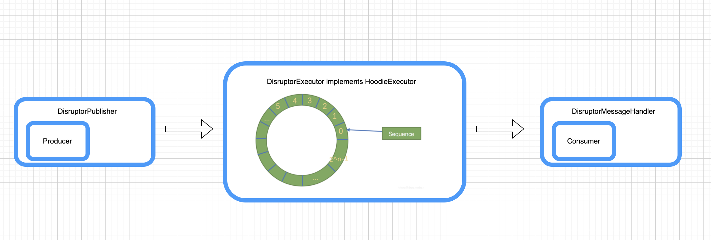

<!--
  Licensed to the Apache Software Foundation (ASF) under one or more
  contributor license agreements.  See the NOTICE file distributed with
  this work for additional information regarding copyright ownership.
  The ASF licenses this file to You under the Apache License, Version 2.0
  (the "License"); you may not use this file except in compliance with
  the License.  You may obtain a copy of the License at

       http://www.apache.org/licenses/LICENSE-2.0

  Unless required by applicable law or agreed to in writing, software
  distributed under the License is distributed on an "AS IS" BASIS,
  WITHOUT WARRANTIES OR CONDITIONS OF ANY KIND, either express or implied.
  See the License for the specific language governing permissions and
  limitations under the License.
-->
# RFC-53: Use Lock-Free Message Queue Improving Hoodie Writing Efficiency

## Proposers
@zhangyue19921010

## Approvers
@leesf

## Status

JIRA: https://issues.apache.org/jira/browse/HUDI-3963

## Abstract

New option which use Lock-Free Message Queue called Disruptor as inner message queue to improve hoodie writing performance and optimize writing efficiency.

Disruptor linked: https://lmax-exchange.github.io/disruptor/user-guide/index.html#_introduction

## Background

Based on master branch, hoodie consumes upstream data (Kafka or S3 files) into the lake is a standard production-consumption model. 
Currently, hoodie uses `LinkedBlockingQueue` as a inner message queue between Producer and Consumer.

However, this lock model may become the bottleneck of application throughput when data volume is much larger. 
What's worse is that even if we increase the number of the executors, it is still difficult to improve the throughput.

In other words, users may encounter throughput bottlenecks when writing data into hudi in some scenarios, 
for example the schema is relatively simple, but the volume of data is pretty large or users observed insufficient data throughput and low cpu usage, etc.

This RFC is to solve the performance bottleneck problem caused by locking in some large data volume scenarios

This RFC provides a new option which use Lock-Free Message Queue called Disruptor as inner message queue to 
The advantages are that:
 - Fully use all the cpu resources without lock blocking.
 - Improving writing performance and efficiency
 - Solve the potential performance bottlenecks causing by locking.

## Implementation

This RFC mainly does two things: One is to do the code abstraction about hoodie consuming upstream data and writing into hudi format.
The other thing is to implement disruptor based producer, inner message queue executor and message handler based on this new abstraction.

Firstly, briefly introduce code abstraction(take `[based-master]` as current logic/option, and `[rfc-new]` for new option provided by this rfc)
- [abstract] `HoodieMessageQueue`: Hold the inner message queue, control the initialization of the inner message queue, 
control its life cycle, and provide a unified insert api, speed limit, memory control and other enrich functions. The current implementations are as follows:
    - [based-master] `BoundedInMemoryQueue` which hold a `LinkedBlockingQueue` as inner message queue.
    - [rfc-new] `DisruptorMessageQueue` which hold a lock free ringbuffer called disruptor as inner message queue.
- [interface] `HoodieProducer`: Controls the producer behaviors and life cycle of hoodie reading upstream data and writing it into the inner message queue.
The current implementations are as follows:
    - [based-master][abstract] `BoundedInMemoryQueueProducer` Producer for `BoundedInMemoryQueue`
        - [based-master] `IteratorBasedQueueProducer` Iterator based producer which pulls entry from iterator and produces items into the `LinkedBlockingQueue`
        - [based-master] `FunctionBasedQueueProducer` Buffer producer which allows custom functions to insert entries to the `LinkedBlockingQueue`
    - [rfc-new][abstract] `DisruptorBasedProducer`Producer for `DisruptorMessageQueue`
        - [rfc-new] `IteratorBasedDisruptorProducer` Iterator based producer which pulls entry from iterator and produces items into the `DisruptorMessageQueue`
        - [rfc-new] `FunctionBasedDisruptorQueueProducer` Buffer producer which allows custom functions to insert entries to the `DisruptorMessageQueue`
 - [interface] `HoodieConsumer` Control hoodie to read the data from inner message queue and write them as hudi data files, and execute callback function. 
  The current implementations are as follows:
    - [based-master] `BoundedInMemoryQueueConsumer` Consume entries directly from `LinkedBlockingQueue` and execute callback function.
    - [rfc-new] `DisruptorMessageHandler` which hold the same `BoundedInMemoryQueueConsumer` instant mentioned before. Use `DisruptorMessageHandler` extracts each record in disruptor then
    using `BoundedInMemoryQueueConsumer` writing hudi data file.
- [abstract] `HoodieExecutor`: Executor which orchestrates concurrent producers and consumers communicating through a inner message queue.
The current implementations are as follows:
    - [based-master] `BoundedInMemoryExecutor` takes as input the size limit, queue producer(s), consumer and transformer and exposes API to orchestrate concurrent execution of these actors communicating through a central LinkedBlockingQueue.
    - [rfc-new] `DisruptorExecutor` Control the initialization, life cycle of the disruptor, and coordinate the work of the producer, consumer, and ringbuffer related to the disruptor, etc.
    
Secondly, This rfc implements disruptor related producers, message handlers and executor which use this lock-free message queue based on the above abstraction. Some compents are introduced in the first part. In this phase, we discuss how to use disruptor in hoodie writing stages.

The Disruptor is a library that provides a concurrent ring buffer data structure. It is designed to provide a low-latency, high-throughput work queue in asynchronous event processing architectures.

We use the Disruptor multi-producer single-consumer working model:
- Define `DisruptorPublisher` to register producers into Disruptor and control the produce behaviors including life cycle.
- Define `DisruptorMessageHandler` to register consumers into Disruptor and write consumption data from disruptor to hudi data file. 
For example we will clear out the event after processing it to avoid unnecessary memory and GC pressure
- Define `HoodieDisruptorEvent` as the carrier of the hoodie message
- Define `HoodieDisruptorEventFactory`: Pre-populate all the hoodie events to fill the RingBuffer. 
We can use `HoodieDisruptorEventFactory` to create `HoodieDisruptorEvent` storing the data for sharing during exchange or parallel coordination of an event.
- Expose some necessary parameters for the users with a proper default to tune in different scenarios.

Finally, let me introduce the new parameters:
  - `hoodie.write.executor.type`: Choose the type of executor to use, which orchestrates concurrent producers and consumers communicating through a inner message queue. 
  Default value is `BOUNDED_IN_MEMORY_EXECUTOR` which used a bounded in-memory queue `LinkedBlockingQueue`. 
  Also users could use `DISRUPTOR_EXECUTOR`, which use disruptor as a lock free message queue to gain better writing performance. 
  Although `DISRUPTOR_EXECUTOR` is still an experimental feature.
  - `hoodie.write.buffer.size`: The size of the Disruptor Executor ring buffer, must be power of 2. Also the default/recommended value is 1024.
  - `hoodie.write.wait.strategy`: Used for disruptor wait strategy. The Wait Strategy determines how a consumer will wait for events to be placed into the Disruptor by a producer. 
  More details are available in followed table about being optionally lock-free.
  
  Alternative Wait Strategies
  
  The default WaitStrategy used by the Disruptor is the `BlockingWaitStrategy`. Internally the `BlockingWaitStrategy` uses a typical lock and condition variable to handle thread wake-up. 
  The BlockingWaitStrategy is the slowest of the available wait strategies, but is the most conservative with the respect to CPU usage and will give the most consistent behaviour across the widest variety of deployment options.
  
  Knowledge of the deployed system can allow for additional performance by choosing a more appropriate wait strategy:
  
  `SleepingWaitStrategy`:
  
  Like the `BlockingWaitStrategy` the `SleepingWaitStrategy` it attempts to be conservative with CPU usage by using a simple busy wait loop. 
  The difference is that the `SleepingWaitStrategy` uses a call to `LockSupport.parkNanos(1)` in the middle of the loop. On a typical Linux system this will pause the thread for around 60µs.
  
  This has the benefits that the producing thread does not need to take any action other increment the appropriate counter and that it does not require the cost of signalling a condition variable. 
  However, the mean latency of moving the event between the producer and consumer threads will be higher.
  
  It works best in situations where low latency is not required, but a low impact on the producing thread is desired. A common use case is for asynchronous logging.
  
  `YieldingWaitStrategy`
  
  The `YieldingWaitStrategy` is one of two WaitStrategies that can be use in low-latency systems. It is designed for cases where there is the option to burn CPU cycles with the goal of improving latency.
  
  The `YieldingWaitStrategy` will busy spin, waiting for the sequence to increment to the appropriate value. Inside the body of the loop `Thread#yield()` will be called allowing other queued threads to run.
  
  This is the recommended wait strategy when you need very high performance, and the number of `EventHandler` threads is lower than the total number of logical cores, e.g. you have hyper-threading enabled.
  
  `BusySpinWaitStrategy`
  
  The `BusySpinWaitStrategy` is the highest performing WaitStrategy. Like the `YieldingWaitStrategy`, it can be used in low-latency systems, but puts the highest constraints on the deployment environment.
  
  This wait strategy should only be used if the number of `EventHandler` threads is lower than the number of physical cores on the box, e.g. hyper-threading should be disabled.

## Rollout/Adoption Plan

Default executor is `BOUNDED_IN_MEMORY_EXECUTOR` which use a bounded in-memory queue using `LinkedBlockingQueue` same as master.

So there is no impact on existing users.

## Test Plan
1. Add UT `TestDisruptorMessageQueue` and `TestDisruptorExecutionInSpark` to guard above logic, also validate data correctness.
2. Add Benchmark `BoundInMemoryExecutorBenchmark` benchmark with BoundInMemoryExecutor(based-master) and DisruptorExecutor(new option)

## Future Plan
  For now, this DisruptorExecutor is supported for spark insert and spark bulk insert operations as an experimental feature. So that there're also several further steps need to be done:
  1. Support DisruptorExecutor for spark upsert operation as multi-producers and single consumer.
  2. Support DisruptorExecutor for Flink writing operation.
  3. For some cases like bulk_insert and flink ingestion, we may support `DirectExecutor` which use no inner message queue and read messages from iterator directly 
  ,writing into hudi(remove the producer/consumer at all).

