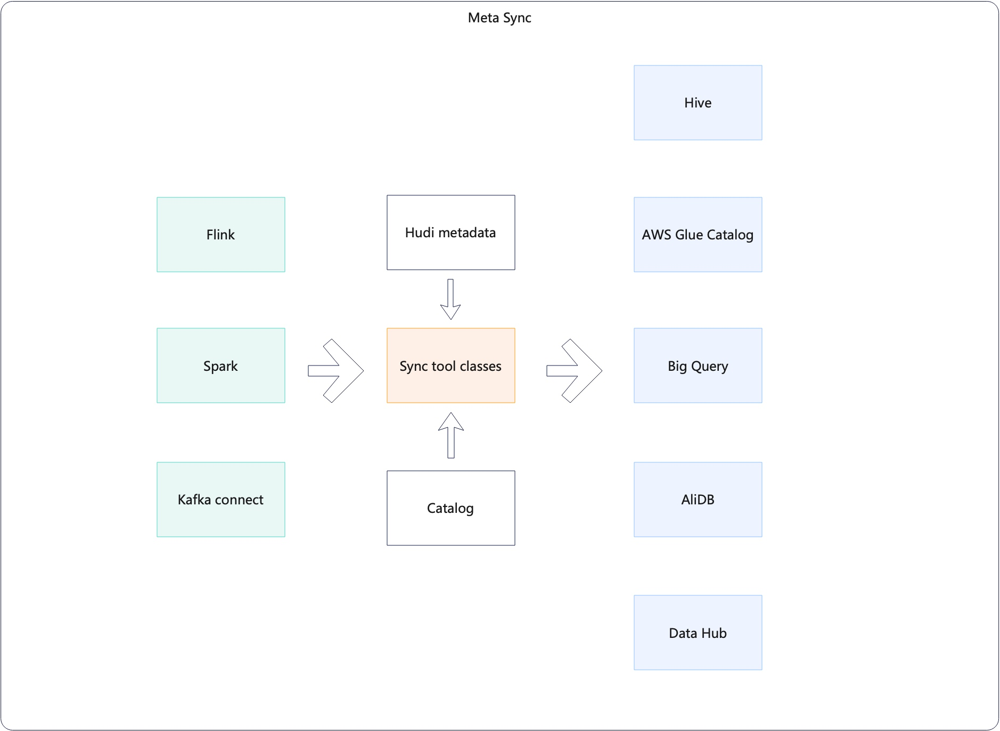

<!--
  Licensed to the Apache Software Foundation (ASF) under one or more
  contributor license agreements.  See the NOTICE file distributed with
  this work for additional information regarding copyright ownership.
  The ASF licenses this file to You under the Apache License, Version 2.0
  (the "License"); you may not use this file except in compliance with
  the License.  You may obtain a copy of the License at

       http://www.apache.org/licenses/LICENSE-2.0

  Unless required by applicable law or agreed to in writing, software
  distributed under the License is distributed on an "AS IS" BASIS,
  WITHOUT WARRANTIES OR CONDITIONS OF ANY KIND, either express or implied.
  See the License for the specific language governing permissions and
  limitations under the License.
-->
# RFC-55: Improve hudi-sync classes design and simplify configs

## Proposers

- @<proposer1 @fengjian428>
- @<proposer2 @xushiyan>

## Approvers

 - @<approver1 @vinothchandar>
 - @<approver2 @codope>

## Status

JIRA: [HUDI-3730](https://issues.apache.org/jira/browse/HUDI-3730)

## Abstract



Hudi support sync to various metastores via different processing framework like Spark, Flink, and Kafka connect. 

There are some room for improvement

* The way to generate Sync configs are inconsistent in different framework
* The abstraction of SyncClasses was designed for HiveSync, hence there are duplicated code, unused method, and parameters.
 
We need a standard way to run hudi sync. We also need a unified abstraction of XXXSyncTool , XXXSyncClient and XXXSyncConfig to handle supported metastores, like hive metastore, bigquery, datahub, etc.

## Classes design


Below are the proposed key classes to handle the main sync logic. They are extensible for different metastores.

### `HoodieSyncTool`

*Renamed from `AbstractSyncTool`.*

```java
public abstract class HoodieSyncTool implements AutoCloseable {

  protected HoodieSyncClient syncClient;

  /**
   * Sync tool class is the entrypoint to run meta sync.
   *
   * @param props A bag of properties passed by users. It can contain all hoodie.* and any other config.
   * @param hadoopConf Hadoop specific configs.
   */
  public HoodieSyncTool(Properties props, Configuration hadoopConf);

  public abstract void syncHoodieTable();

  public static void main(String[] args) {
     // instantiate HoodieSyncConfig and concrete sync tool, and run sync.
  }
}
```

### `HoodieSyncConfig`

```java
public class HoodieSyncConfig extends HoodieConfig {

  public static class HoodieSyncConfigParams {
    // POJO class to take command line parameters
    @Parameter()
    private String basePath; // common essential parameters

    public Properties toProps();
  }

   /**
    * XXXSyncConfig is meant to be created and used by XXXSyncTool exclusively and internally.
    * 
    * @param props passed from XXXSyncTool.
    * @param hadoopConf passed from XXXSyncTool.
    */
  public HoodieSyncConfig(Properties props, Configuration hadoopConf);
}

public class HiveSyncConfig extends HoodieSyncConfig {

  public static class HiveSyncConfigParams {

    @Parameter()
    private String syncMode;

    // delegate common parameters to other XXXParams class
    // this overcomes single-inheritance's inconvenience
    // see https://jcommander.org/#_parameter_delegates
    @ParametersDelegate()
    private HoodieSyncConfigParams hoodieSyncConfigParams = new HoodieSyncConfigParams();

    public Properties toProps();
  }

  public HoodieSyncConfig(Properties props);
}
```

### `HoodieSyncClient`

*Renamed from `AbstractSyncHoodieClient`.*

```java
public abstract class HoodieSyncClient implements AutoCloseable {
  // metastore-agnostic APIs
}
```

## Config simplification

- rename all sync related configs to suffix as `hoodie.sync.*`
  - no more `hoodie.meta.sync.*` or `hoodie.meta_sync.*`
  - no more variable name or class name like `metaSyncEnabled` or `metaSyncTool`; standardize as `hoodieSync*` to align with module name `hudi-sync`
- remove all sync related option constants from `DataSourceOptions`
- `database` and `table` should not be required by sync tool; they should be inferred from table properties
- users should not need to set PartitionValueExtractor; partition values should be inferred automatically
- remove `USE_JDBC` and fully adopt `SYNC_MODE`
- remove `HIVE_SYNC_ENDABLED` and related arguments from sync tools and delta streamers. Use `SYNC_ENABLED`
- migrate repeated sync config to original config
   - `META_SYNC_BASE_FILE_FORMAT` -> `org.apache.hudi.common.table.HoodieTableConfig.BASE_FILE_FORMAT`
   - `META_SYNC_PARTITION_FIELDS` -> `org.apache.hudi.common.table.HoodieTableConfig.PARTITION_FIELDS`
   - `META_SYNC_ASSUME_DATE_PARTITION` -> `org.apache.hudi.common.config.HoodieMetadataConfig.ASSUME_DATE_PARTITIONING`
   - `META_SYNC_DECODE_PARTITION` -> `org.apache.hudi.common.table.HoodieTableConfig.URL_ENCODE_PARTITIONING`
   - `META_SYNC_USE_FILE_LISTING_FROM_METADATA` -> `org.apache.hudi.common.config.HoodieMetadataConfig.ENABLE`

## Rollout/Adoption Plan

- Users who set `USE_JDBC` will need to change to set `SYNC_MODE=jdbc`
- Users who set `--enable-hive-sync` or `HIVE_SYNC_ENABLED` will need to drop the argument or config and change to `--enable-sync` or `SYNC_ENABLED`.
- Users who import from `DataSourceOptions` for meta sync constants will need to import relevant configs from `HoodieSyncConfig` and subclasses.
- Users who set `AwsGlueCatalogSyncTool` as sync tool class need to update the class name to `AWSGlueCatalogSyncTool`

## Test Plan

- CI covers most operations for Hive sync with HMS
- end-to-end testing with setup for Glue Catalog, BigQuery, DataHub instance
- manual testing with partitions added and removed
