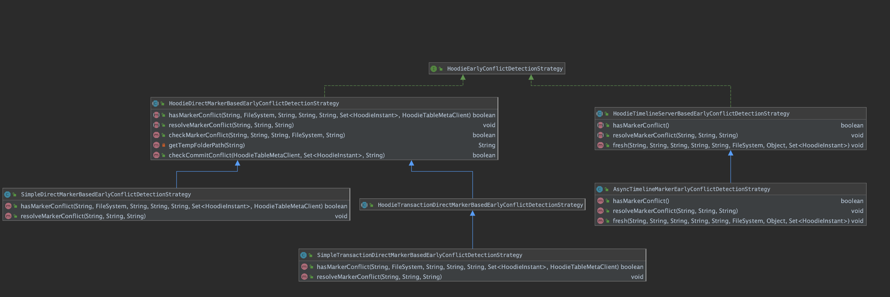

<!--
  Licensed to the Apache Software Foundation (ASF) under one or more
  contributor license agreements.  See the NOTICE file distributed with
  this work for additional information regarding copyright ownership.
  The ASF licenses this file to You under the Apache License, Version 2.0
  (the "License"); you may not use this file except in compliance with
  the License.  You may obtain a copy of the License at

       http://www.apache.org/licenses/LICENSE-2.0

  Unless required by applicable law or agreed to in writing, software
  distributed under the License is distributed on an "AS IS" BASIS,
  WITHOUT WARRANTIES OR CONDITIONS OF ANY KIND, either express or implied.
  See the License for the specific language governing permissions and
  limitations under the License.
-->
# RFC-56: Early Conflict Detection For Multi-writer


## Proposers

- @zhangyue19921010

## Approvers
 - @yihua

## Status

JIRA: https://issues.apache.org/jira/browse/HUDI-1575


## Abstract

At present, Hudi implements an OCC (Optimistic Concurrency Control) based on timeline to ensure data
consistency, integrity and correctness between multi-writers. However, the related conflict detection is performed
before commit metadata and after the data writing is completed. If any conflict is detected, it leads to a waste
of cluster resources because computing and writing were finished already. To solve this problem, this RFC proposes an
early conflict detection mechanism based on the existing Hudi marker mechanism. There are some subtle differences in
early conflict detection work flow between different types of marker maintainers.


For direct markers, hoodie lists necessary marker files directly and do conflict checking before the writers creating
markers and before starting to write corresponding data file. For the timeline-server based markers, hoodie just gets the
the result of marker conflict checking before the writers creating markers and before starting to write corresponding
data files. The conflicts are asynchronously and periodically checked so that the writing conflicts can be detected as
early as possible. Both writers may still write the data files of the same file slice, until the conflict is detected
in the next round of checking.

What's more? Hoodie can stop writing earlier because of early conflict detection and release the resources to cluster,
improving resource utilization.

## Background
As we know, transactions and multi-writers of data lakes are becoming the key characteristics of building Lakehouse
these days. Quoting this inspiring blog <strong>Lakehouse Concurrency Control: Are we too optimistic?</strong> directly: 
https://hudi.apache.org/blog/2021/12/16/lakehouse-concurrency-control-are-we-too-optimistic/

>"Hudi implements a file level, log based concurrency control protocol on the Hudi timeline, which in-turn relies 
> on bare minimum atomic puts to cloud storage. By building on an event log as the central piece for inter process 
> coordination, Hudi is able to offer a few flexible deployment models that offer greater concurrency over pure OCC 
> approaches that just track table snapshots."
  
In the multi-writer scenario, Hudi's existing conflict detection occurs after the writer finished writing the data 
and before committing the metadata. In other words, the writer just detect the occurrence of the conflict
when it starts to commit, although all calculations and data writing have been completed, which causes a waste
of resources.

For example:

Now there are two writing jobs: job1 will write 10M data to the Hudi table, including update file group 1. 
Another job2 will write 100G to the Hudi table, and will also update the same file group 1. 

Job1 finished and committed to Hudi successfully. After a few hours, job2 finished writing data files(100G) and start 
to commit metadata. At this time, a conflict compared with job1 was found, and the job2 had to be aborted and re-run 
after failure. Obviously, a lot of computing resources and time are wasted for job2.


Hudi currently has two important mechanisms, marker mechanism and heartbeat mechanism:
1. Marker mechanism can track all the files that are part of an active write.
2. Heartbeat mechanism that can track all active writers to a Hudi table.


Based on marker and heartbeat, this RFC proposes a new conflict detection: Early Conflict Detection.
Before the writer creates the marker and before it starts to write the file, Hudi will perform this new conflict
detection, trying to detect the writing conflict directly or get the async conflict check result(Timeline-Based) as
early as possible and abort the writer when the conflict occurs, so that we can release resources as soon as possible
and improve resource utilization.


## Implementation
Here is the high level workflow of early conflict detection as figure1 showed. 
As we can see, when both `supportsOptimisticConcurrencyControl` and `isEarlyConflictDetectionEnable` are true, we
could use this early conflict detection feature. Else, we skip this check and create marker directly.


The three important steps marked in red in Figure 1 are introduced one by one as follows:

### [1] Check Marker Conflict

As we know, hoodie has two ways to create and maintain markers:
1. DirectWriteMarkers: individual marker file corresponding to each data file is directly created by the writer.
2. TimelineServerBasedWriteMarkers: marker operations are all handled at the timeline service which serves as a proxy

Therefore, for different types of Marker, we must implement the corresponding check marker conflict logic.
Here we expand the existing `ConflictResolutionStrategy` interface to ensure the scalability of checking marker conflict.



In this design, we provide `DirectMarkerWithTransactionConflictResolutionStrategy` and 
`SimpleDirectMarkerConflictResolutionStrategy` for DirectWriteMarkers to perform corresponding conflict detection and 
conflict resolution. And we provide `AsyncTimelineMarkerConflictResolutionStrategy` for TimelineServerBasedWriteMarkers 
to perform corresponding conflict detection and conflict resolution

#### DirectWriteMarkers related strategy

##### DirectMarkerWithTransactionConflictResolutionStrategy


As for current strategy showed by figure 2, we need to pay attention to the following two details:


Firstly, we will use the existing transaction mechanism to lock at the <strong>PartitionPath + "/" + fileID</strong>
level before checking conflicts and before creating marker files. 
Take ZK locker as an example => `LockConfiguration.ZK_LOCK_KEY_PROP_KEY, partitionPath + "/" + fileId`. 
That is to say, for the same partitionPath/fileId, only one writer can check and create the corresponding marker file 
at the same time.


In addition, during checking conflicts, we do not need to list all marker files in all directories, we can prune based 
on the current partition Path and fileID to avoid unnecessary list operations. For example(also shown in figure2), we
are going to create maker file based on partition path 2022/07/01, and fileID ff26cb9e-e034-4931-9c59-71bac578f7a0-0.
During marker conflict checking, we do not need to list all the partitions we have under ".temp". Just list marker files under
$BasePath/.hoodie/.temp/instantTime/2022/07/01 and check if fileID ff26cb9e-e034-4931-9c59-71bac578f7a0-0 existed or not.

##### SimpleDirectMarkerConflictResolutionStrategy

Compared with `DirectMarkerWithTransactionConflictResolutionStrategy`, the current strategy drops the steps of
transaction including new transaction, begin transaction and end transaction. The advantages are that the checking
speed is faster, and multiple writers will not affect each other. But the downside is that the conflict detection may be
delayed.


For example, when two writers detect PartitionPath1 + fileID1 at the same time, 
both writers will pass conflict checking and successfully create a marker, which conflict detection is delayed.
If so, the conflict can only be found in the pre-commit conflict checking and fail writing.
This leads to waste of resources, but don't compromise the correctness of the data.

#### TimelineServerBasedWriteMarkers related strategy

##### AsyncTimelineMarkerConflictResolutionStrategy

This design expands the create marker api on timeline server.


As shown on figure3. For the client side, it will call create marker api, requesting to create marker.

For the timeline server side, there is a MarkerCheckerRunnable thread, which will check the conflicts between current 
writer and other active writers at fixed rate. If any conflict was detected, this thread will async update the value 
of hasConflict.

As for create marker API, hoodie will get and check the value of 'hasConflict' before create marker.

We did a performance test for async conflict checker using local fs and two concurrency writers based on 1500+ inflight
markers located in MARKER0~MARKER19. It will take 179ms to finish checking conflict.

Here we need to pay attention to two details:

Firstly, There may be a concurrency issue between reading and writing the same MARKER file causing EOFException. In 
order to simplify the model, we think that the result is empty when catch any exception during reading specific MARKER 
and let the subsequent checker to make up for it. For example, writer1 will read writer2's MARKER0 file, but at this
moment writer2 is overwriting MARKER0 file. Finally we will get empty set after writer1 reading writer2's MARKER0.
In extreme cases, the delay of early conflict detection will also occur.
Fortunately, we can adjust the frequency of the schedule according to the actual situation.

Secondly, the marker checker runnable scheduled and selecting the candidate active instants, only the instant smaller than 
the current writer is selected for conflict detection. This is to avoid two writers discovering conflicts with each 
other at the same time and failing together.

### [2] Check Commit Conflict: Why we still need to check commit conflict here?

As we know, when a writer completes writing and commits, its corresponding marker information will be deleted 
immediately. So that, other writers will miss this kind of confliction.

Let's take Figure 4 as an example


Writer1 starts writing data at time t1 and finishes at time t3. Writer2 starts writing at time t2, and will update a 
file already updated by writer1 at time t4. Since all marker information of writer1 has been deleted at time t4, 
such conflicts cannot be found in the stage of marker conflict detection until starting to commit. 
In order to avoid such delay of early conflict detection, it is necessary to add the step of check commit conflict during
detection.

```
1. Get and cache all instants before init write handler as set1.
2. Create and reload a new activetiemline after finished marker conflict checking as set2.
3. Get the diff instants between set1 and set2 as set3.
4. Read all the changed fileIds contained in set3 as fileId set1
5. Check if current writing fileID set2 is overlapped with fileId set1

```

### [3] Try to resolve conflict

For now, the default behavior is that conflict write handlers will throw an `HoodieEarlyConflictDetectionException` which are
running on executors. Also these tasks will be failed and retried.

As for HoodieDeltaStreamer, when we detect marker conflicts, corresponding writing task fails and retries. If the retry
reaches a certain number of times we set, the current stage will fail.
At this time, this behavior is consistent with the existing OCC based conflict detection.

## Configuration

This RFC adds three new configs to control the behavior of early conflict detection

1. `hoodie.write.lock.early.conflict.detection.enable` default false. Enable early conflict detection based on markers. It will try to detect writing conflict before create markers and fast fail which will release cluster resources as soon as possible.
2. `hoodie.write.lock.early.conflict.async.checker.batch.interval` default 30000L. Used for timeline based marker AsyncTimelineMarkerConflictResolutionStrategy. The time to delay first async marker conflict checking.
3. `hoodie.write.lock.early.conflict.async.checker.period` default 30000L. Used for timeline based marker AsyncTimelineMarkerConflictResolutionStrategy. The period between each marker conflict checking.
3. `hoodie.write.lock.early.conflict.detection.strategy` default . Early conflict detection class name, this should be subclass of oorg.apache.hudi.common.model.HoodieEarlyConflictDetectionStrategy


## Rollout/Adoption Plan

 - There is a feature flag named `isEarlyConflictDetectionEnable`, and have no impact on existing users.

## Test Plan
Performance test and benchmark between two concurrent writers.
Case 1 enable this early conflict detection.
Case 2 disable this early conflict detection.
Compare the execution time.