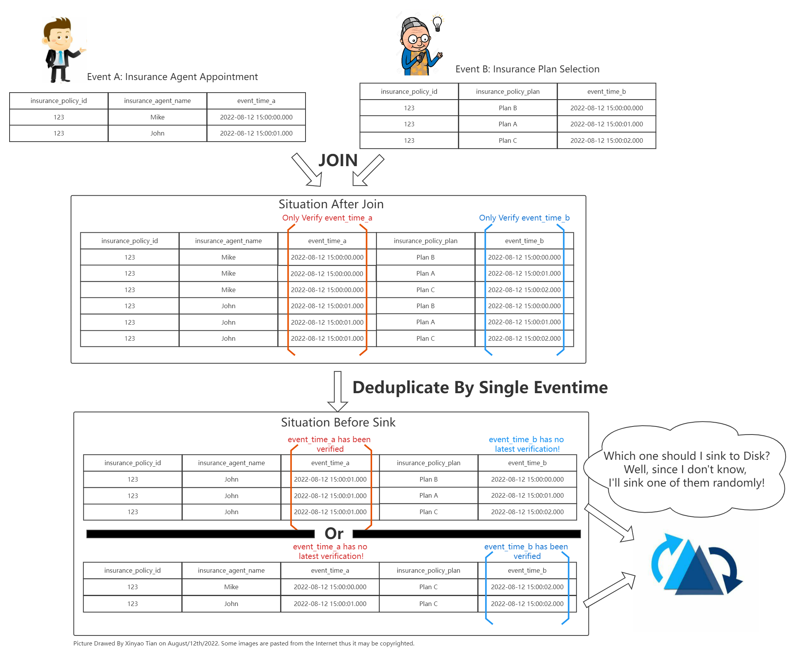
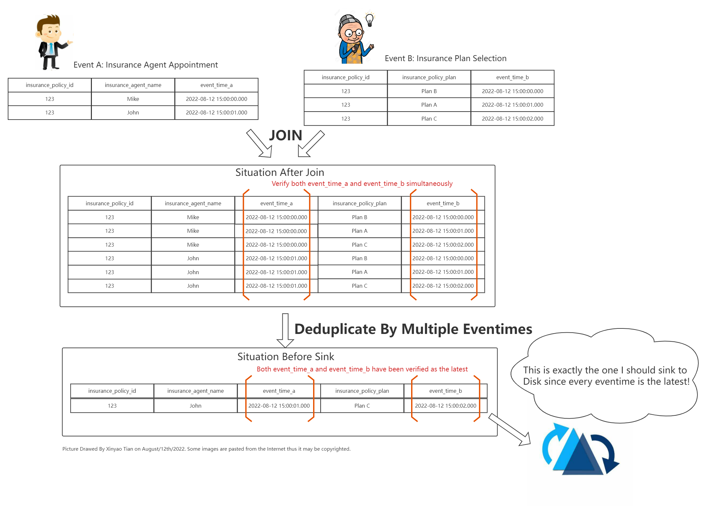
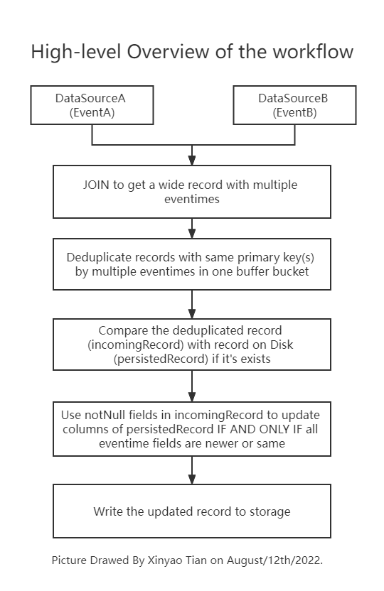

<!--
  Licensed to the Apache Software Foundation (ASF) under one or more
  contributor license agreements.  See the NOTICE file distributed with
  this work for additional information regarding copyright ownership.
  The ASF licenses this file to You under the Apache License, Version 2.0
  (the "License"); you may not use this file except in compliance with
  the License.  You may obtain a copy of the License at

       http://www.apache.org/licenses/LICENSE-2.0

  Unless required by applicable law or agreed to in writing, software
  distributed under the License is distributed on an "AS IS" BASIS,
  WITHOUT WARRANTIES OR CONDITIONS OF ANY KIND, either express or implied.
  See the License for the specific language governing permissions and
  limitations under the License.
-->
# RFC-[number]: [Title]


## Proposers

- Proposer1 @XinyaoTian
- Proposer2 @guixilan

## Approvers
 - Approver1 @xushiyan
 - Approver2 @nsivabalan

## Status

JIRA: [Hudi-4569](https://issues.apache.org/jira/browse/HUDI-4569)

> Please keep the status updated in `rfc/README.md`.

## Abstract

(Describe the problem you are trying to solve and a brief description of why it’s needed.)

A new feature temporarily named "Multiple event-time fields latest verification" is being proposed in this RFC.

This feature intends to fix a fatal error that when complex Join operations are perfomed, the singlar event-time field latest verification currently provided by Hudi is not enough and will lead to data inconsistency in the sinked Hudi table. Thus, a feature called multiple event-time field latest verification in a single table is desperately demanded. This RFC detailized illustrates this problem and attempt to give a feasible solution with design concept as well as implementation details in order to fix the problem and make this new feature available to everyone.

## Background

(Introduce any much background context which is relevant or necessary to understand the feature and design choices.)

Apache Hudi is a cutting-edge tool which brings transcations, record-level updates/deletes and change streams to data lakes in big-data area. These innovative features brought by Hudi are highly desired by Finance related industries such as Banking and Insurance area since Hudi can significantly reduce costs while maintaining data accuracy and making precise, record-level modifications. It is an indisputable fact that many huge financial companies that are ready to use or even already using Hudi as a component of their alternative Big-Data solutions. Undoubtedly, Hudi has enormous potential to become the crucial infrastructure of the next-generation financial industry.

However, there is one feature that data developers in these areas urgently eager but Hudi doesn't currently have: It is called "Multiple event-time fields latest verification in a single table" temporarily. Beacuse in the industry like Insurance, data is often stored distributed in plenty of tables and conceptually connected by the same primary keys. When the data is being used, a complex Join operation have to be executed first to stitch all partial columns from different tables into an entire record for downstream services to use.

Here comes to the problem. If data developers want to guarantee that every part of the data from different tables being joined is up to date, Hudi must have the ability to validate every event-time column within a wide record is the latest in order to insure that the entire record is the most recent one. Thus, in this scenario, the single event-time validation column provided by Hudi (i.e. option 'write.precombine.field' in Hudi 0.10.0) is a bit inadequate. Obviously, in order to cope with the use case with complex Join operations like above, as well as to provide much potential for Hudi to support more application scenarios and to engage into more industries, Hudi definitely needs to support the multiple event-time latest verification feature in a single table.

If the description about is a little ambiguous, you might imagine such a scenario. A sales manager is choosing one of two insurance agents to take over the Smiths' home insurance policy. The manager initially felt that Mike was young and energetic. But a second after he submitted the electronic spreadsheet, the manager felt that John was more experienced, and soon updated the form information to make John as the agent for this insurance policy. Meanwhile, Mrs. Smith was hesitating about which insurance plan to choose. After frequently choosing between Plan A and Plan B, Mrs. Smith finally decided to use Plan C as the family's insurance plan. The whole process took only a few minutes from start to finish, but the process involved frequent modifications and updates of data. 

In this example, we would expect the correct result to be that John is in charge of the Smiths' insurance plan C. However, if Hudi only supports a single event-time latest validation within a single table, the data is most likely to be inconsistent with the expected result due to latancy: if Hudi only validates the event-time of agent selection, then although the fact that John was selected can be guaranteed, the data of the insurance plan may cause confusion. For example, due to some failures in the mobile phone network, Mrs. Smith's operation of choosing Plan A is received later than Plan C. Due to the lack of a multiple event-time verification mechanism, the final data of insurance selection is likely to be Plan A, which arrives later than Plan C caused by network latency and overwrites the existing data, resulting in a serious error in which John is in charge of the Smiths' insurance Plan A. Likewise, if the event-time of the insurance plan is verified, then the agent information could be wrong due to lack of latest verification. Based on our testing and observations over several months, this error is obvious when Flink performs Join operation from several frequently updated streaming data sources and sinks into one Hudi table. Obviously, this error in Hudi is fatal when performing complex Join operations of multiple data sources, and the easiest and most effective way to solve this error is to allow Hudi to have multiple event-time latest verification ability in a single table. If you are still feeling confusion, You could understand the problem described above easily by viewing the picture below.


(Picture above: Record could be incorrect caused by ONLY ONE event-time field latest verification)


(Picture above: The ideal situation if we had multiple eventime latest verification feature)

A good news is that, after more than two months of development, me and my colleagues have made some changes in the hudi-flink and hudi-common modules based on the hudi-0.10.0 and basically have achieved this feature. Currently, my team is using the improved source code and working with Kafka and Flink 1.13.2 to conduct some end-to-end testing on a dataset which contains more than 140 million real-world insurance data as well as verifying the data accuracy. The result is quite good: every part of the extremely-wide records has been updated to latest status based on our continuous observations during these weeks. 

In the following sections the whole design concept as well as the implementation details will be illustrated in detail. We're very keen to make this new feature available to everyone by this RFC and the following PRs, since we benefit from the Hudi community, we really desire to give back to the community with our efforts. 

Look forward to receiving your feedback about this RFC as well as our implementation.

## Implementation

(Describe the new thing you want to do in appropriate detail, how it fits into the project architecture. 
Provide a detailed description of how you intend to implement this feature.This may be fairly extensive and have large subsections of its own. 
Or it may be a few sentences. Use judgement based on the scope of the change.)

### Overview

In general, there are primarily THREE essentials to help Hudi achieve the above feature cooperated with Flink. 

1. Create a new Payload class, temporarily named `hudi-common/src/main/java/org/apache/hudi/common/model/PickAndCombineMultipleFieldsPayload.java`. This Payload class is the core of the entire new feature. It has two key functions and one crucial property to support the entire feature running properly. 
2. Create a new function, temporarily called `deduplicateRecordsWithMultipleCombineFields`, by imitating the existing function namely `deduplicateRecords` in `hudi-client/hudi-flink-client/src/main/java/org/apache/hudi/table/action/commit/FlinkWriteHelper.java`. This function could make Hudi deduplicate records inside a buffered bucket with same primary key(s) by multiple event-time fields and only remain the latest record whose every event-time field is the latest, rather than just comparing one field (i.e. orderingVal in Hudi 0.10.0) given by the existing function.
3. Add some configuration options (e.g. set which fields are event-time fields and thus need to be verified) in order to faciliate developers to use this feature conveniently. Also, some miscellaneous of trivial adjustment of Hudi logic workflow to make Hudi easily invokes the modifications and new-added functions described above in order to achieve the feature when developer set those options.

We will illustrate them despectively in detail in the following section.

For better understanding, we provided a general workflow to show how the entire process works.



### Core part: the Payload class

This Payload class is the core of the entire new feature. It has two key functions and one crucial property to support the entire feature running properly. Let's describe the two functions first.

Firstly, the `preCombineWithMultipleFields` function helps Hudi to deduplicate records inside a buffered bucket with same primary key(s) by multiple event-time fields and only remain the latest record whose every event-time field is latest. 

This function would be invoked in `hudi-client/hudi-flink-client/src/main/java/org/apache/hudi/table/action/commit/FlinkWriteHelper.java` # `deduplicateRecordsWithMultipleCombineFields` to deduplicate record. The deduplication process will also be described later.

Secondly, the `needUpdatingPersistedRecordWithMultipleFields` functions helps Hudi to verify whether all event-time fields are the latest compared with the record persisted on the Disk when sinking the deduplicated record to the Disk before real write operation conducts.

The high-level entire design of this Payload class is shown here:

```java

// hudi-common/src/main/java/org/apache/hudi/common/model/VerifyMultipleLatestEventTimesPayload.java
public class VerifyMultipleLatestEventTimesPayload extends BaseAvroPayload implements HoodieRecordPayload<VerifyMultipleLatestEventTimesPayload> {

  // A HashMap in order to store the relationship between event-time fieldnames and values
  private HashMap<String, Comparable<?>> eventTimeFieldNamesAndValues;

  // A string in order to save the eventime-time fieldname of orderingVal. 
  // This is a compromise designed to be compatible with the current single event-time (property 'orderingVal' provided by BaseAvroPayload). 
  private String orderingValFieldName;

  // Construction compatible with the current workflow
  public VerifyMultipleLatestEventTimesPayload(GenericRecord record, Comparable orderingVal, String orderingValFieldName) ;

  // Construction for the multiple event-time latest verification
  public VerifyMultipleLatestEventTimesPayload(GenericRecord record, HashMap<String, Comparable<?>> eventTimeFieldNamesAndValues) ;

  /**
  * It helps Hudi to deduplicate records inside a buffered bucket with same primary key(s) by multiple event-time fields and only remain the latest record whose every event-time field is the latest.
  * About the function name, instead of precombine, we believe that use a different function name is better. 
  * But it could also be named as preCombine in the future if we finished merging the workflows of single and multiple event-times processing
  *
  * @param previousValue another instance of {@link VerifyMultipleLatestEventTimesPayload} which needs to be compared with this one and choose the one whose every event-time is the latest (null value should be dealt carefully)
  * @returns latestPayload return the chosen recordPayload (every event-time field is latest)
  */
  public VerifyMultipleLatestEventTimesPayload preCombineWithMultipleFields(VerifyMultipleLatestEventTimesPayload previousValue) ;

  /**
  * Check whether every event-time field is latest compared with persisted record on the disk. If it's true then update.
  * This function would be invoked by {@link combineAndGetUpdateValue}
  *
  * @param persistedRecord Record persisted on the disk
  * @param incomingRecord Record newly comes and need to be checked if it could replace persistedRecord on the disk if all event-time are newer or same
  * @param properties helps get related configuration options (e.g. option set which fields are event-time fields, etc.)
  * returns true of false, means whether persisted record could be updated.
  */
  protected boolean needUpdatingPersistedRecordWithMultipleFieldsVerification(IndexedRecord persistedRecord, IndexedRecord incomingRecord, Properties properties) ;

  // invoked by needUpdatingPersistedRecordWithMultipleFieldsVerification, to select which event-time fields are not null.
  // Since null value usually has different meaning, it should be treated seriously so that we create a function to do this.
  private Map<String, Comparable<?>> chooseAndGetMultipleCombineFields(List<String> MultipleEventimeFields, IndexedRecord incomingRecord) ;

  // Return true if value equals defaultValue otherwise false.
  public Boolean overwriteField(Object value, Object defaultValue) ;

  protected boolean isDeleteRecord(GenericRecord genericRecord) ;

  // Override methods in order to implement the interface HoodieRecordPayload
  // Compatible with current workflow
  @Override
  public VerifyMultipleLatestEventTimesPayload preCombine(VerifyMultipleLatestEventTimesPayload oldValue) ;

  @Override
  // IF AND ONLY IF all event-time fields are same or newer can Hudi updates all notNull value from incomingRecord to persistedReocrd
  public Option<IndexedRecord> combineAndGetUpdateValue(IndexedRecord currentValue, Schema schema, Properties properties) throws IOException ;

  @Override
  public Option<IndexedRecord> getInsertValue(Schema schema) throws IOException ;

  @Override
  public Option<Map<String, String>> getMetadata() ;
}

```

### Deduplicate record with multiple event-time fields

This function will deduplicate records with same primay key(s) by multiple event-time fields and only keep record with latest values in every event-time field.
Since Hudi buffers records in a buckect before flushing or checkpointing, so it's very necessary to conduct deduplication inside a bucket in order to sink only one record (whose every event-time is latest) to next step where this record will compare with record on Disk to decide which one should be remained or should some part of the persisted record be updated.

```java
// hudi-client/hudi-flink-client/src/main/java/org/apache/hudi/table/action/commit/FlinkWriteHelper.java
public class FlinkWriteHelper<T extends HoodieRecordPayload, R> extends AbstractWriteHelper<T, List<HoodieRecord<T>>, List<HoodieKey>, List<WriteStatus>, R> {
  
  // ...

  /**
  *
  * This function deduplicates records having same primary keys by multiple event-time fields. The only record with the latest event-time fields will be remained.
  * It's very like another function (FlinkWriteHelper # deduplicateRecords) in this class. The difference is that this function use multiple event-time to deduplicate records.
  */
  public List<HoodieRecord<T>> deduplicateRecordsWithMultipleCombineFields(List<HoodieRecord<T>> records, HoodieIndex<T, ?, ?, ?> index, int parallelism) ;

  // ...
}
```

### Provide more Configurations to improve usability

More importantly, we should create options to let developers easily config which fields are event-time fields that need to be conduct latest verification.

Firstly, we should add a config in `HoodiePayloadProps`.

```java
// hudi-common/src/main/java/org/apache/hudi/common/model/HoodiePayloadProps.java
public class HoodiePayloadProps {

  // ...

  /**
   * Newly added config to support multiple event-time latest verification fields instead of only one 'ts'
   * The configuration would look like below when creating Hudi Table:
   * 'hoodie.eventime.latest.verification.fields' = 'event_a_ts,event_b_ts,event_c_ts'
   * */
  public static final String PAYLOAD_COMBINE_DEPENDING_ON_FIELDS = "hoodie.eventime.latest.verification.fields";

  // ...
}
```

Secondly, we should add an option in `FlinkOptions`.

```java
// hudi-flink/src/main/java/org/apache/hudi/configuration/FlinkOptions.java
public class FlinkOptions extends HoodieConfig {
  // ...
  // ------------------------------------------------------------------------
  //  Multiple event-time fields latest verification related options
  // ------------------------------------------------------------------------

  public static final ConfigOption<Boolean> IS_USING_MULTIPLE_COMBINE_FIELDS = ConfigOptions
      .key("multiple.eventime.latest.verification.enable")
      .booleanType()
      .defaultValue(false)
      .withDescription("A switch to change the workflow to 'Multiple event-time fields latest verification'. Could be removed in the future version after workflow merging. ");

  // ...
}
```

### Workflow Modification

Due to adding this new feature, some workflow logic have to conduct modifications (Most of them just add a if-else statement to check whether `IS_USING_MULTIPLE_COMBINE_FIELDS` is true) to use the functions and classes we created above.

So far, the classes and functions that we have located that may be modified are as follows.

For streaming write to Hudi table we are sure that the following classes or methods should be modified.
```
//hudi-flink/src/main/java/org/apache/hudi/sink/StreamWriteFunction.java
StreamWriteFunction # flushBucket
StreamWriteFunction # flushRemaining
```

For batch write current to our knowledge we haven't found where to modify. Will be added after further investigations.
```
// Class # method Need to be added
```

## Rollout/Adoption Plan

 - What impact (if any) will there be on existing users? 

The compatibility problem has been serious considered in this plan. Since we are using a option as a switch, there's no impact on the existing users.
Users who would like to use this new feature should explicitly set `multiple.eventime.latest.verification.enable` to `true`. Then set `hoodie.eventime.latest.verification.fields` to use new workflow.
Users who don't want to use this feature or even don't know this feature will not have any impact (i.e. They don't explictly write `multiple.eventime.latest.verification.enable` when they create Hudi tables so that the workflow will keep going the existing one.) 
Every Table without this option set is working exactly the same with previous behaviour.

 - If we are changing behavior how will we phase out the older behavior?

Because current solution (single eventime latest verification) is just a simplified scenario of this solution (multiple eventime latest verification),
so after the new feature is tested by many people and proves itself is correct and stable, we could set the default value of `multiple.eventime.latest.verification.enable` to true (i.e. Default using our multiple eventime verification even if there's just one eventime field), set current option (i.e. `write.precombine.field`) to read the content of `hoodie.eventime.latest.verification.fields`, and then we could phase out the older behavior step by step.
   
 - If we need special migration tools, describe them here.

No need for special migration tools.

 - When will we remove the existing behavior

After this feature proves itself correct and stable we could use the plan described above to remove the existing behaviour.

## Test Plan

(Describe in few sentences how the RFC will be tested. How will we know that the implementation works as expected? How will we know nothing broke?)

Since the core of this new feature is the Payload Class, so we need to test the Payload Class as much as possible. The same is true for methods or classes whose logic is modified. Finally, end-to-end testing is also necessary.
- Test of the PayloadClass `VerifyMultipleLatestEventTimesPayload`, should create a seperate test file in `hudi-common/src/test/java/org/apache/hudi/common/model/TestVerifyMultipleLatestEventTimesPayload.java`. Could be follow the sample of `hudi-common/src/test/java/org/apache/hudi/common/model/TestOverwriteWithLatestAvroPayload.java` to conduct a similar test.
- UnitTest of `FlinkWriteHelper # deduplicateRecordsWithMultipleCombineFields`
- End-to-end testing: Give a dataset with at least thousands of records (e.g. consume sets of record with same primary keys and at least two event-time fields and check the sinked result).
- If there's any good idea about testing please let us know.

## Acknowledgement

Sincere thanks to everyone who helped and encouraged us as we wrote this proposal. Since We benefit from the Hudi community, we really desire to give back to the community with our efforts. We're very keen to make this new feature available to everyone.
