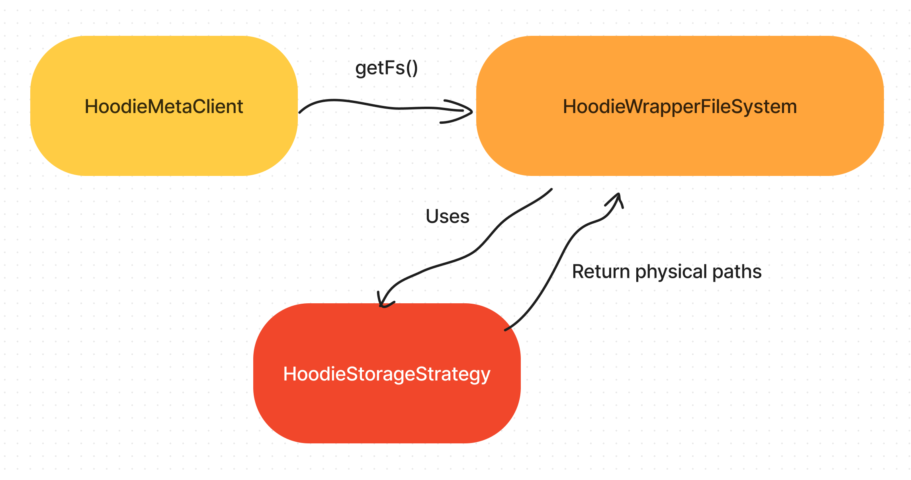
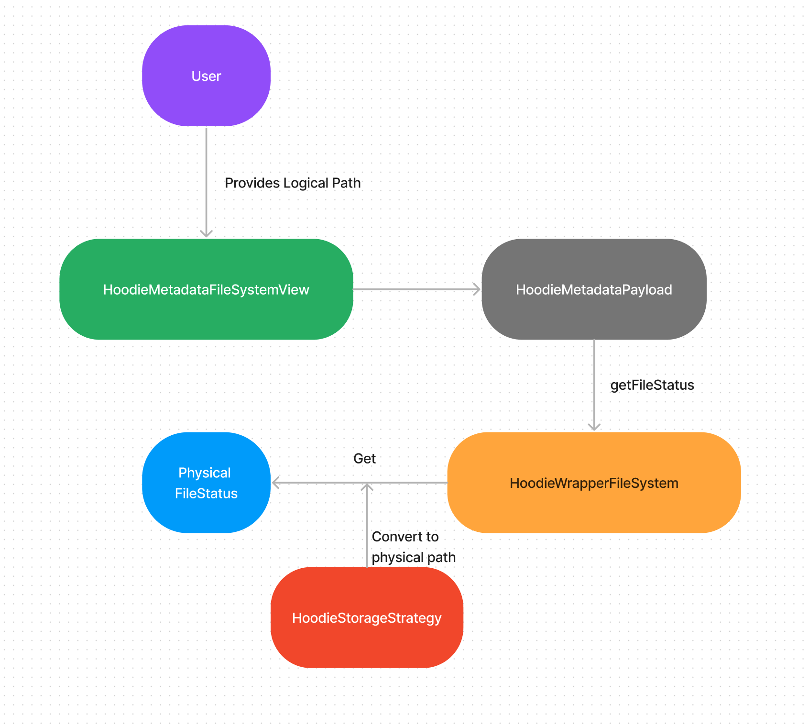

<!--
  Licensed to the Apache Software Foundation (ASF) under one or more
  contributor license agreements.  See the NOTICE file distributed with
  this work for additional information regarding copyright ownership.
  The ASF licenses this file to You under the Apache License, Version 2.0
  (the "License"); you may not use this file except in compliance with
  the License.  You may obtain a copy of the License at

       http://www.apache.org/licenses/LICENSE-2.0

  Unless required by applicable law or agreed to in writing, software
  distributed under the License is distributed on an "AS IS" BASIS,
  WITHOUT WARRANTIES OR CONDITIONS OF ANY KIND, either express or implied.
  See the License for the specific language governing permissions and
  limitations under the License.
-->

# RFC-60: Federated Storage Layout

## Proposers
- @umehrot2

## Approvers
- @vinoth
- @shivnarayan

## Status

JIRA: [https://issues.apache.org/jira/browse/HUDI-3625](https://issues.apache.org/jira/browse/HUDI-3625)

## Abstract

As you scale your Apache Hudi workloads over cloud object stores like Amazon S3, there is potential of hitting request
throttling limits which in-turn impacts performance. In this RFC, we are proposing to support an alternate storage
layout that is optimized for Amazon S3 and other cloud object stores, which helps achieve maximum throughput and
significantly reduce throttling.

In addition, we are proposing an interface that would allow users to implement their own custom strategy to allow them
to distribute the data files across cloud stores, hdfs or on prem based on their specific use-cases.

## Background

Apache Hudi follows the traditional Hive storage layout while writing files on storage:
- Partitioned Tables: The files are distributed across multiple physical partition folders, under the table's base path.
- Non Partitioned Tables: The files are stored directly under the table's base path.

While this storage layout scales well for HDFS, it increases the probability of hitting request throttle limits when
working with cloud object stores like Amazon S3 and others. This is because Amazon S3 and other cloud stores [throttle
requests based on object prefix](https://aws.amazon.com/premiumsupport/knowledge-center/s3-request-limit-avoid-throttling/).
Amazon S3 does scale based on request patterns for different prefixes and adds internal partitions (with their own request limits),
but there can be a 30 - 60 minute wait time before new partitions are created. Thus, all files/objects stored under the
same table path prefix could result in these request limits being hit for the table prefix, specially as workloads
scale, and there are several thousands of files being written/updated concurrently. This hurts performance due to
re-trying of failed requests affecting throughput, and result in occasional failures if the retries are not able to
succeed either and continue to be throttled. Note an exception would be non-partitioned tables 
reside directly under S3 buckets (using S3 buckets as their table paths), and those tables would be free
from the throttling problem. However, this exception cannot invalidate the necessity of addressing the throttling 
problem for partitioned tables.

The traditional storage layout also tightly couples the partitions as folders under the table path. However,
some users want flexibility to be able to distribute files/partitions under multiple different paths across cloud stores,
hdfs etc. based on their specific needs. For example, customers have use cases to distribute files for each partition under
a separate S3 bucket with its individual encryption key. It is not possible to implement such use-cases with Hudi currently.

The high level proposal here is to introduce object store storage strategy, where all files are distributed evenly across
multiple randomly generated prefixes under the Amazon S3 bucket, instead of being stored under a common table path/prefix.
This would help distribute the requests evenly across different prefixes, resulting in Amazon S3 creating partitions for
the prefixes each with its own request limit. This significantly reduces the possibility of hitting the request limit
for a specific prefix/partition.

In addition, we want to expose an interface that provides users the flexibility to implement their own strategy for
distributing files if using the traditional Hive storage strategy or federated storage strategy (proposed in this RFC) does
not meet their use-case.

## Design

### Interface

```java
/**
 * Interface for providing storage file locations.
 */
public interface HoodieStorageStrategy extends Serializable {
  /**
   * Return a storage location for the given filename.
   *
   * @param fileId data file ID
   * @return a storage location string for a data file
   */
  String storageLocation(String fileId);

  /**
   * Return a storage location for the given partition and filename.
   *
   * @param partitionPath partition path for the file
   * @param fileId data file ID
   * @return a storage location string for a data file
   */
  String storageLocation(String partitionPath, String fileId);
}
```

### Generating File Paths for Object Store Optimized Layout

We want to distribute files evenly across multiple random prefixes, instead of following the traditional Hive storage
layout of keeping them under a common table path/prefix. In addition to the `Table Path`, for this new layout user will
configure another `Table Storage Path` under which the actual data files will be distributed. The original `Table Path` will
be used to maintain the table/partitions Hudi metadata.

For the purpose of this documentation let's assume:
```
Table Path => s3://<table_bucket>/<hudi_table_name>/

Table Storage Path => s3://<table_storage_bucket>/
```
`Table Storage Path` should be a top-level bucket instead of a prefix under the bucket for the best results.
So that we can avoid multiple tables sharing the prefix causing throttling.

We will use a Hashing function on the `Partition Path/File ID` to map them to a prefix generated under `Table Storage Path`:
```
// Hashing on the file ID makes sure that base file and its log files fall under the same folder

s3://<table_storage_bucket>/<hash_prefix>/..
```

In addition, under the hash prefix we will follow a folder structure by appending Hudi Table Name and Partition. This
folder structuring would be useful if we ever have to do a file system listing to re-create the metadata file list for
the table (discussed more in the next section). Here is how the final layout would look like for `partitioned` tables:
```
s3://<table_storage_bucket>/01f50736/<hudi_table_name>/country=usa/075f3295-def8-4a42-a927-07fd2dd2976c-0_7-11-49_20220301005056692.parquet
s3://<table_storage_bucket>/01f50736/<hudi_table_name>/country=india/4b0c6b40-2ac0-4a1c-a26f-6338aa4db22e-0_6-11-48_20220301005056692.parquet
s3://<table_storage_bucket>/01f50736/<hudi_table_name>/country=india/.9320889c-8537-4aa7-a63e-ef088b9a21ce-0_9-11-51_20220301005056692.log.1_0-22-26
...
s3://<table_storage_bucket>/0bfb3d6e/<hudi_table_name>/country=india/9320889c-8537-4aa7-a63e-ef088b9a21ce-0_9-11-51_20220301005056692.parquet
s3://<table_storage_bucket>/0bfb3d6e/<hudi_table_name>/country=uk/a62aa56b-d55e-4a2b-88a6-d603ef26775c-0_8-11-50_20220301005056692.parquet
s3://<table_storage_bucket>/0bfb3d6e/<hudi_table_name>/country=india/.4b0c6b40-2ac0-4a1c-a26f-6338aa4db22e-0_6-11-48_20220301005056692.log.1_0-22-26
s3://<table_storage_bucket>/0bfb3d6e/<hudi_table_name>/country=usa/.075f3295-def8-4a42-a927-07fd2dd2976c-0_7-11-49_20220301005056692.log.1_0-22-26
...
```
For `non-partitioned` tables, this is how it would look:
```
s3://<table_storage_bucket>/01f50736/<hudi_table_name>/075f3295-def8-4a42-a927-07fd2dd2976c-0_7-11-49_20220301005056692.parquet
s3://<table_storage_bucket>/01f50736/<hudi_table_name>/4b0c6b40-2ac0-4a1c-a26f-6338aa4db22e-0_6-11-48_20220301005056692.parquet
s3://<table_storage_bucket>/01f50736/<hudi_table_name>/.9320889c-8537-4aa7-a63e-ef088b9a21ce-0_9-11-51_20220301005056692.log.1_0-22-26
...
s3://<table_storage_bucket>/0bfb3d6e/<hudi_table_name>/9320889c-8537-4aa7-a63e-ef088b9a21ce-0_9-11-51_20220301005056692.parquet
s3://<table_storage_bucket>/0bfb3d6e/<hudi_table_name>/a62aa56b-d55e-4a2b-88a6-d603ef26775c-0_8-11-50_20220301005056692.parquet
s3://<table_storage_bucket>/0bfb3d6e/<hudi_table_name>/.4b0c6b40-2ac0-4a1c-a26f-6338aa4db22e-0_6-11-48_20220301005056692.log.1_0-22-26
s3://<table_storage_bucket>/0bfb3d6e/<hudi_table_name>/.075f3295-def8-4a42-a927-07fd2dd2976c-0_7-11-49_20220301005056692.log.1_0-22-26
...
```

Storage strategy would only return a storage location instead of a full path. In the above example,
the storage location is `s3://<table_storage_bucket>/0bfb3d6e/`, and the lower-level folder structure would be appended
later automatically to get the actual file path. In another word, 
users would only be able to customize upper-level folder structure (storage location). 
Having a fixed lower-level folder structure would be beneficial because:
- It's much more intuitive in case someone needs to check data files
- Easier to figure out where the data is when Hudi needs to fall back on file listing

Storage strategy would be persisted in the table config (`.hoodie/hoodie.properties`), and the strategy for 
metadata table would be always set to default. So the original table path will continue to store 
the `metadata folder` and `partition metadata` files:
```
s3://<table_bucket>/<hudi_table_name>/.hoodie/...
s3://<table_bucket>/<hudi_table_name>/country=usa/.hoodie_partition_metadata
s3://<table_bucket>/<hudi_table_name>/country=india/.hoodie_partition_metadata
s3://<table_bucket>/<hudi_table_name>/country=uk/.hoodie_partition_metadata
...
```

#### Hashing

We can re-use the implementations of `HashID` class to generate hashes on `File ID` or `Partition + File ID`, which
uses XX hash function with 32/64 bits (known for being fast).

The hashing function should be made user configurable for use cases like bucketing or dynamic 
sub-partitioning/re-hash to reduce the number of hash prefixes. Having too many unique hash prefixes
would make files too dispersed, and affect performance on other operations such as listing.

### Maintaining Mapping to Files with Metadata Table

In [RFC-15](https://cwiki.apache.org/confluence/pages/viewpage.action?pageId=147427331), we introduced an internal
Metadata Table with a `files` partition that maintains mapping from partitions to list of files in the partition stored
under `Table Path`. This mapping is kept up to date, as operations are performed on the original table. We will leverage
the same to now maintain mappings to files stored at `Table Storage Path` under different prefixes.

Here are some of the design considerations:

1. Metadata table is not an optional optimization but a pre-requisite for federated storage to work. 
Since Hudi 0.11 we have enabled metadata table by default and hence this feature can be enabled by
the users as long as they are not explicitly turning off metadata table, in which case we should throw an exception.

2. Existing tables cannot switch storage strategy without being re-bootstrapped with the new strategy.

3. The Instant metadata (`HoodieCommitMetadata`,`HoodieCleanMetadata` etc.) will always act as the source of file listing
for metadata table to be populated.

4. If there is an error reading from Metadata table, we will not fall back listing from file system.

### Integration
This section mainly describes how storage strategy is integrated with other components and how read/write
would look like from Hudi side with object storage layout.

We propose integrating the storage strategy at the filesystem level, specifically within `HoodieWrapperFileSystem`. 
This way, only file read/write operations undergo path conversion and we can limit the usage of 
storage strategy to only filesystem level so other upper-level components don't need to be aware of physical paths.

This also mandates that `HoodieWrapperFileSystem` is the filesystem of choice for all upper-level Hudi components.
Getting filesystem from `Path` or such won't be allowed anymore as using raw filesystem may not reach 
to physical locations without storage strategy. Hudi components can simply call `HoodieMetaClient#getFs` 
to get `HoodieWrapperFileSystem`, and this needs to be the only allowed way for any filesystem-related operation. 
The only exception is when we need to interact with metadata that's still stored under the original table path, 
and we should call `HoodieMetaClient#getRawFs` in this case so `HoodieMetaClient` can still be the single entry
for getting filesystem.



When conducting a read operation, Hudi would: 
1. Access filesystem view, `HoodieMetadataFileSystemView` specifically
2. Scan metadata table via filesystem view to compose `HoodieMetadataPayload`
3. Call `HoodieMetadataPayload#getFileStatuses` and employ `HoodieWrapperFileSystem` to get 
file statuses with physical locations

This flow can be concluded in the chart below.



#### Considerations
- Path conversion happens on the fly when reading/writing files. This saves Hudi from storing physical locations,
and adds the cost of hashing, but the performance burden should be negligible.
- Since table path and data path will most likely have different top-level folders/authorities,
`HoodieWrapperFileSystem` should maintain at least two `FileSystem` objects: one to access table path and another
to access storage path. `HoodieWrapperFileSystem` should intelligently tell if it needs
to convert the path by checking the path on the fly.
- When using Hudi file reader/writer implementation, we will need to pass `HoodieWrapperFileSystem` down
to parent reader. For instance, when using `HoodieAvroHFileReader`, we will need to pass `HoodieWrapperFileSystem`
to `HFile.Reader` so it can have access to storage strategy. If reader/writer doesn't take filesystem
directly (e.g. `ParquetFileReader` only takes `Configuration` and `Path` for reading), then we will
need to register `HoodieWrapperFileSystem` to `Configuration` so it can be initialized/used later.

### Repair Tool
In case of metadata table getting corrupted or lost, we need to have a solution here to reconstruct metadata table
from the files that are distributed using federated storage. We will need a repair tool 
to get all the partition to files mapping by listing all the prefixes under the `Table Storage Path` 
and then reconstruct metadata table.

In Hudi we already have `HoodieBackedTableMetadataWriter` to list existing data files to initialize/construct
metadata table. We can extract the logic of listing files and get partition info to a new method `getPartitionInfo`, 
and then extend `HoodieBackedTableMetadataWriter` and override `getPartitionInfo` so
for repair tool it can list data files stored under storage path instead of table path.

```java
 public class StorageRepairMetadataWriter extends SparkHoodieBackedTableMetadataWriter {
    <T extends SpecificRecordBase> StorageRepairMetadataWriter(Configuration hadoopConf,
                                                               HoodieWriteConfig writeConfig,
                                                               HoodieEngineContext engineContext,
                                                               Option<String> inflightInstantTimestamp) {
      super(hadoopConf, writeConfig, HoodieFailedWritesCleaningPolicy.EAGER, engineContext, inflightInstantTimestamp);
    }

    @Override
    protected Map<String, Map<String, Long>> getPartitionToFilesMap() {
      return listFilesUnderStoragePath();
    }
  }
```

### Query Engine Side Integration

Spark, Hive, [Presto](https://github.com/prestodb/presto/commit/ef1fd25c582631513ccdd097e0a654cda44ec3dc), 
and [Trino](https://github.com/trinodb/trino/pull/10228) are already integrated to use metadata based listing.
In general, since these query engines are able to use Hudi's metadata table there should ideally be 
no changes required in terms of making them work with federated storage. Here are some considerations:

- Spark DataSource and Spark SQL queries have been integrated with metadata based listing via the Hudi's custom implementation
of Spark's FileIndex interface. However, if Spark DataSource queries are used with globbed paths then the FileIndex path
does not kick in, and it would rely on Spark's `InMemoryFileIndex` to do the file listing with Hudi's path filter applied. Thus,
these Spark DataSource queries with globbed paths would not work with federated storage.

- Query engines should be able to determine that federated storage is configured, and rely on metadata to list files. It
should not be user's responsibility to enable metadata listing from query engines side.

- We need to ensure that partition pruning continues to work for the query engines.

### Future Work

- We need a tool to bootstrap existing Hudi table to switch to another storage strategy.
- Partition-level storage strategy: Each partition can have its own storage strategy for users to have
finer grasp on how data is stored. It would also make new storage strategies more accessible for
existing Hudi tables as they would only need to re-construct the metadata table.
- For the first cut, we would only have 2 `FileSystem` objects in `HoodieWrapperFileSystem`, and this
prevents users from distributing their data across multiple different buckets. We'll need to support
this in the future.