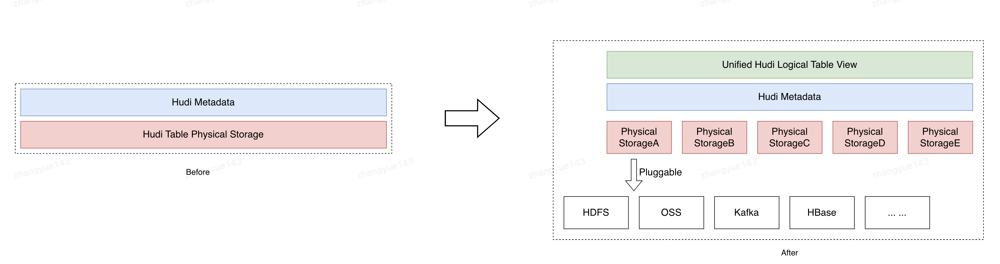
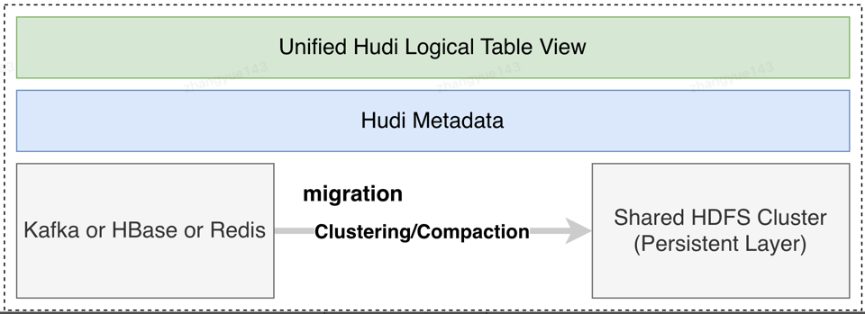
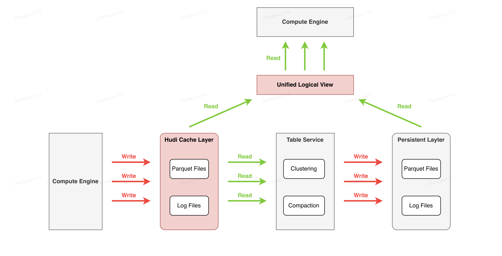

<!--
  Licensed to the Apache Software Foundation (ASF) under one or more
  contributor license agreements.  See the NOTICE file distributed with
  this work for additional information regarding copyright ownership.
  The ASF licenses this file to You under the Apache License, Version 2.0
  (the "License"); you may not use this file except in compliance with
  the License.  You may obtain a copy of the License at

       http://www.apache.org/licenses/LICENSE-2.0

  Unless required by applicable law or agreed to in writing, software
  distributed under the License is distributed on an "AS IS" BASIS,
  WITHOUT WARRANTIES OR CONDITIONS OF ANY KIND, either express or implied.
  See the License for the specific language governing permissions and
  limitations under the License.
-->

# RFC-60: Federated Storage Layout

## Proposers
- @zhangyue19921010
- @CTTY
- @umehrot2

## Approvers
- @vinoth
- @shivnarayan
- @yihua

## Status

JIRA: [https://issues.apache.org/jira/browse/HUDI-3625](https://issues.apache.org/jira/browse/HUDI-3625)

## Abstract
In this RFC, we will support the Federated Storage Layout for Hudi tables, enabling Hudi to support multiple pluggable physical 
storage systems. By combining Hudi's own metadata, we can construct logical table views and expose these views externally,
making them transparent to the engine.



After implementing the Hudi Federated Storage Layout, we can develop many interesting new features for Hudi lake tables based on this, such as:

### Object Store Optimized Layout
As you scale your Apache Hudi workloads over cloud object stores like Amazon S3, there is potential of hitting request
throttling limits which in-turn impacts performance. In this RFC, we are proposing to support an alternate storage
layout that is optimized for Amazon S3 and other cloud object stores, which helps achieve maximum throughput and
significantly reduce throttling.


### Hudi Storage Cache Layer
The Hudi lake table data cache layer involves dividing the lake table physical storage into a high-performance HDFS-based data 
cache layer and a shared HDFS-based data persistence layer. Hot data is initially written to the cache layer and later moved to 
the persistence layer through table services like Compaction and Clustering. This approach meets the strong demands for performance 
and stability in scenarios involving massive data ingestion into the lake. It is important to note that once data is written to the 
cache layer and committed, it becomes visible to downstream consumers, regardless of when the subsequent "moving operations" start 
or finish, ensuring data visibility and timeliness are unaffected. Additionally, since the data movement from the cache layer to 
the persistence layer leverages the lake table's own Compaction and Clustering table service capabilities, this process adheres to 
the lake table's commit mechanism and MVCC snapshot isolation design. Therefore, with the data cache layer enabled, the lake table 
maintains atomicity, transactional guarantees, and Exactly Once semantics.


### Hudi Table Second-Level Latency
Before, when data is ingested into the lake, it is first written to data files and metadata, and only becomes visible after the transaction 
is successfully committed. Since writing data files is relatively slow, it typically involves minute-level commits. Here, the capabilities 
of the Federated Storage Layout can be extended by writing data to high-speed storage systems like Kafka, HBase, or Redis, and recording 
metadata such as offsets or keys in the lake table's metadata. During reads, the content from both persistent storage and high-speed storage 
can be combined, enabling Hudi to achieve second-level latency.

Case 3 is another implementation of the Federated Storage Layout, rather than just a concept of a caching layer. In Case 3, we effectively 
use Kafka as a log storage (since both follow an append-only model like avro) and implement a complete set of HoodieKafkaLogScanner and corresponding 
Compactor. Regarding data visibility in Case 3, the data should be visible externally as soon as it enters Kafka, without a strong dependency on 
Compaction/Clustering operations. For the query side, it will return a union of data from Kafka and the base files. Of course, it also needs to provide 
the capability to read/stream Kafka logs in a read-only manner. In summary, this approach aims to achieve second-level latency and visibility for lake tables 
based on the Hudi Federated Storage Layout.

In addition, we are proposing an interface that would allow users to implement their own custom strategy to allow them
to distribute the data files across cloud stores, hdfs or on prem based on their specific use-cases.



## Background

Apache Hudi follows the traditional Hive storage layout while writing files on storage:
- Partitioned Tables: The files are distributed across multiple physical partition folders, under the table's base path.
- Non Partitioned Tables: The files are stored directly under the table's base path.

However, this design still has some limitations in certain situations. For example original design increases the probability of hitting request throttle limits when
working with cloud object stores like Amazon S3 and others. This is because Amazon S3 and other cloud stores [throttle
requests based on object prefix](https://aws.amazon.com/premiumsupport/knowledge-center/s3-request-limit-avoid-throttling/).
Amazon S3 does scale based on request patterns for different prefixes and adds internal partitions (with their own request limits),
but there can be a 30 - 60 minute wait time before new partitions are created. Thus, all files/objects stored under the
same table path prefix could result in these request limits being hit for the table prefix, specially as workloads
scale, and there are several thousands of files being written/updated concurrently. This hurts performance due to
re-trying of failed requests affecting throughput, and result in occasional failures if the retries are not able to
succeed either and continue to be throttled. Note an exception would be non-partitioned tables 
reside directly under S3 buckets (using S3 buckets as their table paths), and those tables would be free
from the throttling problem. However, this exception cannot invalidate the necessity of addressing the throttling 
problem for partitioned tables.

The traditional storage layout also tightly couples the partitions as folders under the table path. However,
some users want flexibility to be able to distribute files/partitions under multiple different paths across cloud stores,
hdfs etc. based on their specific needs. For example, customers have use cases to distribute files for each partition under
a separate S3 bucket with its individual encryption key. It is not possible to implement such use-cases with Hudi currently.

The high level proposal here is to introduce object store storage strategy, where all files are distributed evenly across
multiple randomly generated prefixes under the Amazon S3 bucket, instead of being stored under a common table path/prefix.
This would help distribute the requests evenly across different prefixes, resulting in Amazon S3 creating partitions for
the prefixes each with its own request limit. This significantly reduces the possibility of hitting the request limit
for a specific prefix/partition.

In addition, we want to expose an interface that provides users the flexibility to implement their own strategy for
distributing files if using the traditional Hive storage strategy or federated storage strategy (proposed in this RFC) does
not meet their use-case.

## Design

### Config
We will add two table-level parameters, namely Hoodie Table Config:

The first one, `hoodie.storage.path` allows users to specify additional physical storage locations apart from the Base Path, separated by commas if there are multiple.

The second one, `hoodie.storage.strategy.class` allows users to specify the storage strategy for the current Hudi table, such as 
HoodieDefaultStorageStrategy (default), HoodieCacheLayerStorageStrategy, and HoodieObjectStorageStrategy.
Take HoodieCacheLayerStorageStrategy as example, related table config should like this
```text
[sss@ssss ~]$ hdfs dfs -cat hdfs://nsxxx/user/jdr_lakehouse/gdm.db/xxx/.hoodie/hoodie.properties
#Updated at 2024-08-07T11:49:10.252Z
#Wed Aug 07 19:49:10 CST 2024
hoodie.table.keygenerator.class=org.apache.hudi.keygen.ComplexAvroKeyGenerator
hoodie.table.precombine.field=receive_ts
hoodie.table.version=5
hoodie.datasource.write.hive_style_partitioning=true
hoodie.table.checksum=318067208
hoodie.table.create.schema={xxxx}
hoodie.table.cdc.enabled=false
hoodie.archivelog.folder=archived
hoodie.table.name=xxxx
hoodie.table.type=COPY_ON_WRITE
hoodie.datasource.write.partitionpath.urlencode=false
hoodie.datasource.write.drop.partition.columns=false
hoodie.timeline.layout.version=1
hoodie.table.recordkey.fields=mid,dt
hoodie.table.partition.fields=dt,application,business
hoodie.storage.path=hdfs\://nsxxxx/user/jdr_lakehouse/jdr_lakehouse_traffic/gdm.db/gdm_jdr_xxxxx
hoodie.storage.strategy.class=org.apache.hudi.common.storage.HoodieCacheLayerStorageStrategy
```


### Core Abstraction

```java
/**
 * Interface for providing storage file locations.
 */
public interface HoodieStorageStrategy extends Serializable {
  /**
   * Return a storage location for the given path
   *
   * @param path
   * @param instantTime
   * @param fileID
   * @return Append the appropriate prefix based on the Path and return
   */
  StoragePath storageLocation(String path, String instantTime, String fileID);

  /**
   * Return all possible StoragePaths
   *
   * @param partitionPath
   * @param checkExist check if StoragePath is truly existed or not. 
   * @return a st of storage partition path
   */
  Set<StoragePath> getAllLocations(String partitionPath, boolean checkExist);

  /**
   * Return RelativePath base on path and locations.
   *
   * @param path
   * @return relative path
   */
  StoragePath getRelativePath(Path path);
}
```

### Case1: Generating File Paths for Object Store Optimized Layout

We want to distribute files evenly across multiple random prefixes, instead of following the traditional Hive storage
layout of keeping them under a common table path/prefix. In addition to the `Hoodie Base Path`, for this new layout user will
configure another `Table Storage Path` using config `hoodie.storage.path` under which the actual data files will be distributed. The original `Table Path` will
be used to maintain the table/partitions Hudi metadata.

For the purpose of this documentation let's assume:
```
Table Path => s3://<table_bucket>/<hudi_table_name>/

Table Storage Path => s3://<table_storage_bucket>/
```
`Table Storage Path` should be a top-level bucket instead of a prefix under the bucket for the best results.
So that we can avoid multiple tables sharing the prefix causing throttling.

We will use a Hashing function on the `Partition Path/File ID` to map them to a prefix generated under `Table Storage Path`:
```
// Hashing on the file ID makes sure that base file and its log files fall under the same folder

s3://<table_storage_bucket>/<hash_prefix>/..
```

In addition, under the hash prefix we will follow a folder structure by appending Hudi Table Name and Partition. This
folder structuring would be useful if we ever have to do a file system listing to re-create the metadata file list for
the table (discussed more in the next section). Here is how the final layout would look like for `partitioned` tables:
```
s3://<table_storage_bucket>/01f50736/<hudi_table_name>/country=usa/075f3295-def8-4a42-a927-07fd2dd2976c-0_7-11-49_20220301005056692.parquet
s3://<table_storage_bucket>/01f50736/<hudi_table_name>/country=india/4b0c6b40-2ac0-4a1c-a26f-6338aa4db22e-0_6-11-48_20220301005056692.parquet
s3://<table_storage_bucket>/01f50736/<hudi_table_name>/country=india/.9320889c-8537-4aa7-a63e-ef088b9a21ce-0_9-11-51_20220301005056692.log.1_0-22-26
...
s3://<table_storage_bucket>/0bfb3d6e/<hudi_table_name>/country=india/9320889c-8537-4aa7-a63e-ef088b9a21ce-0_9-11-51_20220301005056692.parquet
s3://<table_storage_bucket>/0bfb3d6e/<hudi_table_name>/country=uk/a62aa56b-d55e-4a2b-88a6-d603ef26775c-0_8-11-50_20220301005056692.parquet
s3://<table_storage_bucket>/0bfb3d6e/<hudi_table_name>/country=india/.4b0c6b40-2ac0-4a1c-a26f-6338aa4db22e-0_6-11-48_20220301005056692.log.1_0-22-26
s3://<table_storage_bucket>/0bfb3d6e/<hudi_table_name>/country=usa/.075f3295-def8-4a42-a927-07fd2dd2976c-0_7-11-49_20220301005056692.log.1_0-22-26
...
```
For `non-partitioned` tables, this is how it would look:
```
s3://<table_storage_bucket>/01f50736/<hudi_table_name>/075f3295-def8-4a42-a927-07fd2dd2976c-0_7-11-49_20220301005056692.parquet
s3://<table_storage_bucket>/01f50736/<hudi_table_name>/4b0c6b40-2ac0-4a1c-a26f-6338aa4db22e-0_6-11-48_20220301005056692.parquet
s3://<table_storage_bucket>/01f50736/<hudi_table_name>/.9320889c-8537-4aa7-a63e-ef088b9a21ce-0_9-11-51_20220301005056692.log.1_0-22-26
...
s3://<table_storage_bucket>/0bfb3d6e/<hudi_table_name>/9320889c-8537-4aa7-a63e-ef088b9a21ce-0_9-11-51_20220301005056692.parquet
s3://<table_storage_bucket>/0bfb3d6e/<hudi_table_name>/a62aa56b-d55e-4a2b-88a6-d603ef26775c-0_8-11-50_20220301005056692.parquet
s3://<table_storage_bucket>/0bfb3d6e/<hudi_table_name>/.4b0c6b40-2ac0-4a1c-a26f-6338aa4db22e-0_6-11-48_20220301005056692.log.1_0-22-26
s3://<table_storage_bucket>/0bfb3d6e/<hudi_table_name>/.075f3295-def8-4a42-a927-07fd2dd2976c-0_7-11-49_20220301005056692.log.1_0-22-26
...
```

Storage strategy would append proper prefix based on input relative path abd return as StoragePath. In the above example,
the storage location is `s3://<table_storage_bucket>/` (hoodie.storage.path),
We first calculate the hash value based on the partition and file ID, then concatenate the final StoragePath in the format of 
`prefix/hash/tablename/partition`. 

In another word, users would only be able to customize upper-level folder structure (storage location).
Having a fixed lower-level folder structure would be beneficial because:
- It's much more intuitive in case someone needs to check data files
- Easier to figure out where the data is when Hudi needs to fall back on file listing

Storage strategy would be persisted in the table config (`.hoodie/hoodie.properties`), and the strategy for 
metadata table would be always set to default. So the original table path will continue to store 
the `metadata folder` and `partition metadata` files:
```
s3://<table_bucket>/<hudi_table_name>/.hoodie/...
s3://<table_bucket>/<hudi_table_name>/country=usa/.hoodie_partition_metadata
s3://<table_bucket>/<hudi_table_name>/country=india/.hoodie_partition_metadata
s3://<table_bucket>/<hudi_table_name>/country=uk/.hoodie_partition_metadata
...
```

#### Hashing

We can re-use the implementations of `HashID` class to generate hashes on `File ID` or `Partition + File ID`, which
uses XX hash function with 32/64 bits (known for being fast).

The hashing function should be made user configurable for use cases like bucketing or dynamic 
sub-partitioning/re-hash to reduce the number of hash prefixes. Having too many unique hash prefixes
would make files too dispersed, and affect performance on other operations such as listing.

### Case2: Hudi Storage Cache Layer

The cache layer of a lake table is a specific implementation scenario for Federated Storage Layout in hudi tables. 
It divides the physical storage of the lake table into a high-performance HDFS-based cache layer and a shared HDFS-based persistent layer. 
Hot data is first written to the cache layer and later moved to the persistent layer through table services like Compaction and Clustering. 
This setup addresses the strong demands for performance and stability in scenarios involving massive data ingestion into the lake. 
It is important to note that once data is written to the cache layer and committed, it becomes visible to downstream processes, regardless of when 
the "relocation work" starts or finishes. Additionally, since the data relocation from the cache layer to the persistent layer leverages the lake table's 
own Compaction and Clustering capabilities, this process adheres to the lake table's commit mechanism and MVCC snapshot isolation design. Therefore, 
after enabling the cache layer, the lake table maintains atomicity, transactional guarantees, and Exactly Once semantics.

Below is a comparison between the normal read/write process of a lake table and the process after enabling the lake table cache layer. 
Green arrows indicate data reads, and red arrows indicate data writes. Before enabling the cache layer, the compute engine directly writes 
data to the shared HDFS and commits, including Parquet base files, log files, and metadata files. The compute engine queries the lake table 
by directly reading data from the shared HDFS. Additionally, the lake table services for Clustering and Compaction also directly query data from 
the shared HDFS, process it, and write it back to the shared HDFS. After enabling the lake table cache layer, the compute engine first writes hot 
data to the high-performance HDFS and commits, including Parquet files and log files. During queries, a unified logical view of both the cache layer 
and the persistent layer is constructed to meet query demands. The Clustering and Compaction table services, while performing regular lake table file 
organization, also facilitate data relocation from the cache layer to the persistent layer. Notably, regardless of when Clustering and Compaction jobs 
start or finish, the data visible to downstream processes is always complete and timely.

Original Read/Write workflow


Read/Write workflow with hudi cache layer enabled


#### HoodieCacheLayerStorageStrategy
Based on the HoodieActiveTimeline and the current write instant, determine the specific write path. For common commit operations 
in COW (Copy on Write) tables and delta commit operations in MOR (Merge on Read) tables, we generate a CacheLayer-related Storage 
Path to write/read. This type of I/O is targeted at the cache layer.

As for commit action in mor table and replace commit in cow table, we will generate a persistent Storage Path which will let 
Compaction/Clustering do the data migration works from cache layer to persistent layer

Note: It is required that Clustering is enabled for COW tables and Compaction is enabled for MOR tables; otherwise, there is a 
risk of storage overflow in the cache layer.

```java
/**
 * When using Storage Cache Layer make sure that table service is enabled :
 * 1. MOR + Upsert + Compaction
 * 2. COW + Insert + Clustering
 */
public class HoodieCacheLayerStorageStrategy extends HoodieDefaultStorageStrategy {
  
  public HoodieCacheLayerStorageStrategy(String basePath,
                                         String storagePath,
                                         Option<HoodieTableMetaClient> metaClient) {
    // init
  }

  /**
   * Generate StoragePath based on active instant time
   * for common write instant :
   * 1. commit for cow table 
   * 2. delta commit for mor table
   * We will generate a CacheLayer related Storage Path to write/read
   * 
   * As for commit action in mor table and replace commit in cow table,
   * we will generate a persistent Storage Path which will let Compaction/Clustering
   * do the data migration works from cache layer to persistent layer
   */
  @Override
  public StoragePath storageLocation(String path, String instantTime, String fileID) {
    // 
  }

  @Override
  public Set<Path> getAllLocations(String partitionPath, boolean checkExist) {
    // 
  }

  @Override
  public String getRelativePath(Path path) {
    // getRelativePath
  }
}
```


### Maintaining Mapping to Files with Metadata Table

In [RFC-15](https://cwiki.apache.org/confluence/pages/viewpage.action?pageId=147427331), we introduced an internal
Metadata Table with a `files` partition that maintains mapping from partitions to list of files in the partition stored
under `Table Path`. This mapping is kept up to date, as operations are performed on the original table. We will leverage
the same to now maintain mappings to files stored at `Table Storage Path` under different prefixes.

Here are some of the design considerations:

1. Metadata table is not an optional optimization but a pre-requisite for federated storage to work. 
Since Hudi 0.11 we have enabled metadata table by default and hence this feature can be enabled by
the users as long as they are not explicitly turning off metadata table, in which case we should throw an exception.

2. Existing tables cannot switch storage strategy without being re-bootstrapped with the new strategy.

3. The Instant metadata (`HoodieCommitMetadata`,`HoodieCleanMetadata` etc.) will always act as the source of file listing
for metadata table to be populated.

4. If there is an error reading from Metadata table, we will not fall back listing from file system.

After enabling the Federated Storage Layout feature, under certain strategies such as the "data cache layer," 
data from different lake tables may be stored on different physical media, resulting in different schemes. 
For example, cache layer data may be stored on hdfs://ns1/, while persistent layer data is stored on hdfs://ns2/. 
In this case, we need to add a new field named "prefix" in MDT HoodieMetadataFileInfo to store the prefix information for different files, 
which will be used for path restoration.

```avro schema
        {
            "doc": "Contains information about partitions and files within the dataset",
            "name": "filesystemMetadata",
            "type": [
                "null",
                {
                    "type": "map",
                    "values": {
                        "type": "record",
                        "name": "HoodieMetadataFileInfo",
                        "fields": [
                            {
                                "name": "size",
                                "type": "long",
                                "doc": "Size of the file"
                            },
                            {
                                "name": "isDeleted",
                                "type": "boolean",
                                "doc": "True if this file has been deleted"
                            },
                            {
                                "name":"prefix",
                                "type": ["null","string"],
                                "default":null,
                                "doc": "prefix for current file, for example hdfs://ns2002:8020/ or s3a://bucket/"
                            }
                        ]
                    }
                }
            ]
        }
```

Note: For lake tables that do not have the Federated Storage Layout enabled, the value of this "scheme" field will be null.

### Integration
This section mainly describes how storage strategy is integrated with other components and how read/write
would look like from Hudi side with Federated Storage Layout.

We already have the abstractions HoodieStorage, StoragePath, and HoodieWrapperFileSystem. Here, we need to add a 
HoodieStorageStrategy member variable to HoodieStorage. This will allow HoodieStorage to generate the corresponding 
StoragePath based on different strategies. Subsequent operations, such as HoodieCreateHandle, can directly work with 
the modified StoragePath, thus remaining transparent to the subsequent code logic.

For HoodieWrapperFileSystem, after enabling the Federated Storage Layout feature, a single HoodieWrapperFileSystem 
instance will handle file objects with different schemes. Therefore, we need to cache the inner file systems corresponding 
to different schemes within HoodieWrapperFileSystem. When necessary, the correct inner file system object can be retrieved 
from the cache based on the input path scheme.
Using HoodieCreateHandle as an example.


When conducting a read operation it is quite simple, Hudi would: 
1. Get relative partitions, file names and related scheme(new recorded in this rfc) from MDT.
2. Build new full path based on informations mentioned in 1.
3. Keep the remaining operations unchanged.

### Repair Tool
In case of metadata table getting corrupted or lost, we need to have a solution here to reconstruct metadata table
from the files that are distributed using federated storage. We will need a repair tool 
to get all the partition to files mapping by listing all the prefixes under the `Table Storage Path` 
and then reconstruct metadata table.

In Hudi we already have `HoodieBackedTableMetadataWriter` to list existing data files to initialize/construct
metadata table. We can extract the logic of listing files and get partition info to a new method `getPartitionInfo`, 
and then extend `HoodieBackedTableMetadataWriter` and override `getPartitionInfo` so
for repair tool it can list data files stored under storage path instead of table path.

```java
 public class StorageRepairMetadataWriter extends SparkHoodieBackedTableMetadataWriter {
    <T extends SpecificRecordBase> StorageRepairMetadataWriter(Configuration hadoopConf,
                                                               HoodieWriteConfig writeConfig,
                                                               HoodieEngineContext engineContext,
                                                               Option<String> inflightInstantTimestamp) {
      super(hadoopConf, writeConfig, HoodieFailedWritesCleaningPolicy.EAGER, engineContext, inflightInstantTimestamp);
    }

    @Override
    protected Map<String, Map<String, Long>> getPartitionToFilesMap() {
      return listFilesUnderStoragePath();
    }
  }
```

### Query Engine Side Integration

Spark, Hive, [Presto](https://github.com/prestodb/presto/commit/ef1fd25c582631513ccdd097e0a654cda44ec3dc), 
and [Trino](https://github.com/trinodb/trino/pull/10228) are already integrated to use metadata based listing.
In general, since these query engines are able to use Hudi's metadata table there should ideally be 
no changes required in terms of making them work with federated storage. Here are some considerations:

- Spark DataSource and Spark SQL queries have been integrated with metadata based listing via the Hudi's custom implementation
of Spark's FileIndex interface. However, if Spark DataSource queries are used with globbed paths then the FileIndex path
does not kick in, and it would rely on Spark's `InMemoryFileIndex` to do the file listing with Hudi's path filter applied. Thus,
these Spark DataSource queries with globbed paths would not work with federated storage.

- Query engines should be able to determine that federated storage is configured, and rely on metadata to list files. It
should not be user's responsibility to enable metadata listing from query engines side.

- We need to ensure that partition pruning continues to work for the query engines.

#### Hive Integration With Federated Storage Layout Enable
When integrating Hudi with Hive through custom InputFormat and OutputFormat, the following three issues arise in practical use:
Firstly, When processing splits, the basePath of the table is obtained by extracting segments from the path. This method is used to retrieve objects like 
HoodieTableConfig and HoodieTableMetaClient. However, the path of Federated Storage Layout files cannot be used to derive the basePath of the table through segmentation.

Secondly, For Hive native tables, when returning partition paths, if there are only log files under the partition path, Hive will ignore that 
partition path (as log files are hidden files).

Finally, When using Hudi tables in Hive, it is necessary to first specify the input format, 
e.g., by setting hive.input.format=org.apache.hadoop.hive.ql.io.HiveInputFormat; or set hive.input.format=org.apache.hudi.hadoop.hive.HoodieCombineHiveInputFormat;, 
which affects user experience.


To address the issues mentioned above, the Hive StorageHandler interface was implemented to transform the table into a non-native table:

Firstly, in the configureInputJobProperties and configureOutputJobProperties methods of the StorageHandler, tableName and basePath information 
is retrieved and injected into the JobConf.

Secondly, extract HoodieInputSplit as the parent class for various Hudi inputSplits, providing tableName and basePath as member variables.

Thirdly, in the getSplits method of Hudi's base class InputFormat (HoodieParquetInputFormatBase), retrieve tableName and basePath from 
JobConf and inject them into HoodieInputSplit.

Finally, When creating tables in Spark, Flink, or during HiveSync, control the activation of the StorageHandler feature with the switch 
parameter hoodie.datasource.hive_sync.storage_handler.enabled, which is disabled by default.

Note that when hoodie.datasource.hive_sync.storage_handler.enabled is enabled, you must also set hoodie.datasource.hive_sync.mode to hms.

### Future Work

- We need a tool to bootstrap existing Hudi table to switch to another storage strategy.
- Partition-level storage strategy: Each partition can have its own storage strategy for users to have
finer grasp on how data is stored. It would also make new storage strategies more accessible for
existing Hudi tables as they would only need to re-construct the metadata table.
- Achieving second-level latency for lake tables