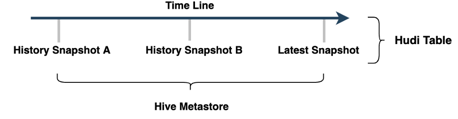
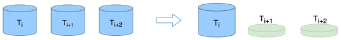

<!--
  Licensed to the Apache Software Foundation (ASF) under one or more
  contributor license agreements.  See the NOTICE file distributed with
  this work for additional information regarding copyright ownership.
  The ASF licenses this file to You under the Apache License, Version 2.0
  (the "License"); you may not use this file except in compliance with
  the License.  You may obtain a copy of the License at

       http://www.apache.org/licenses/LICENSE-2.0

  Unless required by applicable law or agreed to in writing, software
  distributed under the License is distributed on an "AS IS" BASIS,
  WITHOUT WARRANTIES OR CONDITIONS OF ANY KIND, either express or implied.
  See the License for the specific language governing permissions and
  limitations under the License.
-->
# RFC-61: Snapshot view management

## Proposers

- @<proposer1 @fengjian428>

## Approvers
 - @<approver1 @xushiyan>
 - @<approver2 github username>

## Status

JIRA: [HUDI-4677](https://issues.apache.org/jira/browse/HUDI-4677)

> Please keep the status updated in `rfc/README.md`.

## Abstract

For the snapshot view scenario, Hudi already provides two key features to support it:
* Time travel: user provides a timestamp to query a specific snapshot view of a Hudi table
* Savepoint/restore: "savepoint" saves the table as of the commit time so that it lets you restore the table to this savepoint at a later point in time if need be.
but in this case, the user usually uses this to prevent cleaning snapshot view at a specific timestamp, hence, only clean unused files
The situation is there some inconvenience for users if use them directly

Usually users incline to use a meaningful name instead of querying Hudi table with a timestamp, using the timestamp in SQL may lead to the wrong snapshot view being used. 
for example, we can announce that a new tag of hudi table with table_nameYYYYMMDD was released, then the user can use this new table name to query.
Savepoint is not designed for this "snapshot view" scenario in the beginning, it is designed for disaster recovery. 
let's say a new snapshot view will be created every day, and it has 7 days retention, we should support lifecycle management on top of it.
What this RFC plan to do is to let Hudi support release a snapshot view and lifecycle management out-of-box.

## Background
Introduce any much background context which is relevant or necessary to understand the feature and design choices.
typical scenarios and benefits of snapshot view:
1. Basic idea:

Create Snapshot view based on Hudi Savepoint
    * Create Snapshot views periodically by time(date time/processing time)
    * Use HMS to store view metadata
   
Build periodic snapshots based on the time period required by the user
These Shapshots are stored as partitions in the metadata management system
Users can easily use SQL to access this data in Flink Spark or Presto.
Because the data store is complete and has no merged details,
So the data itself is to support the full amount of data calculation, also support incremental processing

2. Compare to Hive solution

The Snapshot view is created based on Hudi Savepoint, which significantly reduces the data storage space of some large tables
    * The space usage becomes (1 + (t-1) * p)/t
    * Incremental use reduces the amount of data involved in the calculation

When using snapshot view storage, for some scenarios where the proportion of changing data is not large, a better storage saving effect will be achieved
We have a simple formula here to calculate the effect
P indicates the proportion of changed data, and t indicates the number of time periods to be saved
The lower the percentage of changing data, the better the storage savings
So There is also a good savings for long periods of data

At the same time, it has benefit for incremental computing resource saving

3. Typical scenarios 
    * Time travel for a long time in a convenience way
    * More flexible pipeline schedule&execution
   
## Implementation
Describe the new thing you want to do in appropriate detail, how it fits into the project architecture. 
Provide a detailed description of how you intend to implement this feature.This may be fairly extensive and have large subsections of its own. 
Or it may be a few sentences. Use judgement based on the scope of the change.

## Rollout/Adoption Plan

 - What impact (if any) will there be on existing users? 
 - If we are changing behavior how will we phase out the older behavior?
 - If we need special migration tools, describe them here.
 - When will we remove the existing behavior

## Test Plan

Describe in few sentences how the RFC will be tested. How will we know that the implementation works as expected? How will we know nothing broke?.